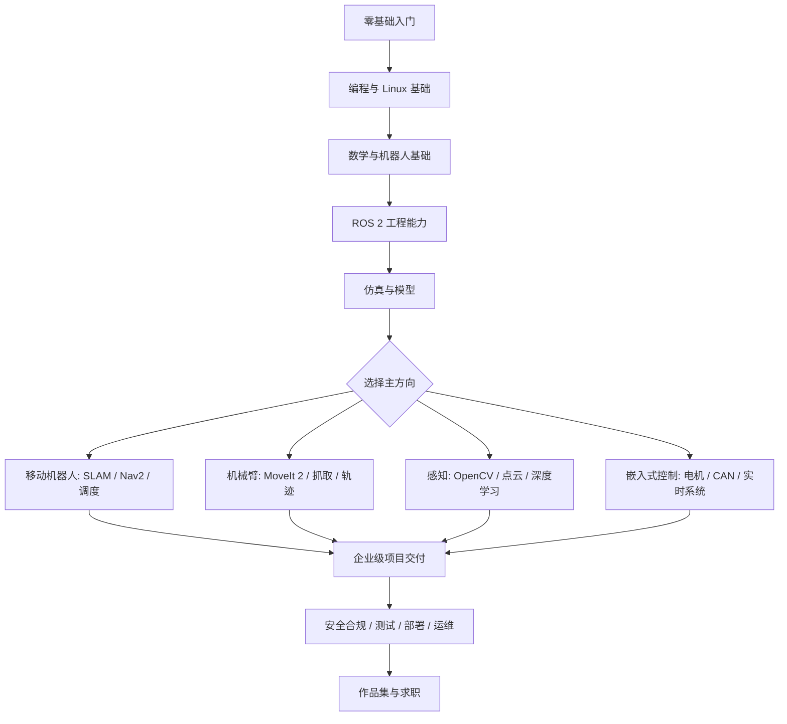

# 机器人转行与企业级项目学习路线

> 适合对象：完全没有机器人学基础，但希望最终能完成企业级机器人项目，或转行成为机器人工程师的人。  
> Last researched: 2026-06-14  
> 建议主线：先做“能跑起来的机器人系统”，再补数学与控制理论。不要一开始陷入纯理论，也不要只会调 ROS 包。

## 1. 先理解机器人岗位到底在做什么

机器人工程师不是一个单一岗位。企业项目通常由多个方向协作完成：

| 方向 | 主要工作 | 典型技术 |
|---|---|---|
| 机器人软件工程师 | ROS 2 节点、通信、状态机、任务调度、设备接入、部署 | C++、Python、ROS 2、Linux、Docker |
| 感知工程师 | 摄像头、雷达、点云、目标检测、定位输入 | OpenCV、PCL/Open3D、深度学习、传感器标定 |
| 定位与导航工程师 | 建图、定位、路径规划、避障、导航调参 | SLAM、Nav2、TF、代价地图、行为树 |
| 机械臂/运动控制工程师 | 机械臂建模、运动规划、轨迹执行、夹爪控制 | MoveIt 2、URDF、运动学、动力学、控制 |
| 嵌入式/底盘工程师 | 电机、驱动器、传感器、实时控制、通信协议 | MCU、CAN、EtherCAT、RTOS、PID |
| 仿真与测试工程师 | 数字孪生、仿真场景、自动化测试、回归验证 | Gazebo、Isaac Sim、CI、日志与可观测性 |
| 系统集成/现场工程师 | 设备调试、网络、部署、故障定位、客户场景适配 | Linux、网络、脚本、日志、硬件调试 |

如果你是零基础转行，最稳的路线是先成为“ROS 2 机器人软件工程师”，再向导航、机械臂、感知或嵌入式方向深入。

## 2. 总体学习导图



## 3. 阶段路线

### 阶段 0：搭环境与建立直觉，1-2 周

目标不是学完理论，而是让你知道机器人系统长什么样。

必须完成：

- 安装 Ubuntu 或 WSL2 + Ubuntu，熟悉终端、文件系统、进程、网络。
- 学会 Git、VS Code、CMake 基础。
- 安装 ROS 2。当前更适合长期学习和企业项目的稳定版本是 ROS 2 Jazzy Jalisco，因为它是 LTS 版本，官方支持周期到 2029 年；ROS 2 Kilted Kaiju 是 2025 年发布的非 LTS 版本，适合跟进新特性。
- 跑通 ROS 2 官方 beginner tutorials：节点、topic、service、action、parameter、launch。

你要能回答：

- 一个机器人系统为什么会拆成多个节点？
- topic、service、action 分别适合什么通信场景？
- TF 坐标树为什么重要？
- launch 文件和参数文件如何让系统可部署？

### 阶段 1：编程、Linux、工程基础，1-2 个月

机器人项目对工程能力要求很高。很多现场问题不是算法错，而是进程、网络、依赖、时间同步、日志和部署出了问题。

#### Python

掌握：

- 基本语法、面向对象、类型标注、异常处理。
- NumPy、Matplotlib、OpenCV Python 基础。
- ROS 2 Python 节点写法。
- 简单脚本自动化：处理日志、批量转换数据、画曲线。

练习：

- 写一个读取传感器模拟数据并发布 ROS 2 topic 的节点。
- 写一个订阅里程计并保存 CSV 的日志工具。

#### C++

掌握：

- C++17 基础、类、智能指针、引用、移动语义的基本概念。
- CMake、colcon、ament。
- ROS 2 C++ 节点、callback、timer、executor。

练习：

- 用 C++ 写一个 `/cmd_vel` 速度限幅节点。
- 写一个 action server，模拟机器人执行“移动到目标点”的长任务。

#### Linux 与网络

掌握：

- systemd、SSH、环境变量、权限、串口设备。
- TCP/UDP、IP、端口、防火墙、时间同步。
- Docker 基础，理解镜像、容器、volume、network。

企业项目常见问题：

- ROS_DOMAIN_ID 冲突导致串网。
- 多机通信发现不了节点。
- 时间戳不同步导致 TF extrapolation error。
- 串口权限、udev 规则、设备名漂移。

### 阶段 2：机器人学理论知识体系，3-6 个月，和实践并行

机器人学理论不要按“数学课本顺序”学，而要按机器人系统会遇到的问题学：机器人在哪里、姿态是什么、如何运动、如何感知、如何估计状态、如何规划、如何控制、如何验证安全。下面是更完整的理论路线。

#### 2.1 先修数学：只学机器人真正会用到的部分

| 理论 | 学什么 | 为什么学 | 最低掌握标准 |
|---|---|---|---|
| 线性代数 | 向量、矩阵、矩阵乘法、逆矩阵、特征值、SVD | 坐标变换、点云、状态估计、优化都依赖矩阵 | 能看懂 `R * p + t`，知道矩阵维度是否匹配 |
| 微积分 | 导数、偏导、链式法则、梯度、雅可比 | 速度、加速度、误差传播、优化、控制 | 能理解“位姿变化对误差的影响” |
| 概率统计 | 高斯分布、协方差、条件概率、贝叶斯公式 | 传感器有噪声，定位和 SLAM 都是概率问题 | 能解释均值、方差、协方差矩阵的意义 |
| 数值优化 | 最小二乘、梯度下降、非线性优化 | SLAM、标定、轨迹优化、视觉位姿估计 | 能把“让误差最小”写成目标函数 |
| 基础物理 | 牛顿定律、力、力矩、惯量、摩擦 | 动力学、控制、仿真参数、机械臂负载 | 能判断运动失败是控制问题还是物理约束问题 |

配套练习：

- 用 Python/NumPy 实现 2D 点绕原点旋转和平移。
- 给一组带噪声的点拟合一条直线，理解最小二乘。
- 画出高斯分布和协方差椭圆，理解“定位不确定性”。

#### 2.2 刚体运动与坐标变换：机器人学第一核心

这是 ROS 2 TF、机械臂、SLAM、视觉标定的共同基础。

必须学习：

- 坐标系：世界坐标系、机器人坐标系、传感器坐标系、末端执行器坐标系。
- 位姿：位置 + 姿态。
- 旋转表示：旋转矩阵、欧拉角、四元数、轴角。
- 齐次变换矩阵：把旋转和平移合成一个 4x4 矩阵。
- 变换链：`map -> odom -> base_link -> camera_link`。
- 逆变换：从 A 看 B 和从 B 看 A 的关系。
- SE(2)、SE(3)：2D/3D 刚体运动空间，先知道概念即可。

最低掌握标准：

- 能画出机器人底盘、雷达、相机之间的坐标关系。
- 能解释一个点从相机坐标系变换到底盘坐标系的过程。
- 能排查 TF 方向写反导致的可视化或导航错误。

配套练习：

- 手写一个 2D 坐标变换函数。
- 在 ROS 2 中发布一个静态 TF，把 `camera_link` 挂到 `base_link`。
- 用 RViz 验证坐标轴方向是否正确。

#### 2.3 移动机器人运动学：底盘如何移动

移动机器人先学运动学，不急着学复杂动力学。

必须学习：

- 差速底盘模型：左右轮速度如何决定线速度和角速度。
- 阿克曼转向模型：汽车式机器人为什么不能原地旋转。
- 全向/麦克纳姆模型：轮速如何合成底盘速度。
- 里程计：由轮速积分得到位姿。
- 非完整约束：很多底盘不能横向平移。

最低掌握标准：

- 能从 `/cmd_vel` 推导左右轮速度。
- 知道轮速计里程计为什么会漂移。
- 能解释差速、阿克曼、全向底盘适合什么场景。

配套练习：

- 写一个差速底盘运动学仿真：输入左右轮速度，输出机器人轨迹。
- 给定目标点，写一个简单 pure pursuit 或 proportional controller 让机器人追踪目标。
- 对比“理想里程计”和“带噪声里程计”的轨迹差异。

#### 2.4 机械臂运动学：机械臂如何到达目标位姿

如果走机械臂方向，这部分是核心；如果走移动机器人方向，也建议至少理解基础。

必须学习：

- 连杆、关节、自由度。
- 正运动学：已知关节角，求末端位姿。
- 逆运动学：已知末端目标位姿，求关节角。
- DH 参数：传统机械臂建模方法，实际项目也常见。
- 雅可比矩阵：关节速度和末端速度之间的关系。
- 奇异位形：某些姿态下机械臂失去某些运动能力。
- 工作空间：机械臂能到达的区域。

最低掌握标准：

- 能解释正运动学和逆运动学的区别。
- 能读懂一个简单 2 连杆机械臂的几何关系。
- 知道为什么机械臂规划要做碰撞检测和关节限位检查。

配套练习：

- 手推并写代码实现 2D 二连杆机械臂正/逆运动学。
- 画出二连杆机械臂工作空间。
- 在 MoveIt 2 中观察同一个末端目标可能对应多组关节解。

#### 2.5 动力学：力、力矩和加速度的关系

动力学比运动学更难，零基础不需要一开始深入公式，但要知道它解决什么问题。

必须学习：

- 质量、惯量、质心、摩擦。
- 牛顿-欧拉方法和拉格朗日方法的基本思想。
- 机械臂动力学方程：惯性项、科氏/离心项、重力项、外力项。
- 电机力矩、减速器、负载、加速度限制。
- 仿真中的惯量参数为什么影响稳定性。

最低掌握标准：

- 能区分“运动学规划可行”和“动力学执行可行”。
- 知道机械臂抓重物时为什么需要考虑负载和力矩。
- 能理解 Gazebo/Isaac Sim 里质量、惯量、摩擦参数的重要性。

配套练习：

- 修改仿真模型中的质量和摩擦，观察机器人运动差异。
- 给一个关节设置速度/加速度/力矩限制，观察轨迹执行效果。

#### 2.6 控制理论：让机器人按预期运动

控制理论的学习目标不是一上来推完整证明，而是理解“反馈如何减少误差”。

必须学习：

- 开环控制与闭环控制。
- PID：比例、积分、微分分别解决什么问题。
- 轨迹跟踪：位置误差、速度误差、朝向误差。
- 状态空间模型：状态、输入、输出。
- 稳定性直觉：为什么增益太大可能振荡。
- 前馈 + 反馈：工业控制中非常常见。
- 采样周期、延迟、饱和、限幅、积分 windup。

最低掌握标准：

- 能调一个简单 PID，让速度或位置误差收敛。
- 能看懂超调、振荡、稳态误差。
- 知道控制频率、通信延迟、传感器噪声会影响控制效果。

配套练习：

- 写一个 PID 控制小车到达目标距离。
- 加入速度限幅和加速度限幅。
- 故意加入延迟，观察控制变差。

#### 2.7 状态估计与传感器融合：机器人如何知道自己在哪里

真实传感器都不完美，所以机器人需要估计状态，而不是直接相信单个传感器。

必须学习：

- 状态：位置、速度、姿态、IMU bias 等。
- 传感器噪声和漂移：轮速计、IMU、GPS、LiDAR、相机。
- 卡尔曼滤波 KF：线性系统下的预测和更新。
- EKF/UKF：非线性系统下的状态估计。
- 粒子滤波：AMCL 的理论基础。
- 误差传播与协方差。
- 时间同步和外参标定对融合的影响。

最低掌握标准：

- 能解释“预测”和“观测更新”的区别。
- 能说明为什么轮速计短期平滑但长期漂移，IMU 高频但会积累误差。
- 能读懂 EKF 配置里状态变量和协方差的大概含义。

配套练习：

- 写一个 1D 卡尔曼滤波，融合带噪声的位置测量。
- 用 `robot_localization` 融合轮速计和 IMU。
- 对比只用 odom 和融合 IMU 后的轨迹。

#### 2.8 SLAM 理论：同时定位与建图

SLAM 是移动机器人理论的重点，但不建议零基础一开始手写完整 SLAM。先理解问题结构。

必须学习：

- SLAM 问题定义：机器人轨迹和地图同时未知。
- 前端：特征提取、匹配、里程计、回环检测。
- 后端：图优化、位姿图、误差项。
- 2D LiDAR SLAM、视觉 SLAM、视觉惯性 SLAM 的区别。
- 回环：为什么能纠正累计漂移。
- 地图类型：栅格地图、特征地图、点云地图、语义地图。

最低掌握标准：

- 能解释 SLAM、定位、建图三者区别。
- 能解释回环检测为什么重要。
- 能知道建图失败可能来自特征不足、动态物体、外参错误、时间同步错误。

配套练习：

- 用 SLAM Toolbox 建一张 2D 地图。
- 用 rosbag 回放同一段数据，观察参数变化对地图质量的影响。
- 记录一次建图失败并写复盘：环境、传感器、参数、现象、修复方式。

#### 2.9 路径规划与运动规划：机器人如何决定走哪条路

移动机器人和机械臂都需要规划，只是空间不同。

必须学习：

- 搜索算法：Dijkstra、A*。
- 采样规划：RRT、RRT*、PRM。
- 轨迹优化：把路径变成平滑、可执行、满足约束的轨迹。
- 全局规划与局部规划。
- 代价地图：障碍物、膨胀层、未知区域、动态障碍。
- 机械臂规划：关节空间、笛卡尔空间、碰撞检测。
- 约束：速度、加速度、曲率、动力学、安全距离。

最低掌握标准：

- 能解释路径和轨迹的区别。
- 能说明全局规划和局部规划分别解决什么问题。
- 能知道为什么“最短路径”不一定是机器人最安全、最稳定的路径。

配套练习：

- 在二维栅格地图上实现 A*。
- 调整 Nav2 代价地图参数，观察路径变化。
- 在 MoveIt 2 中加入障碍物，观察规划路径变化。

#### 2.10 机器人感知的几何基础

感知不只是深度学习。企业机器人项目里，几何视觉、点云和标定经常比模型本身更关键。

必须学习：

- 针孔相机模型。
- 相机内参、外参、畸变。
- 坐标投影：3D 点如何投影到 2D 图像。
- 双目/深度相机的深度来源。
- 点云滤波、分割、配准。
- ICP：点云配准的基本思想。
- 手眼标定：相机和机械臂/底盘之间的坐标关系。

最低掌握标准：

- 能解释相机标定得到的内参和畸变参数有什么用。
- 能把相机识别到的点转换到机器人坐标系下。
- 能知道点云配准失败可能来自初值差、重叠少、动态物体或尺度问题。

配套练习：

- 用 OpenCV 做棋盘格相机标定。
- 用 Open3D 对点云做体素降采样和平面分割。
- 把检测框中心点结合深度值转换成 3D 坐标。

#### 2.11 任务规划与行为决策

企业机器人不是只会“规划一条路”，还要知道任务失败后怎么办。

必须学习：

- 有限状态机 FSM。
- 行为树 Behavior Tree。
- 任务规划：目标、前置条件、动作、失败恢复。
- 异常处理：暂停、恢复、重试、返航、急停。
- 多机器人任务分配的基本概念。

最低掌握标准：

- 能画出机器人任务状态机。
- 能解释行为树为什么适合复杂机器人任务。
- 能设计“导航失败、目标被挡、低电量、急停”这些状态的处理逻辑。

配套练习：

- 写一个巡检任务状态机。
- 在 Nav2 中观察行为树如何组织导航行为。
- 加入低电量模拟事件，让机器人中断任务并返航。

#### 2.12 安全、可靠性与系统工程理论

企业级机器人理论不只包含算法，还包括风险和可靠性。

必须学习：

- 风险评估：危险源、严重度、发生概率、可避免性。
- 功能安全基本概念：安全功能、安全状态、冗余、故障检测。
- 急停、限速、限位、避障、碰撞检测的边界。
- 可观测性：日志、指标、诊断、追踪。
- 故障树和 FMEA 的基本思想。
- 实验设计：如何证明一个版本比上一个版本更稳定。

最低掌握标准：

- 知道软件策略不能替代硬件安全链路。
- 能为一个巡检机器人列出主要风险和对应防护。
- 能设计最基本的回归测试场景。

配套练习：

- 给你的作品集项目写一份风险清单。
- 为导航失败、传感器掉线、通信中断、急停写处理策略。
- 用 rosbag 和仿真做一次回归测试。

#### 2.13 理论学习顺序建议

零基础推荐顺序：

1. 线性代数 + 坐标变换：先把坐标系彻底弄清楚。
2. 移动机器人运动学：先理解小车怎么动。
3. PID 和轨迹跟踪：理解反馈控制。
4. 概率、噪声、卡尔曼滤波：理解状态估计。
5. SLAM 基础：理解建图和定位的关系。
6. 路径规划：理解机器人怎么选路。
7. 相机模型和点云基础：理解机器人怎么看世界。
8. 机械臂运动学：如果做机械臂方向，提前学习；如果做移动机器人，可放到后面。
9. 动力学和高级控制：进入工业机械臂、高速运动、腿足机器人、无人机时再深入。
10. 系统安全与可靠性：做企业项目时必须补，不要等到最后。

#### 2.14 理论与项目的对应关系

| 你在项目中遇到的问题 | 背后理论 |
|---|---|
| RViz 里雷达方向反了 | 坐标系、齐次变换、TF |
| 机器人走着走着定位漂了 | 里程计误差、状态估计、SLAM |
| Nav2 规划的路贴障碍物太近 | 代价地图、路径规划、安全距离 |
| 机器人控制时左右摇摆 | PID、延迟、采样周期、稳定性 |
| 机械臂到不了目标点 | 工作空间、逆运动学、关节限位 |
| 机械臂规划路径撞到桌子 | 碰撞检测、运动规划、场景建模 |
| 相机识别到了物体但抓偏了 | 相机标定、手眼标定、坐标变换 |
| 点云匹配不稳定 | ICP、初值、噪声、点云几何 |
| 仿真能跑，真机不行 | 动力学、摩擦、延迟、噪声、系统集成 |
| 现场问题复现不了 | rosbag、实验设计、日志与可观测性 |

### 阶段 3：ROS 2 工程能力，2-3 个月

这是转行最核心的一段。企业希望你不只是“会跑 demo”，而是能组织、调试、部署一个可维护系统。

#### 必学概念

- Node、Topic、Service、Action、Parameter。
- QoS：可靠性、历史深度、durability、deadline。
- TF2：`map`、`odom`、`base_link`、传感器坐标系。
- Launch：多节点启动、参数注入、命名空间。
- Lifecycle Node：可配置、可激活、可关闭的节点生命周期。
- Component / Composable Node：进程内组件化，减少通信开销。
- rosbag2：记录和回放数据。
- URDF / xacro：机器人模型描述。
- RViz：可视化坐标、传感器、路径、代价地图。

#### 工程项目练习

做一个“小型移动机器人软件栈”：

- `robot_description`：URDF + xacro。
- `bringup`：统一 launch。
- `drivers`：模拟底盘和传感器驱动。
- `localization`：发布 odom 和 TF。
- `navigation`：接入 Nav2。
- `tools`：日志、数据分析、调参脚本。

建议目录：

```text
robot_ws/
  src/
    my_robot_description/
    my_robot_bringup/
    my_robot_driver/
    my_robot_navigation/
    my_robot_tools/
```

### 阶段 4：仿真、建模与数字孪生，1-2 个月

企业项目不可能每次都在真机上试错。你需要用仿真降低硬件风险。

掌握：

- Gazebo：适合 ROS 生态中的通用机器人仿真。
- Isaac Sim：适合高质量 3D、合成数据、复杂传感器和 AI 工作流。
- URDF/SDF：机器人模型、关节、惯量、碰撞体、传感器插件。
- RViz 与仿真的边界：RViz 是可视化工具，不是物理仿真器。

练习：

- 建一个差速移动机器人模型。
- 加入激光雷达、深度相机、IMU。
- 在仿真中跑 Nav2，从一个点导航到另一个点。
- 记录 rosbag，回放并复现一个导航失败问题。

### 阶段 5A：移动机器人方向，2-4 个月

适合 AMR、AGV、配送机器人、巡检机器人、清洁机器人。

核心能力：

- 底盘运动模型：差速、阿克曼、全向。
- 传感器：2D LiDAR、3D LiDAR、IMU、轮速计、深度相机。
- 建图：SLAM Toolbox、Cartographer、RTAB-Map 可作为学习对象。
- 定位：AMCL、EKF/UKF、多传感器融合。
- 导航：Nav2、行为树、全局规划、局部规划、代价地图。
- 调参：速度限制、膨胀层、障碍层、恢复行为。

最小项目：

- 在 Gazebo 中创建一台差速机器人。
- 用 SLAM 建图。
- 保存地图。
- 使用 AMCL + Nav2 完成多目标点导航。
- 加入虚拟障碍物，观察路径重规划。
- 写一个任务节点：按顺序巡检 A、B、C 点，失败时重试或返回。

企业级加分：

- 多机器人命名空间与任务分配。
- 地图版本管理。
- 电量、充电桩、任务恢复。
- 远程日志、诊断与告警。

### 阶段 5B：机械臂方向，2-4 个月

适合工业机器人、协作机器人、抓取、上下料、焊接、装配。

核心能力：

- URDF/xacro 描述机械臂。
- 正运动学、逆运动学、雅可比。
- MoveIt 2：规划场景、碰撞检测、运动规划、轨迹执行。
- 末端执行器：夹爪、吸盘、力控。
- 手眼标定：相机坐标系到机械臂坐标系。
- 轨迹平滑与速度/加速度限制。

最小项目：

- 使用 MoveIt 2 控制一个仿真机械臂。
- 加入桌面、物体、障碍物。
- 完成 pick and place。
- 加入简单视觉定位：识别物体中心，转成抓取位姿。
- 失败时重新规划或回到安全位。

企业级加分：

- 工业相机接入。
- 机械臂真实控制器接入。
- 安全区域、急停、限位、碰撞策略。
- 抓取成功率统计与日志分析。

### 阶段 5C：感知方向，2-4 个月

适合视觉检测、点云处理、机器人环境理解。

核心能力：

- 相机模型、畸变、内参、外参、标定。
- OpenCV：图像处理、特征、几何视觉。
- 点云：滤波、分割、配准、法向量、体素化。
- Open3D / PCL：点云算法与可视化。
- 深度学习：目标检测、分割、姿态估计。
- ROS 2 图像与点云消息：`sensor_msgs/Image`、`PointCloud2`。

最小项目：

- 标定一个相机。
- 订阅 ROS 2 图像 topic 并检测目标。
- 将检测结果发布为位姿或区域。
- 对点云做体素降采样和平面分割。
- 把感知结果接入导航避障或机械臂抓取。

企业级加分：

- 数据采集与标注流程。
- 模型量化和边缘部署。
- 光照、反光、遮挡、运动模糊鲁棒性。
- 误检/漏检的业务兜底策略。

### 阶段 5D：嵌入式与控制方向，2-4 个月

适合底盘、电机控制、传感器驱动、实时系统。

核心能力：

- MCU 基础：GPIO、PWM、ADC、UART、SPI、I2C。
- 电机：直流电机、无刷电机、步进电机、伺服。
- 编码器、IMU、限位开关、安全输入。
- PID、速度环、位置环、电流环基本概念。
- 通信协议：CAN、RS485、EtherCAT。
- 实时系统：RTOS、实时 Linux、线程优先级。

最小项目：

- 用 MCU 读取编码器并控制电机速度。
- 实现一个简单 PID 速度闭环。
- 通过串口或 CAN 与上位机通信。
- 写 ROS 2 driver，把底盘速度和里程计接入系统。

企业级加分：

- 故障码体系。
- 通信超时保护。
- 急停链路。
- 电气安全和抗干扰设计。

## 4. 企业级机器人项目需要补的能力

### 系统架构

企业项目关注的是长期可维护性：

- 模块边界清晰：驱动、状态估计、任务层、导航/控制层、UI/云端分离。
- 参数可配置：不同机器人型号、传感器位置、场地地图不能写死在代码里。
- 状态机清楚：空闲、执行、暂停、恢复、故障、急停、充电。
- 日志完整：能从日志复现现场问题。
- 可观测性：CPU、内存、网络、帧率、节点状态、TF 延迟。

### 测试与验证

至少建立三层测试：

| 层级 | 目标 | 工具 |
|---|---|---|
| 单元测试 | 纯函数、算法、消息转换 | gtest、pytest |
| 集成测试 | 多节点通信、参数、launch | launch_testing、rosbag2 |
| 场景测试 | 仿真导航、抓取、异常恢复 | Gazebo、Isaac Sim、CI |

企业项目不要只看“跑通一次”。更重要的是：

- 同一 rosbag 能稳定复现。
- 参数修改有记录。
- 失败原因能定位。
- 新版本不会破坏旧场景。

### 部署与运维

掌握：

- Docker 镜像构建。
- systemd 服务启动。
- 远程升级与回滚。
- 日志轮转。
- 网络配置和 VPN。
- 多机时间同步。
- 现场诊断脚本。

### 安全与合规

机器人进入真实环境后，安全不是可选项。工业机器人和协作机器人需要关注标准、风险评估和现场防护。学习时先建立意识：

- 急停链路必须独立可靠。
- 软件限位不能替代硬件限位。
- 运动区域、速度、力、碰撞策略要可验证。
- 人机协作场景需要额外风险评估。
- 工业机器人安全可参考 ISO 10218、ANSI/RIA R15.06、ISO/TS 15066 等标准。

## 5. 一年学习计划

| 时间 | 阶段 | 产出 |
|---|---|---|
| 第 1 个月 | Linux、Python、Git、ROS 2 入门 | 跑通 ROS 2 tutorials，写 3 个简单节点 |
| 第 2 个月 | C++、CMake、ROS 2 通信 | 完成 topic/service/action/parameter/launch 小项目 |
| 第 3 个月 | TF、URDF、RViz、rosbag2 | 做一个可视化机器人模型和数据回放工具 |
| 第 4 个月 | Gazebo 仿真 | 仿真差速机器人和传感器 |
| 第 5-6 个月 | Nav2 或 MoveIt 2 主线 | 完成导航或机械臂 pick-and-place 项目 |
| 第 7-8 个月 | 感知/点云/标定 | 接入相机或点云，输出可用感知结果 |
| 第 9 个月 | 系统集成 | 把感知、导航/机械臂、任务状态机串起来 |
| 第 10 个月 | 测试与部署 | Docker/systemd/日志/rosbag 回归测试 |
| 第 11 个月 | 企业级完善 | 故障处理、参数管理、安全策略、文档 |
| 第 12 个月 | 作品集与求职 | 整理 GitHub、项目视频、架构图、问题复盘 |

如果你每天只有 1-2 小时，把一年计划拉长到 18 个月更现实。

## 6. 推荐作品集项目

### 项目 1：移动机器人巡检系统

功能：

- Gazebo 中的差速机器人。
- 激光雷达建图。
- AMCL 定位。
- Nav2 多点巡检。
- 任务状态机：待命、前往目标、到达、失败恢复、返航。
- rosbag 记录与回放。
- Docker 或 systemd 部署。

作品集亮点：

- 架构图。
- 关键参数说明。
- 一段导航视频。
- 一次失败案例复盘：比如定位漂移、路径规划失败、TF 延迟。

### 项目 2：机械臂视觉抓取系统

功能：

- MoveIt 2 控制仿真机械臂。
- 相机识别桌面物体。
- 坐标变换得到抓取位姿。
- 规划并执行抓取。
- 失败重新规划。

作品集亮点：

- 手眼坐标关系图。
- pick and place 视频。
- 抓取成功率统计。
- 碰撞场景和规划失败处理。

### 项目 3：机器人系统诊断工具

功能：

- 检查 ROS 2 节点、topic、QoS、TF 树。
- 检查消息频率、延迟、丢包。
- 生成诊断报告。
- 支持从 rosbag 离线分析。

作品集亮点：

- 企业项目非常需要这类工具。
- 不依赖昂贵硬件。
- 能体现工程能力和问题定位能力。

## 7. 学习资源清单

### 官方与权威资料

| 主题 | 资源 |
|---|---|
| ROS 2 官方文档 | https://docs.ros.org/en/rolling/index.html |
| ROS 2 Jazzy 文档 | https://docs.ros.org/en/jazzy/ |
| ROS 2 beginner tutorials | https://docs.ros.org/en/jazzy/Tutorials/Beginner-CLI-Tools.html |
| ROS 2 concepts | https://docs.ros.org/en/jazzy/Concepts.html |
| ROS 2 releases / REP 2000 | https://www.ros.org/reps/rep-2000.html |
| Nav2 文档 | https://docs.nav2.org/ |
| MoveIt 2 文档 | https://moveit.picknik.ai/main/index.html |
| Gazebo 文档 | https://gazebosim.org/docs/ |
| NVIDIA Isaac Sim 文档 | https://docs.isaacsim.omniverse.nvidia.com/ |
| Modern Robotics 课程与教材 | https://modernrobotics.northwestern.edu/ |
| MIT Underactuated Robotics | https://underactuated.mit.edu/ |
| Probabilistic Robotics 教材 | https://probabilistic-robotics.org/ |
| State Estimation for Robotics 教材 | https://github.com/utiasSTARS/state-estimation-for-robotics |
| Robotics, Vision and Control | https://petercorke.com/rvc/ |
| Robotics Toolbox for Python | https://petercorke.github.io/robotics-toolbox-python/ |
| OpenCV 官方教程 | https://docs.opencv.org/4.x/d9/df8/tutorial_root.html |
| OpenCV 相机标定 | https://docs.opencv.org/4.x/dc/dbb/tutorial_py_calibration.html |
| Open3D 文档 | https://www.open3d.org/docs/release/ |
| Point Cloud Library 教程 | https://pcl.readthedocs.io/projects/tutorials/en/latest/ |
| robot_localization 文档 | https://docs.ros.org/en/noetic/api/robot_localization/html/index.html |
| ROS-Industrial | https://rosindustrial.org/ |
| ROS 2 安全/SROS2 | https://docs.ros.org/en/jazzy/Tutorials/Advanced/Security/Introducing-ros2-security.html |
| ISO 10218 工业机器人安全 | https://www.iso.org/standard/73933.html |
| ANSI/RIA R15.06 | https://www.automate.org/robotics/ansi-ria-r15-06-industrial-robot-safety |
| OSHA 工业机器人安全 | https://www.osha.gov/robotics |

### 中文实践资料

| 主题 | 资源 |
|---|---|
| 鱼香 ROS | https://fishros.org.cn/ |
| 鱼香 ROS 文档 | https://fishros.com/d2lros2/ |
| 古月居 | https://www.guyuehome.com/ |
| 古月居 ROS 2 专栏/课程 | https://www.guyuehome.com/category/ros2 |
| ROS 2 中文社区 | https://discourse.ros.org/c/local/china/48 |
| CSDN ROS 2 搜索 | https://so.csdn.net/so/search?q=ROS2%20%E5%85%A5%E9%97%A8 |
| 博客园 ROS 2 搜索 | https://zzk.cnblogs.com/s/blogpost?w=ROS2%20%E5%85%A5%E9%97%A8 |
| 掘金 ROS 2 搜索 | https://juejin.cn/search?query=ROS2 |
| 知乎 ROS 2 搜索 | https://www.zhihu.com/search?type=content&q=ROS2%20%E5%AD%A6%E4%B9%A0%E8%B7%AF%E7%BA%BF |

社区资料适合看实践过程、踩坑和中文解释，但版本信息要以官方文档为准，尤其是 ROS 2 发行版、Nav2 参数、MoveIt 2 API、Gazebo 插件等。

## 8. 面试与求职准备

简历上不要只写“熟悉 ROS 2”。建议写清楚：

- 用什么 ROS 2 版本。
- 写过哪些节点，通信方式是什么。
- 是否用过 TF、URDF、rosbag2、launch、Nav2、MoveIt 2。
- 遇到过什么故障，如何定位。
- 项目是否有视频、架构图、README、可复现实验步骤。

常见面试问题：

- topic、service、action 的区别。
- ROS 2 QoS 如何选择。
- `map`、`odom`、`base_link` 的关系。
- TF 报错如何排查。
- Nav2 全局规划和局部规划分别做什么。
- 代价地图有哪些层。
- 机械臂正运动学和逆运动学是什么。
- PID 参数如何调。
- 相机内参和外参是什么。
- rosbag 如何用于问题复现。

## 9. 最小可执行路线

如果你想快速开始，不要纠结资料太多，按这个顺序做：

1. 学 Linux + Python + Git。
2. 安装 ROS 2 Jazzy。
3. 跑完 ROS 2 beginner tutorials。
4. 学 TF、URDF、RViz、launch、rosbag2。
5. 用 Gazebo 做一个差速机器人。
6. 跑通 Nav2。
7. 写一个巡检任务状态机。
8. 用 Docker 或 systemd 部署。
9. 记录一个完整项目视频和 README。
10. 再决定深入机械臂、感知、嵌入式或导航。

## References and further reading

- ROS 2 Documentation: https://docs.ros.org/en/rolling/index.html
- ROS 2 Jazzy Documentation: https://docs.ros.org/en/jazzy/
- ROS 2 Beginner Tutorials: https://docs.ros.org/en/jazzy/Tutorials/Beginner-CLI-Tools.html
- ROS 2 Concepts: https://docs.ros.org/en/jazzy/Concepts.html
- REP 2000 ROS 2 Releases: https://www.ros.org/reps/rep-2000.html
- Navigation2 Documentation: https://docs.nav2.org/
- MoveIt 2 Documentation: https://moveit.picknik.ai/main/index.html
- Gazebo Documentation: https://gazebosim.org/docs/
- NVIDIA Isaac Sim Documentation: https://docs.isaacsim.omniverse.nvidia.com/
- Modern Robotics, Northwestern University: https://modernrobotics.northwestern.edu/
- MIT Underactuated Robotics: https://underactuated.mit.edu/
- Probabilistic Robotics: https://probabilistic-robotics.org/
- State Estimation for Robotics: https://github.com/utiasSTARS/state-estimation-for-robotics
- Robotics, Vision and Control: https://petercorke.com/rvc/
- Robotics Toolbox for Python: https://petercorke.github.io/robotics-toolbox-python/
- OpenCV Tutorials: https://docs.opencv.org/4.x/d9/df8/tutorial_root.html
- OpenCV Camera Calibration: https://docs.opencv.org/4.x/dc/dbb/tutorial_py_calibration.html
- Open3D Documentation: https://www.open3d.org/docs/release/
- PCL Tutorials: https://pcl.readthedocs.io/projects/tutorials/en/latest/
- robot_localization Documentation: https://docs.ros.org/en/noetic/api/robot_localization/html/index.html
- ROS-Industrial: https://rosindustrial.org/
- ROS 2 Security Tutorial: https://docs.ros.org/en/jazzy/Tutorials/Advanced/Security/Introducing-ros2-security.html
- ISO 10218 Robots and robotic devices safety requirements: https://www.iso.org/standard/73933.html
- ANSI/RIA R15.06 Industrial Robot Safety: https://www.automate.org/robotics/ansi-ria-r15-06-industrial-robot-safety
- OSHA Robotics: https://www.osha.gov/robotics
- 鱼香 ROS: https://fishros.org.cn/
- 动手学 ROS 2 / FishROS: https://fishros.com/d2lros2/
- 古月居: https://www.guyuehome.com/
- 古月居 ROS 2: https://www.guyuehome.com/category/ros2
- ROS Discourse China: https://discourse.ros.org/c/local/china/48
- CSDN ROS 2 搜索: https://so.csdn.net/so/search?q=ROS2%20%E5%85%A5%E9%97%A8
- 博客园 ROS 2 搜索: https://zzk.cnblogs.com/s/blogpost?w=ROS2%20%E5%85%A5%E9%97%A8
- 掘金 ROS 2 搜索: https://juejin.cn/search?query=ROS2
- 知乎 ROS 2 学习路线搜索: https://www.zhihu.com/search?type=content&q=ROS2%20%E5%AD%A6%E4%B9%A0%E8%B7%AF%E7%BA%BF
