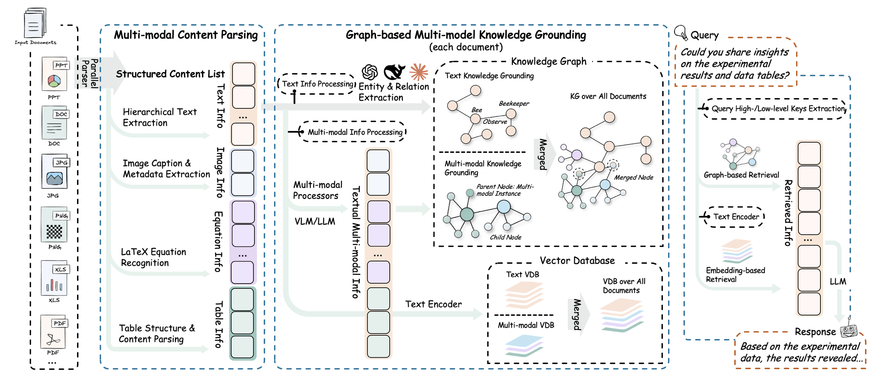
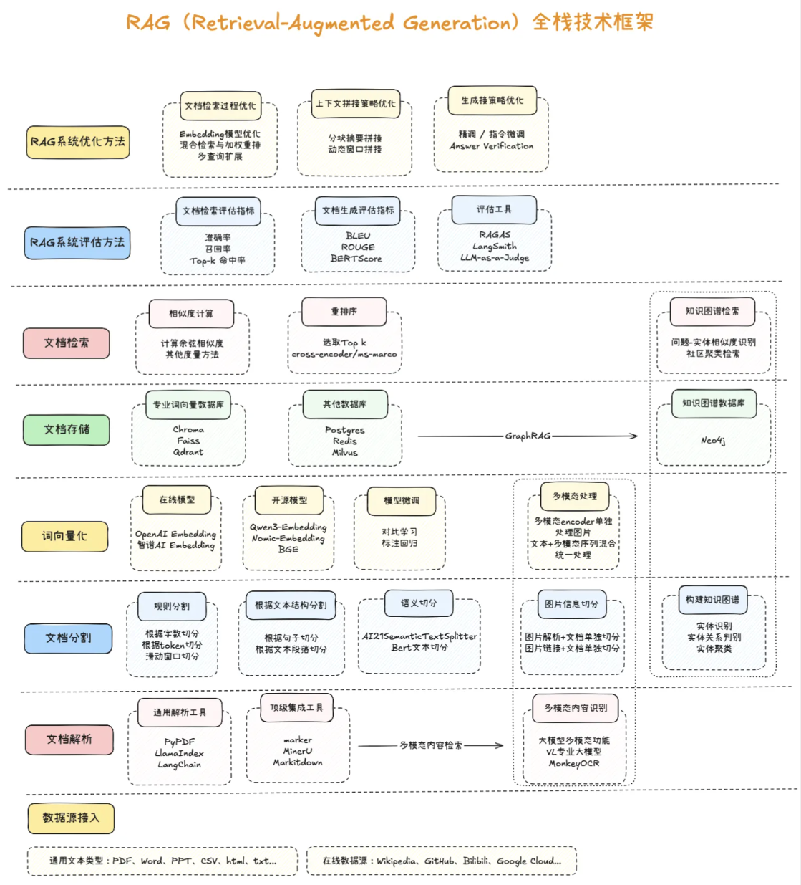

# 1.RAG入门

RAG，Retrieval-Augmented Generation，检索增强生成技术

RAG技术的落地主要由以下几个步骤组成：

（1）文档的收集

（2）文档处理

（3）文档数据向量化

（4）文档数据相似性检索

（5）构建提示词

（6）大语言模型生成结果

RAG全栈技术框架：

**GraphRAG**：

GraphRAG（Graph-enhanced Retrieval-Augmented Generation） 是一种在经典 RAG 基础上引入知识图谱/图结构的新型检索生成方法 。其核心思想是通过将文档或数据转换成图的形式，从而捕捉实体与实体之间的语义关系，并在检索阶段利用图遍历、关系推理等机制来辅助上下文构建，这种结构化信息能够提升语义理解和多跳推理能力。

具体来说，GraphRAG 的流程包括：

1. 图谱构建：将文本拆分为多个单元（TextUnit），提取实体与关系，构造知识图，并进行图社区检测与摘要；
2. 混合检索：用户提问既可以进行向量检索定位实体，也可以通过图查询（如 Cypher/SPARQL）沿关系边扩展信息；
3. 图增强生成：将检索到的节点、路径、社区摘要等信息拼接进 Prompt，引导 LLM 生成更准确、结构清晰、并基于事实推理的回答。

| 对比维度       | 传统 RAG                     | GraphRAG                             |
| -------------- | ---------------------------- | ------------------------------------ |
| 检索方式       | 基于向量语义相似度           | 向量+知识图遍历/查询                 |
| 关系理解能力   | 弱：只能匹配语义相近片段     | 强：能理解实体之间的多跳关系与结构   |
| 多跳推理支持   | 弱：难以综合跨文档信息       | 强：图结构天然支持推理路径遍历       |
| 语义上下文覆盖 | 依赖检索片段                 | 可检索完整实体子图、社区摘要         |
| 可解释性       | 中：返回片段但缺关键信息结构 | 高：能显示实体关系路径及社区结构     |
| 性能/复杂度    | 低：直接使用向量库           | 高：需要图构建、遍历、摘要等pipeline |

传统 RAG 主要是“先检索语义近似片段，再生成回答”，适合简单查询与短对话。但当问题需要“连接多个事实”“推理关系链”和“洞察上下文结构”时，传统 RAG 会显得力不从心，而 GraphRAG 正是为复杂推理场景设计的增强机制。

**Agentic RAG**

Agentic RAG（Agentic Retrieval-Augmented Generation） 是一种在传统 RAG 基础上进一步扩展的增强范式，它将检索增强生成与Agent（智能体）能力有机结合，使大模型不仅能够基于外部知识库进行回答，还能够通过一系列自主决策和工具调用来完成复杂任务。与经典 RAG 的“检索+拼接+生成”线性流程不同，Agentic RAG 将 LLM 视为一个具备推理、规划和操作能力的智能体，它在对话过程中可以根据问题拆解子任务，先后执行多轮检索、知识整合、函数调用甚至外部API请求，再将结果动态组合成最终的答案。

在这个模式下，大模型可以主动提出接下来的检索需求，或根据中间推理结果迭代获取更多信息，形成“循环式检索与生成”的闭环工作流。例如，当用户提出复杂查询时，Agentic RAG可以先调用检索工具定位候选内容，再使用工具对结果进行归纳或分类，必要时还会触发计算或外部查询操作，最后再汇总所有信息输出一个有依据的、分步骤的解答。

相比传统RAG，Agentic RAG不仅提升了回答准确性和透明度，也为多轮推理和跨知识库整合提供了更强的灵活性，是近年来大模型产品中非常重要的能力演进方向。

# 2.Embedding文本向量化

Embedding 是将文本字符串表示为向量（浮点数列表），通过计算向量之间的距离来衡量文本之间的相关性。向量距离越小，表示文本之间的相关性越高；距离越大，相关性越低。常见的 Embedding 应用包括：

- 搜索：根据文本查询的相关性对结果进行排序
- 聚类：根据文本相似性将其分组
- 推荐：根据相关文本字符串推荐项目
- 异常检测：识别与其他内容相关性较低的异常点
- 多样性测量：分析相似性分布
- 分类：将文本字符串根据其最相似的标签进行分类

**流程**：

- 调用Embedding模型计算词向量

- 计算语义相似度，常用余弦相似度

- 文档加载与切分

  文本分割器的主要作用有：

  1. 控制上下文长度：把长文档分割成更小，缩小上下文长度
  2. 提高检索准确性：小的文本片段能提升文档检索的精确度
  3. 保持语义完整性：在分割过程中，能尽量保持文本的语义连贯性

  常用文本分割器类型：

  - 按文本长度

  - 按 token 数量

  - 按特殊标记，如 html 代码、markdown 标题等

# 3.向量数据库存储与检索

## 向量数据库

它是专门把文本、图像、音频等非结构化数据转成高维向量后，再进行“语义级”存储、检索与管理的专用数据库。

### 核心概念

词向量 / 嵌入（Embedding）：将单词、句子甚至整篇文章映射成固定维度的浮点向量（如 1536 维）。语义相近的内容在向量空间里距离更近。

向量数据库：以「向量」为第一等公民的数据库系统，支持相似度计算（余弦、点积、欧氏距离）和高维索引（HNSW、IVF、PQ 等。

### 与传统数据库的区别

| 特性     | 关系型数据库 (MySQL…) | 词向量数据库                    |
| -------- | --------------------- | ------------------------------- |
| 存储单元 | 行/列                 | 高维稠密向量                    |
| 查询语言 | SQL                   | 向量相似度检索（k-NN）          |
| 索引结构 | B+ 树                 | HNSW、IVF、PQ、DiskANN          |
| 适用场景 | 精确匹配、事务        | 语义搜索、推荐、RAG、多媒体检索 |

### 常用向量数据库

| 向量数据库  | 数据存储方式 | 索引类型         | 优势特点                                                  | 使用场景                             | 部署形式         |
| ----------- | ------------ | ---------------- | --------------------------------------------------------- | ------------------------------------ | ---------------- |
| Redis Stack | 内存+磁盘    | HNSW、Flat       | 高速读写、低延迟、支持 KV 和向量混合存储、内置向量检索    | 实时推荐、在线问答、搜索增强         | 单机/集群/Docker |
| Milvus      | 磁盘+内存    | IVF、HNSW、ANNOY | 专业向量数据库，支持大规模向量检索、高并发、分布式        | 多模态检索、AI 搜索、图片/视频相似度 | 单机/分布式      |
| Weaviate    | 文档 + 向量  | HNSW             | 开箱即用的语义搜索，支持 GraphQL、向量 + 文本属性混合查询 | 企业知识库、语义搜索、聊天机器人     | 单机/Cloud       |
| Pinecone    | 云托管       | HNSW、IVF        | SaaS 服务，自动扩展，管理简单，无运维压力                 | AI 应用向量搜索、推荐系统            | Cloud            |
| Qdrant      | 内存 + 磁盘  | HNSW             | 高性能、支持 REST/gRPC，容易与 Python 集成                | 文本/图像向量检索、AI 应用           | 单机/集群/Docker |
| FAISS       | 内存为主     | IVF、PQ、HNSW    | 高性能向量索引库，GPU 加速，适合大规模离线检索            | 大规模向量计算、科研实验、批量搜索   | Python/C++ 库    |

## 向量检索

### 核心概念

给定一个「查询向量」，在庞大的向量集合里毫秒级找出与其最相似的 Top-K 个向量，并返回对应原始对象（文本、图片、商品等）的过程。

### 应用场景

- RAG：把用户问题向量与知识库向量匹配，召回最相关段落。
- 推荐：用用户行为向量找相似商品/视频。
- 以图搜图：图片 → 向量 → 向量检索。
- 异常检测：与“正常”向量距离过远即异常。

