# 1. Mermaid 是什么

Mermaid 是一个基于文本的图表绘制工具。它允许你用类似 Markdown 的声明式语法描述流程图、时序图、类图、状态图、甘特图、饼图、用户旅程图、ER 图、Git 图、思维导图、时间线、象限图、架构图等，然后由 Mermaid 渲染成 SVG 图表。

Mermaid 的核心价值不是做精细设计稿，而是把“结构、流程、关系、状态、依赖”用可版本管理的文本表达出来。    
Mermaid = 用文本描述图表结构，然后自动布局和渲染。

适合场景：

| 场景 | Mermaid 是否适合 | 原因 |
| --- | --- | --- |
| 技术文档里的流程说明 | 适合 | 文本可维护，代码评审友好 |
| README、Wiki、博客图解 | 适合 | GitHub、很多 Markdown 平台支持 Mermaid |
| 架构关系草图 | 适合 | 快速表达模块、服务、依赖、方向 |
| 产品原型、视觉设计稿 | 不适合 | Mermaid 控制力有限，不适合像素级布局 |
| 大型复杂拓扑图 | 谨慎 | 节点过多后可读性下降，布局不可完全控制 |
| 需要交互的数据可视化 | 不适合 | 应使用 ECharts、D3、Vega-Lite 等工具 |


# 2. Mermaid 的工作原理

Mermaid 的基本渲染流程如下：

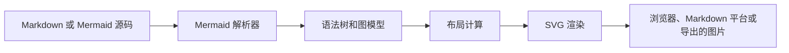

主要组成：

| 组成 | 说明 |
| --- | --- |
| Mermaid 语法 | 用文本声明图表类型、节点、关系、样式、配置 |
| Mermaid 渲染器 | 在浏览器或工具链中把 Mermaid 文本渲染成 SVG |
| Mermaid CLI | 命令行工具，可把 `.mmd` 或 `.md` 文件导出为 SVG、PNG、PDF |
| Markdown 平台支持 | GitHub、部分文档站点、部分笔记工具会原生或插件式支持 Mermaid |
| 配置系统 | 控制主题、字体、安全等级、起始加载行为、图表参数等 |

Mermaid 默认输出 SVG。SVG 优点是清晰、可缩放、适合文档；缺点是复杂图表可能渲染较慢，且在某些平台会受到安全策略限制。

# 3. 基本使用方式

## 3.1 Markdown 中直接写

最常见写法是在 Markdown 代码块中使用 `mermaid` 语言标识：

````markdown
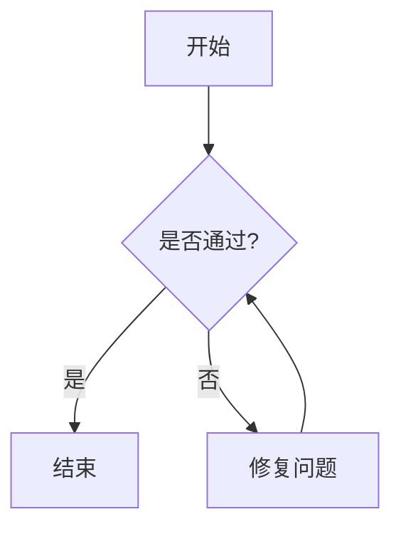
````

如果平台支持 Mermaid，这段代码会被渲染成图。如果平台不支持，只会显示为普通代码块。

## 3.2 HTML 页面中使用

浏览器中可以通过 Mermaid 包或 CDN 初始化：

```html
<pre class="mermaid">
flowchart TD
  A[Start] --> B[End]
</pre>

<script type="module">
  import mermaid from "https://cdn.jsdelivr.net/npm/mermaid/dist/mermaid.esm.min.mjs";
  mermaid.initialize({ startOnLoad: true });
</script>
```

说明：

| 配置 | 作用 |
| --- | --- |
| `startOnLoad: true` | 页面加载后自动寻找 Mermaid 块并渲染 |
| `theme` | 选择内置主题，如 `default`、`dark`、`neutral`、`forest`、`base` |
| `securityLevel` | 控制 HTML、点击事件等安全策略 |

## 3.3 Mermaid Live Editor

官方提供 Mermaid Live Editor，可用于：

- 快速验证语法。
- 复制 SVG 或 PNG。
- 调试报错位置。
- 分享图表链接。

适合先在 Live Editor 中调通，再放入文档或博客。

## 3.4 Mermaid CLI

Mermaid CLI 包名是 `@mermaid-js/mermaid-cli`，命令常见为 `mmdc`。

安装：

```bash
npm install -g @mermaid-js/mermaid-cli
```

把 `.mmd` 导出为 SVG：

```bash
mmdc -i diagram.mmd -o diagram.svg
```

导出 PNG：

```bash
mmdc -i diagram.mmd -o diagram.png
```

导出 PDF：

```bash
mmdc -i diagram.mmd -o diagram.pdf
```

CLI 适合以下场景：

| 场景 | 说明 |
| --- | --- |
| CI 中生成文档图片 | 提交 `.mmd`，构建时导出 SVG/PNG |
| 博客平台不支持 Mermaid | 先导出图片再引用 |
| 需要稳定渲染结果 | 避免不同 Markdown 平台的渲染差异 |
| 需要离线查看 | 导出静态图片或 PDF |

# 4. Mermaid 文件与代码块习惯

常见文件类型：

| 类型 | 用法 |
| --- | --- |
| `.md` | 在 Markdown 中嵌入 Mermaid 代码块 |
| `.mmd` | 单独保存 Mermaid 图表源码 |
| `.mermaid` | 另一种常见 Mermaid 源码扩展名 |
| `.svg` / `.png` | 渲染后的图像产物 |

推荐实践：

- 简单图：直接写在 Markdown 里。
- 复杂图：单独保存为 `.mmd`，再用 CLI 导出。
- 需要代码评审：优先保存源码，不只提交图片。
- 需要跨平台稳定展示：同时保留 `.mmd` 和导出的 `.svg`。

# 5. Mermaid 语法总览

Mermaid 的语法通常由两部分组成：

```text
图类型声明
  图内容
```

例如：

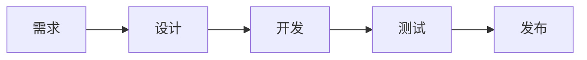

常见图类型：

| 图类型 | 声明关键字 | 适合表达 |
| --- | --- | --- |
| 流程图 | `flowchart` 或 `graph` | 流程、分支、模块依赖 |
| 时序图 | `sequenceDiagram` | 对象之间的调用顺序 |
| 类图 | `classDiagram` | 类、接口、继承、组合关系 |
| 状态图 | `stateDiagram-v2` | 状态机、生命周期 |
| ER 图 | `erDiagram` | 数据库实体关系 |
| 甘特图 | `gantt` | 项目计划、任务排期 |
| 饼图 | `pie` | 占比 |
| 用户旅程图 | `journey` | 用户流程和满意度 |
| Git 图 | `gitGraph` | 分支、提交、合并 |
| 思维导图 | `mindmap` | 知识结构 |
| 时间线 | `timeline` | 事件发展 |
| 象限图 | `quadrantChart` | 优先级、定位分析 |
| 架构图 | `architecture-beta` | 系统组件和关系 |
| C4 图 | `C4Context` 等 | 软件架构分层视图 |

# 6. 流程图 Flowchart

流程图是 Mermaid 最常用的图类型，适合表达流程、判断、依赖、模块关系。

## 6.1 基本方向

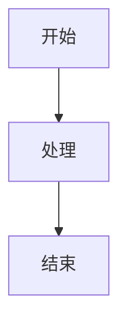

方向含义：

| 方向 | 说明 |
| --- | --- |
| `TD` 或 `TB` | 从上到下 |
| `BT` | 从下到上 |
| `LR` | 从左到右 |
| `RL` | 从右到左 |

选择建议：

- 流程步骤多：优先 `TD`。
- 模块依赖或数据流：优先 `LR`。
- 层级结构：优先 `TD`。
- 输入到输出的管线：优先 `LR`。

## 6.2 节点形状

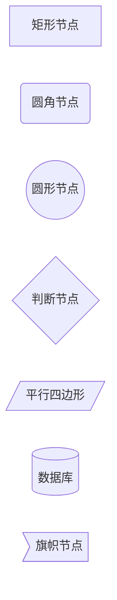

常见写法：

| 语法 | 形状 | 常用含义 |
| --- | --- | --- |
| `A[文本]` | 矩形 | 普通步骤、模块 |
| `A(文本)` | 圆角矩形 | 开始、结束、动作 |
| `A((文本))` | 圆形 | 状态、事件 |
| `A{文本}` | 菱形 | 条件判断 |
| `A[/文本/]` | 平行四边形 | 输入、输出 |
| `A[(文本)]` | 圆柱 | 数据库、存储 |
| `A>文本]` | 旗帜 | 特殊标记 |

## 6.3 连线


连线建议：

| 连线 | 适合表达 |
| --- | --- |
| `-->` | 主流程、调用、依赖 |
| `---` | 关联但无方向 |
| `-.->` | 弱依赖、异步通知、可选流程 |
| `==>` | 强调关键路径 |
| `-- 文案 -->` | 条件、动作、数据内容 |

## 6.4 子图 Subgraph

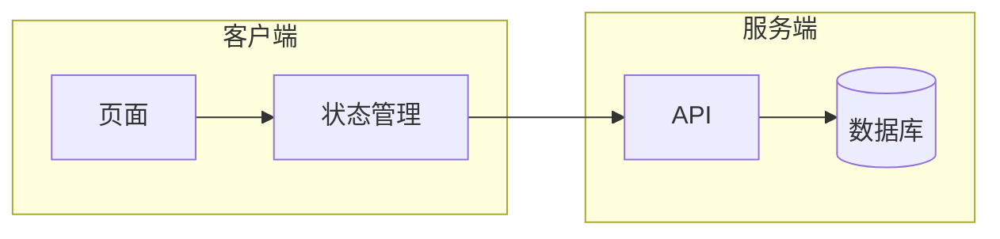

子图适合表达：

- 系统边界。
- 模块分层。
- 前后端分离。
- 微服务分组。
- 流程阶段。

## 6.5 流程图实战：登录流程

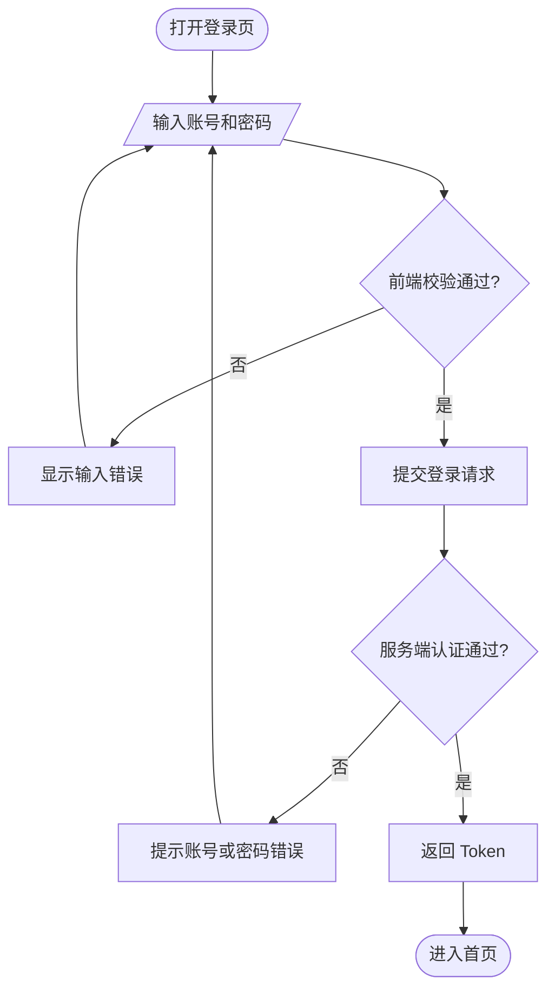

注意：

- 判断节点尽量只写问题，不写太长句子。
- 边上的文字写判断结果，如“是/否”“成功/失败”。
- 每个节点只表达一个动作。

# 7. 时序图 Sequence Diagram

时序图用于描述多个参与者之间随时间推进的交互。它非常适合 API 调用、登录认证、支付流程、异步消息、微服务调用链。

## 7.1 基本语法

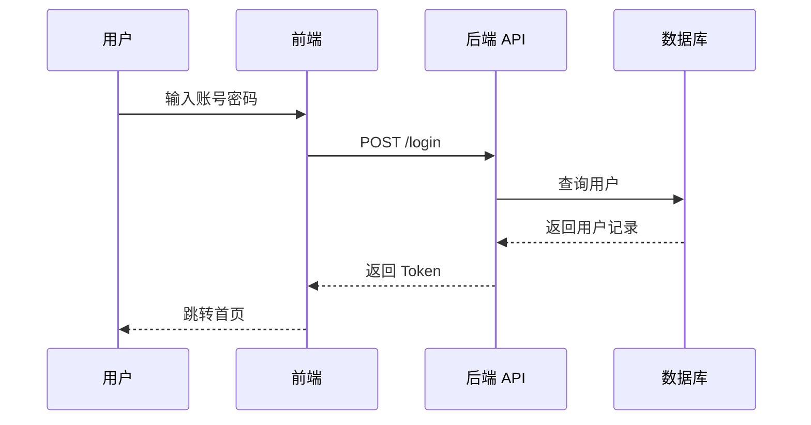

常见箭头：

| 语法 | 含义 |
| --- | --- |
| `->>` | 实线箭头，常用于请求 |
| `-->>` | 虚线箭头，常用于响应 |
| `-)` | 异步消息 |
| `-->>` | 返回消息 |
| `-x` | 失败、终止或异常 |

## 7.2 激活条

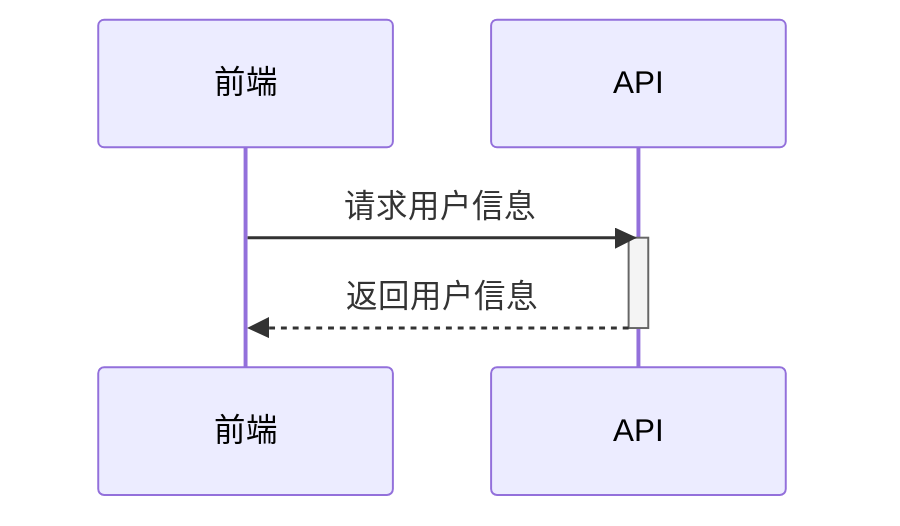

激活条表示某个参与者正在处理任务。复杂调用链中建议使用，但不要滥用。

## 7.3 条件、循环和并行

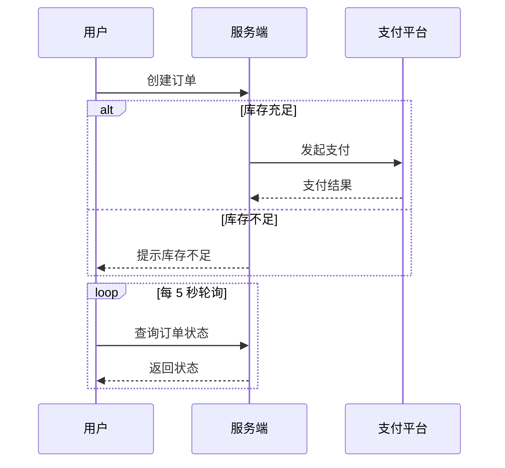

常见控制块：

| 语法 | 用途 |
| --- | --- |
| `alt / else / end` | 条件分支 |
| `opt / end` | 可选流程 |
| `loop / end` | 循环 |
| `par / and / end` | 并行流程 |
| `critical / option / end` | 临界区或关键流程 |
| `break / end` | 中断流程 |

## 7.4 时序图实战：Token 刷新

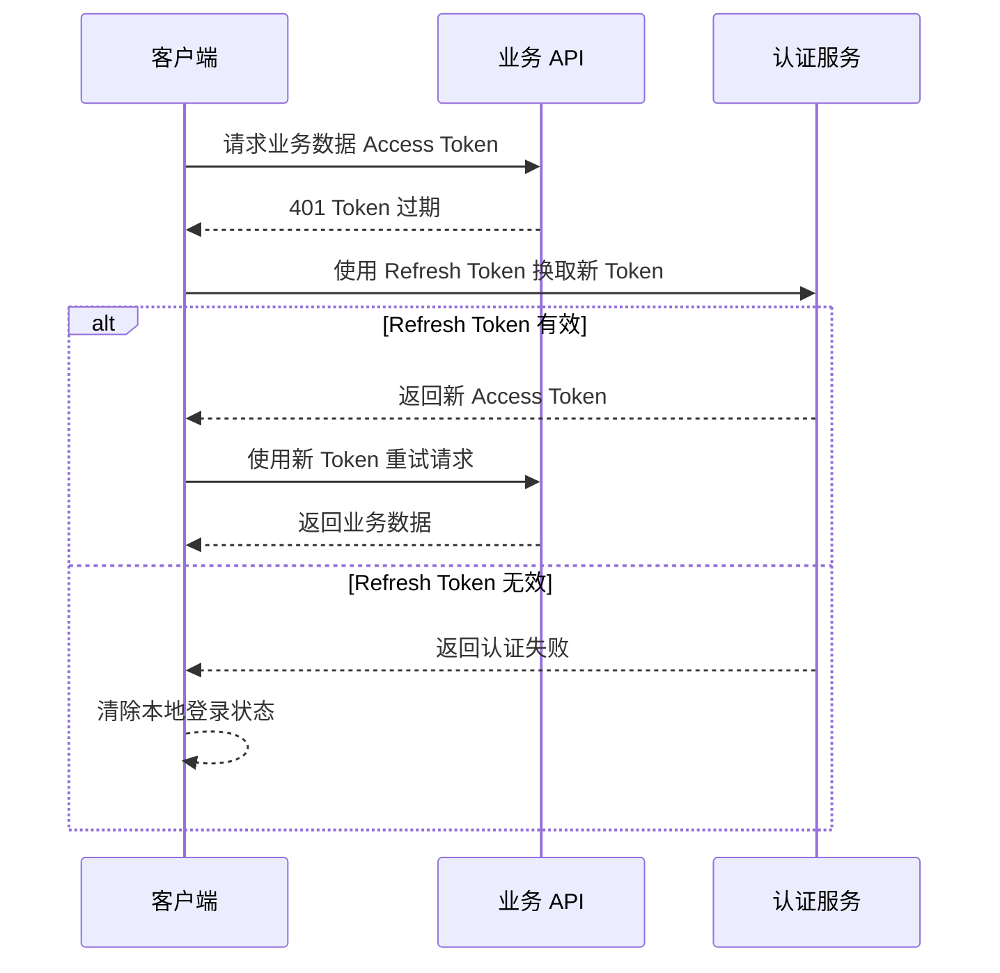

# 8. 类图 Class Diagram

类图适合表达面向对象模型、接口和实现关系、领域模型。

## 8.1 基本类定义

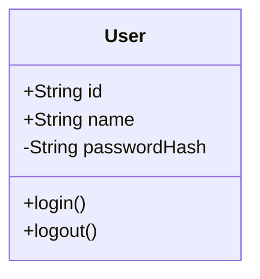

可见性符号：

| 符号 | 含义 |
| --- | --- |
| `+` | public |
| `-` | private |
| `#` | protected |
| `~` | package/internal |

## 8.2 类之间关系

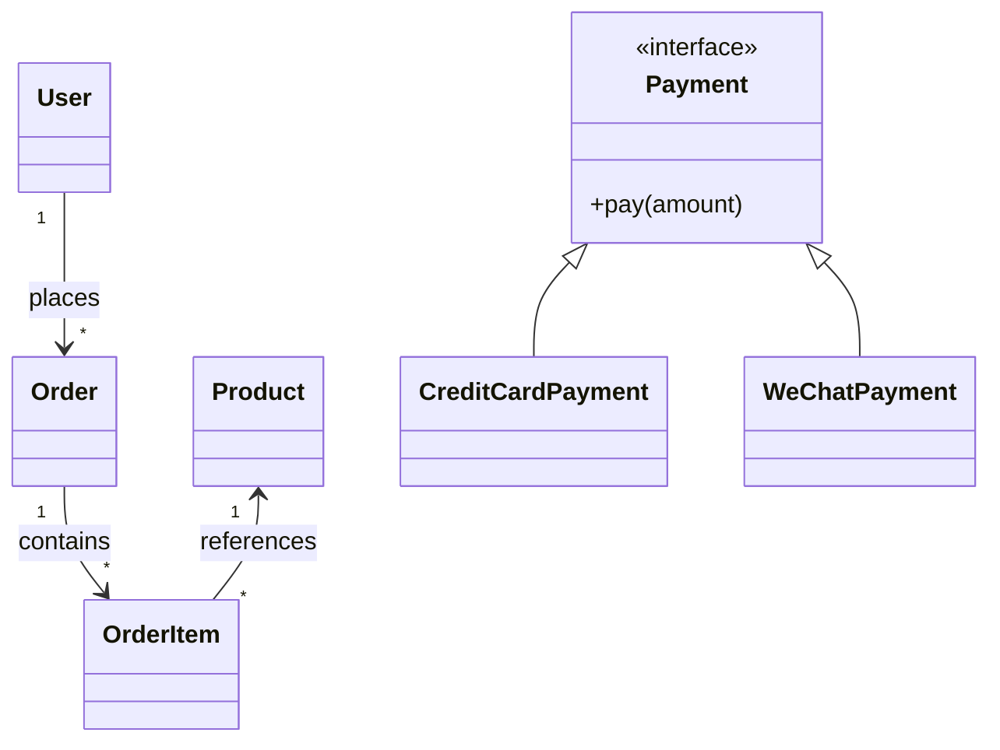

关系符号：

| 语法 | 含义 |
| --- | --- |
| `<|--` | 继承 |
| `<|..` | 实现接口 |
| `*--` | 组合 |
| `o--` | 聚合 |
| `-->` | 关联 |
| `..>` | 依赖 |

## 8.3 使用建议

- Mermaid 类图适合文档说明，不适合替代 UML 专业建模工具。
- 不要把所有字段、方法都塞进去，只保留理解关系所需的核心成员。
- 对领域模型，重点表达实体关系和聚合边界。
- 对代码结构，重点表达接口、实现类、依赖方向。

# 9. 状态图 State Diagram

状态图用于描述对象或系统在不同状态之间的迁移。典型场景包括订单状态、任务状态、连接状态、页面生命周期。

## 9.1 基本语法

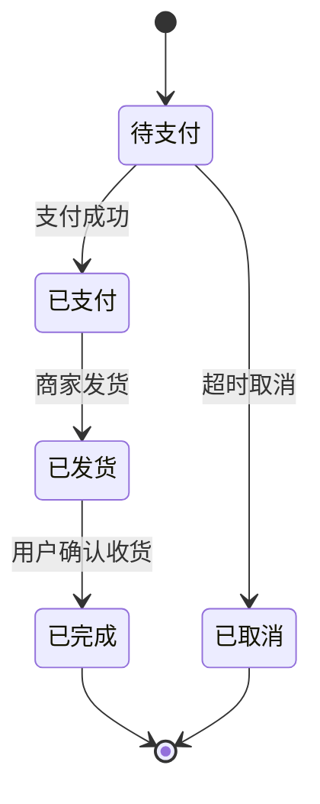

## 9.2 复合状态

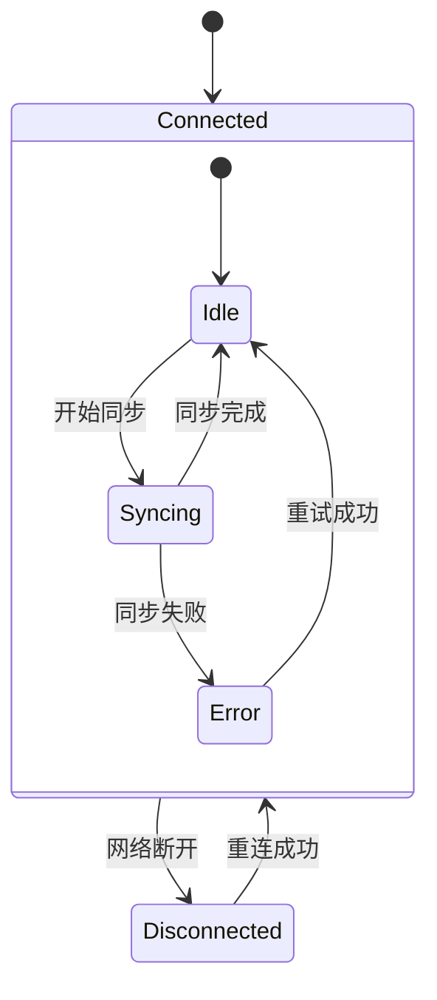

## 9.3 状态图使用建议

- 状态名用名词或形容词，如“待支付”“运行中”“已完成”。
- 边上的文字写触发事件，如“支付成功”“超时”“重试”。
- 如果状态超过 10 个，考虑拆成多个状态图。
- 不要把流程图和状态图混用：流程图关注步骤，状态图关注状态迁移。

# 10. ER 图 Entity Relationship Diagram

ER 图适合表达数据库实体、字段和关系。

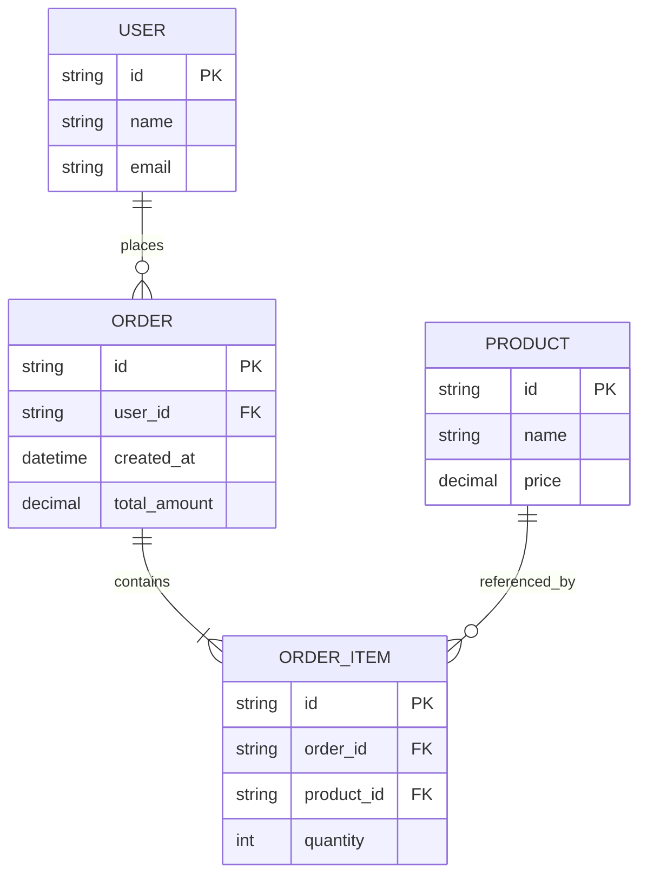

基数符号常见含义：

| 符号 | 含义 |
| --- | --- |
| `||` | 一个且仅一个 |
| `o|` | 零个或一个 |
| `}|` | 一个或多个 |
| `}o` | 零个或多个 |

组合示例：

| 关系 | 含义 |
| --- | --- |
| `USER ||--o{ ORDER` | 一个用户可以有零个或多个订单 |
| `ORDER ||--|{ ORDER_ITEM` | 一个订单至少包含一个订单项 |

# 11. 甘特图 Gantt

甘特图适合项目计划、任务排期、里程碑。

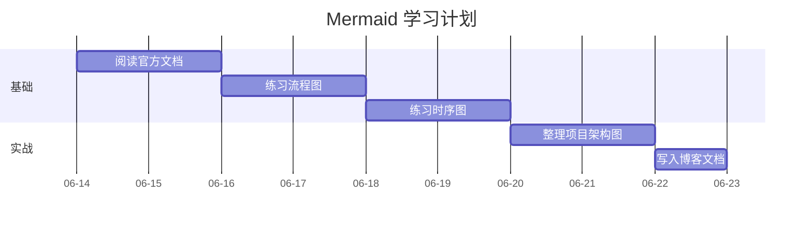

常用字段：

| 字段 | 说明 |
| --- | --- |
| `title` | 图表标题 |
| `dateFormat` | 日期解析格式 |
| `axisFormat` | 时间轴显示格式 |
| `section` | 任务分组 |
| `after` | 某任务之后开始 |
| `crit` | 标记关键任务 |
| `milestone` | 标记里程碑 |
| `done` | 已完成 |
| `active` | 进行中 |

示例：

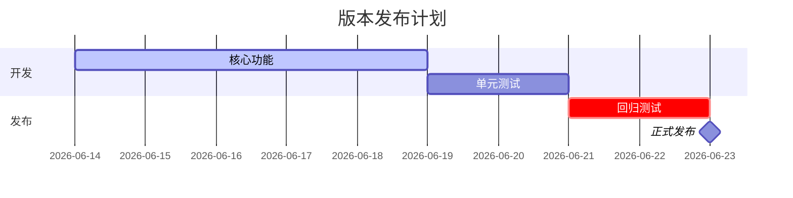

# 12. 饼图 Pie

饼图适合表达简单占比。

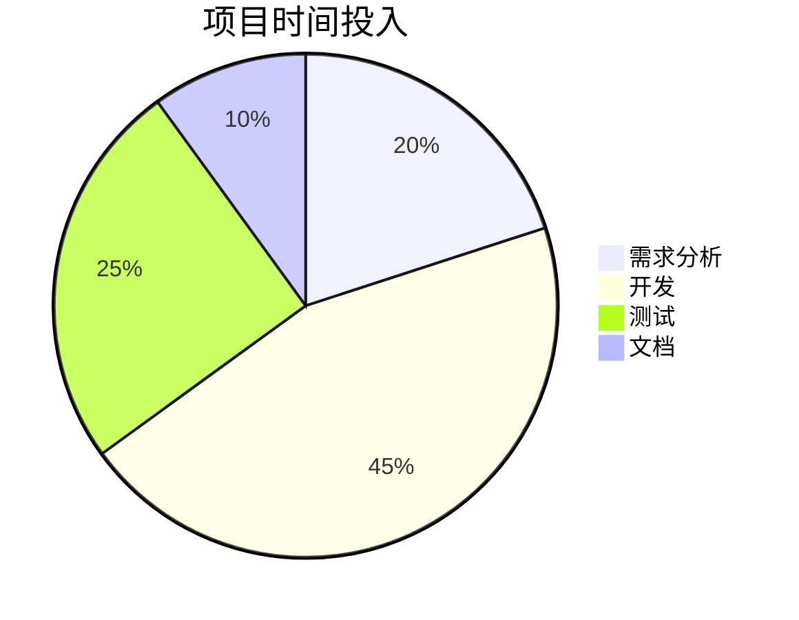

注意：

- 饼图只适合少量分类。
- 类别超过 5 个时可读性会变差。
- 不适合表达趋势，应使用折线图或柱状图工具。

# 13. 用户旅程图 Journey

用户旅程图用于表达用户在流程中的体验阶段和满意度。

```mermaid
journey
  title 用户注册体验
  section 访问
    打开首页: 5: 用户
    点击注册: 4: 用户
  section 填写
    输入手机号: 3: 用户
    接收验证码: 2: 用户, 短信服务
  section 完成
    创建账号: 4: 用户, 后端
    进入首页: 5: 用户
```

适合产品分析，不适合严谨技术流程。评分通常用于主观体验记录，不应当作精确指标。

# 14. Git 图 GitGraph

Git 图适合解释分支、提交、合并、发布流程。

```mermaid
gitGraph
  commit id: "init"
  branch develop
  checkout develop
  commit id: "feature-a"
  branch feature/login
  checkout feature/login
  commit id: "login-ui"
  commit id: "login-api"
  checkout develop
  merge feature/login
  checkout main
  merge develop tag: "v1.0.0"
```

适合说明：

- Git Flow。
- Feature branch。
- Release branch。
- Hotfix 流程。

不适合展示真实仓库的完整历史。真实历史应使用 `git log --graph` 或 Git 图形工具。

# 15. 思维导图 Mindmap

思维导图适合学习笔记、知识分类、主题拆解。

```mermaid
mindmap
  root((Mermaid))
    基础
      flowchart
      sequenceDiagram
      classDiagram
    工具
      Live Editor
      CLI
      Markdown 集成
    实战
      架构图
      API 调用链
      项目计划
```

注意：

- 层级不要过深。
- 每个节点保持短文本。
- 对复杂知识体系，思维导图适合作为索引，不适合承载全部细节。

# 16. 时间线 Timeline

时间线适合展示事件演进。

```mermaid
timeline
  title Mermaid 学习路径
  Day 1 : 了解 Mermaid 基础
        : 学会流程图
  Day 2 : 学会时序图
        : 学会状态图
  Day 3 : 整理项目架构图
        : 集成到博客
```

时间线重点是“顺序”和“阶段”，不是精确排期。如果需要任务持续时间，应使用甘特图。

# 17. 象限图 Quadrant Chart

象限图适合优先级、价值成本、风险收益分析。

```mermaid
quadrantChart
  title Mermaid 图表学习优先级
  x-axis 低使用频率 --> 高使用频率
  y-axis 低复杂度 --> 高复杂度
  quadrant-1 重点掌握
  quadrant-2 谨慎深入
  quadrant-3 暂缓学习
  quadrant-4 快速掌握
  流程图: [0.9, 0.3]
  时序图: [0.8, 0.5]
  类图: [0.6, 0.6]
  甘特图: [0.4, 0.4]
  C4 图: [0.5, 0.8]
```

# 18. 架构图 Architecture Diagram

Mermaid 新版本中提供 `architecture-beta` 用于表达系统架构组件。因为名称中仍带 `beta`，长期稳定性要以官方文档为准。

```mermaid
architecture-beta
  group app(cloud)[App System]
  service web(server)[Web Frontend] in app
  service api(server)[API Service] in app
  service db(database)[Database] in app
  service cache(database)[Cache] in app
  web:R --> L:api
  api:R --> L:db
  api:B --> T:cache
```

使用建议：

- 用于轻量架构说明。
- 如果团队使用 C4 模型，可优先考虑 C4 图。
- 对云资源拓扑、网络、安全边界要求高的图，建议使用专业架构图工具。

# 19. C4 图

C4 模型用于从不同层级描述软件架构，通常包括 Context、Container、Component、Code 四层。Mermaid 支持 C4 风格图，但不同版本能力可能有差异。

示例：系统上下文图。

```mermaid
C4Context
  title 在线商城系统上下文
  Person(customer, "用户", "购买商品的人")
  System(shop, "商城系统", "提供商品浏览、下单、支付")
  System_Ext(payment, "支付平台", "处理支付")

  Rel(customer, shop, "浏览商品并下单")
  Rel(shop, payment, "发起支付请求")
```

适合：

- 架构文档。
- 系统边界说明。
- 微服务或模块拆分说明。

注意：

- C4 图的价值在于层级清晰，不在于画得复杂。
- 每张图只表达一个抽象层级。
- Context 图不要塞进数据库和类细节。

# 20. Mermaid 配置与主题

## 20.1 代码块内初始化配置

Mermaid 支持在图表前通过 `init` 指令配置主题等参数：

````markdown
```mermaid
%%{init: {"theme": "neutral"}}%%
flowchart LR
  A[输入] --> B[处理] --> C[输出]
```
````

常用主题：

| 主题 | 特点 |
| --- | --- |
| `default` | 默认主题 |
| `dark` | 深色背景 |
| `neutral` | 中性、适合文档 |
| `forest` | 绿色风格 |
| `base` | 可深度自定义主题变量 |

## 20.2 自定义主题变量

```mermaid
%%{init: {"theme": "base", "themeVariables": {"primaryColor": "#e8f3ff", "primaryTextColor": "#111827", "primaryBorderColor": "#2563eb", "lineColor": "#4b5563", "fontFamily": "Inter, Microsoft YaHei, sans-serif"}}}%%
flowchart LR
  A[需求] --> B[设计] --> C[实现] --> D[验证]
```

常见主题变量：

| 变量 | 作用 |
| --- | --- |
| `primaryColor` | 主节点背景 |
| `primaryTextColor` | 主节点文字颜色 |
| `primaryBorderColor` | 主节点边框 |
| `lineColor` | 连线颜色 |
| `fontFamily` | 字体 |
| `background` | 背景色 |

## 20.3 安全等级 securityLevel

`securityLevel` 会影响 HTML 标签、链接、点击事件等能力。文档平台通常会采用较严格的安全策略，防止脚本注入。

常见策略：

| 场景 | 建议 |
| --- | --- |
| 公共文档平台 | 使用默认安全设置 |
| 内部可信文档 | 可以按需放宽，但要评估 XSS 风险 |
| 用户可提交图表 | 必须严格限制 HTML 和脚本能力 |

# 21. Markdown 平台集成

## 21.1 GitHub

GitHub Markdown 支持在 fenced code block 中渲染 Mermaid 图表。写法如下：

````markdown
```mermaid
flowchart LR
  A[README] --> B[GitHub 渲染]
```
````

GitHub 还支持在 Markdown 中创建多种图表，包括 Mermaid、GeoJSON、TopoJSON 和 STL 3D 模型等。Mermaid 在 GitHub 上适合 README、Issue、Pull Request、Wiki 文档。

注意：

- GitHub 支持不等于所有 Markdown 平台都支持。
- 图表渲染由 GitHub 控制，主题和安全能力可能与本地不同。
- 若图表对博客展示非常重要，建议导出 SVG 作为兜底。

## 21.2 Jekyll / GitHub Pages

Jekyll 默认不会自动渲染 Mermaid。常见方案：

1. 在布局模板中引入 Mermaid JS。
2. 使用 Jekyll 插件处理 Mermaid 代码块。
3. 构建前用 Mermaid CLI 导出 SVG/PNG。

如果你的博客部署在 GitHub Pages，需要注意：

- GitHub 仓库页面能渲染 Mermaid，不代表 GitHub Pages 生成的网站能自动渲染 Mermaid。
- GitHub Pages 的 Jekyll 插件白名单有限，部分插件不能直接使用。
- 最稳妥方案是用 CLI 预渲染为 SVG，然后在 Markdown 中引用图片。

一个简单 HTML 引入方式可放在 Jekyll 布局中：

```html
<script type="module">
  import mermaid from "https://cdn.jsdelivr.net/npm/mermaid/dist/mermaid.esm.min.mjs";
  mermaid.initialize({ startOnLoad: true, theme: "neutral" });
</script>
```

但这要求页面上的 Mermaid 代码块能被正确保留为 Mermaid 可识别的 DOM 结构。不同主题和 Markdown 渲染器可能需要额外适配。

## 21.3 VS Code

常见方式：

- 使用 Markdown Preview Mermaid Support 插件。
- 使用 Mermaid Markdown Syntax Highlighting 插件。
- 使用 Mermaid Live Editor 验证后再复制到文档。

VS Code 预览和最终博客渲染不一定完全一致。关键文档建议在目标平台验证。

# 22. Mermaid 图表选型

| 想表达的内容 | 推荐图 | 不推荐 |
| --- | --- | --- |
| 步骤、判断、业务流程 | Flowchart | Sequence Diagram |
| 请求响应、对象调用顺序 | Sequence Diagram | Flowchart |
| 状态迁移、生命周期 | State Diagram | Flowchart |
| 类、接口、继承关系 | Class Diagram | ER Diagram |
| 数据库实体关系 | ER Diagram | Class Diagram |
| 项目排期 | Gantt | Timeline |
| 事件演化 | Timeline | Gantt |
| 占比 | Pie | Flowchart |
| 知识结构 | Mindmap | Flowchart |
| 分支合并流程 | GitGraph | Gantt |
| 系统上下文和容器 | C4 / Architecture | Class Diagram |
| 价值-成本、风险-收益 | Quadrant Chart | Pie |

经验规则：

- 有时间顺序的交互：用时序图。
- 有状态转换：用状态图。
- 有条件分支和流程推进：用流程图。
- 有数据表关系：用 ER 图。
- 有架构边界：用 C4 或架构图。
- 不确定时，先用流程图；如果箭头越来越像调用链，再改成时序图。

# 23. 完整实战：用 Mermaid 描述一个博客发布流程

## 23.1 流程图

```mermaid
flowchart TD
  A[编写 Markdown] --> B{本地预览通过?}
  B -- 否 --> C[修改内容或格式]
  C --> B
  B -- 是 --> D[提交 Git]
  D --> E[推送到远程仓库]
  E --> F[GitHub Pages 构建]
  F --> G{构建成功?}
  G -- 否 --> H[查看构建日志]
  H --> C
  G -- 是 --> I[站点发布]
```

## 23.2 时序图

```mermaid
sequenceDiagram
  participant Author as 作者
  participant Git as Git 仓库
  participant CI as GitHub Pages
  participant Site as 博客站点

  Author->>Git: push Markdown
  Git->>CI: 触发构建
  CI->>CI: 运行 Jekyll 构建

  alt 构建成功
    CI->>Site: 发布静态页面
    Site-->>Author: 可访问新文章
  else 构建失败
    CI-->>Author: 返回构建错误
  end
```

## 23.3 架构图

```mermaid
flowchart LR
  subgraph Local[本地环境]
    MD[Markdown 笔记]
    Preview[Jekyll 本地预览]
  end

  subgraph GitHub[GitHub]
    Repo[(Repository)]
    Pages[GitHub Pages]
  end

  subgraph Browser[读者浏览器]
    Web[博客页面]
  end

  MD --> Preview
  MD --> Repo
  Repo --> Pages
  Pages --> Web
```

# 24. Mermaid 编写规范

## 24.1 命名规范

推荐：

```mermaid
flowchart LR
  UserInput[用户输入]
  ValidateInput[校验输入]
  SubmitRequest[提交请求]

  UserInput --> ValidateInput --> SubmitRequest
```

不推荐：

```mermaid
flowchart LR
  A[用户输入]
  B[校验输入]
  C[提交请求]
  A --> B --> C
```

说明：

- 小图用 `A/B/C` 可以接受。
- 中大型图建议使用有意义的 ID。
- 节点 ID 尽量使用英文、数字、下划线，节点显示文本可以用中文。

## 24.2 文案规范

建议：

- 节点文本保持短句。
- 判断节点使用疑问句。
- 边文本使用条件或动作。
- 一个图只表达一个主题。
- 节点超过 15 个时考虑拆图。

## 24.3 结构规范

建议顺序：

```text
1. 图类型声明
2. 全局配置
3. 节点声明
4. 子图分组
5. 关系连线
6. 样式声明
```

复杂图可以先声明节点，再统一声明关系，这样更容易维护。

# 25. 常见样式控制

## 25.1 classDef 和 class

```mermaid
flowchart LR
  A[输入] --> B[核心处理] --> C[输出]

  classDef primary fill:#e8f3ff,stroke:#2563eb,color:#111827;
  classDef success fill:#ecfdf5,stroke:#16a34a,color:#064e3b;

  class B primary;
  class C success;
```

## 25.2 style 单独设置节点

```mermaid
flowchart LR
  A[普通节点] --> B[重点节点]
  style B fill:#fef3c7,stroke:#d97706,color:#111827
```

建议：

- 只给关键节点加样式，不要每个节点都手动设置。
- 团队文档中应统一主题，不要每张图一套颜色。
- 样式用于辅助理解，不要依赖颜色传递唯一信息。

# 26. 常见错误与踩坑

## 26.1 平台不渲染 Mermaid

现象：

- Markdown 中显示代码块，没有图。

原因：

- 当前平台不支持 Mermaid。
- Mermaid 插件未启用。
- 代码块语言标识写错。
- Jekyll 或 Markdown 渲染器转义了内容。

处理：

- 确认代码块是 ```` ```mermaid ````。
- 在 Mermaid Live Editor 验证语法。
- 对博客用 Mermaid CLI 导出 SVG 作为图片。
- 对 Jekyll 检查布局是否引入 Mermaid JS。

## 26.2 中文、空格、特殊字符导致解析失败

建议：

- 节点 ID 使用英文。
- 中文放在节点显示文本中。
- 特殊字符使用引号包裹。
- 避免在 ID 中使用括号、斜杠、冒号等符号。

推荐：

```mermaid
flowchart LR
  LoginPage["登录页 /login"] --> AuthApi["认证接口 POST /api/login"]
```

## 26.3 节点文本太长

问题：

- 图变得很宽。
- 自动布局不可控。
- 移动端阅读困难。

处理：

- 拆成多个节点。
- 使用短标签，详细说明写在图下方正文。
- 复杂图拆为多张图。

## 26.4 图太复杂

判断标准：

- 节点超过 15 到 20 个。
- 箭头交叉严重。
- 一个图同时表达流程、状态、数据结构和架构。

处理：

- 按层级拆图。
- 按场景拆图。
- 用 C4 分层表达架构。
- 先画总览，再画局部细节。

## 26.5 GitHub 能显示，博客不能显示

这是常见误解。GitHub 仓库页面支持 Mermaid，不代表 GitHub Pages 或 Jekyll 主题自动支持 Mermaid。

解决思路：

- 方案 A：在 Jekyll 布局中引入 Mermaid JS。
- 方案 B：使用支持 Mermaid 的 Markdown 渲染插件。
- 方案 C：用 CLI 预渲染 SVG/PNG。

如果你希望笔记长期稳定展示，方案 C 最可靠。

## 26.6 主题在不同平台不一致

原因：

- GitHub、VS Code、本地网页、CLI 使用的 Mermaid 版本可能不同。
- 平台可能覆盖主题变量。
- 暗色模式下颜色表现不同。

处理：

- 使用 `theme: "neutral"` 或导出 SVG。
- 避免依赖平台默认颜色表达含义。
- 重要文档在目标平台截图或预览确认。

## 26.7 安全策略导致链接或 HTML 不生效

Mermaid 支持一定程度的链接、点击、HTML 标签，但平台可能禁用。

建议：

- 公共文档里不要依赖 Mermaid 的点击事件。
- 链接和详细说明写在图外 Markdown 正文。
- 对用户可编辑内容使用严格安全等级。

# 27. 调试方法

推荐排查顺序：

```mermaid
flowchart TD
  A[图表不显示或报错] --> B[复制到 Mermaid Live Editor]
  B --> C{Live Editor 是否通过?}
  C -- 否 --> D[修复 Mermaid 语法]
  C -- 是 --> E[检查目标平台是否支持 Mermaid]
  E --> F{平台支持?}
  F -- 否 --> G[改用 CLI 导出 SVG/PNG]
  F -- 是 --> H[检查 Mermaid 版本和安全配置]
  H --> I[检查主题、转义、Markdown 渲染器]
```

具体方法：

| 问题 | 排查方式 |
| --- | --- |
| 语法错误 | 用 Live Editor 缩小到最小复现 |
| 平台不支持 | 查平台文档或换成 SVG |
| 中文问题 | ID 改英文，文本加引号 |
| 样式问题 | 移除自定义 `style` 和 `classDef` 后测试 |
| 版本问题 | 本地 CLI 和平台版本对比 |
| 导出失败 | 检查 Node、npm、Puppeteer、浏览器依赖 |

# 28. 学习路线

建议按这个顺序学：

```mermaid
flowchart TD
  A[Flowchart 流程图] --> B[Sequence 时序图]
  B --> C[State 状态图]
  C --> D[Class 和 ER 图]
  D --> E[Gantt、Timeline、Mindmap]
  E --> F[主题配置和 CLI]
  F --> G[博客、README、架构文档实战]
```

分阶段目标：

| 阶段 | 目标 |
| --- | --- |
| 入门 | 能写流程图和时序图 |
| 基础熟练 | 能为业务流程、接口调用、状态机配图 |
| 工程使用 | 能在 README、博客、CI 中稳定渲染 |
| 架构表达 | 能用 C4、架构图表达系统边界和依赖 |
| 规范化 | 能形成团队图表规范和模板 |

# 29. 常用模板

## 29.1 API 调用时序图模板

```mermaid
sequenceDiagram
  participant Client as 客户端
  participant API as API 服务
  participant Service as 业务服务
  participant DB as 数据库

  Client->>API: 请求接口
  API->>Service: 调用业务逻辑
  Service->>DB: 查询或写入数据
  DB-->>Service: 返回数据
  Service-->>API: 返回结果
  API-->>Client: HTTP 响应
```

## 29.2 服务架构流程图模板

```mermaid
flowchart LR
  Client[客户端] --> Gateway[API Gateway]
  Gateway --> Auth[认证服务]
  Gateway --> App[业务服务]
  App --> Cache[(缓存)]
  App --> DB[(数据库)]
  App -.-> MQ[消息队列]
  MQ --> Worker[异步任务]
```

## 29.3 状态机模板

```mermaid
stateDiagram-v2
  [*] --> Created
  Created --> Running: start
  Running --> Paused: pause
  Paused --> Running: resume
  Running --> Completed: finish
  Running --> Failed: error
  Failed --> Running: retry
  Completed --> [*]
```

## 29.4 数据库 ER 模板

```mermaid
erDiagram
  ENTITY_A ||--o{ ENTITY_B : owns

  ENTITY_A {
    string id PK
    string name
  }

  ENTITY_B {
    string id PK
    string entity_a_id FK
    string value
  }
```

# 30. Mermaid 与其他工具对比

| 工具 | 优势 | 劣势 | 适合场景 |
| --- | --- | --- | --- |
| Mermaid | 文本化、易版本管理、Markdown 友好 | 布局控制有限 | 技术文档、README、博客 |
| PlantUML | UML 能力强、生态成熟 | 语法相对重，通常依赖 Java/服务 | UML、架构文档 |
| Graphviz DOT | 图布局能力强 | 语法偏底层，非 Markdown 原生体验 | 依赖图、复杂关系图 |
| Draw.io / diagrams.net | 可视化编辑强 | 版本 diff 不友好 | 架构图、产品图、会议图 |
| Figma | 视觉设计能力强 | 不适合代码式维护 | 设计稿、交互稿 |
| ECharts / D3 | 数据可视化强 | 编码成本高 | 动态图表、数据分析 |

选择建议：

- 文档内结构图：优先 Mermaid。
- 正式 UML：考虑 PlantUML。
- 大规模依赖关系：考虑 Graphviz。
- 视觉精美架构图：考虑 diagrams.net 或 Figma。
- 真实数据分析：考虑 ECharts、D3、Vega-Lite。

# 31. 团队落地建议

## 31.1 建立图表规范

建议团队约定：

- 常用图类型。
- 节点命名规则。
- 图表主题。
- 是否允许 HTML。
- 复杂图拆分标准。
- Mermaid CLI 版本。
- 导出图片存放目录。

## 31.2 把 Mermaid 放入文档流程

推荐流程：

```mermaid
flowchart LR
  A[写 Mermaid 源码] --> B[本地预览]
  B --> C[代码评审]
  C --> D[CI 检查或导出]
  D --> E[发布文档]
```

## 31.3 版本固定

如果使用 CLI 生成图片，建议在项目中固定版本：

```bash
npm install --save-dev @mermaid-js/mermaid-cli@11.15.0
```

然后在 `package.json` 中写脚本：

```json
{
  "scripts": {
    "diagram:build": "mmdc -i docs/diagram.mmd -o docs/diagram.svg"
  }
}
```

固定版本的好处：

- 本地和 CI 输出一致。
- 避免 Mermaid 新版本布局变化导致文档 diff。
- 便于回溯构建问题。

# 32. 速查表

## 32.1 图类型速查

```text
flowchart TD
sequenceDiagram
classDiagram
stateDiagram-v2
erDiagram
gantt
pie
journey
gitGraph
mindmap
timeline
quadrantChart
architecture-beta
C4Context
```

## 32.2 Flowchart 速查

```text
A[矩形]
A(圆角)
A((圆形))
A{判断}
A[/输入输出/]
A[(数据库)]
A --> B
A -- 文案 --> B
A -.-> B
A ==> B
subgraph Name
  A --> B
end
```

## 32.3 Sequence 速查

```text
participant A as 客户端
A->>B: 请求
B-->>A: 响应
activate B
deactivate B
alt 条件
else 其他条件
end
loop 循环
end
opt 可选
end
par 并行
and 另一路并行
end
```

## 32.4 Class 速查

```text
class User {
  +String id
  -String password
  +login()
}
Animal <|-- Dog
Interface <|.. Impl
Whole *-- Part
Group o-- Member
A --> B
A ..> B
```

# 33. 记忆重点

- Mermaid 最适合“文档中的结构化图表”，不是视觉设计工具。
- 小图直接写 Markdown，大图单独保存 `.mmd`。
- GitHub 支持 Mermaid，不代表 GitHub Pages 自动支持。
- 节点 ID 用英文，显示文本可以用中文。
- 流程图表达步骤，时序图表达交互，状态图表达状态迁移。
- 复杂图要拆，不要追求“一张图说明全部”。
- 团队和 CI 中应固定 Mermaid CLI 版本。
- 关键文档建议导出 SVG，保证长期可展示。

# 参考

- [Official: Mermaid Documentation, Introduction](https://mermaid.js.org/intro/)
- [Official: Mermaid Flowchart Syntax](https://mermaid.js.org/syntax/flowchart.html)
- [Official: Mermaid Sequence Diagram Syntax](https://mermaid.js.org/syntax/sequenceDiagram.html)
- [Official: Mermaid Class Diagram Syntax](https://mermaid.js.org/syntax/classDiagram.html)
- [Official: Mermaid State Diagram Syntax](https://mermaid.js.org/syntax/stateDiagram.html)
- [Official: Mermaid Entity Relationship Diagram Syntax](https://mermaid.js.org/syntax/entityRelationshipDiagram.html)
- [Official: Mermaid Gantt Diagram Syntax](https://mermaid.js.org/syntax/gantt.html)
- [Official: Mermaid Pie Chart Syntax](https://mermaid.js.org/syntax/pie.html)
- [Official: Mermaid User Journey Diagram Syntax](https://mermaid.js.org/syntax/userJourney.html)
- [Official: Mermaid Gitgraph Syntax](https://mermaid.js.org/syntax/gitgraph.html)
- [Official: Mermaid Mindmap Syntax](https://mermaid.js.org/syntax/mindmap.html)
- [Official: Mermaid Timeline Syntax](https://mermaid.js.org/syntax/timeline.html)
- [Official: Mermaid Quadrant Chart Syntax](https://mermaid.js.org/syntax/quadrantChart.html)
- [Official: Mermaid Architecture Diagram Syntax](https://mermaid.js.org/syntax/architecture.html)
- [Official: Mermaid Configuration](https://mermaid.js.org/config/schema-docs/config.html)
- [Official: Mermaid Usage and API](https://mermaid.js.org/config/usage.html)
- [Official: Mermaid CLI repository](https://github.com/mermaid-js/mermaid-cli)
- [Official: Mermaid Live Editor](https://mermaid.live/)
- [Official: npm package `mermaid`](https://www.npmjs.com/package/mermaid)
- [Official: npm package `@mermaid-js/mermaid-cli`](https://www.npmjs.com/package/@mermaid-js/mermaid-cli)
- [Official: GitHub Docs, Creating diagrams](https://docs.github.com/en/get-started/writing-on-github/working-with-advanced-formatting/creating-diagrams)
- [Community: 博客园 Mermaid 入门文章](https://www.cnblogs.com/summerday152/p/13645102.html)
- [Community: Juejin Mermaid 相关文章搜索入口](https://juejin.cn/search?query=Mermaid)
- [Community: CSDN Mermaid 相关文章搜索入口](https://so.csdn.net/so/search?q=Mermaid)
