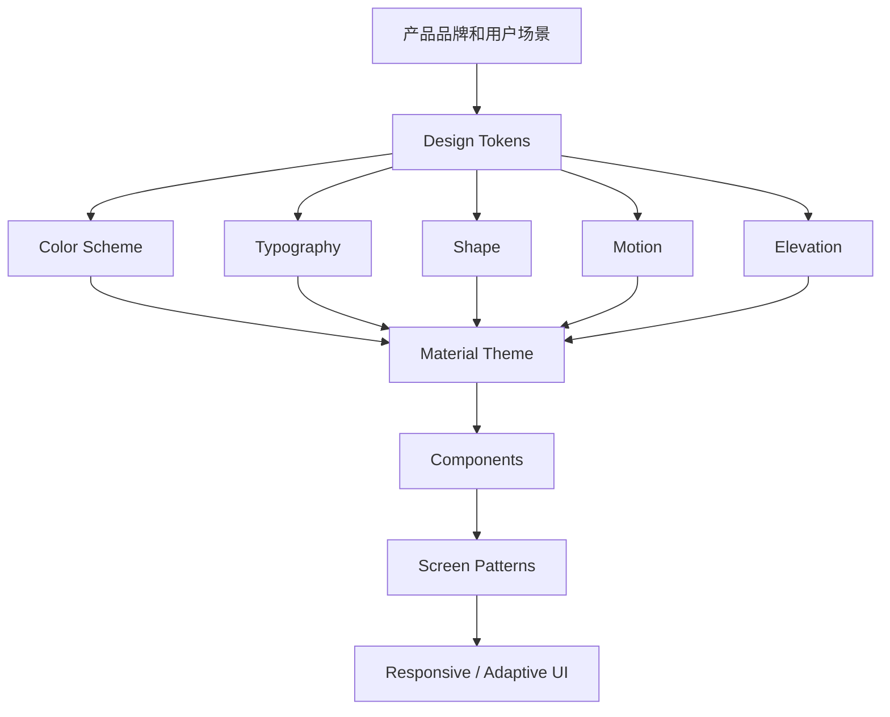
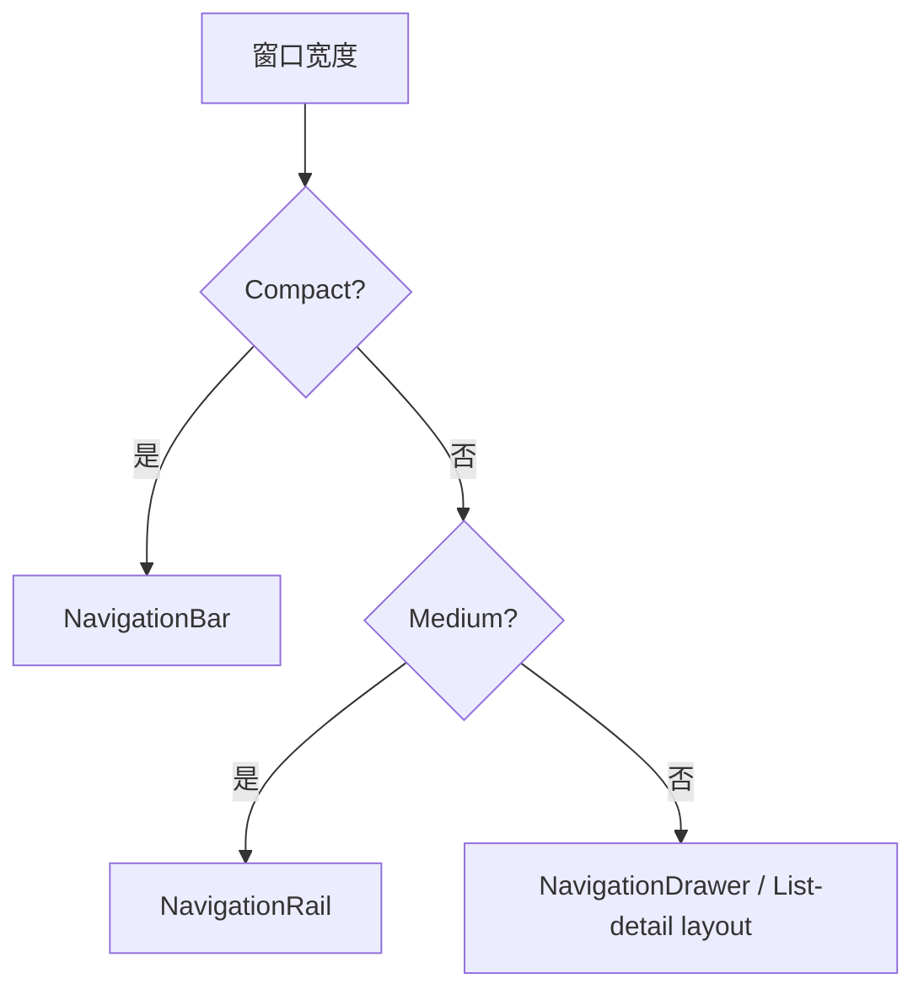

## 1. 介绍

Material 3，也常被称为 Material You，是 Google 的第三代 Material Design 设计体系。Material3将颜色重新定义为更加个性化的体验，助力于构建出色且富有表现力的应用。它不是单个组件库，而是一整套跨平台 UI 设计语言，包含：

- 设计原则：界面层级、交互反馈、可访问性、适应不同屏幕。
- 设计 token：颜色、字体、形状、间距、状态、动效等可复用变量。
- 组件规范：按钮、卡片、导航、文本框、列表、对话框等。
- 平台实现：Android Compose Material3、Material Components for Android、Material Web 等。

## 2. Material 3 的心智模型

M3 的心智模型是把"设计"从"画出固定的样子"变成"定义一套可以自动生成、自动适配、但语义关系始终一致的规则系统"。

"心智模型"(Mental Model)在设计系统语境里,指的不是某个具体功能,而是**使用者(设计师、开发者,甚至最终用户)在脑海中用来理解"这个系统是怎么运作的"那套简化认知框架**。它决定了人们看到一个界面元素时,会本能地预期它该怎么表现、怎么变化。

Material 3 的心智模型可以拆成几层来理解:

**1. "一切颜色都是角色(Role),不是固定值"**

传统做法是设计师直接指定"这个按钮是蓝色 `#1976D2`"。M3 的心智模型是反过来的:你先定义一个**语义角色**(比如 `primary`、`onPrimaryContainer`、`surface`),这个角色的实际颜色值由系统根据种子色动态计算出来。

开发者/设计师需要建立的心智模型是:**"我在给元素分配功能角色,而不是分配颜色"**。这样无论主题怎么变(暗色模式、动态取色、用户换壁纸),你的设计逻辑都不需要重新想一遍——角色的语义关系(比如"容器色要比背景色更突出但比主色浅")是恒定的,变的只是具体数值。

**2. "层级用色调表达,不用阴影表达"**

M2 的心智模型是:**元素越"悬浮"(elevation 越高),阴影越重**——这是一种模拟物理世界光影的直觉。

M3 的心智模型变成:**元素越悬浮,叠加的主色调(surface tint)越明显**。你看到一个卡片颜色比背景稍微"偏色"一点,就该理解为"它在视觉层级上更高"。这对习惯了 M2 的人是需要重新训练直觉的地方。

**3. "个性化是系统默认行为,不是例外"**

M2 的隐含心智模型是:所有 Material 应用应该长得像"同一个产品家族"。

M3 的心智模型反过来是:**每个应用/用户都应该基于同一套底层规则,生成自己独特的外观**。就像一个"生成引擎"而不是一套"固定皮肤"——你不需要问"这个颜色对不对",而要问"这个颜色关系(对比度、层级)对不对"。

**4. "Token 化思维"**

M3 大量使用设计 Token(设计令牌)(如 `color.primary`、`shape.corner.medium`、`typography.titleLarge`)。心智模型是:**设计决策被拆解成可复用、可替换的最小单元**,而不是写死在每个组件里。改一个 Token,全局联动改变。这也是为什么 M3 能同时支持"品牌定制"和"跨平台一致性"——因为一致的是 Token 结构,不是具体数值。



可以把 Material 3 分成三层：

| 层级 | 解决的问题 | 例子 |
| --- | --- | --- |
| Token 层 | 产品视觉语言的基础变量 | `primary`、`bodyLarge`、`cornerMedium` |
| Theme 层 | 把 token 组织成应用主题 | `MaterialTheme(colorScheme, typography, shapes)` |
| Component 层 | 具体 UI 组件如何使用主题 | `Button`、`Card`、`NavigationBar`、`TextField` |

## 3. Material 3 相比 Material 2 的变化

| 维度 | Material 2 | Material 3 |
| --- | --- | --- |
| 设计目标 | 通用 Material 风格 | 更强调个性化、品牌和动态适配 |
| 颜色系统 | primary/secondary 等较少角色 | 更完整的 color roles，强调 surface 和 container |
| 动态颜色 | 非核心能力 | Android 12+ 动态颜色是重要特性 |
| 形状 | 有 shape 体系，但使用较少 | shape token 更常用于组件表达 |
| 组件状态 | 有状态反馈 | 更系统地结合 state layer、tonal elevation |
| 自适应 | 有响应式建议 | 更强调 compact/medium/expanded 窗口级别 |
| Compose 实现 | `androidx.compose.material` | `androidx.compose.material3` |

Material 3 的重点是“角色化”。颜色不是简单地选一个蓝色或绿色，而是给每个 UI 元素分配语义角色，比如 primary action、surface container、error state、outline variant。

## 4. Color Scheme

### 4.1 基本概念

Material 3 使用 color scheme 表达界面颜色。一个 color scheme 不是调色板截图，而是一组有语义的颜色角色。

Material 3 的颜色系统有两个关键点：

- 颜色是角色，不是固定值。
- 前景色和背景色要成对使用。

也就是说，设计和开发时不应该先问“这个按钮是什么蓝色”，而应该先问“这个按钮是不是主操作”。如果它是主操作，通常使用 `primary` 作为容器或文字角色；如果它只是普通页面内容，就应该回到 `surface` 体系。

常见角色：

| 角色 | 用途 |
| --- | --- |
| `primary` | 最重要的品牌色和关键操作 |
| `onPrimary` | 显示在 primary 上的文字或图标 |
| `primaryContainer` | 低强调的 primary 容器背景 |
| `onPrimaryContainer` | 显示在 primaryContainer 上的内容 |
| `secondary` | 次级强调色，辅助表达层级 |
| `tertiary` | 第三强调色，可用于补充品牌或强调 |
| `surface` | 页面、卡片、面板等表面背景 |
| `onSurface` | surface 上的主要文字或图标 |
| `surfaceVariant` | 变化表面，常用于分区或低强调容器 |
| `outline` | 边框、分隔线、输入框轮廓 |
| `error` | 错误状态 |
| `onError` | 错误色上的文字或图标 |

Material 3 中颜色角色可以分成几组：

| 分组 | 常见角色 | 用途 |
| --- | --- | --- |
| Key colors | `primary`、`secondary`、`tertiary` | 品牌、强调和辅助强调 |
| On colors | `onPrimary`、`onSurface`、`onError` | 放在对应背景上的文字或图标 |
| Container colors | `primaryContainer`、`secondaryContainer`、`tertiaryContainer` | 低强调的大面积容器 |
| Surface colors | `surface`、`surfaceVariant`、`surfaceContainer` | 页面和内容承载面 |
| Outline colors | `outline`、`outlineVariant` | 边框、分隔线、输入框轮廓 |
| State colors | `error`、`onError`、`errorContainer` | 错误、危险和校验失败 |

命名规律：

- `onXxx` 表示放在某个背景色上的前景色。
- `XxxContainer` 表示一个强调程度较低、适合大面积容器的颜色。
- `surface` 系列用于承载内容，不应该被 primary 大面积替代。

### 4.2 Primary、Secondary、Tertiary

`primary` 是最重要的强调色，通常用于关键操作、选中态、品牌识别和最重要的交互入口。它不应该被用作所有标题、所有图标或整页背景。

`secondary` 用于辅助强调。它适合表达次级操作、补充状态或与 primary 形成层级关系，但不应该和 primary 抢夺注意力。

`tertiary` 是第三强调色，可以用于更灵活的补充场景，例如特殊标签、扩展品牌色、图表辅助色或某些独立模块。

| 角色 | 推荐使用 | 避免使用 |
| --- | --- | --- |
| `primary` | 主按钮、当前选中、关键入口 | 整页背景、普通正文、所有图标 |
| `secondary` | 次级强调、辅助操作 | 和 primary 同时大面积使用 |
| `tertiary` | 补充强调、特殊内容 | 没有语义地随意点缀 |

如果一个页面里 primary 到处都是，等于没有任何地方真正重要。Material 3 的强调色要节制使用，把注意力留给真正关键的操作。

### 4.3 On colors：前景色不是手写黑白

`onXxx` 表示放在某个背景色上的前景色。比如：

- `onPrimary` 放在 `primary` 上。
- `onPrimaryContainer` 放在 `primaryContainer` 上。
- `onSurface` 放在 `surface` 上。
- `onError` 放在 `error` 上。

这个命名解决的是对比度和主题适配问题。浅色模式下，`onSurface` 可能接近黑色；深色模式下，它可能接近白色。开发者不应该手写 `Color.Black` 或 `Color.White` 去猜。

正确搭配示例：

| 背景色 | 前景色 |
| --- | --- |
| `primary` | `onPrimary` |
| `primaryContainer` | `onPrimaryContainer` |
| `surface` | `onSurface` |
| `surfaceVariant` | `onSurfaceVariant` |
| `error` | `onError` |
| `errorContainer` | `onErrorContainer` |

Compose 示例：

```kotlin
Button(
    onClick = onSave,
    colors = ButtonDefaults.buttonColors(
        containerColor = MaterialTheme.colorScheme.primary,
        contentColor = MaterialTheme.colorScheme.onPrimary
    )
) {
    Text("保存")
}
```

很多 Material 组件已经内置了合理的颜色组合，只有在确实需要表达产品语义时才手动覆盖。

### 4.4 Surface 和 Container

`surface` 是 Material 3 中非常核心的概念。页面、卡片、sheet、dialog、菜单等都可以理解为不同层级的 surface。它们承载内容，而不是像 primary 那样表达强强调。

常见 surface 角色：

| 角色 | 用途 |
| --- | --- |
| `surface` | 页面基础背景 |
| `surfaceVariant` | 变化表面，常用于低强调分区 |
| `surfaceContainerLowest` | 最低层容器 |
| `surfaceContainerLow` | 低层容器 |
| `surfaceContainer` | 普通容器 |
| `surfaceContainerHigh` | 较高层容器 |
| `surfaceContainerHighest` | 最高层容器 |

Surface 系列适合表达层级，不适合全部替换成灰色。浅色模式下，surface 层级可能是细微的明度变化；深色模式下，surface 层级对可读性和空间关系更重要。

典型用法：

- 页面背景：`surface`
- 普通卡片：`surfaceContainerLow` 或组件默认值
- 弹层、dialog：更高层级的 surface container
- 分隔和轮廓：`outline` / `outlineVariant`

不要用重阴影解决所有层级问题。Material 3 更强调用容器色、边框、间距和 tonal elevation 共同表达层级。

### 4.5 Error 和状态色

`error` 用于表达错误、失败、危险或破坏性操作。但错误状态不能只靠颜色表达，因为颜色对色弱用户不一定可靠，也可能在动态主题下不够明显。

错误状态应同时包含：

- 错误色，例如 `error` 或 `errorContainer`。
- 明确文字，例如“邮箱格式不正确”。
- 靠近出错位置的提示。
- 必要时提供恢复操作，例如“重试”。
- 可访问语义，让辅助技术能读出状态。

表单错误示例：

```kotlin
OutlinedTextField(
    value = email,
    onValueChange = onEmailChange,
    label = { Text("邮箱") },
    isError = emailError != null,
    supportingText = {
        if (emailError != null) {
            Text(
                text = emailError,
                color = MaterialTheme.colorScheme.error
            )
        }
    }
)
```

危险操作不一定直接用大面积 `error` 背景。很多时候 `TextButton` + 错误色文字 + 确认对话框，比一个大红按钮更合适。

### 4.6 浅色和深色 Color Scheme

Material 3 应同时考虑浅色和深色主题。只调浅色模式是不完整的主题设计。

浅色和深色主题不是简单取反：

| 项目 | 浅色模式 | 深色模式 |
| --- | --- | --- |
| 背景 | 更亮的 surface | 更暗的 surface |
| 文本 | 深色 `onSurface` | 浅色 `onSurface` |
| 阴影 | 更容易可见 | 通常不明显 |
| 层级 | 可用阴影和容器色 | 更依赖 tonal elevation 和 surface container |
| 品牌色 | 可以更饱和 | 需要检查亮度和对比度 |

Compose 中通常分别定义：

```kotlin
private val LightColorScheme = lightColorScheme(
    primary = Color(0xFF3F5F90),
    onPrimary = Color.White,
    surface = Color(0xFFFAF8FF),
    onSurface = Color(0xFF1A1B20)
)

private val DarkColorScheme = darkColorScheme(
    primary = Color(0xFFA8C7FA),
    onPrimary = Color(0xFF0A305F),
    surface = Color(0xFF121318),
    onSurface = Color(0xFFE3E2E9)
)
```

实际项目里建议用 Material Theme Builder 或设计工具生成完整色板，再在真实页面里验证，而不是手工只填几个颜色。

### 4.7 Dynamic Color

Dynamic Color 是 Material 3 的代表特性之一。Android 12+ 可以从用户壁纸提取颜色，生成应用 color scheme。

Compose 中常见写法：

```kotlin
@Composable
fun AppTheme(
    darkTheme: Boolean = isSystemInDarkTheme(),
    dynamicColor: Boolean = true,
    content: @Composable () -> Unit
) {
    val colorScheme = when {
        dynamicColor && Build.VERSION.SDK_INT >= Build.VERSION_CODES.S -> {
            val context = LocalContext.current
            if (darkTheme) dynamicDarkColorScheme(context) else dynamicLightColorScheme(context)
        }
        darkTheme -> darkColorScheme()
        else -> lightColorScheme()
    }

    MaterialTheme(
        colorScheme = colorScheme,
        typography = AppTypography,
        content = content
    )
}
```

使用建议：

- 系统级 Android 应用、个人工具、内容消费类应用适合 dynamic color。
- 品牌强约束产品可以关闭 dynamic color，使用固定品牌色。
- 不要直接把品牌色硬塞进所有组件；应先生成完整 color scheme，再让组件读取角色色。

Dynamic Color 的核心收益是个性化，但它也会带来品牌一致性和测试复杂度问题。是否开启要看产品类型。

| 产品类型 | 建议 |
| --- | --- |
| 系统工具、个人效率、阅读类应用 | 可以默认开启 |
| 品牌强约束应用 | 默认关闭或提供开关 |
| 企业后台、专业工具 | 谨慎开启，优先保证识别和可读性 |
| 内容创作、视觉类应用 | 需要检查动态色是否干扰内容本身 |

动态色开启后仍要检查：

- 主按钮是否足够明显。
- 错误状态是否清晰。
- 深色模式是否可读。
- 品牌标识是否被弱化。
- 图表、状态色、业务颜色是否被主题色干扰。

### 4.8 Compose 中使用 ColorScheme

页面中应优先从 `MaterialTheme.colorScheme` 读取颜色：

```kotlin
Surface(
    color = MaterialTheme.colorScheme.surface
) {
    Text(
        text = "Material 3",
        color = MaterialTheme.colorScheme.onSurface
    )
}
```

组件默认颜色通常已经符合 Material 3。比如 `Button` 默认使用 `primary` 和 `onPrimary`，`TextField` 默认处理 focused、error、disabled 等状态。只有在默认语义不符合产品需要时，才通过 `colors` 参数覆盖。

封装组件时可以把颜色策略集中起来：

```kotlin
@Composable
fun DangerButton(
    text: String,
    onClick: () -> Unit
) {
    TextButton(
        onClick = onClick,
        colors = ButtonDefaults.textButtonColors(
            contentColor = MaterialTheme.colorScheme.error
        )
    ) {
        Text(text)
    }
}
```

这样业务页面只写 `DangerButton("删除任务")`，不需要每次都手写 error 色。

### 4.9 颜色检查清单

设计或实现完一套 color scheme 后，可以按下面检查：

- 浅色和深色模式是否都完整。
- `primary` 是否只用于关键操作和品牌强调。
- 页面大面积背景是否使用 `surface` 系列。
- 所有文字是否使用对应的 `onXxx` 角色。
- 错误状态是否有颜色、文字和语义提示。
- disabled、selected、focused、pressed 状态是否清晰。
- 动态色开启后是否仍有足够对比度。
- 卡片、sheet、dialog 是否能区分层级。
- 边框和分隔线是否使用 `outline` / `outlineVariant`。
- 是否存在散落的 hex 色值或 `Color.Black` / `Color.White`。

### 4.10 常见颜色错误

| 错误 | 问题 | 更好的做法 |
| --- | --- | --- |
| 大面积使用 `primary` 做背景 | 界面过重，层级混乱 | 页面主体使用 `surface`，关键操作用 `primary` |
| 文本颜色手写黑白 | 深色模式和动态色会出问题 | 使用 `onSurface`、`onPrimary` 等角色 |
| 所有卡片同一个灰色 | 层级不清 | 使用 surface container、outline、elevation 区分 |
| 错误状态只改文字 | 用户不容易识别 | 同时使用 `error`、说明文本和语义提示 |
| 品牌色直接填进所有组件 | 主题不可扩展，动态色失效 | 先生成完整 color scheme，再按角色使用 |
| 只调浅色模式 | 深色模式不可读 | light/dark scheme 同时设计和验证 |
| 用颜色表达唯一状态 | 色弱或辅助技术不可识别 | 增加文字、图标、语义状态 |

## 5. Typography

Material 3 typography(排版) 是一组文字样式，而不是随手写字号。它的核心作用是建立阅读层级：哪些内容是页面标题，哪些是组件标题，哪些是正文，哪些只是标签或辅助信息。

排版 token 通常包含：

- 字体族 `fontFamily`
- 字号 `fontSize`
- 行高 `lineHeight`
- 字重 `fontWeight`
- 字距 `letterSpacing`
- 使用场景语义，例如 headline、title、body、label

Material 3 的排版重点不是“字号越大越重要”，而是用稳定的样式角色表达稳定的信息结构。同一个产品里，标题、正文、按钮和标签应该有可预测的视觉规律。

### 5.1 排版角色

| 分组 | 样式 | 用途 |
| --- | --- | --- |
| Display | `displayLarge`、`displayMedium`、`displaySmall` | 超大展示标题，慎用 |
| Headline | `headlineLarge`、`headlineMedium`、`headlineSmall` | 页面或区块标题 |
| Title | `titleLarge`、`titleMedium`、`titleSmall` | 卡片、列表、组件标题 |
| Body | `bodyLarge`、`bodyMedium`、`bodySmall` | 正文 |
| Label | `labelLarge`、`labelMedium`、`labelSmall` | 按钮、标签、辅助文字 |

可以按下面方式理解这些角色：

| 角色 | 心智模型 | 典型位置 |
| --- | --- | --- |
| Display | 宣传级、展示级标题 | 落地页首屏、大型视觉展示 |
| Headline | 页面级标题 | 页面顶部、大区块标题 |
| Title | 组件或内容组标题 | 卡片标题、列表标题、对话框标题 |
| Body | 主要阅读文本 | 说明文字、正文、列表摘要 |
| Label | 操作和辅助标签 | 按钮、Tab、Chip、输入提示 |

Display 要慎用。很多应用界面并不需要 display 级别文字，尤其是工具类、后台类、表单类页面。过大的标题会挤压真正需要处理的信息，降低扫描效率。

### 5.2 层级选择

选择文字样式时，先判断文字承担的职责，而不是先看它“应该多大”。

常见选择：

| 内容 | 推荐样式 | 说明 |
| --- | --- | --- |
| 页面主标题 | `headlineMedium` 或 `headlineSmall` | 普通应用页面通常不需要 display |
| 区块标题 | `titleLarge` 或 `titleMedium` | 用于分组内容 |
| 卡片标题 | `titleMedium` | 保持紧凑和可扫描 |
| 列表主文本 | `bodyLarge` 或 `bodyMedium` | 取决于列表密度 |
| 列表副文本 | `bodyMedium` 或 `bodySmall` | 辅助说明，不抢主文本 |
| 按钮文字 | `labelLarge` | 表达操作 |
| 标签、状态、Chip | `labelMedium` 或 `labelSmall` | 信息密度高 |
| 表单辅助说明 | `bodySmall` | 靠近字段，清晰但不喧宾夺主 |

排版层级要和页面结构配合。一个页面里如果到处都是 headline，用户会失去判断主次的依据。反过来，如果所有文字都是 body，页面会显得平，没有扫描路径。

### 5.3 中文排版注意点

中文界面不能完全照搬英文排版直觉。中文字符密度高、词边界不靠空格表达，字号、字重和行高的选择会直接影响可读性。

中文排版建议：

- 正文行高要充足，通常不要让行高接近字号。
- 长正文避免过宽，一行过长会显著降低阅读效率。
- 中文界面里过粗字重容易显得压迫，标题常用 medium / semibold 即可。
- 字号层级不要过多，常用 3-5 个层级就够。
- 按钮文案尽量短，但不能为了短牺牲动作含义。
- 不要依赖英文大小写来表达层级，中文没有同样的视觉机制。

如果应用同时有中英文，要检查英文单词变长、中文无空格换行、数字和单位混排等情况。尤其是按钮、Tab、Chip、列表 trailing 区域，最容易出现文字溢出。

### 5.4 Compose 中定义 Typography

Compose 中通常在 `ui/theme/Type.kt` 定义应用排版，再通过 `MaterialTheme` 注入。

```kotlin
val AppTypography = Typography(
    headlineLarge = TextStyle(
        fontWeight = FontWeight.SemiBold,
        fontSize = 32.sp,
        lineHeight = 40.sp
    ),
    bodyLarge = TextStyle(
        fontSize = 16.sp,
        lineHeight = 24.sp
    )
)
```

如果需要统一字体族，可以把 `fontFamily` 放到各个样式中：

```kotlin
val AppFontFamily = FontFamily(
    Font(R.font.noto_sans_sc_regular, FontWeight.Normal),
    Font(R.font.noto_sans_sc_medium, FontWeight.Medium),
    Font(R.font.noto_sans_sc_semibold, FontWeight.SemiBold)
)

val AppTypography = Typography(
    titleLarge = TextStyle(
        fontFamily = AppFontFamily,
        fontWeight = FontWeight.SemiBold,
        fontSize = 22.sp,
        lineHeight = 28.sp
    ),
    bodyLarge = TextStyle(
        fontFamily = AppFontFamily,
        fontWeight = FontWeight.Normal,
        fontSize = 16.sp,
        lineHeight = 24.sp
    ),
    labelLarge = TextStyle(
        fontFamily = AppFontFamily,
        fontWeight = FontWeight.Medium,
        fontSize = 14.sp,
        lineHeight = 20.sp
    )
)
```

页面中使用时，应优先读取 `MaterialTheme.typography`：

```kotlin
Text(
    text = "任务详情",
    style = MaterialTheme.typography.titleLarge,
    color = MaterialTheme.colorScheme.onSurface
)
```

不要在业务页面里到处写 `TextStyle(fontSize = 17.sp)`。如果某个样式反复出现，它应该进入 typography token 或组件封装。

### 5.5 排版和颜色的关系

文字层级不只由字号决定，也由颜色角色决定。Material 3 中常见做法是：

| 文本类型 | 常见颜色 |
| --- | --- |
| 主要文字 | `onSurface` |
| 次要文字 | `onSurfaceVariant` |
| 按钮文字 | `onPrimary`、`primary`、`onSecondaryContainer` |
| 错误文字 | `error` |
| 禁用文字 | 使用组件默认 disabled 透明度或语义色 |

不要手写 `Color.Black` 或 `Color.White`。这样会破坏深色模式、动态颜色和可访问性。颜色应来自 `MaterialTheme.colorScheme`，并和背景色成对使用。

### 5.6 可访问性和字体缩放

排版必须支持系统字体缩放。很多界面在默认字号下看起来正常，但用户把字体调大后，按钮、Tab、列表项、输入框就会溢出或裁切。

检查重点：

- 按钮文字变长或字体放大后是否仍能完整显示。
- `TopAppBar` 标题过长时是否有省略或合理换行。
- `TextField` 的 label、输入内容、错误文字是否互相遮挡。
- 列表项 supporting text 增多后高度是否稳定。
- 只靠小号灰字表达的重要信息是否仍然可读。

可访问性不是简单把字号调大。真正要做的是保证布局能承受字体缩放，并且重要信息不会因为空间不足被裁掉。

### 5.7 常见排版错误

| 错误 | 问题 | 更好的做法 |
| --- | --- | --- |
| 在页面里随手写字号 | 样式不可维护，层级混乱 | 使用 `MaterialTheme.typography` |
| 卡片里使用 display | 卡片内容过重，抢页面标题 | 使用 `titleMedium` 或 `titleLarge` |
| 按钮文字过长 | 小屏和字体放大时溢出 | 使用短动作文案，必要时换布局 |
| 正文行高过小 | 长文本难读 | 为 body 设置足够 `lineHeight` |
| 次要文字过浅 | 可访问性差 | 使用 `onSurfaceVariant` 并检查对比度 |
| 所有标题都加粗 | 页面压迫感强，层级单一 | 控制字重，用间距和颜色辅助 |
| 中英文混排不检查 | 单词溢出、数字单位混乱 | 用真实数据测试 |

使用建议汇总：

- 页面标题用 headline，不要在卡片里使用 display。
- 按钮文字通常使用 label。
- 长正文优先保证 line height 和可读性。
- 不要用字号表达所有层级；颜色、间距、容器、图标也能表达层级。

## 6. Shape

Material 3 使用 shape 表达组件性格、层级和交互边界。Shape 不只是“圆角大小”，它决定一个容器看起来是轻量、稳定、柔和、正式还是强调。

在设计系统里，shape 应该是 token，而不是每个组件随手写一个 `RoundedCornerShape(13.dp)`。同一产品中，按钮、卡片、输入框、弹层和大容器应该共享一套可解释的形状规则。

### 6.1 Shape token

常见规模：

| Shape | 常见用途 |
| --- | --- |
| Extra small | 小标签、小输入元素 |
| Small | 小按钮、小卡片 |
| Medium | 普通卡片、菜单 |
| Large | 大卡片、面板、bottom sheet |
| Extra large | 大型容器或强调面板 |

可以按下面方式理解 shape token：

| Token | 心智模型 | 典型组件 |
| --- | --- | --- |
| Extra small | 很小的局部边界 | Badge、Label、小型输入 |
| Small | 紧凑但可识别的容器 | 小按钮、小卡片、Chip |
| Medium | 默认内容容器 | Card、Menu、普通输入区 |
| Large | 更明显的内容面板 | Dialog、BottomSheet、大卡片 |
| Extra large | 强调区域或大面板 | 大型 sheet、沉浸式面板 |

圆角越大，通常越柔和、越轻松；圆角越小，通常越紧凑、越正式。这个规律不是绝对的，但在产品气质上很有影响。

### 6.2 Shape 和组件语义

不同组件对 shape 的需求不同。操作型组件强调可点击边界，内容型组件强调分组关系，弹层组件强调层级。

| 组件 | Shape 作用 | 建议 |
| --- | --- | --- |
| Button | 表达可点击操作边界 | 保持统一，主次按钮不要乱改圆角 |
| Card | 表达内容分组 | 适合 small / medium / large |
| TextField | 表达输入区域 | 圆角要和表单密度匹配 |
| Dialog | 表达浮层和决策场景 | 通常比普通卡片更明显 |
| BottomSheet | 表达从底部升起的面板 | 常见做法是顶部大圆角 |
| Chip | 表达轻量标签或选择项 | 通常比卡片更圆润 |
| NavigationBar item | 表达选中态容器 | 圆角由组件默认处理即可 |

Shape 不应该独立决定层级。一个高层级 dialog 通常还需要 surface container、tonal elevation、遮罩和间距共同表达。

### 6.3 Compose 中定义 Shapes

Compose 中可通过 `Shapes` 定义：

```kotlin
val AppShapes = Shapes(
    small = RoundedCornerShape(8.dp),
    medium = RoundedCornerShape(12.dp),
    large = RoundedCornerShape(16.dp)
)
```

如果项目需要更完整的 shape 体系，可以在主题外扩展自己的 shape token：

```kotlin
object AppShape {
    val chip = RoundedCornerShape(8.dp)
    val card = RoundedCornerShape(12.dp)
    val dialog = RoundedCornerShape(28.dp)
    val bottomSheet = RoundedCornerShape(
        topStart = 28.dp,
        topEnd = 28.dp,
        bottomStart = 0.dp,
        bottomEnd = 0.dp
    )
}
```

使用时应优先走主题或封装组件：

```kotlin
Card(
    shape = MaterialTheme.shapes.medium
) {
    Text("Card content")
}
```

如果某个 shape 反复出现，就不应该散落在业务页面里。把它抽成 token 或组件默认值，后续调整产品风格时更可控。

### 6.4 品牌气质和圆角策略

Shape 会明显影响产品气质。

| 产品类型 | Shape 倾向 | 原因 |
| --- | --- | --- |
| 企业后台、专业工具 | 小圆角、克制 | 信息密度高，需要稳定和效率 |
| 消费类应用 | 中等圆角 | 兼顾亲和力和可读性 |
| 儿童、娱乐、生活方式 | 较大圆角 | 更柔和、更轻松 |
| 金融、安全、工业控制 | 小圆角或中等圆角 | 需要可信、稳重、清晰 |
| 内容阅读类 | 中等圆角、少量容器 | 避免干扰正文 |

圆角不是越大越现代。过大的圆角会让列表、表单和后台界面显得松散，尤其在信息密度高的页面中，会降低扫描效率。

### 6.5 局部圆角

有些组件不是四个角都一样。例如 bottom sheet 通常只有顶部圆角，因为它从屏幕底部升起，底部贴合屏幕边缘。

```kotlin
val BottomSheetShape = RoundedCornerShape(
    topStart = 28.dp,
    topEnd = 28.dp,
    bottomStart = 0.dp,
    bottomEnd = 0.dp
)
```

局部圆角常见场景：

- Bottom sheet：顶部圆角，底部贴边。
- 顶部图片卡片：图片顶部跟随卡片圆角，底部与内容区相接。
- 分段控件：首尾项有外侧圆角，中间项无圆角。
- 组合输入框：多个字段视觉上属于一组时，外层容器统一圆角。

局部圆角要服务于结构关系，不要为了视觉花样随意改变某一个角。

### 6.6 Shape、裁剪和点击区域

在 Compose 中，`shape`、`clip`、`background`、`clickable` 的顺序会影响视觉和点击反馈。常见问题是背景看起来有圆角，但点击水波纹或内容裁剪没有跟随圆角。

一般原则：

- 组件自带 shape 参数时，优先使用组件参数。
- 需要自定义容器时，注意 `clip(shape)` 和 `background(color, shape)` 的配合。
- 可点击区域不应该因为视觉圆角太大而变得难点。
- 图片放在圆角卡片里时，要确认图片也被正确裁剪。

示例：

```kotlin
Box(
    modifier = Modifier
        .clip(MaterialTheme.shapes.medium)
        .background(MaterialTheme.colorScheme.surfaceContainer)
        .clickable(onClick = onClick)
        .padding(16.dp)
) {
    Text("Clickable container")
}
```

如果使用 `Card(onClick = ...)`，通常不需要自己组合 `clip` 和 `clickable`，因为组件已经处理了 shape、container 和交互反馈。

### 6.7 自适应中的 Shape

Shape 也要考虑屏幕尺寸和信息密度。手机上适中的圆角可以增强触控友好感；大屏上如果所有容器都过度圆润，页面会显得零散。

自适应建议：

- compact 宽度下，卡片和按钮可以保持较明显圆角。
- expanded 宽度下，大面积内容区可以更克制，避免每个区域都像独立卡片。
- 大屏 list-detail 中，左侧列表通常不需要每一项都卡片化。
- Dialog、sheet 这类浮层可以保持较大 shape，用来强调层级。

不要为了适配大屏而简单放大圆角。shape 应该和容器尺寸、内容密度一起调整。

### 6.8 常见 Shape 错误

| 错误 | 问题 | 更好的做法 |
| --- | --- | --- |
| 每个组件手写不同圆角 | 产品风格混乱 | 使用 `MaterialTheme.shapes` 或 App shape token |
| 所有容器都超大圆角 | 信息密度低，页面松散 | 按组件职责区分 small / medium / large |
| 只改视觉圆角，不处理裁剪 | 图片、波纹、背景露出直角 | 使用组件 shape 或正确组合 `clip` |
| 用 shape 表达所有层级 | 层级不清 | 结合 surface、outline、elevation、间距 |
| 后台系统使用过度圆润风格 | 不够专业，扫描效率低 | 使用更克制的 small / medium shape |
| bottom sheet 四角都圆 | 底部贴边关系不自然 | 只设置顶部圆角 |

设计建议汇总：

- 同一产品中圆角要有规律，不要每个组件随意设置。
- 操作型组件和内容容器可以有不同圆角。
- 企业后台、工具类产品通常不需要过度圆润。
- 游戏、儿童、娱乐类产品可以更大胆。

## 7. Surface

Surface 是 Material 3 中承载内容的“表面”。页面背景、卡片、菜单、dialog、bottom sheet、navigation drawer 都可以理解为不同层级和不同职责的 surface。

Surface 的核心问题不是“这个区域是什么颜色”，而是“这个区域在界面结构中承载什么内容、处在哪个层级、和周围区域是什么关系”。

### 7.1 Surface 的作用

| 作用 | 说明 | 例子 |
| --- | --- | --- |
| 承载内容 | 给文字、图标、控件提供背景 | 页面、卡片、列表项 |
| 表达分组 | 把相关内容组织成一个区域 | 设置分组、详情面板 |
| 表达层级 | 区分页面、浮层、弹窗 | dialog、sheet、menu |
| 支持主题 | 随浅色、深色、动态色变化 | `surface`、`surfaceContainer` |

Surface 不应该被理解成“灰色背景块”。它是 Material 主题系统中的内容承载面，颜色、形状、边框、间距和 elevation 会一起决定它的视觉层级。

### 7.2 Surface 颜色角色

Material 3 中常见 surface 相关颜色：

| 角色 | 用途 |
| --- | --- |
| `surface` | 页面和基础内容背景 |
| `onSurface` | `surface` 上的主要文字或图标 |
| `surfaceVariant` | 变化表面，常用于低强调分区 |
| `onSurfaceVariant` | `surfaceVariant` 上的文字或图标 |
| `surfaceContainerLowest` | 最低层容器 |
| `surfaceContainerLow` | 较低层容器 |
| `surfaceContainer` | 标准容器 |
| `surfaceContainerHigh` | 较高层容器 |
| `surfaceContainerHighest` | 最高层容器 |

这些角色的目的，是让不同承载面在浅色和深色主题下都有稳定关系。不要手写一组灰色去模拟它们，否则动态色、深色模式和可访问性都容易失控。

### 7.3 Surface、Container、Background

在 Material 3 里，`surface` 和 `container` 经常一起出现。

- `surface` 更像基础承载面，例如页面、主内容区。
- `container` 更像组件或区域自己的背景，例如卡片、按钮、输入框、弹层。
- `background` 在旧设计体系里常被频繁使用，但 Material 3 更强调 surface 体系。

典型关系：

| 场景 | 推荐角色 |
| --- | --- |
| 页面基础背景 | `surface` |
| 普通内容容器 | `surfaceContainerLow` / 组件默认值 |
| 高层级浮层 | `surfaceContainerHigh` 或 `surfaceContainerHighest` |
| 主按钮容器 | `primary` |
| 低强调主色容器 | `primaryContainer` |
| 输入框边界 | `outline` / `outlineVariant` |

不要把 `primary` 当成通用背景色。大面积 `primary` 会让页面过重，也会抢走真正关键操作的注意力。

### 7.4 Compose 中的 Surface

Compose Material3 提供了 `Surface` 组件，用来统一处理颜色、内容颜色、形状、边框、阴影和 tonal elevation。

```kotlin
Surface(
    color = MaterialTheme.colorScheme.surface,
    contentColor = MaterialTheme.colorScheme.onSurface
) {
    Text("页面内容")
}
```

普通内容容器可以这样写：

```kotlin
Surface(
    shape = MaterialTheme.shapes.medium,
    color = MaterialTheme.colorScheme.surfaceContainer,
    tonalElevation = 1.dp
) {
    Column(
        modifier = Modifier.padding(16.dp)
    ) {
        Text(
            text = "账户信息",
            style = MaterialTheme.typography.titleMedium
        )
        Text(
            text = "用于显示用户资料和状态。",
            style = MaterialTheme.typography.bodyMedium
        )
    }
}
```

如果使用 `Card`、`Dialog`、`NavigationDrawer` 这类组件，通常不需要自己再包一层 `Surface`，因为这些组件本身已经带有 container、shape 和 elevation 语义。

### 7.5 Surface 和 Card 的区别

`Surface` 更基础，适合构造自定义承载面；`Card` 是更具体的内容容器组件，带有更明确的 Material 组件语义。

| 组件 | 适合场景 |
| --- | --- |
| `Surface` | 自定义面板、页面背景、特殊容器 |
| `Card` | 独立内容块、可点击内容项 |
| `ElevatedCard` | 需要浮起感的内容 |
| `OutlinedCard` | 轻量分组或边界清晰的内容 |

如果只是普通卡片内容，优先使用 `Card`。如果要构造一个应用自己的面板样式，再考虑 `Surface`。

### 7.6 深色模式下的 Surface

深色模式中，surface 的作用更明显。因为阴影在深色背景上不容易被看见，层级更多依赖 surface container、tonal elevation、边框和间距。

深色模式检查重点：

- `onSurface` 是否足够可读。
- `surface` 和 `surfaceContainer` 是否能区分层级。
- 卡片、dialog、sheet 是否能从背景中分离。
- outline 是否过亮或过暗。
- 错误、选中、禁用状态是否仍然清晰。

不要简单把浅色主题取反当作深色主题。深色主题需要单独检查可读性和层级。

### 7.7 常见 Surface 错误

| 错误 | 问题 | 更好的做法 |
| --- | --- | --- |
| 页面大面积使用 `primary` | 界面过重，主操作不突出 | 页面用 `surface`，关键操作用 `primary` |
| 手写灰色背景 | 深色和动态色失效 | 使用 `surfaceContainer` 系列 |
| 所有区域都做成卡片 | 信息层级碎片化 | 只给独立内容使用卡片 |
| 浮层和背景颜色太接近 | 层级不清 | 结合 container、elevation、outline |
| Surface 嵌套过多 | 视觉噪声和实现复杂 | 合并层级，减少不必要容器 |

## 8. Elevation

Elevation 表达界面元素在视觉层级上的高度。Material 2 中 elevation 主要通过阴影理解；Material 3 中 elevation 同时包含 shadow elevation 和 tonal elevation。

简单说，Material 3 不再只靠“阴影越重表示越高”。它更强调通过表面颜色变化、容器层级、间距和阴影共同表达层级。

### 8.1 Shadow elevation 和 tonal elevation

| 概念 | 含义 | 作用 |
| --- | --- | --- |
| Shadow elevation | 传统投影高度 | 表达物理浮起感 |
| Tonal elevation | 表面色调变化 | 表达主题体系中的层级 |
| Container elevation | 组件容器的层级 | 区分卡片、sheet、dialog |

Shadow elevation 更像“光照下产生的投影”。Tonal elevation 更像“同一套主题中，越高层的 surface 会带有不同的色调”。在深色模式下，tonal elevation 往往比 shadow 更重要。

### 8.2 Elevation 的使用场景

| 场景 | Elevation 作用 |
| --- | --- |
| Card | 让内容从背景中分离 |
| TopAppBar | 滚动后表达栏和内容的层级 |
| Menu | 表达临时浮层 |
| Dialog | 强调阻断式决策 |
| BottomSheet | 表达从底部升起的面板 |
| FAB | 表达主要操作浮在内容之上 |

Elevation 应该用于解释空间关系，而不是装饰。一个元素如果没有必要浮起，就不应该为了“更好看”加很重的阴影。

### 8.3 Compose 中的 elevation

Material3 组件通常暴露 `elevation` 或 `tonalElevation` 参数。不同组件 API 不完全一致，但目标都是表达层级。

`Surface` 示例：

```kotlin
Surface(
    tonalElevation = 3.dp,
    shadowElevation = 1.dp,
    shape = MaterialTheme.shapes.medium
) {
    Text(
        text = "Elevated surface",
        modifier = Modifier.padding(16.dp)
    )
}
```

`Card` 示例：

```kotlin
ElevatedCard(
    elevation = CardDefaults.elevatedCardElevation(
        defaultElevation = 2.dp,
        pressedElevation = 4.dp
    ),
    onClick = onClick
) {
    Text(
        text = "可点击卡片",
        modifier = Modifier.padding(16.dp)
    )
}
```

不要给每个容器都手动设置 elevation。很多 Material 组件默认已经有适合的层级。

### 8.4 状态和 elevation

Elevation 可以随着交互状态变化。例如按下、拖拽、滚动、展开时，组件的层级可能发生变化。

常见状态：

| 状态 | 可能变化 |
| --- | --- |
| pressed | elevation 降低或状态层变化 |
| hovered | 轻微强调 |
| focused | 结合 outline 或状态层 |
| dragged | elevation 提高，表达正在移动 |
| scrolled | top app bar 和内容分离 |
| expanded | sheet、menu、dialog 出现在更高层 |

状态变化要克制。频繁或夸张的 elevation 动画会让界面显得不稳定。

### 8.5 Elevation、Outline 和间距

层级不一定都要靠 elevation。很多时候 outline 和间距更清晰。

| 需求 | 更适合的方式 |
| --- | --- |
| 轻量分组 | 间距、标题、divider |
| 边界清晰但不想浮起 | `OutlinedCard` 或 `outline` |
| 临时浮层 | elevation + scrim |
| 主要操作浮在内容上 | FAB elevation |
| 大屏分栏 | 间距、分隔线、surface 差异 |

如果一个后台页面里到处都是投影，信息密度会下降，也会显得嘈杂。工具类页面通常更适合用 outline、间距和 surface container 表达层级。

### 8.6 深色模式中的 elevation

深色模式下，阴影不容易看见，tonal elevation 更重要。一个浮层如果只靠阴影，可能会和背景融在一起。

检查方式：

- 在深色模式下打开 dialog、menu、bottom sheet。
- 看浮层是否能从背景中分离。
- 检查 surface container 是否过亮或过暗。
- 检查 outline 是否抢注意力。
- 检查 pressed / selected 状态是否仍然明显。

### 8.7 常见 Elevation 错误

| 错误 | 问题 | 更好的做法 |
| --- | --- | --- |
| 用重阴影表达所有层级 | 页面嘈杂，深色模式效果差 | 结合 tonal elevation、surface、outline、间距 |
| 所有卡片都 elevated | 内容碎片化，层级失效 | 普通内容用 Card 或 OutlinedCard |
| 浮层没有足够层级 | dialog、menu 不突出 | 使用合适 container、elevation 和 scrim |
| 只测浅色模式 | 深色下阴影不可见 | 单独检查深色 tonal elevation |
| 交互状态 elevation 变化太夸张 | 界面不稳定 | 保持轻微、可预期的状态变化 |

使用建议：

- 不要依赖重阴影表达所有层级。
- 卡片、sheet、dialog 可以通过 surface container、outline、间距、tonal elevation 共同表达。
- 深色模式下投影不明显，tonal elevation 更重要。

## 9. Motion

Motion 是 Material 3 中用来表达连续性、因果关系和空间关系的机制。它不是为了让界面“更炫”，而是帮助用户理解：刚才发生了什么、内容从哪里来、当前操作产生了什么结果。

好的动效应该让界面更容易理解；差的动效会拖慢操作、制造干扰，甚至让用户觉得系统不稳定。

### 9.1 Motion 的作用

| 作用 | 说明 | 例子 |
| --- | --- | --- |
| 表达反馈 | 告诉用户操作已经被接收 | ripple、按钮状态变化 |
| 表达连续性 | 让页面变化有上下文 | 列表项进入详情页 |
| 表达层级 | 说明内容从哪个层级出现 | dialog、bottom sheet |
| 引导注意力 | 突出刚发生变化的内容 | 新增项出现、错误提示展开 |
| 降低突兀感 | 避免内容瞬间跳变 | expand / collapse |

Motion 的目标是解释变化，而不是制造变化。没有信息意义的动画，通常应该删掉或弱化。

### 9.2 常见 Motion 类型

| 类型 | 作用 | 常见场景 |
| --- | --- | --- |
| Ripple | 点击反馈 | Button、ListItem、Navigation item |
| Fade | 内容淡入淡出 | loading/content 切换 |
| Expand / Collapse | 内容展开收起 | 筛选项、详情区域 |
| Slide | 内容进入或离开 | bottom sheet、侧边面板 |
| Container transform | 容器之间连续转场 | 卡片进入详情页 |
| Shared axis | 同级页面切换 | onboarding、步骤流程 |

Ripple 是最基础的反馈，表示“用户点到了这个东西”。它不应该被随意禁用，除非有更清晰的替代反馈。

### 9.3 Duration 和 Easing

动效有两个基础参数：持续时间和缓动曲线。

| 参数 | 作用 | 注意点 |
| --- | --- | --- |
| Duration | 动画持续多久 | 太短看不清，太长拖慢操作 |
| Easing | 速度如何变化 | 决定动效是否自然 |

常见经验：

- 小范围状态反馈要快。
- 页面级转场可以稍慢，但不能阻塞操作。
- 进入动画通常可以比退出动画稍明显。
- 高频操作的动画要克制。
- 数据密集型工具页面不适合大量装饰性动效。

Compose 中可以用 `tween`、`spring` 等方式控制动画：

```kotlin
val alpha by animateFloatAsState(
    targetValue = if (visible) 1f else 0f,
    animationSpec = tween(durationMillis = 180),
    label = "contentAlpha"
)
```

### 9.4 Compose 中常见动效 API

| API | 适用场景 |
| --- | --- |
| `animate*AsState` | 单个值变化，例如 alpha、size、color |
| `AnimatedVisibility` | 内容出现和消失 |
| `AnimatedContent` | 不同内容状态之间切换 |
| `updateTransition` | 多个属性同步变化 |
| `animateItem` / item animation | 列表项移动、增删 |

示例：空状态和内容切换：

```kotlin
AnimatedVisibility(
    visible = tasks.isEmpty()
) {
    EmptyState(
        title = "暂无任务",
        actionText = "新建任务",
        onAction = onAddTask
    )
}
```

动效要跟状态绑定，而不是单独存在。比如 `visible`、`expanded`、`selected`、`loading` 这些状态变化，才是动画触发的依据。

### 9.5 页面转场

页面转场要表达导航关系。

| 导航关系 | 动效倾向 |
| --- | --- |
| 列表进入详情 | 容器连续、共享元素、轻微推进 |
| 同级 Tab 切换 | 轻量位移或淡入淡出 |
| 弹出 dialog | 浮层出现、背景弱化 |
| 打开 bottom sheet | 从底部进入 |
| 返回上一页 | 反向退出 |

转场方向要稳定。用户从列表进入详情，再返回列表，动画方向应该能让人理解“回到原来的地方”。

### 9.6 减少动效和可访问性

系统可能开启“减少动效”设置。应用应尊重这类偏好，避免长时间、强位移、循环播放或闪烁动画。

需要特别谨慎的动效：

- 大面积快速移动。
- 闪烁或高频变化。
- 自动循环播放。
- 和阅读内容同时发生的装饰动效。
- 阻塞操作的过长转场。

动效不应该成为理解界面的唯一方式。即使关闭动画，页面结构、状态文案和操作反馈也应该清楚。

### 9.7 常见 Motion 错误

| 错误 | 问题 | 更好的做法 |
| --- | --- | --- |
| 为了好看给所有元素加动画 | 干扰操作，降低效率 | 只给状态变化和层级变化加动效 |
| 动画太慢 | 操作显得迟钝 | 高频反馈保持短时长 |
| 动画方向混乱 | 用户不理解导航关系 | 根据页面层级设计方向 |
| 关闭 ripple | 点击反馈不明确 | 保留 ripple 或提供等价反馈 |
| 不尊重减少动效 | 可访问性差 | 减少强位移和循环动画 |

## 10. State

State 是界面当前处于什么状态的描述。Material 3 的交互不是“点一下变色”这么简单，组件和页面都需要明确表达 enabled、pressed、selected、loading、error 等状态。

如果状态表达不清楚，用户就无法判断：这个控件能不能点、当前是否选中、操作是否成功、错误在哪里、系统是否还在处理。

### 10.1 组件状态

常见组件状态：

| 状态 | 含义 | 常见反馈 |
| --- | --- | --- |
| enabled | 可操作 | 正常颜色和交互 |
| disabled | 不可操作 | 降低强调、禁止点击 |
| hovered | 鼠标悬停 | 状态层或轻微高亮 |
| focused | 获得焦点 | outline、状态层、语义焦点 |
| pressed | 正在按下 | ripple、状态层 |
| dragged | 正在拖拽 | elevation 提高、位置变化 |
| selected | 已选中 | 容器色、图标、文字或指示器 |
| error | 出错 | 错误色、文字说明、语义提示 |
| loading | 处理中 | 进度指示、禁用重复操作 |

状态应该组合使用。例如提交按钮可以同时是 `enabled = false` 和 `loading = true`；输入框可以同时是 `focused = true` 和 `error = true`。

### 10.2 State layer

State layer 是 Material 组件在表面叠加的一层状态反馈，用来表达 hover、focus、pressed、dragged 等交互状态。它不是单独的装饰，而是和组件颜色、形状、ripple 一起工作。

| 状态 | State layer 作用 |
| --- | --- |
| hovered | 提示鼠标当前指向 |
| focused | 提示键盘或辅助技术焦点 |
| pressed | 提示点击已经触发 |
| dragged | 提示组件正在被移动 |

很多 Material 组件已经内置 state layer，不需要手动实现。自定义可点击容器时，要确保点击反馈、焦点反馈和语义状态都完整。

### 10.3 页面状态

页面不只有“正常内容”一种状态。真实应用至少要考虑：

| 页面状态 | UI 表达 |
| --- | --- |
| Initial | 初始占位，避免闪烁 |
| Loading | 加载指示或骨架屏 |
| Content | 正常内容 |
| Empty | 空状态说明和引导操作 |
| Error | 错误说明和重试入口 |
| Offline | 离线提示和缓存内容 |
| Permission denied | 权限说明和授权入口 |
| Submitting | 禁用重复提交，显示处理中 |

页面状态应集中建模，不要散落成多个布尔值。例如：

```kotlin
sealed interface TaskListUiState {
    data object Loading : TaskListUiState
    data object Empty : TaskListUiState
    data class Content(val tasks: List<Task>) : TaskListUiState
    data class Error(val message: String) : TaskListUiState
}
```

这样 UI 可以根据一个明确状态渲染，而不是同时判断 `isLoading`、`tasks.isEmpty()`、`errorMessage != null`。

### 10.4 Loading 状态

Loading 要说明系统正在处理。根据范围不同，可以分成页面级、局部级和按钮级。

| 类型 | 适用场景 |
| --- | --- |
| 页面级 loading | 首次加载整个页面 |
| 列表底部 loading | 分页加载更多 |
| 局部 loading | 某个卡片或区域刷新 |
| 按钮 loading | 表单提交、保存操作 |

Loading 时要避免重复提交。按钮提交中通常应该禁用，并显示明确反馈。

```kotlin
Button(
    onClick = onSubmit,
    enabled = !submitting
) {
    if (submitting) {
        CircularProgressIndicator(
            modifier = Modifier.size(16.dp),
            strokeWidth = 2.dp
        )
    } else {
        Text("保存")
    }
}
```

### 10.5 Empty 和 Error

Empty state 不是错误。它表示系统正常工作，但当前没有内容。Error state 表示系统无法完成用户预期，需要解释原因和恢复路径。

| 状态 | 文案重点 | 操作 |
| --- | --- | --- |
| Empty | 当前为什么没有内容 | 新建、导入、调整筛选 |
| Error | 出了什么问题 | 重试、返回、联系支持 |
| Offline | 网络不可用或使用缓存 | 重新连接、查看缓存 |

错误状态不要只写“出错了”。更好的表达是具体、可行动的，比如“任务加载失败，请检查网络后重试”。

### 10.6 Selected 和 Focused

`selected` 和 `focused` 很容易混淆。

- `selected` 表示这个项在业务上被选中，例如当前导航目的地、已选筛选项。
- `focused` 表示当前键盘、遥控器或辅助技术焦点停在这个控件上。

一个元素可以 selected 但没有 focused，也可以 focused 但没有 selected。比如底部导航中“首页”是 selected，用户用键盘 Tab 到“设置”时，“设置”是 focused，但不一定 selected。

状态表达要同时考虑视觉用户和辅助技术用户。选中状态不要只靠颜色，最好有图标、指示器、文字或语义属性辅助。

### 10.7 Disabled 状态

Disabled 表示当前不可操作，但它应该有理由。用户看到禁用按钮时，需要知道为什么不能点。

常见策略：

- 表单不完整时禁用提交按钮。
- 提交中禁用按钮，防止重复请求。
- 权限不足时禁用操作，并在附近说明原因。
- 不要把所有错误都表现成 disabled，有些情况更适合显示错误提示。

禁用状态的可访问性要特别注意。过浅的 disabled 文本可能不可读；完全隐藏操作则可能让用户不知道这个能力存在。

### 10.8 Compose 中的状态管理

Compose UI 应该由状态驱动。状态变化后，UI 重新组合并呈现对应界面。

简单状态：

```kotlin
var selected by rememberSaveable { mutableStateOf(false) }

FilterChip(
    selected = selected,
    onClick = { selected = !selected },
    label = { Text("已完成") }
)
```

复杂页面状态建议放到 ViewModel，由 UI 层订阅：

```kotlin
val uiState by viewModel.uiState.collectAsStateWithLifecycle()

when (val state = uiState) {
    TaskListUiState.Loading -> LoadingState()
    TaskListUiState.Empty -> EmptyState()
    is TaskListUiState.Content -> TaskList(tasks = state.tasks)
    is TaskListUiState.Error -> ErrorState(message = state.message)
}
```

状态命名要表达业务含义。`isRed`、`showThing` 这类名字通常不如 `hasError`、`isSubmitting`、`selectedTaskId` 清楚。

### 10.9 常见 State 错误

| 错误 | 问题 | 更好的做法 |
| --- | --- | --- |
| 只设计正常内容状态 | 真实使用中 loading/error/empty 缺失 | 为主要页面定义完整状态 |
| 多个布尔状态互相冲突 | UI 可能同时 loading 和 error | 使用 sealed state 建模 |
| 错误只用颜色表示 | 用户不易理解，辅助技术不可读 | 增加文字和语义提示 |
| loading 时允许重复点击 | 重复请求、重复提交 | 禁用操作并显示进度 |
| selected 只靠颜色 | 色弱用户不易识别 | 增加图标、指示器或语义 |
| disabled 没有解释 | 用户不知道如何恢复 | 在附近提供原因或引导 |

实践原则：

- 状态先建模，再写 UI。
- 状态反馈要靠近触发位置。
- 加载、错误、空状态都应有明确 UI。
- 操作反馈要快，尤其是按钮、列表项、导航项。
- 状态不能只靠颜色表达。

## 11. Layout：布局

Layout 解决的是内容在一个页面里如何摆放的问题。它关注空间、层级、对齐、间距、滚动和信息密度；Adaptive UI 解决的是同一套内容在不同窗口尺寸下如何改变结构的问题。两者有关联，但不是一回事。

Material 3 的 layout 不应只是把组件放进 `Column`。一个页面通常要先明确内容主次，再决定用单列、分组、列表、网格还是主从结构。

### 11.1 布局的基本职责

| 职责 | 说明 | 常见做法 |
| --- | --- | --- |
| 信息层级 | 决定用户先看什么、后看什么 | 标题、分组、间距、容器 |
| 空间分配 | 决定内容占据多少宽高 | `weight`、固定尺寸、最大宽度 |
| 对齐关系 | 决定元素之间是否稳定 | start/end/center、baseline |
| 滚动策略 | 决定内容超出屏幕如何处理 | `LazyColumn`、`LazyVerticalGrid` |
| 状态承载 | 决定 loading、empty、error 放在哪里 | 内容区或局部容器 |

布局的第一原则是稳定。按钮 hover、文本变化、错误提示出现、加载状态切换时，页面不应该大幅跳动。固定格式的元素，例如工具栏、列表项、导航项和操作区，应尽量有稳定高度、宽度或最小尺寸。

### 11.2 常用布局容器

| 容器 | 适用场景 | 注意点 |
| --- | --- | --- |
| `Box` | 叠放内容、占位、覆盖层 | 不要滥用绝对对齐 |
| `Column` | 纵向排布少量内容 | 内容多时用 `LazyColumn` |
| `Row` | 横向排布按钮、标签、简短信息 | 小屏要考虑换行或压缩 |
| `LazyColumn` | 长列表 | 列表项高度和 key 要稳定 |
| `LazyVerticalGrid` | 图片、卡片、仪表盘块 | 保持网格项宽高规律 |
| `Scaffold` | 页面骨架 | 处理 top bar、bottom bar、FAB、snackbar |

普通 `Column` 适合少量静态内容；大量数据应使用 `LazyColumn`。列表项如果会增删改，应尽量提供稳定 key，避免滚动位置和动画状态混乱。

### 11.3 间距与内容宽度

Material 3 界面里的间距要表达分组关系。相关内容之间距离更近，不相关内容之间距离更远。不要只靠分割线区分所有内容。

常见间距策略：

- 页面外边距保持统一，例如 compact 宽度下常用 16dp 左右边距。
- 列表项内部间距稳定，避免每个 item 根据内容随意变化。
- 表单字段之间保持一致间距，错误文字贴近对应字段。
- 大屏正文要设置最大宽度，避免一行文字过长。
- 卡片之间用间距和容器色共同表达层级，不要依赖重阴影。

Compose 示例：

```kotlin
LazyColumn(
    modifier = Modifier.fillMaxSize(),
    contentPadding = PaddingValues(16.dp),
    verticalArrangement = Arrangement.spacedBy(12.dp)
) {
    items(
        items = tasks,
        key = { it.id }
    ) { task ->
        TaskListItem(task = task)
    }
}
```

### 11.4 常见布局问题

- 把所有内容都放进一个大 `Column`，没有页面骨架和滚动策略。
- 页面横向拉伸后，正文过宽、阅读困难。
- 每个区域都做成卡片，导致信息层级变碎。
- 错误提示出现时把按钮挤到屏幕外。
- 按钮文案变长后宽度变化，操作区来回跳动。
- 列表项高度不稳定，扫描效率低。

## 12. Adaptive UI：自适应 UI

Adaptive UI 解决的是同一套应用如何适应不同窗口尺寸、设备形态和输入方式。它不是简单的响应式缩放，而是根据空间改变导航形态、内容结构和信息密度。

Material 3 非常强调不同屏幕尺寸下的适配，尤其是手机、折叠屏、平板、桌面。手机上的单页流程，在大屏上经常应该变成列表-详情、导航 rail、永久抽屉或辅助面板。

常见窗口分类：

| 窗口宽度类型 | 常见空间 | 导航建议 |
| --- | --- | --- |
| Compact | 手机竖屏、窄窗口 | Bottom navigation / navigation bar |
| Medium | 大手机横屏、小平板、分屏窗口 | Navigation rail |
| Expanded | 平板、桌面、ChromeOS | Navigation drawer / permanent drawer |

导航模式选择：



Compose 中可以结合 `material3-adaptive` 或 Window Size Class 思路实现自适应。

设计建议：

- 不要把手机布局简单拉宽到平板。
- 宽屏应增加信息密度，比如列表-详情、导航 rail、双栏布局。
- 底部导航适合 3-5 个顶级目的地。
- 大屏上 permanent navigation drawer 通常比 bottom navigation 更自然。

### 12.1 Window Size Class

Window Size Class 是自适应布局的判断入口。它不是直接告诉你“这是什么设备”，而是把当前可用窗口宽度和高度归类，让界面根据空间做结构变化。

实现时不要把 Window Size Class 当成硬编码设备判断。用户可能在平板上分屏，也可能在桌面上缩小窗口，因此应根据窗口可用尺寸决定布局，而不是根据设备型号决定布局。

Compose 中常见判断方式是先取得窗口尺寸分类，再把它转成应用自己的布局策略：

```kotlin
enum class AppLayoutType {
    BottomNavigation,
    NavigationRail,
    PermanentDrawer
}
```

这样业务页面只关心 `AppLayoutType`，不用到处直接判断 compact、medium、expanded。

### 12.2 List-detail 和 supporting pane

List-detail 是大屏最常见的内容组织方式。手机上通常是“列表页 -> 详情页”两级跳转；大屏上可以把列表和详情同时显示。

| 模式 | 适用场景 | 结构 |
| --- | --- | --- |
| List-detail | 邮件、任务、联系人、设置详情 | 左侧列表，右侧详情 |
| Supporting pane | 主内容旁边需要辅助信息 | 主内容 + 辅助面板 |
| Feed + detail | 内容流、文章、商品 | 内容列表 + 预览或详情 |

List-detail 的关键不是多放一栏，而是减少来回跳转。用户在左侧切换对象，右侧保持上下文显示详情，适合高频浏览、比较和编辑。

Supporting pane 更适合辅助信息，例如筛选条件、属性面板、上下文建议、评论区。它不应该抢走主内容焦点，也不应该变成另一个完整页面。

设计注意：

- 左右两栏都要有稳定宽度，避免内容随着选择项频繁跳动。
- compact 宽度下应退回单页导航。
- expanded 宽度下不要让正文无限变宽，长文本需要最大宽度限制。
- 空详情状态要明确，例如“选择一个任务查看详情”。

## 13. 常用组件学习笔记

Material 3 组件要按“职责”理解，而不是按 API 名称背诵。一个组件通常同时承担四件事：表达信息层级、承载交互、响应状态、读取主题 token。学习组件时要同时看它用什么颜色角色、什么排版样式、什么容器形状、什么状态反馈。

### 13.1 Scaffold：页面骨架

`Scaffold` 是页面级布局组件，用来组织 Material 页面中最常见的结构：顶部栏、底部栏、内容区、浮动操作按钮和 snackbar。它不负责业务内容本身，而是负责给业务内容提供稳定的页面框架。

| 区域 | 常见内容 | 注意点 |
| --- | --- | --- |
| `topBar` | `TopAppBar`、标题、返回、页面操作 | 放页面级信息，不放表单字段 |
| `bottomBar` | `NavigationBar`、底部操作栏 | 避免和 FAB 抢主操作 |
| `floatingActionButton` | 新建、添加、编辑等主操作 | 一个页面通常只有一个最主要 FAB |
| `snackbarHost` | 轻量反馈 | 需要配合 `SnackbarHostState` |
| `content` | 页面主体内容 | 必须处理 `innerPadding` |

Compose 中最容易忽略的是 `innerPadding`。`Scaffold` 会根据 top bar、bottom bar、FAB 等区域计算内边距，内容区如果不用它，列表或表单就可能被遮挡。

```kotlin
Scaffold(
    topBar = {
        TopAppBar(title = { Text("Tasks") })
    },
    floatingActionButton = {
        FloatingActionButton(onClick = onAdd) {
            Icon(Icons.Default.Add, contentDescription = "添加任务")
        }
    }
) { innerPadding ->
    LazyColumn(
        modifier = Modifier.padding(innerPadding)
    ) {
        items(tasks) { task ->
            Text(task.title)
        }
    }
}
```

常见问题：

- 忘记把 `innerPadding` 传给内容区。
- 把所有页面都塞进一个巨大 `Column`，导致 top bar、snackbar、FAB 之间没有统一管理。
- FAB 承载多个并列操作，削弱页面主操作。
- 页面级 loading、empty、error 没有统一放在内容区处理。

### 13.2 TopAppBar：页面标题与操作入口

`TopAppBar` 表达当前页面的身份和页面级操作。它不是普通标题栏，而是导航层级、标题和操作区的组合。

常见变体：

| 组件 | 适用场景 |
| --- | --- |
| `TopAppBar` | 普通页面标题栏 |
| `CenterAlignedTopAppBar` | 标题需要居中、结构较简单的页面 |
| `MediumTopAppBar` | 需要更强标题层级的页面 |
| `LargeTopAppBar` | 内容型页面或需要大标题的页面 |

结构理解：

- `navigationIcon` 通常放返回、关闭、打开 drawer 等导航动作。
- `title` 放当前页面标题，不应该塞过长说明。
- `actions` 放页面级高频操作，例如搜索、分享、删除。
- 低频操作适合放入 overflow menu，而不是全部展开成图标。

顶级页面通常不放返回按钮；详情页、编辑页、二级页面通常需要返回按钮。这个规则不是视觉偏好，而是在表达页面层级。

```kotlin
TopAppBar(
    title = { Text("任务详情") },
    navigationIcon = {
        IconButton(onClick = onBack) {
            Icon(
                Icons.AutoMirrored.Filled.ArrowBack,
                contentDescription = "返回上一页"
            )
        }
    },
    actions = {
        IconButton(onClick = onDelete) {
            Icon(Icons.Default.Delete, contentDescription = "删除任务")
        }
    }
)
```

### 13.3 Text 与 Icon：基础信息表达

`Text` 是文字信息的最终承载者。Material 3 中不要只从字号理解文本，而要从 typography role 理解文本。标题、正文、标签、按钮文字都应使用不同的排版角色。

常用 typography：

| 样式 | 适用内容 |
| --- | --- |
| `headlineLarge` / `headlineMedium` | 页面或大区块标题 |
| `titleLarge` / `titleMedium` | 卡片、列表、组件标题 |
| `bodyLarge` / `bodyMedium` | 正文和说明 |
| `labelLarge` / `labelMedium` | 按钮、标签、辅助操作 |

`Icon` 需要区分“装饰图标”和“操作图标”：

- 装饰图标：`contentDescription = null`。
- 操作图标：`contentDescription` 应描述用户动作，而不是机械写图标名称。

错误示例是把删除按钮描述成 `"Delete icon"`；更好的描述是 `"删除任务"`。屏幕阅读器用户关心的是动作结果，不是图标长什么样。

### 13.4 Button：操作强度


Material 3 的按钮不是只换外观，而是在表达操作优先级。按钮选型应先问“这个操作在当前区域有多重要”。

| 组件 | 强调程度 | 典型用途 |
| --- | --- | --- |
| `Button` | 最高 | 页面或表单主操作 |
| `FilledTonalButton` | 中高 | 次级但仍重要的操作 |
| `OutlinedButton` | 中低 | 辅助操作、取消类操作 |
| `TextButton` | 最低 | 对话框操作、轻量入口，最低强调操作 |
| `ElevatedButton` | 中高 | 需要从背景中浮起的操作 |

原则：

- 一个区域内通常只有一个最主要按钮。
- 删除、重置等危险操作不要只靠颜色区分，最好配合文案和确认。
- 按钮文字要表达动作，例如“保存”“创建项目”，不要写“确定”“提交”“下一步”泛化一切的抽象结果。

按钮状态：

- `enabled = false` 表示当前不可操作。
- loading 状态应阻止重复点击。
- 危险操作不应只靠红色表达，还应结合文案、确认和上下文。

```kotlin
Button(
    onClick = onSave,
    enabled = !isSaving
) {
    if (isSaving) {
        CircularProgressIndicator(
            modifier = Modifier.size(16.dp),
            strokeWidth = 2.dp
        )
    } else {
        Text("保存")
    }
}
```

### 13.5 Card：内容容器

`Card` 表达一个相对独立的内容单元。它适合承载文章摘要、任务项、商品、设置分组、详情片段，但不适合把页面每个区域都包起来。

常见变体：

| 组件 | 视觉含义 |
| --- | --- |
| `Card` | 普通内容容器 |
| `ElevatedCard` | 需要从背景中浮起的内容 |
| `OutlinedCard` | 轻量分组、可点击边界 |

Card 的关键不是“圆角”，而是容器关系。一个页面里如果所有内容都被卡片包裹，用户反而难以判断哪些内容是主要信息，哪些只是辅助信息。

使用原则：

- 卡片不是万能容器，不要把页面所有区域都卡片化。   
- 卡片内部标题通常用 `titleMedium` 或 `titleLarge`，不要随便用 display 级别文字，不应该使用过大的 headline。
- 可点击卡片要给整个卡片清晰点击区域，要有明确反馈和语义。
- 卡片之间用间距表达分组，不要依赖重阴影。
- 卡片背景应来自 `surface` / `surfaceContainer` 体系，而不是随手写灰色。

### 13.6 ListItem：稳定列表结构

`ListItem` 是列表信息的标准结构，常用于任务列表、设置项、联系人、消息、搜索结果。它提供了稳定的信息槽位。

| 槽位 | 内容 |
| --- | --- |
| `headlineContent` | 主标题 |
| `supportingContent` | 副标题、说明、摘要 |
| `leadingContent` | 头像、图标、缩略图 |
| `trailingContent` | 状态、开关、更多操作 |

`ListItem` 的优势是信息密度稳定，适合大量重复内容。不是所有列表项都需要卡片；普通列表用 `ListItem + Divider` 往往更清晰。

常见问题：

- trailing 区域塞多个按钮，导致点击目标太小。
- supporting 文本过长，列表高度不稳定。
- 选中态只靠颜色表达，没有图标、文字或语义辅助。
- 列表项点击区域过小，只能点文字。

### 13.7 TextField：输入与校验

`TextField` 不是单纯的输入框，它同时包含字段名称、输入内容、提示、错误、辅助说明和交互状态。

核心概念：

| 部分 | 含义 |
| --- | --- |
| `value` | 当前输入值 |
| `onValueChange` | 输入变化回调 |
| `label` | 字段名称 |
| `placeholder` | 空值时的输入提示 |
| `supportingText` | 辅助说明或错误说明 |
| `isError` | 错误状态 |
| `singleLine` | 是否单行 |

`label` 和 `placeholder` 不是一回事。`label` 告诉用户字段是什么；`placeholder` 只是输入示例或临时提示。如果只用 placeholder，当用户开始输入后，字段含义可能消失。

常用状态：`normal`   `focused` `error` `disabled` `read-only`

```kotlin
OutlinedTextField(
    value = email,
    onValueChange = onEmailChange,
    label = { Text("邮箱") },
    placeholder = { Text("name@example.com") },
    isError = emailError != null,
    supportingText = {
        if (emailError != null) {
            Text(emailError)
        }
    },
    singleLine = true
)
```

原则：

- 错误状态要有文字说明,不要只用 snackbar 或 toast 报错,，否则用户需要自己猜哪一项错了。
- label、placeholder、supportingText 不是一回事。
- 表单要考虑键盘、焦点顺序和提交动作。

### 13.8 NavigationBar、NavigationRail、NavigationDrawer：全局导航

导航组件表达信息架构。选哪个组件，取决于顶级目的地数量、屏幕宽度和层级复杂度。

| 组件 | 适用场景 |
| --- | --- |
| `NavigationBar` | 手机底部导航，3-5 个顶级目的地 |
| `NavigationRail` | 中等宽度屏幕，横屏或小平板 |
| `NavigationDrawer` | 大屏、复杂层级、需要显示更多目的地 |
| `ModalNavigationDrawer` | 临时打开的抽屉导航 |
| `TabRow` | 页面内部同级内容切换 |

全局导航只放顶级目的地，比如首页、搜索、收藏、设置。返回、筛选、排序、详情页操作不属于全局导航。

导航项通常包含：

- 图标。
- 文案。
- selected 状态。
- 目标 route 或 destination。

原则：

- 导航组件表达的是信息架构，不是装饰。
- 顶级目的地不应频繁变化。
- 当前选中项必须清晰可见，用户应该能从导航状态判断“我现在在哪个主区域”。

### 13.9 Dialog、BottomSheet、Snackbar：临时反馈与决策

这三类组件都属于临时 UI，但职责不同。

| 组件 | 职责 | 例子 |
| --- | --- | --- |
| `Snackbar` | 非阻断轻量反馈 | 已保存、已撤销、网络已恢复 |
| `AlertDialog` | 阻断式决策 | 确认删除、放弃编辑 |
| `ModalBottomSheet` | 临时补充流程 | 筛选、排序、选择账户 |
| `DropdownMenu` | 小范围选项 | 更多操作、排序方式 |

`Snackbar` 不应该承载复杂决策；`Dialog` 不应该用于所有提示；`BottomSheet` 不应该变成另一个完整页面。

删除、重置、退出编辑这类危险操作通常需要确认。确认文案要具体，例如“删除任务”比“确定”更清楚。

### 13.10 ProgressIndicator 与状态页面

真实页面必须处理非理想状态。Material 3 组件不仅用于展示正常内容，也要表达加载、空数据、错误、离线、禁用、提交中等状态。

| 状态 | UI 表达 |
| --- | --- |
| loading | `CircularProgressIndicator` 或骨架屏 |
| determinate progress | `LinearProgressIndicator(progress = ...)` |
| empty | 空状态文案、图标、主操作 |
| error | 错误说明、重试按钮 |
| disabled | 禁用控件、说明原因 |
| submitting | 按钮禁用、显示进度 |

加载状态不要只显示空白页面。错误状态不要只写日志。用户需要知道发生了什么、能不能重试、下一步该做什么。

### 13.11 Selection controls：选择与设置

选择类控件要根据数据关系选型。

| 组件 | 适用关系 |
| --- | --- |
| `Checkbox` | 多选、确认项 |
| `RadioButton` | 单选且选项较少 |
| `Switch` | 立即生效的二元设置 |
| `Slider` | 连续范围值 |
| `DatePicker` | 日期选择 |
| `TimePicker` | 时间选择 |

`Switch` 适合“打开/关闭通知”这种立即生效的设置，不适合“删除账号”这种需要确认的危险操作。`Slider` 适合音量、亮度、字号这类连续值，不适合需要精确输入的金额或数量。

设置项文案要表达结果，而不是只写技术名。例如“自动同步”比“sync_enabled”更适合界面。

### 13.12 Adaptive components：自适应组件

自适应不是把组件拉宽，而是根据窗口宽度改变导航、内容密度和信息结构。Material 3 通常把窗口分为 compact、medium、expanded。

| 宽度类型 | 常见布局 |
| --- | --- |
| compact | 单列内容、底部导航 |
| medium | `NavigationRail`、单列或局部双栏 |
| expanded | permanent drawer、list-detail、supporting pane |

典型变化：

- 手机上列表和详情分成两个页面。
- 平板上可以左侧列表、右侧详情同时显示。
- 大屏上导航从 bottom bar 变成 rail 或 drawer。
- 内容宽度要有限制，不能无限拉伸正文。

自适应组件要和业务信息结构一起设计。如果只改导航，不改内容组织，大屏仍然会显得空和散。

### 13.13 常用组件选型速查

| 需求 | 优先考虑 |
| --- | --- |
| 页面基础结构 | `Scaffold` |
| 页面标题和操作 | `TopAppBar` |
| 主要操作 | `Button` 或 `FloatingActionButton` |
| 次要操作 | `FilledTonalButton`、`OutlinedButton`、`TextButton` |
| 重复列表内容 | `ListItem` |
| 独立内容块 | `Card`、`OutlinedCard` |
| 文本输入 | `OutlinedTextField` |
| 顶级导航 | `NavigationBar`、`NavigationRail`、`NavigationDrawer` |
| 页面内同级切换 | `TabRow` |
| 轻量反馈 | `Snackbar` |
| 需要确认的危险操作 | `AlertDialog` |
| 筛选、排序、临时选择 | `ModalBottomSheet` |
| 加载和进度 | `CircularProgressIndicator`、`LinearProgressIndicator` |
| 多选 | `Checkbox` |
| 单选 | `RadioButton` |
| 即时开关 | `Switch` |
| 连续数值 | `Slider` |

选择组件时要回到三个问题：

1. 这个组件表达什么信息层级？
2. 它在当前页面里是不是最合适的交互形式？
3. 它的 loading、disabled、error、selected 等状态是否完整？

## 14. Compose Material3 基础落地

### 14.1 依赖

Gradle 示例：

```kotlin
dependencies {
    implementation("androidx.compose.material3:material3:1.4.0")
}
```

如果使用 Compose BOM，版本通常由 BOM 统一管理：

```kotlin
dependencies {
    implementation(platform("androidx.compose:compose-bom:<version>"))
    implementation("androidx.compose.material3:material3")
}
```

### 14.2 最小页面骨架

```kotlin
@OptIn(ExperimentalMaterial3Api::class)
@Composable
fun HomeScreen() {
    Scaffold(
        topBar = {
            TopAppBar(title = { Text("Material 3 Notes") })
        },
        floatingActionButton = {
            FloatingActionButton(onClick = { /* TODO */ }) {
                Icon(Icons.Default.Add, contentDescription = "Add")
            }
        }
    ) { innerPadding ->
        LazyColumn(
            modifier = Modifier
                .padding(innerPadding)
                .fillMaxSize(),
            contentPadding = PaddingValues(16.dp),
            verticalArrangement = Arrangement.spacedBy(12.dp)
        ) {
            items(sampleItems) { item ->
                ElevatedCard(onClick = { /* open */ }) {
                    ListItem(
                        headlineContent = { Text(item.title) },
                        supportingContent = { Text(item.subtitle) }
                    )
                }
            }
        }
    }
}
```

要点：

- `Scaffold` 负责处理系统化页面结构。
- 内容区要使用 `innerPadding`，避免被 top bar、bottom bar、FAB 遮挡。
- 尽量让组件读取 `MaterialTheme`，不要到处硬编码颜色。

### 14.3 Theme 结构

```kotlin
@Composable
fun MyAppTheme(
    darkTheme: Boolean = isSystemInDarkTheme(),
    content: @Composable () -> Unit
) {
    val colorScheme = if (darkTheme) {
        darkColorScheme()
    } else {
        lightColorScheme()
    }

    MaterialTheme(
        colorScheme = colorScheme,
        typography = AppTypography,
        shapes = AppShapes,
        content = content
    )
}
```

组织建议：

```text
ui/theme/
  Color.kt
  Type.kt
  Shape.kt
  Theme.kt
```

### 14.4 Design Token 落地

Design Token 是把视觉决策变成可复用变量的方式。Material 3 已经提供了颜色、排版、形状等基础 token；应用自己的主题应该在这些 token 之上扩展，而不是在业务页面里散落硬编码值。

常见 token 类型：

| 类型 | 内容 | Compose 落点 |
| --- | --- | --- |
| Color token | 品牌色、语义色、surface、error | `ColorScheme` |
| Typography token | 标题、正文、标签、按钮文字 | `Typography` |
| Shape token | 小、中、大圆角 | `Shapes` |
| Spacing token | 页面边距、组件间距、列表间距 | 自定义 spacing 对象 |
| Elevation token | 卡片、弹层、菜单高度 | 组件参数或封装组件 |

Material 3 没有内置统一 spacing token，但项目里通常需要自己维护一套间距规则，例如：

```kotlin
object AppSpacing {
    val xSmall = 4.dp
    val small = 8.dp
    val medium = 16.dp
    val large = 24.dp
    val xLarge = 32.dp
}
```

这样页面写的是 `AppSpacing.medium`，而不是到处散落 `16.dp`。好处是后续调整密度、适配平板或统一设计规范时，不需要逐个页面查找。

Token 落地原则：

- 业务页面不直接写品牌色 hex 值。
- 普通文本优先使用 `MaterialTheme.colorScheme.onSurface`。
- 主操作优先使用 `primary`，不要把 `primary` 当页面背景色滥用。
- 间距、圆角、字号一旦形成规律，就应沉淀成 token。
- token 命名表达用途或层级，不表达偶然数值，例如 `screenPadding` 比 `padding16` 更稳定。

### 14.5 基础组件封装

组件封装不是为了把 Material 组件重新包一遍，而是为了沉淀产品自己的语义和默认策略。封装后的组件应减少重复参数，并让页面代码更接近业务含义。

适合封装的内容：

| 封装组件 | 目的 |
| --- | --- |
| `PrimaryButton` | 统一主按钮高度、形状、loading 行为 |
| `DangerButton` | 统一危险操作颜色、图标、确认策略 |
| `AppTextField` | 统一 label、错误说明、输入间距 |
| `EmptyState` | 统一空状态图标、文案和主操作 |
| `ErrorState` | 统一错误说明和重试按钮 |
| `AppTopBar` | 统一标题、返回按钮和页面操作 |

示例：

```kotlin
@Composable
fun PrimaryButton(
    text: String,
    onClick: () -> Unit,
    modifier: Modifier = Modifier,
    enabled: Boolean = true,
    loading: Boolean = false
) {
    Button(
        onClick = onClick,
        modifier = modifier,
        enabled = enabled && !loading
    ) {
        if (loading) {
            CircularProgressIndicator(
                modifier = Modifier.size(16.dp),
                strokeWidth = 2.dp
            )
        } else {
            Text(text)
        }
    }
}
```

封装边界要克制。不要为了“统一”把所有参数都藏起来，也不要把业务规则塞进通用 UI 组件。一个好的封装应该满足：

- 默认样式统一。
- 常见状态内置，例如 loading、disabled、error。
- 仍允许调用方传入必要 modifier 和内容。
- 不依赖具体业务数据模型。
- 名称表达产品语义，而不是只是 `MyButton`、`CommonCard`。


## 15. Accessibility

Material 3 的可访问性不是附加项。它直接决定一套 UI 是否能被更多用户稳定使用，包括视力受限、色觉差异、运动敏感、使用屏幕阅读器、使用键盘/手柄/外接设备、系统字体放大的人。

可访问性不只是“给图标加 `contentDescription`”。它涉及颜色对比、触控目标、语义结构、焦点顺序、状态表达、错误提示、字体缩放和动效偏好。

### 15.1 基本原则

- 颜色对比度足够。
- 点击区域足够大。
- 文字支持系统字体缩放。
- 图标按钮有 `contentDescription`。
- 状态不能只靠颜色表达。
- 表单错误有文字说明。
- 动效不过度，尊重减少动效设置。
- TalkBack 顺序符合视觉和业务顺序。

可以把可访问性理解成四个层面：

| 层面 | 关注点 | 例子 |
| --- | --- | --- |
| 可感知 | 用户能不能看见、听见、读到信息 | 对比度、字号、语义描述 |
| 可操作 | 用户能不能完成操作 | 触控区域、键盘焦点、按钮状态 |
| 可理解 | 用户能不能理解当前状态和结果 | 错误文案、选中态、加载提示 |
| 稳定可靠 | UI 是否在不同设置下仍可用 | 字体缩放、减少动效、横竖屏 |

### 15.2 语义和 contentDescription

屏幕阅读器依赖语义树理解界面。Compose 中很多 Material 组件已经带有基础语义，但自定义组件、图标按钮、图片和复杂容器仍然需要手动检查。

图标要区分两类：

- 装饰图标：只增加视觉氛围，不提供额外信息，`contentDescription = null`。
- 操作图标：用户可以点击或它表达重要状态，必须提供可理解描述。

Compose 常见写法：

```kotlin
IconButton(onClick = onBack) {
    Icon(
        imageVector = Icons.AutoMirrored.Filled.ArrowBack,
        contentDescription = "返回"
    )
}
```

如果图标只是装饰，可以设置 `contentDescription = null`；如果图标是操作入口，必须提供可理解的描述。

描述应该表达“用户动作”或“信息含义”，不要机械描述图标形状。

| 不推荐 | 推荐 |
| --- | --- |
| `contentDescription = "trash icon"` | `contentDescription = "删除任务"` |
| `contentDescription = "arrow back"` | `contentDescription = "返回上一页"` |
| `contentDescription = "star"` | `contentDescription = "已收藏"` 或 `"收藏"` |

### 15.3 触控目标和交互区域

可点击区域必须足够大。用户点击的是控件，不是像素级图标。Material 组件通常已经处理了最小触控目标，但自定义 Row、Box、Icon 时容易做得太小。

常见要求：

- 图标按钮不要只让图标本身可点，应使用 `IconButton`。
- 列表项如果整体可点，应让整个 item 可点，而不是只让文字可点。
- 紧挨着的多个操作要留足间距，避免误触。
- 小屏、单手操作、字体放大后都要检查点击区域。

推荐：

```kotlin
ListItem(
    headlineContent = { Text(task.title) },
    supportingContent = { Text(task.description) },
    modifier = Modifier.clickable(onClick = onOpenTask)
)
```

不要只给 `Text(task.title)` 加 `clickable`，这样触控区域太小，也不符合用户对列表项的预期。

### 15.4 颜色对比和非颜色表达

颜色不能作为唯一状态表达。错误、成功、选中、禁用、警告等状态，都应尽量结合文字、图标、容器、边框或语义。

常见做法：

| 状态 | 不足做法 | 更好做法 |
| --- | --- | --- |
| Error | 只把边框变红 | 红色 + 错误文字 + 语义状态 |
| Selected | 只改颜色 | 颜色 + 图标/指示器/文本状态 |
| Disabled | 降低透明度但无说明 | 禁用样式 + 原因提示 |
| Warning | 只用黄色 | 图标 + 文案 + 颜色 |

Material 3 的 `onXxx` 颜色角色就是为了保证前景和背景有合理对比。不要手写 `Color.Gray`、`Color.Black`、`Color.White` 去覆盖组件默认颜色。

### 15.5 字体缩放和文本溢出

用户可能开启系统字体放大。UI 必须在大字号下仍然可用，而不是只在默认字号截图里好看。

重点检查：

- 按钮文字是否被裁切。
- `TopAppBar` 标题是否过长。
- `Tab`、`Chip`、`NavigationBarItem` 是否文字溢出。
- `TextField` 的 label、placeholder、supportingText 是否重叠。
- 列表项高度变化后是否仍然可扫描。
- 错误文案是否能完整显示。

布局上应避免硬编码过小高度。固定高度容器如果包住可缩放文字，很容易在字体放大后裁切。

### 15.6 表单和错误提示

表单错误要靠近对应字段，并且用明确文案说明怎么修复。

```kotlin
OutlinedTextField(
    value = email,
    onValueChange = onEmailChange,
    label = { Text("邮箱") },
    isError = emailError != null,
    supportingText = {
        if (emailError != null) {
            Text(emailError)
        }
    },
    singleLine = true
)
```

不要只用 snackbar 或 toast 提示表单错误。用户需要知道具体哪个字段错了，以及怎么改。

错误文案建议：

| 不推荐 | 推荐 |
| --- | --- |
| 输入错误 | 邮箱格式不正确 |
| 必填 | 请输入任务名称 |
| 无效 | 密码至少需要 8 个字符 |

### 15.7 焦点顺序和 TalkBack

TalkBack 顺序应符合视觉顺序和业务顺序。自定义布局中，如果视觉上是从上到下、从左到右，语义顺序也应尽量一致。

需要检查的场景：

- 自定义 Row/Column 嵌套很深。
- 多个 IconButton 连在一起。
- 列表项里同时有点击项和 trailing 操作。
- Dialog、BottomSheet 打开后焦点是否进入浮层。
- 关闭浮层后焦点是否回到合理位置。

复杂组件可以通过 Compose semantics 调整语义：

```kotlin
Modifier.semantics {
    contentDescription = "任务已完成"
    selected = true
}
```

但不要滥用 semantics 覆盖组件默认语义。优先使用 Material 组件的内置语义，只有自定义组件表达不清楚时再手动补充。

### 15.8 动效和减少动效

动效要尊重系统减少动效设置。对于运动敏感用户，大面积移动、快速缩放、闪烁、循环动画都可能造成不适。

建议：

- 动效服务于理解，不做无意义装饰。
- 避免长时间循环动画。
- 避免大范围快速位移。
- loading 动画不应影响用户阅读主要内容。
- 即使关闭动效，状态变化也要能通过布局、文案和状态表达理解。

### 15.9 Compose 可访问性检查点

Compose 页面可以按下面清单检查：

- 所有可点击图标都有清晰 `contentDescription`。
- 装饰图标使用 `contentDescription = null`。
- 可点击区域足够大。
- 重要状态不只靠颜色表达。
- 表单错误有字段级说明。
- loading、empty、error、disabled 状态都有明确 UI。
- 字体放大后文本不裁切、不重叠。
- TalkBack 朗读顺序符合视觉和业务顺序。
- Dialog / BottomSheet 的焦点行为合理。
- 动效不过度，并尊重减少动效偏好。

### 15.10 常见 Accessibility 错误

| 错误 | 问题 | 更好的做法 |
| --- | --- | --- |
| 图标按钮没有描述 | TalkBack 用户不知道按钮作用 | 提供动作描述 |
| 所有图标都写描述 | 装饰图标制造噪音 | 装饰图标设为 `null` |
| 状态只靠颜色 | 色弱用户和读屏用户难以识别 | 加文字、图标、语义 |
| 点击区域太小 | 容易误触或点不到 | 使用 `IconButton`、整体 clickable |
| 字体放大后裁切 | 大字号用户无法阅读 | 避免过小固定高度 |
| 错误只弹 toast | 用户不知道哪个字段错 | 字段附近显示错误 |
| 自定义组件无语义 | 辅助技术无法理解 | 使用 Material 组件或补 semantics |
| 动效过强 | 造成不适或干扰 | 减少位移、缩短时长、尊重设置 |

## 16. Material 官方主题生成器

Material Theme Builder 是官方主题生成工具，可从核心颜色生成 Material 3 color scheme，并导出设计或代码资源。

它的价值不是“帮你选一个好看的颜色”，而是把品牌核心色转成一整套有语义关系的 Material 3 颜色角色，包括 `primary`、`secondary`、`tertiary`、`surface`、`error` 以及对应的 `onXxx` 和 `XxxContainer`。

### 16.1 Theme Builder 解决什么问题

手工配色容易出现几个问题：

- 只选了一个品牌色，没有完整 light/dark scheme。
- 前景色和背景色对比度不稳定。
- `primary`、`surface`、`error` 等角色语义混乱。
- 深色模式只是简单取反。
- 设计稿和代码里的颜色无法对应。

Theme Builder 的作用是把“品牌核心色”变成“可落地的主题系统”。它生成的不是装饰色板，而是一套应用主题 token。

典型用途：

- 设计阶段快速探索品牌色。
- 生成 light/dark color scheme。
- 验证颜色角色，而不是手工拍脑袋配色。
- 交付设计 token 给工程实现。

### 16.2 输入和输出

Theme Builder 的输入通常包括：

| 输入 | 说明 |
| --- | --- |
| Primary color | 品牌核心色或主要强调色 |
| Secondary color | 可选，辅助品牌色 |
| Tertiary color | 可选，补充强调色 |
| Neutral color | 可选，影响 surface 和中性色 |
| Error color | 可选，错误和危险状态 |

输出通常包括：

| 输出 | 用途 |
| --- | --- |
| Light color scheme | 浅色主题 |
| Dark color scheme | 深色主题 |
| Color roles | `primary`、`onPrimary`、`surface` 等语义角色 |
| Design tokens | 交付给设计系统或工程 |
| Compose / Android 代码资源 | 落地到项目主题 |

不要只复制某几个颜色。真正有用的是完整 color scheme，因为 Material 组件依赖的是一组角色关系。

### 16.3 核心色选择

核心色选择会影响整个主题气质。选色时要考虑品牌、产品类型、使用场景和可访问性。

选择建议：

- 品牌已有明确主色时，优先使用品牌主色作为 primary seed。
- 专业工具不要选过于高饱和的主色，否则界面容易疲劳。
- 内容阅读类产品的主色应克制，避免干扰正文。
- 金融、安全、医疗、工业类产品要优先考虑可信和清晰。
- 娱乐、生活方式产品可以更大胆，但仍要检查对比度。

不要用纯黑、纯白或过亮荧光色作为核心色。它们生成的色板往往难以在浅色和深色模式里保持稳定。

### 16.4 生成后检查什么

Theme Builder 生成结果后，不要只看色板是否好看，要放到真实界面里验证。

检查重点：

| 检查项 | 关注点 |
| --- | --- |
| `primary` | 主按钮和关键操作是否明显 |
| `secondary` | 是否和 primary 有清晰主次 |
| `tertiary` | 是否有明确用途，而不是随机点缀 |
| `surface` | 页面背景是否舒适 |
| `surfaceContainer` | 卡片、sheet、dialog 是否能区分层级 |
| `outline` | 边框和分隔线是否过重或过弱 |
| `error` | 错误状态是否清楚且不刺眼 |
| `onXxx` | 文字和图标是否可读 |

验证方式：

1. 放到真实首页、列表页、表单页、详情页中看。
2. 同时检查浅色和深色模式。
3. 检查按钮、输入框、错误状态、选中态、禁用态。
4. 开启动态颜色时再检查一次。
5. 用真实中文文案和真实数据测试。

### 16.5 导出到 Compose

Theme Builder 可以帮助生成 Android 或 Compose 主题代码。落地时通常会放到 `ui/theme/Color.kt` 和 `Theme.kt`。

典型结构：

```text
ui/theme/
  Color.kt
  Type.kt
  Shape.kt
  Theme.kt
```

`Color.kt` 中保存 light/dark scheme 需要的颜色：

```kotlin
private val LightColorScheme = lightColorScheme(
    primary = Color(0xFF3F5F90),
    onPrimary = Color(0xFFFFFFFF),
    primaryContainer = Color(0xFFD5E3FF),
    onPrimaryContainer = Color(0xFF001B3D),
    surface = Color(0xFFFAF8FF),
    onSurface = Color(0xFF1A1B20)
)

private val DarkColorScheme = darkColorScheme(
    primary = Color(0xFFA8C7FA),
    onPrimary = Color(0xFF0A305F),
    primaryContainer = Color(0xFF274777),
    onPrimaryContainer = Color(0xFFD5E3FF),
    surface = Color(0xFF121318),
    onSurface = Color(0xFFE3E2E9)
)
```

`Theme.kt` 中根据深色模式和 dynamic color 策略选择 scheme：

```kotlin
@Composable
fun AppTheme(
    darkTheme: Boolean = isSystemInDarkTheme(),
    dynamicColor: Boolean = false,
    content: @Composable () -> Unit
) {
    val colorScheme = when {
        dynamicColor && Build.VERSION.SDK_INT >= Build.VERSION_CODES.S -> {
            val context = LocalContext.current
            if (darkTheme) dynamicDarkColorScheme(context) else dynamicLightColorScheme(context)
        }
        darkTheme -> DarkColorScheme
        else -> LightColorScheme
    }

    MaterialTheme(
        colorScheme = colorScheme,
        typography = AppTypography,
        shapes = AppShapes,
        content = content
    )
}
```

品牌强约束应用通常把 `dynamicColor` 默认设为 `false`；个人化强的应用可以默认设为 `true` 或提供设置项。

### 16.6 和动态颜色的关系

Theme Builder 生成的是应用的基础主题；Dynamic Color 是运行时根据用户壁纸或系统主题生成的主题。两者可以共存，但需要策略。

常见策略：

| 策略 | 适用场景 |
| --- | --- |
| 固定品牌主题 | 品牌强、企业应用、专业工具 |
| 默认动态色 | 个人工具、系统工具、生活类应用 |
| 用户可选 | 既要品牌一致，也想支持个性化 |
| 局部动态色 | 只有部分个性化页面使用 |

不要在没有验证的情况下直接开启 dynamic color。动态色可能让主按钮、图表、状态色或品牌识别变得不稳定。

### 16.7 交付给设计和工程

Theme Builder 的结果应该形成明确交付物，而不是只截图保存。

建议交付：

- Light color scheme。
- Dark color scheme。
- 核心颜色和生成日期。
- 是否开启 dynamic color。
- 色彩使用规则，例如 primary 只用于主操作。
- Compose / Android 代码资源。
- 真实页面验证截图。
- 已知限制和后续调整记录。

设计和工程要使用同一套 token 名称。设计稿里的 `primaryContainer` 应能对应到代码里的 `MaterialTheme.colorScheme.primaryContainer`，否则交付时容易出现“看起来差不多但语义不一致”的问题。

### 16.8 建议流程

建议流程：

1. 选一个品牌核心色。
2. 用 Theme Builder 生成 light/dark scheme。
3. 检查 primary、secondary、tertiary、surface、error 是否符合产品气质。
4. 在真实页面中验证，而不是只看色板。
5. 导出到设计和代码体系。

更完整的工程流程：

1. 明确产品类型和品牌约束。
2. 选择 primary seed，必要时补充 secondary / tertiary。
3. 生成 light/dark color scheme。
4. 放入真实页面样板验证。
5. 检查可访问性和深色模式。
6. 决定 dynamic color 策略。
7. 导出代码和设计 token。
8. 在项目中封装 `AppTheme`。
9. 建立主题回归检查清单。

### 16.9 常见错误

| 错误 | 问题 | 更好的做法 |
| --- | --- | --- |
| 只复制 primary 色 | 组件缺少完整角色关系 | 导出完整 color scheme |
| 只看色板不看页面 | 实际界面可能层级混乱 | 放进真实页面验证 |
| 深色模式简单取反 | 可读性和层级容易出问题 | 使用生成的 dark scheme 并实测 |
| 所有组件都强行品牌色 | 界面过重，主次不清 | 让组件读取语义角色 |
| dynamic color 默认开启但不验证 | 品牌和状态色不稳定 | 明确开启策略并测试 |
| 设计和代码 token 名称不一致 | 交付容易偏差 | 统一使用 Material 角色名 |
| 手工改局部颜色不回收 | 主题逐渐失控 | 变更回到 token 层处理 |

## 17. Web 和 Android Views 中的 Material 3

Material 3 不只存在于 Compose：

| 平台 | 实现 |
| --- | --- |
| Android Compose | `androidx.compose.material3` |
| Android Views | Material Components for Android |
| Web | Material Web |
| Flutter | Flutter Material library 中的 Material 3 支持 |

注意：

- 不同平台的组件命名、成熟度和 API 不完全一致。
- 设计规范可以统一，但代码实现要看各平台文档。
- Compose Material3 和老的 Compose Material2 不是同一个包。
- Android Views 项目迁移时要关注主题、组件父类、颜色属性和 XML style。


## 18. 从“会用组件”到“会做设计系统”

Material 3 的学习重点不应该停在 `Button`、`Card`、`Scaffold` 的 API。真正落地时，需要把颜色、排版、形状、组件、状态、布局、自适应和可访问性串成一套可维护的设计系统。

“会用组件”解决的是单个页面能不能写出来；“会做设计系统”解决的是多个页面、多人协作、多个版本、浅色/深色/动态色、多端适配时，界面是否还能保持一致、可扩展、可验证。

### 18.1 设计系统解决什么问题

如果项目只是在每个页面里直接调用 Material 组件，很快会出现这些问题：

- 同一种按钮在不同页面高度、圆角、颜色不一致。
- 表单错误提示有的在字段下方，有的用 snackbar，有的只变红。
- 空状态、错误状态、加载状态每个页面都重新写。
- 深色模式、字体缩放、大屏适配只在部分页面可用。
- 设计稿里的 token 和代码里的主题无法对应。
- 改一次品牌色需要到处搜索硬编码颜色。

设计系统的目标是把这些重复决策沉淀成规则：

| 问题 | 设计系统中的解法 |
| --- | --- |
| 颜色怎么用 | Color Scheme 和语义角色 |
| 字体怎么分层 | Typography token |
| 圆角和容器怎么统一 | Shape token |
| 主按钮、危险按钮怎么表现 | 基础组件封装 |
| 列表页、表单页怎么组织 | 页面模式 |
| loading、empty、error 怎么表达 | 状态模式 |
| 手机和平板怎么适配 | Adaptive layout 策略 |
| 怎么验证是否符合规范 | 检查清单和样板页 |

### 18.2 建议的工程分层

```text
Design tokens
  -> AppTheme
    -> 基础组件封装
      -> 页面级模式
        -> 业务页面
```

| 层级 | 主要内容 | 不建议做什么 |
| --- | --- | --- |
| Design tokens | 颜色、字体、圆角、间距、动效、阴影策略 | 在业务页面里散落硬编码颜色 |
| AppTheme | `MaterialTheme`、动态颜色、深色模式、品牌色兜底 | 每个页面单独创建主题 |
| 基础组件封装 | 主按钮、危险按钮、表单项、空状态、错误状态 | 直接到处复制同一套 `Button` 参数 |
| 页面级模式 | list-detail、settings、form、dashboard、wizard | 每个页面重新发明导航和状态布局 |
| 业务页面 | 组合已有模式表达业务 | 把业务规则塞进通用 UI 组件 |

这套分层的关键是依赖方向：业务页面依赖页面模式和基础组件，基础组件依赖主题和 token；反过来，token 不应该知道任何业务规则。

### 18.3 Design Tokens

Design Token 是设计系统的基础变量。它们把视觉规则从页面代码里抽出来，变成可复用、可替换、可审查的命名对象。

常见 token：

| Token 类型 | 内容 | 代码落点 |
| --- | --- | --- |
| Color | `primary`、`surface`、`error`、`outline` | `ColorScheme` |
| Typography | headline、title、body、label | `Typography` |
| Shape | small、medium、large | `Shapes` |
| Spacing | 页面边距、列表间距、表单间距 | `AppSpacing` |
| Elevation | card、dialog、sheet 层级 | 组件默认值 |
| Motion | duration、easing、转场策略 | 动画封装或常量 |

Token 命名要表达语义，不要表达偶然数值。例如 `screenPadding` 比 `padding16` 更稳定，`dangerContainer` 比 `redBox` 更可维护。

### 18.4 AppTheme

`AppTheme` 是设计系统进入 Compose 的入口。它应该集中处理：

- light / dark color scheme。
- dynamic color 策略。
- typography。
- shapes。
- 可能的 spacing、motion、elevation 扩展。
- 系统栏颜色、状态栏图标明暗等应用级主题细节。

典型结构：

```kotlin
@Composable
fun AppTheme(
    darkTheme: Boolean = isSystemInDarkTheme(),
    dynamicColor: Boolean = false,
    content: @Composable () -> Unit
) {
    val colorScheme = when {
        dynamicColor && Build.VERSION.SDK_INT >= Build.VERSION_CODES.S -> {
            val context = LocalContext.current
            if (darkTheme) dynamicDarkColorScheme(context) else dynamicLightColorScheme(context)
        }
        darkTheme -> DarkColorScheme
        else -> LightColorScheme
    }

    MaterialTheme(
        colorScheme = colorScheme,
        typography = AppTypography,
        shapes = AppShapes,
        content = content
    )
}
```

业务页面不应该自己创建主题，也不应该直接定义品牌色。所有页面都应该在同一个 `AppTheme` 下运行。

### 18.5 基础组件封装

基础组件封装的目的不是把 Material 组件包一层，而是沉淀产品语义和默认状态。

适合封装：

| 组件 | 封装目的 |
| --- | --- |
| `PrimaryButton` | 统一主操作样式、loading、disabled |
| `SecondaryButton` | 统一次级操作 |
| `DangerButton` | 统一危险操作颜色和确认策略 |
| `AppTextField` | 统一 label、supportingText、error |
| `EmptyState` | 统一空状态结构 |
| `ErrorState` | 统一错误说明和重试 |
| `AppTopBar` | 统一标题、返回、页面操作 |
| `AppScaffold` | 统一页面骨架和 snackbar |

封装边界要克制：

- 不要把所有 Material 参数都隐藏。
- 不要让通用组件依赖业务数据模型。
- 不要把业务规则塞进 UI 基础组件。
- 保留 `modifier`，方便调用方组合布局。
- 常见状态要内置，例如 loading、error、disabled。

### 18.6 页面级模式

页面级模式比单个组件更接近真实业务。很多页面不是从零设计，而是套用稳定模式。

| 页面模式 | 结构 | 关键点 |
| --- | --- | --- |
| 列表页 | `Scaffold` + 搜索/筛选 + `LazyColumn` | loading、empty、error、分页 |
| 详情页 | TopAppBar + 内容区 + 主操作 | 主操作清晰，危险操作确认 |
| 表单页 | 分组字段 + 校验 + 提交状态 | 错误靠近字段，防止重复提交 |
| 设置页 | 分组列表 + switch/slider/menu | 文案表达结果，不写技术名 |
| Dashboard | 指标 + 列表 + 快捷操作 | 信息密度和优先级 |
| List-detail | 左列表 + 右详情 | 大屏减少跳转 |
| Supporting pane | 主内容 + 辅助面板 | 辅助信息不抢主内容 |

页面模式应该规定状态如何出现，而不是只规定正常内容长什么样。

### 18.7 状态模式

设计系统必须包含状态模式，否则每个页面都会自己发明 loading 和 error。

建议统一：

| 状态 | UI 规则 |
| --- | --- |
| Loading | 页面级、局部级、按钮级分别处理 |
| Empty | 说明为什么空，提供下一步操作 |
| Error | 说明问题，提供恢复路径 |
| Offline | 告知离线状态，必要时显示缓存 |
| Disabled | 禁用原因可理解 |
| Selected | 不只靠颜色表达 |
| Submitting | 禁用重复提交，显示处理中 |

页面状态建议用 sealed state 建模，而不是多个布尔值互相组合。这样 UI 状态不会出现“既 loading 又 error 又 content”的冲突。

### 18.8 自适应和多端一致性

设计系统不是只服务手机竖屏。Material 3 的设计系统应该包含 compact、medium、expanded 下的布局规则。

自适应规则示例：

| 宽度 | 导航 | 内容 |
| --- | --- | --- |
| Compact | `NavigationBar` | 单列、页面跳转 |
| Medium | `NavigationRail` | 单列或局部双栏 |
| Expanded | Permanent drawer | list-detail、supporting pane |

跨平台时要区分“规范一致”和“实现一致”：

- 颜色角色、排版层级、状态策略应该一致。
- Android Compose、Android Views、Web、Flutter 的组件 API 可以不同。
- 不要为了跨端一致强行忽略平台习惯。

### 18.9 设计系统文档

代码之外，还需要文档说明规则。否则新成员只能靠读代码猜。

建议文档包含：

- 颜色角色怎么用。
- Typography 层级怎么选。
- Shape 和 elevation 策略。
- 常用组件的使用边界。
- 页面模式。
- 状态模式。
- 可访问性要求。
- 自适应断点和布局策略。
- 反例：哪些做法不要用。

好的文档应该能回答“什么时候用这个组件”和“什么时候不要用这个组件”。

### 18.10 版本治理

设计系统会演进。需要把变更当成产品能力管理，而不是随手改样式。

常见治理方式：

- 新增 token 要说明用途。
- 修改 token 要评估影响范围。
- 废弃组件要提供替代方案。
- 重大视觉变更要有迁移计划。
- 建立样板页或截图回归。
- 设计和工程共同维护 changelog。

如果没有治理，设计系统会逐渐变成另一套不可控的复制粘贴。

### 18.11 Compose Material3 落地检查

- `colorScheme` 要覆盖浅色和深色，不要只调浅色模式。
- Android 12+ 动态颜色要有开关策略：品牌强的应用可以默认关闭或只在个人化场景开启。
- `Typography` 不要只改 `fontFamily`，还要检查字重、行高和中文显示效果。
- `contentDescription` 不应机械填写图标名称，而要描述用户动作，例如“删除任务”“返回上一页”。
- 表单错误要同时提供颜色、错误文字和语义信息，不能只把边框变红。
- `Scaffold` 负责页面骨架，不要把所有页面区域都做成卡片。
- 大屏适配优先考虑导航形态变化和内容分栏，而不是简单拉伸手机布局。

### 18.12 调试 UI 的实用方法

1. 先关掉动态颜色，看品牌基础主题是否成立。
2. 切换深色模式，检查 `onSurface`、`outline`、`surfaceContainer` 是否可读。
3. 把系统字体调大，检查按钮、列表项、输入框是否溢出。
4. 用 TalkBack 或语义树检查图标按钮和表单错误。
5. 在 compact、medium、expanded 三类窗口宽度下截图对比。
6. 检查加载、空数据、错误、离线、禁用、提交中等非理想状态。

### 18.13 常见错误

| 错误 | 问题 | 更好的做法 |
| --- | --- | --- |
| 只封装组件，不定义 token | 样式仍然散落 | 先建立 token 和 theme |
| 所有页面都直接用 Material 默认组件 | 产品语义不稳定 | 封装关键语义组件 |
| 过度封装 | 组件难扩展，业务绕不开 | 保留必要参数和 modifier |
| 只设计正常状态 | 真实场景缺 loading/error/empty | 建立状态模式 |
| 只适配手机 | 平板和桌面体验差 | 建立 adaptive 规则 |
| 文档只有组件截图 | 不知道何时使用 | 写清使用边界和反例 |
| token 随手改 | 全局影响不可控 | 做变更记录和回归检查 |

## 28. 参考资料
- [Material Design 3 官方站](https://m3.material.io/)
- [Material 3 Foundations](https://m3.material.io/foundations)
- [Material 3 Components](https://m3.material.io/components)
- [Material Design 3 Color system](https://m3.material.io/styles/color/system/overview)
- [Material Design 3 Adaptive layout](https://m3.material.io/foundations/layout/applying-layout/window-size-classes)
- [Android Developers - Material Design 3 in Compose](https://developer.android.com/develop/ui/compose/designsystems/material3)
- [Compose Material3 release notes](https://developer.android.com/jetpack/androidx/releases/compose-material3)
- [Material Theme Builder](https://material-foundation.github.io/material-theme-builder/)
- [Android Developers](https://developer.android.com/)
- [Docker Docs](https://docs.docker.com/)
- [CMake Documentation](https://cmake.org/documentation/)
- [Gradle User Manual](https://docs.gradle.org/current/userguide/userguide.html)
- [Apache Maven Guides](https://maven.apache.org/guides/)
- [MDN Web Docs](https://developer.mozilla.org/)
- [Redis Documentation](https://redis.io/docs/latest/)
- [uv Documentation](https://docs.astral.sh/uv/)
- [Qt Documentation](https://doc.qt.io/)
- [Microsoft Learn](https://learn.microsoft.com/)
- [Microsoft Learn PowerShell](https://learn.microsoft.com/powershell/)
- [Microsoft Windows Commands](https://learn.microsoft.com/windows-server/administration/windows-commands/windows-commands)
- [GNU Bash Manual](https://www.gnu.org/software/bash/manual/)
- [PostgreSQL Documentation](https://www.postgresql.org/docs/)
- [GitHub Actions documentation](https://docs.github.com/actions)
- [GitLab CI/CD documentation](https://docs.gitlab.com/ci/)
- [NIST RBAC Library](https://csrc.nist.gov/projects/role-based-access-control/rbac-library)
- [Material Web](https://github.com/material-components/material-web)
- [Material Components for Android](https://github.com/material-components/material-components-android)
- [MIT 6.006 Introduction to Algorithms](https://ocw.mit.edu/courses/6-006-introduction-to-algorithms-spring-2020/)

### 28.1 Material 3 补充官方资料

- [Material Design 3 Get started](https://m3.material.io/get-started)
- [Material Design 3 Styles](https://m3.material.io/styles)
- [Material Design 3 Typography](https://m3.material.io/styles/typography/overview)
- [Material Design 3 Shape](https://m3.material.io/styles/shape)
- [Material Design 3 Shape corner radius scale](https://m3.material.io/styles/shape/corner-radius-scale)
- [Material Design 3 Icons](https://m3.material.io/styles/icons)
- [Material Design 3 Interaction states](https://m3.material.io/foundations/interaction/states)
- [Material Design 3 Gestures](https://m3.material.io/foundations/interaction/gestures)
- [Material Design 3 Inputs](https://m3.material.io/foundations/interaction/inputs)
- [Material Design 3 Usability](https://m3.material.io/foundations/usability)
- [Material Design 3 Touch targets / Accessibility structure](https://m3.material.io/foundations/designing/structure)
- [Material Design 3 Focus order / Accessibility flow](https://m3.material.io/foundations/designing/flow)

### 28.2 Compose 补充官方资料

- [Design systems in Compose](https://developer.android.com/develop/ui/compose/designsystems)
- [Anatomy of a theme in Compose](https://developer.android.com/develop/ui/compose/designsystems/anatomy)
- [Custom design systems in Compose](https://developer.android.com/develop/ui/compose/designsystems/custom)
- [Migrate from Material 2 to Material 3 in Compose](https://developer.android.com/develop/ui/compose/designsystems/material2-material3)
- [Migrate XML themes to Material 3 in Compose](https://developer.android.com/develop/ui/compose/designsystems/migrate-xml-theme-to-compose)
- [Accessibility in Jetpack Compose](https://developer.android.com/develop/ui/compose/accessibility)
- [Animations in Compose](https://developer.android.com/develop/ui/compose/animation/introduction)
- [Quick guide to Animations in Compose](https://developer.android.com/develop/ui/compose/animation/quick-guide)
- [Choose an animation API](https://developer.android.com/develop/ui/compose/animation/choose-api)
- [Animation modifiers and composables](https://developer.android.com/develop/ui/compose/animation/composables-modifiers)
- [Value-based animations](https://developer.android.com/develop/ui/compose/animation/value-based)
- [Customize animations](https://developer.android.com/develop/ui/compose/animation/customize)
- [Shared element transitions in Compose](https://developer.android.com/develop/ui/compose/animation/shared-elements)
- [Animation tooling support](https://developer.android.com/develop/ui/compose/animation/tooling)
- [Get started with adaptive apps](https://developer.android.com/develop/ui/compose/layouts/adaptive/get-started-with-adaptive-apps)

### 28.3 Material 官方博客和设计资源

- [Material Design Blog](https://m3.material.io/blog)
- [Introducing the M3 design kit for Figma](https://m3.material.io/blog/material-3-figma-design-kit)
- [Adding Motion Physics with Jetpack Compose](https://m3.material.io/blog/m3-expressive-motion-theming)
- [Start building with Material 3 Expressive](https://m3.material.io/blog/building-with-m3-expressive)

