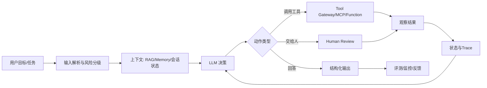
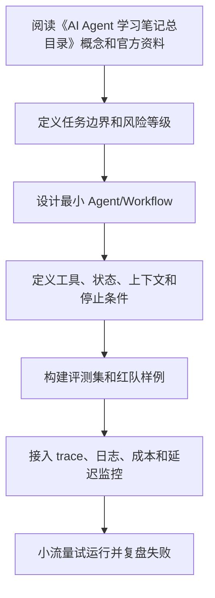

# AI Agent 学习笔记总目录

<!-- lecture-notes:integrated-v2 -->

## 讲义导读：把 Agent 放进工程闭环

这一章讲的是 **AI Agent 学习笔记总目录**。学习 AI Agent 时最容易犯的错误，是把所有新名词都看成“更高级的聊天机器人功能”。更稳妥的学法是：先看它解决什么工程问题，再看它把模型、工具、上下文、状态、评测和安全中的哪一环变得更清楚。

### 一句话先懂

这不是普通目录页，而是 AI Agent 的总地图：先帮你知道每章解决哪类问题，再决定按什么顺序学。

### 通俗类比

可以把这份目录想成一张“课程地图”。概念基础是地图图例，Prompt 是沟通语言，工具和 MCP 是手脚，RAG 与 Memory 是资料柜，规划与工作流是行程安排，评测和安全是刹车与仪表盘。

类比只是入门扶手，不是严格定义。真正掌握时，要把类比重新落回本章的准确术语、流程、接口、状态、权限、评测指标和失败现象上。只停留在“感觉懂了”很危险；能画流程、能举反例、能解释失败原因，才算真正学会。

### 本章学习主线

1. **先看边界**：这章讨论的是模型能力、工具能力、上下文能力、控制流能力，还是上线治理能力？
2. **再看接口**：输入从哪里来，输出给谁用，中间状态如何保存，工具或外部系统如何接入？
3. **然后看失败**：如果模型答错、工具失败、检索不到、权限不足、成本超限或用户意图不清，系统应该怎么表现？
4. **接着看证据**：用什么 trace、日志、评测样例、人工审查或线上指标证明它真的有效？
5. **最后看取舍**：什么时候应该用简单 Workflow，什么时候才值得引入更自治的 Agent？

### 概念怎么学才不容易忘

遇到重要概念时，建议按“白话解释 -> 工程定义 -> 最小例子 -> 失败样例 -> 上线检查”五步走。比如看到 Tool Calling，先说清它为什么让模型能做事，再看 schema、权限和错误语义；看到 RAG，先说清它为什么补充外部知识，再看切分、召回、重排、引用和无答案策略；看到多 Agent，先说清为什么单 Agent 不够，再看通信、共享状态和停止条件。

### 最小实践任务

读完整个目录后，画一张自己的 Agent 学习路线图：用箭头标出“模型 -> 工具 -> 状态 -> 评测 -> 安全 -> 上线”的关系，并给每章写一个最小练习。

实践时要刻意保留失败样本。很多 Agent 知识真正变清楚，不是在第一次跑通时，而是在你看到它如何失败、如何报错、如何恢复时。建议记录：输入是什么，期望输出是什么，实际 trace 是什么，失败属于模型、工具、检索、权限、状态还是业务规则，下一次如何更快判断。

### 读完本章应该能产出

能按任务复杂度选择阅读顺序；能说明每章之间的依赖关系；能把一个 Agent 项目拆成模型、工具、状态、评测、安全和运维几个部分。

> 本节是全篇讲义化改写的阅读入口，后续正文中的定义、步骤、示例和参考资料都应围绕这条学习主线来理解。
本目录是一份独立的 AI Agent 系统化学习笔记，适合从 LLM 应用开发过渡到 Agent 工程实践。内容按章节拆分，便于后续单独复习、扩展为博客文章或沉淀为团队内部文档。

> 说明：本笔记不修改仓库中已有 AI、MCP、RAG 或 LangChain 相关文章，只作为独立学习资料补充。

## 适合读者

- 已经理解大模型、Prompt、RAG 的基本概念，想进一步掌握 Agent。
- 想把“能演示的 Agent”推进到“可评测、可观测、可上线的 Agent”。
- 需要理解 ReAct、Tool Calling、MCP、Memory、Planner、Workflow、多智能体等概念之间的关系。
- 想在 OpenAI Agents SDK、LangChain、LangGraph、LlamaIndex、AutoGen、CrewAI 等方案之间做技术选型。

## 学习路径

建议按以下顺序阅读：

1. `01-concepts.md`：理解 Agent 的定义、边界和适用场景。
2. `02-llm-and-prompting.md`：理解 LLM 能力、提示工程和上下文管理。
3. `03-agent-architecture.md`：建立 Agent 系统的整体架构模型。
4. `04-tools-function-calling-mcp.md`：掌握工具调用、函数调用和 MCP。
5. `05-rag-and-memory.md`：区分 RAG、短期记忆、长期记忆和状态。
6. `06-planning-workflow-execution.md`：理解规划、工作流和执行控制。
7. `07-multi-agent.md`：学习多智能体协作模式和常见风险。
8. `08-evaluation-observability.md`：建立评测、日志、追踪和回放体系。
9. `09-safety-and-risk-control.md`：掌握权限、注入攻击、数据泄露和安全边界。
10. `10-engineering-and-production.md`：学习生产化架构、部署、成本和可靠性。
11. `11-framework-selection.md`：对比主流框架和选型策略。
12. `12-project-roadmap.md`：按阶段完成实战项目。
13. `13-reference.md`：查看官方资料和延伸阅读。
14. `14-production-agent-playbook.md`：补充生产级 Agent 的工程化方法、架构图、工具设计、RAG、评测、安全和落地清单。

## Agent 的一句话理解

AI Agent 不是“更长的 Prompt”，而是一个由模型驱动、带有目标、状态、工具、反馈和执行循环的系统。它能在有限约束下观察环境、制定下一步、调用工具、读取结果、修正计划，并最终交付任务结果。

## 核心知识地图

```text
AI Agent
├─ 模型层
│  ├─ LLM / 多模态模型
│  ├─ 推理能力
│  ├─ 上下文窗口
│  └─ 结构化输出
├─ 交互层
│  ├─ Prompt
│  ├─ System 指令
│  ├─ Few-shot 示例
│  └─ 用户意图澄清
├─ 工具层
│  ├─ Function Calling
│  ├─ API / 数据库 / 文件系统
│  ├─ 浏览器 / 终端 / 搜索
│  └─ MCP
├─ 知识与记忆
│  ├─ RAG
│  ├─ 短期状态
│  ├─ 长期记忆
│  └─ 用户画像
├─ 控制层
│  ├─ Planner
│  ├─ Workflow
│  ├─ ReAct
│  ├─ Reflection
│  └─ Human-in-the-loop
├─ 评测与观测
│  ├─ 离线评测
│  ├─ 在线指标
│  ├─ Trace
│  ├─ 回放
│  └─ 成本与延迟
└─ 安全与治理
   ├─ 权限边界
   ├─ Prompt Injection
   ├─ 数据脱敏
   ├─ 审批流
   └─ 审计日志
```

## 建议补充阅读

如果已经读完前 13 章，建议继续阅读 `14-production-agent-playbook.md`。这一章更偏工程落地，把前面分散的概念串成一套可执行方法：

- 如何判断需求应该用 Workflow、Agent，还是普通 LLM 调用。
- 如何设计 Agent Runtime、状态机、工具注册表、权限层和 trace。
- 如何写出更适合模型使用的工具 schema、错误语义和返回结构。
- 如何把 RAG、Memory、Human-in-the-loop、Guardrails 和评测系统组合起来。
- 如何从 Demo 逐步演进到可上线、可回放、可审计、可控成本的系统。

## 学习时要避免的误区

### 误区一：Agent 越自主越高级

实际工程中，越自主的系统越难预测、难评测、难控成本。生产系统通常采用“模型自主判断”和“确定性流程控制”结合的方式：让模型处理语义、规划和异常，但让代码负责权限、状态、预算、重试、幂等和审批。

### 误区二：有工具调用就是 Agent

工具调用只是 Agent 的组成部分。一个只有一次 Function Calling 的问答接口，更准确地说是“带工具的 LLM 应用”。Agent 通常还需要多步执行、状态管理、反馈循环和目标驱动。

### 误区三：只要加 RAG 就能解决幻觉

RAG 能改善知识来源和可追溯性，但不能自动保证答案正确。检索失败、切片错误、排序错误、上下文过长、模型忽略证据，都可能造成错误结果。因此 RAG 必须配合引用、置信度、评测集和失败兜底。

### 误区四：多智能体一定优于单 Agent

多 Agent 会引入通信成本、角色漂移、循环争论、责任不清和调试困难。只有当任务天然需要分工、审查、竞争或并行处理时，多 Agent 才有明显价值。

## 推荐的学习节奏

第一阶段：理解概念，能手写一个简单 ReAct Agent。

第二阶段：掌握工具调用、结构化输出、RAG 和状态管理。

第三阶段：把 Agent 改造成可评测、可追踪、可回放的工程系统。

第四阶段：加入权限、审批、成本预算和异常恢复。

第五阶段：完成一个真实项目，例如代码助手、知识库问答、运营分析助手或自动化办公助手。

## 最小可行 Agent 能力清单

- 能接收用户目标并拆解任务。
- 能在必要时调用工具，而不是只凭模型回答。
- 能检查工具结果并决定下一步。
- 能保存任务状态，支持失败恢复。
- 能输出结构化结果，便于下游系统使用。
- 能记录 trace，支持问题复盘。
- 能设置最大步数、最大成本、最大时长。
- 能在高风险操作前请求人工确认。

---

## 万字精讲扩展（2026-06-16 更新）
> Last researched: 2026-06-16。本文补充内容以 OpenAI、Anthropic、MCP、LangGraph、LlamaIndex、AutoGen、CrewAI、Microsoft Agent Framework、Langfuse 等官方或厂商资料为主；Agent 生态变化很快，真实项目应继续核对模型、SDK、框架和安全策略的最新版本。

### 本章在 AI Agent 学习路线中的位置

《AI Agent 学习笔记总目录》是 Agent 工程能力链条中的一个环节。Agent 不是单次模型调用，也不是一个框架名，而是模型、工具、上下文、状态、规划、执行、评测、安全和可观测性组合成的系统。学习本章时，不要只问“这个概念是什么”，还要问“它如何被测试、如何被限制、如何被观测、如何在失败时恢复”。

本章学习完成后，至少应达到三个标准。第一，能说明该主题给 Agent 增加了什么能力，以及什么时候不该使用。第二，能设计一个最小 demo，并明确工具、状态、停止条件和失败处理。第三，能用 trace 和评测样例证明改动有效。没有评测和可观测性的 Agent，只是难以维护的黑箱。

### 路线与总览类笔记的精讲重点

学习路线应从“增强型 LLM”开始，而不是从“全自动 Agent”开始。第一阶段掌握模型调用、结构化输出、提示分层、上下文管理和评测；第二阶段掌握工具调用、MCP、权限、工具结果压缩和失败处理；第三阶段掌握 RAG、Memory、规划、工作流和 Human-in-the-loop；第四阶段再学习多 Agent、框架选型、生产监控、安全治理和成本优化。每一阶段都要有一个可运行项目和一组评测样例。

总览类笔记要明确 Agent 的能力边界：模型不能保证事实正确，工具调用需要权限和参数校验，记忆会污染，RAG 会召回错误或缺失，规划会偏离目标，多 Agent 会增加成本和协调复杂度。路线越清楚，越不容易被框架宣传带偏。

### Agent 学习的底层方法：把“智能”拆成可控工程循环

AI Agent 最容易被讲成一个模糊概念：模型会思考、会调用工具、会自己完成任务。工程上更可靠的理解是：Agent 是围绕模型构建的运行时系统，它接收目标和上下文，选择下一步动作，调用工具或查询记忆，观察结果，再决定继续、交给人、回滚或停止。这个循环看起来像自主行为，但每一步都应该有边界：允许调用哪些工具，工具参数如何校验，结果如何压缩，失败如何重试，什么时候必须让人审批，什么时候停止，怎样记录 trace，怎样评测结果是否可靠。

学习 Agent 不要从“多智能体”和“全自动”开始，而要从一个增强型 LLM 开始：一个模型、一个清晰任务、一个结构化输出、一个只读工具、一组评测样例。只有这个最小闭环稳定以后，再引入写操作、RAG、Memory、规划器、工作流、多 Agent、异步任务和生产监控。Anthropic 的 effective agents 文章也强调，很多生产系统更适合简单、可组合、可预测的工作流，而不是一开始就追求复杂自治。OpenAI Agents SDK 的文档同样把工具、handoff、state、guardrails、tracing、evals 作为可组合能力，而不是把 Agent 当成黑箱。

### Agent 运行时闭环



Figure: 生产级 Agent 运行时闭环，综合 OpenAI Agents SDK、Anthropic effective agents、MCP、LangGraph/LlamaIndex/CrewAI/AutoGen 文档整理。

这个图的重点是：模型不是系统的全部，工具也不是简单函数。生产 Agent 至少需要输入治理、上下文治理、工具治理、执行治理、结果治理和可观测性。没有这些工程层，Agent 在 demo 中看起来可用，但上线后会遇到成本不可控、延迟过高、工具误用、权限越界、提示注入、RAG 幻觉、记忆污染、不可复现、无法回放和无法评测的问题。

### Workflow 和 Agent 要分清

Workflow 是预定义控制流，适合流程稳定、责任明确、风险可控的任务；Agent 是模型在运行中选择步骤和工具，适合路径不固定、需要动态探索、需要根据观察调整策略的任务。很多企业场景应该采用“workflow + agent”的混合结构：用 workflow 固定高风险主流程，用 Agent 处理信息抽取、检索、草拟、分类、诊断和建议；写操作、外部发送、转账、删除、审批、发布等动作由规则、权限和人审控制。

一个实用判断是：如果任务步骤稳定，优先 workflow；如果任务需要在多个信息源中探索，才考虑 Agent；如果任务有高风险写操作，必须加入审批和回滚；如果任务没有明确评测标准，不要急于自动化。Agent 不是所有 LLM 应用的升级版，很多问答、摘要、抽取和分类任务用普通链式调用更稳、更便宜、更容易测。

### 评测先于复杂化

Agent 系统引入工具和循环后，失败模式会指数增加。一个普通 LLM 调用只需要评估答案质量，Agent 还要评估步骤选择、工具参数、工具结果理解、是否过度调用、是否遗漏验证、是否遵守权限、是否正确停止。OpenAI agent evals 文档强调 trace 级评估，因为 trace 能展示模型调用、工具调用、handoff、guardrails 和自定义 span。没有 trace，就很难知道失败来自提示、检索、工具、模型、权限还是业务规则。

建议每个 Agent 项目从第一天就建立评测集。评测样例至少包括成功路径、边界路径、恶意输入、缺失信息、工具失败、权限不足、长上下文、重复请求和成本压力。每次改 prompt、模型、工具 schema、RAG 切分、memory 策略或框架版本，都跑回归评测。没有评测的 Agent 优化，很容易变成“这次看起来更聪明”的主观判断。

### 核心知识点逐条精讲

#### 1. 学习路径

在《AI Agent 学习笔记总目录》中，`学习路径` 要从“能力、边界、证据、风险”四个角度理解。能力回答它能带来什么增量，例如让模型调用工具、访问知识、规划任务或协作执行；边界回答什么时候不该使用它，例如普通确定性流程、低风险固定任务或无法评测的任务；证据回答如何证明它有效，例如 trace、评测集、人工审查、工具调用日志和线上指标；风险回答失败后会造成什么后果，例如成本升高、权限越界、数据泄露、错误操作或用户误信。

实践中，`学习路径` 不应该只写成概念，而要落到可配置对象和测试样例。比如工具要有 schema、权限、超时、错误码和 mock；RAG 要有切分、召回、重排、引用和无答案策略；Memory 要有写入规则、过期规则、用户可见和纠错机制；Planner 要有最大步数、停止条件和验证器；多 Agent 要有通信格式、共享状态和冲突解决。每个对象都应能被单独测试，并能在 trace 里被观察。

生产判断上，`学习路径` 的默认策略应是先简单、后复杂，先只读、后写入，先人工审批、后自动化，先评测、后扩展。Agent 系统最大的风险不是模型“不够聪明”，而是系统把不稳定能力放进了不可控场景。真正可靠的 Agent 往往是被明确边界、工具权限、工作流状态和评测体系约束出来的。

#### 2. 核心知识地图

在《AI Agent 学习笔记总目录》中，`核心知识地图` 要从“能力、边界、证据、风险”四个角度理解。能力回答它能带来什么增量，例如让模型调用工具、访问知识、规划任务或协作执行；边界回答什么时候不该使用它，例如普通确定性流程、低风险固定任务或无法评测的任务；证据回答如何证明它有效，例如 trace、评测集、人工审查、工具调用日志和线上指标；风险回答失败后会造成什么后果，例如成本升高、权限越界、数据泄露、错误操作或用户误信。

实践中，`核心知识地图` 不应该只写成概念，而要落到可配置对象和测试样例。比如工具要有 schema、权限、超时、错误码和 mock；RAG 要有切分、召回、重排、引用和无答案策略；Memory 要有写入规则、过期规则、用户可见和纠错机制；Planner 要有最大步数、停止条件和验证器；多 Agent 要有通信格式、共享状态和冲突解决。每个对象都应能被单独测试，并能在 trace 里被观察。

生产判断上，`核心知识地图` 的默认策略应是先简单、后复杂，先只读、后写入，先人工审批、后自动化，先评测、后扩展。Agent 系统最大的风险不是模型“不够聪明”，而是系统把不稳定能力放进了不可控场景。真正可靠的 Agent 往往是被明确边界、工具权限、工作流状态和评测体系约束出来的。

#### 3. 最小可行 Agent

在《AI Agent 学习笔记总目录》中，`最小可行 Agent` 要从“能力、边界、证据、风险”四个角度理解。能力回答它能带来什么增量，例如让模型调用工具、访问知识、规划任务或协作执行；边界回答什么时候不该使用它，例如普通确定性流程、低风险固定任务或无法评测的任务；证据回答如何证明它有效，例如 trace、评测集、人工审查、工具调用日志和线上指标；风险回答失败后会造成什么后果，例如成本升高、权限越界、数据泄露、错误操作或用户误信。

实践中，`最小可行 Agent` 不应该只写成概念，而要落到可配置对象和测试样例。比如工具要有 schema、权限、超时、错误码和 mock；RAG 要有切分、召回、重排、引用和无答案策略；Memory 要有写入规则、过期规则、用户可见和纠错机制；Planner 要有最大步数、停止条件和验证器；多 Agent 要有通信格式、共享状态和冲突解决。每个对象都应能被单独测试，并能在 trace 里被观察。

生产判断上，`最小可行 Agent` 的默认策略应是先简单、后复杂，先只读、后写入，先人工审批、后自动化，先评测、后扩展。Agent 系统最大的风险不是模型“不够聪明”，而是系统把不稳定能力放进了不可控场景。真正可靠的 Agent 往往是被明确边界、工具权限、工作流状态和评测体系约束出来的。

#### 4. 能力边界

在《AI Agent 学习笔记总目录》中，`能力边界` 要从“能力、边界、证据、风险”四个角度理解。能力回答它能带来什么增量，例如让模型调用工具、访问知识、规划任务或协作执行；边界回答什么时候不该使用它，例如普通确定性流程、低风险固定任务或无法评测的任务；证据回答如何证明它有效，例如 trace、评测集、人工审查、工具调用日志和线上指标；风险回答失败后会造成什么后果，例如成本升高、权限越界、数据泄露、错误操作或用户误信。

实践中，`能力边界` 不应该只写成概念，而要落到可配置对象和测试样例。比如工具要有 schema、权限、超时、错误码和 mock；RAG 要有切分、召回、重排、引用和无答案策略；Memory 要有写入规则、过期规则、用户可见和纠错机制；Planner 要有最大步数、停止条件和验证器；多 Agent 要有通信格式、共享状态和冲突解决。每个对象都应能被单独测试，并能在 trace 里被观察。

生产判断上，`能力边界` 的默认策略应是先简单、后复杂，先只读、后写入，先人工审批、后自动化，先评测、后扩展。Agent 系统最大的风险不是模型“不够聪明”，而是系统把不稳定能力放进了不可控场景。真正可靠的 Agent 往往是被明确边界、工具权限、工作流状态和评测体系约束出来的。

#### 5. 学习误区

在《AI Agent 学习笔记总目录》中，`学习误区` 要从“能力、边界、证据、风险”四个角度理解。能力回答它能带来什么增量，例如让模型调用工具、访问知识、规划任务或协作执行；边界回答什么时候不该使用它，例如普通确定性流程、低风险固定任务或无法评测的任务；证据回答如何证明它有效，例如 trace、评测集、人工审查、工具调用日志和线上指标；风险回答失败后会造成什么后果，例如成本升高、权限越界、数据泄露、错误操作或用户误信。

实践中，`学习误区` 不应该只写成概念，而要落到可配置对象和测试样例。比如工具要有 schema、权限、超时、错误码和 mock；RAG 要有切分、召回、重排、引用和无答案策略；Memory 要有写入规则、过期规则、用户可见和纠错机制；Planner 要有最大步数、停止条件和验证器；多 Agent 要有通信格式、共享状态和冲突解决。每个对象都应能被单独测试，并能在 trace 里被观察。

生产判断上，`学习误区` 的默认策略应是先简单、后复杂，先只读、后写入，先人工审批、后自动化，先评测、后扩展。Agent 系统最大的风险不是模型“不够聪明”，而是系统把不稳定能力放进了不可控场景。真正可靠的 Agent 往往是被明确边界、工具权限、工作流状态和评测体系约束出来的。


### 场景化学习与排错表

| 主题 | 推荐动作 | 常见风险 | 验证方式 |
| :--- | :--- | :--- | :--- |
| 学习路径 | 先定义任务边界和成功标准，再设计工具/状态/评测，最后接入生产监控 | 直接堆框架、缺少评测、工具权限过大、没有停止条件、无法回放 | 单元测试、工具 mock、trace 回放、黄金集评测、红队样例、线上指标 |
| 核心知识地图 | 先定义任务边界和成功标准，再设计工具/状态/评测，最后接入生产监控 | 直接堆框架、缺少评测、工具权限过大、没有停止条件、无法回放 | 单元测试、工具 mock、trace 回放、黄金集评测、红队样例、线上指标 |
| 最小可行 Agent | 先定义任务边界和成功标准，再设计工具/状态/评测，最后接入生产监控 | 直接堆框架、缺少评测、工具权限过大、没有停止条件、无法回放 | 单元测试、工具 mock、trace 回放、黄金集评测、红队样例、线上指标 |
| 能力边界 | 先定义任务边界和成功标准，再设计工具/状态/评测，最后接入生产监控 | 直接堆框架、缺少评测、工具权限过大、没有停止条件、无法回放 | 单元测试、工具 mock、trace 回放、黄金集评测、红队样例、线上指标 |
| 学习误区 | 先定义任务边界和成功标准，再设计工具/状态/评测，最后接入生产监控 | 直接堆框架、缺少评测、工具权限过大、没有停止条件、无法回放 | 单元测试、工具 mock、trace 回放、黄金集评测、红队样例、线上指标 |

这张表的重点是把 Agent 能力变成可验证工程对象。很多 Agent demo 的问题不是不能成功一次，而是失败时没有证据、无法复现、无法回滚、无法量化改进。每个主题都应该对应 trace、评测样例、权限策略和失败处理。

### 本章建议工作流



Figure: 《AI Agent 学习笔记总目录》学习和落地工作流，综合 OpenAI Agents SDK、Anthropic effective agents、MCP、LangGraph、LlamaIndex、AutoGen、CrewAI 和 Langfuse 资料整理。

这个流程避免“先做复杂系统再补治理”。Agent 项目越早接入评测和可观测性，越容易知道改动是否有效。复杂能力如多 Agent、长期记忆、自动写操作和长任务执行，都应该在最小闭环稳定后再引入。

### 常见误区和纠正方法

- 误区：把 Agent 等同于聊天机器人。纠正：Agent 的关键是多步执行、工具使用、状态和反馈循环，普通问答不一定需要 Agent。
- 误区：一开始就多 Agent。纠正：先用单 Agent 或 workflow 解决问题，只有职责清晰、可评测、可观测时再拆多 Agent。
- 误区：把所有治理写进 prompt。纠正：权限、schema、验证器、审批、沙箱、审计和回滚应由系统实现，prompt 只是其中一层。
- 误区：没有评测就调 prompt。纠正：每次改模型、prompt、工具、RAG 或框架，都应跑回归评测和 trace 对比。
- 误区：工具越多越好。纠正：工具越多，选择错误和权限越界风险越高；工具应职责清晰、可组合、可测试、可审计。
- 误区：Memory 永远有益。纠正：记忆会污染、过期、泄露隐私，也可能强化错误偏好；必须有写入、读取、纠错和删除策略。

### 与相邻章节的关系

《AI Agent 学习笔记总目录》应与提示工程、工具/MCP、RAG/Memory、规划执行、评测、安全和生产工程章节联动。Prompt 决定模型如何理解任务，工具决定它能做什么，RAG 和 Memory 决定上下文，规划执行决定任务如何推进，评测和可观测性决定能否改进，安全风控决定能否上线。任何单点能力脱离这些关系，都容易变成 demo 级系统。

### 实操训练和复盘模板

1. 围绕 `学习路径` 做一个最小实验：写成功样例、失败样例、trace 观察点和评测标准。
2. 围绕 `核心知识地图` 做一个最小实验：写成功样例、失败样例、trace 观察点和评测标准。
3. 围绕 `最小可行 Agent` 做一个最小实验：写成功样例、失败样例、trace 观察点和评测标准。
4. 围绕 `能力边界` 做一个最小实验：写成功样例、失败样例、trace 观察点和评测标准。
5. 围绕 `学习误区` 做一个最小实验：写成功样例、失败样例、trace 观察点和评测标准。

建议每个 Agent 练习都按下面格式复盘：

```text
项目名称：
本章主题：AI Agent 学习笔记总目录
任务边界：用户目标、允许动作、禁止动作
模型和框架版本：
工具列表：名称、schema、权限、超时、错误码、mock
上下文来源：RAG、Memory、会话状态、用户输入、系统配置
执行控制：最大步数、最大成本、停止条件、重试和人审
评测样例：成功、失败、边界、恶意、工具异常、缺少信息
Trace 观察：模型调用、工具调用、handoff、guardrail、成本、延迟
失败原因：prompt / retrieval / tool / model / permission / business rule
改进动作：
上线风险：
```

这个模板能把 Agent 学习从“能跑 demo”推进到“能解释和治理”。生产级 Agent 最重要的不是一次成功输出，而是每次失败都能定位原因，每次改动都能通过评测验证。

## 参考资料与延伸阅读

- [Official / OpenAI] Agents SDK guide: https://developers.openai.com/api/docs/guides/agents
- [Official / OpenAI] Agents SDK quickstart: https://developers.openai.com/api/docs/guides/agents/quickstart
- [Official / OpenAI] Running agents: https://developers.openai.com/api/docs/guides/agents/running-agents
- [Official / OpenAI] Orchestration and handoffs: https://developers.openai.com/api/docs/guides/agents/orchestration
- [Official / OpenAI] Results and state: https://developers.openai.com/api/docs/guides/agents/results
- [Official / OpenAI] Integrations and observability: https://developers.openai.com/api/docs/guides/agents/integrations-observability
- [Official / OpenAI] Evaluate agent workflows: https://developers.openai.com/api/docs/guides/agent-evals
- [Official / OpenAI Developers] Agents learning hub: https://developers.openai.com/learn/agents
- [Official / Anthropic] Building Effective Agents: https://www.anthropic.com/research/building-effective-agents
- [Official / Anthropic] Writing effective tools for AI agents: https://www.anthropic.com/engineering/writing-tools-for-agents
- [Official / MCP] Model Context Protocol introduction: https://modelcontextprotocol.io/docs/getting-started/intro
- [Official / MCP] MCP specification 2025-11-25 - Tools: https://modelcontextprotocol.io/specification/2025-11-25/server/tools
- [Official / LangChain] LangGraph overview: https://docs.langchain.com/oss/python/langgraph/overview
- [Official / LangChain] LangGraph product page: https://www.langchain.com/langgraph
- [Official / LlamaIndex] Developer documentation: https://developers.llamaindex.ai/python/framework/
- [Official / LlamaIndex] Agent memory: https://developers.llamaindex.ai/python/framework/module_guides/deploying/agents/memory/
- [Official / LlamaIndex] Agentic RAG architecture guide: https://www.llamaindex.ai/blog/agentic-rag-with-llamaindex-2721b8a49ff6
- [Official / Microsoft] AutoGen stable documentation: https://microsoft.github.io/autogen/stable//index.html
- [Official / Microsoft] Microsoft Agent Framework overview: https://learn.microsoft.com/en-us/agent-framework/overview/
- [Official / Microsoft Research] AutoGen project: https://www.microsoft.com/en-us/research/project/autogen/
- [Official / CrewAI] CrewAI documentation: https://docs.crewai.com/
- [Official / CrewAI] Agents: https://docs.crewai.com/en/concepts/agents
- [Official / CrewAI] Crews: https://docs.crewai.com/en/concepts/crews
- [Official / CrewAI] Flows: https://docs.crewai.com/en/concepts/flows
- [Vendor / Langfuse] AI Agent Observability, Tracing & Evaluation: https://langfuse.com/blog/2024-07-ai-agent-observability-with-langfuse
- [Community / CSDN] AI Agent 学习笔记检索入口: https://so.csdn.net/so/search?q=AI%20Agent%20%E5%AD%A6%E4%B9%A0%E7%AC%94%E8%AE%B0%20RAG%20MCP
- [Community / 博客园] Agent、RAG、MCP 实践检索入口: https://zzk.cnblogs.com/s/blogpost?Keywords=AI%20Agent%20RAG%20MCP
- [Community / 掘金] AI Agent 工程化与 LangGraph 实践检索入口: https://juejin.cn/search?query=AI%20Agent%20LangGraph%20MCP%20RAG&type=0
