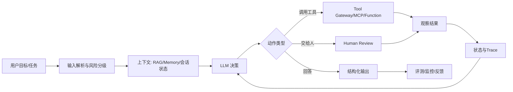
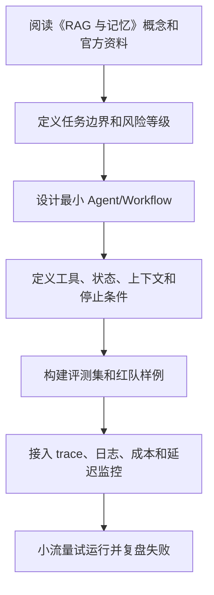

# 05. RAG 与记忆

<!-- lecture-notes:integrated-v2 -->

## 讲义导读：把 Agent 放进工程闭环

这一章讲的是 **05. RAG 与记忆**。学习 AI Agent 时最容易犯的错误，是把所有新名词都看成“更高级的聊天机器人功能”。更稳妥的学法是：先看它解决什么工程问题，再看它把模型、工具、上下文、状态、评测和安全中的哪一环变得更清楚。

### 一句话先懂

RAG 是临时查资料，Memory 是把值得保留的信息沉淀下来；两者都不是把所有内容塞进上下文。

### 通俗类比

RAG 像去图书馆查书，Memory 像个人笔记本。查书强调来源、召回和引用；笔记强调写入规则、过期、纠错和隐私。把两者混用，就会让 Agent 既记错又查不准。

类比只是入门扶手，不是严格定义。真正掌握时，要把类比重新落回本章的准确术语、流程、接口、状态、权限、评测指标和失败现象上。只停留在“感觉懂了”很危险；能画流程、能举反例、能解释失败原因，才算真正学会。

### 本章学习主线

1. **先看边界**：这章讨论的是模型能力、工具能力、上下文能力、控制流能力，还是上线治理能力？
2. **再看接口**：输入从哪里来，输出给谁用，中间状态如何保存，工具或外部系统如何接入？
3. **然后看失败**：如果模型答错、工具失败、检索不到、权限不足、成本超限或用户意图不清，系统应该怎么表现？
4. **接着看证据**：用什么 trace、日志、评测样例、人工审查或线上指标证明它真的有效？
5. **最后看取舍**：什么时候应该用简单 Workflow，什么时候才值得引入更自治的 Agent？

### 概念怎么学才不容易忘

遇到重要概念时，建议按“白话解释 -> 工程定义 -> 最小例子 -> 失败样例 -> 上线检查”五步走。比如看到 Tool Calling，先说清它为什么让模型能做事，再看 schema、权限和错误语义；看到 RAG，先说清它为什么补充外部知识，再看切分、召回、重排、引用和无答案策略；看到多 Agent，先说清为什么单 Agent 不够，再看通信、共享状态和停止条件。

### 最小实践任务

为一个知识库问答 Agent 设计检索、重排、引用、无答案策略，再单独设计哪些用户偏好可以进入长期记忆。

实践时要刻意保留失败样本。很多 Agent 知识真正变清楚，不是在第一次跑通时，而是在你看到它如何失败、如何报错、如何恢复时。建议记录：输入是什么，期望输出是什么，实际 trace 是什么，失败属于模型、工具、检索、权限、状态还是业务规则，下一次如何更快判断。

### 读完本章应该能产出

能区分上下文、短期状态、长期记忆和检索知识；能说明 chunk、embedding、rerank、citation 的作用；能设计记忆写入和删除规则。

> 本节是全篇讲义化改写的阅读入口，后续正文中的定义、步骤、示例和参考资料都应围绕这条学习主线来理解。

## RAG 与 Memory 的区别

RAG 是 Retrieval-Augmented Generation，核心是从外部知识库检索相关资料，再让模型基于资料回答。

Memory 是 Agent 对任务状态、用户偏好、历史事实和长期经验的保存与使用。

二者区别：

| 对比项 | RAG | Memory |
| --- | --- | --- |
| 目标 | 引入外部知识 | 保持连续性和个性化 |
| 数据来源 | 文档、网页、知识库、数据库 | 会话、任务、用户行为、结果反馈 |
| 更新频率 | 可批量更新 | 通常随交互持续更新 |
| 使用方式 | 根据问题检索 | 根据用户和任务上下文加载 |
| 风险 | 检索不准、证据错误 | 隐私、过期、错误记忆 |

## RAG 在 Agent 中的作用

Agent 使用 RAG 的常见场景：

- 查询企业制度和产品文档。
- 查找代码库背景知识。
- 阅读历史工单和客户记录。
- 从文档中抽取操作依据。
- 为研究报告提供来源。

RAG 不是 Agent 必需组件，但对知识密集型 Agent 很重要。

## RAG 基本流程

```text
文档采集
  ↓
清洗和切分
  ↓
向量化或索引
  ↓
用户查询改写
  ↓
召回候选片段
  ↓
重排序
  ↓
上下文压缩
  ↓
生成答案
  ↓
引用与评测
```

## 文档切分

切分质量直接影响检索质量。

常见切分方式：

- 固定长度切分。
- 按标题层级切分。
- 按段落切分。
- 按语义切分。
- 按代码结构切分。

好的 chunk 应该：

- 语义完整。
- 长度适中。
- 包含必要标题路径。
- 保留来源信息。
- 避免跨主题混杂。

## 检索策略

### 向量检索

适合语义相似问题，例如“如何配置登录超时”检索“会话过期设置”。

### 关键词检索

适合专有名词、错误码、函数名、配置项、ID。

### 混合检索

结合向量和关键词，通常比单一方式更稳。

### 查询改写

Agent 可以先把用户问题改写成更适合检索的查询。例如：

```text
原问题：这个报错怎么解决？
改写：错误码 E_CONN_RESET 在部署流水线中出现的原因和解决方法
```

## RAG 常见失败

### 检索不到

可能是 query 表达不对、索引缺失、切片过碎或 embedding 不适合领域。

### 检索到了错误内容

可能是语义相似但事实无关，或者关键词命中了旧版本文档。

### 检索内容太多

模型上下文被无关片段稀释，导致忽略关键证据。

### 模型不遵守证据

模型可能基于常识补全，输出没有来源支持的内容。

## RAG 答案约束

知识库问答应要求：

- 优先基于检索资料回答。
- 引用来源。
- 区分资料事实和模型推断。
- 找不到证据时明确说明。
- 不把旧版本文档当成当前事实。

示例输出结构：

```json
{
  "answer": "根据当前文档，推荐使用混合检索。",
  "sources": [
    {
      "title": "Search Design",
      "doc_id": "kb-1024",
      "chunk_id": "kb-1024-03"
    }
  ],
  "confidence": "medium",
  "unsupported_claims": []
}
```

## Agent Memory 类型

### 短期记忆

当前会话或当前任务所需信息，例如：

- 用户刚刚给出的需求。
- 已经调用过的工具。
- 当前计划。
- 待确认问题。

短期记忆通常存在会话状态中。

### 长期记忆

跨会话保存的信息，例如：

- 用户偏好。
- 项目背景。
- 常用工具。
- 历史决策。
- 反复出现的问题。

长期记忆必须可查看、可修改、可删除。

### 情景记忆

记录某个任务过程，例如：

- 任务目标。
- 关键步骤。
- 最终结果。
- 失败原因。

适合用于复盘和相似任务参考。

### 语义记忆

保存稳定事实，例如：

- 团队规范。
- 产品术语。
- API 约定。

语义记忆更像小型知识库。

## Memory 写入策略

不要把所有对话都写入长期记忆。应设置写入条件：

- 用户明确要求记住。
- 信息长期有效。
- 信息对后续任务有价值。
- 信息不涉及敏感隐私或已得到授权。
- 置信度足够高。

写入前可以让模型生成候选记忆，再由规则过滤。

## Memory 读取策略

读取记忆时要控制范围：

- 根据用户身份读取。
- 根据任务类型读取。
- 限制条数。
- 过滤过期记忆。
- 标注记忆来源和更新时间。

错误记忆比没有记忆更危险。

## Memory 安全

记忆系统必须支持：

- 用户查看。
- 用户删除。
- 用户纠正。
- 敏感信息过滤。
- 租户隔离。
- 权限检查。
- 过期策略。

尤其要避免把一个用户的信息泄露给另一个用户。

## RAG 与 Memory 的组合

常见组合：

- RAG 提供客观资料。
- Memory 提供用户偏好和任务历史。
- Agent 状态提供当前执行进度。

示例：

```text
用户：继续上次那个部署问题。
Memory：上次用户在排查 Kubernetes 滚动发布失败。
RAG：检索内部部署文档和错误码说明。
State：当前任务尚未开始，需要重新确认环境。
```

## 检查清单

- 是否区分 RAG、状态和长期记忆？
- 文档是否保留来源和版本？
- 检索是否支持关键词和语义混合？
- 是否有 rerank 或过滤？
- 找不到证据时是否会承认？
- 长期记忆是否可查看、可删除、可纠正？
- 是否有过期和权限策略？

---

## 万字精讲扩展（2026-06-16 更新）
> Last researched: 2026-06-16。本文补充内容以 OpenAI、Anthropic、MCP、LangGraph、LlamaIndex、AutoGen、CrewAI、Microsoft Agent Framework、Langfuse 等官方或厂商资料为主；Agent 生态变化很快，真实项目应继续核对模型、SDK、框架和安全策略的最新版本。

### 本章在 AI Agent 学习路线中的位置

《RAG 与记忆》是 Agent 工程能力链条中的一个环节。Agent 不是单次模型调用，也不是一个框架名，而是模型、工具、上下文、状态、规划、执行、评测、安全和可观测性组合成的系统。学习本章时，不要只问“这个概念是什么”，还要问“它如何被测试、如何被限制、如何被观测、如何在失败时恢复”。

本章学习完成后，至少应达到三个标准。第一，能说明该主题给 Agent 增加了什么能力，以及什么时候不该使用。第二，能设计一个最小 demo，并明确工具、状态、停止条件和失败处理。第三，能用 trace 和评测样例证明改动有效。没有评测和可观测性的 Agent，只是难以维护的黑箱。

### RAG 与 Memory 类笔记的精讲重点

RAG 和 Memory 都是给 Agent 提供上下文，但语义不同。RAG 面向外部知识检索，强调来源、召回、重排、引用和答案约束；Memory 面向用户、任务或长期偏好，强调写入策略、读取策略、过期、纠错和隐私。把所有历史都塞进上下文不是 Memory，把所有检索结果都直接喂给模型也不是可靠 RAG。

Agentic RAG 与普通 RAG 的区别在于，Agent 可以根据初始结果决定继续检索、换查询、调用其他工具或澄清问题。这样能力更强，但失败模式也更多：检索漂移、引用错配、工具过度调用、成本上升、上下文污染和安全泄漏。生产中应记录查询、召回文档、重排分数、引用片段、最终回答和用户反馈。

### Agent 学习的底层方法：把“智能”拆成可控工程循环

AI Agent 最容易被讲成一个模糊概念：模型会思考、会调用工具、会自己完成任务。工程上更可靠的理解是：Agent 是围绕模型构建的运行时系统，它接收目标和上下文，选择下一步动作，调用工具或查询记忆，观察结果，再决定继续、交给人、回滚或停止。这个循环看起来像自主行为，但每一步都应该有边界：允许调用哪些工具，工具参数如何校验，结果如何压缩，失败如何重试，什么时候必须让人审批，什么时候停止，怎样记录 trace，怎样评测结果是否可靠。

学习 Agent 不要从“多智能体”和“全自动”开始，而要从一个增强型 LLM 开始：一个模型、一个清晰任务、一个结构化输出、一个只读工具、一组评测样例。只有这个最小闭环稳定以后，再引入写操作、RAG、Memory、规划器、工作流、多 Agent、异步任务和生产监控。Anthropic 的 effective agents 文章也强调，很多生产系统更适合简单、可组合、可预测的工作流，而不是一开始就追求复杂自治。OpenAI Agents SDK 的文档同样把工具、handoff、state、guardrails、tracing、evals 作为可组合能力，而不是把 Agent 当成黑箱。

### Agent 运行时闭环



Figure: 生产级 Agent 运行时闭环，综合 OpenAI Agents SDK、Anthropic effective agents、MCP、LangGraph/LlamaIndex/CrewAI/AutoGen 文档整理。

这个图的重点是：模型不是系统的全部，工具也不是简单函数。生产 Agent 至少需要输入治理、上下文治理、工具治理、执行治理、结果治理和可观测性。没有这些工程层，Agent 在 demo 中看起来可用，但上线后会遇到成本不可控、延迟过高、工具误用、权限越界、提示注入、RAG 幻觉、记忆污染、不可复现、无法回放和无法评测的问题。

### Workflow 和 Agent 要分清

Workflow 是预定义控制流，适合流程稳定、责任明确、风险可控的任务；Agent 是模型在运行中选择步骤和工具，适合路径不固定、需要动态探索、需要根据观察调整策略的任务。很多企业场景应该采用“workflow + agent”的混合结构：用 workflow 固定高风险主流程，用 Agent 处理信息抽取、检索、草拟、分类、诊断和建议；写操作、外部发送、转账、删除、审批、发布等动作由规则、权限和人审控制。

一个实用判断是：如果任务步骤稳定，优先 workflow；如果任务需要在多个信息源中探索，才考虑 Agent；如果任务有高风险写操作，必须加入审批和回滚；如果任务没有明确评测标准，不要急于自动化。Agent 不是所有 LLM 应用的升级版，很多问答、摘要、抽取和分类任务用普通链式调用更稳、更便宜、更容易测。

### 评测先于复杂化

Agent 系统引入工具和循环后，失败模式会指数增加。一个普通 LLM 调用只需要评估答案质量，Agent 还要评估步骤选择、工具参数、工具结果理解、是否过度调用、是否遗漏验证、是否遵守权限、是否正确停止。OpenAI agent evals 文档强调 trace 级评估，因为 trace 能展示模型调用、工具调用、handoff、guardrails 和自定义 span。没有 trace，就很难知道失败来自提示、检索、工具、模型、权限还是业务规则。

建议每个 Agent 项目从第一天就建立评测集。评测样例至少包括成功路径、边界路径、恶意输入、缺失信息、工具失败、权限不足、长上下文、重复请求和成本压力。每次改 prompt、模型、工具 schema、RAG 切分、memory 策略或框架版本，都跑回归评测。没有评测的 Agent 优化，很容易变成“这次看起来更聪明”的主观判断。

### 核心知识点逐条精讲

#### 1. RAG 基本流程

在《RAG 与记忆》中，`RAG 基本流程` 要从“能力、边界、证据、风险”四个角度理解。能力回答它能带来什么增量，例如让模型调用工具、访问知识、规划任务或协作执行；边界回答什么时候不该使用它，例如普通确定性流程、低风险固定任务或无法评测的任务；证据回答如何证明它有效，例如 trace、评测集、人工审查、工具调用日志和线上指标；风险回答失败后会造成什么后果，例如成本升高、权限越界、数据泄露、错误操作或用户误信。

实践中，`RAG 基本流程` 不应该只写成概念，而要落到可配置对象和测试样例。比如工具要有 schema、权限、超时、错误码和 mock；RAG 要有切分、召回、重排、引用和无答案策略；Memory 要有写入规则、过期规则、用户可见和纠错机制；Planner 要有最大步数、停止条件和验证器；多 Agent 要有通信格式、共享状态和冲突解决。每个对象都应能被单独测试，并能在 trace 里被观察。

生产判断上，`RAG 基本流程` 的默认策略应是先简单、后复杂，先只读、后写入，先人工审批、后自动化，先评测、后扩展。Agent 系统最大的风险不是模型“不够聪明”，而是系统把不稳定能力放进了不可控场景。真正可靠的 Agent 往往是被明确边界、工具权限、工作流状态和评测体系约束出来的。

#### 2. 检索策略

在《RAG 与记忆》中，`检索策略` 要从“能力、边界、证据、风险”四个角度理解。能力回答它能带来什么增量，例如让模型调用工具、访问知识、规划任务或协作执行；边界回答什么时候不该使用它，例如普通确定性流程、低风险固定任务或无法评测的任务；证据回答如何证明它有效，例如 trace、评测集、人工审查、工具调用日志和线上指标；风险回答失败后会造成什么后果，例如成本升高、权限越界、数据泄露、错误操作或用户误信。

实践中，`检索策略` 不应该只写成概念，而要落到可配置对象和测试样例。比如工具要有 schema、权限、超时、错误码和 mock；RAG 要有切分、召回、重排、引用和无答案策略；Memory 要有写入规则、过期规则、用户可见和纠错机制；Planner 要有最大步数、停止条件和验证器；多 Agent 要有通信格式、共享状态和冲突解决。每个对象都应能被单独测试，并能在 trace 里被观察。

生产判断上，`检索策略` 的默认策略应是先简单、后复杂，先只读、后写入，先人工审批、后自动化，先评测、后扩展。Agent 系统最大的风险不是模型“不够聪明”，而是系统把不稳定能力放进了不可控场景。真正可靠的 Agent 往往是被明确边界、工具权限、工作流状态和评测体系约束出来的。

#### 3. RAG 失败模式

在《RAG 与记忆》中，`RAG 失败模式` 要从“能力、边界、证据、风险”四个角度理解。能力回答它能带来什么增量，例如让模型调用工具、访问知识、规划任务或协作执行；边界回答什么时候不该使用它，例如普通确定性流程、低风险固定任务或无法评测的任务；证据回答如何证明它有效，例如 trace、评测集、人工审查、工具调用日志和线上指标；风险回答失败后会造成什么后果，例如成本升高、权限越界、数据泄露、错误操作或用户误信。

实践中，`RAG 失败模式` 不应该只写成概念，而要落到可配置对象和测试样例。比如工具要有 schema、权限、超时、错误码和 mock；RAG 要有切分、召回、重排、引用和无答案策略；Memory 要有写入规则、过期规则、用户可见和纠错机制；Planner 要有最大步数、停止条件和验证器；多 Agent 要有通信格式、共享状态和冲突解决。每个对象都应能被单独测试，并能在 trace 里被观察。

生产判断上，`RAG 失败模式` 的默认策略应是先简单、后复杂，先只读、后写入，先人工审批、后自动化，先评测、后扩展。Agent 系统最大的风险不是模型“不够聪明”，而是系统把不稳定能力放进了不可控场景。真正可靠的 Agent 往往是被明确边界、工具权限、工作流状态和评测体系约束出来的。

#### 4. Memory 写入读取

在《RAG 与记忆》中，`Memory 写入读取` 要从“能力、边界、证据、风险”四个角度理解。能力回答它能带来什么增量，例如让模型调用工具、访问知识、规划任务或协作执行；边界回答什么时候不该使用它，例如普通确定性流程、低风险固定任务或无法评测的任务；证据回答如何证明它有效，例如 trace、评测集、人工审查、工具调用日志和线上指标；风险回答失败后会造成什么后果，例如成本升高、权限越界、数据泄露、错误操作或用户误信。

实践中，`Memory 写入读取` 不应该只写成概念，而要落到可配置对象和测试样例。比如工具要有 schema、权限、超时、错误码和 mock；RAG 要有切分、召回、重排、引用和无答案策略；Memory 要有写入规则、过期规则、用户可见和纠错机制；Planner 要有最大步数、停止条件和验证器；多 Agent 要有通信格式、共享状态和冲突解决。每个对象都应能被单独测试，并能在 trace 里被观察。

生产判断上，`Memory 写入读取` 的默认策略应是先简单、后复杂，先只读、后写入，先人工审批、后自动化，先评测、后扩展。Agent 系统最大的风险不是模型“不够聪明”，而是系统把不稳定能力放进了不可控场景。真正可靠的 Agent 往往是被明确边界、工具权限、工作流状态和评测体系约束出来的。

#### 5. RAG 与 Memory 组合

在《RAG 与记忆》中，`RAG 与 Memory 组合` 要从“能力、边界、证据、风险”四个角度理解。能力回答它能带来什么增量，例如让模型调用工具、访问知识、规划任务或协作执行；边界回答什么时候不该使用它，例如普通确定性流程、低风险固定任务或无法评测的任务；证据回答如何证明它有效，例如 trace、评测集、人工审查、工具调用日志和线上指标；风险回答失败后会造成什么后果，例如成本升高、权限越界、数据泄露、错误操作或用户误信。

实践中，`RAG 与 Memory 组合` 不应该只写成概念，而要落到可配置对象和测试样例。比如工具要有 schema、权限、超时、错误码和 mock；RAG 要有切分、召回、重排、引用和无答案策略；Memory 要有写入规则、过期规则、用户可见和纠错机制；Planner 要有最大步数、停止条件和验证器；多 Agent 要有通信格式、共享状态和冲突解决。每个对象都应能被单独测试，并能在 trace 里被观察。

生产判断上，`RAG 与 Memory 组合` 的默认策略应是先简单、后复杂，先只读、后写入，先人工审批、后自动化，先评测、后扩展。Agent 系统最大的风险不是模型“不够聪明”，而是系统把不稳定能力放进了不可控场景。真正可靠的 Agent 往往是被明确边界、工具权限、工作流状态和评测体系约束出来的。


### 场景化学习与排错表

| 主题 | 推荐动作 | 常见风险 | 验证方式 |
| :--- | :--- | :--- | :--- |
| RAG 基本流程 | 先定义任务边界和成功标准，再设计工具/状态/评测，最后接入生产监控 | 直接堆框架、缺少评测、工具权限过大、没有停止条件、无法回放 | 单元测试、工具 mock、trace 回放、黄金集评测、红队样例、线上指标 |
| 检索策略 | 先定义任务边界和成功标准，再设计工具/状态/评测，最后接入生产监控 | 直接堆框架、缺少评测、工具权限过大、没有停止条件、无法回放 | 单元测试、工具 mock、trace 回放、黄金集评测、红队样例、线上指标 |
| RAG 失败模式 | 先定义任务边界和成功标准，再设计工具/状态/评测，最后接入生产监控 | 直接堆框架、缺少评测、工具权限过大、没有停止条件、无法回放 | 单元测试、工具 mock、trace 回放、黄金集评测、红队样例、线上指标 |
| Memory 写入读取 | 先定义任务边界和成功标准，再设计工具/状态/评测，最后接入生产监控 | 直接堆框架、缺少评测、工具权限过大、没有停止条件、无法回放 | 单元测试、工具 mock、trace 回放、黄金集评测、红队样例、线上指标 |
| RAG 与 Memory 组合 | 先定义任务边界和成功标准，再设计工具/状态/评测，最后接入生产监控 | 直接堆框架、缺少评测、工具权限过大、没有停止条件、无法回放 | 单元测试、工具 mock、trace 回放、黄金集评测、红队样例、线上指标 |

这张表的重点是把 Agent 能力变成可验证工程对象。很多 Agent demo 的问题不是不能成功一次，而是失败时没有证据、无法复现、无法回滚、无法量化改进。每个主题都应该对应 trace、评测样例、权限策略和失败处理。

### 本章建议工作流



Figure: 《RAG 与记忆》学习和落地工作流，综合 OpenAI Agents SDK、Anthropic effective agents、MCP、LangGraph、LlamaIndex、AutoGen、CrewAI 和 Langfuse 资料整理。

这个流程避免“先做复杂系统再补治理”。Agent 项目越早接入评测和可观测性，越容易知道改动是否有效。复杂能力如多 Agent、长期记忆、自动写操作和长任务执行，都应该在最小闭环稳定后再引入。

### 常见误区和纠正方法

- 误区：把 Agent 等同于聊天机器人。纠正：Agent 的关键是多步执行、工具使用、状态和反馈循环，普通问答不一定需要 Agent。
- 误区：一开始就多 Agent。纠正：先用单 Agent 或 workflow 解决问题，只有职责清晰、可评测、可观测时再拆多 Agent。
- 误区：把所有治理写进 prompt。纠正：权限、schema、验证器、审批、沙箱、审计和回滚应由系统实现，prompt 只是其中一层。
- 误区：没有评测就调 prompt。纠正：每次改模型、prompt、工具、RAG 或框架，都应跑回归评测和 trace 对比。
- 误区：工具越多越好。纠正：工具越多，选择错误和权限越界风险越高；工具应职责清晰、可组合、可测试、可审计。
- 误区：Memory 永远有益。纠正：记忆会污染、过期、泄露隐私，也可能强化错误偏好；必须有写入、读取、纠错和删除策略。

### 与相邻章节的关系

《RAG 与记忆》应与提示工程、工具/MCP、RAG/Memory、规划执行、评测、安全和生产工程章节联动。Prompt 决定模型如何理解任务，工具决定它能做什么，RAG 和 Memory 决定上下文，规划执行决定任务如何推进，评测和可观测性决定能否改进，安全风控决定能否上线。任何单点能力脱离这些关系，都容易变成 demo 级系统。

### 实操训练和复盘模板

1. 围绕 `RAG 基本流程` 做一个最小实验：写成功样例、失败样例、trace 观察点和评测标准。
2. 围绕 `检索策略` 做一个最小实验：写成功样例、失败样例、trace 观察点和评测标准。
3. 围绕 `RAG 失败模式` 做一个最小实验：写成功样例、失败样例、trace 观察点和评测标准。
4. 围绕 `Memory 写入读取` 做一个最小实验：写成功样例、失败样例、trace 观察点和评测标准。
5. 围绕 `RAG 与 Memory 组合` 做一个最小实验：写成功样例、失败样例、trace 观察点和评测标准。

建议每个 Agent 练习都按下面格式复盘：

```text
项目名称：
本章主题：RAG 与记忆
任务边界：用户目标、允许动作、禁止动作
模型和框架版本：
工具列表：名称、schema、权限、超时、错误码、mock
上下文来源：RAG、Memory、会话状态、用户输入、系统配置
执行控制：最大步数、最大成本、停止条件、重试和人审
评测样例：成功、失败、边界、恶意、工具异常、缺少信息
Trace 观察：模型调用、工具调用、handoff、guardrail、成本、延迟
失败原因：prompt / retrieval / tool / model / permission / business rule
改进动作：
上线风险：
```

这个模板能把 Agent 学习从“能跑 demo”推进到“能解释和治理”。生产级 Agent 最重要的不是一次成功输出，而是每次失败都能定位原因，每次改动都能通过评测验证。

## 参考资料与延伸阅读

- [Official / OpenAI] Agents SDK guide: https://developers.openai.com/api/docs/guides/agents
- [Official / OpenAI] Agents SDK quickstart: https://developers.openai.com/api/docs/guides/agents/quickstart
- [Official / OpenAI] Running agents: https://developers.openai.com/api/docs/guides/agents/running-agents
- [Official / OpenAI] Orchestration and handoffs: https://developers.openai.com/api/docs/guides/agents/orchestration
- [Official / OpenAI] Results and state: https://developers.openai.com/api/docs/guides/agents/results
- [Official / OpenAI] Integrations and observability: https://developers.openai.com/api/docs/guides/agents/integrations-observability
- [Official / OpenAI] Evaluate agent workflows: https://developers.openai.com/api/docs/guides/agent-evals
- [Official / OpenAI Developers] Agents learning hub: https://developers.openai.com/learn/agents
- [Official / Anthropic] Building Effective Agents: https://www.anthropic.com/research/building-effective-agents
- [Official / Anthropic] Writing effective tools for AI agents: https://www.anthropic.com/engineering/writing-tools-for-agents
- [Official / MCP] Model Context Protocol introduction: https://modelcontextprotocol.io/docs/getting-started/intro
- [Official / MCP] MCP specification 2025-11-25 - Tools: https://modelcontextprotocol.io/specification/2025-11-25/server/tools
- [Official / LangChain] LangGraph overview: https://docs.langchain.com/oss/python/langgraph/overview
- [Official / LangChain] LangGraph product page: https://www.langchain.com/langgraph
- [Official / LlamaIndex] Developer documentation: https://developers.llamaindex.ai/python/framework/
- [Official / LlamaIndex] Agent memory: https://developers.llamaindex.ai/python/framework/module_guides/deploying/agents/memory/
- [Official / LlamaIndex] Agentic RAG architecture guide: https://www.llamaindex.ai/blog/agentic-rag-with-llamaindex-2721b8a49ff6
- [Official / Microsoft] AutoGen stable documentation: https://microsoft.github.io/autogen/stable//index.html
- [Official / Microsoft] Microsoft Agent Framework overview: https://learn.microsoft.com/en-us/agent-framework/overview/
- [Official / Microsoft Research] AutoGen project: https://www.microsoft.com/en-us/research/project/autogen/
- [Official / CrewAI] CrewAI documentation: https://docs.crewai.com/
- [Official / CrewAI] Agents: https://docs.crewai.com/en/concepts/agents
- [Official / CrewAI] Crews: https://docs.crewai.com/en/concepts/crews
- [Official / CrewAI] Flows: https://docs.crewai.com/en/concepts/flows
- [Vendor / Langfuse] AI Agent Observability, Tracing & Evaluation: https://langfuse.com/blog/2024-07-ai-agent-observability-with-langfuse
- [Community / CSDN] AI Agent 学习笔记检索入口: https://so.csdn.net/so/search?q=AI%20Agent%20%E5%AD%A6%E4%B9%A0%E7%AC%94%E8%AE%B0%20RAG%20MCP
- [Community / 博客园] Agent、RAG、MCP 实践检索入口: https://zzk.cnblogs.com/s/blogpost?Keywords=AI%20Agent%20RAG%20MCP
- [Community / 掘金] AI Agent 工程化与 LangGraph 实践检索入口: https://juejin.cn/search?query=AI%20Agent%20LangGraph%20MCP%20RAG&type=0

<!-- AUTO_EXPANDED_TO_REFERENCE_LENGTH_2026_06_23 -->

## 万字精讲扩展：RAG和Memory

> 本节为按参考笔记篇幅补充的系统化扩展内容，目标是把原有笔记从“知识点记录”扩展为“概念、原理、流程、工程实践、常见误区和复盘清单”完整学习材料。

### 精讲扩展 1：RAG和Memory 的任务分解、工具调用 与工程化理解

学习 $topic 时，不能只把它当成一个孤立知识点来背诵，而要把它放到 $category 的完整问题链条里理解。一个知识点通常同时包含概念定义、适用边界、输入输出、运行过程、常见异常和工程取舍。真正掌握它，意味着看到一个具体场景时，能够判断它解决什么问题、依赖哪些前提、失败时会出现什么现象，以及应该用什么手段验证自己的判断。

从 $a 的角度看，最重要的是先建立清晰的对象模型。也就是明确系统里有哪些参与者、它们之间如何连接、数据或控制信号如何流动、哪些环节是同步的、哪些环节是异步的、哪些状态是临时状态、哪些状态需要长期保存。很多初学问题并不是公式不会、API 不熟，而是对象边界不清：把配置当成状态，把结果当成过程，把局部现象当成全局规律。写笔记时建议始终追问：这个概念的主体是谁，输入是什么，输出是什么，中间约束是什么，错误会在哪里暴露。

从 $b 的角度看，流程比单点知识更关键。一个成熟方案通常不是单个技巧，而是一组步骤：先确定目标，再拆分约束，然后选择工具，最后通过测试和复盘确认效果。比如在实际项目中，不能只问“怎么实现”，还要问“为什么要这样实现”“有没有更简单的替代方案”“边界条件是什么”“数据量、并发量、实时性、可靠性变化后还能不能工作”。这种流程意识能够避免把学习停留在教程层面，也能让后续排错有明确路线。

$topic 的 $c 往往决定它在真实项目中的稳定性。理论上可行的方案，到了工程环境中会受到数据质量、硬件条件、依赖版本、网络环境、团队协作、部署方式和维护成本影响。写代码或做设计时，应该把正常路径和异常路径同时考虑：正常情况下如何运行，输入为空怎么办，超时怎么办，重复执行怎么办，部分成功怎么办，版本升级后兼容性怎么办，日志和指标如何证明系统确实按预期工作。

进一步看 $d，它通常对应性能、可靠性或可维护性的核心矛盾。很多技术选择并没有绝对正确答案，只有是否适合当前约束。例如追求极致性能可能牺牲可读性，追求高度抽象可能增加调试成本，追求快速交付可能留下技术债，追求完全通用可能让简单场景变复杂。高质量笔记应该把这些取舍写出来，而不是只给一个“推荐方案”。推荐方案背后的条件越清楚，迁移到新场景时越不容易误用。

最后从 $e 的角度进行复盘，可以把知识从“看懂”推进到“会用”。建议为 $topic 建立三个层次的检查：第一层是概念检查，确认术语、流程和边界没有混淆；第二层是实践检查，确认能够独立完成一个最小案例；第三层是工程检查，确认这个案例在异常、规模、性能和维护方面经得起追问。每次学习完一个章节，都可以用这三层检查反向补齐笔记。

#### 典型场景拆解

在真实场景中，$topic 通常会经历“需求出现、方案选择、实现落地、问题暴露、持续优化”几个阶段。需求出现时，要先判断这个需求属于基础能力、性能优化、体验改进、可靠性建设还是长期架构演进。不同类型的需求对方案的评价标准不同：基础能力看正确性，性能优化看指标，体验改进看路径是否顺滑，可靠性建设看故障时能否降级和恢复，架构演进看未来变化是否容易吸收。

方案选择阶段，最容易犯的错误是直接套用熟悉工具。更稳妥的方式是列出约束：数据规模、时延要求、资源预算、团队熟悉度、运维能力、安全要求、可测试性和长期维护成本。只有把约束列清楚，才能解释为什么选择当前方案。否则方案看似高级，实际可能只是增加了复杂度。

实现落地阶段，要把 $a 和 $b 拆成可验证的小步骤。每一步都应该有明确的输入、输出和检查方式。对学习笔记而言，这意味着不能只有大段概念，还应该补充流程图式的文字描述、伪代码、命令示例、参数解释、错误现象和排查路径。这样以后复习时，笔记不仅能帮助理解，也能直接指导实践。

问题暴露阶段，要优先区分“理解错误、实现错误、环境错误、数据错误、依赖错误、边界条件错误”。很多复杂问题之所以难排，是因为一开始就把问题归因到错误层级。例如把配置问题当成算法问题，把权限问题当成代码问题，把数据分布变化当成模型失效，把硬件噪声当成软件逻辑错误。好的排查顺序应该从可观测事实开始，而不是从猜测开始。

持续优化阶段，不应只追求把当前问题压下去，还要沉淀成规则。比如记录触发条件、影响范围、定位方法、最终修复、预防措施和可监控指标。这样下一次出现类似问题时，团队可以复用经验，而不是重新从零排查。

#### 常见误区与纠偏

第一个误区是只记结论，不记前提。$topic 中很多结论都是有条件的：适用于小规模，不一定适用于大规模；适用于离线处理，不一定适用于实时系统；适用于单机环境，不一定适用于分布式环境；适用于教学案例，不一定适用于生产项目。纠偏方法是在每个重要结论后面补一句“适用条件”和“不适用情况”。

第二个误区是只关注工具，不关注模型。工具会变化，模型更稳定。无论工具名称如何变化，底层仍然要解决输入建模、状态管理、资源调度、错误恢复、性能约束和质量验证这些问题。学习 $topic 时，应该把工具用法和底层模型分开记录：工具命令解决“怎么做”，底层模型解释“为什么这样做”。

第三个误区是没有验证意识。很多笔记写得很完整，但没有说明如何确认自己做对了。对于 $category 相关主题，验证至少应包含最小样例、边界样例、异常样例和性能样例。最小样例证明流程跑通，边界样例证明理解完整，异常样例证明系统可恢复，性能样例证明方案在目标规模下仍然可用。

第四个误区是忽略可维护性。短期学习时，能跑通就容易产生掌握的错觉；长期使用时，命名、分层、注释、测试、日志、版本管理和文档才会决定知识能否转化为稳定能力。扩充 $topic 笔记时，应把“如何写得清楚、如何排查、如何交接、如何复盘”也纳入内容。

#### 学习与实践建议

建议围绕 $topic 做一个小型闭环练习：先用自己的话解释概念，再画出流程，再实现一个最小案例，然后主动制造一个错误并排查，最后写下复盘。这个过程看起来比直接读资料慢，但能显著提高迁移能力。很多人学完后不会用，根本原因是缺少“从概念到问题再到验证”的闭环。

复习时可以使用四个问题：它解决什么问题；它依赖什么条件；它失败时有什么表现；它如何被验证。只要这四个问题能回答清楚，说明对 $topic 的理解已经从表层进入工程层。如果回答不清楚，就回到对应章节补充例子、边界和排错方法。
### 精讲扩展 2：RAG和Memory 的工具调用、上下文管理 与工程化理解

学习 $topic 时，不能只把它当成一个孤立知识点来背诵，而要把它放到 $category 的完整问题链条里理解。一个知识点通常同时包含概念定义、适用边界、输入输出、运行过程、常见异常和工程取舍。真正掌握它，意味着看到一个具体场景时，能够判断它解决什么问题、依赖哪些前提、失败时会出现什么现象，以及应该用什么手段验证自己的判断。

从 $a 的角度看，最重要的是先建立清晰的对象模型。也就是明确系统里有哪些参与者、它们之间如何连接、数据或控制信号如何流动、哪些环节是同步的、哪些环节是异步的、哪些状态是临时状态、哪些状态需要长期保存。很多初学问题并不是公式不会、API 不熟，而是对象边界不清：把配置当成状态，把结果当成过程，把局部现象当成全局规律。写笔记时建议始终追问：这个概念的主体是谁，输入是什么，输出是什么，中间约束是什么，错误会在哪里暴露。

从 $b 的角度看，流程比单点知识更关键。一个成熟方案通常不是单个技巧，而是一组步骤：先确定目标，再拆分约束，然后选择工具，最后通过测试和复盘确认效果。比如在实际项目中，不能只问“怎么实现”，还要问“为什么要这样实现”“有没有更简单的替代方案”“边界条件是什么”“数据量、并发量、实时性、可靠性变化后还能不能工作”。这种流程意识能够避免把学习停留在教程层面，也能让后续排错有明确路线。

$topic 的 $c 往往决定它在真实项目中的稳定性。理论上可行的方案，到了工程环境中会受到数据质量、硬件条件、依赖版本、网络环境、团队协作、部署方式和维护成本影响。写代码或做设计时，应该把正常路径和异常路径同时考虑：正常情况下如何运行，输入为空怎么办，超时怎么办，重复执行怎么办，部分成功怎么办，版本升级后兼容性怎么办，日志和指标如何证明系统确实按预期工作。

进一步看 $d，它通常对应性能、可靠性或可维护性的核心矛盾。很多技术选择并没有绝对正确答案，只有是否适合当前约束。例如追求极致性能可能牺牲可读性，追求高度抽象可能增加调试成本，追求快速交付可能留下技术债，追求完全通用可能让简单场景变复杂。高质量笔记应该把这些取舍写出来，而不是只给一个“推荐方案”。推荐方案背后的条件越清楚，迁移到新场景时越不容易误用。

最后从 $e 的角度进行复盘，可以把知识从“看懂”推进到“会用”。建议为 $topic 建立三个层次的检查：第一层是概念检查，确认术语、流程和边界没有混淆；第二层是实践检查，确认能够独立完成一个最小案例；第三层是工程检查，确认这个案例在异常、规模、性能和维护方面经得起追问。每次学习完一个章节，都可以用这三层检查反向补齐笔记。

#### 典型场景拆解

在真实场景中，$topic 通常会经历“需求出现、方案选择、实现落地、问题暴露、持续优化”几个阶段。需求出现时，要先判断这个需求属于基础能力、性能优化、体验改进、可靠性建设还是长期架构演进。不同类型的需求对方案的评价标准不同：基础能力看正确性，性能优化看指标，体验改进看路径是否顺滑，可靠性建设看故障时能否降级和恢复，架构演进看未来变化是否容易吸收。

方案选择阶段，最容易犯的错误是直接套用熟悉工具。更稳妥的方式是列出约束：数据规模、时延要求、资源预算、团队熟悉度、运维能力、安全要求、可测试性和长期维护成本。只有把约束列清楚，才能解释为什么选择当前方案。否则方案看似高级，实际可能只是增加了复杂度。

实现落地阶段，要把 $a 和 $b 拆成可验证的小步骤。每一步都应该有明确的输入、输出和检查方式。对学习笔记而言，这意味着不能只有大段概念，还应该补充流程图式的文字描述、伪代码、命令示例、参数解释、错误现象和排查路径。这样以后复习时，笔记不仅能帮助理解，也能直接指导实践。

问题暴露阶段，要优先区分“理解错误、实现错误、环境错误、数据错误、依赖错误、边界条件错误”。很多复杂问题之所以难排，是因为一开始就把问题归因到错误层级。例如把配置问题当成算法问题，把权限问题当成代码问题，把数据分布变化当成模型失效，把硬件噪声当成软件逻辑错误。好的排查顺序应该从可观测事实开始，而不是从猜测开始。

持续优化阶段，不应只追求把当前问题压下去，还要沉淀成规则。比如记录触发条件、影响范围、定位方法、最终修复、预防措施和可监控指标。这样下一次出现类似问题时，团队可以复用经验，而不是重新从零排查。

#### 常见误区与纠偏

第一个误区是只记结论，不记前提。$topic 中很多结论都是有条件的：适用于小规模，不一定适用于大规模；适用于离线处理，不一定适用于实时系统；适用于单机环境，不一定适用于分布式环境；适用于教学案例，不一定适用于生产项目。纠偏方法是在每个重要结论后面补一句“适用条件”和“不适用情况”。

第二个误区是只关注工具，不关注模型。工具会变化，模型更稳定。无论工具名称如何变化，底层仍然要解决输入建模、状态管理、资源调度、错误恢复、性能约束和质量验证这些问题。学习 $topic 时，应该把工具用法和底层模型分开记录：工具命令解决“怎么做”，底层模型解释“为什么这样做”。

第三个误区是没有验证意识。很多笔记写得很完整，但没有说明如何确认自己做对了。对于 $category 相关主题，验证至少应包含最小样例、边界样例、异常样例和性能样例。最小样例证明流程跑通，边界样例证明理解完整，异常样例证明系统可恢复，性能样例证明方案在目标规模下仍然可用。

第四个误区是忽略可维护性。短期学习时，能跑通就容易产生掌握的错觉；长期使用时，命名、分层、注释、测试、日志、版本管理和文档才会决定知识能否转化为稳定能力。扩充 $topic 笔记时，应把“如何写得清楚、如何排查、如何交接、如何复盘”也纳入内容。

#### 学习与实践建议

建议围绕 $topic 做一个小型闭环练习：先用自己的话解释概念，再画出流程，再实现一个最小案例，然后主动制造一个错误并排查，最后写下复盘。这个过程看起来比直接读资料慢，但能显著提高迁移能力。很多人学完后不会用，根本原因是缺少“从概念到问题再到验证”的闭环。

复习时可以使用四个问题：它解决什么问题；它依赖什么条件；它失败时有什么表现；它如何被验证。只要这四个问题能回答清楚，说明对 $topic 的理解已经从表层进入工程层。如果回答不清楚，就回到对应章节补充例子、边界和排错方法。
### 精讲扩展 3：RAG和Memory 的上下文管理、记忆系统 与工程化理解

学习 $topic 时，不能只把它当成一个孤立知识点来背诵，而要把它放到 $category 的完整问题链条里理解。一个知识点通常同时包含概念定义、适用边界、输入输出、运行过程、常见异常和工程取舍。真正掌握它，意味着看到一个具体场景时，能够判断它解决什么问题、依赖哪些前提、失败时会出现什么现象，以及应该用什么手段验证自己的判断。

从 $a 的角度看，最重要的是先建立清晰的对象模型。也就是明确系统里有哪些参与者、它们之间如何连接、数据或控制信号如何流动、哪些环节是同步的、哪些环节是异步的、哪些状态是临时状态、哪些状态需要长期保存。很多初学问题并不是公式不会、API 不熟，而是对象边界不清：把配置当成状态，把结果当成过程，把局部现象当成全局规律。写笔记时建议始终追问：这个概念的主体是谁，输入是什么，输出是什么，中间约束是什么，错误会在哪里暴露。

从 $b 的角度看，流程比单点知识更关键。一个成熟方案通常不是单个技巧，而是一组步骤：先确定目标，再拆分约束，然后选择工具，最后通过测试和复盘确认效果。比如在实际项目中，不能只问“怎么实现”，还要问“为什么要这样实现”“有没有更简单的替代方案”“边界条件是什么”“数据量、并发量、实时性、可靠性变化后还能不能工作”。这种流程意识能够避免把学习停留在教程层面，也能让后续排错有明确路线。

$topic 的 $c 往往决定它在真实项目中的稳定性。理论上可行的方案，到了工程环境中会受到数据质量、硬件条件、依赖版本、网络环境、团队协作、部署方式和维护成本影响。写代码或做设计时，应该把正常路径和异常路径同时考虑：正常情况下如何运行，输入为空怎么办，超时怎么办，重复执行怎么办，部分成功怎么办，版本升级后兼容性怎么办，日志和指标如何证明系统确实按预期工作。

进一步看 $d，它通常对应性能、可靠性或可维护性的核心矛盾。很多技术选择并没有绝对正确答案，只有是否适合当前约束。例如追求极致性能可能牺牲可读性，追求高度抽象可能增加调试成本，追求快速交付可能留下技术债，追求完全通用可能让简单场景变复杂。高质量笔记应该把这些取舍写出来，而不是只给一个“推荐方案”。推荐方案背后的条件越清楚，迁移到新场景时越不容易误用。

最后从 $e 的角度进行复盘，可以把知识从“看懂”推进到“会用”。建议为 $topic 建立三个层次的检查：第一层是概念检查，确认术语、流程和边界没有混淆；第二层是实践检查，确认能够独立完成一个最小案例；第三层是工程检查，确认这个案例在异常、规模、性能和维护方面经得起追问。每次学习完一个章节，都可以用这三层检查反向补齐笔记。

#### 典型场景拆解

在真实场景中，$topic 通常会经历“需求出现、方案选择、实现落地、问题暴露、持续优化”几个阶段。需求出现时，要先判断这个需求属于基础能力、性能优化、体验改进、可靠性建设还是长期架构演进。不同类型的需求对方案的评价标准不同：基础能力看正确性，性能优化看指标，体验改进看路径是否顺滑，可靠性建设看故障时能否降级和恢复，架构演进看未来变化是否容易吸收。

方案选择阶段，最容易犯的错误是直接套用熟悉工具。更稳妥的方式是列出约束：数据规模、时延要求、资源预算、团队熟悉度、运维能力、安全要求、可测试性和长期维护成本。只有把约束列清楚，才能解释为什么选择当前方案。否则方案看似高级，实际可能只是增加了复杂度。

实现落地阶段，要把 $a 和 $b 拆成可验证的小步骤。每一步都应该有明确的输入、输出和检查方式。对学习笔记而言，这意味着不能只有大段概念，还应该补充流程图式的文字描述、伪代码、命令示例、参数解释、错误现象和排查路径。这样以后复习时，笔记不仅能帮助理解，也能直接指导实践。

问题暴露阶段，要优先区分“理解错误、实现错误、环境错误、数据错误、依赖错误、边界条件错误”。很多复杂问题之所以难排，是因为一开始就把问题归因到错误层级。例如把配置问题当成算法问题，把权限问题当成代码问题，把数据分布变化当成模型失效，把硬件噪声当成软件逻辑错误。好的排查顺序应该从可观测事实开始，而不是从猜测开始。

持续优化阶段，不应只追求把当前问题压下去，还要沉淀成规则。比如记录触发条件、影响范围、定位方法、最终修复、预防措施和可监控指标。这样下一次出现类似问题时，团队可以复用经验，而不是重新从零排查。

#### 常见误区与纠偏

第一个误区是只记结论，不记前提。$topic 中很多结论都是有条件的：适用于小规模，不一定适用于大规模；适用于离线处理，不一定适用于实时系统；适用于单机环境，不一定适用于分布式环境；适用于教学案例，不一定适用于生产项目。纠偏方法是在每个重要结论后面补一句“适用条件”和“不适用情况”。

第二个误区是只关注工具，不关注模型。工具会变化，模型更稳定。无论工具名称如何变化，底层仍然要解决输入建模、状态管理、资源调度、错误恢复、性能约束和质量验证这些问题。学习 $topic 时，应该把工具用法和底层模型分开记录：工具命令解决“怎么做”，底层模型解释“为什么这样做”。

第三个误区是没有验证意识。很多笔记写得很完整，但没有说明如何确认自己做对了。对于 $category 相关主题，验证至少应包含最小样例、边界样例、异常样例和性能样例。最小样例证明流程跑通，边界样例证明理解完整，异常样例证明系统可恢复，性能样例证明方案在目标规模下仍然可用。

第四个误区是忽略可维护性。短期学习时，能跑通就容易产生掌握的错觉；长期使用时，命名、分层、注释、测试、日志、版本管理和文档才会决定知识能否转化为稳定能力。扩充 $topic 笔记时，应把“如何写得清楚、如何排查、如何交接、如何复盘”也纳入内容。

#### 学习与实践建议

建议围绕 $topic 做一个小型闭环练习：先用自己的话解释概念，再画出流程，再实现一个最小案例，然后主动制造一个错误并排查，最后写下复盘。这个过程看起来比直接读资料慢，但能显著提高迁移能力。很多人学完后不会用，根本原因是缺少“从概念到问题再到验证”的闭环。

复习时可以使用四个问题：它解决什么问题；它依赖什么条件；它失败时有什么表现；它如何被验证。只要这四个问题能回答清楚，说明对 $topic 的理解已经从表层进入工程层。如果回答不清楚，就回到对应章节补充例子、边界和排错方法。
### 精讲扩展 4：RAG和Memory 的记忆系统、RAG 检索 与工程化理解

学习 $topic 时，不能只把它当成一个孤立知识点来背诵，而要把它放到 $category 的完整问题链条里理解。一个知识点通常同时包含概念定义、适用边界、输入输出、运行过程、常见异常和工程取舍。真正掌握它，意味着看到一个具体场景时，能够判断它解决什么问题、依赖哪些前提、失败时会出现什么现象，以及应该用什么手段验证自己的判断。

从 $a 的角度看，最重要的是先建立清晰的对象模型。也就是明确系统里有哪些参与者、它们之间如何连接、数据或控制信号如何流动、哪些环节是同步的、哪些环节是异步的、哪些状态是临时状态、哪些状态需要长期保存。很多初学问题并不是公式不会、API 不熟，而是对象边界不清：把配置当成状态，把结果当成过程，把局部现象当成全局规律。写笔记时建议始终追问：这个概念的主体是谁，输入是什么，输出是什么，中间约束是什么，错误会在哪里暴露。

从 $b 的角度看，流程比单点知识更关键。一个成熟方案通常不是单个技巧，而是一组步骤：先确定目标，再拆分约束，然后选择工具，最后通过测试和复盘确认效果。比如在实际项目中，不能只问“怎么实现”，还要问“为什么要这样实现”“有没有更简单的替代方案”“边界条件是什么”“数据量、并发量、实时性、可靠性变化后还能不能工作”。这种流程意识能够避免把学习停留在教程层面，也能让后续排错有明确路线。

$topic 的 $c 往往决定它在真实项目中的稳定性。理论上可行的方案，到了工程环境中会受到数据质量、硬件条件、依赖版本、网络环境、团队协作、部署方式和维护成本影响。写代码或做设计时，应该把正常路径和异常路径同时考虑：正常情况下如何运行，输入为空怎么办，超时怎么办，重复执行怎么办，部分成功怎么办，版本升级后兼容性怎么办，日志和指标如何证明系统确实按预期工作。

进一步看 $d，它通常对应性能、可靠性或可维护性的核心矛盾。很多技术选择并没有绝对正确答案，只有是否适合当前约束。例如追求极致性能可能牺牲可读性，追求高度抽象可能增加调试成本，追求快速交付可能留下技术债，追求完全通用可能让简单场景变复杂。高质量笔记应该把这些取舍写出来，而不是只给一个“推荐方案”。推荐方案背后的条件越清楚，迁移到新场景时越不容易误用。

最后从 $e 的角度进行复盘，可以把知识从“看懂”推进到“会用”。建议为 $topic 建立三个层次的检查：第一层是概念检查，确认术语、流程和边界没有混淆；第二层是实践检查，确认能够独立完成一个最小案例；第三层是工程检查，确认这个案例在异常、规模、性能和维护方面经得起追问。每次学习完一个章节，都可以用这三层检查反向补齐笔记。

#### 典型场景拆解

在真实场景中，$topic 通常会经历“需求出现、方案选择、实现落地、问题暴露、持续优化”几个阶段。需求出现时，要先判断这个需求属于基础能力、性能优化、体验改进、可靠性建设还是长期架构演进。不同类型的需求对方案的评价标准不同：基础能力看正确性，性能优化看指标，体验改进看路径是否顺滑，可靠性建设看故障时能否降级和恢复，架构演进看未来变化是否容易吸收。

方案选择阶段，最容易犯的错误是直接套用熟悉工具。更稳妥的方式是列出约束：数据规模、时延要求、资源预算、团队熟悉度、运维能力、安全要求、可测试性和长期维护成本。只有把约束列清楚，才能解释为什么选择当前方案。否则方案看似高级，实际可能只是增加了复杂度。

实现落地阶段，要把 $a 和 $b 拆成可验证的小步骤。每一步都应该有明确的输入、输出和检查方式。对学习笔记而言，这意味着不能只有大段概念，还应该补充流程图式的文字描述、伪代码、命令示例、参数解释、错误现象和排查路径。这样以后复习时，笔记不仅能帮助理解，也能直接指导实践。

问题暴露阶段，要优先区分“理解错误、实现错误、环境错误、数据错误、依赖错误、边界条件错误”。很多复杂问题之所以难排，是因为一开始就把问题归因到错误层级。例如把配置问题当成算法问题，把权限问题当成代码问题，把数据分布变化当成模型失效，把硬件噪声当成软件逻辑错误。好的排查顺序应该从可观测事实开始，而不是从猜测开始。

持续优化阶段，不应只追求把当前问题压下去，还要沉淀成规则。比如记录触发条件、影响范围、定位方法、最终修复、预防措施和可监控指标。这样下一次出现类似问题时，团队可以复用经验，而不是重新从零排查。

#### 常见误区与纠偏

第一个误区是只记结论，不记前提。$topic 中很多结论都是有条件的：适用于小规模，不一定适用于大规模；适用于离线处理，不一定适用于实时系统；适用于单机环境，不一定适用于分布式环境；适用于教学案例，不一定适用于生产项目。纠偏方法是在每个重要结论后面补一句“适用条件”和“不适用情况”。

第二个误区是只关注工具，不关注模型。工具会变化，模型更稳定。无论工具名称如何变化，底层仍然要解决输入建模、状态管理、资源调度、错误恢复、性能约束和质量验证这些问题。学习 $topic 时，应该把工具用法和底层模型分开记录：工具命令解决“怎么做”，底层模型解释“为什么这样做”。

第三个误区是没有验证意识。很多笔记写得很完整，但没有说明如何确认自己做对了。对于 $category 相关主题，验证至少应包含最小样例、边界样例、异常样例和性能样例。最小样例证明流程跑通，边界样例证明理解完整，异常样例证明系统可恢复，性能样例证明方案在目标规模下仍然可用。

第四个误区是忽略可维护性。短期学习时，能跑通就容易产生掌握的错觉；长期使用时，命名、分层、注释、测试、日志、版本管理和文档才会决定知识能否转化为稳定能力。扩充 $topic 笔记时，应把“如何写得清楚、如何排查、如何交接、如何复盘”也纳入内容。

#### 学习与实践建议

建议围绕 $topic 做一个小型闭环练习：先用自己的话解释概念，再画出流程，再实现一个最小案例，然后主动制造一个错误并排查，最后写下复盘。这个过程看起来比直接读资料慢，但能显著提高迁移能力。很多人学完后不会用，根本原因是缺少“从概念到问题再到验证”的闭环。

复习时可以使用四个问题：它解决什么问题；它依赖什么条件；它失败时有什么表现；它如何被验证。只要这四个问题能回答清楚，说明对 $topic 的理解已经从表层进入工程层。如果回答不清楚，就回到对应章节补充例子、边界和排错方法。
## 扩展复盘清单

- 能否用一句话说明本主题解决的问题。
- 能否列出本主题最重要的输入、输出、约束和失败模式。
- 能否独立完成一个最小实践案例，并解释每一步为什么需要。
- 能否设计边界测试、异常测试和性能测试。
- 能否把本主题和所在技术体系中的其他主题连接起来理解。
