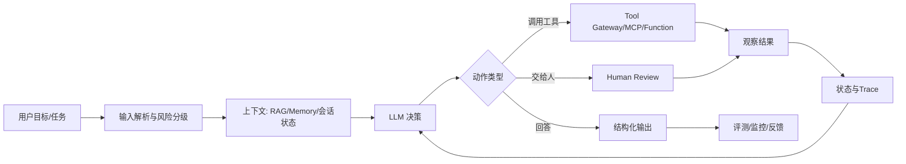
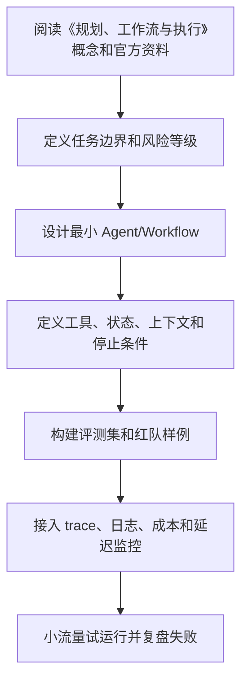

# 06. 规划、工作流与执行

## 为什么需要规划

复杂任务无法通过一次模型调用稳定完成。规划可以帮助 Agent：

- 拆解目标。
- 明确依赖关系。
- 估算需要哪些工具。
- 发现信息缺口。
- 设置完成条件。
- 降低遗漏风险。

但规划本身也可能出错，因此必须支持修订和验证。

## 计划的结构

一个实用计划应包含：

- step_id：步骤编号。
- goal：步骤目标。
- action_type：模型生成、工具调用、人工确认或验证。
- required_inputs：需要的信息。
- expected_output：期望产出。
- status：pending、running、done、failed、blocked。
- risk_level：风险等级。

示例：

```json
{
  "task": "整理竞品分析报告",
  "steps": [
    {
      "step_id": "1",
      "goal": "收集三家竞品的官网信息",
      "action_type": "search",
      "expected_output": "带来源链接的竞品基础信息",
      "status": "pending",
      "risk_level": "low"
    }
  ]
}
```

## 规划方式

### 一次性计划

任务开始时生成完整计划，然后逐步执行。适合流程相对清晰的任务。

优点是可预览、可审批。缺点是遇到新信息时可能过时。

### 滚动计划

只规划接下来一到三步，根据结果持续调整。适合探索性任务。

优点是灵活。缺点是更难预测成本和完成时间。

### 层级计划

先生成高层阶段，再为每个阶段生成详细步骤。适合长任务。

### 规则驱动计划

流程固定，模型只填参数或处理异常。适合生产业务系统。

## Workflow 与 Agent 的关系

Workflow 是确定性流程。Agent 是模型驱动的决策和执行单元。

生产系统更推荐：

```text
Workflow 控制主流程
Agent 处理语义判断和非结构化部分
工具执行具体动作
规则系统控制权限和风险
```

这样既能利用模型能力，也能保持系统可控。

## 执行循环

执行循环通常如下：

```text
加载任务状态
  ↓
检查停止条件
  ↓
选择下一步
  ↓
准备模型上下文
  ↓
模型输出动作
  ↓
校验动作
  ↓
执行工具
  ↓
记录结果
  ↓
更新状态
```

每一轮都应写入 trace。

## 任务状态

任务状态建议包括：

- task_id。
- user_id。
- original_request。
- current_goal。
- plan。
- completed_steps。
- pending_steps。
- tool_results。
- approvals。
- errors。
- cost_usage。
- created_at。
- updated_at。

任务状态应可序列化，便于中断恢复。

## Human-in-the-loop

以下情况应引入人工：

- 高风险写操作。
- 权限不确定。
- 信息不足。
- 多个方案都合理。
- 成本可能超预算。
- 结果会影响外部用户。
- 模型置信度低。

人工确认不应只显示“是否继续”。应展示：

- Agent 准备做什么。
- 为什么要这么做。
- 会影响哪些对象。
- 是否可回滚。
- 需要用户选择什么。

## 验证器

Verifier 用于检查中间结果或最终结果。

验证方式：

- 规则校验：字段是否完整、格式是否正确。
- 工具校验：运行测试、查询状态、检查文件。
- 模型校验：让另一个模型评审答案。
- 人工校验：高风险结果由人确认。

模型校验不能替代真实测试。

## 反思机制

Reflection 是让模型审视自己的输出或执行结果。适合：

- 检查计划是否遗漏。
- 检查答案是否符合证据。
- 检查代码是否满足需求。
- 总结失败原因。

但反思会增加成本和延迟，而且模型可能自信地误判。应在关键节点使用，而不是每一步都使用。

## 幂等与重试

Agent 调用工具时必须考虑重试。

只读工具可以相对安全地重试。写工具必须有幂等键，例如：

```text
create_ticket(idempotency_key="task-123-step-2")
```

否则网络超时后重试可能创建重复工单或重复支付。

## 并发执行

部分任务可并行：

- 同时检索多个数据源。
- 同时让多个 Agent 分析不同文档。
- 同时运行多个测试。

并发执行要注意：

- 状态合并。
- 成本预算。
- 工具限流。
- 结果去重。
- 冲突解决。

## 长任务管理

长任务需要：

- 后台队列。
- 进度状态。
- 可暂停和取消。
- 中间结果保存。
- 超时策略。
- 失败恢复。
- 用户通知。

不要让长任务绑定在一次 HTTP 请求生命周期里。

## 检查清单

- 计划是否结构化？
- 每一步是否有完成条件？
- 是否支持计划修订？
- 是否设置最大步数、最大时间和最大成本？
- 写工具是否幂等？
- 高风险操作是否需要人工确认？
- 任务是否能暂停、恢复和回放？
- 验证器是否包含真实工具或规则，而不是只靠模型？

---

## 万字精讲扩展（2026-06-16 更新）
> Last researched: 2026-06-16。本文补充内容以 OpenAI、Anthropic、MCP、LangGraph、LlamaIndex、AutoGen、CrewAI、Microsoft Agent Framework、Langfuse 等官方或厂商资料为主；Agent 生态变化很快，真实项目应继续核对模型、SDK、框架和安全策略的最新版本。

### 本章在 AI Agent 学习路线中的位置

《规划、工作流与执行》是 Agent 工程能力链条中的一个环节。Agent 不是单次模型调用，也不是一个框架名，而是模型、工具、上下文、状态、规划、执行、评测、安全和可观测性组合成的系统。学习本章时，不要只问“这个概念是什么”，还要问“它如何被测试、如何被限制、如何被观测、如何在失败时恢复”。

本章学习完成后，至少应达到三个标准。第一，能说明该主题给 Agent 增加了什么能力，以及什么时候不该使用。第二，能设计一个最小 demo，并明确工具、状态、停止条件和失败处理。第三，能用 trace 和评测样例证明改动有效。没有评测和可观测性的 Agent，只是难以维护的黑箱。

### 规划、工作流与执行类笔记的精讲重点

规划不是让模型随意写一串步骤，而是把目标拆成可验证、可恢复、可中断的任务。计划应包含任务、依赖、输入、输出、风险、验证方式和停止条件。执行器负责按计划调用工具、更新状态、处理失败和产生日志。规划器和执行器分离，可以降低模型在执行过程中偏离目标的风险。

Human-in-the-loop 是生产 Agent 的关键机制。不是所有事情都应该自动执行，尤其是删除、付款、发送外部消息、修改生产配置、访问敏感数据、合规判断和不可逆操作。幂等、重试、补偿事务、并发控制和长任务恢复都属于执行层设计，不应只靠 prompt 约束。

### Agent 学习的底层方法：把“智能”拆成可控工程循环

AI Agent 最容易被讲成一个模糊概念：模型会思考、会调用工具、会自己完成任务。工程上更可靠的理解是：Agent 是围绕模型构建的运行时系统，它接收目标和上下文，选择下一步动作，调用工具或查询记忆，观察结果，再决定继续、交给人、回滚或停止。这个循环看起来像自主行为，但每一步都应该有边界：允许调用哪些工具，工具参数如何校验，结果如何压缩，失败如何重试，什么时候必须让人审批，什么时候停止，怎样记录 trace，怎样评测结果是否可靠。

学习 Agent 不要从“多智能体”和“全自动”开始，而要从一个增强型 LLM 开始：一个模型、一个清晰任务、一个结构化输出、一个只读工具、一组评测样例。只有这个最小闭环稳定以后，再引入写操作、RAG、Memory、规划器、工作流、多 Agent、异步任务和生产监控。Anthropic 的 effective agents 文章也强调，很多生产系统更适合简单、可组合、可预测的工作流，而不是一开始就追求复杂自治。OpenAI Agents SDK 的文档同样把工具、handoff、state、guardrails、tracing、evals 作为可组合能力，而不是把 Agent 当成黑箱。

### Agent 运行时闭环



Figure: 生产级 Agent 运行时闭环，综合 OpenAI Agents SDK、Anthropic effective agents、MCP、LangGraph/LlamaIndex/CrewAI/AutoGen 文档整理。

这个图的重点是：模型不是系统的全部，工具也不是简单函数。生产 Agent 至少需要输入治理、上下文治理、工具治理、执行治理、结果治理和可观测性。没有这些工程层，Agent 在 demo 中看起来可用，但上线后会遇到成本不可控、延迟过高、工具误用、权限越界、提示注入、RAG 幻觉、记忆污染、不可复现、无法回放和无法评测的问题。

### Workflow 和 Agent 要分清

Workflow 是预定义控制流，适合流程稳定、责任明确、风险可控的任务；Agent 是模型在运行中选择步骤和工具，适合路径不固定、需要动态探索、需要根据观察调整策略的任务。很多企业场景应该采用“workflow + agent”的混合结构：用 workflow 固定高风险主流程，用 Agent 处理信息抽取、检索、草拟、分类、诊断和建议；写操作、外部发送、转账、删除、审批、发布等动作由规则、权限和人审控制。

一个实用判断是：如果任务步骤稳定，优先 workflow；如果任务需要在多个信息源中探索，才考虑 Agent；如果任务有高风险写操作，必须加入审批和回滚；如果任务没有明确评测标准，不要急于自动化。Agent 不是所有 LLM 应用的升级版，很多问答、摘要、抽取和分类任务用普通链式调用更稳、更便宜、更容易测。

### 评测先于复杂化

Agent 系统引入工具和循环后，失败模式会指数增加。一个普通 LLM 调用只需要评估答案质量，Agent 还要评估步骤选择、工具参数、工具结果理解、是否过度调用、是否遗漏验证、是否遵守权限、是否正确停止。OpenAI agent evals 文档强调 trace 级评估，因为 trace 能展示模型调用、工具调用、handoff、guardrails 和自定义 span。没有 trace，就很难知道失败来自提示、检索、工具、模型、权限还是业务规则。

建议每个 Agent 项目从第一天就建立评测集。评测样例至少包括成功路径、边界路径、恶意输入、缺失信息、工具失败、权限不足、长上下文、重复请求和成本压力。每次改 prompt、模型、工具 schema、RAG 切分、memory 策略或框架版本，都跑回归评测。没有评测的 Agent 优化，很容易变成“这次看起来更聪明”的主观判断。

### 核心知识点逐条精讲

#### 1. 计划结构

在《规划、工作流与执行》中，`计划结构` 要从“能力、边界、证据、风险”四个角度理解。能力回答它能带来什么增量，例如让模型调用工具、访问知识、规划任务或协作执行；边界回答什么时候不该使用它，例如普通确定性流程、低风险固定任务或无法评测的任务；证据回答如何证明它有效，例如 trace、评测集、人工审查、工具调用日志和线上指标；风险回答失败后会造成什么后果，例如成本升高、权限越界、数据泄露、错误操作或用户误信。

实践中，`计划结构` 不应该只写成概念，而要落到可配置对象和测试样例。比如工具要有 schema、权限、超时、错误码和 mock；RAG 要有切分、召回、重排、引用和无答案策略；Memory 要有写入规则、过期规则、用户可见和纠错机制；Planner 要有最大步数、停止条件和验证器；多 Agent 要有通信格式、共享状态和冲突解决。每个对象都应能被单独测试，并能在 trace 里被观察。

生产判断上，`计划结构` 的默认策略应是先简单、后复杂，先只读、后写入，先人工审批、后自动化，先评测、后扩展。Agent 系统最大的风险不是模型“不够聪明”，而是系统把不稳定能力放进了不可控场景。真正可靠的 Agent 往往是被明确边界、工具权限、工作流状态和评测体系约束出来的。

#### 2. Workflow 与 Agent

在《规划、工作流与执行》中，`Workflow 与 Agent` 要从“能力、边界、证据、风险”四个角度理解。能力回答它能带来什么增量，例如让模型调用工具、访问知识、规划任务或协作执行；边界回答什么时候不该使用它，例如普通确定性流程、低风险固定任务或无法评测的任务；证据回答如何证明它有效，例如 trace、评测集、人工审查、工具调用日志和线上指标；风险回答失败后会造成什么后果，例如成本升高、权限越界、数据泄露、错误操作或用户误信。

实践中，`Workflow 与 Agent` 不应该只写成概念，而要落到可配置对象和测试样例。比如工具要有 schema、权限、超时、错误码和 mock；RAG 要有切分、召回、重排、引用和无答案策略；Memory 要有写入规则、过期规则、用户可见和纠错机制；Planner 要有最大步数、停止条件和验证器；多 Agent 要有通信格式、共享状态和冲突解决。每个对象都应能被单独测试，并能在 trace 里被观察。

生产判断上，`Workflow 与 Agent` 的默认策略应是先简单、后复杂，先只读、后写入，先人工审批、后自动化，先评测、后扩展。Agent 系统最大的风险不是模型“不够聪明”，而是系统把不稳定能力放进了不可控场景。真正可靠的 Agent 往往是被明确边界、工具权限、工作流状态和评测体系约束出来的。

#### 3. 执行循环

在《规划、工作流与执行》中，`执行循环` 要从“能力、边界、证据、风险”四个角度理解。能力回答它能带来什么增量，例如让模型调用工具、访问知识、规划任务或协作执行；边界回答什么时候不该使用它，例如普通确定性流程、低风险固定任务或无法评测的任务；证据回答如何证明它有效，例如 trace、评测集、人工审查、工具调用日志和线上指标；风险回答失败后会造成什么后果，例如成本升高、权限越界、数据泄露、错误操作或用户误信。

实践中，`执行循环` 不应该只写成概念，而要落到可配置对象和测试样例。比如工具要有 schema、权限、超时、错误码和 mock；RAG 要有切分、召回、重排、引用和无答案策略；Memory 要有写入规则、过期规则、用户可见和纠错机制；Planner 要有最大步数、停止条件和验证器；多 Agent 要有通信格式、共享状态和冲突解决。每个对象都应能被单独测试，并能在 trace 里被观察。

生产判断上，`执行循环` 的默认策略应是先简单、后复杂，先只读、后写入，先人工审批、后自动化，先评测、后扩展。Agent 系统最大的风险不是模型“不够聪明”，而是系统把不稳定能力放进了不可控场景。真正可靠的 Agent 往往是被明确边界、工具权限、工作流状态和评测体系约束出来的。

#### 4. Human-in-the-loop

在《规划、工作流与执行》中，`Human-in-the-loop` 要从“能力、边界、证据、风险”四个角度理解。能力回答它能带来什么增量，例如让模型调用工具、访问知识、规划任务或协作执行；边界回答什么时候不该使用它，例如普通确定性流程、低风险固定任务或无法评测的任务；证据回答如何证明它有效，例如 trace、评测集、人工审查、工具调用日志和线上指标；风险回答失败后会造成什么后果，例如成本升高、权限越界、数据泄露、错误操作或用户误信。

实践中，`Human-in-the-loop` 不应该只写成概念，而要落到可配置对象和测试样例。比如工具要有 schema、权限、超时、错误码和 mock；RAG 要有切分、召回、重排、引用和无答案策略；Memory 要有写入规则、过期规则、用户可见和纠错机制；Planner 要有最大步数、停止条件和验证器；多 Agent 要有通信格式、共享状态和冲突解决。每个对象都应能被单独测试，并能在 trace 里被观察。

生产判断上，`Human-in-the-loop` 的默认策略应是先简单、后复杂，先只读、后写入，先人工审批、后自动化，先评测、后扩展。Agent 系统最大的风险不是模型“不够聪明”，而是系统把不稳定能力放进了不可控场景。真正可靠的 Agent 往往是被明确边界、工具权限、工作流状态和评测体系约束出来的。

#### 5. 幂等、重试和并发

在《规划、工作流与执行》中，`幂等、重试和并发` 要从“能力、边界、证据、风险”四个角度理解。能力回答它能带来什么增量，例如让模型调用工具、访问知识、规划任务或协作执行；边界回答什么时候不该使用它，例如普通确定性流程、低风险固定任务或无法评测的任务；证据回答如何证明它有效，例如 trace、评测集、人工审查、工具调用日志和线上指标；风险回答失败后会造成什么后果，例如成本升高、权限越界、数据泄露、错误操作或用户误信。

实践中，`幂等、重试和并发` 不应该只写成概念，而要落到可配置对象和测试样例。比如工具要有 schema、权限、超时、错误码和 mock；RAG 要有切分、召回、重排、引用和无答案策略；Memory 要有写入规则、过期规则、用户可见和纠错机制；Planner 要有最大步数、停止条件和验证器；多 Agent 要有通信格式、共享状态和冲突解决。每个对象都应能被单独测试，并能在 trace 里被观察。

生产判断上，`幂等、重试和并发` 的默认策略应是先简单、后复杂，先只读、后写入，先人工审批、后自动化，先评测、后扩展。Agent 系统最大的风险不是模型“不够聪明”，而是系统把不稳定能力放进了不可控场景。真正可靠的 Agent 往往是被明确边界、工具权限、工作流状态和评测体系约束出来的。


### 场景化学习与排错表

| 主题 | 推荐动作 | 常见风险 | 验证方式 |
| :--- | :--- | :--- | :--- |
| 计划结构 | 先定义任务边界和成功标准，再设计工具/状态/评测，最后接入生产监控 | 直接堆框架、缺少评测、工具权限过大、没有停止条件、无法回放 | 单元测试、工具 mock、trace 回放、黄金集评测、红队样例、线上指标 |
| Workflow 与 Agent | 先定义任务边界和成功标准，再设计工具/状态/评测，最后接入生产监控 | 直接堆框架、缺少评测、工具权限过大、没有停止条件、无法回放 | 单元测试、工具 mock、trace 回放、黄金集评测、红队样例、线上指标 |
| 执行循环 | 先定义任务边界和成功标准，再设计工具/状态/评测，最后接入生产监控 | 直接堆框架、缺少评测、工具权限过大、没有停止条件、无法回放 | 单元测试、工具 mock、trace 回放、黄金集评测、红队样例、线上指标 |
| Human-in-the-loop | 先定义任务边界和成功标准，再设计工具/状态/评测，最后接入生产监控 | 直接堆框架、缺少评测、工具权限过大、没有停止条件、无法回放 | 单元测试、工具 mock、trace 回放、黄金集评测、红队样例、线上指标 |
| 幂等、重试和并发 | 先定义任务边界和成功标准，再设计工具/状态/评测，最后接入生产监控 | 直接堆框架、缺少评测、工具权限过大、没有停止条件、无法回放 | 单元测试、工具 mock、trace 回放、黄金集评测、红队样例、线上指标 |

这张表的重点是把 Agent 能力变成可验证工程对象。很多 Agent demo 的问题不是不能成功一次，而是失败时没有证据、无法复现、无法回滚、无法量化改进。每个主题都应该对应 trace、评测样例、权限策略和失败处理。

### 本章建议工作流



Figure: 《规划、工作流与执行》学习和落地工作流，综合 OpenAI Agents SDK、Anthropic effective agents、MCP、LangGraph、LlamaIndex、AutoGen、CrewAI 和 Langfuse 资料整理。

这个流程避免“先做复杂系统再补治理”。Agent 项目越早接入评测和可观测性，越容易知道改动是否有效。复杂能力如多 Agent、长期记忆、自动写操作和长任务执行，都应该在最小闭环稳定后再引入。

### 常见误区和纠正方法

- 误区：把 Agent 等同于聊天机器人。纠正：Agent 的关键是多步执行、工具使用、状态和反馈循环，普通问答不一定需要 Agent。
- 误区：一开始就多 Agent。纠正：先用单 Agent 或 workflow 解决问题，只有职责清晰、可评测、可观测时再拆多 Agent。
- 误区：把所有治理写进 prompt。纠正：权限、schema、验证器、审批、沙箱、审计和回滚应由系统实现，prompt 只是其中一层。
- 误区：没有评测就调 prompt。纠正：每次改模型、prompt、工具、RAG 或框架，都应跑回归评测和 trace 对比。
- 误区：工具越多越好。纠正：工具越多，选择错误和权限越界风险越高；工具应职责清晰、可组合、可测试、可审计。
- 误区：Memory 永远有益。纠正：记忆会污染、过期、泄露隐私，也可能强化错误偏好；必须有写入、读取、纠错和删除策略。

### 与相邻章节的关系

《规划、工作流与执行》应与提示工程、工具/MCP、RAG/Memory、规划执行、评测、安全和生产工程章节联动。Prompt 决定模型如何理解任务，工具决定它能做什么，RAG 和 Memory 决定上下文，规划执行决定任务如何推进，评测和可观测性决定能否改进，安全风控决定能否上线。任何单点能力脱离这些关系，都容易变成 demo 级系统。

### 实操训练和复盘模板

1. 围绕 `计划结构` 做一个最小实验：写成功样例、失败样例、trace 观察点和评测标准。
2. 围绕 `Workflow 与 Agent` 做一个最小实验：写成功样例、失败样例、trace 观察点和评测标准。
3. 围绕 `执行循环` 做一个最小实验：写成功样例、失败样例、trace 观察点和评测标准。
4. 围绕 `Human-in-the-loop` 做一个最小实验：写成功样例、失败样例、trace 观察点和评测标准。
5. 围绕 `幂等、重试和并发` 做一个最小实验：写成功样例、失败样例、trace 观察点和评测标准。

建议每个 Agent 练习都按下面格式复盘：

```text
项目名称：
本章主题：规划、工作流与执行
任务边界：用户目标、允许动作、禁止动作
模型和框架版本：
工具列表：名称、schema、权限、超时、错误码、mock
上下文来源：RAG、Memory、会话状态、用户输入、系统配置
执行控制：最大步数、最大成本、停止条件、重试和人审
评测样例：成功、失败、边界、恶意、工具异常、缺少信息
Trace 观察：模型调用、工具调用、handoff、guardrail、成本、延迟
失败原因：prompt / retrieval / tool / model / permission / business rule
改进动作：
上线风险：
```

这个模板能把 Agent 学习从“能跑 demo”推进到“能解释和治理”。生产级 Agent 最重要的不是一次成功输出，而是每次失败都能定位原因，每次改动都能通过评测验证。

## 参考资料与延伸阅读

- [Official / OpenAI] Agents SDK guide: https://developers.openai.com/api/docs/guides/agents
- [Official / OpenAI] Agents SDK quickstart: https://developers.openai.com/api/docs/guides/agents/quickstart
- [Official / OpenAI] Running agents: https://developers.openai.com/api/docs/guides/agents/running-agents
- [Official / OpenAI] Orchestration and handoffs: https://developers.openai.com/api/docs/guides/agents/orchestration
- [Official / OpenAI] Results and state: https://developers.openai.com/api/docs/guides/agents/results
- [Official / OpenAI] Integrations and observability: https://developers.openai.com/api/docs/guides/agents/integrations-observability
- [Official / OpenAI] Evaluate agent workflows: https://developers.openai.com/api/docs/guides/agent-evals
- [Official / OpenAI Developers] Agents learning hub: https://developers.openai.com/learn/agents
- [Official / Anthropic] Building Effective Agents: https://www.anthropic.com/research/building-effective-agents
- [Official / Anthropic] Writing effective tools for AI agents: https://www.anthropic.com/engineering/writing-tools-for-agents
- [Official / MCP] Model Context Protocol introduction: https://modelcontextprotocol.io/docs/getting-started/intro
- [Official / MCP] MCP specification - Tools: https://modelcontextprotocol.io/specification/2025-06-18/server/tools
- [Official / LangChain] LangGraph overview: https://docs.langchain.com/oss/python/langgraph/overview
- [Official / LangChain] LangGraph product page: https://www.langchain.com/langgraph
- [Official / LlamaIndex] Developer documentation: https://developers.llamaindex.ai/python/framework/
- [Official / LlamaIndex] Agent memory: https://developers.llamaindex.ai/python/framework/module_guides/deploying/agents/memory/
- [Official / LlamaIndex] Agentic RAG architecture guide: https://www.llamaindex.ai/blog/agentic-rag-with-llamaindex-2721b8a49ff6
- [Official / Microsoft] AutoGen stable documentation: https://microsoft.github.io/autogen/stable//index.html
- [Official / Microsoft] Microsoft Agent Framework overview: https://learn.microsoft.com/en-us/agent-framework/overview/
- [Official / Microsoft Research] AutoGen project: https://www.microsoft.com/en-us/research/project/autogen/
- [Official / CrewAI] CrewAI documentation: https://docs.crewai.com/
- [Official / CrewAI] Agents: https://docs.crewai.com/en/concepts/agents
- [Official / CrewAI] Crews: https://docs.crewai.com/en/concepts/crews
- [Official / CrewAI] Flows: https://docs.crewai.com/en/concepts/flows
- [Vendor / Langfuse] AI Agent Observability, Tracing & Evaluation: https://langfuse.com/blog/2024-07-ai-agent-observability-with-langfuse
- [Community / CSDN] AI Agent 学习笔记检索入口: https://so.csdn.net/so/search?q=AI%20Agent%20%E5%AD%A6%E4%B9%A0%E7%AC%94%E8%AE%B0%20RAG%20MCP
- [Community / 博客园] Agent、RAG、MCP 实践检索入口: https://zzk.cnblogs.com/s/blogpost?Keywords=AI%20Agent%20RAG%20MCP
- [Community / 掘金] AI Agent 工程化与 LangGraph 实践检索入口: https://juejin.cn/search?query=AI%20Agent%20LangGraph%20MCP%20RAG&type=0
