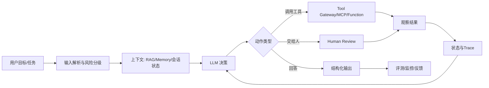
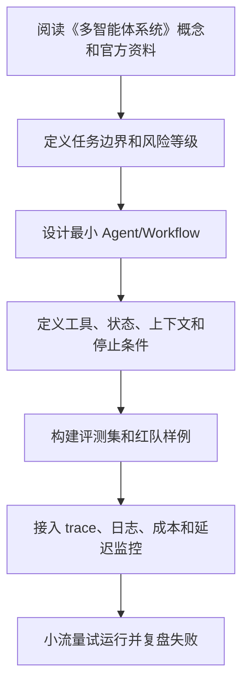

# 07. 多智能体系统

## 什么是多智能体

多智能体系统是由多个 Agent 协同完成任务的系统。每个 Agent 可以有不同角色、工具、记忆和权限。

常见角色：

- Planner：规划任务。
- Researcher：收集资料。
- Coder：修改代码。
- Reviewer：审查结果。
- Critic：提出反例和风险。
- Executor：执行工具。
- Coordinator：协调多个 Agent。

## 什么时候需要多 Agent

适合使用多 Agent：

- 任务天然需要分工。
- 需要相互审查。
- 可以并行处理多个子任务。
- 不同角色需要不同工具或权限。
- 希望用辩论、投票或竞争提升质量。

不适合使用多 Agent：

- 单 Agent 已能稳定完成。
- 任务很短。
- 成本和延迟敏感。
- 缺乏清晰评测标准。
- 角色只是 Prompt 上的装饰，没有实际分工。

## 常见协作模式

### Supervisor 模式

一个主管 Agent 分配任务给多个子 Agent。

```text
Supervisor
  ├─ Research Agent
  ├─ Code Agent
  └─ Review Agent
```

优点是控制清晰。缺点是 Supervisor 可能成为瓶颈。

### Debate 模式

多个 Agent 对同一问题给出观点，再由 Judge 汇总。

适合：

- 方案评审。
- 风险分析。
- 复杂判断。

不适合：

- 事实查询。
- 简单任务。
- 对延迟敏感的场景。

### Pipeline 模式

任务按阶段传递：

```text
Researcher → Writer → Editor → Verifier
```

适合内容生成、报告整理和代码修改。

### Blackboard 模式

多个 Agent 共享一个工作区，读取和写入中间结果。

适合探索性任务，但需要严格的写入规范和冲突控制。

### Market / Voting 模式

多个 Agent 生成候选结果，通过投票、打分或规则选择最佳结果。

适合开放式生成和方案比较。

## 多 Agent 通信

通信内容应结构化：

```json
{
  "from": "researcher",
  "to": "writer",
  "task_id": "report-001",
  "summary": "已完成三家竞品资料收集",
  "artifacts": ["doc-1", "doc-2"],
  "open_questions": ["第三家竞品价格页不可访问"]
}
```

不要让 Agent 之间无边界地聊天。通信越自由，越难评测和调试。

## 共享状态

共享状态应包含：

- 当前任务目标。
- 角色职责。
- 已完成产物。
- 待处理问题。
- 决策记录。
- 冲突记录。
- 版本号。

共享状态要避免被某个 Agent 随意覆盖。可以采用 append-only 日志，再由 Coordinator 汇总。

## 角色漂移

角色漂移是指 Agent 偏离自己的职责。例如 Reviewer 开始重写全部内容，Researcher 开始做最终决策。

缓解方式：

- 每个 Agent 只暴露必要工具。
- 每个角色 Prompt 明确职责边界。
- Coordinator 校验输出类型。
- 使用结构化消息。
- 设置最大轮次。

## 冲突解决

多 Agent 可能给出冲突结论。解决方式：

- 优先证据来源更可靠的一方。
- 使用规则判断。
- 调用外部验证工具。
- 交给 Judge Agent。
- 请求人工决策。

对事实问题，不应通过简单投票决定。多个 Agent 都可能错。

## 成本与延迟

多 Agent 会显著增加：

- 模型调用次数。
- 上下文长度。
- 工具调用次数。
- Trace 复杂度。
- 调试成本。

因此多 Agent 系统必须设置预算。

## 多 Agent 评测

评测维度：

- 最终任务成功率。
- 子任务完成率。
- Agent 间通信是否有效。
- 轮次是否过多。
- 是否出现重复工作。
- 是否出现角色漂移。
- 是否正确处理冲突。
- 成本是否可接受。

## 实用建议

- 先实现单 Agent，再拆多 Agent。
- 拆分依据应是职责、工具和权限，而不是为了显得复杂。
- 每个 Agent 都要有可测试输入输出。
- Coordinator 应掌握停止条件。
- 高风险工具不要暴露给所有 Agent。
- 多 Agent 最终要汇聚到一个明确结果。

## 检查清单

- 是否真的需要多 Agent？
- 每个 Agent 的职责是否清晰？
- 是否限制每个 Agent 的工具权限？
- 通信是否结构化？
- 是否设置最大轮次？
- 是否有冲突解决机制？
- 是否能追踪每个 Agent 的贡献和错误？

---

## 万字精讲扩展（2026-06-16 更新）
> Last researched: 2026-06-16。本文补充内容以 OpenAI、Anthropic、MCP、LangGraph、LlamaIndex、AutoGen、CrewAI、Microsoft Agent Framework、Langfuse 等官方或厂商资料为主；Agent 生态变化很快，真实项目应继续核对模型、SDK、框架和安全策略的最新版本。

### 本章在 AI Agent 学习路线中的位置

《多智能体系统》是 Agent 工程能力链条中的一个环节。Agent 不是单次模型调用，也不是一个框架名，而是模型、工具、上下文、状态、规划、执行、评测、安全和可观测性组合成的系统。学习本章时，不要只问“这个概念是什么”，还要问“它如何被测试、如何被限制、如何被观测、如何在失败时恢复”。

本章学习完成后，至少应达到三个标准。第一，能说明该主题给 Agent 增加了什么能力，以及什么时候不该使用。第二，能设计一个最小 demo，并明确工具、状态、停止条件和失败处理。第三，能用 trace 和评测样例证明改动有效。没有评测和可观测性的 Agent，只是难以维护的黑箱。

### 多智能体系统类笔记的精讲重点

多 Agent 适合角色职责清晰、信息源不同、需要并行或需要互相审查的任务。常见模式包括 manager-worker、specialist routing、debate/review、planner-executor、critic-refiner 和 tool-as-agent。多 Agent 的代价是延迟、成本、协调复杂度、角色漂移和难以评测。很多任务用一个 Agent 加工具或 workflow 更稳。

多 Agent 需要共享状态和通信协议。每个 Agent 的输入输出格式、权限、可见上下文、停止条件和冲突解决机制都要明确。不要让多个 Agent 无限对话，也不要让它们共享全部敏感上下文。评测时要看整体任务成功率，也要看每个子 Agent 是否按职责行动。

### Agent 学习的底层方法：把“智能”拆成可控工程循环

AI Agent 最容易被讲成一个模糊概念：模型会思考、会调用工具、会自己完成任务。工程上更可靠的理解是：Agent 是围绕模型构建的运行时系统，它接收目标和上下文，选择下一步动作，调用工具或查询记忆，观察结果，再决定继续、交给人、回滚或停止。这个循环看起来像自主行为，但每一步都应该有边界：允许调用哪些工具，工具参数如何校验，结果如何压缩，失败如何重试，什么时候必须让人审批，什么时候停止，怎样记录 trace，怎样评测结果是否可靠。

学习 Agent 不要从“多智能体”和“全自动”开始，而要从一个增强型 LLM 开始：一个模型、一个清晰任务、一个结构化输出、一个只读工具、一组评测样例。只有这个最小闭环稳定以后，再引入写操作、RAG、Memory、规划器、工作流、多 Agent、异步任务和生产监控。Anthropic 的 effective agents 文章也强调，很多生产系统更适合简单、可组合、可预测的工作流，而不是一开始就追求复杂自治。OpenAI Agents SDK 的文档同样把工具、handoff、state、guardrails、tracing、evals 作为可组合能力，而不是把 Agent 当成黑箱。

### Agent 运行时闭环



Figure: 生产级 Agent 运行时闭环，综合 OpenAI Agents SDK、Anthropic effective agents、MCP、LangGraph/LlamaIndex/CrewAI/AutoGen 文档整理。

这个图的重点是：模型不是系统的全部，工具也不是简单函数。生产 Agent 至少需要输入治理、上下文治理、工具治理、执行治理、结果治理和可观测性。没有这些工程层，Agent 在 demo 中看起来可用，但上线后会遇到成本不可控、延迟过高、工具误用、权限越界、提示注入、RAG 幻觉、记忆污染、不可复现、无法回放和无法评测的问题。

### Workflow 和 Agent 要分清

Workflow 是预定义控制流，适合流程稳定、责任明确、风险可控的任务；Agent 是模型在运行中选择步骤和工具，适合路径不固定、需要动态探索、需要根据观察调整策略的任务。很多企业场景应该采用“workflow + agent”的混合结构：用 workflow 固定高风险主流程，用 Agent 处理信息抽取、检索、草拟、分类、诊断和建议；写操作、外部发送、转账、删除、审批、发布等动作由规则、权限和人审控制。

一个实用判断是：如果任务步骤稳定，优先 workflow；如果任务需要在多个信息源中探索，才考虑 Agent；如果任务有高风险写操作，必须加入审批和回滚；如果任务没有明确评测标准，不要急于自动化。Agent 不是所有 LLM 应用的升级版，很多问答、摘要、抽取和分类任务用普通链式调用更稳、更便宜、更容易测。

### 评测先于复杂化

Agent 系统引入工具和循环后，失败模式会指数增加。一个普通 LLM 调用只需要评估答案质量，Agent 还要评估步骤选择、工具参数、工具结果理解、是否过度调用、是否遗漏验证、是否遵守权限、是否正确停止。OpenAI agent evals 文档强调 trace 级评估，因为 trace 能展示模型调用、工具调用、handoff、guardrails 和自定义 span。没有 trace，就很难知道失败来自提示、检索、工具、模型、权限还是业务规则。

建议每个 Agent 项目从第一天就建立评测集。评测样例至少包括成功路径、边界路径、恶意输入、缺失信息、工具失败、权限不足、长上下文、重复请求和成本压力。每次改 prompt、模型、工具 schema、RAG 切分、memory 策略或框架版本，都跑回归评测。没有评测的 Agent 优化，很容易变成“这次看起来更聪明”的主观判断。

### 核心知识点逐条精讲

#### 1. 多 Agent 使用边界

在《多智能体系统》中，`多 Agent 使用边界` 要从“能力、边界、证据、风险”四个角度理解。能力回答它能带来什么增量，例如让模型调用工具、访问知识、规划任务或协作执行；边界回答什么时候不该使用它，例如普通确定性流程、低风险固定任务或无法评测的任务；证据回答如何证明它有效，例如 trace、评测集、人工审查、工具调用日志和线上指标；风险回答失败后会造成什么后果，例如成本升高、权限越界、数据泄露、错误操作或用户误信。

实践中，`多 Agent 使用边界` 不应该只写成概念，而要落到可配置对象和测试样例。比如工具要有 schema、权限、超时、错误码和 mock；RAG 要有切分、召回、重排、引用和无答案策略；Memory 要有写入规则、过期规则、用户可见和纠错机制；Planner 要有最大步数、停止条件和验证器；多 Agent 要有通信格式、共享状态和冲突解决。每个对象都应能被单独测试，并能在 trace 里被观察。

生产判断上，`多 Agent 使用边界` 的默认策略应是先简单、后复杂，先只读、后写入，先人工审批、后自动化，先评测、后扩展。Agent 系统最大的风险不是模型“不够聪明”，而是系统把不稳定能力放进了不可控场景。真正可靠的 Agent 往往是被明确边界、工具权限、工作流状态和评测体系约束出来的。

#### 2. 协作模式

在《多智能体系统》中，`协作模式` 要从“能力、边界、证据、风险”四个角度理解。能力回答它能带来什么增量，例如让模型调用工具、访问知识、规划任务或协作执行；边界回答什么时候不该使用它，例如普通确定性流程、低风险固定任务或无法评测的任务；证据回答如何证明它有效，例如 trace、评测集、人工审查、工具调用日志和线上指标；风险回答失败后会造成什么后果，例如成本升高、权限越界、数据泄露、错误操作或用户误信。

实践中，`协作模式` 不应该只写成概念，而要落到可配置对象和测试样例。比如工具要有 schema、权限、超时、错误码和 mock；RAG 要有切分、召回、重排、引用和无答案策略；Memory 要有写入规则、过期规则、用户可见和纠错机制；Planner 要有最大步数、停止条件和验证器；多 Agent 要有通信格式、共享状态和冲突解决。每个对象都应能被单独测试，并能在 trace 里被观察。

生产判断上，`协作模式` 的默认策略应是先简单、后复杂，先只读、后写入，先人工审批、后自动化，先评测、后扩展。Agent 系统最大的风险不是模型“不够聪明”，而是系统把不稳定能力放进了不可控场景。真正可靠的 Agent 往往是被明确边界、工具权限、工作流状态和评测体系约束出来的。

#### 3. 共享状态

在《多智能体系统》中，`共享状态` 要从“能力、边界、证据、风险”四个角度理解。能力回答它能带来什么增量，例如让模型调用工具、访问知识、规划任务或协作执行；边界回答什么时候不该使用它，例如普通确定性流程、低风险固定任务或无法评测的任务；证据回答如何证明它有效，例如 trace、评测集、人工审查、工具调用日志和线上指标；风险回答失败后会造成什么后果，例如成本升高、权限越界、数据泄露、错误操作或用户误信。

实践中，`共享状态` 不应该只写成概念，而要落到可配置对象和测试样例。比如工具要有 schema、权限、超时、错误码和 mock；RAG 要有切分、召回、重排、引用和无答案策略；Memory 要有写入规则、过期规则、用户可见和纠错机制；Planner 要有最大步数、停止条件和验证器；多 Agent 要有通信格式、共享状态和冲突解决。每个对象都应能被单独测试，并能在 trace 里被观察。

生产判断上，`共享状态` 的默认策略应是先简单、后复杂，先只读、后写入，先人工审批、后自动化，先评测、后扩展。Agent 系统最大的风险不是模型“不够聪明”，而是系统把不稳定能力放进了不可控场景。真正可靠的 Agent 往往是被明确边界、工具权限、工作流状态和评测体系约束出来的。

#### 4. 角色漂移

在《多智能体系统》中，`角色漂移` 要从“能力、边界、证据、风险”四个角度理解。能力回答它能带来什么增量，例如让模型调用工具、访问知识、规划任务或协作执行；边界回答什么时候不该使用它，例如普通确定性流程、低风险固定任务或无法评测的任务；证据回答如何证明它有效，例如 trace、评测集、人工审查、工具调用日志和线上指标；风险回答失败后会造成什么后果，例如成本升高、权限越界、数据泄露、错误操作或用户误信。

实践中，`角色漂移` 不应该只写成概念，而要落到可配置对象和测试样例。比如工具要有 schema、权限、超时、错误码和 mock；RAG 要有切分、召回、重排、引用和无答案策略；Memory 要有写入规则、过期规则、用户可见和纠错机制；Planner 要有最大步数、停止条件和验证器；多 Agent 要有通信格式、共享状态和冲突解决。每个对象都应能被单独测试，并能在 trace 里被观察。

生产判断上，`角色漂移` 的默认策略应是先简单、后复杂，先只读、后写入，先人工审批、后自动化，先评测、后扩展。Agent 系统最大的风险不是模型“不够聪明”，而是系统把不稳定能力放进了不可控场景。真正可靠的 Agent 往往是被明确边界、工具权限、工作流状态和评测体系约束出来的。

#### 5. 多 Agent 评测

在《多智能体系统》中，`多 Agent 评测` 要从“能力、边界、证据、风险”四个角度理解。能力回答它能带来什么增量，例如让模型调用工具、访问知识、规划任务或协作执行；边界回答什么时候不该使用它，例如普通确定性流程、低风险固定任务或无法评测的任务；证据回答如何证明它有效，例如 trace、评测集、人工审查、工具调用日志和线上指标；风险回答失败后会造成什么后果，例如成本升高、权限越界、数据泄露、错误操作或用户误信。

实践中，`多 Agent 评测` 不应该只写成概念，而要落到可配置对象和测试样例。比如工具要有 schema、权限、超时、错误码和 mock；RAG 要有切分、召回、重排、引用和无答案策略；Memory 要有写入规则、过期规则、用户可见和纠错机制；Planner 要有最大步数、停止条件和验证器；多 Agent 要有通信格式、共享状态和冲突解决。每个对象都应能被单独测试，并能在 trace 里被观察。

生产判断上，`多 Agent 评测` 的默认策略应是先简单、后复杂，先只读、后写入，先人工审批、后自动化，先评测、后扩展。Agent 系统最大的风险不是模型“不够聪明”，而是系统把不稳定能力放进了不可控场景。真正可靠的 Agent 往往是被明确边界、工具权限、工作流状态和评测体系约束出来的。


### 场景化学习与排错表

| 主题 | 推荐动作 | 常见风险 | 验证方式 |
| :--- | :--- | :--- | :--- |
| 多 Agent 使用边界 | 先定义任务边界和成功标准，再设计工具/状态/评测，最后接入生产监控 | 直接堆框架、缺少评测、工具权限过大、没有停止条件、无法回放 | 单元测试、工具 mock、trace 回放、黄金集评测、红队样例、线上指标 |
| 协作模式 | 先定义任务边界和成功标准，再设计工具/状态/评测，最后接入生产监控 | 直接堆框架、缺少评测、工具权限过大、没有停止条件、无法回放 | 单元测试、工具 mock、trace 回放、黄金集评测、红队样例、线上指标 |
| 共享状态 | 先定义任务边界和成功标准，再设计工具/状态/评测，最后接入生产监控 | 直接堆框架、缺少评测、工具权限过大、没有停止条件、无法回放 | 单元测试、工具 mock、trace 回放、黄金集评测、红队样例、线上指标 |
| 角色漂移 | 先定义任务边界和成功标准，再设计工具/状态/评测，最后接入生产监控 | 直接堆框架、缺少评测、工具权限过大、没有停止条件、无法回放 | 单元测试、工具 mock、trace 回放、黄金集评测、红队样例、线上指标 |
| 多 Agent 评测 | 先定义任务边界和成功标准，再设计工具/状态/评测，最后接入生产监控 | 直接堆框架、缺少评测、工具权限过大、没有停止条件、无法回放 | 单元测试、工具 mock、trace 回放、黄金集评测、红队样例、线上指标 |

这张表的重点是把 Agent 能力变成可验证工程对象。很多 Agent demo 的问题不是不能成功一次，而是失败时没有证据、无法复现、无法回滚、无法量化改进。每个主题都应该对应 trace、评测样例、权限策略和失败处理。

### 本章建议工作流



Figure: 《多智能体系统》学习和落地工作流，综合 OpenAI Agents SDK、Anthropic effective agents、MCP、LangGraph、LlamaIndex、AutoGen、CrewAI 和 Langfuse 资料整理。

这个流程避免“先做复杂系统再补治理”。Agent 项目越早接入评测和可观测性，越容易知道改动是否有效。复杂能力如多 Agent、长期记忆、自动写操作和长任务执行，都应该在最小闭环稳定后再引入。

### 常见误区和纠正方法

- 误区：把 Agent 等同于聊天机器人。纠正：Agent 的关键是多步执行、工具使用、状态和反馈循环，普通问答不一定需要 Agent。
- 误区：一开始就多 Agent。纠正：先用单 Agent 或 workflow 解决问题，只有职责清晰、可评测、可观测时再拆多 Agent。
- 误区：把所有治理写进 prompt。纠正：权限、schema、验证器、审批、沙箱、审计和回滚应由系统实现，prompt 只是其中一层。
- 误区：没有评测就调 prompt。纠正：每次改模型、prompt、工具、RAG 或框架，都应跑回归评测和 trace 对比。
- 误区：工具越多越好。纠正：工具越多，选择错误和权限越界风险越高；工具应职责清晰、可组合、可测试、可审计。
- 误区：Memory 永远有益。纠正：记忆会污染、过期、泄露隐私，也可能强化错误偏好；必须有写入、读取、纠错和删除策略。

### 与相邻章节的关系

《多智能体系统》应与提示工程、工具/MCP、RAG/Memory、规划执行、评测、安全和生产工程章节联动。Prompt 决定模型如何理解任务，工具决定它能做什么，RAG 和 Memory 决定上下文，规划执行决定任务如何推进，评测和可观测性决定能否改进，安全风控决定能否上线。任何单点能力脱离这些关系，都容易变成 demo 级系统。

### 实操训练和复盘模板

1. 围绕 `多 Agent 使用边界` 做一个最小实验：写成功样例、失败样例、trace 观察点和评测标准。
2. 围绕 `协作模式` 做一个最小实验：写成功样例、失败样例、trace 观察点和评测标准。
3. 围绕 `共享状态` 做一个最小实验：写成功样例、失败样例、trace 观察点和评测标准。
4. 围绕 `角色漂移` 做一个最小实验：写成功样例、失败样例、trace 观察点和评测标准。
5. 围绕 `多 Agent 评测` 做一个最小实验：写成功样例、失败样例、trace 观察点和评测标准。

建议每个 Agent 练习都按下面格式复盘：

```text
项目名称：
本章主题：多智能体系统
任务边界：用户目标、允许动作、禁止动作
模型和框架版本：
工具列表：名称、schema、权限、超时、错误码、mock
上下文来源：RAG、Memory、会话状态、用户输入、系统配置
执行控制：最大步数、最大成本、停止条件、重试和人审
评测样例：成功、失败、边界、恶意、工具异常、缺少信息
Trace 观察：模型调用、工具调用、handoff、guardrail、成本、延迟
失败原因：prompt / retrieval / tool / model / permission / business rule
改进动作：
上线风险：
```

这个模板能把 Agent 学习从“能跑 demo”推进到“能解释和治理”。生产级 Agent 最重要的不是一次成功输出，而是每次失败都能定位原因，每次改动都能通过评测验证。

## 参考资料与延伸阅读

- [Official / OpenAI] Agents SDK guide: https://developers.openai.com/api/docs/guides/agents
- [Official / OpenAI] Agents SDK quickstart: https://developers.openai.com/api/docs/guides/agents/quickstart
- [Official / OpenAI] Running agents: https://developers.openai.com/api/docs/guides/agents/running-agents
- [Official / OpenAI] Orchestration and handoffs: https://developers.openai.com/api/docs/guides/agents/orchestration
- [Official / OpenAI] Results and state: https://developers.openai.com/api/docs/guides/agents/results
- [Official / OpenAI] Integrations and observability: https://developers.openai.com/api/docs/guides/agents/integrations-observability
- [Official / OpenAI] Evaluate agent workflows: https://developers.openai.com/api/docs/guides/agent-evals
- [Official / OpenAI Developers] Agents learning hub: https://developers.openai.com/learn/agents
- [Official / Anthropic] Building Effective Agents: https://www.anthropic.com/research/building-effective-agents
- [Official / Anthropic] Writing effective tools for AI agents: https://www.anthropic.com/engineering/writing-tools-for-agents
- [Official / MCP] Model Context Protocol introduction: https://modelcontextprotocol.io/docs/getting-started/intro
- [Official / MCP] MCP specification - Tools: https://modelcontextprotocol.io/specification/2025-06-18/server/tools
- [Official / LangChain] LangGraph overview: https://docs.langchain.com/oss/python/langgraph/overview
- [Official / LangChain] LangGraph product page: https://www.langchain.com/langgraph
- [Official / LlamaIndex] Developer documentation: https://developers.llamaindex.ai/python/framework/
- [Official / LlamaIndex] Agent memory: https://developers.llamaindex.ai/python/framework/module_guides/deploying/agents/memory/
- [Official / LlamaIndex] Agentic RAG architecture guide: https://www.llamaindex.ai/blog/agentic-rag-with-llamaindex-2721b8a49ff6
- [Official / Microsoft] AutoGen stable documentation: https://microsoft.github.io/autogen/stable//index.html
- [Official / Microsoft] Microsoft Agent Framework overview: https://learn.microsoft.com/en-us/agent-framework/overview/
- [Official / Microsoft Research] AutoGen project: https://www.microsoft.com/en-us/research/project/autogen/
- [Official / CrewAI] CrewAI documentation: https://docs.crewai.com/
- [Official / CrewAI] Agents: https://docs.crewai.com/en/concepts/agents
- [Official / CrewAI] Crews: https://docs.crewai.com/en/concepts/crews
- [Official / CrewAI] Flows: https://docs.crewai.com/en/concepts/flows
- [Vendor / Langfuse] AI Agent Observability, Tracing & Evaluation: https://langfuse.com/blog/2024-07-ai-agent-observability-with-langfuse
- [Community / CSDN] AI Agent 学习笔记检索入口: https://so.csdn.net/so/search?q=AI%20Agent%20%E5%AD%A6%E4%B9%A0%E7%AC%94%E8%AE%B0%20RAG%20MCP
- [Community / 博客园] Agent、RAG、MCP 实践检索入口: https://zzk.cnblogs.com/s/blogpost?Keywords=AI%20Agent%20RAG%20MCP
- [Community / 掘金] AI Agent 工程化与 LangGraph 实践检索入口: https://juejin.cn/search?query=AI%20Agent%20LangGraph%20MCP%20RAG&type=0

<!-- research-notes: enhanced-v1 -->

## 研究笔记增强

> Last reviewed: 2026-06-17。此节用于把《07. 多智能体系统》从阅读笔记推进到可复习、可实践、可验证的研究笔记；具体版本、参数和环境仍需结合官方资料、项目约束和实测结果校准。

### 知识定位

把模型能力放进可评测、可追踪、可回滚的系统边界内，重点关注任务定义、工具权限、上下文来源、失败处理和上线后的可观测性。

### 重点补充
- 区分普通 LLM 调用、工具增强应用、工作流和自治 Agent。
- 为工具定义 schema、权限、超时、重试、审计日志和 mock 样例。
- 保留成功 trace 与失败 trace，对比模型、检索、工具和输出之间的因果关系。
- 明确适用场景、限制条件、替代方案和迁移成本。

### 实践清单
- 为本章整理一张概念关系图、流程图或最小系统图。
- 写一个最小可运行示例，并保留运行命令、输入、输出和环境版本。
- 列出常见错误、排查命令、关键日志和修复动作。
- 补充安全、性能、兼容性、可维护性和上线运维注意事项。
- 用一次真实问题或练习项目复盘验证笔记是否可用。

### 常见误区
- 只摘抄定义或命令，没有记录上下文、前提条件和边界。
- 只记录成功路径，不记录失败样本、异常现象和排查过程。
- 没有版本、环境和数据样本，导致后续无法复现。
- 把教程默认值直接用于真实项目，没有结合约束重新评估。

### 复盘问题
- 学完《07. 多智能体系统》后，能否用自己的话说明它解决什么问题、不解决什么问题？
- 如果要在真实项目中使用，需要哪些前置条件、依赖版本、输入数据和验证手段？
- 失败时最先检查哪三类证据：日志、指标、抓包、堆栈、配置、样本还是硬件测量？
- 有没有形成可重复的最小实验、测试用例或排查命令？

### 延伸方向
- 官方文档和版本变更记录。
- 同类技术、框架或方案对比。
- 面向真实项目的最小实践。
- 故障排查清单和复盘案例库。

### 复盘记录模板

```text
主题：07. 多智能体系统
日期：
目标：本次要验证或掌握的具体问题
环境：系统 / 语言 / 框架 / 工具 / 设备 / 版本
步骤：最小可复现流程
现象：成功输出、失败输出、日志、指标或测量数据
分析：为什么会出现该现象，和哪些概念相关
结论：可复用的规则、命令、配置或设计取舍
风险：边界条件、性能、安全、兼容性或维护成本
下一步：继续实验、补充资料或应用到项目
```

<!-- lecture-notes:start -->

## 讲义级补充：如何真正学懂《07. 多智能体系统》

> 适用位置：AI-Agent学习笔记\07-多智能体系统.md  
> 说明：本补充用于把原始提纲扩展成课堂讲义式学习材料。阅读时建议先看原文，再用本节建立知识框架、例子、实践和自测闭环。

### 1. 这一讲要解决什么问题

这部分知识的重点不是背诵框架名称，而是理解“模型、工具、记忆、规划、执行、评测”如何组成一个可控的智能系统。学习时要不断追问：输入是什么，系统能调用什么，失败后如何发现和纠正。

学习本讲时，可以用三个问题检查自己是否真的理解：

1. 它解决的真实问题是什么？
2. 如果没有它，系统会出现什么具体麻烦？
3. 在真实项目中，应该用什么现象或指标判断它做得好不好？

### 2. 核心知识拆解

可以把本讲拆成几块来学：

- 输入层：用户意图、上下文、权限和约束。
- 推理层：提示词、模型选择、规划步骤和中间状态。
- 执行层：工具、检索、代码、浏览器、数据库或业务 API。
- 评测层：正确性、稳定性、成本、延迟、安全和可追踪性。

拆解的好处是防止“整章都懂一点，但哪块都说不清”。复习时可以逐块追问：它的输入是什么、输出是什么、依赖什么、失败时有什么表现。

### 3. 通俗类比

可以把本主题看成一个“输入-处理-输出-反馈”的系统：先弄清输入从哪里来，经过哪些规则或算法，输出给谁使用，再看错误如何被发现和修正。

类比不是严格定义，但能帮助初学者先建立直觉。真正使用时，还要回到术语、公式、接口、数据结构、时序图或工程规范上，把“感觉理解”变成“可验证理解”。

### 4. 具体例子

学习《07. 多智能体系统》时，先做一个最小可验证例子：输入要小，步骤要清楚，输出要能检查。然后故意制造一个错误，观察系统如何失败，并记录排查顺序。

讲义级学习不能只停留在“概念解释”。至少要有一个能跑、能算、能画或能检查的例子。例子越小，越容易看清关键机制；等机制清楚后，再逐步扩展到复杂项目。

### 5. 学习路径

- 先画出 Agent 的一次完整调用链：用户输入、提示词、模型响应、工具调用、结果整合、最终输出。
- 区分 RAG、Memory、Tool Use、Workflow、Multi-Agent 的边界，避免把所有能力都混称为 Agent。
- 为每个环节设计失败样例，例如检索不到、工具超时、模型幻觉、权限不足，再考虑兜底策略。

建议每学完一小节都做一次“复述练习”：不用看笔记，用自己的话讲清楚概念、输入、输出、关键步骤和常见错误。如果讲不清，通常说明还没有真正掌握。

### 6. 课堂讲解框架

可以按下面顺序讲解或复习本主题：

1. 背景：先讲这个知识为什么出现，它试图降低什么成本、解决什么风险或提升什么能力。
2. 基本概念：给出核心名词的准确定义，说明它们之间的关系。
3. 工作流程：按时间顺序描述一次完整过程，必要时画出流程图、状态机或数据流图。
4. 关键细节：解释最容易误解的机制，例如边界条件、异常处理、性能限制、资源生命周期或安全约束。
5. 实战例子：用一个足够小但完整的例子，把概念落到命令、代码、图纸、配置、数据或操作步骤上。
6. 反例与排错：展示错误做法会导致什么现象，再说明如何定位和修复。
7. 总结迁移：最后说明它和相邻知识点的区别、联系以及后续该学什么。

### 7. 最小实践任务

为了避免“看懂了但不会用”，建议为本讲配一个最小实践：

- 选一个可以在 30 到 90 分钟内完成的小任务。
- 明确输入、预期输出和验收标准。
- 记录遇到的第一个错误、定位过程和最终修复方法。
- 完成后写 5 行复盘：我原来以为是什么，实际是什么，下次会如何更快处理。

如果本主题偏理论，实践可以是手算一个小例子、画一张流程图、推导一个简化公式或解释一段真实日志；如果偏工程，实践应该尽量落到可运行命令、可测试代码、可检查配置或可测量硬件现象上。

### 8. 常见误区

- 只记结论，不理解适用条件。
- 只看正常流程，不看异常、边界和失败恢复。
- 学完没有做最小实践，导致知识停留在熟悉感。

遇到这些问题时，不要急着背更多资料。更有效的办法是回到一个最小例子，把输入、状态变化、输出和验证方式重新走一遍。

### 9. 自测题

1. 用一句话说明本讲主题解决的核心问题。
2. 列出本讲最重要的 3 个概念，并说明它们的关系。
3. 举一个生活类比，再指出这个类比在哪些地方不严谨。
4. 写出一个最小实践任务的验收标准。
5. 如果结果不符合预期，你会优先检查哪 3 个环节？为什么？
6. 本讲和相邻章节的知识边界是什么？哪些问题应该交给其他章节解决？

### 10. 复习口诀

先问场景，再看输入；先拆结构，再走流程；先做小例，再谈优化；先会排错，再做规模化。

<!-- lecture-notes:end -->
