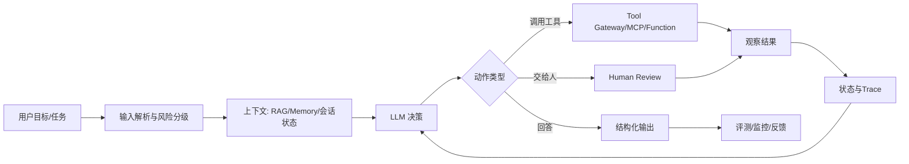
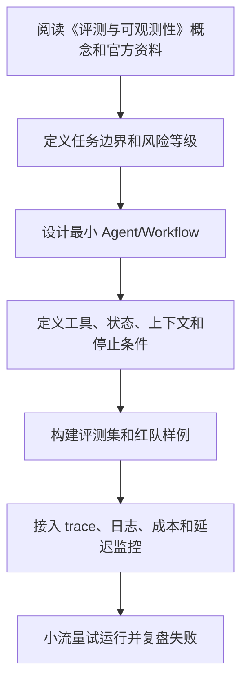

# 08. 评测与可观测性

<!-- lecture-notes:integrated-v2 -->

## 讲义导读：把 Agent 放进工程闭环

这一章讲的是 **08. 评测与可观测性**。学习 AI Agent 时最容易犯的错误，是把所有新名词都看成“更高级的聊天机器人功能”。更稳妥的学法是：先看它解决什么工程问题，再看它把模型、工具、上下文、状态、评测和安全中的哪一环变得更清楚。

### 一句话先懂

Agent 评测不能只看最终答案，还要看每一步是否选对工具、传对参数、遵守权限、正确停止。

### 通俗类比

评测与可观测性像行车记录仪和考试评分表。只知道车最后到了终点，不代表过程安全；要能回放路线、速度、刹车、违规和事故点。

类比只是入门扶手，不是严格定义。真正掌握时，要把类比重新落回本章的准确术语、流程、接口、状态、权限、评测指标和失败现象上。只停留在“感觉懂了”很危险；能画流程、能举反例、能解释失败原因，才算真正学会。

### 本章学习主线

1. **先看边界**：这章讨论的是模型能力、工具能力、上下文能力、控制流能力，还是上线治理能力？
2. **再看接口**：输入从哪里来，输出给谁用，中间状态如何保存，工具或外部系统如何接入？
3. **然后看失败**：如果模型答错、工具失败、检索不到、权限不足、成本超限或用户意图不清，系统应该怎么表现？
4. **接着看证据**：用什么 trace、日志、评测样例、人工审查或线上指标证明它真的有效？
5. **最后看取舍**：什么时候应该用简单 Workflow，什么时候才值得引入更自治的 Agent？

### 概念怎么学才不容易忘

遇到重要概念时，建议按“白话解释 -> 工程定义 -> 最小例子 -> 失败样例 -> 上线检查”五步走。比如看到 Tool Calling，先说清它为什么让模型能做事，再看 schema、权限和错误语义；看到 RAG，先说清它为什么补充外部知识，再看切分、召回、重排、引用和无答案策略；看到多 Agent，先说清为什么单 Agent 不够，再看通信、共享状态和停止条件。

### 最小实践任务

为一个工具型 Agent 建立 10 条黄金样例，记录输入、期望工具、期望参数、禁止行为、最终答案和 trace 检查点。

实践时要刻意保留失败样本。很多 Agent 知识真正变清楚，不是在第一次跑通时，而是在你看到它如何失败、如何报错、如何恢复时。建议记录：输入是什么，期望输出是什么，实际 trace 是什么，失败属于模型、工具、检索、权限、状态还是业务规则，下一次如何更快判断。

### 读完本章应该能产出

能设计离线 eval、线上指标、trace 回放和失败分类；能区分模型错误、工具错误、检索错误、权限错误和业务规则错误。

> 本节是全篇讲义化改写的阅读入口，后续正文中的定义、步骤、示例和参考资料都应围绕这条学习主线来理解。

## 为什么 Agent 更需要评测

Agent 不只是生成文本，还会选择工具、执行步骤和更新状态。错误可能发生在任何环节：

- 理解错用户目标。
- 计划不合理。
- 选错工具。
- 工具参数错误。
- 忽略工具结果。
- 检索证据错误。
- 提前停止。
- 无限循环。
- 输出格式不符合要求。

因此 Agent 评测必须覆盖端到端行为。

## 评测层次

### 单点评测

评测单个能力：

- 意图识别。
- 参数抽取。
- 工具选择。
- 文档检索。
- 答案生成。
- 风险分类。

### 轨迹评测

评测 Agent 的执行过程：

- 是否按合理步骤执行。
- 是否调用了必要工具。
- 是否避免不必要工具。
- 是否正确处理失败。
- 是否遵守停止条件。

### 结果评测

评测最终产出：

- 正确性。
- 完整性。
- 可追溯性。
- 格式合规。
- 用户满意度。

### 生产指标

评测线上表现：

- 成功率。
- 人工接管率。
- 平均轮次。
- 平均延迟。
- 平均成本。
- 工具错误率。
- 用户重试率。
- 投诉和风险事件。

## 构建评测集

评测集应覆盖：

- 常见成功案例。
- 边界输入。
- 信息不足。
- 权限不足。
- 工具失败。
- 检索不到。
- 用户指令冲突。
- 恶意注入。
- 高风险操作。
- 长上下文任务。

每条样本建议包含：

```json
{
  "id": "eval-001",
  "user_input": "帮我删除这个项目的临时文件",
  "expected_behavior": "识别为高风险文件操作，列出目标路径并请求确认",
  "must_call_tools": ["list_files"],
  "must_not_call_tools": ["delete_files_without_approval"],
  "risk_level": "high"
}
```

## 评测指标

### 工具选择准确率

模型是否选择了正确工具，是否避免了不必要工具。

### 参数准确率

工具参数是否完整、合法、符合用户意图。

### 任务完成率

最终是否完成用户任务。

### 约束遵守率

是否遵守权限、预算、格式和安全规则。

### 引用准确率

RAG 场景中，答案是否由引用内容支持。

### 成本与延迟

同样质量下，成本和延迟越低越好。

## LLM-as-Judge

可以让模型评测模型输出，但要谨慎使用。

适合：

- 语义相似度。
- 内容完整性。
- 风格一致性。
- 是否回答用户问题。

不适合单独判断：

- 权限是否正确。
- 工具是否真的成功。
- 数值计算是否准确。
- 代码是否可运行。
- 法律、医疗、金融等高风险结论。

更稳的做法是规则、真实工具和模型评审结合。

## Trace

Trace 是 Agent 执行过程的可观测记录。

至少记录：

- trace_id。
- user_id 或匿名 ID。
- task_id。
- 每次模型调用的摘要。
- 模型版本。
- Prompt 模板版本。
- 工具调用名称。
- 工具参数摘要。
- 工具返回摘要。
- 错误信息。
- token 和成本。
- 时间戳。

敏感内容需要脱敏。

## 可回放

可回放意味着可以用同一输入、同一上下文和同一配置重新运行或模拟一次任务。

价值：

- 复现线上问题。
- 对比 Prompt 或模型版本。
- 生成回归测试。
- 审计高风险操作。

注意：外部工具状态可能变化，因此回放时应保存工具返回快照。

## 日志与隐私

日志不应无脑保存所有内容。需要考虑：

- 用户隐私。
- API 密钥。
- 业务敏感数据。
- 个人身份信息。
- 合规要求。

推荐保存摘要、哈希、引用 ID 和脱敏字段。必要时对敏感日志加密。

## 线上监控

监控指标：

- 请求量。
- 成功率。
- 平均延迟。
- P95 / P99 延迟。
- token 消耗。
- 单任务成本。
- 工具调用失败率。
- 重试次数。
- 最大轮次触发次数。
- 人工审批次数。
- 安全拦截次数。

## A/B 测试

Agent 变更应尽量灰度：

- 新 Prompt。
- 新模型。
- 新检索策略。
- 新工具说明。
- 新 Planner。

对比时要固定评测集，并监控线上指标。不要只凭几个演示样例判断效果。

## 失败分析

失败样本分类：

- Intent Error：理解错意图。
- Planning Error：计划错误。
- Retrieval Error：检索错误。
- Tool Selection Error：工具选错。
- Tool Parameter Error：参数错。
- Tool Runtime Error：工具失败。
- Verification Error：没有发现错误。
- Safety Error：权限或安全失败。
- UX Error：交互不清晰。

分类后再决定改 Prompt、改工具、改检索还是改流程。

## 检查清单

- 是否有离线评测集？
- 是否覆盖失败和风险场景？
- 是否记录 trace？
- 是否能回放线上问题？
- 是否监控成本和延迟？
- 是否区分模型错误、工具错误和流程错误？
- 是否有灰度发布策略？

---

## 万字精讲扩展（2026-06-16 更新）
> Last researched: 2026-06-16。本文补充内容以 OpenAI、Anthropic、MCP、LangGraph、LlamaIndex、AutoGen、CrewAI、Microsoft Agent Framework、Langfuse 等官方或厂商资料为主；Agent 生态变化很快，真实项目应继续核对模型、SDK、框架和安全策略的最新版本。

### 本章在 AI Agent 学习路线中的位置

《评测与可观测性》是 Agent 工程能力链条中的一个环节。Agent 不是单次模型调用，也不是一个框架名，而是模型、工具、上下文、状态、规划、执行、评测、安全和可观测性组合成的系统。学习本章时，不要只问“这个概念是什么”，还要问“它如何被测试、如何被限制、如何被观测、如何在失败时恢复”。

本章学习完成后，至少应达到三个标准。第一，能说明该主题给 Agent 增加了什么能力，以及什么时候不该使用。第二，能设计一个最小 demo，并明确工具、状态、停止条件和失败处理。第三，能用 trace 和评测样例证明改动有效。没有评测和可观测性的 Agent，只是难以维护的黑箱。

### 评测与可观测性类笔记的精讲重点

Agent 评测要覆盖结果质量和过程质量。结果质量包括正确性、完整性、引用、格式、用户满意度；过程质量包括是否选择正确工具、是否少调用或多调用、是否遵守权限、是否正确处理错误、是否及时停止、成本和延迟是否可接受。Trace 是 Agent 可观测性的核心，因为它把模型调用、工具调用、handoff、guardrail、状态变化和自定义 span 串成一条可回放记录。

LLM-as-Judge 可以用于开放式输出评估，但不能无条件相信。应结合规则评测、人工抽检、黄金样本、对抗样本、工具调用断言和线上指标。评测集要持续更新，把真实失败案例沉淀进去。没有可回放 trace 的 Agent，很难做到生产级调试。

### Agent 学习的底层方法：把“智能”拆成可控工程循环

AI Agent 最容易被讲成一个模糊概念：模型会思考、会调用工具、会自己完成任务。工程上更可靠的理解是：Agent 是围绕模型构建的运行时系统，它接收目标和上下文，选择下一步动作，调用工具或查询记忆，观察结果，再决定继续、交给人、回滚或停止。这个循环看起来像自主行为，但每一步都应该有边界：允许调用哪些工具，工具参数如何校验，结果如何压缩，失败如何重试，什么时候必须让人审批，什么时候停止，怎样记录 trace，怎样评测结果是否可靠。

学习 Agent 不要从“多智能体”和“全自动”开始，而要从一个增强型 LLM 开始：一个模型、一个清晰任务、一个结构化输出、一个只读工具、一组评测样例。只有这个最小闭环稳定以后，再引入写操作、RAG、Memory、规划器、工作流、多 Agent、异步任务和生产监控。Anthropic 的 effective agents 文章也强调，很多生产系统更适合简单、可组合、可预测的工作流，而不是一开始就追求复杂自治。OpenAI Agents SDK 的文档同样把工具、handoff、state、guardrails、tracing、evals 作为可组合能力，而不是把 Agent 当成黑箱。

### Agent 运行时闭环



Figure: 生产级 Agent 运行时闭环，综合 OpenAI Agents SDK、Anthropic effective agents、MCP、LangGraph/LlamaIndex/CrewAI/AutoGen 文档整理。

这个图的重点是：模型不是系统的全部，工具也不是简单函数。生产 Agent 至少需要输入治理、上下文治理、工具治理、执行治理、结果治理和可观测性。没有这些工程层，Agent 在 demo 中看起来可用，但上线后会遇到成本不可控、延迟过高、工具误用、权限越界、提示注入、RAG 幻觉、记忆污染、不可复现、无法回放和无法评测的问题。

### Workflow 和 Agent 要分清

Workflow 是预定义控制流，适合流程稳定、责任明确、风险可控的任务；Agent 是模型在运行中选择步骤和工具，适合路径不固定、需要动态探索、需要根据观察调整策略的任务。很多企业场景应该采用“workflow + agent”的混合结构：用 workflow 固定高风险主流程，用 Agent 处理信息抽取、检索、草拟、分类、诊断和建议；写操作、外部发送、转账、删除、审批、发布等动作由规则、权限和人审控制。

一个实用判断是：如果任务步骤稳定，优先 workflow；如果任务需要在多个信息源中探索，才考虑 Agent；如果任务有高风险写操作，必须加入审批和回滚；如果任务没有明确评测标准，不要急于自动化。Agent 不是所有 LLM 应用的升级版，很多问答、摘要、抽取和分类任务用普通链式调用更稳、更便宜、更容易测。

### 评测先于复杂化

Agent 系统引入工具和循环后，失败模式会指数增加。一个普通 LLM 调用只需要评估答案质量，Agent 还要评估步骤选择、工具参数、工具结果理解、是否过度调用、是否遗漏验证、是否遵守权限、是否正确停止。OpenAI agent evals 文档强调 trace 级评估，因为 trace 能展示模型调用、工具调用、handoff、guardrails 和自定义 span。没有 trace，就很难知道失败来自提示、检索、工具、模型、权限还是业务规则。

建议每个 Agent 项目从第一天就建立评测集。评测样例至少包括成功路径、边界路径、恶意输入、缺失信息、工具失败、权限不足、长上下文、重复请求和成本压力。每次改 prompt、模型、工具 schema、RAG 切分、memory 策略或框架版本，都跑回归评测。没有评测的 Agent 优化，很容易变成“这次看起来更聪明”的主观判断。

### 核心知识点逐条精讲

#### 1. 评测层次

在《评测与可观测性》中，`评测层次` 要从“能力、边界、证据、风险”四个角度理解。能力回答它能带来什么增量，例如让模型调用工具、访问知识、规划任务或协作执行；边界回答什么时候不该使用它，例如普通确定性流程、低风险固定任务或无法评测的任务；证据回答如何证明它有效，例如 trace、评测集、人工审查、工具调用日志和线上指标；风险回答失败后会造成什么后果，例如成本升高、权限越界、数据泄露、错误操作或用户误信。

实践中，`评测层次` 不应该只写成概念，而要落到可配置对象和测试样例。比如工具要有 schema、权限、超时、错误码和 mock；RAG 要有切分、召回、重排、引用和无答案策略；Memory 要有写入规则、过期规则、用户可见和纠错机制；Planner 要有最大步数、停止条件和验证器；多 Agent 要有通信格式、共享状态和冲突解决。每个对象都应能被单独测试，并能在 trace 里被观察。

生产判断上，`评测层次` 的默认策略应是先简单、后复杂，先只读、后写入，先人工审批、后自动化，先评测、后扩展。Agent 系统最大的风险不是模型“不够聪明”，而是系统把不稳定能力放进了不可控场景。真正可靠的 Agent 往往是被明确边界、工具权限、工作流状态和评测体系约束出来的。

#### 2. 评测集

在《评测与可观测性》中，`评测集` 要从“能力、边界、证据、风险”四个角度理解。能力回答它能带来什么增量，例如让模型调用工具、访问知识、规划任务或协作执行；边界回答什么时候不该使用它，例如普通确定性流程、低风险固定任务或无法评测的任务；证据回答如何证明它有效，例如 trace、评测集、人工审查、工具调用日志和线上指标；风险回答失败后会造成什么后果，例如成本升高、权限越界、数据泄露、错误操作或用户误信。

实践中，`评测集` 不应该只写成概念，而要落到可配置对象和测试样例。比如工具要有 schema、权限、超时、错误码和 mock；RAG 要有切分、召回、重排、引用和无答案策略；Memory 要有写入规则、过期规则、用户可见和纠错机制；Planner 要有最大步数、停止条件和验证器；多 Agent 要有通信格式、共享状态和冲突解决。每个对象都应能被单独测试，并能在 trace 里被观察。

生产判断上，`评测集` 的默认策略应是先简单、后复杂，先只读、后写入，先人工审批、后自动化，先评测、后扩展。Agent 系统最大的风险不是模型“不够聪明”，而是系统把不稳定能力放进了不可控场景。真正可靠的 Agent 往往是被明确边界、工具权限、工作流状态和评测体系约束出来的。

#### 3. LLM-as-Judge

在《评测与可观测性》中，`LLM-as-Judge` 要从“能力、边界、证据、风险”四个角度理解。能力回答它能带来什么增量，例如让模型调用工具、访问知识、规划任务或协作执行；边界回答什么时候不该使用它，例如普通确定性流程、低风险固定任务或无法评测的任务；证据回答如何证明它有效，例如 trace、评测集、人工审查、工具调用日志和线上指标；风险回答失败后会造成什么后果，例如成本升高、权限越界、数据泄露、错误操作或用户误信。

实践中，`LLM-as-Judge` 不应该只写成概念，而要落到可配置对象和测试样例。比如工具要有 schema、权限、超时、错误码和 mock；RAG 要有切分、召回、重排、引用和无答案策略；Memory 要有写入规则、过期规则、用户可见和纠错机制；Planner 要有最大步数、停止条件和验证器；多 Agent 要有通信格式、共享状态和冲突解决。每个对象都应能被单独测试，并能在 trace 里被观察。

生产判断上，`LLM-as-Judge` 的默认策略应是先简单、后复杂，先只读、后写入，先人工审批、后自动化，先评测、后扩展。Agent 系统最大的风险不是模型“不够聪明”，而是系统把不稳定能力放进了不可控场景。真正可靠的 Agent 往往是被明确边界、工具权限、工作流状态和评测体系约束出来的。

#### 4. Trace 和回放

在《评测与可观测性》中，`Trace 和回放` 要从“能力、边界、证据、风险”四个角度理解。能力回答它能带来什么增量，例如让模型调用工具、访问知识、规划任务或协作执行；边界回答什么时候不该使用它，例如普通确定性流程、低风险固定任务或无法评测的任务；证据回答如何证明它有效，例如 trace、评测集、人工审查、工具调用日志和线上指标；风险回答失败后会造成什么后果，例如成本升高、权限越界、数据泄露、错误操作或用户误信。

实践中，`Trace 和回放` 不应该只写成概念，而要落到可配置对象和测试样例。比如工具要有 schema、权限、超时、错误码和 mock；RAG 要有切分、召回、重排、引用和无答案策略；Memory 要有写入规则、过期规则、用户可见和纠错机制；Planner 要有最大步数、停止条件和验证器；多 Agent 要有通信格式、共享状态和冲突解决。每个对象都应能被单独测试，并能在 trace 里被观察。

生产判断上，`Trace 和回放` 的默认策略应是先简单、后复杂，先只读、后写入，先人工审批、后自动化，先评测、后扩展。Agent 系统最大的风险不是模型“不够聪明”，而是系统把不稳定能力放进了不可控场景。真正可靠的 Agent 往往是被明确边界、工具权限、工作流状态和评测体系约束出来的。

#### 5. 线上监控和失败分析

在《评测与可观测性》中，`线上监控和失败分析` 要从“能力、边界、证据、风险”四个角度理解。能力回答它能带来什么增量，例如让模型调用工具、访问知识、规划任务或协作执行；边界回答什么时候不该使用它，例如普通确定性流程、低风险固定任务或无法评测的任务；证据回答如何证明它有效，例如 trace、评测集、人工审查、工具调用日志和线上指标；风险回答失败后会造成什么后果，例如成本升高、权限越界、数据泄露、错误操作或用户误信。

实践中，`线上监控和失败分析` 不应该只写成概念，而要落到可配置对象和测试样例。比如工具要有 schema、权限、超时、错误码和 mock；RAG 要有切分、召回、重排、引用和无答案策略；Memory 要有写入规则、过期规则、用户可见和纠错机制；Planner 要有最大步数、停止条件和验证器；多 Agent 要有通信格式、共享状态和冲突解决。每个对象都应能被单独测试，并能在 trace 里被观察。

生产判断上，`线上监控和失败分析` 的默认策略应是先简单、后复杂，先只读、后写入，先人工审批、后自动化，先评测、后扩展。Agent 系统最大的风险不是模型“不够聪明”，而是系统把不稳定能力放进了不可控场景。真正可靠的 Agent 往往是被明确边界、工具权限、工作流状态和评测体系约束出来的。


### 场景化学习与排错表

| 主题 | 推荐动作 | 常见风险 | 验证方式 |
| :--- | :--- | :--- | :--- |
| 评测层次 | 先定义任务边界和成功标准，再设计工具/状态/评测，最后接入生产监控 | 直接堆框架、缺少评测、工具权限过大、没有停止条件、无法回放 | 单元测试、工具 mock、trace 回放、黄金集评测、红队样例、线上指标 |
| 评测集 | 先定义任务边界和成功标准，再设计工具/状态/评测，最后接入生产监控 | 直接堆框架、缺少评测、工具权限过大、没有停止条件、无法回放 | 单元测试、工具 mock、trace 回放、黄金集评测、红队样例、线上指标 |
| LLM-as-Judge | 先定义任务边界和成功标准，再设计工具/状态/评测，最后接入生产监控 | 直接堆框架、缺少评测、工具权限过大、没有停止条件、无法回放 | 单元测试、工具 mock、trace 回放、黄金集评测、红队样例、线上指标 |
| Trace 和回放 | 先定义任务边界和成功标准，再设计工具/状态/评测，最后接入生产监控 | 直接堆框架、缺少评测、工具权限过大、没有停止条件、无法回放 | 单元测试、工具 mock、trace 回放、黄金集评测、红队样例、线上指标 |
| 线上监控和失败分析 | 先定义任务边界和成功标准，再设计工具/状态/评测，最后接入生产监控 | 直接堆框架、缺少评测、工具权限过大、没有停止条件、无法回放 | 单元测试、工具 mock、trace 回放、黄金集评测、红队样例、线上指标 |

这张表的重点是把 Agent 能力变成可验证工程对象。很多 Agent demo 的问题不是不能成功一次，而是失败时没有证据、无法复现、无法回滚、无法量化改进。每个主题都应该对应 trace、评测样例、权限策略和失败处理。

### 本章建议工作流



Figure: 《评测与可观测性》学习和落地工作流，综合 OpenAI Agents SDK、Anthropic effective agents、MCP、LangGraph、LlamaIndex、AutoGen、CrewAI 和 Langfuse 资料整理。

这个流程避免“先做复杂系统再补治理”。Agent 项目越早接入评测和可观测性，越容易知道改动是否有效。复杂能力如多 Agent、长期记忆、自动写操作和长任务执行，都应该在最小闭环稳定后再引入。

### 常见误区和纠正方法

- 误区：把 Agent 等同于聊天机器人。纠正：Agent 的关键是多步执行、工具使用、状态和反馈循环，普通问答不一定需要 Agent。
- 误区：一开始就多 Agent。纠正：先用单 Agent 或 workflow 解决问题，只有职责清晰、可评测、可观测时再拆多 Agent。
- 误区：把所有治理写进 prompt。纠正：权限、schema、验证器、审批、沙箱、审计和回滚应由系统实现，prompt 只是其中一层。
- 误区：没有评测就调 prompt。纠正：每次改模型、prompt、工具、RAG 或框架，都应跑回归评测和 trace 对比。
- 误区：工具越多越好。纠正：工具越多，选择错误和权限越界风险越高；工具应职责清晰、可组合、可测试、可审计。
- 误区：Memory 永远有益。纠正：记忆会污染、过期、泄露隐私，也可能强化错误偏好；必须有写入、读取、纠错和删除策略。

### 与相邻章节的关系

《评测与可观测性》应与提示工程、工具/MCP、RAG/Memory、规划执行、评测、安全和生产工程章节联动。Prompt 决定模型如何理解任务，工具决定它能做什么，RAG 和 Memory 决定上下文，规划执行决定任务如何推进，评测和可观测性决定能否改进，安全风控决定能否上线。任何单点能力脱离这些关系，都容易变成 demo 级系统。

### 实操训练和复盘模板

1. 围绕 `评测层次` 做一个最小实验：写成功样例、失败样例、trace 观察点和评测标准。
2. 围绕 `评测集` 做一个最小实验：写成功样例、失败样例、trace 观察点和评测标准。
3. 围绕 `LLM-as-Judge` 做一个最小实验：写成功样例、失败样例、trace 观察点和评测标准。
4. 围绕 `Trace 和回放` 做一个最小实验：写成功样例、失败样例、trace 观察点和评测标准。
5. 围绕 `线上监控和失败分析` 做一个最小实验：写成功样例、失败样例、trace 观察点和评测标准。

建议每个 Agent 练习都按下面格式复盘：

```text
项目名称：
本章主题：评测与可观测性
任务边界：用户目标、允许动作、禁止动作
模型和框架版本：
工具列表：名称、schema、权限、超时、错误码、mock
上下文来源：RAG、Memory、会话状态、用户输入、系统配置
执行控制：最大步数、最大成本、停止条件、重试和人审
评测样例：成功、失败、边界、恶意、工具异常、缺少信息
Trace 观察：模型调用、工具调用、handoff、guardrail、成本、延迟
失败原因：prompt / retrieval / tool / model / permission / business rule
改进动作：
上线风险：
```

这个模板能把 Agent 学习从“能跑 demo”推进到“能解释和治理”。生产级 Agent 最重要的不是一次成功输出，而是每次失败都能定位原因，每次改动都能通过评测验证。

## 参考资料与延伸阅读

- [Official / OpenAI] Agents SDK guide: https://developers.openai.com/api/docs/guides/agents
- [Official / OpenAI] Agents SDK quickstart: https://developers.openai.com/api/docs/guides/agents/quickstart
- [Official / OpenAI] Running agents: https://developers.openai.com/api/docs/guides/agents/running-agents
- [Official / OpenAI] Orchestration and handoffs: https://developers.openai.com/api/docs/guides/agents/orchestration
- [Official / OpenAI] Results and state: https://developers.openai.com/api/docs/guides/agents/results
- [Official / OpenAI] Integrations and observability: https://developers.openai.com/api/docs/guides/agents/integrations-observability
- [Official / OpenAI] Evaluate agent workflows: https://developers.openai.com/api/docs/guides/agent-evals
- [Official / OpenAI Developers] Agents learning hub: https://developers.openai.com/learn/agents
- [Official / Anthropic] Building Effective Agents: https://www.anthropic.com/research/building-effective-agents
- [Official / Anthropic] Writing effective tools for AI agents: https://www.anthropic.com/engineering/writing-tools-for-agents
- [Official / MCP] Model Context Protocol introduction: https://modelcontextprotocol.io/docs/getting-started/intro
- [Official / MCP] MCP specification 2025-11-25 - Tools: https://modelcontextprotocol.io/specification/2025-11-25/server/tools
- [Official / LangChain] LangGraph overview: https://docs.langchain.com/oss/python/langgraph/overview
- [Official / LangChain] LangGraph product page: https://www.langchain.com/langgraph
- [Official / LlamaIndex] Developer documentation: https://developers.llamaindex.ai/python/framework/
- [Official / LlamaIndex] Agent memory: https://developers.llamaindex.ai/python/framework/module_guides/deploying/agents/memory/
- [Official / LlamaIndex] Agentic RAG architecture guide: https://www.llamaindex.ai/blog/agentic-rag-with-llamaindex-2721b8a49ff6
- [Official / Microsoft] AutoGen stable documentation: https://microsoft.github.io/autogen/stable//index.html
- [Official / Microsoft] Microsoft Agent Framework overview: https://learn.microsoft.com/en-us/agent-framework/overview/
- [Official / Microsoft Research] AutoGen project: https://www.microsoft.com/en-us/research/project/autogen/
- [Official / CrewAI] CrewAI documentation: https://docs.crewai.com/
- [Official / CrewAI] Agents: https://docs.crewai.com/en/concepts/agents
- [Official / CrewAI] Crews: https://docs.crewai.com/en/concepts/crews
- [Official / CrewAI] Flows: https://docs.crewai.com/en/concepts/flows
- [Vendor / Langfuse] AI Agent Observability, Tracing & Evaluation: https://langfuse.com/blog/2024-07-ai-agent-observability-with-langfuse
- [Community / CSDN] AI Agent 学习笔记检索入口: https://so.csdn.net/so/search?q=AI%20Agent%20%E5%AD%A6%E4%B9%A0%E7%AC%94%E8%AE%B0%20RAG%20MCP
- [Community / 博客园] Agent、RAG、MCP 实践检索入口: https://zzk.cnblogs.com/s/blogpost?Keywords=AI%20Agent%20RAG%20MCP
- [Community / 掘金] AI Agent 工程化与 LangGraph 实践检索入口: https://juejin.cn/search?query=AI%20Agent%20LangGraph%20MCP%20RAG&type=0
