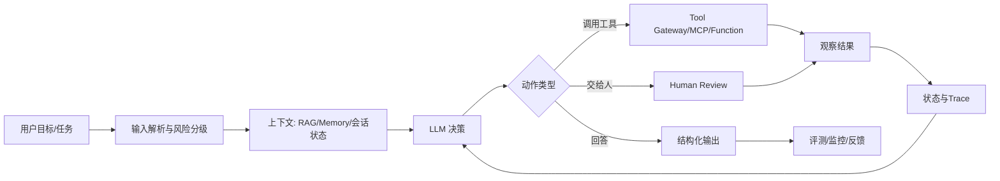
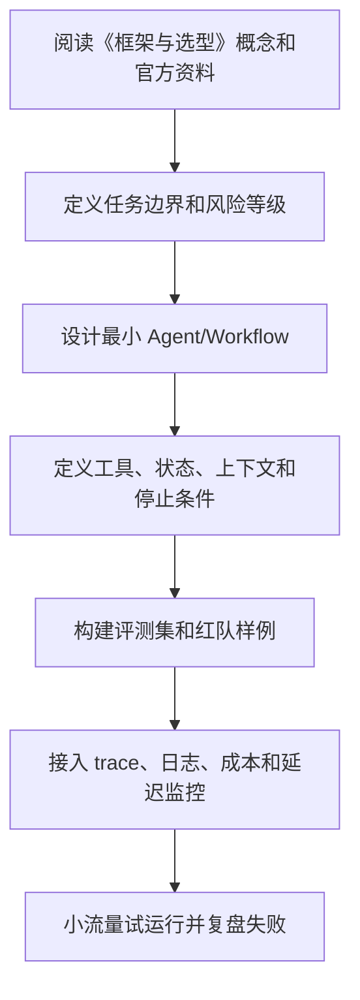

# 11. 框架与选型

## 为什么需要框架

Agent 框架通常提供：

- 模型调用封装。
- 工具注册。
- 执行循环。
- 状态管理。
- 工作流编排。
- 多 Agent 协作。
- RAG 集成。
- Trace 和评测。

但框架不是必需品。简单业务可以先手写轻量 Agent Runtime，等复杂度上来再引入框架。

## 选型维度

选择框架时看：

- 是否支持目标语言。
- 是否支持所需模型提供方。
- 工具调用是否稳定。
- 状态和工作流能力是否清晰。
- 是否支持持久化和恢复。
- 是否支持可观测性。
- 是否容易测试。
- 社区活跃度。
- 文档质量。
- 是否适合生产，不只是 Demo。

## OpenAI Agents SDK

适合：

- 使用 OpenAI 模型和工具调用能力。
- 希望快速构建带工具、handoff、guardrails、tracing 的 Agent。
- 需要与 OpenAI 平台能力保持一致。

关注点：

- 与 OpenAI 生态绑定较深。
- 如果企业需要多模型抽象，需要额外封装。
- 生产中仍需自己处理业务权限、存储、审批和成本治理。

## LangChain

LangChain 是通用 LLM 应用框架，生态大，集成多。它适合快速接入模型、工具、文档加载器、向量库和链式流程。

适合：

- 快速原型。
- 多模型和多工具集成。
- 需要大量连接器。
- RAG 和 Agent 混合应用。

关注点：

- 抽象较多，复杂项目需要控制边界。
- 生产关键路径建议明确自己使用了哪些模块。

## LangGraph

LangGraph 更偏状态图和可控 Agent 工作流。它适合把 Agent 行为建模为节点和边。

适合：

- 复杂工作流。
- 多 Agent。
- 需要状态持久化。
- 需要可恢复和可观测的执行图。
- 希望比自由循环 Agent 更可控。

关注点：

- 需要先设计状态和图结构。
- 对简单任务可能偏重。

## LlamaIndex

LlamaIndex 在数据连接、索引、RAG 和知识型 Agent 方面能力突出。

适合：

- 企业知识库问答。
- 文档密集型 Agent。
- 需要多种索引和检索策略。
- 需要把私有数据组织成模型可用上下文。

关注点：

- 如果任务主要是外部工具执行，而不是知识检索，可能需要配合其他编排方案。

## AutoGen

AutoGen 关注多 Agent 对话和协作，适合构建多角色、多步骤的研究、代码和协作型实验。

适合：

- 多 Agent 原型。
- 角色协作。
- 自动化研究。
- 需要人类参与的 Agent 对话流程。

关注点：

- 多 Agent 调试和成本控制要额外重视。
- 生产落地时要明确状态、权限和停止条件。
- 如果处在微软技术栈中，应关注 Microsoft Agent Framework 对 AutoGen 的后续整合和迁移路径。

## CrewAI

CrewAI 强调角色、任务和团队协作，适合用较直观方式搭建多 Agent 流程。

适合：

- 内容生产流水线。
- 研究报告。
- 市场分析。
- 团队角色清晰的任务。

关注点：

- 对严肃生产系统，需要补齐权限、评测、审计和状态持久化。

## Semantic Kernel

Semantic Kernel 是微软生态中的 AI 编排框架，强调插件、规划器和企业集成。

适合：

- .NET 或微软技术栈。
- 企业应用。
- 插件化工具能力。
- 与 Azure 生态集成。

关注点：

- 如果团队不在微软生态，需要评估集成成本。
- 微软正在推进 Microsoft Agent Framework，把 AutoGen 的多 Agent 抽象和 Semantic Kernel 的企业能力进一步统一；新项目应同时评估 Agent Framework。

## Microsoft Agent Framework

Microsoft Agent Framework 是微软面向 .NET 和 Python 的 Agent 开发框架，官方定位是 AutoGen 与 Semantic Kernel 后续演进方向之一。它强调：

- 单 Agent 和多 Agent 抽象。
- 显式 workflow 编排。
- 会话状态、持久化和长任务。
- Human-in-the-loop。
- 遥测、过滤器和企业级集成。
- 与 Microsoft Foundry、Azure 和 .NET/Python 生态结合。

适合：

- 团队已经使用 Azure、Microsoft Foundry、.NET 或 Semantic Kernel。
- 希望在微软生态内构建企业 Agent。
- 需要从 AutoGen 或 Semantic Kernel 迁移到更统一的框架。
- 需要把多 Agent 与业务 workflow 结合。

关注点：

- 生态仍在快速演进，版本、包名和迁移指南要以 Microsoft Learn 为准。
- 如果系统需要同时深度支持非微软云和多模型供应商，应评估抽象层是否足够中立。
- 企业落地仍然需要自行设计权限、审计、数据边界和成本控制。

## 自研轻量 Runtime

适合：

- 任务边界很清晰。
- 工具数量少。
- 团队希望完全掌控执行逻辑。
- 对框架依赖敏感。

基本模块：

- Prompt 模板。
- 模型客户端。
- 工具注册表。
- 执行循环。
- 状态存储。
- Trace 记录。
- 安全策略。

自研不是从零造所有东西，而是只在关键控制层保持简单清晰。

## 选型建议

### 知识库问答

优先考虑 LlamaIndex、LangChain，配合自定义评测和权限过滤。

### 可控业务流程

优先考虑 Workflow + 自研 Runtime，或 LangGraph。

### 多 Agent 实验

可考虑 AutoGen、CrewAI、LangGraph。

### OpenAI 生态应用

可考虑 OpenAI Agents SDK。

### 企业微软技术栈

可考虑 Microsoft Agent Framework 或 Semantic Kernel。新项目优先评估 Microsoft Agent Framework；已有 Semantic Kernel 项目则关注迁移成本和兼容性。

## 框架评估表

| 维度 | 问题 |
| --- | --- |
| 模型支持 | 是否支持当前和未来模型？ |
| 工具 | 工具 schema 是否清晰？ |
| 状态 | 是否支持持久化和恢复？ |
| 工作流 | 是否能表达复杂控制流？ |
| 评测 | 是否能接入评测和 trace？ |
| 安全 | 是否方便做权限和审批？ |
| 运维 | 是否方便部署和监控？ |
| 迁移 | 是否会强绑定某个生态？ |
| 演进 | 框架是否有明确维护路线和迁移指南？ |

## 实用结论

多数团队的路径可以是：

1. 用最小自研 Runtime 或成熟框架快速验证。
2. 把 Prompt、工具、状态和 trace 抽象清楚。
3. 当任务复杂后，引入 LangGraph、Temporal 等更强编排。
4. 不把业务核心规则锁死在框架黑盒里。

---

## 万字精讲扩展（2026-06-16 更新）
> Last researched: 2026-06-16。本文补充内容以 OpenAI、Anthropic、MCP、LangGraph、LlamaIndex、AutoGen、CrewAI、Microsoft Agent Framework、Langfuse 等官方或厂商资料为主；Agent 生态变化很快，真实项目应继续核对模型、SDK、框架和安全策略的最新版本。

### 本章在 AI Agent 学习路线中的位置

《框架与选型》是 Agent 工程能力链条中的一个环节。Agent 不是单次模型调用，也不是一个框架名，而是模型、工具、上下文、状态、规划、执行、评测、安全和可观测性组合成的系统。学习本章时，不要只问“这个概念是什么”，还要问“它如何被测试、如何被限制、如何被观测、如何在失败时恢复”。

本章学习完成后，至少应达到三个标准。第一，能说明该主题给 Agent 增加了什么能力，以及什么时候不该使用。第二，能设计一个最小 demo，并明确工具、状态、停止条件和失败处理。第三，能用 trace 和评测样例证明改动有效。没有评测和可观测性的 Agent，只是难以维护的黑箱。

### 框架与选型类笔记的精讲重点

框架选型要看控制流、状态、工具、评测、可观测性、部署和团队熟悉度。OpenAI Agents SDK 适合围绕 OpenAI 平台构建有工具、handoff、guardrails、tracing 的 agentic workflow；LangGraph 适合显式图状态、长运行和可控 orchestration；LlamaIndex 强于数据/RAG/索引和知识型 Agent；AutoGen 和 Microsoft Agent Framework 关注多 Agent 与企业集成演进；CrewAI 强调 crews/flows 和多 Agent 编排。框架不是银弹，核心仍是任务边界和评测。

选型时应做同一任务的最小 POC，对比开发复杂度、可观测性、错误恢复、测试方式、部署方式、生态成熟度和迁移成本。不要因为框架 demo 炫酷就把生产逻辑绑定进去。自研轻量 runtime 在简单场景可能更透明、更容易控成本。

### Agent 学习的底层方法：把“智能”拆成可控工程循环

AI Agent 最容易被讲成一个模糊概念：模型会思考、会调用工具、会自己完成任务。工程上更可靠的理解是：Agent 是围绕模型构建的运行时系统，它接收目标和上下文，选择下一步动作，调用工具或查询记忆，观察结果，再决定继续、交给人、回滚或停止。这个循环看起来像自主行为，但每一步都应该有边界：允许调用哪些工具，工具参数如何校验，结果如何压缩，失败如何重试，什么时候必须让人审批，什么时候停止，怎样记录 trace，怎样评测结果是否可靠。

学习 Agent 不要从“多智能体”和“全自动”开始，而要从一个增强型 LLM 开始：一个模型、一个清晰任务、一个结构化输出、一个只读工具、一组评测样例。只有这个最小闭环稳定以后，再引入写操作、RAG、Memory、规划器、工作流、多 Agent、异步任务和生产监控。Anthropic 的 effective agents 文章也强调，很多生产系统更适合简单、可组合、可预测的工作流，而不是一开始就追求复杂自治。OpenAI Agents SDK 的文档同样把工具、handoff、state、guardrails、tracing、evals 作为可组合能力，而不是把 Agent 当成黑箱。

### Agent 运行时闭环



Figure: 生产级 Agent 运行时闭环，综合 OpenAI Agents SDK、Anthropic effective agents、MCP、LangGraph/LlamaIndex/CrewAI/AutoGen 文档整理。

这个图的重点是：模型不是系统的全部，工具也不是简单函数。生产 Agent 至少需要输入治理、上下文治理、工具治理、执行治理、结果治理和可观测性。没有这些工程层，Agent 在 demo 中看起来可用，但上线后会遇到成本不可控、延迟过高、工具误用、权限越界、提示注入、RAG 幻觉、记忆污染、不可复现、无法回放和无法评测的问题。

### Workflow 和 Agent 要分清

Workflow 是预定义控制流，适合流程稳定、责任明确、风险可控的任务；Agent 是模型在运行中选择步骤和工具，适合路径不固定、需要动态探索、需要根据观察调整策略的任务。很多企业场景应该采用“workflow + agent”的混合结构：用 workflow 固定高风险主流程，用 Agent 处理信息抽取、检索、草拟、分类、诊断和建议；写操作、外部发送、转账、删除、审批、发布等动作由规则、权限和人审控制。

一个实用判断是：如果任务步骤稳定，优先 workflow；如果任务需要在多个信息源中探索，才考虑 Agent；如果任务有高风险写操作，必须加入审批和回滚；如果任务没有明确评测标准，不要急于自动化。Agent 不是所有 LLM 应用的升级版，很多问答、摘要、抽取和分类任务用普通链式调用更稳、更便宜、更容易测。

### 评测先于复杂化

Agent 系统引入工具和循环后，失败模式会指数增加。一个普通 LLM 调用只需要评估答案质量，Agent 还要评估步骤选择、工具参数、工具结果理解、是否过度调用、是否遗漏验证、是否遵守权限、是否正确停止。OpenAI agent evals 文档强调 trace 级评估，因为 trace 能展示模型调用、工具调用、handoff、guardrails 和自定义 span。没有 trace，就很难知道失败来自提示、检索、工具、模型、权限还是业务规则。

建议每个 Agent 项目从第一天就建立评测集。评测样例至少包括成功路径、边界路径、恶意输入、缺失信息、工具失败、权限不足、长上下文、重复请求和成本压力。每次改 prompt、模型、工具 schema、RAG 切分、memory 策略或框架版本，都跑回归评测。没有评测的 Agent 优化，很容易变成“这次看起来更聪明”的主观判断。

### 核心知识点逐条精讲

#### 1. OpenAI Agents SDK

在《框架与选型》中，`OpenAI Agents SDK` 要从“能力、边界、证据、风险”四个角度理解。能力回答它能带来什么增量，例如让模型调用工具、访问知识、规划任务或协作执行；边界回答什么时候不该使用它，例如普通确定性流程、低风险固定任务或无法评测的任务；证据回答如何证明它有效，例如 trace、评测集、人工审查、工具调用日志和线上指标；风险回答失败后会造成什么后果，例如成本升高、权限越界、数据泄露、错误操作或用户误信。

实践中，`OpenAI Agents SDK` 不应该只写成概念，而要落到可配置对象和测试样例。比如工具要有 schema、权限、超时、错误码和 mock；RAG 要有切分、召回、重排、引用和无答案策略；Memory 要有写入规则、过期规则、用户可见和纠错机制；Planner 要有最大步数、停止条件和验证器；多 Agent 要有通信格式、共享状态和冲突解决。每个对象都应能被单独测试，并能在 trace 里被观察。

生产判断上，`OpenAI Agents SDK` 的默认策略应是先简单、后复杂，先只读、后写入，先人工审批、后自动化，先评测、后扩展。Agent 系统最大的风险不是模型“不够聪明”，而是系统把不稳定能力放进了不可控场景。真正可靠的 Agent 往往是被明确边界、工具权限、工作流状态和评测体系约束出来的。

#### 2. LangGraph

在《框架与选型》中，`LangGraph` 要从“能力、边界、证据、风险”四个角度理解。能力回答它能带来什么增量，例如让模型调用工具、访问知识、规划任务或协作执行；边界回答什么时候不该使用它，例如普通确定性流程、低风险固定任务或无法评测的任务；证据回答如何证明它有效，例如 trace、评测集、人工审查、工具调用日志和线上指标；风险回答失败后会造成什么后果，例如成本升高、权限越界、数据泄露、错误操作或用户误信。

实践中，`LangGraph` 不应该只写成概念，而要落到可配置对象和测试样例。比如工具要有 schema、权限、超时、错误码和 mock；RAG 要有切分、召回、重排、引用和无答案策略；Memory 要有写入规则、过期规则、用户可见和纠错机制；Planner 要有最大步数、停止条件和验证器；多 Agent 要有通信格式、共享状态和冲突解决。每个对象都应能被单独测试，并能在 trace 里被观察。

生产判断上，`LangGraph` 的默认策略应是先简单、后复杂，先只读、后写入，先人工审批、后自动化，先评测、后扩展。Agent 系统最大的风险不是模型“不够聪明”，而是系统把不稳定能力放进了不可控场景。真正可靠的 Agent 往往是被明确边界、工具权限、工作流状态和评测体系约束出来的。

#### 3. LlamaIndex

在《框架与选型》中，`LlamaIndex` 要从“能力、边界、证据、风险”四个角度理解。能力回答它能带来什么增量，例如让模型调用工具、访问知识、规划任务或协作执行；边界回答什么时候不该使用它，例如普通确定性流程、低风险固定任务或无法评测的任务；证据回答如何证明它有效，例如 trace、评测集、人工审查、工具调用日志和线上指标；风险回答失败后会造成什么后果，例如成本升高、权限越界、数据泄露、错误操作或用户误信。

实践中，`LlamaIndex` 不应该只写成概念，而要落到可配置对象和测试样例。比如工具要有 schema、权限、超时、错误码和 mock；RAG 要有切分、召回、重排、引用和无答案策略；Memory 要有写入规则、过期规则、用户可见和纠错机制；Planner 要有最大步数、停止条件和验证器；多 Agent 要有通信格式、共享状态和冲突解决。每个对象都应能被单独测试，并能在 trace 里被观察。

生产判断上，`LlamaIndex` 的默认策略应是先简单、后复杂，先只读、后写入，先人工审批、后自动化，先评测、后扩展。Agent 系统最大的风险不是模型“不够聪明”，而是系统把不稳定能力放进了不可控场景。真正可靠的 Agent 往往是被明确边界、工具权限、工作流状态和评测体系约束出来的。

#### 4. AutoGen/CrewAI/Microsoft Agent Framework

在《框架与选型》中，`AutoGen/CrewAI/Microsoft Agent Framework` 要从“能力、边界、证据、风险”四个角度理解。能力回答它能带来什么增量，例如让模型调用工具、访问知识、规划任务或协作执行；边界回答什么时候不该使用它，例如普通确定性流程、低风险固定任务或无法评测的任务；证据回答如何证明它有效，例如 trace、评测集、人工审查、工具调用日志和线上指标；风险回答失败后会造成什么后果，例如成本升高、权限越界、数据泄露、错误操作或用户误信。

实践中，`AutoGen/CrewAI/Microsoft Agent Framework` 不应该只写成概念，而要落到可配置对象和测试样例。比如工具要有 schema、权限、超时、错误码和 mock；RAG 要有切分、召回、重排、引用和无答案策略；Memory 要有写入规则、过期规则、用户可见和纠错机制；Planner 要有最大步数、停止条件和验证器；多 Agent 要有通信格式、共享状态和冲突解决。每个对象都应能被单独测试，并能在 trace 里被观察。

生产判断上，`AutoGen/CrewAI/Microsoft Agent Framework` 的默认策略应是先简单、后复杂，先只读、后写入，先人工审批、后自动化，先评测、后扩展。Agent 系统最大的风险不是模型“不够聪明”，而是系统把不稳定能力放进了不可控场景。真正可靠的 Agent 往往是被明确边界、工具权限、工作流状态和评测体系约束出来的。

#### 5. 自研 Runtime 选型

在《框架与选型》中，`自研 Runtime 选型` 要从“能力、边界、证据、风险”四个角度理解。能力回答它能带来什么增量，例如让模型调用工具、访问知识、规划任务或协作执行；边界回答什么时候不该使用它，例如普通确定性流程、低风险固定任务或无法评测的任务；证据回答如何证明它有效，例如 trace、评测集、人工审查、工具调用日志和线上指标；风险回答失败后会造成什么后果，例如成本升高、权限越界、数据泄露、错误操作或用户误信。

实践中，`自研 Runtime 选型` 不应该只写成概念，而要落到可配置对象和测试样例。比如工具要有 schema、权限、超时、错误码和 mock；RAG 要有切分、召回、重排、引用和无答案策略；Memory 要有写入规则、过期规则、用户可见和纠错机制；Planner 要有最大步数、停止条件和验证器；多 Agent 要有通信格式、共享状态和冲突解决。每个对象都应能被单独测试，并能在 trace 里被观察。

生产判断上，`自研 Runtime 选型` 的默认策略应是先简单、后复杂，先只读、后写入，先人工审批、后自动化，先评测、后扩展。Agent 系统最大的风险不是模型“不够聪明”，而是系统把不稳定能力放进了不可控场景。真正可靠的 Agent 往往是被明确边界、工具权限、工作流状态和评测体系约束出来的。


### 场景化学习与排错表

| 主题 | 推荐动作 | 常见风险 | 验证方式 |
| :--- | :--- | :--- | :--- |
| OpenAI Agents SDK | 先定义任务边界和成功标准，再设计工具/状态/评测，最后接入生产监控 | 直接堆框架、缺少评测、工具权限过大、没有停止条件、无法回放 | 单元测试、工具 mock、trace 回放、黄金集评测、红队样例、线上指标 |
| LangGraph | 先定义任务边界和成功标准，再设计工具/状态/评测，最后接入生产监控 | 直接堆框架、缺少评测、工具权限过大、没有停止条件、无法回放 | 单元测试、工具 mock、trace 回放、黄金集评测、红队样例、线上指标 |
| LlamaIndex | 先定义任务边界和成功标准，再设计工具/状态/评测，最后接入生产监控 | 直接堆框架、缺少评测、工具权限过大、没有停止条件、无法回放 | 单元测试、工具 mock、trace 回放、黄金集评测、红队样例、线上指标 |
| AutoGen/CrewAI/Microsoft Agent Framework | 先定义任务边界和成功标准，再设计工具/状态/评测，最后接入生产监控 | 直接堆框架、缺少评测、工具权限过大、没有停止条件、无法回放 | 单元测试、工具 mock、trace 回放、黄金集评测、红队样例、线上指标 |
| 自研 Runtime 选型 | 先定义任务边界和成功标准，再设计工具/状态/评测，最后接入生产监控 | 直接堆框架、缺少评测、工具权限过大、没有停止条件、无法回放 | 单元测试、工具 mock、trace 回放、黄金集评测、红队样例、线上指标 |

这张表的重点是把 Agent 能力变成可验证工程对象。很多 Agent demo 的问题不是不能成功一次，而是失败时没有证据、无法复现、无法回滚、无法量化改进。每个主题都应该对应 trace、评测样例、权限策略和失败处理。

### 本章建议工作流



Figure: 《框架与选型》学习和落地工作流，综合 OpenAI Agents SDK、Anthropic effective agents、MCP、LangGraph、LlamaIndex、AutoGen、CrewAI 和 Langfuse 资料整理。

这个流程避免“先做复杂系统再补治理”。Agent 项目越早接入评测和可观测性，越容易知道改动是否有效。复杂能力如多 Agent、长期记忆、自动写操作和长任务执行，都应该在最小闭环稳定后再引入。

### 常见误区和纠正方法

- 误区：把 Agent 等同于聊天机器人。纠正：Agent 的关键是多步执行、工具使用、状态和反馈循环，普通问答不一定需要 Agent。
- 误区：一开始就多 Agent。纠正：先用单 Agent 或 workflow 解决问题，只有职责清晰、可评测、可观测时再拆多 Agent。
- 误区：把所有治理写进 prompt。纠正：权限、schema、验证器、审批、沙箱、审计和回滚应由系统实现，prompt 只是其中一层。
- 误区：没有评测就调 prompt。纠正：每次改模型、prompt、工具、RAG 或框架，都应跑回归评测和 trace 对比。
- 误区：工具越多越好。纠正：工具越多，选择错误和权限越界风险越高；工具应职责清晰、可组合、可测试、可审计。
- 误区：Memory 永远有益。纠正：记忆会污染、过期、泄露隐私，也可能强化错误偏好；必须有写入、读取、纠错和删除策略。

### 与相邻章节的关系

《框架与选型》应与提示工程、工具/MCP、RAG/Memory、规划执行、评测、安全和生产工程章节联动。Prompt 决定模型如何理解任务，工具决定它能做什么，RAG 和 Memory 决定上下文，规划执行决定任务如何推进，评测和可观测性决定能否改进，安全风控决定能否上线。任何单点能力脱离这些关系，都容易变成 demo 级系统。

### 实操训练和复盘模板

1. 围绕 `OpenAI Agents SDK` 做一个最小实验：写成功样例、失败样例、trace 观察点和评测标准。
2. 围绕 `LangGraph` 做一个最小实验：写成功样例、失败样例、trace 观察点和评测标准。
3. 围绕 `LlamaIndex` 做一个最小实验：写成功样例、失败样例、trace 观察点和评测标准。
4. 围绕 `AutoGen/CrewAI/Microsoft Agent Framework` 做一个最小实验：写成功样例、失败样例、trace 观察点和评测标准。
5. 围绕 `自研 Runtime 选型` 做一个最小实验：写成功样例、失败样例、trace 观察点和评测标准。

建议每个 Agent 练习都按下面格式复盘：

```text
项目名称：
本章主题：框架与选型
任务边界：用户目标、允许动作、禁止动作
模型和框架版本：
工具列表：名称、schema、权限、超时、错误码、mock
上下文来源：RAG、Memory、会话状态、用户输入、系统配置
执行控制：最大步数、最大成本、停止条件、重试和人审
评测样例：成功、失败、边界、恶意、工具异常、缺少信息
Trace 观察：模型调用、工具调用、handoff、guardrail、成本、延迟
失败原因：prompt / retrieval / tool / model / permission / business rule
改进动作：
上线风险：
```

这个模板能把 Agent 学习从“能跑 demo”推进到“能解释和治理”。生产级 Agent 最重要的不是一次成功输出，而是每次失败都能定位原因，每次改动都能通过评测验证。

## 参考资料与延伸阅读

- [Official / OpenAI] Agents SDK guide: https://developers.openai.com/api/docs/guides/agents
- [Official / OpenAI] Agents SDK quickstart: https://developers.openai.com/api/docs/guides/agents/quickstart
- [Official / OpenAI] Running agents: https://developers.openai.com/api/docs/guides/agents/running-agents
- [Official / OpenAI] Orchestration and handoffs: https://developers.openai.com/api/docs/guides/agents/orchestration
- [Official / OpenAI] Results and state: https://developers.openai.com/api/docs/guides/agents/results
- [Official / OpenAI] Integrations and observability: https://developers.openai.com/api/docs/guides/agents/integrations-observability
- [Official / OpenAI] Evaluate agent workflows: https://developers.openai.com/api/docs/guides/agent-evals
- [Official / OpenAI Developers] Agents learning hub: https://developers.openai.com/learn/agents
- [Official / Anthropic] Building Effective Agents: https://www.anthropic.com/research/building-effective-agents
- [Official / Anthropic] Writing effective tools for AI agents: https://www.anthropic.com/engineering/writing-tools-for-agents
- [Official / MCP] Model Context Protocol introduction: https://modelcontextprotocol.io/docs/getting-started/intro
- [Official / MCP] MCP specification - Tools: https://modelcontextprotocol.io/specification/2025-06-18/server/tools
- [Official / LangChain] LangGraph overview: https://docs.langchain.com/oss/python/langgraph/overview
- [Official / LangChain] LangGraph product page: https://www.langchain.com/langgraph
- [Official / LlamaIndex] Developer documentation: https://developers.llamaindex.ai/python/framework/
- [Official / LlamaIndex] Agent memory: https://developers.llamaindex.ai/python/framework/module_guides/deploying/agents/memory/
- [Official / LlamaIndex] Agentic RAG architecture guide: https://www.llamaindex.ai/blog/agentic-rag-with-llamaindex-2721b8a49ff6
- [Official / Microsoft] AutoGen stable documentation: https://microsoft.github.io/autogen/stable//index.html
- [Official / Microsoft] Microsoft Agent Framework overview: https://learn.microsoft.com/en-us/agent-framework/overview/
- [Official / Microsoft Research] AutoGen project: https://www.microsoft.com/en-us/research/project/autogen/
- [Official / CrewAI] CrewAI documentation: https://docs.crewai.com/
- [Official / CrewAI] Agents: https://docs.crewai.com/en/concepts/agents
- [Official / CrewAI] Crews: https://docs.crewai.com/en/concepts/crews
- [Official / CrewAI] Flows: https://docs.crewai.com/en/concepts/flows
- [Vendor / Langfuse] AI Agent Observability, Tracing & Evaluation: https://langfuse.com/blog/2024-07-ai-agent-observability-with-langfuse
- [Community / CSDN] AI Agent 学习笔记检索入口: https://so.csdn.net/so/search?q=AI%20Agent%20%E5%AD%A6%E4%B9%A0%E7%AC%94%E8%AE%B0%20RAG%20MCP
- [Community / 博客园] Agent、RAG、MCP 实践检索入口: https://zzk.cnblogs.com/s/blogpost?Keywords=AI%20Agent%20RAG%20MCP
- [Community / 掘金] AI Agent 工程化与 LangGraph 实践检索入口: https://juejin.cn/search?query=AI%20Agent%20LangGraph%20MCP%20RAG&type=0
