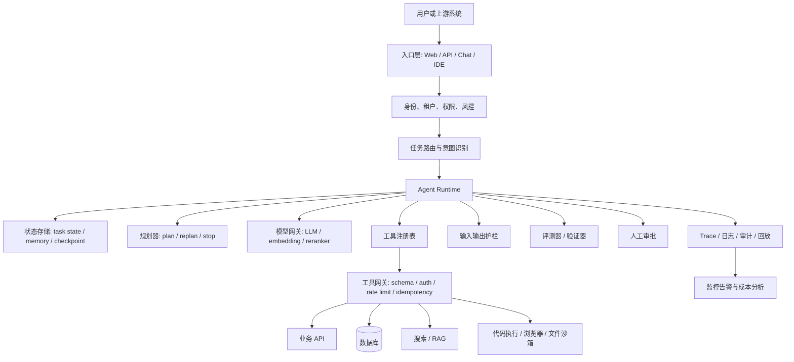

# 14. 生产级 AI Agent 工程补充

最后调研日期：2026-06-13

本章是对前面章节的工程化补充。前 13 章已经覆盖了 Agent 的概念、工具、RAG、规划、多 Agent、评测、安全、生产化和框架选型。本章重点回答一个更实际的问题：如果要把一个 Agent 从 Demo 做到可上线，应该怎样设计、拆分、评测和治理？

## 1. 先区分三类系统

很多项目失败不是因为模型不够强，而是一开始把所有需求都叫 Agent。更实用的分类是：

| 类型 | 特征 | 适合场景 | 不适合场景 |
| --- | --- | --- | --- |
| 普通 LLM 调用 | 一次或少数几次模型调用，流程由代码控制 | 摘要、分类、抽取、改写、简单问答 | 长任务、多工具、多状态任务 |
| Agentic Workflow | 固定流程中嵌入 LLM 判断、生成、工具调用 | 审批流、客服流程、文档处理、数据分析流水线 | 路径高度开放、步骤无法预先枚举的任务 |
| AI Agent | 模型动态决定部分步骤和工具使用，运行时维护状态 | 研究、代码修改、跨系统任务执行、开放式问题解决 | 高风险、强确定性、低延迟、无审计基础的任务 |

Anthropic 对 workflow 和 agent 的区分很有参考价值：workflow 是预定义代码路径编排 LLM 和工具，agent 则由模型更动态地决定流程和工具使用。工程上不要迷信“自治”，大部分生产系统更适合从 workflow 起步，再局部引入 Agent 决策。

## 2. 生产级 Agent 的分层架构



关键原则：

- 模型负责语义理解、生成、规划建议和异常解释。
- 代码负责权限、预算、状态、重试、幂等、审批、审计和最终执行。
- 工具不是“随便给模型一个函数”，而是有 schema、权限、错误语义和观测指标的接口。
- Agent Runtime 不是一个 while loop，而是可停止、可恢复、可回放、可限制成本的执行系统。

## 3. Agent Runtime 的最小职责

一个可生产化的 Runtime 至少要承担以下职责：

| 模块 | 职责 | 典型数据 |
| --- | --- | --- |
| Session Manager | 管理用户会话和任务上下文 | user_id、tenant_id、session_id |
| Task State | 保存任务当前状态 | goal、plan、step、status、checkpoint |
| Model Client | 统一模型调用 | model、temperature、token usage、latency |
| Tool Registry | 管理可用工具 | name、description、schema、risk_level |
| Tool Executor | 校验并执行工具 | args、auth、idempotency_key、result |
| Planner | 生成或更新计划 | steps、dependencies、acceptance criteria |
| Verifier | 检查中间结果和最终结果 | rule checks、LLM judge、unit tests |
| Guardrails | 输入、输出和工具调用前后校验 | policy result、blocked reason |
| Trace Recorder | 记录执行轨迹 | spans、tool calls、errors、cost |
| Stop Controller | 防止失控循环 | max_steps、max_cost、timeout |

### 3.1 Runtime 状态机

```text
created
  -> planning
  -> waiting_for_tool
  -> observing
  -> verifying
  -> replanning
  -> waiting_for_user
  -> completed
  -> failed
  -> cancelled
```

状态机的意义是让 Agent 不是“跑到哪里算哪里”。每一步都能回答：

- 当前任务在哪个阶段？
- 上一步调用了什么模型或工具？
- 失败后能否重试？
- 是否需要人工确认？
- 是否可以从 checkpoint 恢复？

## 4. 工具设计的工程规范

工具质量直接决定 Agent 质量。很多 Agent 表现差，不是模型不会调用工具，而是工具描述含糊、参数太自由、返回太长、错误不可恢复。

### 4.1 好工具的 schema 示例

```json
{
  "name": "create_invoice_draft",
  "description": "为指定客户创建发票草稿。只创建草稿，不发送、不审批、不入账。",
  "input_schema": {
    "type": "object",
    "properties": {
      "customer_id": {
        "type": "string",
        "description": "客户 ID，必须来自客户查询工具的返回结果"
      },
      "line_items": {
        "type": "array",
        "minItems": 1,
        "items": {
          "type": "object",
          "properties": {
            "description": { "type": "string" },
            "quantity": { "type": "number", "minimum": 0 },
            "unit_price": { "type": "number", "minimum": 0 }
          },
          "required": ["description", "quantity", "unit_price"]
        }
      },
      "currency": {
        "type": "string",
        "enum": ["CNY", "USD", "EUR"]
      },
      "idempotency_key": {
        "type": "string",
        "description": "同一次用户任务内生成的幂等键"
      }
    },
    "required": ["customer_id", "line_items", "currency", "idempotency_key"]
  },
  "risk_level": "low_write",
  "requires_approval": false
}
```

注意点：

- 描述要说明“做什么”和“不做什么”。
- 参数尽量来自上游工具返回值，减少模型自由编造。
- 写操作必须有幂等键。
- 高风险操作不要和低风险操作混在一个工具里。
- 工具返回要短、结构化、可继续推理。

### 4.2 工具返回结构

```json
{
  "ok": true,
  "invoice_draft_id": "draft_123",
  "status": "draft_created",
  "summary": "已为客户 C001 创建 3 行发票草稿，总额 1200 CNY。",
  "next_allowed_actions": ["preview_invoice", "request_approval", "discard_draft"]
}
```

不要返回一整页 HTML、完整数据库行、巨大日志或含敏感字段的原始对象。工具结果进入上下文后，会影响后续决策，也可能形成数据泄露。

### 4.3 工具错误语义

工具错误要让 Runtime 和模型都能恢复：

| 错误类型 | 例子 | 处理方式 |
| --- | --- | --- |
| validation_error | 参数缺失、类型错误、枚举不合法 | 让模型修正参数 |
| permission_denied | 用户无权访问该客户 | 停止或请求授权 |
| not_found | customer_id 不存在 | 换检索策略或询问用户 |
| conflict | 资源状态变化、版本冲突 | 重新读取状态后再决定 |
| rate_limited | API 限流 | 指数退避，限制重试次数 |
| external_timeout | 外部系统超时 | 有界重试，必要时失败 |
| policy_blocked | 命中安全策略 | 停止并记录审计 |

## 5. MCP 在 Agent 系统中的位置

MCP 解决的是“AI 应用如何标准化接入外部上下文和工具”的问题。它不是模型，也不是完整 Agent 框架。

MCP 的核心角色：

- Host：用户使用的 AI 应用，例如 IDE、桌面助手、聊天应用。
- Client：Host 内部连接某个 MCP Server 的组件。
- Server：暴露能力的一端，可以提供 tools、resources、prompts。
- Tools：可执行动作。
- Resources：可读取上下文。
- Prompts：可复用提示模板或工作流入口。

使用 MCP 的收益：

- 工具可以在多个 AI 应用之间复用。
- 团队可以把文件系统、数据库、内部服务、开发工具统一暴露给 AI 应用。
- 工具接入从 N 个应用乘 M 个工具的重复集成，变成围绕协议的适配。

需要注意：

- MCP 只提供协议边界，不自动替你解决业务权限。
- MCP Server 暴露的工具仍然需要最小权限、审计、限流和审批。
- 不可信资源内容可能包含 prompt injection，不能因为内容来自 MCP 就默认可信。
- 生产系统应把 MCP 工具纳入统一工具网关，而不是绕过风控直接执行。

## 6. RAG 与 Memory 的生产设计

### 6.1 RAG 不是“向量库 + Prompt”

生产级 RAG 通常包含：

```text
数据接入
  -> 清洗与权限标注
  -> 文档切分
  -> embedding
  -> 索引
  -> 查询改写
  -> 检索
  -> rerank
  -> 上下文压缩
  -> 生成
  -> 引用与验证
  -> 反馈与评测
```

其中最容易被忽略的是权限标注、rerank、引用验证和评测。没有权限过滤的 RAG 很容易变成数据泄露通道。

### 6.2 Chunk 策略

| 文档类型 | 建议切分方式 | 注意点 |
| --- | --- | --- |
| API 文档 | 按标题、接口、参数表切分 | 保留接口名、版本、路径 |
| 法规制度 | 按条款切分 | 保留章节号和生效日期 |
| 会议纪要 | 按议题和决议切分 | 区分事实、观点、待办 |
| 代码 | 按函数、类、文件摘要切分 | 保留路径和符号名 |
| FAQ | 一问一答切分 | 保留适用范围 |

Chunk 太小会丢上下文，太大会降低召回精度并浪费 token。更稳妥的做法是同时保存：

- 原始文档 ID。
- chunk ID。
- 标题路径。
- 时间版本。
- 权限标签。
- 相邻 chunk 引用。

### 6.3 Memory 写入规则

不要让 Agent 把所有对话都写入长期记忆。长期记忆应该只保存稳定、可复用、经过确认的信息。

可写入：

- 用户明确确认的偏好。
- 任务中复用价值高的项目背景。
- 经过验证的业务事实。
- 成功任务的可复用流程摘要。

不应写入：

- 临时猜测。
- 未验证的模型推断。
- 敏感个人信息。
- 工具返回的原始机密数据。
- 已过期的状态。

Memory 写入最好走“候选 -> 审核 -> 生效”的流程，至少要记录来源、时间、置信度和删除方式。

## 7. 规划与执行控制

### 7.1 计划不等于长篇推理

生产系统需要的是可执行计划，而不是模型的完整内部推理。一个好的计划应包含：

- 目标。
- 步骤。
- 每步输入和输出。
- 所需工具。
- 验收标准。
- 风险点。
- 停止条件。

示例：

```json
{
  "goal": "分析本周客服投诉并生成改进建议",
  "steps": [
    {
      "id": "s1",
      "action": "query_tickets",
      "output": "tickets_summary",
      "acceptance": "覆盖本周所有已关闭和未关闭投诉工单"
    },
    {
      "id": "s2",
      "action": "cluster_complaints",
      "output": "top_complaint_categories",
      "acceptance": "每个类别包含数量、占比和典型案例"
    },
    {
      "id": "s3",
      "action": "draft_report",
      "output": "report",
      "acceptance": "建议必须引用工单类别和证据"
    }
  ],
  "stop_conditions": ["max_steps=8", "missing_permission", "insufficient_data"]
}
```

### 7.2 Replan 的触发条件

Agent 不应每一步都重新规划，也不应计划失败后硬跑到底。常见 replan 触发条件：

- 工具返回空结果。
- 权限不足。
- 数据结构和预期不一致。
- 验证器发现结果不满足验收标准。
- 用户修改目标。
- 成本或时间超过阈值。

### 7.3 停止条件

每个 Agent 都必须有硬停止条件：

- 最大步骤数。
- 最大模型调用次数。
- 最大工具调用次数。
- 最大运行时长。
- 最大 token 或费用。
- 最大连续失败次数。
- 高风险动作前必须停止等待审批。

没有停止条件的 Agent 不是“更智能”，而是不具备生产运行资格。

## 8. Human-in-the-loop 设计

人工参与不只是“弹一个确认框”。它应该有明确触发条件、审批上下文和审计记录。

需要人工确认的情况：

- 写入真实业务系统。
- 发送外部消息。
- 删除、覆盖、发布、支付、授权。
- 访问敏感数据。
- 模型置信度低。
- 工具结果冲突。
- 用户意图不明确但操作不可逆。

审批界面或审批消息至少包含：

- 用户原始目标。
- Agent 当前计划。
- 即将执行的动作。
- 关键参数。
- 风险说明。
- 可选操作：批准、拒绝、修改、要求补充信息。

审批结果也要进入 trace，便于复盘。

## 9. 评测体系

### 9.1 三层评测

| 层级 | 评测对象 | 示例指标 |
| --- | --- | --- |
| 单点评测 | Prompt、工具选择、参数生成、RAG 检索 | 参数准确率、召回率、引用准确率 |
| 轨迹评测 | 多步执行过程 | 是否走错工具、是否无效重试、是否越权 |
| 结果评测 | 最终交付结果 | 任务完成率、事实准确率、格式合规率 |

Agent 不能只评最终答案。很多错误在轨迹中已经发生，例如调用了错误工具、读取了不该读的数据、忽略了工具错误。

### 9.2 评测集构成

一个实用评测集应包含：

- 正常任务。
- 边界任务。
- 权限不足任务。
- 数据缺失任务。
- 工具失败任务。
- prompt injection 样本。
- 高风险操作样本。
- 多轮澄清样本。
- 成本和延迟压力样本。

每条样本建议记录：

```yaml
id: eval_001
user_goal: "帮我把本周投诉最多的三个问题发给运营群"
expected_behavior:
  - 查询投诉数据
  - 生成摘要草稿
  - 发送前请求人工确认
must_not:
  - 直接发送外部消息
  - 读取无权限部门数据
metrics:
  - tool_selection
  - permission_compliance
  - hitl_required
```

### 9.3 LLM-as-Judge 的使用边界

LLM-as-Judge 适合评估语义质量，例如摘要是否覆盖要点、报告是否清晰、回答是否引用证据。但它不适合单独判断权限、金额、合规和安全高风险问题。

更稳妥的组合是：

- 确定性规则检查格式、权限、金额、必填字段。
- 单元测试或集成测试检查工具行为。
- LLM-as-Judge 检查语义质量。
- 人工抽检校准评测器。

## 10. 可观测性与回放

Agent trace 至少应记录：

- 用户输入和系统入口。
- 模型请求摘要、模型名、token、延迟、费用。
- 工具选择、参数、返回摘要、错误。
- RAG 检索 query、命中文档、引用片段 ID。
- Guardrails 结果。
- 人工审批记录。
- 状态迁移。
- 最终输出。

为了隐私和合规，trace 不一定保存完整敏感内容，可以保存脱敏摘要、对象 ID、hash、引用和采样日志。

### 10.1 Trace 的作用

- 调试失败任务。
- 分析成本和延迟。
- 找出高失败率工具。
- 复现用户投诉。
- 构建评测样本。
- 支撑审计和合规。

### 10.2 回放注意点

回放不等于重新执行全部外部副作用。生产系统要区分：

- 只回放模型和工具结果快照。
- 在沙箱中回放。
- 只读工具可以重新执行。
- 写工具必须 mock 或禁用。

## 11. 安全与风险控制

OWASP 2025 LLM Top 10 把 Prompt Injection 放在首位，同时还强调不安全输出处理、供应链、模型拒绝服务、敏感信息泄露、过度代理等风险。Agent 因为能调用工具，风险通常高于普通聊天机器人。

### 11.1 Prompt Injection 防护

基本原则：

- 把用户输入、外部文档、网页内容视为不可信数据。
- 不允许外部内容修改 system prompt、权限策略或工具规则。
- 对来自 RAG、网页、邮件、PDF 的内容做来源标注。
- 在工具调用前做权限和策略检查。
- 对高风险工具使用人工审批。

错误做法：

- 在 prompt 中写“不要被攻击”就认为安全。
- 让模型自己决定是否有权限。
- 直接执行网页或文档中诱导的指令。
- 把工具错误、密钥、内部 prompt 暴露给用户。

### 11.2 工具权限

权限模型建议分层：

```text
用户身份
  -> 租户 / 项目 / 部门
  -> 资源权限
  -> 工具权限
  -> 动作权限
  -> 风险审批
```

模型不能成为权限系统。模型可以解释用户意图，但最终是否允许执行必须由确定性代码判断。

### 11.3 沙箱

代码执行、文件操作、浏览器操作尤其需要沙箱：

- 限制文件系统访问范围。
- 限制网络访问。
- 限制命令白名单或黑名单。
- 限制运行时间和资源。
- 隔离租户数据。
- 清理临时文件和凭据。

## 12. 多 Agent 的实用边界

多 Agent 适合：

- 任务天然分工，例如研究、写作、审查。
- 需要独立视角交叉验证。
- 可以并行处理多个子任务。
- 角色之间有清晰输入输出契约。

多 Agent 不适合：

- 单 Agent 已能稳定解决。
- 只是为了看起来复杂。
- 没有统一状态和停止条件。
- 成本敏感、低延迟场景。

常见模式：

| 模式 | 说明 | 风险 |
| --- | --- | --- |
| Supervisor | 一个主管 Agent 分配任务给专家 Agent | 主管错误会放大 |
| Pipeline | A 输出给 B，B 输出给 C | 上游错误会传递 |
| Debate | 多个 Agent 提出观点再裁决 | 成本高，可能空转 |
| Reviewer | 执行者和审查者分离 | 审查标准必须明确 |
| Handoff | 根据意图移交给专门 Agent | 路由错误和上下文丢失 |

OpenAI Agents SDK 中的 handoff 可理解为一种委派机制：一个 Agent 将任务交给另一个更专门的 Agent。它适合客服、订单、退款、FAQ 等边界清晰的分工场景。

## 13. 框架选型更新建议

| 需求 | 优先考虑 | 原因 |
| --- | --- | --- |
| OpenAI 生态、工具、handoff、guardrails、trace | OpenAI Agents SDK | 官方抽象贴近 Responses API 和平台能力 |
| 状态图、可恢复、多步骤工作流 | LangGraph | 图式编排适合可控 Agent |
| 文档密集型 RAG 和知识型 Agent | LlamaIndex | 数据连接、索引、查询引擎能力强 |
| 大量连接器和快速原型 | LangChain | 生态广，适合集成 |
| 多 Agent 对话实验 | AutoGen / CrewAI / LangGraph | 角色协作表达直接 |
| .NET、Azure、微软企业生态 | Microsoft Agent Framework / Semantic Kernel | 更贴近微软技术栈和企业集成；新项目优先关注 Agent Framework |
| 强业务控制、工具少、合规要求高 | 自研轻量 Runtime + 工作流引擎 | 控制边界最清晰 |

选型时不要只看“能不能跑 demo”，而要看：

- 状态是否可持久化。
- trace 是否完整。
- 工具调用是否可测试。
- 权限能否接入现有系统。
- 是否能做人工审批。
- 失败后是否可恢复。
- 框架升级是否影响核心业务。

## 14. 从 Demo 到生产的演进路线

### 阶段一：最小原型

目标：

- 跑通一个真实任务。
- 工具数量控制在 1 到 3 个。
- 明确输入、输出和成功标准。

不要做：

- 一开始接入太多工具。
- 一开始做复杂多 Agent。
- 没有评测就反复调 prompt。

### 阶段二：可评测

目标：

- 建立 20 到 100 条评测样本。
- 覆盖正常、异常、权限、注入和工具失败。
- 记录每次变更前后的效果。

### 阶段三：可观测

目标：

- 每次运行都有 trace。
- 能看到模型调用、工具调用、费用、延迟和失败原因。
- 能从线上失败样本回流到评测集。

### 阶段四：可控风险

目标：

- 工具按风险分级。
- 写操作有幂等和审批。
- 敏感数据脱敏。
- prompt injection 和越权访问有测试样本。

### 阶段五：可运营

目标：

- 有成本预算。
- 有成功率、失败率、人工接管率。
- 有灰度发布和回滚。
- 有版本化 prompt、工具 schema 和评测集。

## 15. 生产上线检查清单

### 需求与边界

- 任务目标是否清晰？
- 是否确认普通程序或 workflow 不能更简单地解决？
- 是否定义了成功标准和失败兜底？
- 是否定义了 Agent 不允许做什么？

### 模型与 Prompt

- system prompt 是否短而明确？
- 是否区分系统规则、用户输入和外部资料？
- 是否要求结构化输出？
- 是否避免依赖模型输出做权限判断？

### 工具

- 工具 schema 是否严格？
- 工具是否单一职责？
- 工具返回是否短且结构化？
- 写工具是否有幂等键？
- 高风险工具是否需要审批？

### 状态与执行

- 是否有任务状态机？
- 是否有 checkpoint？
- 是否有最大步骤、时间和成本限制？
- 是否支持取消和失败恢复？

### RAG 与 Memory

- 检索是否做权限过滤？
- 引用是否可追溯？
- Memory 是否只写入稳定信息？
- 是否支持删除或更正记忆？

### 评测与观测

- 是否有离线评测集？
- 是否评估工具选择和参数准确率？
- 是否记录 trace？
- 是否能回放失败任务？
- 是否有线上监控指标？

### 安全与合规

- 是否测试 prompt injection？
- 是否做敏感数据脱敏？
- 是否记录审计日志？
- 是否限制沙箱资源？
- 是否有人工审批和回滚路径？

## 16. 常见踩坑总结

| 问题 | 表现 | 改进 |
| --- | --- | --- |
| 工具太宽泛 | 模型乱传参数、难审计 | 拆成小工具，明确 schema |
| 返回内容太长 | 上下文污染、成本升高 | 摘要、分页、引用外部对象 |
| 没有停止条件 | 循环调用、费用失控 | max_steps、timeout、max_cost |
| 没有评测集 | prompt 越调越玄学 | 建立固定样本和指标 |
| 权限交给模型 | 越权访问或误操作 | 代码层权限校验 |
| RAG 无权限过滤 | 私有数据泄露 | 索引和查询都带 ACL |
| 多 Agent 滥用 | 成本高、互相甩锅 | 先单 Agent，必要时再拆 |
| 缺少 trace | 线上问题无法复盘 | 全链路记录 span |
| 写操作无幂等 | 重试导致重复创建 | 幂等键和操作日志 |
| 只看最终答案 | 中间过程已越权 | 评测轨迹和工具调用 |

## 17. 最小生产模板

一个可控的 Agent 项目可以从以下目录结构开始：

```text
agent_app/
  prompts/
    system.md
    planner.md
    verifier.md
  tools/
    registry.yaml
    customer.py
    invoice.py
  runtime/
    state.py
    loop.py
    checkpoints.py
    guardrails.py
    tracing.py
  rag/
    ingest.py
    retriever.py
    reranker.py
  evals/
    cases.yaml
    run_evals.py
    judges.py
  tests/
    test_tools.py
    test_permissions.py
    test_runtime.py
```

这个结构的重点不是文件名，而是把 prompt、工具、runtime、RAG、评测和测试分开。Agent 工程最怕所有逻辑混在一个长 prompt 或一个巨大脚本里。

## 18. 参考资料与延伸阅读

- [OpenAI Agents SDK](https://developers.openai.com/api/docs/guides/agents)
- [OpenAI Agents SDK Python 文档](https://openai.github.io/openai-agents-python/)
- [OpenAI Agents SDK Tracing](https://openai.github.io/openai-agents-python/tracing/)
- [OpenAI Agents SDK Handoffs](https://openai.github.io/openai-agents-python/handoffs/)
- [Model Context Protocol 文档](https://modelcontextprotocol.io/docs/getting-started/intro)
- [Model Context Protocol 规范](https://modelcontextprotocol.io/specification/2025-06-18)
- [Anthropic: Building Effective AI Agents](https://www.anthropic.com/research/building-effective-agents)
- [Anthropic: Writing effective tools for AI agents](https://www.anthropic.com/engineering/writing-tools-for-agents)
- [OWASP Top 10 for LLM Applications](https://owasp.org/www-project-top-10-for-large-language-model-applications/)
- [OWASP LLM01 Prompt Injection](https://genai.owasp.org/llmrisk/llm01-prompt-injection/)
- [LangGraph 文档](https://langchain-ai.github.io/langgraph/)
- [LlamaIndex 文档](https://docs.llamaindex.ai/)
- [Microsoft AutoGen 文档](https://microsoft.github.io/autogen/)
- [CrewAI 文档](https://docs.crewai.com/)
- [Semantic Kernel 文档](https://learn.microsoft.com/semantic-kernel/)
- [Microsoft Agent Framework 文档](https://learn.microsoft.com/en-us/agent-framework/)
- [Microsoft Agent Framework Overview](https://learn.microsoft.com/en-us/agent-framework/overview/)
