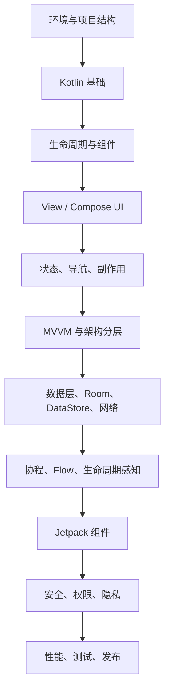

# Android 学习笔记总目录

本目录是一份独立的 Android 系统化学习笔记，按章节拆分为多个 Markdown 文档。内容覆盖 Android 基础、Kotlin、生命周期、Jetpack Compose、应用架构、数据层、协程 Flow、Jetpack 组件、测试调试、性能、安全和发布上线。

> 说明：本目录只新增 Android 学习笔记文件，不修改仓库中已有 Android 文章。

## 推荐阅读顺序

1. `01-overview-and-environment.md`：Android 生态、开发环境、项目结构概览。
2. `02-project-structure-gradle-manifest-resources.md`：Gradle、Manifest、资源系统。
3. `03-kotlin-for-android.md`：Android 开发常用 Kotlin 基础。
4. `04-activity-fragment-lifecycle.md`：Activity、Fragment、生命周期。
5. `05-ui-view-system-and-compose.md`：传统 View 系统与 Compose 基础。
6. `06-compose-state-navigation-side-effects.md`：Compose 状态、导航、副作用。
7. `07-architecture-mvvm-clean-architecture.md`：MVVM、分层架构、Clean Architecture。
8. `08-data-layer-network-room-datastore.md`：网络、Room、DataStore、Repository。
9. `09-coroutines-flow-lifecycle.md`：协程、Flow、结构化并发、生命周期感知。
10. `10-jetpack-components.md`：Navigation、ViewModel、WorkManager、Paging 等。
11. `11-permissions-security-privacy.md`：权限、安全、隐私与合规。
12. `12-performance-and-memory.md`：性能、内存、启动优化。
13. `13-testing-debugging-observability.md`：测试、调试、日志、崩溃分析。
14. `14-release-and-distribution.md`：打包、签名、混淆、发布。
15. `15-roadmap-and-reference.md`：学习路线、项目建议和参考资料。

## Android 学习主线

Android 学习不只是学习 API。更重要的是建立几条主线：

### 生命周期

Android 组件会被系统创建、暂停、恢复、销毁。Activity、Fragment、ViewModel、Compose、协程都要和生命周期配合。

### 状态管理

界面应该由状态驱动。无论使用 XML View 还是 Compose，都要理解 UI State、事件、一次性事件和数据流。

### 架构分层

真实项目通常采用 Presentation、Domain、Data 分层。UI 负责展示和交互，Domain 负责业务规则，Data 负责网络、数据库和缓存。

### 异步与并发

Android 主线程负责 UI，耗时任务必须放到后台。Kotlin Coroutines 和 Flow 是现代 Android 异步开发核心。

### 工程化

Gradle、依赖管理、测试、构建变体、混淆、签名、CI、性能分析和发布流程，是从 Demo 到生产必须掌握的内容。

## 推荐技术栈

现代 Android 新项目常见组合：

- Kotlin。
- Jetpack Compose。
- Material 3。
- ViewModel。
- Kotlin Coroutines。
- Flow。
- Hilt 或 Koin。
- Room。
- DataStore。
- Retrofit 或 Ktor。
- Navigation。
- WorkManager。
- Paging。
- JUnit、MockK、Turbine、Compose UI Test。

## 学习建议

- 先理解 Activity、生命周期和资源系统，再深入 Compose。
- Compose 学习重点是状态和重组，不是只会堆 UI。
- 协程学习重点是结构化并发和取消，不是只会 `launch`。
- 架构学习重点是依赖方向和职责边界，不是文件夹命名。
- 数据层学习重点是 Repository、缓存策略、错误处理和离线能力。
- 测试学习重点是 ViewModel、UseCase、Repository 和 UI 关键流程。

## 最小实战项目

推荐做一个“离线优先的待办或笔记 App”：

- Compose UI。
- Navigation 页面跳转。
- ViewModel 管理 UI State。
- Room 本地存储。
- DataStore 保存设置。
- Repository 封装数据源。
- UseCase 承载业务逻辑。
- WorkManager 做后台同步。
- 单元测试和 Compose UI 测试。

## 资料核对

最后核对日期：2026-06-13。

本笔记按现代 Android 官方推荐架构整理：UI layer 负责把应用数据转换成可展示状态，Data layer 通过 Repository 和 DataSource 管理数据，Domain layer 只在业务复杂或复用度高时引入。学习时不要把“分层”理解成固定文件夹模板，而要关注依赖方向、状态流向和测试边界。

## 学习地图

## 建议掌握的能力闭环

| 能力 | 学到什么程度算入门 | 常见误区 |
| --- | --- | --- |
| 环境和构建 | 能解释 `compileSdk`、`minSdk`、`targetSdk`、build type、flavor | 只会点击 Android Studio 运行按钮 |
| Kotlin | 能用空安全、data class、sealed interface、协程表达业务状态 | 把所有异常都吞成 `null` |
| 生命周期 | 能解释 Activity、Fragment View、ViewModel、Compose 的生命周期边界 | 在 UI 销毁后继续收集 Flow |
| Compose | 能设计单向数据流、状态提升和可测试语义 | 在 Composable 里直接发请求、写数据库 |
| 架构 | 能让 UI、Domain、Data 依赖方向清晰 | 为了“架构感”过早拆太多模块 |
| 数据层 | 能实现本地优先、错误映射、缓存刷新 | UI 直接访问 Retrofit、DAO 或 DTO |
| 工程化 | 能测试、分析性能、签名发布、处理隐私合规 | release 前才想起混淆、权限和崩溃分析 |

## 笔记使用方法

建议按“先跑通，再拆解，再重构”的方式学习：

1. 先用 Compose 做一个单页面待办 App，只要求能新增、勾选、删除。
2. 引入 ViewModel，把界面状态移到 `StateFlow`。
3. 引入 Room，把内存数据替换成本地数据库。
4. 引入 Repository，把 UI 和数据源隔离。
5. 引入 Navigation、DataStore、WorkManager，形成真实 App 的骨架。
6. 最后补测试、性能分析、签名发布和 Play 合规。

每章末尾的检查清单用于自测。如果一个问题解释不清，优先回到对应章节补齐，而不是继续堆新 API。
