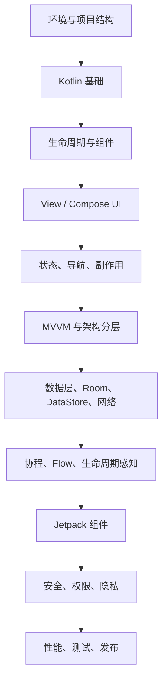
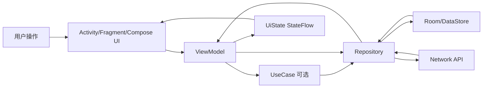
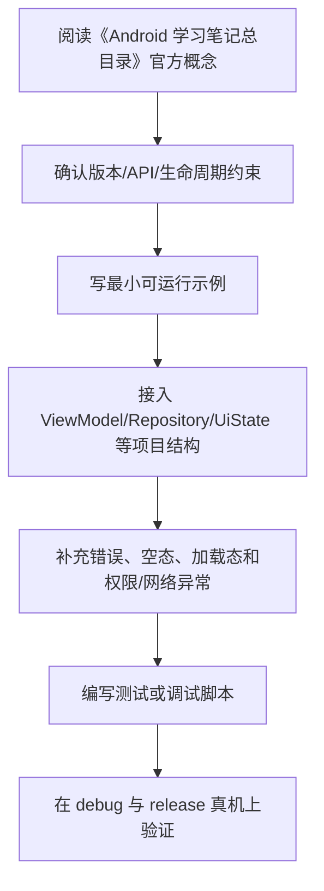

# Android 学习笔记总目录

本目录是一份独立的 Android 系统化学习笔记，按章节拆分为多个 Markdown 文档。内容覆盖 Android 基础、Kotlin、生命周期、Jetpack Compose、应用架构、数据层、协程 Flow、Jetpack 组件、测试调试、性能、安全和发布上线。

> 说明：本目录只新增 Android 学习笔记文件，不修改仓库中已有 Android 文章。

## 推荐阅读顺序

1. `01-overview-and-environment.md`：Android 生态、开发环境、项目结构概览。
2. `02-project-structure-gradle-manifest-resources.md`：Gradle、Manifest、资源系统。
3. `03-kotlin-for-android.md`：Android 开发常用 Kotlin 基础。
4. `04-activity-fragment-lifecycle.md`：Activity、Fragment、生命周期。
5. `05-ui-view-system-and-compose.md`：传统 View 系统与 Compose 基础。
6. `06-compose-state-navigation-side-effects.md`：Compose 状态、导航、副作用。
7. `07-architecture-mvvm-clean-architecture.md`：MVVM、分层架构、Clean Architecture。
8. `08-data-layer-network-room-datastore.md`：网络、Room、DataStore、Repository。
9. `09-coroutines-flow-lifecycle.md`：协程、Flow、结构化并发、生命周期感知。
10. `10-jetpack-components.md`：Navigation、ViewModel、WorkManager、Paging 等。
11. `11-permissions-security-privacy.md`：权限、安全、隐私与合规。
12. `12-performance-and-memory.md`：性能、内存、启动优化。
13. `13-testing-debugging-observability.md`：测试、调试、日志、崩溃分析。
14. `14-release-and-distribution.md`：打包、签名、混淆、发布。
15. `15-roadmap-and-reference.md`：学习路线、项目建议和参考资料。

## Android 学习主线

Android 学习不只是学习 API。更重要的是建立几条主线：

### 生命周期

Android 组件会被系统创建、暂停、恢复、销毁。Activity、Fragment、ViewModel、Compose、协程都要和生命周期配合。

### 状态管理

界面应该由状态驱动。无论使用 XML View 还是 Compose，都要理解 UI State、事件、一次性事件和数据流。

### 架构分层

真实项目通常采用 Presentation、Domain、Data 分层。UI 负责展示和交互，Domain 负责业务规则，Data 负责网络、数据库和缓存。

### 异步与并发

Android 主线程负责 UI，耗时任务必须放到后台。Kotlin Coroutines 和 Flow 是现代 Android 异步开发核心。

### 工程化

Gradle、依赖管理、测试、构建变体、混淆、签名、CI、性能分析和发布流程，是从 Demo 到生产必须掌握的内容。

## 推荐技术栈

现代 Android 新项目常见组合：

- Kotlin。
- Jetpack Compose。
- Material 3。
- ViewModel。
- Kotlin Coroutines。
- Flow。
- Hilt 或 Koin。
- Room。
- DataStore。
- Retrofit 或 Ktor。
- Navigation。
- WorkManager。
- Paging。
- JUnit、MockK、Turbine、Compose UI Test。

## 学习建议

- 先理解 Activity、生命周期和资源系统，再深入 Compose。
- Compose 学习重点是状态和重组，不是只会堆 UI。
- 协程学习重点是结构化并发和取消，不是只会 `launch`。
- 架构学习重点是依赖方向和职责边界，不是文件夹命名。
- 数据层学习重点是 Repository、缓存策略、错误处理和离线能力。
- 测试学习重点是 ViewModel、UseCase、Repository 和 UI 关键流程。

## 最小实战项目

推荐做一个“离线优先的待办或笔记 App”：

- Compose UI。
- Navigation 页面跳转。
- ViewModel 管理 UI State。
- Room 本地存储。
- DataStore 保存设置。
- Repository 封装数据源。
- UseCase 承载业务逻辑。
- WorkManager 做后台同步。
- 单元测试和 Compose UI 测试。

## 资料核对

最后核对日期：2026-06-13。

本笔记按现代 Android 官方推荐架构整理：UI layer 负责把应用数据转换成可展示状态，Data layer 通过 Repository 和 DataSource 管理数据，Domain layer 只在业务复杂或复用度高时引入。学习时不要把“分层”理解成固定文件夹模板，而要关注依赖方向、状态流向和测试边界。

## 学习地图



## 建议掌握的能力闭环

| 能力 | 学到什么程度算入门 | 常见误区 |
| --- | --- | --- |
| 环境和构建 | 能解释 `compileSdk`、`minSdk`、`targetSdk`、build type、flavor | 只会点击 Android Studio 运行按钮 |
| Kotlin | 能用空安全、data class、sealed interface、协程表达业务状态 | 把所有异常都吞成 `null` |
| 生命周期 | 能解释 Activity、Fragment View、ViewModel、Compose 的生命周期边界 | 在 UI 销毁后继续收集 Flow |
| Compose | 能设计单向数据流、状态提升和可测试语义 | 在 Composable 里直接发请求、写数据库 |
| 架构 | 能让 UI、Domain、Data 依赖方向清晰 | 为了“架构感”过早拆太多模块 |
| 数据层 | 能实现本地优先、错误映射、缓存刷新 | UI 直接访问 Retrofit、DAO 或 DTO |
| 工程化 | 能测试、分析性能、签名发布、处理隐私合规 | release 前才想起混淆、权限和崩溃分析 |

## 笔记使用方法

建议按“先跑通，再拆解，再重构”的方式学习：

1. 先用 Compose 做一个单页面待办 App，只要求能新增、勾选、删除。
2. 引入 ViewModel，把界面状态移到 `StateFlow`。
3. 引入 Room，把内存数据替换成本地数据库。
4. 引入 Repository，把 UI 和数据源隔离。
5. 引入 Navigation、DataStore、WorkManager，形成真实 App 的骨架。
6. 最后补测试、性能分析、签名发布和 Play 合规。

每章末尾的检查清单用于自测。如果一个问题解释不清，优先回到对应章节补齐，而不是继续堆新 API。

---

## 万字精讲扩展（2026-06-16 更新）
> Last researched: 2026-06-16。本文补充内容以现代 Android 官方推荐实践为主；涉及 Android Studio、AGP、Kotlin、Compose、Jetpack、Play 政策和权限模型的内容，应在实际项目中继续核对最新官方文档。

### 本章在 Android 学习路线中的位置

《Android 学习笔记总目录》是 Android 能力闭环中的一个环节。Android 开发不是只会写页面，也不是只会接接口，而是要同时处理生命周期、状态、数据、线程、权限、性能、测试和发布。学习本章时，建议把每个 API 都放到一个真实屏幕或真实功能里验证：用户怎样进入页面，状态从哪里来，数据怎样刷新，异常怎样展示，旋转和后台后是否恢复，release 包是否仍然正常。

本章学习完成后，至少应达到三个标准。第一，能说清相关组件的职责边界和生命周期边界。第二，能写出一个最小可运行例子，并知道它在完整项目中应该放在哪一层。第三，能设计一个失败场景验证自己的写法是否稳健。Android 的很多能力不是“写出来”，而是“在复杂状态下仍然正确”。

### 路线与总览类笔记的精讲重点

路线类章节的核心不是列技术名词，而是规划能力闭环。Android 初学者应先掌握项目能跑、页面能显示、状态能变化、数据能保存、网络能请求、错误能处理、应用能发布。等这些闭环完成后，再逐步学习模块化、离线优先、性能优化、测试体系和安全合规。只学单个库而没有完整项目，很容易出现“会写 demo，不会做产品”的问题。

阅读顺序建议从基础环境和项目结构开始，再到 Kotlin、生命周期、UI、状态、架构、数据、协程、Jetpack、权限安全、性能、测试和发布。每一阶段都应该配一个小任务，不要只看文档。比如学完数据层就做离线缓存，学完协程就处理取消和异常，学完发布就真的打一个 release 包并检查签名和混淆。

### Android 学习的主线：生命周期、状态、数据流和边界

Android 学习最容易碎片化：今天学 Activity，明天学 Compose，后天学协程和 Room，但不知道这些东西怎样组合成一个稳定应用。更有效的主线是围绕四个问题建立框架。第一，组件什么时候创建、可见、可交互、暂停、销毁，这对应 Activity、Fragment、ViewModel、Lifecycle 和进程死亡。第二，状态放在哪里、谁拥有状态、UI 如何订阅状态、事件如何上行，这对应 MVVM、UI State、Compose state、StateFlow 和单向数据流。第三，数据从哪里来、如何缓存、如何离线、如何同步、错误如何表达，这对应 Repository、Room、DataStore、网络层和离线优先。第四，边界在哪里，包括线程边界、生命周期边界、模块边界、安全边界、测试边界和发布边界。

官方 Android 架构指南把 UI layer、可选 domain layer 和 data layer 作为推荐理解方式。UI 层负责展示应用数据并处理用户交互；数据层通过 repository 暴露应用数据，并组合本地、网络等数据源；domain 层不是每个应用必须有，主要用于复用复杂业务逻辑。学习时不要把“Clean Architecture 图”背成固定目录，而要理解依赖方向：UI 依赖业务抽象，业务不应该反向依赖具体 UI；数据实现可以被替换，调用方不应该到处知道 Retrofit、Room 或 DataStore 的细节。

### 一个现代 Android 应用的数据与状态闭环



Figure: Android 单向数据流和分层架构，综合 Android 官方 App Architecture、Data layer、Compose state 和 lifecycle-aware coroutines 文档整理。

这个闭环说明：UI 不应该直接拼网络请求和数据库查询；ViewModel 不应该持有 Activity 引用；Repository 不应该返回与界面强绑定的 View 对象；Composable 不应该在重组过程中直接执行不可控副作用；生命周期相关收集应该使用 lifecycle-aware API；本地缓存和远程同步应由数据层统一协调。只要这个闭环清楚，很多 API 的选择就会自然起来。

### 学 Android 要建立版本和政策意识

Android 是一个快速演进的平台。API Level、Android Gradle Plugin、Kotlin、Compose Compiler、Jetpack 库、Play 政策、权限模型、后台限制和隐私要求都会变化。因此笔记里不应只写“某 API 怎么用”，还要写“适用版本、替代方案、官方推荐状态、迁移风险”。例如运行时权限、通知权限、前台服务、后台定位、存储访问、exported 组件、明文网络、签名和 targetSdk 都和平台版本或政策强相关。做项目时必须查最新官方文档，而不是只依赖旧博客。

### 最小实战闭环

建议每个阶段都围绕一个小应用反复迭代，例如待办清单、记账、阅读列表、天气、RSS、课程表或离线笔记。第一版只做单 Activity + Compose UI；第二版加入 ViewModel 和 UiState；第三版加入 Room 或 DataStore；第四版加入网络层和 Repository；第五版加入 WorkManager 同步；第六版加入测试、性能分析、R8、签名和发布检查。这样每个知识点都会在同一个项目里发生关系，而不是停留在零散 demo。

### 核心知识点逐条精讲

#### 1. 推荐阅读顺序

在《Android 学习笔记总目录》里，`推荐阅读顺序` 需要从“平台约束、代码写法、生命周期、测试和线上风险”五个角度理解。Android 不是普通 JVM 程序，它运行在移动设备、受系统生命周期和权限模型约束，随时可能经历旋转、后台、进程回收、权限撤销、网络变化和系统版本差异。学习任何 API 时都要问：它在哪个生命周期内有效，是否需要主线程，是否会泄漏 Context，是否能被测试，失败后用户看到什么。

实践中建议把 `推荐阅读顺序` 写成可执行规则。例如“在 ViewModel 暴露不可变 UiState，UI 只收集状态并上报事件”，“Repository 负责组合本地和远程数据源，UI 不直接调用 DAO 或 Retrofit”，“Fragment 只在 viewLifecycleOwner 范围内访问 View”，“Compose 副作用必须放进受控 Effect API”，“release 包必须开启并验证 R8 相关路径”。这些规则比单纯记住 API 名称更能防止真实项目出错。

判断 `推荐阅读顺序` 是否掌握，可以用三个问题：能否写出最小代码；能否说清错误使用会导致什么现象；能否设计测试或调试方法证明它工作正常。比如只会写权限申请代码还不够，还要知道用户拒绝、永久拒绝、系统自动撤销权限、targetSdk 变化时怎样处理。Android 工程能力来自这些边界判断，而不是来自 API 列表背诵。

#### 2. Android 学习主线

在《Android 学习笔记总目录》里，`Android 学习主线` 需要从“平台约束、代码写法、生命周期、测试和线上风险”五个角度理解。Android 不是普通 JVM 程序，它运行在移动设备、受系统生命周期和权限模型约束，随时可能经历旋转、后台、进程回收、权限撤销、网络变化和系统版本差异。学习任何 API 时都要问：它在哪个生命周期内有效，是否需要主线程，是否会泄漏 Context，是否能被测试，失败后用户看到什么。

实践中建议把 `Android 学习主线` 写成可执行规则。例如“在 ViewModel 暴露不可变 UiState，UI 只收集状态并上报事件”，“Repository 负责组合本地和远程数据源，UI 不直接调用 DAO 或 Retrofit”，“Fragment 只在 viewLifecycleOwner 范围内访问 View”，“Compose 副作用必须放进受控 Effect API”，“release 包必须开启并验证 R8 相关路径”。这些规则比单纯记住 API 名称更能防止真实项目出错。

判断 `Android 学习主线` 是否掌握，可以用三个问题：能否写出最小代码；能否说清错误使用会导致什么现象；能否设计测试或调试方法证明它工作正常。比如只会写权限申请代码还不够，还要知道用户拒绝、永久拒绝、系统自动撤销权限、targetSdk 变化时怎样处理。Android 工程能力来自这些边界判断，而不是来自 API 列表背诵。

#### 3. 推荐技术栈

在《Android 学习笔记总目录》里，`推荐技术栈` 需要从“平台约束、代码写法、生命周期、测试和线上风险”五个角度理解。Android 不是普通 JVM 程序，它运行在移动设备、受系统生命周期和权限模型约束，随时可能经历旋转、后台、进程回收、权限撤销、网络变化和系统版本差异。学习任何 API 时都要问：它在哪个生命周期内有效，是否需要主线程，是否会泄漏 Context，是否能被测试，失败后用户看到什么。

实践中建议把 `推荐技术栈` 写成可执行规则。例如“在 ViewModel 暴露不可变 UiState，UI 只收集状态并上报事件”，“Repository 负责组合本地和远程数据源，UI 不直接调用 DAO 或 Retrofit”，“Fragment 只在 viewLifecycleOwner 范围内访问 View”，“Compose 副作用必须放进受控 Effect API”，“release 包必须开启并验证 R8 相关路径”。这些规则比单纯记住 API 名称更能防止真实项目出错。

判断 `推荐技术栈` 是否掌握，可以用三个问题：能否写出最小代码；能否说清错误使用会导致什么现象；能否设计测试或调试方法证明它工作正常。比如只会写权限申请代码还不够，还要知道用户拒绝、永久拒绝、系统自动撤销权限、targetSdk 变化时怎样处理。Android 工程能力来自这些边界判断，而不是来自 API 列表背诵。

#### 4. 最小实战项目

在《Android 学习笔记总目录》里，`最小实战项目` 需要从“平台约束、代码写法、生命周期、测试和线上风险”五个角度理解。Android 不是普通 JVM 程序，它运行在移动设备、受系统生命周期和权限模型约束，随时可能经历旋转、后台、进程回收、权限撤销、网络变化和系统版本差异。学习任何 API 时都要问：它在哪个生命周期内有效，是否需要主线程，是否会泄漏 Context，是否能被测试，失败后用户看到什么。

实践中建议把 `最小实战项目` 写成可执行规则。例如“在 ViewModel 暴露不可变 UiState，UI 只收集状态并上报事件”，“Repository 负责组合本地和远程数据源，UI 不直接调用 DAO 或 Retrofit”，“Fragment 只在 viewLifecycleOwner 范围内访问 View”，“Compose 副作用必须放进受控 Effect API”，“release 包必须开启并验证 R8 相关路径”。这些规则比单纯记住 API 名称更能防止真实项目出错。

判断 `最小实战项目` 是否掌握，可以用三个问题：能否写出最小代码；能否说清错误使用会导致什么现象；能否设计测试或调试方法证明它工作正常。比如只会写权限申请代码还不够，还要知道用户拒绝、永久拒绝、系统自动撤销权限、targetSdk 变化时怎样处理。Android 工程能力来自这些边界判断，而不是来自 API 列表背诵。

#### 5. 能力闭环

在《Android 学习笔记总目录》里，`能力闭环` 需要从“平台约束、代码写法、生命周期、测试和线上风险”五个角度理解。Android 不是普通 JVM 程序，它运行在移动设备、受系统生命周期和权限模型约束，随时可能经历旋转、后台、进程回收、权限撤销、网络变化和系统版本差异。学习任何 API 时都要问：它在哪个生命周期内有效，是否需要主线程，是否会泄漏 Context，是否能被测试，失败后用户看到什么。

实践中建议把 `能力闭环` 写成可执行规则。例如“在 ViewModel 暴露不可变 UiState，UI 只收集状态并上报事件”，“Repository 负责组合本地和远程数据源，UI 不直接调用 DAO 或 Retrofit”，“Fragment 只在 viewLifecycleOwner 范围内访问 View”，“Compose 副作用必须放进受控 Effect API”，“release 包必须开启并验证 R8 相关路径”。这些规则比单纯记住 API 名称更能防止真实项目出错。

判断 `能力闭环` 是否掌握，可以用三个问题：能否写出最小代码；能否说清错误使用会导致什么现象；能否设计测试或调试方法证明它工作正常。比如只会写权限申请代码还不够，还要知道用户拒绝、永久拒绝、系统自动撤销权限、targetSdk 变化时怎样处理。Android 工程能力来自这些边界判断，而不是来自 API 列表背诵。


### 场景化学习与排错表

| 主题 | 推荐动作 | 常见风险 | 验证方式 |
| :--- | :--- | :--- | :--- |
| 推荐阅读顺序 | 先查官方文档和版本要求，再写最小 demo，最后放入项目闭环验证 | 生命周期错位、Context 泄漏、线程错误、版本差异、只测 debug | 单元测试、仪器测试、Logcat、Profiler、release 构建和真机验证 |
| Android 学习主线 | 先查官方文档和版本要求，再写最小 demo，最后放入项目闭环验证 | 生命周期错位、Context 泄漏、线程错误、版本差异、只测 debug | 单元测试、仪器测试、Logcat、Profiler、release 构建和真机验证 |
| 推荐技术栈 | 先查官方文档和版本要求，再写最小 demo，最后放入项目闭环验证 | 生命周期错位、Context 泄漏、线程错误、版本差异、只测 debug | 单元测试、仪器测试、Logcat、Profiler、release 构建和真机验证 |
| 最小实战项目 | 先查官方文档和版本要求，再写最小 demo，最后放入项目闭环验证 | 生命周期错位、Context 泄漏、线程错误、版本差异、只测 debug | 单元测试、仪器测试、Logcat、Profiler、release 构建和真机验证 |
| 能力闭环 | 先查官方文档和版本要求，再写最小 demo，最后放入项目闭环验证 | 生命周期错位、Context 泄漏、线程错误、版本差异、只测 debug | 单元测试、仪器测试、Logcat、Profiler、release 构建和真机验证 |

表格中的推荐动作强调“官方依据 + 最小验证 + 项目闭环”。Android 生态变化快，旧博客里的写法可能已经被官方替代，或者只适用于某个 API Level、某个 Jetpack 版本。遇到冲突时，优先查 Android Developers、Kotlin、Gradle 和库的 release notes，再参考社区经验。

### 本章建议工作流



Figure: 《Android 学习笔记总目录》学习工作流，综合 Android 官方架构、Compose、Lifecycle、Coroutines、Data layer、Performance 和 Release 文档整理。

这个工作流避免两个极端：只看文档不落地，或者只复制 demo 不理解边界。Android 很多 bug 只在生命周期切换、后台恢复、低内存、release 混淆、慢网络、权限拒绝或特定系统版本中出现，所以最小 demo 跑通以后，还要放回完整应用场景验证。

### 常见误区和纠正方法

- 误区：Activity/Fragment 里堆所有逻辑。纠正：UI 组件负责展示和事件，状态放 ViewModel，数据访问放 Repository，复杂复用逻辑再考虑 UseCase。
- 误区：只测 debug，不测 release。纠正：R8、资源压缩、签名、网络安全配置和 build variants 可能让 release 行为不同，发布前必须验证 release 包。
- 误区：忽略生命周期。纠正：Flow 收集、回调注册、binding、协程、导航和副作用都要绑定正确 lifecycle。
- 误区：把 Compose 当成简单 XML 替代。纠正：Compose 的核心是状态驱动 UI、可组合函数、重组、副作用控制和稳定性。
- 误区：权限申请只看成功路径。纠正：必须处理拒绝、永久拒绝、功能降级、隐私说明、targetSdk 变化和系统自动撤销。
- 误区：看到性能问题就先优化代码。纠正：先用 Profiler、Baseline Profile、启动指标、帧时间、内存快照和日志定位瓶颈。

### 与相邻章节的关系

《Android 学习笔记总目录》应和其他章节联动阅读。项目结构决定依赖和构建变体，Kotlin 决定状态和异步表达方式，生命周期决定 UI 和协程边界，Compose 决定状态和副作用组织，架构决定依赖方向，数据层决定离线和同步能力，测试和发布决定应用能否可靠交付。任何一个主题脱离这些关系，都容易变成 demo 级知识。

### 实操训练和复盘模板

1. 围绕 `推荐阅读顺序` 做一个小任务：写最小实现、制造一个失败场景、记录修复方法。
2. 围绕 `Android 学习主线` 做一个小任务：写最小实现、制造一个失败场景、记录修复方法。
3. 围绕 `推荐技术栈` 做一个小任务：写最小实现、制造一个失败场景、记录修复方法。
4. 围绕 `最小实战项目` 做一个小任务：写最小实现、制造一个失败场景、记录修复方法。
5. 围绕 `能力闭环` 做一个小任务：写最小实现、制造一个失败场景、记录修复方法。

建议每次练习都按下面格式记录：

```text
练习名称：
本章主题：Android 学习笔记总目录
目标 API / 组件：
版本信息：Android Studio、AGP、Kotlin、compileSdk、minSdk、targetSdk、相关 Jetpack 版本
最小实现：
生命周期和线程边界：
失败场景：旋转、后台、进程死亡、断网、权限拒绝、release 混淆等
调试证据：Logcat、断点、Profiler、截图、测试结果
最终规则：以后项目中如何写，什么情况下不能这样写
```

这个模板能把“会用 API”推进到“知道边界”。很多 Android 问题第一次看像偶发 bug，复盘后会发现是生命周期、状态持有、线程、权限、缓存或构建变体没有设计清楚。

## 参考资料与延伸阅读

- [Official / Android] Guide to app architecture: https://developer.android.com/topic/architecture
- [Official / Android] UI layer: https://developer.android.com/topic/architecture/ui-layer
- [Official / Android] Data layer: https://developer.android.com/topic/architecture/data-layer
- [Official / Android] Domain layer: https://developer.android.com/topic/architecture/domain-layer
- [Official / Android] Build an offline-first app: https://developer.android.com/topic/architecture/data-layer/offline-first
- [Official / Android] Configure your build: https://developer.android.com/build
- [Official / Android] Add build dependencies: https://developer.android.com/build/dependencies
- [Official / Android] Fragment lifecycle: https://developer.android.com/guide/fragments/lifecycle
- [Official / Android] Saved State module for ViewModel: https://developer.android.com/topic/libraries/architecture/viewmodel/viewmodel-savedstate
- [Official / Android] State and Jetpack Compose: https://developer.android.com/develop/ui/compose/state
- [Official / Android] Side-effects in Compose: https://developer.android.com/develop/ui/compose/side-effects
- [Official / Android] Jetpack Compose performance: https://developer.android.com/develop/ui/compose/performance
- [Official / Android] Stability in Compose: https://developer.android.com/develop/ui/compose/performance/stability
- [Official / Android] Kotlin coroutines on Android: https://developer.android.com/kotlin/coroutines
- [Official / Android] Kotlin flows on Android: https://developer.android.com/kotlin/flow
- [Official / Android] Use Kotlin coroutines with lifecycle-aware components: https://developer.android.com/topic/libraries/architecture/coroutines
- [Official / Android] Dependency injection with Hilt: https://developer.android.com/training/dependency-injection/hilt-android
- [Official / Android] Network security configuration: https://developer.android.com/privacy-and-security/security-config
- [Official / Android] Enable app optimization with R8: https://developer.android.com/topic/performance/app-optimization/enable-app-optimization
- [Official / Android] Baseline Profiles overview: https://developer.android.com/topic/performance/baselineprofiles/overview
- [Official / Google Codelab] Improve app performance with Baseline Profiles: https://codelabs.developers.google.com/android-baseline-profiles-improve
- [Official / Kotlin] Kotlin documentation: https://kotlinlang.org/docs/home.html
- [Official / Kotlin] Sealed classes and interfaces: https://kotlinlang.org/docs/sealed-classes.html
- [Official / Kotlin] Configure a Gradle project: https://kotlinlang.org/docs/gradle-configure-project.html
- [Official / Gradle] Gradle Kotlin DSL Primer: https://docs.gradle.org/current/userguide/kotlin_dsl.html
- [Security / OWASP] Android Network Security Configuration: https://mas.owasp.org/MASTG/knowledge/android/MASVS-NETWORK/MASTG-KNOW-0014/
- [Blog / Android Developers] Rebuilding our guide to app architecture: https://android-developers.googleblog.com/2021/12/rebuilding-our-guide-to-app-architecture.html
- [Blog / Android Developers] Improving Performance with Baseline Profiles: https://medium.com/androiddevelopers/improving-performance-with-baseline-profiles-fdd0db0d8cc6
- [Community / CSDN] Android 学习笔记检索入口: https://so.csdn.net/so/search?q=Android%20%E5%AD%A6%E4%B9%A0%E7%AC%94%E8%AE%B0%20Jetpack%20Compose
- [Community / 博客园] Android 架构与 Jetpack 笔记检索入口: https://zzk.cnblogs.com/s/blogpost?Keywords=Android%20Jetpack%20MVVM%20Compose
- [Community / 掘金] Android Compose / 协程 / 架构实践检索入口: https://juejin.cn/search?query=Android%20Compose%20%E5%8D%8F%E7%A8%8B%20%E6%9E%B6%E6%9E%84&type=0

<!-- research-notes: enhanced-v1 -->

## 研究笔记增强

> Last reviewed: 2026-06-17。此节用于把《Android 学习笔记总目录》从阅读笔记推进到可复习、可实践、可验证的研究笔记；具体版本、参数和环境仍需结合官方资料、项目约束和实测结果校准。

### 知识定位

把知识点放在 Android 生命周期、架构分层、数据流和发布质量的整体链路中理解。

### 重点补充
- 明确 Activity、Fragment、ViewModel、Repository 和数据源的职责边界。
- 处理权限、隐私、弱网、离线、配置变更和后台任务。
- 用日志、崩溃堆栈、性能指标和 UI 测试验证实现。
- 明确适用场景、限制条件、替代方案和迁移成本。

### 实践清单
- 为本章整理一张概念关系图、流程图或最小系统图。
- 写一个最小可运行示例，并保留运行命令、输入、输出和环境版本。
- 列出常见错误、排查命令、关键日志和修复动作。
- 补充安全、性能、兼容性、可维护性和上线运维注意事项。
- 用一次真实问题或练习项目复盘验证笔记是否可用。

### 常见误区
- 只摘抄定义或命令，没有记录上下文、前提条件和边界。
- 只记录成功路径，不记录失败样本、异常现象和排查过程。
- 没有版本、环境和数据样本，导致后续无法复现。
- 把教程默认值直接用于真实项目，没有结合约束重新评估。

### 复盘问题
- 学完《Android 学习笔记总目录》后，能否用自己的话说明它解决什么问题、不解决什么问题？
- 如果要在真实项目中使用，需要哪些前置条件、依赖版本、输入数据和验证手段？
- 失败时最先检查哪三类证据：日志、指标、抓包、堆栈、配置、样本还是硬件测量？
- 有没有形成可重复的最小实验、测试用例或排查命令？

### 延伸方向
- 官方文档和版本变更记录。
- 同类技术、框架或方案对比。
- 面向真实项目的最小实践。
- 故障排查清单和复盘案例库。

### 复盘记录模板

```text
主题：Android 学习笔记总目录
日期：
目标：本次要验证或掌握的具体问题
环境：系统 / 语言 / 框架 / 工具 / 设备 / 版本
步骤：最小可复现流程
现象：成功输出、失败输出、日志、指标或测量数据
分析：为什么会出现该现象，和哪些概念相关
结论：可复用的规则、命令、配置或设计取舍
风险：边界条件、性能、安全、兼容性或维护成本
下一步：继续实验、补充资料或应用到项目
```
