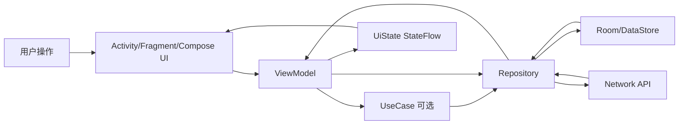
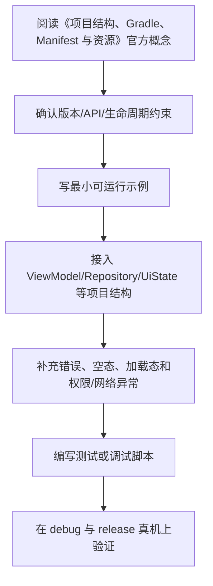

# 02. 项目结构、Gradle、Manifest 与资源

## Gradle 的作用

Gradle 是 Android 项目的构建系统，负责：

- 编译 Kotlin / Java。
- 处理资源。
- 打包 APK / AAB。
- 管理依赖。
- 配置构建变体。
- 执行测试。
- 运行代码生成任务。

Android 项目通常包含根目录 Gradle 配置和模块 Gradle 配置。

## settings.gradle.kts

示例：

```kotlin
pluginManagement {
    repositories {
        google()
        mavenCentral()
        gradlePluginPortal()
    }
}

dependencyResolutionManagement {
    repositoriesMode.set(RepositoriesMode.FAIL_ON_PROJECT_REPOS)
    repositories {
        google()
        mavenCentral()
    }
}

rootProject.name = "DemoApp"
include(":app")
```

## app/build.gradle.kts

示例：

```kotlin
plugins {
    id("com.android.application")
    id("org.jetbrains.kotlin.android")
}

android {
    namespace = "com.example.demo"
    compileSdk = 35

    defaultConfig {
        applicationId = "com.example.demo"
        minSdk = 23
        targetSdk = 35
        versionCode = 1
        versionName = "1.0"
    }
}
```

具体版本应以当前 Android Gradle Plugin 和项目要求为准。

## 依赖管理

```kotlin
dependencies {
    implementation("androidx.core:core-ktx:...")
    implementation("androidx.lifecycle:lifecycle-viewmodel-compose:...")
    implementation("androidx.navigation:navigation-compose:...")
    testImplementation("junit:junit:...")
    androidTestImplementation("androidx.compose.ui:ui-test-junit4:...")
}
```

常见配置：

- `implementation`：模块内部使用。
- `api`：库模块暴露给调用方。
- `testImplementation`：本地测试。
- `androidTestImplementation`：设备测试。
- `debugImplementation`：Debug 构建专用。

## Version Catalog

大型项目建议使用 `libs.versions.toml` 管理版本：

```toml
[versions]
kotlin = "..."
composeBom = "..."

[libraries]
androidx-core-ktx = { module = "androidx.core:core-ktx", version = "..." }
```

优点：

- 依赖版本集中管理。
- 多模块项目更一致。
- 降低重复配置。

## AndroidManifest.xml

Manifest 声明应用组件、权限和元数据：

```xml
<manifest xmlns:android="http://schemas.android.com/apk/res/android">
    <uses-permission android:name="android.permission.INTERNET" />

    <application
        android:theme="@style/Theme.App">
        <activity
            android:name=".MainActivity"
            android:exported="true">
            <intent-filter>
                <action android:name="android.intent.action.MAIN" />
                <category android:name="android.intent.category.LAUNCHER" />
            </intent-filter>
        </activity>
    </application>
</manifest>
```

注意：

- 有 launcher intent-filter 的 Activity 通常需要 `android:exported="true"`。
- 不需要暴露给外部的组件应设置 `exported=false`。
- 权限声明应遵循最小权限原则。

## 资源系统

资源目录：

```text
res/
├── drawable/
├── mipmap/
├── values/
├── font/
├── raw/
└── xml/
```

常见资源：

- 字符串：`res/values/strings.xml`
- 颜色：`res/values/colors.xml`
- 样式：`res/values/styles.xml`
- 图片：`drawable`
- 启动图标：`mipmap`

## 字符串资源

```xml
<resources>
    <string name="app_name">Demo</string>
</resources>
```

使用字符串资源有利于国际化。不要在 UI 中硬编码大量可见文本。

Compose 中读取：

```kotlin
Text(text = stringResource(R.string.app_name))
```

## 多语言和多资源限定符

示例：

```text
values/strings.xml
values-zh/strings.xml
values-night/colors.xml
drawable-hdpi/
drawable-xhdpi/
```

Android 会根据设备语言、屏幕密度、夜间模式等选择合适资源。

## Build Types 与 Product Flavors

Build Types：

```kotlin
buildTypes {
    debug {
        isDebuggable = true
    }
    release {
        isMinifyEnabled = true
    }
}
```

Product Flavors：

```kotlin
flavorDimensions += "env"
productFlavors {
    create("dev") { dimension = "env" }
    create("prod") { dimension = "env" }
}
```

常用于区分开发、测试、生产环境。

## 本章检查清单

- 是否知道 Gradle 在 Android 项目中的作用？
- 是否能解释 Manifest 的用途？
- 是否知道资源为什么要放在 res 下？
- 是否理解 implementation、api、testImplementation？
- 是否知道 build type 和 flavor 的区别？

## Gradle 配置的关键边界

Android 项目常见三层 Gradle 配置：

```text
settings.gradle.kts       声明插件仓库、依赖仓库、模块 include
build.gradle.kts          根项目公共插件版本和全局约定
app/build.gradle.kts      Android 插件、namespace、SDK、依赖、构建变体
```

现代项目建议：

- 使用 Kotlin DSL，即 `*.gradle.kts`。
- 使用 Version Catalog，即 `gradle/libs.versions.toml` 管理依赖版本。
- 使用 Gradle Wrapper，即 `gradlew` 固定 Gradle 版本。
- 避免在每个模块重复写一大段相同配置，复杂项目可抽到 convention plugin。

示例：

```toml
[versions]
agp = "x.y.z"
kotlin = "x.y.z"
composeBom = "yyyy.mm.00"

[plugins]
android-application = { id = "com.android.application", version.ref = "agp" }
kotlin-android = { id = "org.jetbrains.kotlin.android", version.ref = "kotlin" }

[libraries]
compose-bom = { module = "androidx.compose:compose-bom", version.ref = "composeBom" }
```

这里的版本号是占位示例。真实项目要以 Android Gradle Plugin release notes、Kotlin release notes、Compose BOM 和项目兼容矩阵为准，不要直接复制旧笔记里的版本。

## Manifest 的常见职责

Manifest 不只是注册 Activity。它还承担：

- 声明包内组件：Activity、Service、Receiver、Provider。
- 声明权限：如网络、相机、通知、定位。
- 声明应用级属性：主题、图标、备份策略、网络安全配置。
- 声明 Intent Filter：决定外部如何启动组件。
- 声明 `exported`：决定组件是否可被其他应用访问。

Android 12 之后，带有 intent filter 的组件必须显式声明 `android:exported`。原则是：没有跨应用访问需求就设为 `false`。

## 资源系统实践

资源不是简单文件夹，它会参与编译并生成类型安全 ID。

| 目录 | 用途 | 注意点 |
| --- | --- | --- |
| `res/values/strings.xml` | 文案 | 不要在 UI 中硬编码可见文案 |
| `res/values/colors.xml` | 传统颜色资源 | Compose 项目也可能用于启动主题 |
| `res/drawable` | 位图、shape、vector | 大图要关注内存和密度 |
| `res/mipmap` | 启动图标 | 启动器图标优先放这里 |
| `res/xml` | 配置文件 | file provider、network security config 常见 |

多语言资源示例：

```text
res/values/strings.xml
res/values-zh-rCN/strings.xml
res/values-ja/strings.xml
```

不要拼接自然语言句子，复数、占位符和语序在不同语言中可能不同。

## 构建变体实践

`buildTypes` 表示构建用途，`productFlavors` 表示产品维度。

常见组合：

```text
devDebug       开发环境调试包
stagingDebug   预发环境调试包
prodRelease    正式发布包
```

常见差异：

- API base URL。
- 应用名后缀。
- 日志开关。
- 是否启用混淆。
- 是否启用调试菜单。

不要把密钥直接写进 Gradle 文件或 Git 仓库。可使用 CI Secret、`local.properties`、远程配置或后端下发机制。

## 常见构建问题排查顺序

1. 先看第一条真正的 error，不要只看最后的 `BUILD FAILED`。
2. 确认 AGP、Gradle、JDK、Kotlin、Compose Compiler 是否兼容。
3. 清理无效缓存前先尝试命令行构建，区分 IDE 问题和项目问题。
4. 多模块循环依赖时，用 `./gradlew :app:dependencies` 或 IDE dependency analyzer 看依赖图。
5. 依赖冲突时优先升级或对齐 BOM，不要随意 `exclude`。

---

## 万字精讲扩展（2026-06-16 更新）
> Last researched: 2026-06-16。本文补充内容以现代 Android 官方推荐实践为主；涉及 Android Studio、AGP、Kotlin、Compose、Jetpack、Play 政策和权限模型的内容，应在实际项目中继续核对最新官方文档。

### 本章在 Android 学习路线中的位置

《项目结构、Gradle、Manifest 与资源》是 Android 能力闭环中的一个环节。Android 开发不是只会写页面，也不是只会接接口，而是要同时处理生命周期、状态、数据、线程、权限、性能、测试和发布。学习本章时，建议把每个 API 都放到一个真实屏幕或真实功能里验证：用户怎样进入页面，状态从哪里来，数据怎样刷新，异常怎样展示，旋转和后台后是否恢复，release 包是否仍然正常。

本章学习完成后，至少应达到三个标准。第一，能说清相关组件的职责边界和生命周期边界。第二，能写出一个最小可运行例子，并知道它在完整项目中应该放在哪一层。第三，能设计一个失败场景验证自己的写法是否稳健。Android 的很多能力不是“写出来”，而是“在复杂状态下仍然正确”。

### 项目结构和构建类笔记的精讲重点

Android 项目结构的关键是分清构建脚本、源代码、资源、Manifest 和生成产物。`settings.gradle.kts` 管理项目和模块，模块级 `build.gradle.kts` 配置插件、Android DSL、依赖、build types、flavors 和编译选项，Manifest 声明组件和权限，资源系统负责字符串、图片、主题、多语言和设备限定符。不要把所有配置都当成固定模板复制，要知道每一段影响什么。

Gradle 依赖管理要特别注意版本一致性和传递依赖。Version Catalog 能集中维护版本，但不能替代对依赖边界的理解。Debug/Release、buildConfig、manifestPlaceholders、resValue、productFlavors 和 signingConfig 都会影响最终包。构建问题排查时要从同步日志、依赖树、插件版本、仓库配置和缓存状态入手。

### Android 学习的主线：生命周期、状态、数据流和边界

Android 学习最容易碎片化：今天学 Activity，明天学 Compose，后天学协程和 Room，但不知道这些东西怎样组合成一个稳定应用。更有效的主线是围绕四个问题建立框架。第一，组件什么时候创建、可见、可交互、暂停、销毁，这对应 Activity、Fragment、ViewModel、Lifecycle 和进程死亡。第二，状态放在哪里、谁拥有状态、UI 如何订阅状态、事件如何上行，这对应 MVVM、UI State、Compose state、StateFlow 和单向数据流。第三，数据从哪里来、如何缓存、如何离线、如何同步、错误如何表达，这对应 Repository、Room、DataStore、网络层和离线优先。第四，边界在哪里，包括线程边界、生命周期边界、模块边界、安全边界、测试边界和发布边界。

官方 Android 架构指南把 UI layer、可选 domain layer 和 data layer 作为推荐理解方式。UI 层负责展示应用数据并处理用户交互；数据层通过 repository 暴露应用数据，并组合本地、网络等数据源；domain 层不是每个应用必须有，主要用于复用复杂业务逻辑。学习时不要把“Clean Architecture 图”背成固定目录，而要理解依赖方向：UI 依赖业务抽象，业务不应该反向依赖具体 UI；数据实现可以被替换，调用方不应该到处知道 Retrofit、Room 或 DataStore 的细节。

### 一个现代 Android 应用的数据与状态闭环



Figure: Android 单向数据流和分层架构，综合 Android 官方 App Architecture、Data layer、Compose state 和 lifecycle-aware coroutines 文档整理。

这个闭环说明：UI 不应该直接拼网络请求和数据库查询；ViewModel 不应该持有 Activity 引用；Repository 不应该返回与界面强绑定的 View 对象；Composable 不应该在重组过程中直接执行不可控副作用；生命周期相关收集应该使用 lifecycle-aware API；本地缓存和远程同步应由数据层统一协调。只要这个闭环清楚，很多 API 的选择就会自然起来。

### 学 Android 要建立版本和政策意识

Android 是一个快速演进的平台。API Level、Android Gradle Plugin、Kotlin、Compose Compiler、Jetpack 库、Play 政策、权限模型、后台限制和隐私要求都会变化。因此笔记里不应只写“某 API 怎么用”，还要写“适用版本、替代方案、官方推荐状态、迁移风险”。例如运行时权限、通知权限、前台服务、后台定位、存储访问、exported 组件、明文网络、签名和 targetSdk 都和平台版本或政策强相关。做项目时必须查最新官方文档，而不是只依赖旧博客。

### 最小实战闭环

建议每个阶段都围绕一个小应用反复迭代，例如待办清单、记账、阅读列表、天气、RSS、课程表或离线笔记。第一版只做单 Activity + Compose UI；第二版加入 ViewModel 和 UiState；第三版加入 Room 或 DataStore；第四版加入网络层和 Repository；第五版加入 WorkManager 同步；第六版加入测试、性能分析、R8、签名和发布检查。这样每个知识点都会在同一个项目里发生关系，而不是停留在零散 demo。

### 核心知识点逐条精讲

#### 1. Gradle 与 Kotlin DSL

在《项目结构、Gradle、Manifest 与资源》里，`Gradle 与 Kotlin DSL` 需要从“平台约束、代码写法、生命周期、测试和线上风险”五个角度理解。Android 不是普通 JVM 程序，它运行在移动设备、受系统生命周期和权限模型约束，随时可能经历旋转、后台、进程回收、权限撤销、网络变化和系统版本差异。学习任何 API 时都要问：它在哪个生命周期内有效，是否需要主线程，是否会泄漏 Context，是否能被测试，失败后用户看到什么。

实践中建议把 `Gradle 与 Kotlin DSL` 写成可执行规则。例如“在 ViewModel 暴露不可变 UiState，UI 只收集状态并上报事件”，“Repository 负责组合本地和远程数据源，UI 不直接调用 DAO 或 Retrofit”，“Fragment 只在 viewLifecycleOwner 范围内访问 View”，“Compose 副作用必须放进受控 Effect API”，“release 包必须开启并验证 R8 相关路径”。这些规则比单纯记住 API 名称更能防止真实项目出错。

判断 `Gradle 与 Kotlin DSL` 是否掌握，可以用三个问题：能否写出最小代码；能否说清错误使用会导致什么现象；能否设计测试或调试方法证明它工作正常。比如只会写权限申请代码还不够，还要知道用户拒绝、永久拒绝、系统自动撤销权限、targetSdk 变化时怎样处理。Android 工程能力来自这些边界判断，而不是来自 API 列表背诵。

#### 2. 依赖管理和 Version Catalog

在《项目结构、Gradle、Manifest 与资源》里，`依赖管理和 Version Catalog` 需要从“平台约束、代码写法、生命周期、测试和线上风险”五个角度理解。Android 不是普通 JVM 程序，它运行在移动设备、受系统生命周期和权限模型约束，随时可能经历旋转、后台、进程回收、权限撤销、网络变化和系统版本差异。学习任何 API 时都要问：它在哪个生命周期内有效，是否需要主线程，是否会泄漏 Context，是否能被测试，失败后用户看到什么。

实践中建议把 `依赖管理和 Version Catalog` 写成可执行规则。例如“在 ViewModel 暴露不可变 UiState，UI 只收集状态并上报事件”，“Repository 负责组合本地和远程数据源，UI 不直接调用 DAO 或 Retrofit”，“Fragment 只在 viewLifecycleOwner 范围内访问 View”，“Compose 副作用必须放进受控 Effect API”，“release 包必须开启并验证 R8 相关路径”。这些规则比单纯记住 API 名称更能防止真实项目出错。

判断 `依赖管理和 Version Catalog` 是否掌握，可以用三个问题：能否写出最小代码；能否说清错误使用会导致什么现象；能否设计测试或调试方法证明它工作正常。比如只会写权限申请代码还不够，还要知道用户拒绝、永久拒绝、系统自动撤销权限、targetSdk 变化时怎样处理。Android 工程能力来自这些边界判断，而不是来自 API 列表背诵。

#### 3. Manifest 职责

在《项目结构、Gradle、Manifest 与资源》里，`Manifest 职责` 需要从“平台约束、代码写法、生命周期、测试和线上风险”五个角度理解。Android 不是普通 JVM 程序，它运行在移动设备、受系统生命周期和权限模型约束，随时可能经历旋转、后台、进程回收、权限撤销、网络变化和系统版本差异。学习任何 API 时都要问：它在哪个生命周期内有效，是否需要主线程，是否会泄漏 Context，是否能被测试，失败后用户看到什么。

实践中建议把 `Manifest 职责` 写成可执行规则。例如“在 ViewModel 暴露不可变 UiState，UI 只收集状态并上报事件”，“Repository 负责组合本地和远程数据源，UI 不直接调用 DAO 或 Retrofit”，“Fragment 只在 viewLifecycleOwner 范围内访问 View”，“Compose 副作用必须放进受控 Effect API”，“release 包必须开启并验证 R8 相关路径”。这些规则比单纯记住 API 名称更能防止真实项目出错。

判断 `Manifest 职责` 是否掌握，可以用三个问题：能否写出最小代码；能否说清错误使用会导致什么现象；能否设计测试或调试方法证明它工作正常。比如只会写权限申请代码还不够，还要知道用户拒绝、永久拒绝、系统自动撤销权限、targetSdk 变化时怎样处理。Android 工程能力来自这些边界判断，而不是来自 API 列表背诵。

#### 4. 资源系统

在《项目结构、Gradle、Manifest 与资源》里，`资源系统` 需要从“平台约束、代码写法、生命周期、测试和线上风险”五个角度理解。Android 不是普通 JVM 程序，它运行在移动设备、受系统生命周期和权限模型约束，随时可能经历旋转、后台、进程回收、权限撤销、网络变化和系统版本差异。学习任何 API 时都要问：它在哪个生命周期内有效，是否需要主线程，是否会泄漏 Context，是否能被测试，失败后用户看到什么。

实践中建议把 `资源系统` 写成可执行规则。例如“在 ViewModel 暴露不可变 UiState，UI 只收集状态并上报事件”，“Repository 负责组合本地和远程数据源，UI 不直接调用 DAO 或 Retrofit”，“Fragment 只在 viewLifecycleOwner 范围内访问 View”，“Compose 副作用必须放进受控 Effect API”，“release 包必须开启并验证 R8 相关路径”。这些规则比单纯记住 API 名称更能防止真实项目出错。

判断 `资源系统` 是否掌握，可以用三个问题：能否写出最小代码；能否说清错误使用会导致什么现象；能否设计测试或调试方法证明它工作正常。比如只会写权限申请代码还不够，还要知道用户拒绝、永久拒绝、系统自动撤销权限、targetSdk 变化时怎样处理。Android 工程能力来自这些边界判断，而不是来自 API 列表背诵。

#### 5. Build Types 与 Product Flavors

在《项目结构、Gradle、Manifest 与资源》里，`Build Types 与 Product Flavors` 需要从“平台约束、代码写法、生命周期、测试和线上风险”五个角度理解。Android 不是普通 JVM 程序，它运行在移动设备、受系统生命周期和权限模型约束，随时可能经历旋转、后台、进程回收、权限撤销、网络变化和系统版本差异。学习任何 API 时都要问：它在哪个生命周期内有效，是否需要主线程，是否会泄漏 Context，是否能被测试，失败后用户看到什么。

实践中建议把 `Build Types 与 Product Flavors` 写成可执行规则。例如“在 ViewModel 暴露不可变 UiState，UI 只收集状态并上报事件”，“Repository 负责组合本地和远程数据源，UI 不直接调用 DAO 或 Retrofit”，“Fragment 只在 viewLifecycleOwner 范围内访问 View”，“Compose 副作用必须放进受控 Effect API”，“release 包必须开启并验证 R8 相关路径”。这些规则比单纯记住 API 名称更能防止真实项目出错。

判断 `Build Types 与 Product Flavors` 是否掌握，可以用三个问题：能否写出最小代码；能否说清错误使用会导致什么现象；能否设计测试或调试方法证明它工作正常。比如只会写权限申请代码还不够，还要知道用户拒绝、永久拒绝、系统自动撤销权限、targetSdk 变化时怎样处理。Android 工程能力来自这些边界判断，而不是来自 API 列表背诵。


### 场景化学习与排错表

| 主题 | 推荐动作 | 常见风险 | 验证方式 |
| :--- | :--- | :--- | :--- |
| Gradle 与 Kotlin DSL | 先查官方文档和版本要求，再写最小 demo，最后放入项目闭环验证 | 生命周期错位、Context 泄漏、线程错误、版本差异、只测 debug | 单元测试、仪器测试、Logcat、Profiler、release 构建和真机验证 |
| 依赖管理和 Version Catalog | 先查官方文档和版本要求，再写最小 demo，最后放入项目闭环验证 | 生命周期错位、Context 泄漏、线程错误、版本差异、只测 debug | 单元测试、仪器测试、Logcat、Profiler、release 构建和真机验证 |
| Manifest 职责 | 先查官方文档和版本要求，再写最小 demo，最后放入项目闭环验证 | 生命周期错位、Context 泄漏、线程错误、版本差异、只测 debug | 单元测试、仪器测试、Logcat、Profiler、release 构建和真机验证 |
| 资源系统 | 先查官方文档和版本要求，再写最小 demo，最后放入项目闭环验证 | 生命周期错位、Context 泄漏、线程错误、版本差异、只测 debug | 单元测试、仪器测试、Logcat、Profiler、release 构建和真机验证 |
| Build Types 与 Product Flavors | 先查官方文档和版本要求，再写最小 demo，最后放入项目闭环验证 | 生命周期错位、Context 泄漏、线程错误、版本差异、只测 debug | 单元测试、仪器测试、Logcat、Profiler、release 构建和真机验证 |

表格中的推荐动作强调“官方依据 + 最小验证 + 项目闭环”。Android 生态变化快，旧博客里的写法可能已经被官方替代，或者只适用于某个 API Level、某个 Jetpack 版本。遇到冲突时，优先查 Android Developers、Kotlin、Gradle 和库的 release notes，再参考社区经验。

### 本章建议工作流



Figure: 《项目结构、Gradle、Manifest 与资源》学习工作流，综合 Android 官方架构、Compose、Lifecycle、Coroutines、Data layer、Performance 和 Release 文档整理。

这个工作流避免两个极端：只看文档不落地，或者只复制 demo 不理解边界。Android 很多 bug 只在生命周期切换、后台恢复、低内存、release 混淆、慢网络、权限拒绝或特定系统版本中出现，所以最小 demo 跑通以后，还要放回完整应用场景验证。

### 常见误区和纠正方法

- 误区：Activity/Fragment 里堆所有逻辑。纠正：UI 组件负责展示和事件，状态放 ViewModel，数据访问放 Repository，复杂复用逻辑再考虑 UseCase。
- 误区：只测 debug，不测 release。纠正：R8、资源压缩、签名、网络安全配置和 build variants 可能让 release 行为不同，发布前必须验证 release 包。
- 误区：忽略生命周期。纠正：Flow 收集、回调注册、binding、协程、导航和副作用都要绑定正确 lifecycle。
- 误区：把 Compose 当成简单 XML 替代。纠正：Compose 的核心是状态驱动 UI、可组合函数、重组、副作用控制和稳定性。
- 误区：权限申请只看成功路径。纠正：必须处理拒绝、永久拒绝、功能降级、隐私说明、targetSdk 变化和系统自动撤销。
- 误区：看到性能问题就先优化代码。纠正：先用 Profiler、Baseline Profile、启动指标、帧时间、内存快照和日志定位瓶颈。

### 与相邻章节的关系

《项目结构、Gradle、Manifest 与资源》应和其他章节联动阅读。项目结构决定依赖和构建变体，Kotlin 决定状态和异步表达方式，生命周期决定 UI 和协程边界，Compose 决定状态和副作用组织，架构决定依赖方向，数据层决定离线和同步能力，测试和发布决定应用能否可靠交付。任何一个主题脱离这些关系，都容易变成 demo 级知识。

### 实操训练和复盘模板

1. 围绕 `Gradle 与 Kotlin DSL` 做一个小任务：写最小实现、制造一个失败场景、记录修复方法。
2. 围绕 `依赖管理和 Version Catalog` 做一个小任务：写最小实现、制造一个失败场景、记录修复方法。
3. 围绕 `Manifest 职责` 做一个小任务：写最小实现、制造一个失败场景、记录修复方法。
4. 围绕 `资源系统` 做一个小任务：写最小实现、制造一个失败场景、记录修复方法。
5. 围绕 `Build Types 与 Product Flavors` 做一个小任务：写最小实现、制造一个失败场景、记录修复方法。

建议每次练习都按下面格式记录：

```text
练习名称：
本章主题：项目结构、Gradle、Manifest 与资源
目标 API / 组件：
版本信息：Android Studio、AGP、Kotlin、compileSdk、minSdk、targetSdk、相关 Jetpack 版本
最小实现：
生命周期和线程边界：
失败场景：旋转、后台、进程死亡、断网、权限拒绝、release 混淆等
调试证据：Logcat、断点、Profiler、截图、测试结果
最终规则：以后项目中如何写，什么情况下不能这样写
```

这个模板能把“会用 API”推进到“知道边界”。很多 Android 问题第一次看像偶发 bug，复盘后会发现是生命周期、状态持有、线程、权限、缓存或构建变体没有设计清楚。

## 参考资料与延伸阅读

- [Official / Android] Guide to app architecture: https://developer.android.com/topic/architecture
- [Official / Android] UI layer: https://developer.android.com/topic/architecture/ui-layer
- [Official / Android] Data layer: https://developer.android.com/topic/architecture/data-layer
- [Official / Android] Domain layer: https://developer.android.com/topic/architecture/domain-layer
- [Official / Android] Build an offline-first app: https://developer.android.com/topic/architecture/data-layer/offline-first
- [Official / Android] Configure your build: https://developer.android.com/build
- [Official / Android] Add build dependencies: https://developer.android.com/build/dependencies
- [Official / Android] Fragment lifecycle: https://developer.android.com/guide/fragments/lifecycle
- [Official / Android] Saved State module for ViewModel: https://developer.android.com/topic/libraries/architecture/viewmodel/viewmodel-savedstate
- [Official / Android] State and Jetpack Compose: https://developer.android.com/develop/ui/compose/state
- [Official / Android] Side-effects in Compose: https://developer.android.com/develop/ui/compose/side-effects
- [Official / Android] Jetpack Compose performance: https://developer.android.com/develop/ui/compose/performance
- [Official / Android] Stability in Compose: https://developer.android.com/develop/ui/compose/performance/stability
- [Official / Android] Kotlin coroutines on Android: https://developer.android.com/kotlin/coroutines
- [Official / Android] Kotlin flows on Android: https://developer.android.com/kotlin/flow
- [Official / Android] Use Kotlin coroutines with lifecycle-aware components: https://developer.android.com/topic/libraries/architecture/coroutines
- [Official / Android] Dependency injection with Hilt: https://developer.android.com/training/dependency-injection/hilt-android
- [Official / Android] Network security configuration: https://developer.android.com/privacy-and-security/security-config
- [Official / Android] Enable app optimization with R8: https://developer.android.com/topic/performance/app-optimization/enable-app-optimization
- [Official / Android] Baseline Profiles overview: https://developer.android.com/topic/performance/baselineprofiles/overview
- [Official / Google Codelab] Improve app performance with Baseline Profiles: https://codelabs.developers.google.com/android-baseline-profiles-improve
- [Official / Kotlin] Kotlin documentation: https://kotlinlang.org/docs/home.html
- [Official / Kotlin] Sealed classes and interfaces: https://kotlinlang.org/docs/sealed-classes.html
- [Official / Kotlin] Configure a Gradle project: https://kotlinlang.org/docs/gradle-configure-project.html
- [Official / Gradle] Gradle Kotlin DSL Primer: https://docs.gradle.org/current/userguide/kotlin_dsl.html
- [Security / OWASP] Android Network Security Configuration: https://mas.owasp.org/MASTG/knowledge/android/MASVS-NETWORK/MASTG-KNOW-0014/
- [Blog / Android Developers] Rebuilding our guide to app architecture: https://android-developers.googleblog.com/2021/12/rebuilding-our-guide-to-app-architecture.html
- [Blog / Android Developers] Improving Performance with Baseline Profiles: https://medium.com/androiddevelopers/improving-performance-with-baseline-profiles-fdd0db0d8cc6
- [Community / CSDN] Android 学习笔记检索入口: https://so.csdn.net/so/search?q=Android%20%E5%AD%A6%E4%B9%A0%E7%AC%94%E8%AE%B0%20Jetpack%20Compose
- [Community / 博客园] Android 架构与 Jetpack 笔记检索入口: https://zzk.cnblogs.com/s/blogpost?Keywords=Android%20Jetpack%20MVVM%20Compose
- [Community / 掘金] Android Compose / 协程 / 架构实践检索入口: https://juejin.cn/search?query=Android%20Compose%20%E5%8D%8F%E7%A8%8B%20%E6%9E%B6%E6%9E%84&type=0
