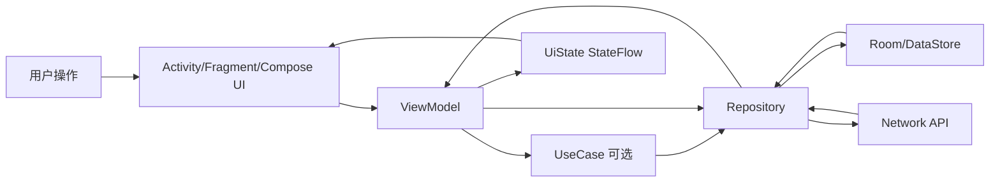
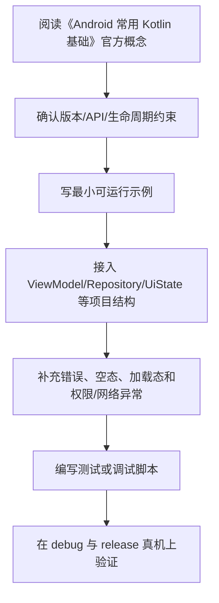

# 03. Android 常用 Kotlin 基础

<!-- lecture-notes:integrated-v2 -->

## 讲义导读：把 Android 放进应用工程主线

这一章讲的是 **03. Android 常用 Kotlin 基础**。Android 学习最怕碎片化：今天学一个控件，明天抄一段协程，后天改一个 Gradle 配置，但不知道它们怎样组成一款稳定应用。更好的读法是把每章都放进同一条主线：生命周期、状态、数据流、线程、权限、性能、测试和发布。

### 一句话先懂

Android 上的 Kotlin 不只是语法糖，它直接影响空安全、状态建模、异步代码、DSL 和 UI 声明方式。

### 通俗类比

Kotlin 像一套更安全的工具：空安全是防呆插头，data class 是标准零件，sealed class 是有限状态表，协程是可暂停的工作流。

类比只是帮助建立直觉，不能替代准确概念。真正写代码时，要回到 Android 的平台规则：哪个组件拥有状态，代码在哪个生命周期内运行，是否在主线程，数据是否能恢复，权限是否足够，release 包是否还正常。

### 本章学习主线

1. **先看平台约束**：这个知识点受哪些 Android 版本、生命周期、权限、线程或构建规则影响？
2. **再看职责边界**：它应该放在 UI、ViewModel、UseCase、Repository、DataSource、Gradle 还是 Manifest？
3. **然后看状态流动**：用户事件如何进入系统，状态如何变化，UI 如何订阅，错误如何展示？
4. **接着看异常场景**：旋转屏幕、切后台、进程被杀、网络失败、权限拒绝、release 混淆后会怎样？
5. **最后看验证方式**：用单元测试、仪器测试、Compose UI Test、Logcat、Profiler、release 构建或真机验证证明它可靠。

### 概念怎么学才不容易忘

遇到一个 Android API，不要只记“怎么调用”。建议按“使用场景 -> 生命周期 -> 线程要求 -> 状态归属 -> 错误表现 -> 测试方法”六步理解。比如学 Flow，要问谁发射、谁收集、什么时候取消；学 Compose，要问状态在哪里、什么时候重组、副作用会不会重复；学权限，要问用户拒绝、永久拒绝和系统撤销后怎么办。

### 最小实践任务

用 data class、sealed interface、Result 和协程写一个登录状态模型，覆盖加载、成功、失败和输入校验。

实践时要保留失败记录。Android 的很多能力只有在异常场景下才真正显形，例如旋转屏幕后状态丢失、后台恢复后重复请求、release 包混淆后崩溃、权限拒绝后流程卡死。把这些失败样本记录下来，比只保存成功代码更有价值。

### 读完本章应该能产出

能用 Kotlin 表达 UI State、事件和错误；能避免滥用 null、Any、全局变量和回调地狱；能理解协程基础写法。

> 本节是全篇讲义化改写的阅读入口，后续正文中的定义、步骤、示例和参考资料都应围绕这条学习主线来理解。

## Kotlin 在 Android 中的定位

Kotlin 是现代 Android 开发的首选语言。它相比 Java 更简洁，并提供：

- 空安全。
- 数据类。
- 扩展函数。
- 高阶函数。
- 协程。
- Flow。
- sealed class / sealed interface。
- 更友好的集合 API。

## 变量

```kotlin
val name: String = "Android"
var count: Int = 0
```

- `val`：只读引用，优先使用。
- `var`：可变引用，必要时使用。

类型可推导：

```kotlin
val age = 18
```

## 空安全

不可空：

```kotlin
var name: String = "Alice"
```

可空：

```kotlin
var nickname: String? = null
```

安全调用：

```kotlin
val length = nickname?.length
```

Elvis 运算符：

```kotlin
val displayName = nickname ?: "Unknown"
```

非空断言：

```kotlin
val length = nickname!!.length
```

`!!` 可能导致崩溃，应尽量避免。

## data class

```kotlin
data class User(
    val id: String,
    val name: String,
    val age: Int
)
```

自动生成：

- `equals`
- `hashCode`
- `toString`
- `copy`
- 解构函数

更新状态常用 `copy`：

```kotlin
val newUser = user.copy(name = "Bob")
```

## sealed class / sealed interface

适合表达有限状态：

```kotlin
sealed interface UiState {
    data object Loading : UiState
    data class Success(val users: List<User>) : UiState
    data class Error(val message: String) : UiState
}
```

配合 `when`：

```kotlin
when (state) {
    UiState.Loading -> showLoading()
    is UiState.Success -> showUsers(state.users)
    is UiState.Error -> showError(state.message)
}
```

## 扩展函数

```kotlin
fun String.isEmail(): Boolean {
    return contains("@")
}
```

Android 中常用于：

- DTO 到 Domain 映射。
- View 工具函数。
- 格式转换。

注意不要滥用扩展函数隐藏复杂业务逻辑。

## 高阶函数

函数作为参数：

```kotlin
fun retry(times: Int, block: () -> Unit) {
    repeat(times) {
        block()
    }
}
```

Compose 中事件回调大量使用函数参数：

```kotlin
@Composable
fun SaveButton(onClick: () -> Unit) {
    Button(onClick = onClick) {
        Text("Save")
    }
}
```

## 集合

只读集合：

```kotlin
val names: List<String> = listOf("A", "B")
```

可变集合：

```kotlin
val names = mutableListOf<String>()
names.add("A")
```

常用操作：

```kotlin
users.map { it.name }
users.filter { it.age >= 18 }
users.firstOrNull { it.id == id }
users.groupBy { it.department }
```

## object

单例：

```kotlin
object AppConfig {
    const val BASE_URL = "https://example.com"
}
```

伴生对象：

```kotlin
class User {
    companion object {
        const val DEFAULT_NAME = "Unknown"
    }
}
```

## scope functions

常见作用域函数：

- `let`
- `run`
- `with`
- `apply`
- `also`

示例：

```kotlin
val user = User(name = "Alice").also {
    println("created $it")
}
```

建议：不要为了链式调用牺牲可读性。

## Result

```kotlin
fun loadUser(): Result<User> {
    return runCatching {
        api.fetchUser()
    }
}
```

Android 项目也常定义自己的错误类型，而不是只用 Kotlin 标准 `Result`。

## 本章检查清单

- 是否理解 `val` 和 `var`？
- 是否能正确处理可空类型？
- 是否会用 data class 表达状态？
- 是否知道 sealed 类型适合 UI 状态？
- 是否能使用 map、filter、firstOrNull 等集合操作？

## Android 中最常用的 Kotlin 思维

Kotlin 在 Android 中的核心价值不是语法更短，而是更适合表达状态、结果和异步流程。

### 用不可变数据表达 UI 状态

```kotlin
data class ArticleListUiState(
    val isLoading: Boolean = false,
    val articles: List<ArticleUiModel> = emptyList(),
    val errorMessage: String? = null
)
```

更新状态时使用 `copy`：

```kotlin
_state.update {
    it.copy(isLoading = true, errorMessage = null)
}
```

这样比在多个可变字段之间同步更容易测试，也更适合 Compose 重组。

### 用 sealed 表达有限结果

```kotlin
sealed interface LoadState<out T> {
    data object Loading : LoadState<Nothing>
    data class Success<T>(val data: T) : LoadState<T>
    data class Error(val cause: AppError) : LoadState<Nothing>
}
```

适合用于：

- 页面加载状态。
- 网络请求结果。
- 表单提交结果。
- 权限授权状态。

如果结果类型只有成功和失败，也可以定义业务自己的 `AppResult`，不要把异常、HTTP 状态码、数据库错误直接暴露给 UI。

## 空安全实践

不要滥用 `!!`。它通常表示“我没有建模清楚这个值是否可能为空”。

更好的写法：

```kotlin
val userName = user?.name.orEmpty()
```

或显式提前返回：

```kotlin
val id = savedStateHandle["id"] ?: return
```

当空值本身有业务含义时，要把语义写出来：

```kotlin
data class ProfileUiState(
    val avatarUrl: String?,
    val hasCustomAvatar: Boolean
)
```

## 扩展函数的边界

扩展函数适合做局部、无状态、可读性强的转换：

```kotlin
fun ArticleDto.toDomain(): Article {
    return Article(
        id = id,
        title = title,
        content = content.orEmpty()
    )
}
```

不适合把复杂业务藏进扩展函数，尤其是需要依赖网络、数据库、Context 或时钟的逻辑。那类逻辑应该进入 Repository、UseCase 或明确的服务类。

## 协程前置概念

学习协程前先记住三点：

- `suspend` 表示函数可以挂起，不表示它一定在后台线程执行。
- 切线程通常由调用链中的合适层负责，例如数据层使用 `withContext(Dispatchers.IO)`。
- 取消是协作式的，长循环、阻塞 IO 和第三方回调都要额外处理取消。

错误示例：

```kotlin
viewModelScope.launch {
    val user = api.getUser() // 如果 API 内部没有切 IO，可能阻塞主线程
    _state.value = UserUiState(user)
}
```

更好的边界是 Repository 保证耗时操作不阻塞主线程，ViewModel 只负责编排状态。

## 代码风格建议

- 优先 `val`，只有确实需要重新赋值时使用 `var`。
- 集合转换链超过三步时考虑拆中间变量。
- `let`、`also`、`apply`、`run` 不要混用到难以阅读。
- DTO、Entity、Domain Model、UiModel 不要复用同一个 data class。
- 不要把 `Context` 传进纯 Kotlin 业务类，除非它确实是 Android 边界对象。

---

## 万字精讲扩展（2026-06-16 更新）
> Last researched: 2026-06-16。本文补充内容以现代 Android 官方推荐实践为主；涉及 Android Studio、AGP、Kotlin、Compose、Jetpack、Play 政策和权限模型的内容，应在实际项目中继续核对最新官方文档。

### 本章在 Android 学习路线中的位置

《Android 常用 Kotlin 基础》是 Android 能力闭环中的一个环节。Android 开发不是只会写页面，也不是只会接接口，而是要同时处理生命周期、状态、数据、线程、权限、性能、测试和发布。学习本章时，建议把每个 API 都放到一个真实屏幕或真实功能里验证：用户怎样进入页面，状态从哪里来，数据怎样刷新，异常怎样展示，旋转和后台后是否恢复，release 包是否仍然正常。

本章学习完成后，至少应达到三个标准。第一，能说清相关组件的职责边界和生命周期边界。第二，能写出一个最小可运行例子，并知道它在完整项目中应该放在哪一层。第三，能设计一个失败场景验证自己的写法是否稳健。Android 的很多能力不是“写出来”，而是“在复杂状态下仍然正确”。

### Kotlin 类笔记的精讲重点

Kotlin 在 Android 中不仅是语法替代 Java，更重要的是空安全、不可变数据、sealed 状态建模、扩展函数、高阶函数、协程和 Flow 改变了应用结构。空安全能减少 NPE，但只有在边界处正确处理 nullable 才有效；data class 适合表达不可变状态；sealed class/interface 适合表达有限状态集合，例如 Loading、Success、Error；扩展函数能改善可读性，但滥用会隐藏依赖关系。

学习 Kotlin 要和 Android 场景绑定。ViewModel 中的 UiState、Repository 返回的 Result、Compose 的状态提升、Room 的 Entity、网络 DTO 映射、Flow 操作符、协程作用域和异常处理，都是 Kotlin 能力在真实项目中的体现。不要只背 scope functions，要知道 `let/run/apply/also/with` 在可读性和返回值上的差异。

### Android 学习的主线：生命周期、状态、数据流和边界

Android 学习最容易碎片化：今天学 Activity，明天学 Compose，后天学协程和 Room，但不知道这些东西怎样组合成一个稳定应用。更有效的主线是围绕四个问题建立框架。第一，组件什么时候创建、可见、可交互、暂停、销毁，这对应 Activity、Fragment、ViewModel、Lifecycle 和进程死亡。第二，状态放在哪里、谁拥有状态、UI 如何订阅状态、事件如何上行，这对应 MVVM、UI State、Compose state、StateFlow 和单向数据流。第三，数据从哪里来、如何缓存、如何离线、如何同步、错误如何表达，这对应 Repository、Room、DataStore、网络层和离线优先。第四，边界在哪里，包括线程边界、生命周期边界、模块边界、安全边界、测试边界和发布边界。

官方 Android 架构指南把 UI layer、可选 domain layer 和 data layer 作为推荐理解方式。UI 层负责展示应用数据并处理用户交互；数据层通过 repository 暴露应用数据，并组合本地、网络等数据源；domain 层不是每个应用必须有，主要用于复用复杂业务逻辑。学习时不要把“Clean Architecture 图”背成固定目录，而要理解依赖方向：UI 依赖业务抽象，业务不应该反向依赖具体 UI；数据实现可以被替换，调用方不应该到处知道 Retrofit、Room 或 DataStore 的细节。

### 一个现代 Android 应用的数据与状态闭环



Figure: Android 单向数据流和分层架构，综合 Android 官方 App Architecture、Data layer、Compose state 和 lifecycle-aware coroutines 文档整理。

这个闭环说明：UI 不应该直接拼网络请求和数据库查询；ViewModel 不应该持有 Activity 引用；Repository 不应该返回与界面强绑定的 View 对象；Composable 不应该在重组过程中直接执行不可控副作用；生命周期相关收集应该使用 lifecycle-aware API；本地缓存和远程同步应由数据层统一协调。只要这个闭环清楚，很多 API 的选择就会自然起来。

### 学 Android 要建立版本和政策意识

Android 是一个快速演进的平台。API Level、Android Gradle Plugin、Kotlin、Compose Compiler、Jetpack 库、Play 政策、权限模型、后台限制和隐私要求都会变化。因此笔记里不应只写“某 API 怎么用”，还要写“适用版本、替代方案、官方推荐状态、迁移风险”。例如运行时权限、通知权限、前台服务、后台定位、存储访问、exported 组件、明文网络、签名和 targetSdk 都和平台版本或政策强相关。做项目时必须查最新官方文档，而不是只依赖旧博客。

### 最小实战闭环

建议每个阶段都围绕一个小应用反复迭代，例如待办清单、记账、阅读列表、天气、RSS、课程表或离线笔记。第一版只做单 Activity + Compose UI；第二版加入 ViewModel 和 UiState；第三版加入 Room 或 DataStore；第四版加入网络层和 Repository；第五版加入 WorkManager 同步；第六版加入测试、性能分析、R8、签名和发布检查。这样每个知识点都会在同一个项目里发生关系，而不是停留在零散 demo。

### 核心知识点逐条精讲

#### 1. 空安全

在《Android 常用 Kotlin 基础》里，`空安全` 需要从“平台约束、代码写法、生命周期、测试和线上风险”五个角度理解。Android 不是普通 JVM 程序，它运行在移动设备、受系统生命周期和权限模型约束，随时可能经历旋转、后台、进程回收、权限撤销、网络变化和系统版本差异。学习任何 API 时都要问：它在哪个生命周期内有效，是否需要主线程，是否会泄漏 Context，是否能被测试，失败后用户看到什么。

实践中建议把 `空安全` 写成可执行规则。例如“在 ViewModel 暴露不可变 UiState，UI 只收集状态并上报事件”，“Repository 负责组合本地和远程数据源，UI 不直接调用 DAO 或 Retrofit”，“Fragment 只在 viewLifecycleOwner 范围内访问 View”，“Compose 副作用必须放进受控 Effect API”，“release 包必须开启并验证 R8 相关路径”。这些规则比单纯记住 API 名称更能防止真实项目出错。

判断 `空安全` 是否掌握，可以用三个问题：能否写出最小代码；能否说清错误使用会导致什么现象；能否设计测试或调试方法证明它工作正常。比如只会写权限申请代码还不够，还要知道用户拒绝、永久拒绝、系统自动撤销权限、targetSdk 变化时怎样处理。Android 工程能力来自这些边界判断，而不是来自 API 列表背诵。

#### 2. data class

在《Android 常用 Kotlin 基础》里，`data class` 需要从“平台约束、代码写法、生命周期、测试和线上风险”五个角度理解。Android 不是普通 JVM 程序，它运行在移动设备、受系统生命周期和权限模型约束，随时可能经历旋转、后台、进程回收、权限撤销、网络变化和系统版本差异。学习任何 API 时都要问：它在哪个生命周期内有效，是否需要主线程，是否会泄漏 Context，是否能被测试，失败后用户看到什么。

实践中建议把 `data class` 写成可执行规则。例如“在 ViewModel 暴露不可变 UiState，UI 只收集状态并上报事件”，“Repository 负责组合本地和远程数据源，UI 不直接调用 DAO 或 Retrofit”，“Fragment 只在 viewLifecycleOwner 范围内访问 View”，“Compose 副作用必须放进受控 Effect API”，“release 包必须开启并验证 R8 相关路径”。这些规则比单纯记住 API 名称更能防止真实项目出错。

判断 `data class` 是否掌握，可以用三个问题：能否写出最小代码；能否说清错误使用会导致什么现象；能否设计测试或调试方法证明它工作正常。比如只会写权限申请代码还不够，还要知道用户拒绝、永久拒绝、系统自动撤销权限、targetSdk 变化时怎样处理。Android 工程能力来自这些边界判断，而不是来自 API 列表背诵。

#### 3. sealed class/interface

在《Android 常用 Kotlin 基础》里，`sealed class/interface` 需要从“平台约束、代码写法、生命周期、测试和线上风险”五个角度理解。Android 不是普通 JVM 程序，它运行在移动设备、受系统生命周期和权限模型约束，随时可能经历旋转、后台、进程回收、权限撤销、网络变化和系统版本差异。学习任何 API 时都要问：它在哪个生命周期内有效，是否需要主线程，是否会泄漏 Context，是否能被测试，失败后用户看到什么。

实践中建议把 `sealed class/interface` 写成可执行规则。例如“在 ViewModel 暴露不可变 UiState，UI 只收集状态并上报事件”，“Repository 负责组合本地和远程数据源，UI 不直接调用 DAO 或 Retrofit”，“Fragment 只在 viewLifecycleOwner 范围内访问 View”，“Compose 副作用必须放进受控 Effect API”，“release 包必须开启并验证 R8 相关路径”。这些规则比单纯记住 API 名称更能防止真实项目出错。

判断 `sealed class/interface` 是否掌握，可以用三个问题：能否写出最小代码；能否说清错误使用会导致什么现象；能否设计测试或调试方法证明它工作正常。比如只会写权限申请代码还不够，还要知道用户拒绝、永久拒绝、系统自动撤销权限、targetSdk 变化时怎样处理。Android 工程能力来自这些边界判断，而不是来自 API 列表背诵。

#### 4. 扩展函数和高阶函数

在《Android 常用 Kotlin 基础》里，`扩展函数和高阶函数` 需要从“平台约束、代码写法、生命周期、测试和线上风险”五个角度理解。Android 不是普通 JVM 程序，它运行在移动设备、受系统生命周期和权限模型约束，随时可能经历旋转、后台、进程回收、权限撤销、网络变化和系统版本差异。学习任何 API 时都要问：它在哪个生命周期内有效，是否需要主线程，是否会泄漏 Context，是否能被测试，失败后用户看到什么。

实践中建议把 `扩展函数和高阶函数` 写成可执行规则。例如“在 ViewModel 暴露不可变 UiState，UI 只收集状态并上报事件”，“Repository 负责组合本地和远程数据源，UI 不直接调用 DAO 或 Retrofit”，“Fragment 只在 viewLifecycleOwner 范围内访问 View”，“Compose 副作用必须放进受控 Effect API”，“release 包必须开启并验证 R8 相关路径”。这些规则比单纯记住 API 名称更能防止真实项目出错。

判断 `扩展函数和高阶函数` 是否掌握，可以用三个问题：能否写出最小代码；能否说清错误使用会导致什么现象；能否设计测试或调试方法证明它工作正常。比如只会写权限申请代码还不够，还要知道用户拒绝、永久拒绝、系统自动撤销权限、targetSdk 变化时怎样处理。Android 工程能力来自这些边界判断，而不是来自 API 列表背诵。

#### 5. Result、集合和 scope functions

在《Android 常用 Kotlin 基础》里，`Result、集合和 scope functions` 需要从“平台约束、代码写法、生命周期、测试和线上风险”五个角度理解。Android 不是普通 JVM 程序，它运行在移动设备、受系统生命周期和权限模型约束，随时可能经历旋转、后台、进程回收、权限撤销、网络变化和系统版本差异。学习任何 API 时都要问：它在哪个生命周期内有效，是否需要主线程，是否会泄漏 Context，是否能被测试，失败后用户看到什么。

实践中建议把 `Result、集合和 scope functions` 写成可执行规则。例如“在 ViewModel 暴露不可变 UiState，UI 只收集状态并上报事件”，“Repository 负责组合本地和远程数据源，UI 不直接调用 DAO 或 Retrofit”，“Fragment 只在 viewLifecycleOwner 范围内访问 View”，“Compose 副作用必须放进受控 Effect API”，“release 包必须开启并验证 R8 相关路径”。这些规则比单纯记住 API 名称更能防止真实项目出错。

判断 `Result、集合和 scope functions` 是否掌握，可以用三个问题：能否写出最小代码；能否说清错误使用会导致什么现象；能否设计测试或调试方法证明它工作正常。比如只会写权限申请代码还不够，还要知道用户拒绝、永久拒绝、系统自动撤销权限、targetSdk 变化时怎样处理。Android 工程能力来自这些边界判断，而不是来自 API 列表背诵。


### 场景化学习与排错表

| 主题 | 推荐动作 | 常见风险 | 验证方式 |
| :--- | :--- | :--- | :--- |
| 空安全 | 先查官方文档和版本要求，再写最小 demo，最后放入项目闭环验证 | 生命周期错位、Context 泄漏、线程错误、版本差异、只测 debug | 单元测试、仪器测试、Logcat、Profiler、release 构建和真机验证 |
| data class | 先查官方文档和版本要求，再写最小 demo，最后放入项目闭环验证 | 生命周期错位、Context 泄漏、线程错误、版本差异、只测 debug | 单元测试、仪器测试、Logcat、Profiler、release 构建和真机验证 |
| sealed class/interface | 先查官方文档和版本要求，再写最小 demo，最后放入项目闭环验证 | 生命周期错位、Context 泄漏、线程错误、版本差异、只测 debug | 单元测试、仪器测试、Logcat、Profiler、release 构建和真机验证 |
| 扩展函数和高阶函数 | 先查官方文档和版本要求，再写最小 demo，最后放入项目闭环验证 | 生命周期错位、Context 泄漏、线程错误、版本差异、只测 debug | 单元测试、仪器测试、Logcat、Profiler、release 构建和真机验证 |
| Result、集合和 scope functions | 先查官方文档和版本要求，再写最小 demo，最后放入项目闭环验证 | 生命周期错位、Context 泄漏、线程错误、版本差异、只测 debug | 单元测试、仪器测试、Logcat、Profiler、release 构建和真机验证 |

表格中的推荐动作强调“官方依据 + 最小验证 + 项目闭环”。Android 生态变化快，旧博客里的写法可能已经被官方替代，或者只适用于某个 API Level、某个 Jetpack 版本。遇到冲突时，优先查 Android Developers、Kotlin、Gradle 和库的 release notes，再参考社区经验。

### 本章建议工作流



Figure: 《Android 常用 Kotlin 基础》学习工作流，综合 Android 官方架构、Compose、Lifecycle、Coroutines、Data layer、Performance 和 Release 文档整理。

这个工作流避免两个极端：只看文档不落地，或者只复制 demo 不理解边界。Android 很多 bug 只在生命周期切换、后台恢复、低内存、release 混淆、慢网络、权限拒绝或特定系统版本中出现，所以最小 demo 跑通以后，还要放回完整应用场景验证。

### 常见误区和纠正方法

- 误区：Activity/Fragment 里堆所有逻辑。纠正：UI 组件负责展示和事件，状态放 ViewModel，数据访问放 Repository，复杂复用逻辑再考虑 UseCase。
- 误区：只测 debug，不测 release。纠正：R8、资源压缩、签名、网络安全配置和 build variants 可能让 release 行为不同，发布前必须验证 release 包。
- 误区：忽略生命周期。纠正：Flow 收集、回调注册、binding、协程、导航和副作用都要绑定正确 lifecycle。
- 误区：把 Compose 当成简单 XML 替代。纠正：Compose 的核心是状态驱动 UI、可组合函数、重组、副作用控制和稳定性。
- 误区：权限申请只看成功路径。纠正：必须处理拒绝、永久拒绝、功能降级、隐私说明、targetSdk 变化和系统自动撤销。
- 误区：看到性能问题就先优化代码。纠正：先用 Profiler、Baseline Profile、启动指标、帧时间、内存快照和日志定位瓶颈。

### 与相邻章节的关系

《Android 常用 Kotlin 基础》应和其他章节联动阅读。项目结构决定依赖和构建变体，Kotlin 决定状态和异步表达方式，生命周期决定 UI 和协程边界，Compose 决定状态和副作用组织，架构决定依赖方向，数据层决定离线和同步能力，测试和发布决定应用能否可靠交付。任何一个主题脱离这些关系，都容易变成 demo 级知识。

### 实操训练和复盘模板

1. 围绕 `空安全` 做一个小任务：写最小实现、制造一个失败场景、记录修复方法。
2. 围绕 `data class` 做一个小任务：写最小实现、制造一个失败场景、记录修复方法。
3. 围绕 `sealed class/interface` 做一个小任务：写最小实现、制造一个失败场景、记录修复方法。
4. 围绕 `扩展函数和高阶函数` 做一个小任务：写最小实现、制造一个失败场景、记录修复方法。
5. 围绕 `Result、集合和 scope functions` 做一个小任务：写最小实现、制造一个失败场景、记录修复方法。

建议每次练习都按下面格式记录：

```text
练习名称：
本章主题：Android 常用 Kotlin 基础
目标 API / 组件：
版本信息：Android Studio、AGP、Kotlin、compileSdk、minSdk、targetSdk、相关 Jetpack 版本
最小实现：
生命周期和线程边界：
失败场景：旋转、后台、进程死亡、断网、权限拒绝、release 混淆等
调试证据：Logcat、断点、Profiler、截图、测试结果
最终规则：以后项目中如何写，什么情况下不能这样写
```

这个模板能把“会用 API”推进到“知道边界”。很多 Android 问题第一次看像偶发 bug，复盘后会发现是生命周期、状态持有、线程、权限、缓存或构建变体没有设计清楚。

## 参考资料与延伸阅读

- [Official / Android] Guide to app architecture: https://developer.android.com/topic/architecture
- [Official / Android] UI layer: https://developer.android.com/topic/architecture/ui-layer
- [Official / Android] Data layer: https://developer.android.com/topic/architecture/data-layer
- [Official / Android] Domain layer: https://developer.android.com/topic/architecture/domain-layer
- [Official / Android] Build an offline-first app: https://developer.android.com/topic/architecture/data-layer/offline-first
- [Official / Android] Configure your build: https://developer.android.com/build
- [Official / Android] Add build dependencies: https://developer.android.com/build/dependencies
- [Official / Android] Fragment lifecycle: https://developer.android.com/guide/fragments/lifecycle
- [Official / Android] Saved State module for ViewModel: https://developer.android.com/topic/libraries/architecture/viewmodel/viewmodel-savedstate
- [Official / Android] State and Jetpack Compose: https://developer.android.com/develop/ui/compose/state
- [Official / Android] Side-effects in Compose: https://developer.android.com/develop/ui/compose/side-effects
- [Official / Android] Jetpack Compose performance: https://developer.android.com/develop/ui/compose/performance
- [Official / Android] Stability in Compose: https://developer.android.com/develop/ui/compose/performance/stability
- [Official / Android] Kotlin coroutines on Android: https://developer.android.com/kotlin/coroutines
- [Official / Android] Kotlin flows on Android: https://developer.android.com/kotlin/flow
- [Official / Android] Use Kotlin coroutines with lifecycle-aware components: https://developer.android.com/topic/libraries/architecture/coroutines
- [Official / Android] Dependency injection with Hilt: https://developer.android.com/training/dependency-injection/hilt-android
- [Official / Android] Network security configuration: https://developer.android.com/privacy-and-security/security-config
- [Official / Android] Enable app optimization with R8: https://developer.android.com/topic/performance/app-optimization/enable-app-optimization
- [Official / Android] Baseline Profiles overview: https://developer.android.com/topic/performance/baselineprofiles/overview
- [Official / Google Codelab] Improve app performance with Baseline Profiles: https://codelabs.developers.google.com/android-baseline-profiles-improve
- [Official / Kotlin] Kotlin documentation: https://kotlinlang.org/docs/home.html
- [Official / Kotlin] Sealed classes and interfaces: https://kotlinlang.org/docs/sealed-classes.html
- [Official / Kotlin] Configure a Gradle project: https://kotlinlang.org/docs/gradle-configure-project.html
- [Official / Gradle] Gradle Kotlin DSL Primer: https://docs.gradle.org/current/userguide/kotlin_dsl.html
- [Security / OWASP] Android Network Security Configuration: https://mas.owasp.org/MASTG/knowledge/android/MASVS-NETWORK/MASTG-KNOW-0014/
- [Blog / Android Developers] Rebuilding our guide to app architecture: https://android-developers.googleblog.com/2021/12/rebuilding-our-guide-to-app-architecture.html
- [Blog / Android Developers] Improving Performance with Baseline Profiles: https://medium.com/androiddevelopers/improving-performance-with-baseline-profiles-fdd0db0d8cc6
- [Community / CSDN] Android 学习笔记检索入口: https://so.csdn.net/so/search?q=Android%20%E5%AD%A6%E4%B9%A0%E7%AC%94%E8%AE%B0%20Jetpack%20Compose
- [Community / 博客园] Android 架构与 Jetpack 笔记检索入口: https://zzk.cnblogs.com/s/blogpost?Keywords=Android%20Jetpack%20MVVM%20Compose
- [Community / 掘金] Android Compose / 协程 / 架构实践检索入口: https://juejin.cn/search?query=Android%20Compose%20%E5%8D%8F%E7%A8%8B%20%E6%9E%B6%E6%9E%84&type=0
