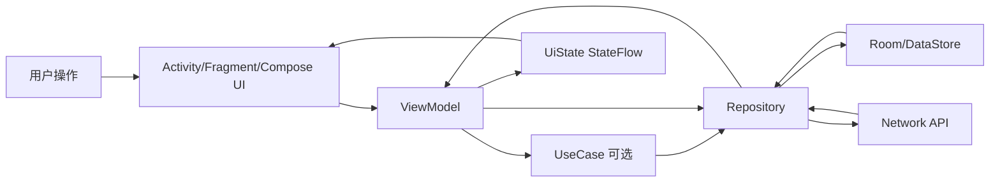
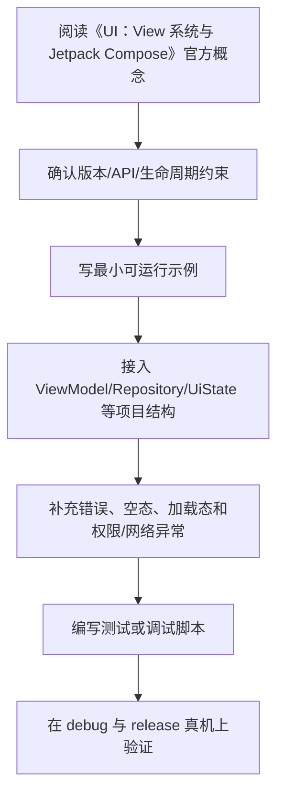

# 05. UI：View 系统与 Jetpack Compose

## Android UI 两种主要方式

传统方式：

- XML 布局。
- View / ViewGroup。
- Activity / Fragment 控制界面。

现代方式：

- Jetpack Compose。
- Kotlin 声明式 UI。
- 状态驱动界面。

新项目通常优先选择 Compose，但理解 View 系统仍然有价值，因为大量历史项目和部分组件仍然基于 View。

## View 系统基础

XML 示例：

```xml
<LinearLayout
    android:layout_width="match_parent"
    android:layout_height="match_parent"
    android:orientation="vertical">

    <TextView
        android:id="@+id/title"
        android:layout_width="wrap_content"
        android:layout_height="wrap_content"
        android:text="Hello" />
</LinearLayout>
```

常见 ViewGroup：

- LinearLayout。
- FrameLayout。
- ConstraintLayout。
- RecyclerView。

## RecyclerView

RecyclerView 用于列表：

- Adapter 提供数据。
- ViewHolder 复用 item view。
- LayoutManager 控制布局。

在 Compose 中，列表通常使用 `LazyColumn` 或 `LazyRow`。

## Compose 基础

Composable 函数：

```kotlin
@Composable
fun Greeting(name: String) {
    Text(text = "Hello $name")
}
```

组合 UI：

```kotlin
@Composable
fun ProfileCard(user: User) {
    Column {
        Text(text = user.name)
        Text(text = user.email)
    }
}
```

## Modifier

Modifier 用于修饰布局、大小、点击、背景等：

```kotlin
Text(
    text = "Hello",
    modifier = Modifier
        .fillMaxWidth()
        .padding(16.dp)
)
```

Modifier 顺序会影响结果。

## Compose 布局

常见布局：

- Column：垂直排列。
- Row：水平排列。
- Box：叠放。
- LazyColumn：懒加载垂直列表。
- LazyRow：懒加载水平列表。

示例：

```kotlin
LazyColumn {
    items(users) { user ->
        Text(text = user.name)
    }
}
```

## Material 3

Material 3 提供现代 Android 组件：

- Button。
- TextField。
- Card。
- Scaffold。
- TopAppBar。
- NavigationBar。
- FloatingActionButton。

示例：

```kotlin
Scaffold(
    topBar = { TopAppBar(title = { Text("Home") }) }
) { padding ->
    Column(modifier = Modifier.padding(padding)) {
        Text("Content")
    }
}
```

## 主题

Compose 主题通常包含：

- ColorScheme。
- Typography。
- Shapes。

```kotlin
@Composable
fun AppTheme(content: @Composable () -> Unit) {
    MaterialTheme(
        colorScheme = lightColorScheme(),
        typography = Typography(),
        content = content
    )
}
```

## 预览

```kotlin
@Preview(showBackground = true)
@Composable
fun GreetingPreview() {
    AppTheme {
        Greeting("Android")
    }
}
```

Preview 能提高 UI 开发效率，但不能替代真机测试。

## View 与 Compose 混用

在 View 项目中嵌入 Compose：

```kotlin
ComposeView(context).setContent {
    AppTheme {
        Greeting("Android")
    }
}
```

在 Compose 中嵌入 View：

```kotlin
AndroidView(factory = { context ->
    TextView(context)
})
```

混用适合渐进迁移。

## UI 设计建议

- UI 由状态驱动。
- Composable 尽量保持无副作用。
- 复杂界面拆分小组件。
- 可复用组件放到 design-system。
- 列表 item 提供稳定 key。
- 不在 Composable 中直接执行耗时任务。

## 本章检查清单

- 是否理解 View 系统和 Compose 的区别？
- 是否会写基本 Composable？
- 是否知道 Modifier 顺序重要？
- 是否会使用 LazyColumn？
- 是否知道 Scaffold 和 Material 3 的作用？

## View 系统与 Compose 的本质区别

| 维度 | View 系统 | Compose |
| --- | --- | --- |
| UI 描述方式 | XML 或命令式创建 View | Kotlin 函数声明 UI |
| 更新方式 | 手动 `setText()`、`notifyDataSetChanged()` | 状态变化触发重组 |
| 状态保存 | View、Fragment、ViewModel 混合 | `remember`、`rememberSaveable`、ViewModel |
| 复用单位 | View、Fragment、自定义 View | Composable 函数 |
| 迁移方式 | 已有项目常见 | 可通过 `ComposeView` 渐进接入 |

Compose 不是“用 Kotlin 写 XML”，而是“UI = f(state)”。你不应该手动寻找某个 TextView 再改文字，而是改变状态，让 UI 根据状态重新计算。

## Composable 设计原则

推荐把界面拆成两类函数：

```kotlin
@Composable
fun ArticleRoute(
    viewModel: ArticleViewModel = hiltViewModel()
) {
    val state by viewModel.state.collectAsStateWithLifecycle()
    ArticleScreen(
        state = state,
        onRefresh = viewModel::refresh,
        onOpenArticle = viewModel::openArticle
    )
}

@Composable
fun ArticleScreen(
    state: ArticleUiState,
    onRefresh: () -> Unit,
    onOpenArticle: (String) -> Unit
) {
    // 只负责展示状态和发送事件
}
```

- `Route` 负责连接 ViewModel、导航和生命周期。
- `Screen` 负责纯展示，更容易 Preview 和 UI Test。

## Modifier 顺序示例

Modifier 是有顺序的：

```kotlin
Text(
    text = "Android",
    modifier = Modifier
        .padding(16.dp)
        .background(Color.Yellow)
)
```

和：

```kotlin
Text(
    text = "Android",
    modifier = Modifier
        .background(Color.Yellow)
        .padding(16.dp)
)
```

视觉结果不同。前者先加外边距再绘制背景，后者先绘制背景再给内容留内边距。写布局问题时先检查 Modifier 顺序。

## 列表与 key

`LazyColumn` 中稳定 key 很重要：

```kotlin
LazyColumn {
    items(
        items = articles,
        key = { it.id }
    ) { article ->
        ArticleRow(article = article)
    }
}
```

没有稳定 key 时，插入、删除、排序可能导致状态错位，例如复选框、展开状态、输入框内容出现在错误 item 上。

## Preview 和设计系统

建议为设计系统组件写 Preview：

```kotlin
@Preview(showBackground = true)
@Composable
private fun ArticleRowPreview() {
    AppTheme {
        ArticleRow(
            article = ArticleUiModel(
                id = "1",
                title = "Compose 入门",
                summary = "状态驱动 UI"
            )
        )
    }
}
```

Preview 不代替测试，但能快速发现布局溢出、深色模式、长文本和空状态问题。

## UI 常见坑

- 在 Composable 里直接发网络请求，导致重组时重复请求。
- `LazyColumn` 不设置 key，列表状态错位。
- 把大对象或不稳定对象层层传递，导致重组范围过大。
- 所有页面直接使用 Material 组件，没有抽设计系统，后期统一风格困难。
- 只测正常长度文案，没有测试长标题、多语言、无数据、错误状态。

---

## 万字精讲扩展（2026-06-16 更新）
> Last researched: 2026-06-16。本文补充内容以现代 Android 官方推荐实践为主；涉及 Android Studio、AGP、Kotlin、Compose、Jetpack、Play 政策和权限模型的内容，应在实际项目中继续核对最新官方文档。

### 本章在 Android 学习路线中的位置

《UI：View 系统与 Jetpack Compose》是 Android 能力闭环中的一个环节。Android 开发不是只会写页面，也不是只会接接口，而是要同时处理生命周期、状态、数据、线程、权限、性能、测试和发布。学习本章时，建议把每个 API 都放到一个真实屏幕或真实功能里验证：用户怎样进入页面，状态从哪里来，数据怎样刷新，异常怎样展示，旋转和后台后是否恢复，release 包是否仍然正常。

本章学习完成后，至少应达到三个标准。第一，能说清相关组件的职责边界和生命周期边界。第二，能写出一个最小可运行例子，并知道它在完整项目中应该放在哪一层。第三，能设计一个失败场景验证自己的写法是否稳健。Android 的很多能力不是“写出来”，而是“在复杂状态下仍然正确”。

### UI 与 Compose 类笔记的精讲重点

View 系统和 Compose 的本质区别在于 UI 描述方式。View 系统更像维护一棵可变对象树，通过 findViewById、Adapter、invalidate 和 XML 属性更新界面；Compose 更像根据状态重新描述 UI，框架通过重组更新必要部分。Compose 的核心不是“少写 XML”，而是状态驱动 UI、可组合函数、Modifier 链、单向数据流和副作用受控。

学 UI 时要建立布局、状态、事件和主题四条线。布局决定元素如何测量和摆放；状态决定界面显示什么；事件决定用户操作如何向上通知；主题决定颜色、字体、形状和 Material 组件一致性。无论 View 还是 Compose，都不应该把业务逻辑塞进 UI 控件内部。

### Android 学习的主线：生命周期、状态、数据流和边界

Android 学习最容易碎片化：今天学 Activity，明天学 Compose，后天学协程和 Room，但不知道这些东西怎样组合成一个稳定应用。更有效的主线是围绕四个问题建立框架。第一，组件什么时候创建、可见、可交互、暂停、销毁，这对应 Activity、Fragment、ViewModel、Lifecycle 和进程死亡。第二，状态放在哪里、谁拥有状态、UI 如何订阅状态、事件如何上行，这对应 MVVM、UI State、Compose state、StateFlow 和单向数据流。第三，数据从哪里来、如何缓存、如何离线、如何同步、错误如何表达，这对应 Repository、Room、DataStore、网络层和离线优先。第四，边界在哪里，包括线程边界、生命周期边界、模块边界、安全边界、测试边界和发布边界。

官方 Android 架构指南把 UI layer、可选 domain layer 和 data layer 作为推荐理解方式。UI 层负责展示应用数据并处理用户交互；数据层通过 repository 暴露应用数据，并组合本地、网络等数据源；domain 层不是每个应用必须有，主要用于复用复杂业务逻辑。学习时不要把“Clean Architecture 图”背成固定目录，而要理解依赖方向：UI 依赖业务抽象，业务不应该反向依赖具体 UI；数据实现可以被替换，调用方不应该到处知道 Retrofit、Room 或 DataStore 的细节。

### 一个现代 Android 应用的数据与状态闭环



Figure: Android 单向数据流和分层架构，综合 Android 官方 App Architecture、Data layer、Compose state 和 lifecycle-aware coroutines 文档整理。

这个闭环说明：UI 不应该直接拼网络请求和数据库查询；ViewModel 不应该持有 Activity 引用；Repository 不应该返回与界面强绑定的 View 对象；Composable 不应该在重组过程中直接执行不可控副作用；生命周期相关收集应该使用 lifecycle-aware API；本地缓存和远程同步应由数据层统一协调。只要这个闭环清楚，很多 API 的选择就会自然起来。

### 学 Android 要建立版本和政策意识

Android 是一个快速演进的平台。API Level、Android Gradle Plugin、Kotlin、Compose Compiler、Jetpack 库、Play 政策、权限模型、后台限制和隐私要求都会变化。因此笔记里不应只写“某 API 怎么用”，还要写“适用版本、替代方案、官方推荐状态、迁移风险”。例如运行时权限、通知权限、前台服务、后台定位、存储访问、exported 组件、明文网络、签名和 targetSdk 都和平台版本或政策强相关。做项目时必须查最新官方文档，而不是只依赖旧博客。

### 最小实战闭环

建议每个阶段都围绕一个小应用反复迭代，例如待办清单、记账、阅读列表、天气、RSS、课程表或离线笔记。第一版只做单 Activity + Compose UI；第二版加入 ViewModel 和 UiState；第三版加入 Room 或 DataStore；第四版加入网络层和 Repository；第五版加入 WorkManager 同步；第六版加入测试、性能分析、R8、签名和发布检查。这样每个知识点都会在同一个项目里发生关系，而不是停留在零散 demo。

### 核心知识点逐条精讲

#### 1. View 系统

在《UI：View 系统与 Jetpack Compose》里，`View 系统` 需要从“平台约束、代码写法、生命周期、测试和线上风险”五个角度理解。Android 不是普通 JVM 程序，它运行在移动设备、受系统生命周期和权限模型约束，随时可能经历旋转、后台、进程回收、权限撤销、网络变化和系统版本差异。学习任何 API 时都要问：它在哪个生命周期内有效，是否需要主线程，是否会泄漏 Context，是否能被测试，失败后用户看到什么。

实践中建议把 `View 系统` 写成可执行规则。例如“在 ViewModel 暴露不可变 UiState，UI 只收集状态并上报事件”，“Repository 负责组合本地和远程数据源，UI 不直接调用 DAO 或 Retrofit”，“Fragment 只在 viewLifecycleOwner 范围内访问 View”，“Compose 副作用必须放进受控 Effect API”，“release 包必须开启并验证 R8 相关路径”。这些规则比单纯记住 API 名称更能防止真实项目出错。

判断 `View 系统` 是否掌握，可以用三个问题：能否写出最小代码；能否说清错误使用会导致什么现象；能否设计测试或调试方法证明它工作正常。比如只会写权限申请代码还不够，还要知道用户拒绝、永久拒绝、系统自动撤销权限、targetSdk 变化时怎样处理。Android 工程能力来自这些边界判断，而不是来自 API 列表背诵。

#### 2. RecyclerView

在《UI：View 系统与 Jetpack Compose》里，`RecyclerView` 需要从“平台约束、代码写法、生命周期、测试和线上风险”五个角度理解。Android 不是普通 JVM 程序，它运行在移动设备、受系统生命周期和权限模型约束，随时可能经历旋转、后台、进程回收、权限撤销、网络变化和系统版本差异。学习任何 API 时都要问：它在哪个生命周期内有效，是否需要主线程，是否会泄漏 Context，是否能被测试，失败后用户看到什么。

实践中建议把 `RecyclerView` 写成可执行规则。例如“在 ViewModel 暴露不可变 UiState，UI 只收集状态并上报事件”，“Repository 负责组合本地和远程数据源，UI 不直接调用 DAO 或 Retrofit”，“Fragment 只在 viewLifecycleOwner 范围内访问 View”，“Compose 副作用必须放进受控 Effect API”，“release 包必须开启并验证 R8 相关路径”。这些规则比单纯记住 API 名称更能防止真实项目出错。

判断 `RecyclerView` 是否掌握，可以用三个问题：能否写出最小代码；能否说清错误使用会导致什么现象；能否设计测试或调试方法证明它工作正常。比如只会写权限申请代码还不够，还要知道用户拒绝、永久拒绝、系统自动撤销权限、targetSdk 变化时怎样处理。Android 工程能力来自这些边界判断，而不是来自 API 列表背诵。

#### 3. Compose 基础

在《UI：View 系统与 Jetpack Compose》里，`Compose 基础` 需要从“平台约束、代码写法、生命周期、测试和线上风险”五个角度理解。Android 不是普通 JVM 程序，它运行在移动设备、受系统生命周期和权限模型约束，随时可能经历旋转、后台、进程回收、权限撤销、网络变化和系统版本差异。学习任何 API 时都要问：它在哪个生命周期内有效，是否需要主线程，是否会泄漏 Context，是否能被测试，失败后用户看到什么。

实践中建议把 `Compose 基础` 写成可执行规则。例如“在 ViewModel 暴露不可变 UiState，UI 只收集状态并上报事件”，“Repository 负责组合本地和远程数据源，UI 不直接调用 DAO 或 Retrofit”，“Fragment 只在 viewLifecycleOwner 范围内访问 View”，“Compose 副作用必须放进受控 Effect API”，“release 包必须开启并验证 R8 相关路径”。这些规则比单纯记住 API 名称更能防止真实项目出错。

判断 `Compose 基础` 是否掌握，可以用三个问题：能否写出最小代码；能否说清错误使用会导致什么现象；能否设计测试或调试方法证明它工作正常。比如只会写权限申请代码还不够，还要知道用户拒绝、永久拒绝、系统自动撤销权限、targetSdk 变化时怎样处理。Android 工程能力来自这些边界判断，而不是来自 API 列表背诵。

#### 4. Modifier 和布局

在《UI：View 系统与 Jetpack Compose》里，`Modifier 和布局` 需要从“平台约束、代码写法、生命周期、测试和线上风险”五个角度理解。Android 不是普通 JVM 程序，它运行在移动设备、受系统生命周期和权限模型约束，随时可能经历旋转、后台、进程回收、权限撤销、网络变化和系统版本差异。学习任何 API 时都要问：它在哪个生命周期内有效，是否需要主线程，是否会泄漏 Context，是否能被测试，失败后用户看到什么。

实践中建议把 `Modifier 和布局` 写成可执行规则。例如“在 ViewModel 暴露不可变 UiState，UI 只收集状态并上报事件”，“Repository 负责组合本地和远程数据源，UI 不直接调用 DAO 或 Retrofit”，“Fragment 只在 viewLifecycleOwner 范围内访问 View”，“Compose 副作用必须放进受控 Effect API”，“release 包必须开启并验证 R8 相关路径”。这些规则比单纯记住 API 名称更能防止真实项目出错。

判断 `Modifier 和布局` 是否掌握，可以用三个问题：能否写出最小代码；能否说清错误使用会导致什么现象；能否设计测试或调试方法证明它工作正常。比如只会写权限申请代码还不够，还要知道用户拒绝、永久拒绝、系统自动撤销权限、targetSdk 变化时怎样处理。Android 工程能力来自这些边界判断，而不是来自 API 列表背诵。

#### 5. Material 3 与主题

在《UI：View 系统与 Jetpack Compose》里，`Material 3 与主题` 需要从“平台约束、代码写法、生命周期、测试和线上风险”五个角度理解。Android 不是普通 JVM 程序，它运行在移动设备、受系统生命周期和权限模型约束，随时可能经历旋转、后台、进程回收、权限撤销、网络变化和系统版本差异。学习任何 API 时都要问：它在哪个生命周期内有效，是否需要主线程，是否会泄漏 Context，是否能被测试，失败后用户看到什么。

实践中建议把 `Material 3 与主题` 写成可执行规则。例如“在 ViewModel 暴露不可变 UiState，UI 只收集状态并上报事件”，“Repository 负责组合本地和远程数据源，UI 不直接调用 DAO 或 Retrofit”，“Fragment 只在 viewLifecycleOwner 范围内访问 View”，“Compose 副作用必须放进受控 Effect API”，“release 包必须开启并验证 R8 相关路径”。这些规则比单纯记住 API 名称更能防止真实项目出错。

判断 `Material 3 与主题` 是否掌握，可以用三个问题：能否写出最小代码；能否说清错误使用会导致什么现象；能否设计测试或调试方法证明它工作正常。比如只会写权限申请代码还不够，还要知道用户拒绝、永久拒绝、系统自动撤销权限、targetSdk 变化时怎样处理。Android 工程能力来自这些边界判断，而不是来自 API 列表背诵。


### 场景化学习与排错表

| 主题 | 推荐动作 | 常见风险 | 验证方式 |
| :--- | :--- | :--- | :--- |
| View 系统 | 先查官方文档和版本要求，再写最小 demo，最后放入项目闭环验证 | 生命周期错位、Context 泄漏、线程错误、版本差异、只测 debug | 单元测试、仪器测试、Logcat、Profiler、release 构建和真机验证 |
| RecyclerView | 先查官方文档和版本要求，再写最小 demo，最后放入项目闭环验证 | 生命周期错位、Context 泄漏、线程错误、版本差异、只测 debug | 单元测试、仪器测试、Logcat、Profiler、release 构建和真机验证 |
| Compose 基础 | 先查官方文档和版本要求，再写最小 demo，最后放入项目闭环验证 | 生命周期错位、Context 泄漏、线程错误、版本差异、只测 debug | 单元测试、仪器测试、Logcat、Profiler、release 构建和真机验证 |
| Modifier 和布局 | 先查官方文档和版本要求，再写最小 demo，最后放入项目闭环验证 | 生命周期错位、Context 泄漏、线程错误、版本差异、只测 debug | 单元测试、仪器测试、Logcat、Profiler、release 构建和真机验证 |
| Material 3 与主题 | 先查官方文档和版本要求，再写最小 demo，最后放入项目闭环验证 | 生命周期错位、Context 泄漏、线程错误、版本差异、只测 debug | 单元测试、仪器测试、Logcat、Profiler、release 构建和真机验证 |

表格中的推荐动作强调“官方依据 + 最小验证 + 项目闭环”。Android 生态变化快，旧博客里的写法可能已经被官方替代，或者只适用于某个 API Level、某个 Jetpack 版本。遇到冲突时，优先查 Android Developers、Kotlin、Gradle 和库的 release notes，再参考社区经验。

### 本章建议工作流



Figure: 《UI：View 系统与 Jetpack Compose》学习工作流，综合 Android 官方架构、Compose、Lifecycle、Coroutines、Data layer、Performance 和 Release 文档整理。

这个工作流避免两个极端：只看文档不落地，或者只复制 demo 不理解边界。Android 很多 bug 只在生命周期切换、后台恢复、低内存、release 混淆、慢网络、权限拒绝或特定系统版本中出现，所以最小 demo 跑通以后，还要放回完整应用场景验证。

### 常见误区和纠正方法

- 误区：Activity/Fragment 里堆所有逻辑。纠正：UI 组件负责展示和事件，状态放 ViewModel，数据访问放 Repository，复杂复用逻辑再考虑 UseCase。
- 误区：只测 debug，不测 release。纠正：R8、资源压缩、签名、网络安全配置和 build variants 可能让 release 行为不同，发布前必须验证 release 包。
- 误区：忽略生命周期。纠正：Flow 收集、回调注册、binding、协程、导航和副作用都要绑定正确 lifecycle。
- 误区：把 Compose 当成简单 XML 替代。纠正：Compose 的核心是状态驱动 UI、可组合函数、重组、副作用控制和稳定性。
- 误区：权限申请只看成功路径。纠正：必须处理拒绝、永久拒绝、功能降级、隐私说明、targetSdk 变化和系统自动撤销。
- 误区：看到性能问题就先优化代码。纠正：先用 Profiler、Baseline Profile、启动指标、帧时间、内存快照和日志定位瓶颈。

### 与相邻章节的关系

《UI：View 系统与 Jetpack Compose》应和其他章节联动阅读。项目结构决定依赖和构建变体，Kotlin 决定状态和异步表达方式，生命周期决定 UI 和协程边界，Compose 决定状态和副作用组织，架构决定依赖方向，数据层决定离线和同步能力，测试和发布决定应用能否可靠交付。任何一个主题脱离这些关系，都容易变成 demo 级知识。

### 实操训练和复盘模板

1. 围绕 `View 系统` 做一个小任务：写最小实现、制造一个失败场景、记录修复方法。
2. 围绕 `RecyclerView` 做一个小任务：写最小实现、制造一个失败场景、记录修复方法。
3. 围绕 `Compose 基础` 做一个小任务：写最小实现、制造一个失败场景、记录修复方法。
4. 围绕 `Modifier 和布局` 做一个小任务：写最小实现、制造一个失败场景、记录修复方法。
5. 围绕 `Material 3 与主题` 做一个小任务：写最小实现、制造一个失败场景、记录修复方法。

建议每次练习都按下面格式记录：

```text
练习名称：
本章主题：UI：View 系统与 Jetpack Compose
目标 API / 组件：
版本信息：Android Studio、AGP、Kotlin、compileSdk、minSdk、targetSdk、相关 Jetpack 版本
最小实现：
生命周期和线程边界：
失败场景：旋转、后台、进程死亡、断网、权限拒绝、release 混淆等
调试证据：Logcat、断点、Profiler、截图、测试结果
最终规则：以后项目中如何写，什么情况下不能这样写
```

这个模板能把“会用 API”推进到“知道边界”。很多 Android 问题第一次看像偶发 bug，复盘后会发现是生命周期、状态持有、线程、权限、缓存或构建变体没有设计清楚。

## 参考资料与延伸阅读

- [Official / Android] Guide to app architecture: https://developer.android.com/topic/architecture
- [Official / Android] UI layer: https://developer.android.com/topic/architecture/ui-layer
- [Official / Android] Data layer: https://developer.android.com/topic/architecture/data-layer
- [Official / Android] Domain layer: https://developer.android.com/topic/architecture/domain-layer
- [Official / Android] Build an offline-first app: https://developer.android.com/topic/architecture/data-layer/offline-first
- [Official / Android] Configure your build: https://developer.android.com/build
- [Official / Android] Add build dependencies: https://developer.android.com/build/dependencies
- [Official / Android] Fragment lifecycle: https://developer.android.com/guide/fragments/lifecycle
- [Official / Android] Saved State module for ViewModel: https://developer.android.com/topic/libraries/architecture/viewmodel/viewmodel-savedstate
- [Official / Android] State and Jetpack Compose: https://developer.android.com/develop/ui/compose/state
- [Official / Android] Side-effects in Compose: https://developer.android.com/develop/ui/compose/side-effects
- [Official / Android] Jetpack Compose performance: https://developer.android.com/develop/ui/compose/performance
- [Official / Android] Stability in Compose: https://developer.android.com/develop/ui/compose/performance/stability
- [Official / Android] Kotlin coroutines on Android: https://developer.android.com/kotlin/coroutines
- [Official / Android] Kotlin flows on Android: https://developer.android.com/kotlin/flow
- [Official / Android] Use Kotlin coroutines with lifecycle-aware components: https://developer.android.com/topic/libraries/architecture/coroutines
- [Official / Android] Dependency injection with Hilt: https://developer.android.com/training/dependency-injection/hilt-android
- [Official / Android] Network security configuration: https://developer.android.com/privacy-and-security/security-config
- [Official / Android] Enable app optimization with R8: https://developer.android.com/topic/performance/app-optimization/enable-app-optimization
- [Official / Android] Baseline Profiles overview: https://developer.android.com/topic/performance/baselineprofiles/overview
- [Official / Google Codelab] Improve app performance with Baseline Profiles: https://codelabs.developers.google.com/android-baseline-profiles-improve
- [Official / Kotlin] Kotlin documentation: https://kotlinlang.org/docs/home.html
- [Official / Kotlin] Sealed classes and interfaces: https://kotlinlang.org/docs/sealed-classes.html
- [Official / Kotlin] Configure a Gradle project: https://kotlinlang.org/docs/gradle-configure-project.html
- [Official / Gradle] Gradle Kotlin DSL Primer: https://docs.gradle.org/current/userguide/kotlin_dsl.html
- [Security / OWASP] Android Network Security Configuration: https://mas.owasp.org/MASTG/knowledge/android/MASVS-NETWORK/MASTG-KNOW-0014/
- [Blog / Android Developers] Rebuilding our guide to app architecture: https://android-developers.googleblog.com/2021/12/rebuilding-our-guide-to-app-architecture.html
- [Blog / Android Developers] Improving Performance with Baseline Profiles: https://medium.com/androiddevelopers/improving-performance-with-baseline-profiles-fdd0db0d8cc6
- [Community / CSDN] Android 学习笔记检索入口: https://so.csdn.net/so/search?q=Android%20%E5%AD%A6%E4%B9%A0%E7%AC%94%E8%AE%B0%20Jetpack%20Compose
- [Community / 博客园] Android 架构与 Jetpack 笔记检索入口: https://zzk.cnblogs.com/s/blogpost?Keywords=Android%20Jetpack%20MVVM%20Compose
- [Community / 掘金] Android Compose / 协程 / 架构实践检索入口: https://juejin.cn/search?query=Android%20Compose%20%E5%8D%8F%E7%A8%8B%20%E6%9E%B6%E6%9E%84&type=0

<!-- research-notes: enhanced-v1 -->

## 研究笔记增强

> Last reviewed: 2026-06-17。此节用于把《05. UI：View 系统与 Jetpack Compose》从阅读笔记推进到可复习、可实践、可验证的研究笔记；具体版本、参数和环境仍需结合官方资料、项目约束和实测结果校准。

### 知识定位

把知识点放在 Android 生命周期、架构分层、数据流和发布质量的整体链路中理解。

### 重点补充
- 明确 Activity、Fragment、ViewModel、Repository 和数据源的职责边界。
- 处理权限、隐私、弱网、离线、配置变更和后台任务。
- 用日志、崩溃堆栈、性能指标和 UI 测试验证实现。
- 明确适用场景、限制条件、替代方案和迁移成本。

### 实践清单
- 为本章整理一张概念关系图、流程图或最小系统图。
- 写一个最小可运行示例，并保留运行命令、输入、输出和环境版本。
- 列出常见错误、排查命令、关键日志和修复动作。
- 补充安全、性能、兼容性、可维护性和上线运维注意事项。
- 用一次真实问题或练习项目复盘验证笔记是否可用。

### 常见误区
- 只摘抄定义或命令，没有记录上下文、前提条件和边界。
- 只记录成功路径，不记录失败样本、异常现象和排查过程。
- 没有版本、环境和数据样本，导致后续无法复现。
- 把教程默认值直接用于真实项目，没有结合约束重新评估。

### 复盘问题
- 学完《05. UI：View 系统与 Jetpack Compose》后，能否用自己的话说明它解决什么问题、不解决什么问题？
- 如果要在真实项目中使用，需要哪些前置条件、依赖版本、输入数据和验证手段？
- 失败时最先检查哪三类证据：日志、指标、抓包、堆栈、配置、样本还是硬件测量？
- 有没有形成可重复的最小实验、测试用例或排查命令？

### 延伸方向
- 官方文档和版本变更记录。
- 同类技术、框架或方案对比。
- 面向真实项目的最小实践。
- 故障排查清单和复盘案例库。

### 复盘记录模板

```text
主题：05. UI：View 系统与 Jetpack Compose
日期：
目标：本次要验证或掌握的具体问题
环境：系统 / 语言 / 框架 / 工具 / 设备 / 版本
步骤：最小可复现流程
现象：成功输出、失败输出、日志、指标或测量数据
分析：为什么会出现该现象，和哪些概念相关
结论：可复用的规则、命令、配置或设计取舍
风险：边界条件、性能、安全、兼容性或维护成本
下一步：继续实验、补充资料或应用到项目
```
