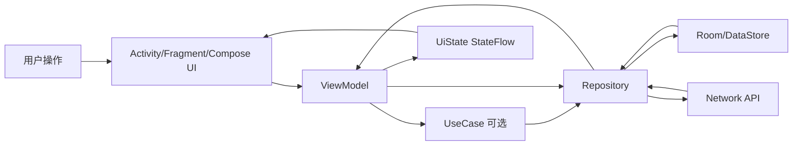
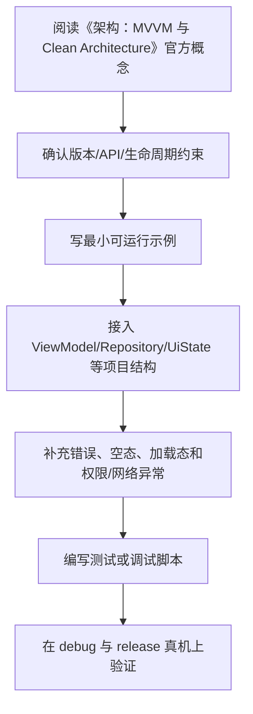

# 07. 架构：MVVM 与 Clean Architecture

## 为什么需要架构

架构的目的不是让项目看起来复杂，而是解决：

- UI 和业务逻辑混杂。
- 网络、数据库和界面强耦合。
- 测试困难。
- 需求变化导致大量联动修改。
- 多人协作边界不清。

Android 项目常见架构是 MVVM + Repository，复杂项目可进一步采用 Clean Architecture。

## MVVM

MVVM 包含：

- Model：数据和业务对象。
- View：界面，Activity、Fragment、Composable。
- ViewModel：管理 UI State，处理界面事件，调用业务逻辑。

数据流：

```text
View 发送事件
  ↓
ViewModel 处理事件
  ↓
UseCase / Repository 执行业务
  ↓
ViewModel 更新 UI State
  ↓
View 根据 State 重绘
```

## UI State

```kotlin
data class LoginUiState(
    val username: String = "",
    val password: String = "",
    val isLoading: Boolean = false,
    val errorMessage: String? = null
)
```

ViewModel：

```kotlin
class LoginViewModel(
    private val login: LoginUseCase
) : ViewModel() {
    private val _state = MutableStateFlow(LoginUiState())
    val state = _state.asStateFlow()
}
```

## Clean Architecture 分层

推荐模块：

```text
project/
├── app/
├── core/
├── domain/
├── data/
├── presentation/
├── design-system/
└── feature/
```

职责：

- `app`：应用入口、导航容器、DI 装配。
- `core`：通用工具、错误类型、基础扩展。
- `domain`：用例、领域模型、仓库接口，保持纯 Kotlin。
- `data`：仓库实现、网络、数据库、DTO、Entity。
- `presentation`：ViewModel、UI State、UI Model。
- `design-system`：主题、组件、图标、排版。
- `feature`：大型项目按功能拆模块。

## 依赖规则

```text
app → presentation, domain, data, core
presentation → domain, design-system, core
data → domain, core
domain → core 或无依赖
core → 无依赖
```

关键规则：

- `domain` 不能依赖 Android 框架。
- `domain` 不能依赖 `data` 或 `presentation`。
- Repository 接口定义在 `domain`。
- Repository 实现在 `data`。
- UI 不直接访问 DAO 或 API。

## Domain 层

领域模型：

```kotlin
data class Article(
    val id: String,
    val title: String,
    val content: String
)
```

Repository 接口：

```kotlin
interface ArticleRepository {
    fun observeArticles(): Flow<List<Article>>
    suspend fun refreshArticles(): Result<Unit>
}
```

UseCase：

```kotlin
class ObserveArticlesUseCase(
    private val repository: ArticleRepository
) {
    operator fun invoke(): Flow<List<Article>> {
        return repository.observeArticles()
    }
}
```

## Data 层

Repository 实现：

```kotlin
class ArticleRepositoryImpl(
    private val local: ArticleLocalDataSource,
    private val remote: ArticleRemoteDataSource
) : ArticleRepository {
    override fun observeArticles(): Flow<List<Article>> {
        return local.observeAll().map { entities ->
            entities.map { it.toDomain() }
        }
    }

    override suspend fun refreshArticles(): Result<Unit> {
        return runCatching {
            val remoteArticles = remote.fetchArticles()
            local.upsert(remoteArticles.map { it.toEntity() })
        }
    }
}
```

映射器：

```kotlin
fun ArticleEntity.toDomain() = Article(
    id = id,
    title = title,
    content = content
)
```

## Presentation 层

```kotlin
class ArticleListViewModel(
    observeArticles: ObserveArticlesUseCase,
    private val refreshArticles: RefreshArticlesUseCase
) : ViewModel() {
    val state: StateFlow<ArticleListUiState> =
        observeArticles()
            .map { articles -> ArticleListUiState(articles = articles) }
            .stateIn(
                scope = viewModelScope,
                started = SharingStarted.WhileSubscribed(5_000),
                initialValue = ArticleListUiState(isLoading = true)
            )
}
```

## 依赖注入

Hilt 示例：

```kotlin
@Module
@InstallIn(SingletonComponent::class)
abstract class RepositoryModule {
    @Binds
    abstract fun bindArticleRepository(
        impl: ArticleRepositoryImpl
    ): ArticleRepository
}
```

Koin 示例：

```kotlin
val domainModule = module {
    factory { ObserveArticlesUseCase(get()) }
}

val dataModule = module {
    single<ArticleRepository> { ArticleRepositoryImpl(get(), get()) }
}
```

## 常见反模式

- ViewModel 直接调用 Retrofit API。
- Composable 里写业务逻辑。
- Domain 层引用 Context、Room、Retrofit。
- UI 层暴露 Entity 或 DTO。
- Repository 过于臃肿，没有拆 DataSource。
- 所有模块互相依赖，形成循环。

## 本章检查清单

- 是否能解释 MVVM 数据流？
- 是否知道 domain 必须保持纯 Kotlin？
- 是否知道 Repository 接口和实现应该分层？
- 是否能区分 Entity、DTO、Domain Model、UI Model？
- 是否知道 UI 不应直接访问数据库或网络？

## 官方推荐分层的理解

现代 Android 推荐把应用拆成三个主要层次：

```text
UI layer -> Domain layer -> Data layer
```

其中 Domain layer 是可选的。简单 CRUD 项目可以是：

```text
UI layer -> Data layer
```

当业务规则复杂、多个 ViewModel 复用同一业务动作、或需要纯 Kotlin 单元测试时，再引入 UseCase。不要为了套 Clean Architecture 给每个简单 Repository 方法都写一个只有一行代码的 UseCase。

## 模型分层

| 模型 | 所属层 | 作用 | 是否暴露给 UI |
| --- | --- | --- | --- |
| DTO | Data / remote | 匹配 API JSON | 否 |
| Entity | Data / local | 匹配数据库表结构 | 否 |
| Domain Model | Domain | 表达业务概念 | 可转换后使用 |
| UI Model | UI | 表达界面需要的数据 | 是 |

转换示例：

```kotlin
fun ArticleDto.toEntity(): ArticleEntity {
    return ArticleEntity(
        id = id,
        title = title,
        content = content,
        updatedAt = updatedAt
    )
}

fun ArticleEntity.toDomain(): Article {
    return Article(
        id = id,
        title = title,
        content = content
    )
}

fun Article.toUiModel(): ArticleUiModel {
    return ArticleUiModel(
        id = id,
        title = title,
        summary = content.take(80)
    )
}
```

不要因为字段暂时一样就复用同一个模型。API、数据库、业务和 UI 的变化节奏不同，复用会让改动互相牵连。

## UseCase 的合适粒度

UseCase 应代表一个业务动作：

```kotlin
class ToggleArticleFavoriteUseCase(
    private val repository: ArticleRepository
) {
    suspend operator fun invoke(articleId: String) {
        val article = repository.getArticle(articleId)
        repository.setFavorite(articleId, !article.isFavorite)
    }
}
```

适合做：

- 组合多个 Repository。
- 处理业务校验。
- 处理事务性业务流程。
- 复用跨页面逻辑。
- 降低 ViewModel 复杂度。

不适合做：

- 单纯转发一行 Repository 调用。
- 依赖 Android `Context`。
- 直接操作 UI 状态。

## 模块拆分策略

小项目不需要一开始就多模块。可按阶段演进：

1. 单模块：`ui`、`data`、`domain` 包结构清晰即可。
2. 基础多模块：`app`、`core`、`data`、`domain`、`feature-*`。
3. 大型项目：按 feature 垂直拆分，每个 feature 内再有 presentation/domain/data。

拆模块的收益是构建边界、团队边界和依赖约束；成本是配置复杂、依赖传递和重构成本。没有明确收益时，不要过早拆。

## 架构评审清单

- ViewModel 是否只处理 UI 事件、状态编排和调用 UseCase？
- Repository 是否屏蔽了网络、本地缓存和错误来源？
- Domain 是否不依赖 Android 框架、Room、Retrofit？
- UI 是否看不到 DTO、Entity、DAO、API Service？
- 错误类型是否统一映射，而不是到处 `try/catch`？
- 是否能用普通 JVM 单元测试覆盖核心 UseCase？
- 是否存在循环依赖或跨 feature 乱调用？

---

## 万字精讲扩展（2026-06-16 更新）
> Last researched: 2026-06-16。本文补充内容以现代 Android 官方推荐实践为主；涉及 Android Studio、AGP、Kotlin、Compose、Jetpack、Play 政策和权限模型的内容，应在实际项目中继续核对最新官方文档。

### 本章在 Android 学习路线中的位置

《架构：MVVM 与 Clean Architecture》是 Android 能力闭环中的一个环节。Android 开发不是只会写页面，也不是只会接接口，而是要同时处理生命周期、状态、数据、线程、权限、性能、测试和发布。学习本章时，建议把每个 API 都放到一个真实屏幕或真实功能里验证：用户怎样进入页面，状态从哪里来，数据怎样刷新，异常怎样展示，旋转和后台后是否恢复，release 包是否仍然正常。

本章学习完成后，至少应达到三个标准。第一，能说清相关组件的职责边界和生命周期边界。第二，能写出一个最小可运行例子，并知道它在完整项目中应该放在哪一层。第三，能设计一个失败场景验证自己的写法是否稳健。Android 的很多能力不是“写出来”，而是“在复杂状态下仍然正确”。

### 架构类笔记的精讲重点

MVVM 和 Clean Architecture 的价值在于降低耦合和提高可测试性，而不是制造目录。ViewModel 将 UI 状态从 Activity/Fragment/Composable 中抽离；Repository 统一数据来源；UseCase 在业务逻辑复杂或复用时才引入；依赖注入让对象创建和依赖替换更清晰。官方 Android 架构中 domain layer 是可选层，这一点要和一些严格 Clean Architecture 文章区分开。

架构判断要看复杂度。小项目可以 UI + ViewModel + Repository；业务规则复杂、多个 ViewModel 复用逻辑时再引入 UseCase；多模块项目再考虑按 feature、core、data、domain、design system 等拆分。过度架构会增加样板代码，架构不足会导致逻辑到处散落。目标始终是边界清晰、依赖方向稳定、测试容易写。

### Android 学习的主线：生命周期、状态、数据流和边界

Android 学习最容易碎片化：今天学 Activity，明天学 Compose，后天学协程和 Room，但不知道这些东西怎样组合成一个稳定应用。更有效的主线是围绕四个问题建立框架。第一，组件什么时候创建、可见、可交互、暂停、销毁，这对应 Activity、Fragment、ViewModel、Lifecycle 和进程死亡。第二，状态放在哪里、谁拥有状态、UI 如何订阅状态、事件如何上行，这对应 MVVM、UI State、Compose state、StateFlow 和单向数据流。第三，数据从哪里来、如何缓存、如何离线、如何同步、错误如何表达，这对应 Repository、Room、DataStore、网络层和离线优先。第四，边界在哪里，包括线程边界、生命周期边界、模块边界、安全边界、测试边界和发布边界。

官方 Android 架构指南把 UI layer、可选 domain layer 和 data layer 作为推荐理解方式。UI 层负责展示应用数据并处理用户交互；数据层通过 repository 暴露应用数据，并组合本地、网络等数据源；domain 层不是每个应用必须有，主要用于复用复杂业务逻辑。学习时不要把“Clean Architecture 图”背成固定目录，而要理解依赖方向：UI 依赖业务抽象，业务不应该反向依赖具体 UI；数据实现可以被替换，调用方不应该到处知道 Retrofit、Room 或 DataStore 的细节。

### 一个现代 Android 应用的数据与状态闭环



Figure: Android 单向数据流和分层架构，综合 Android 官方 App Architecture、Data layer、Compose state 和 lifecycle-aware coroutines 文档整理。

这个闭环说明：UI 不应该直接拼网络请求和数据库查询；ViewModel 不应该持有 Activity 引用；Repository 不应该返回与界面强绑定的 View 对象；Composable 不应该在重组过程中直接执行不可控副作用；生命周期相关收集应该使用 lifecycle-aware API；本地缓存和远程同步应由数据层统一协调。只要这个闭环清楚，很多 API 的选择就会自然起来。

### 学 Android 要建立版本和政策意识

Android 是一个快速演进的平台。API Level、Android Gradle Plugin、Kotlin、Compose Compiler、Jetpack 库、Play 政策、权限模型、后台限制和隐私要求都会变化。因此笔记里不应只写“某 API 怎么用”，还要写“适用版本、替代方案、官方推荐状态、迁移风险”。例如运行时权限、通知权限、前台服务、后台定位、存储访问、exported 组件、明文网络、签名和 targetSdk 都和平台版本或政策强相关。做项目时必须查最新官方文档，而不是只依赖旧博客。

### 最小实战闭环

建议每个阶段都围绕一个小应用反复迭代，例如待办清单、记账、阅读列表、天气、RSS、课程表或离线笔记。第一版只做单 Activity + Compose UI；第二版加入 ViewModel 和 UiState；第三版加入 Room 或 DataStore；第四版加入网络层和 Repository；第五版加入 WorkManager 同步；第六版加入测试、性能分析、R8、签名和发布检查。这样每个知识点都会在同一个项目里发生关系，而不是停留在零散 demo。

### 核心知识点逐条精讲

#### 1. MVVM

在《架构：MVVM 与 Clean Architecture》里，`MVVM` 需要从“平台约束、代码写法、生命周期、测试和线上风险”五个角度理解。Android 不是普通 JVM 程序，它运行在移动设备、受系统生命周期和权限模型约束，随时可能经历旋转、后台、进程回收、权限撤销、网络变化和系统版本差异。学习任何 API 时都要问：它在哪个生命周期内有效，是否需要主线程，是否会泄漏 Context，是否能被测试，失败后用户看到什么。

实践中建议把 `MVVM` 写成可执行规则。例如“在 ViewModel 暴露不可变 UiState，UI 只收集状态并上报事件”，“Repository 负责组合本地和远程数据源，UI 不直接调用 DAO 或 Retrofit”，“Fragment 只在 viewLifecycleOwner 范围内访问 View”，“Compose 副作用必须放进受控 Effect API”，“release 包必须开启并验证 R8 相关路径”。这些规则比单纯记住 API 名称更能防止真实项目出错。

判断 `MVVM` 是否掌握，可以用三个问题：能否写出最小代码；能否说清错误使用会导致什么现象；能否设计测试或调试方法证明它工作正常。比如只会写权限申请代码还不够，还要知道用户拒绝、永久拒绝、系统自动撤销权限、targetSdk 变化时怎样处理。Android 工程能力来自这些边界判断，而不是来自 API 列表背诵。

#### 2. UI State

在《架构：MVVM 与 Clean Architecture》里，`UI State` 需要从“平台约束、代码写法、生命周期、测试和线上风险”五个角度理解。Android 不是普通 JVM 程序，它运行在移动设备、受系统生命周期和权限模型约束，随时可能经历旋转、后台、进程回收、权限撤销、网络变化和系统版本差异。学习任何 API 时都要问：它在哪个生命周期内有效，是否需要主线程，是否会泄漏 Context，是否能被测试，失败后用户看到什么。

实践中建议把 `UI State` 写成可执行规则。例如“在 ViewModel 暴露不可变 UiState，UI 只收集状态并上报事件”，“Repository 负责组合本地和远程数据源，UI 不直接调用 DAO 或 Retrofit”，“Fragment 只在 viewLifecycleOwner 范围内访问 View”，“Compose 副作用必须放进受控 Effect API”，“release 包必须开启并验证 R8 相关路径”。这些规则比单纯记住 API 名称更能防止真实项目出错。

判断 `UI State` 是否掌握，可以用三个问题：能否写出最小代码；能否说清错误使用会导致什么现象；能否设计测试或调试方法证明它工作正常。比如只会写权限申请代码还不够，还要知道用户拒绝、永久拒绝、系统自动撤销权限、targetSdk 变化时怎样处理。Android 工程能力来自这些边界判断，而不是来自 API 列表背诵。

#### 3. Clean Architecture 分层

在《架构：MVVM 与 Clean Architecture》里，`Clean Architecture 分层` 需要从“平台约束、代码写法、生命周期、测试和线上风险”五个角度理解。Android 不是普通 JVM 程序，它运行在移动设备、受系统生命周期和权限模型约束，随时可能经历旋转、后台、进程回收、权限撤销、网络变化和系统版本差异。学习任何 API 时都要问：它在哪个生命周期内有效，是否需要主线程，是否会泄漏 Context，是否能被测试，失败后用户看到什么。

实践中建议把 `Clean Architecture 分层` 写成可执行规则。例如“在 ViewModel 暴露不可变 UiState，UI 只收集状态并上报事件”，“Repository 负责组合本地和远程数据源，UI 不直接调用 DAO 或 Retrofit”，“Fragment 只在 viewLifecycleOwner 范围内访问 View”，“Compose 副作用必须放进受控 Effect API”，“release 包必须开启并验证 R8 相关路径”。这些规则比单纯记住 API 名称更能防止真实项目出错。

判断 `Clean Architecture 分层` 是否掌握，可以用三个问题：能否写出最小代码；能否说清错误使用会导致什么现象；能否设计测试或调试方法证明它工作正常。比如只会写权限申请代码还不够，还要知道用户拒绝、永久拒绝、系统自动撤销权限、targetSdk 变化时怎样处理。Android 工程能力来自这些边界判断，而不是来自 API 列表背诵。

#### 4. 依赖规则

在《架构：MVVM 与 Clean Architecture》里，`依赖规则` 需要从“平台约束、代码写法、生命周期、测试和线上风险”五个角度理解。Android 不是普通 JVM 程序，它运行在移动设备、受系统生命周期和权限模型约束，随时可能经历旋转、后台、进程回收、权限撤销、网络变化和系统版本差异。学习任何 API 时都要问：它在哪个生命周期内有效，是否需要主线程，是否会泄漏 Context，是否能被测试，失败后用户看到什么。

实践中建议把 `依赖规则` 写成可执行规则。例如“在 ViewModel 暴露不可变 UiState，UI 只收集状态并上报事件”，“Repository 负责组合本地和远程数据源，UI 不直接调用 DAO 或 Retrofit”，“Fragment 只在 viewLifecycleOwner 范围内访问 View”，“Compose 副作用必须放进受控 Effect API”，“release 包必须开启并验证 R8 相关路径”。这些规则比单纯记住 API 名称更能防止真实项目出错。

判断 `依赖规则` 是否掌握，可以用三个问题：能否写出最小代码；能否说清错误使用会导致什么现象；能否设计测试或调试方法证明它工作正常。比如只会写权限申请代码还不够，还要知道用户拒绝、永久拒绝、系统自动撤销权限、targetSdk 变化时怎样处理。Android 工程能力来自这些边界判断，而不是来自 API 列表背诵。

#### 5. 依赖注入和反模式

在《架构：MVVM 与 Clean Architecture》里，`依赖注入和反模式` 需要从“平台约束、代码写法、生命周期、测试和线上风险”五个角度理解。Android 不是普通 JVM 程序，它运行在移动设备、受系统生命周期和权限模型约束，随时可能经历旋转、后台、进程回收、权限撤销、网络变化和系统版本差异。学习任何 API 时都要问：它在哪个生命周期内有效，是否需要主线程，是否会泄漏 Context，是否能被测试，失败后用户看到什么。

实践中建议把 `依赖注入和反模式` 写成可执行规则。例如“在 ViewModel 暴露不可变 UiState，UI 只收集状态并上报事件”，“Repository 负责组合本地和远程数据源，UI 不直接调用 DAO 或 Retrofit”，“Fragment 只在 viewLifecycleOwner 范围内访问 View”，“Compose 副作用必须放进受控 Effect API”，“release 包必须开启并验证 R8 相关路径”。这些规则比单纯记住 API 名称更能防止真实项目出错。

判断 `依赖注入和反模式` 是否掌握，可以用三个问题：能否写出最小代码；能否说清错误使用会导致什么现象；能否设计测试或调试方法证明它工作正常。比如只会写权限申请代码还不够，还要知道用户拒绝、永久拒绝、系统自动撤销权限、targetSdk 变化时怎样处理。Android 工程能力来自这些边界判断，而不是来自 API 列表背诵。


### 场景化学习与排错表

| 主题 | 推荐动作 | 常见风险 | 验证方式 |
| :--- | :--- | :--- | :--- |
| MVVM | 先查官方文档和版本要求，再写最小 demo，最后放入项目闭环验证 | 生命周期错位、Context 泄漏、线程错误、版本差异、只测 debug | 单元测试、仪器测试、Logcat、Profiler、release 构建和真机验证 |
| UI State | 先查官方文档和版本要求，再写最小 demo，最后放入项目闭环验证 | 生命周期错位、Context 泄漏、线程错误、版本差异、只测 debug | 单元测试、仪器测试、Logcat、Profiler、release 构建和真机验证 |
| Clean Architecture 分层 | 先查官方文档和版本要求，再写最小 demo，最后放入项目闭环验证 | 生命周期错位、Context 泄漏、线程错误、版本差异、只测 debug | 单元测试、仪器测试、Logcat、Profiler、release 构建和真机验证 |
| 依赖规则 | 先查官方文档和版本要求，再写最小 demo，最后放入项目闭环验证 | 生命周期错位、Context 泄漏、线程错误、版本差异、只测 debug | 单元测试、仪器测试、Logcat、Profiler、release 构建和真机验证 |
| 依赖注入和反模式 | 先查官方文档和版本要求，再写最小 demo，最后放入项目闭环验证 | 生命周期错位、Context 泄漏、线程错误、版本差异、只测 debug | 单元测试、仪器测试、Logcat、Profiler、release 构建和真机验证 |

表格中的推荐动作强调“官方依据 + 最小验证 + 项目闭环”。Android 生态变化快，旧博客里的写法可能已经被官方替代，或者只适用于某个 API Level、某个 Jetpack 版本。遇到冲突时，优先查 Android Developers、Kotlin、Gradle 和库的 release notes，再参考社区经验。

### 本章建议工作流



Figure: 《架构：MVVM 与 Clean Architecture》学习工作流，综合 Android 官方架构、Compose、Lifecycle、Coroutines、Data layer、Performance 和 Release 文档整理。

这个工作流避免两个极端：只看文档不落地，或者只复制 demo 不理解边界。Android 很多 bug 只在生命周期切换、后台恢复、低内存、release 混淆、慢网络、权限拒绝或特定系统版本中出现，所以最小 demo 跑通以后，还要放回完整应用场景验证。

### 常见误区和纠正方法

- 误区：Activity/Fragment 里堆所有逻辑。纠正：UI 组件负责展示和事件，状态放 ViewModel，数据访问放 Repository，复杂复用逻辑再考虑 UseCase。
- 误区：只测 debug，不测 release。纠正：R8、资源压缩、签名、网络安全配置和 build variants 可能让 release 行为不同，发布前必须验证 release 包。
- 误区：忽略生命周期。纠正：Flow 收集、回调注册、binding、协程、导航和副作用都要绑定正确 lifecycle。
- 误区：把 Compose 当成简单 XML 替代。纠正：Compose 的核心是状态驱动 UI、可组合函数、重组、副作用控制和稳定性。
- 误区：权限申请只看成功路径。纠正：必须处理拒绝、永久拒绝、功能降级、隐私说明、targetSdk 变化和系统自动撤销。
- 误区：看到性能问题就先优化代码。纠正：先用 Profiler、Baseline Profile、启动指标、帧时间、内存快照和日志定位瓶颈。

### 与相邻章节的关系

《架构：MVVM 与 Clean Architecture》应和其他章节联动阅读。项目结构决定依赖和构建变体，Kotlin 决定状态和异步表达方式，生命周期决定 UI 和协程边界，Compose 决定状态和副作用组织，架构决定依赖方向，数据层决定离线和同步能力，测试和发布决定应用能否可靠交付。任何一个主题脱离这些关系，都容易变成 demo 级知识。

### 实操训练和复盘模板

1. 围绕 `MVVM` 做一个小任务：写最小实现、制造一个失败场景、记录修复方法。
2. 围绕 `UI State` 做一个小任务：写最小实现、制造一个失败场景、记录修复方法。
3. 围绕 `Clean Architecture 分层` 做一个小任务：写最小实现、制造一个失败场景、记录修复方法。
4. 围绕 `依赖规则` 做一个小任务：写最小实现、制造一个失败场景、记录修复方法。
5. 围绕 `依赖注入和反模式` 做一个小任务：写最小实现、制造一个失败场景、记录修复方法。

建议每次练习都按下面格式记录：

```text
练习名称：
本章主题：架构：MVVM 与 Clean Architecture
目标 API / 组件：
版本信息：Android Studio、AGP、Kotlin、compileSdk、minSdk、targetSdk、相关 Jetpack 版本
最小实现：
生命周期和线程边界：
失败场景：旋转、后台、进程死亡、断网、权限拒绝、release 混淆等
调试证据：Logcat、断点、Profiler、截图、测试结果
最终规则：以后项目中如何写，什么情况下不能这样写
```

这个模板能把“会用 API”推进到“知道边界”。很多 Android 问题第一次看像偶发 bug，复盘后会发现是生命周期、状态持有、线程、权限、缓存或构建变体没有设计清楚。

## 参考资料与延伸阅读

- [Official / Android] Guide to app architecture: https://developer.android.com/topic/architecture
- [Official / Android] UI layer: https://developer.android.com/topic/architecture/ui-layer
- [Official / Android] Data layer: https://developer.android.com/topic/architecture/data-layer
- [Official / Android] Domain layer: https://developer.android.com/topic/architecture/domain-layer
- [Official / Android] Build an offline-first app: https://developer.android.com/topic/architecture/data-layer/offline-first
- [Official / Android] Configure your build: https://developer.android.com/build
- [Official / Android] Add build dependencies: https://developer.android.com/build/dependencies
- [Official / Android] Fragment lifecycle: https://developer.android.com/guide/fragments/lifecycle
- [Official / Android] Saved State module for ViewModel: https://developer.android.com/topic/libraries/architecture/viewmodel/viewmodel-savedstate
- [Official / Android] State and Jetpack Compose: https://developer.android.com/develop/ui/compose/state
- [Official / Android] Side-effects in Compose: https://developer.android.com/develop/ui/compose/side-effects
- [Official / Android] Jetpack Compose performance: https://developer.android.com/develop/ui/compose/performance
- [Official / Android] Stability in Compose: https://developer.android.com/develop/ui/compose/performance/stability
- [Official / Android] Kotlin coroutines on Android: https://developer.android.com/kotlin/coroutines
- [Official / Android] Kotlin flows on Android: https://developer.android.com/kotlin/flow
- [Official / Android] Use Kotlin coroutines with lifecycle-aware components: https://developer.android.com/topic/libraries/architecture/coroutines
- [Official / Android] Dependency injection with Hilt: https://developer.android.com/training/dependency-injection/hilt-android
- [Official / Android] Network security configuration: https://developer.android.com/privacy-and-security/security-config
- [Official / Android] Enable app optimization with R8: https://developer.android.com/topic/performance/app-optimization/enable-app-optimization
- [Official / Android] Baseline Profiles overview: https://developer.android.com/topic/performance/baselineprofiles/overview
- [Official / Google Codelab] Improve app performance with Baseline Profiles: https://codelabs.developers.google.com/android-baseline-profiles-improve
- [Official / Kotlin] Kotlin documentation: https://kotlinlang.org/docs/home.html
- [Official / Kotlin] Sealed classes and interfaces: https://kotlinlang.org/docs/sealed-classes.html
- [Official / Kotlin] Configure a Gradle project: https://kotlinlang.org/docs/gradle-configure-project.html
- [Official / Gradle] Gradle Kotlin DSL Primer: https://docs.gradle.org/current/userguide/kotlin_dsl.html
- [Security / OWASP] Android Network Security Configuration: https://mas.owasp.org/MASTG/knowledge/android/MASVS-NETWORK/MASTG-KNOW-0014/
- [Blog / Android Developers] Rebuilding our guide to app architecture: https://android-developers.googleblog.com/2021/12/rebuilding-our-guide-to-app-architecture.html
- [Blog / Android Developers] Improving Performance with Baseline Profiles: https://medium.com/androiddevelopers/improving-performance-with-baseline-profiles-fdd0db0d8cc6
- [Community / CSDN] Android 学习笔记检索入口: https://so.csdn.net/so/search?q=Android%20%E5%AD%A6%E4%B9%A0%E7%AC%94%E8%AE%B0%20Jetpack%20Compose
- [Community / 博客园] Android 架构与 Jetpack 笔记检索入口: https://zzk.cnblogs.com/s/blogpost?Keywords=Android%20Jetpack%20MVVM%20Compose
- [Community / 掘金] Android Compose / 协程 / 架构实践检索入口: https://juejin.cn/search?query=Android%20Compose%20%E5%8D%8F%E7%A8%8B%20%E6%9E%B6%E6%9E%84&type=0
