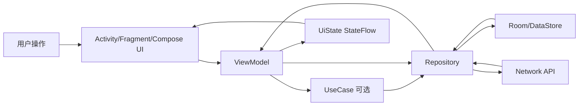
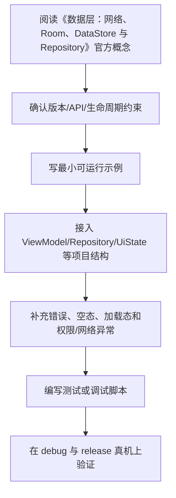

# 08. 数据层：网络、Room、DataStore 与 Repository

## 数据层职责

数据层负责：

- 网络请求。
- 本地数据库。
- 缓存。
- 数据同步。
- DTO / Entity / Domain 映射。
- 错误处理。
- Repository 实现。

UI 层不应知道数据来自网络还是数据库。

## Repository

Repository 对外提供统一数据接口：

```kotlin
interface UserRepository {
    fun observeUsers(): Flow<List<User>>
    suspend fun refreshUsers(): Result<Unit>
}
```

实现中协调数据源：

```kotlin
class UserRepositoryImpl(
    private val local: UserLocalDataSource,
    private val remote: UserRemoteDataSource
) : UserRepository
```

## 网络层

常见选择：

- Retrofit：Android 项目常用。
- Ktor Client：KMP 和 Kotlin 生态常用。
- OkHttp：底层 HTTP 客户端。

Retrofit 示例：

```kotlin
interface UserApi {
    @GET("users")
    suspend fun getUsers(): List<UserDto>
}
```

DTO：

```kotlin
data class UserDto(
    val id: String,
    val name: String
)
```

## Room

Room 是 Android 官方数据库库，基于 SQLite。

Entity：

```kotlin
@Entity(tableName = "users")
data class UserEntity(
    @PrimaryKey val id: String,
    val name: String
)
```

DAO：

```kotlin
@Dao
interface UserDao {
    @Query("SELECT * FROM users")
    fun observeAll(): Flow<List<UserEntity>>

    @Upsert
    suspend fun upsertAll(users: List<UserEntity>)

    @Query("DELETE FROM users")
    suspend fun clear()
}
```

Database：

```kotlin
@Database(
    entities = [UserEntity::class],
    version = 1
)
abstract class AppDatabase : RoomDatabase() {
    abstract fun userDao(): UserDao
}
```

## DataStore

DataStore 适合保存小型配置，例如：

- 用户设置。
- 开关。
- token 元信息。
- 本地偏好。

Preferences DataStore 示例：

```kotlin
val Context.dataStore by preferencesDataStore(name = "settings")

class SettingsDataSource(
    private val dataStore: DataStore<Preferences>
) {
    val darkMode: Flow<Boolean> = dataStore.data.map { prefs ->
        prefs[booleanPreferencesKey("dark_mode")] ?: false
    }
}
```

不要用 DataStore 保存大量结构化业务数据，应该使用 Room。

## DTO、Entity、Domain Model

DTO：网络数据结构。

Entity：数据库表结构。

Domain Model：业务模型。

UI Model：界面展示模型。

不要混用：

- DTO 可能随接口变化。
- Entity 可能受数据库约束。
- Domain Model 应表达业务含义。
- UI Model 应适配界面展示。

## 离线优先

离线优先常见流程：

```text
UI 观察 Room
  ↓
Repository 从网络刷新
  ↓
写入 Room
  ↓
Room Flow 推送新数据
  ↓
UI 自动更新
```

优点：

- UI 有本地缓存可显示。
- 网络失败时仍可使用。
- 数据流稳定。

## 缓存策略

常见策略：

- Cache Only：只读缓存。
- Network Only：只读网络。
- Cache First：先显示缓存，再刷新网络。
- Network First：优先网络，失败回退缓存。
- Stale While Revalidate：先返回旧数据，同时后台刷新。

选择取决于业务对实时性和可用性的要求。

## 错误处理

数据层应区分：

- 网络不可用。
- 超时。
- 401 未授权。
- 服务器错误。
- 数据库错误。
- JSON 解析错误。

建议映射为统一错误类型：

```kotlin
sealed interface AppError {
    data object NetworkUnavailable : AppError
    data object Unauthorized : AppError
    data class Server(val code: Int) : AppError
    data class Unknown(val message: String) : AppError
}
```

## 本章检查清单

- 是否知道 Repository 的作用？
- 是否能区分 DTO、Entity、Domain Model？
- 是否会使用 Room 的 Entity、Dao、Database？
- 是否知道 DataStore 适合保存什么？
- 是否理解离线优先数据流？

## 数据层职责边界

Data layer 的目标是给上层提供稳定、可测试的数据接口，而不是把 Retrofit、Room、DataStore 直接暴露给 UI。

推荐结构：

```text
data/
├── remote/
│   ├── ArticleApi
│   └── ArticleDto
├── local/
│   ├── ArticleDao
│   ├── ArticleEntity
│   └── AppDatabase
├── mapper/
│   └── ArticleMappers.kt
└── ArticleRepositoryImpl
```

Domain 层只看到：

```kotlin
interface ArticleRepository {
    fun observeArticles(): Flow<List<Article>>
    suspend fun refresh(): AppResult<Unit>
}
```

## 离线优先数据流

离线优先通常不是“没网时读缓存”这么简单，而是让本地数据库成为 UI 的主要数据源：

```text
UI observes Room Flow
        ^
        |
Repository refreshes network
        |
Remote DTO -> Entity -> Room transaction
```

示例：

```kotlin
class ArticleRepositoryImpl(
    private val api: ArticleApi,
    private val dao: ArticleDao
) : ArticleRepository {
    override fun observeArticles(): Flow<List<Article>> {
        return dao.observeAll()
            .map { entities -> entities.map { it.toDomain() } }
    }

    override suspend fun refresh(): AppResult<Unit> {
        return runCatching {
            val articles = api.fetchArticles()
            dao.replaceAll(articles.map { it.toEntity() })
        }.fold(
            onSuccess = { AppResult.Success(Unit) },
            onFailure = { AppResult.Error(it.toAppError()) }
        )
    }
}
```

这样 UI 不需要知道数据来自网络还是缓存。

## Room 实践要点

- 数据库操作不要阻塞主线程。
- 多表更新使用 `@Transaction`。
- 数据库迁移必须测试，不能只开发期 `fallbackToDestructiveMigration()`。
- Entity 不要承担业务逻辑。
- DAO 返回 `Flow` 时，Room 会在表变化后重新发射数据。

迁移示例：

```kotlin
val MIGRATION_1_2 = object : Migration(1, 2) {
    override fun migrate(db: SupportSQLiteDatabase) {
        db.execSQL("ALTER TABLE articles ADD COLUMN summary TEXT NOT NULL DEFAULT ''")
    }
}
```

## DataStore 使用边界

DataStore 适合：

- 用户设置。
- 小型 key-value 配置。
- 简单持久状态，例如主题、排序方式、是否首次打开。

不适合：

- 大量结构化列表数据。
- 需要复杂查询的数据。
- 关系型数据。
- 高频大体积写入。

这类数据应使用 Room。

## 网络层实践

网络层至少要处理：

- 超时和重试。
- 认证失效。
- 错误响应体解析。
- JSON 字段缺失或类型变化。
- 分页和缓存策略。
- 日志脱敏。

不要让 ViewModel 直接判断 HTTP code。Repository 应把底层异常映射为业务可理解的错误：

```kotlin
fun Throwable.toAppError(): AppError {
    return when (this) {
        is IOException -> AppError.NetworkUnavailable
        is HttpException -> {
            if (code() == 401) AppError.Unauthorized else AppError.Server(code())
        }
        else -> AppError.Unknown(message.orEmpty())
    }
}
```

## 数据层测试重点

- Mapper：DTO、Entity、Domain 转换是否正确。
- DAO：增删改查、排序、事务、迁移。
- Repository：网络成功、网络失败、缓存回退、错误映射。
- DataStore：默认值、写入、读取、迁移。
- 分页：刷新、追加、空列表、错误重试。

---

## 万字精讲扩展（2026-06-16 更新）
> Last researched: 2026-06-16。本文补充内容以现代 Android 官方推荐实践为主；涉及 Android Studio、AGP、Kotlin、Compose、Jetpack、Play 政策和权限模型的内容，应在实际项目中继续核对最新官方文档。

### 本章在 Android 学习路线中的位置

《数据层：网络、Room、DataStore 与 Repository》是 Android 能力闭环中的一个环节。Android 开发不是只会写页面，也不是只会接接口，而是要同时处理生命周期、状态、数据、线程、权限、性能、测试和发布。学习本章时，建议把每个 API 都放到一个真实屏幕或真实功能里验证：用户怎样进入页面，状态从哪里来，数据怎样刷新，异常怎样展示，旋转和后台后是否恢复，release 包是否仍然正常。

本章学习完成后，至少应达到三个标准。第一，能说清相关组件的职责边界和生命周期边界。第二，能写出一个最小可运行例子，并知道它在完整项目中应该放在哪一层。第三，能设计一个失败场景验证自己的写法是否稳健。Android 的很多能力不是“写出来”，而是“在复杂状态下仍然正确”。

### 数据层类笔记的精讲重点

数据层负责把网络、本地数据库、偏好设置、缓存和同步策略封装成稳定 API。Repository 不是简单转发 DAO 或 Retrofit，而是组合数据源、处理缓存、错误、刷新、分页和离线逻辑。官方离线优先指南强调，至少关键读取能力应不依赖网络；这意味着 UI 优先订阅本地数据库，网络请求负责同步并更新本地源。

Room 适合结构化关系数据，DataStore 适合小规模 key-value 或 typed preferences，网络层负责 DTO 和错误码，Domain Model 用于业务语义。DTO、Entity、Domain、UiModel 不应无脑合并。映射层虽然增加代码，但能隔离后端字段变化、数据库结构和 UI 展示需求。

### Android 学习的主线：生命周期、状态、数据流和边界

Android 学习最容易碎片化：今天学 Activity，明天学 Compose，后天学协程和 Room，但不知道这些东西怎样组合成一个稳定应用。更有效的主线是围绕四个问题建立框架。第一，组件什么时候创建、可见、可交互、暂停、销毁，这对应 Activity、Fragment、ViewModel、Lifecycle 和进程死亡。第二，状态放在哪里、谁拥有状态、UI 如何订阅状态、事件如何上行，这对应 MVVM、UI State、Compose state、StateFlow 和单向数据流。第三，数据从哪里来、如何缓存、如何离线、如何同步、错误如何表达，这对应 Repository、Room、DataStore、网络层和离线优先。第四，边界在哪里，包括线程边界、生命周期边界、模块边界、安全边界、测试边界和发布边界。

官方 Android 架构指南把 UI layer、可选 domain layer 和 data layer 作为推荐理解方式。UI 层负责展示应用数据并处理用户交互；数据层通过 repository 暴露应用数据，并组合本地、网络等数据源；domain 层不是每个应用必须有，主要用于复用复杂业务逻辑。学习时不要把“Clean Architecture 图”背成固定目录，而要理解依赖方向：UI 依赖业务抽象，业务不应该反向依赖具体 UI；数据实现可以被替换，调用方不应该到处知道 Retrofit、Room 或 DataStore 的细节。

### 一个现代 Android 应用的数据与状态闭环



Figure: Android 单向数据流和分层架构，综合 Android 官方 App Architecture、Data layer、Compose state 和 lifecycle-aware coroutines 文档整理。

这个闭环说明：UI 不应该直接拼网络请求和数据库查询；ViewModel 不应该持有 Activity 引用；Repository 不应该返回与界面强绑定的 View 对象；Composable 不应该在重组过程中直接执行不可控副作用；生命周期相关收集应该使用 lifecycle-aware API；本地缓存和远程同步应由数据层统一协调。只要这个闭环清楚，很多 API 的选择就会自然起来。

### 学 Android 要建立版本和政策意识

Android 是一个快速演进的平台。API Level、Android Gradle Plugin、Kotlin、Compose Compiler、Jetpack 库、Play 政策、权限模型、后台限制和隐私要求都会变化。因此笔记里不应只写“某 API 怎么用”，还要写“适用版本、替代方案、官方推荐状态、迁移风险”。例如运行时权限、通知权限、前台服务、后台定位、存储访问、exported 组件、明文网络、签名和 targetSdk 都和平台版本或政策强相关。做项目时必须查最新官方文档，而不是只依赖旧博客。

### 最小实战闭环

建议每个阶段都围绕一个小应用反复迭代，例如待办清单、记账、阅读列表、天气、RSS、课程表或离线笔记。第一版只做单 Activity + Compose UI；第二版加入 ViewModel 和 UiState；第三版加入 Room 或 DataStore；第四版加入网络层和 Repository；第五版加入 WorkManager 同步；第六版加入测试、性能分析、R8、签名和发布检查。这样每个知识点都会在同一个项目里发生关系，而不是停留在零散 demo。

### 核心知识点逐条精讲

#### 1. Repository

在《数据层：网络、Room、DataStore 与 Repository》里，`Repository` 需要从“平台约束、代码写法、生命周期、测试和线上风险”五个角度理解。Android 不是普通 JVM 程序，它运行在移动设备、受系统生命周期和权限模型约束，随时可能经历旋转、后台、进程回收、权限撤销、网络变化和系统版本差异。学习任何 API 时都要问：它在哪个生命周期内有效，是否需要主线程，是否会泄漏 Context，是否能被测试，失败后用户看到什么。

实践中建议把 `Repository` 写成可执行规则。例如“在 ViewModel 暴露不可变 UiState，UI 只收集状态并上报事件”，“Repository 负责组合本地和远程数据源，UI 不直接调用 DAO 或 Retrofit”，“Fragment 只在 viewLifecycleOwner 范围内访问 View”，“Compose 副作用必须放进受控 Effect API”，“release 包必须开启并验证 R8 相关路径”。这些规则比单纯记住 API 名称更能防止真实项目出错。

判断 `Repository` 是否掌握，可以用三个问题：能否写出最小代码；能否说清错误使用会导致什么现象；能否设计测试或调试方法证明它工作正常。比如只会写权限申请代码还不够，还要知道用户拒绝、永久拒绝、系统自动撤销权限、targetSdk 变化时怎样处理。Android 工程能力来自这些边界判断，而不是来自 API 列表背诵。

#### 2. 网络层

在《数据层：网络、Room、DataStore 与 Repository》里，`网络层` 需要从“平台约束、代码写法、生命周期、测试和线上风险”五个角度理解。Android 不是普通 JVM 程序，它运行在移动设备、受系统生命周期和权限模型约束，随时可能经历旋转、后台、进程回收、权限撤销、网络变化和系统版本差异。学习任何 API 时都要问：它在哪个生命周期内有效，是否需要主线程，是否会泄漏 Context，是否能被测试，失败后用户看到什么。

实践中建议把 `网络层` 写成可执行规则。例如“在 ViewModel 暴露不可变 UiState，UI 只收集状态并上报事件”，“Repository 负责组合本地和远程数据源，UI 不直接调用 DAO 或 Retrofit”，“Fragment 只在 viewLifecycleOwner 范围内访问 View”，“Compose 副作用必须放进受控 Effect API”，“release 包必须开启并验证 R8 相关路径”。这些规则比单纯记住 API 名称更能防止真实项目出错。

判断 `网络层` 是否掌握，可以用三个问题：能否写出最小代码；能否说清错误使用会导致什么现象；能否设计测试或调试方法证明它工作正常。比如只会写权限申请代码还不够，还要知道用户拒绝、永久拒绝、系统自动撤销权限、targetSdk 变化时怎样处理。Android 工程能力来自这些边界判断，而不是来自 API 列表背诵。

#### 3. Room

在《数据层：网络、Room、DataStore 与 Repository》里，`Room` 需要从“平台约束、代码写法、生命周期、测试和线上风险”五个角度理解。Android 不是普通 JVM 程序，它运行在移动设备、受系统生命周期和权限模型约束，随时可能经历旋转、后台、进程回收、权限撤销、网络变化和系统版本差异。学习任何 API 时都要问：它在哪个生命周期内有效，是否需要主线程，是否会泄漏 Context，是否能被测试，失败后用户看到什么。

实践中建议把 `Room` 写成可执行规则。例如“在 ViewModel 暴露不可变 UiState，UI 只收集状态并上报事件”，“Repository 负责组合本地和远程数据源，UI 不直接调用 DAO 或 Retrofit”，“Fragment 只在 viewLifecycleOwner 范围内访问 View”，“Compose 副作用必须放进受控 Effect API”，“release 包必须开启并验证 R8 相关路径”。这些规则比单纯记住 API 名称更能防止真实项目出错。

判断 `Room` 是否掌握，可以用三个问题：能否写出最小代码；能否说清错误使用会导致什么现象；能否设计测试或调试方法证明它工作正常。比如只会写权限申请代码还不够，还要知道用户拒绝、永久拒绝、系统自动撤销权限、targetSdk 变化时怎样处理。Android 工程能力来自这些边界判断，而不是来自 API 列表背诵。

#### 4. DataStore

在《数据层：网络、Room、DataStore 与 Repository》里，`DataStore` 需要从“平台约束、代码写法、生命周期、测试和线上风险”五个角度理解。Android 不是普通 JVM 程序，它运行在移动设备、受系统生命周期和权限模型约束，随时可能经历旋转、后台、进程回收、权限撤销、网络变化和系统版本差异。学习任何 API 时都要问：它在哪个生命周期内有效，是否需要主线程，是否会泄漏 Context，是否能被测试，失败后用户看到什么。

实践中建议把 `DataStore` 写成可执行规则。例如“在 ViewModel 暴露不可变 UiState，UI 只收集状态并上报事件”，“Repository 负责组合本地和远程数据源，UI 不直接调用 DAO 或 Retrofit”，“Fragment 只在 viewLifecycleOwner 范围内访问 View”，“Compose 副作用必须放进受控 Effect API”，“release 包必须开启并验证 R8 相关路径”。这些规则比单纯记住 API 名称更能防止真实项目出错。

判断 `DataStore` 是否掌握，可以用三个问题：能否写出最小代码；能否说清错误使用会导致什么现象；能否设计测试或调试方法证明它工作正常。比如只会写权限申请代码还不够，还要知道用户拒绝、永久拒绝、系统自动撤销权限、targetSdk 变化时怎样处理。Android 工程能力来自这些边界判断，而不是来自 API 列表背诵。

#### 5. 离线优先和错误处理

在《数据层：网络、Room、DataStore 与 Repository》里，`离线优先和错误处理` 需要从“平台约束、代码写法、生命周期、测试和线上风险”五个角度理解。Android 不是普通 JVM 程序，它运行在移动设备、受系统生命周期和权限模型约束，随时可能经历旋转、后台、进程回收、权限撤销、网络变化和系统版本差异。学习任何 API 时都要问：它在哪个生命周期内有效，是否需要主线程，是否会泄漏 Context，是否能被测试，失败后用户看到什么。

实践中建议把 `离线优先和错误处理` 写成可执行规则。例如“在 ViewModel 暴露不可变 UiState，UI 只收集状态并上报事件”，“Repository 负责组合本地和远程数据源，UI 不直接调用 DAO 或 Retrofit”，“Fragment 只在 viewLifecycleOwner 范围内访问 View”，“Compose 副作用必须放进受控 Effect API”，“release 包必须开启并验证 R8 相关路径”。这些规则比单纯记住 API 名称更能防止真实项目出错。

判断 `离线优先和错误处理` 是否掌握，可以用三个问题：能否写出最小代码；能否说清错误使用会导致什么现象；能否设计测试或调试方法证明它工作正常。比如只会写权限申请代码还不够，还要知道用户拒绝、永久拒绝、系统自动撤销权限、targetSdk 变化时怎样处理。Android 工程能力来自这些边界判断，而不是来自 API 列表背诵。


### 场景化学习与排错表

| 主题 | 推荐动作 | 常见风险 | 验证方式 |
| :--- | :--- | :--- | :--- |
| Repository | 先查官方文档和版本要求，再写最小 demo，最后放入项目闭环验证 | 生命周期错位、Context 泄漏、线程错误、版本差异、只测 debug | 单元测试、仪器测试、Logcat、Profiler、release 构建和真机验证 |
| 网络层 | 先查官方文档和版本要求，再写最小 demo，最后放入项目闭环验证 | 生命周期错位、Context 泄漏、线程错误、版本差异、只测 debug | 单元测试、仪器测试、Logcat、Profiler、release 构建和真机验证 |
| Room | 先查官方文档和版本要求，再写最小 demo，最后放入项目闭环验证 | 生命周期错位、Context 泄漏、线程错误、版本差异、只测 debug | 单元测试、仪器测试、Logcat、Profiler、release 构建和真机验证 |
| DataStore | 先查官方文档和版本要求，再写最小 demo，最后放入项目闭环验证 | 生命周期错位、Context 泄漏、线程错误、版本差异、只测 debug | 单元测试、仪器测试、Logcat、Profiler、release 构建和真机验证 |
| 离线优先和错误处理 | 先查官方文档和版本要求，再写最小 demo，最后放入项目闭环验证 | 生命周期错位、Context 泄漏、线程错误、版本差异、只测 debug | 单元测试、仪器测试、Logcat、Profiler、release 构建和真机验证 |

表格中的推荐动作强调“官方依据 + 最小验证 + 项目闭环”。Android 生态变化快，旧博客里的写法可能已经被官方替代，或者只适用于某个 API Level、某个 Jetpack 版本。遇到冲突时，优先查 Android Developers、Kotlin、Gradle 和库的 release notes，再参考社区经验。

### 本章建议工作流



Figure: 《数据层：网络、Room、DataStore 与 Repository》学习工作流，综合 Android 官方架构、Compose、Lifecycle、Coroutines、Data layer、Performance 和 Release 文档整理。

这个工作流避免两个极端：只看文档不落地，或者只复制 demo 不理解边界。Android 很多 bug 只在生命周期切换、后台恢复、低内存、release 混淆、慢网络、权限拒绝或特定系统版本中出现，所以最小 demo 跑通以后，还要放回完整应用场景验证。

### 常见误区和纠正方法

- 误区：Activity/Fragment 里堆所有逻辑。纠正：UI 组件负责展示和事件，状态放 ViewModel，数据访问放 Repository，复杂复用逻辑再考虑 UseCase。
- 误区：只测 debug，不测 release。纠正：R8、资源压缩、签名、网络安全配置和 build variants 可能让 release 行为不同，发布前必须验证 release 包。
- 误区：忽略生命周期。纠正：Flow 收集、回调注册、binding、协程、导航和副作用都要绑定正确 lifecycle。
- 误区：把 Compose 当成简单 XML 替代。纠正：Compose 的核心是状态驱动 UI、可组合函数、重组、副作用控制和稳定性。
- 误区：权限申请只看成功路径。纠正：必须处理拒绝、永久拒绝、功能降级、隐私说明、targetSdk 变化和系统自动撤销。
- 误区：看到性能问题就先优化代码。纠正：先用 Profiler、Baseline Profile、启动指标、帧时间、内存快照和日志定位瓶颈。

### 与相邻章节的关系

《数据层：网络、Room、DataStore 与 Repository》应和其他章节联动阅读。项目结构决定依赖和构建变体，Kotlin 决定状态和异步表达方式，生命周期决定 UI 和协程边界，Compose 决定状态和副作用组织，架构决定依赖方向，数据层决定离线和同步能力，测试和发布决定应用能否可靠交付。任何一个主题脱离这些关系，都容易变成 demo 级知识。

### 实操训练和复盘模板

1. 围绕 `Repository` 做一个小任务：写最小实现、制造一个失败场景、记录修复方法。
2. 围绕 `网络层` 做一个小任务：写最小实现、制造一个失败场景、记录修复方法。
3. 围绕 `Room` 做一个小任务：写最小实现、制造一个失败场景、记录修复方法。
4. 围绕 `DataStore` 做一个小任务：写最小实现、制造一个失败场景、记录修复方法。
5. 围绕 `离线优先和错误处理` 做一个小任务：写最小实现、制造一个失败场景、记录修复方法。

建议每次练习都按下面格式记录：

```text
练习名称：
本章主题：数据层：网络、Room、DataStore 与 Repository
目标 API / 组件：
版本信息：Android Studio、AGP、Kotlin、compileSdk、minSdk、targetSdk、相关 Jetpack 版本
最小实现：
生命周期和线程边界：
失败场景：旋转、后台、进程死亡、断网、权限拒绝、release 混淆等
调试证据：Logcat、断点、Profiler、截图、测试结果
最终规则：以后项目中如何写，什么情况下不能这样写
```

这个模板能把“会用 API”推进到“知道边界”。很多 Android 问题第一次看像偶发 bug，复盘后会发现是生命周期、状态持有、线程、权限、缓存或构建变体没有设计清楚。

## 参考资料与延伸阅读

- [Official / Android] Guide to app architecture: https://developer.android.com/topic/architecture
- [Official / Android] UI layer: https://developer.android.com/topic/architecture/ui-layer
- [Official / Android] Data layer: https://developer.android.com/topic/architecture/data-layer
- [Official / Android] Domain layer: https://developer.android.com/topic/architecture/domain-layer
- [Official / Android] Build an offline-first app: https://developer.android.com/topic/architecture/data-layer/offline-first
- [Official / Android] Configure your build: https://developer.android.com/build
- [Official / Android] Add build dependencies: https://developer.android.com/build/dependencies
- [Official / Android] Fragment lifecycle: https://developer.android.com/guide/fragments/lifecycle
- [Official / Android] Saved State module for ViewModel: https://developer.android.com/topic/libraries/architecture/viewmodel/viewmodel-savedstate
- [Official / Android] State and Jetpack Compose: https://developer.android.com/develop/ui/compose/state
- [Official / Android] Side-effects in Compose: https://developer.android.com/develop/ui/compose/side-effects
- [Official / Android] Jetpack Compose performance: https://developer.android.com/develop/ui/compose/performance
- [Official / Android] Stability in Compose: https://developer.android.com/develop/ui/compose/performance/stability
- [Official / Android] Kotlin coroutines on Android: https://developer.android.com/kotlin/coroutines
- [Official / Android] Kotlin flows on Android: https://developer.android.com/kotlin/flow
- [Official / Android] Use Kotlin coroutines with lifecycle-aware components: https://developer.android.com/topic/libraries/architecture/coroutines
- [Official / Android] Dependency injection with Hilt: https://developer.android.com/training/dependency-injection/hilt-android
- [Official / Android] Network security configuration: https://developer.android.com/privacy-and-security/security-config
- [Official / Android] Enable app optimization with R8: https://developer.android.com/topic/performance/app-optimization/enable-app-optimization
- [Official / Android] Baseline Profiles overview: https://developer.android.com/topic/performance/baselineprofiles/overview
- [Official / Google Codelab] Improve app performance with Baseline Profiles: https://codelabs.developers.google.com/android-baseline-profiles-improve
- [Official / Kotlin] Kotlin documentation: https://kotlinlang.org/docs/home.html
- [Official / Kotlin] Sealed classes and interfaces: https://kotlinlang.org/docs/sealed-classes.html
- [Official / Kotlin] Configure a Gradle project: https://kotlinlang.org/docs/gradle-configure-project.html
- [Official / Gradle] Gradle Kotlin DSL Primer: https://docs.gradle.org/current/userguide/kotlin_dsl.html
- [Security / OWASP] Android Network Security Configuration: https://mas.owasp.org/MASTG/knowledge/android/MASVS-NETWORK/MASTG-KNOW-0014/
- [Blog / Android Developers] Rebuilding our guide to app architecture: https://android-developers.googleblog.com/2021/12/rebuilding-our-guide-to-app-architecture.html
- [Blog / Android Developers] Improving Performance with Baseline Profiles: https://medium.com/androiddevelopers/improving-performance-with-baseline-profiles-fdd0db0d8cc6
- [Community / CSDN] Android 学习笔记检索入口: https://so.csdn.net/so/search?q=Android%20%E5%AD%A6%E4%B9%A0%E7%AC%94%E8%AE%B0%20Jetpack%20Compose
- [Community / 博客园] Android 架构与 Jetpack 笔记检索入口: https://zzk.cnblogs.com/s/blogpost?Keywords=Android%20Jetpack%20MVVM%20Compose
- [Community / 掘金] Android Compose / 协程 / 架构实践检索入口: https://juejin.cn/search?query=Android%20Compose%20%E5%8D%8F%E7%A8%8B%20%E6%9E%B6%E6%9E%84&type=0

<!-- research-notes: enhanced-v1 -->

## 研究笔记增强

> Last reviewed: 2026-06-17。此节用于把《08. 数据层：网络、Room、DataStore 与 Repository》从阅读笔记推进到可复习、可实践、可验证的研究笔记；具体版本、参数和环境仍需结合官方资料、项目约束和实测结果校准。

### 知识定位

把知识点放在 Android 生命周期、架构分层、数据流和发布质量的整体链路中理解。

### 重点补充
- 明确 Activity、Fragment、ViewModel、Repository 和数据源的职责边界。
- 处理权限、隐私、弱网、离线、配置变更和后台任务。
- 用日志、崩溃堆栈、性能指标和 UI 测试验证实现。
- 明确适用场景、限制条件、替代方案和迁移成本。

### 实践清单
- 为本章整理一张概念关系图、流程图或最小系统图。
- 写一个最小可运行示例，并保留运行命令、输入、输出和环境版本。
- 列出常见错误、排查命令、关键日志和修复动作。
- 补充安全、性能、兼容性、可维护性和上线运维注意事项。
- 用一次真实问题或练习项目复盘验证笔记是否可用。

### 常见误区
- 只摘抄定义或命令，没有记录上下文、前提条件和边界。
- 只记录成功路径，不记录失败样本、异常现象和排查过程。
- 没有版本、环境和数据样本，导致后续无法复现。
- 把教程默认值直接用于真实项目，没有结合约束重新评估。

### 复盘问题
- 学完《08. 数据层：网络、Room、DataStore 与 Repository》后，能否用自己的话说明它解决什么问题、不解决什么问题？
- 如果要在真实项目中使用，需要哪些前置条件、依赖版本、输入数据和验证手段？
- 失败时最先检查哪三类证据：日志、指标、抓包、堆栈、配置、样本还是硬件测量？
- 有没有形成可重复的最小实验、测试用例或排查命令？

### 延伸方向
- 官方文档和版本变更记录。
- 同类技术、框架或方案对比。
- 面向真实项目的最小实践。
- 故障排查清单和复盘案例库。

### 复盘记录模板

```text
主题：08. 数据层：网络、Room、DataStore 与 Repository
日期：
目标：本次要验证或掌握的具体问题
环境：系统 / 语言 / 框架 / 工具 / 设备 / 版本
步骤：最小可复现流程
现象：成功输出、失败输出、日志、指标或测量数据
分析：为什么会出现该现象，和哪些概念相关
结论：可复用的规则、命令、配置或设计取舍
风险：边界条件、性能、安全、兼容性或维护成本
下一步：继续实验、补充资料或应用到项目
```

<!-- lecture-notes:start -->

## 讲义级补充：如何真正学懂《08. 数据层：网络、Room、DataStore 与 Repository》

> 适用位置：Android学习笔记\08-数据层：网络、Room、DataStore 与 Repository.md  
> 说明：本补充用于把原始提纲扩展成课堂讲义式学习材料。阅读时建议先看原文，再用本节建立知识框架、例子、实践和自测闭环。

### 1. 这一讲要解决什么问题

这部分知识服务于真实 App 的构建。不要只记 API 名称，要把 UI 状态、生命周期、线程、数据流、导航和测试连成一条完整链路。

学习本讲时，可以用三个问题检查自己是否真的理解：

1. 它解决的真实问题是什么？
2. 如果没有它，系统会出现什么具体麻烦？
3. 在真实项目中，应该用什么现象或指标判断它做得好不好？

### 2. 核心知识拆解

可以把本讲拆成几块来学：

- 界面层：负责展示状态和接收用户事件。
- 状态层：把业务数据整理成 UI 可直接消费的模型。
- 数据层：负责网络、数据库、缓存和 Repository 抽象。
- 系统层：处理生命周期、权限、后台任务、性能和发布。

拆解的好处是防止“整章都懂一点，但哪块都说不清”。复习时可以逐块追问：它的输入是什么、输出是什么、依赖什么、失败时有什么表现。

### 3. 通俗类比

可以把 Android 应用类比成一个小型前台系统：界面负责接待用户，ViewModel 负责整理当前状态，Repository 负责找数据，数据库和网络负责保存或获取事实，生命周期则决定这些角色什么时候能工作、什么时候必须暂停。

类比不是严格定义，但能帮助初学者先建立直觉。真正使用时，还要回到术语、公式、接口、数据结构、时序图或工程规范上，把“感觉理解”变成“可验证理解”。

### 4. 具体例子

学习《08. 数据层：网络、Room、DataStore 与 Repository》时，可以做一个只有列表、详情、加载失败和重试的小页面。把状态从数据层传到 ViewModel，再传到 UI，最后旋转屏幕或切后台回来检查状态是否稳定。

讲义级学习不能只停留在“概念解释”。至少要有一个能跑、能算、能画或能检查的例子。例子越小，越容易看清关键机制；等机制清楚后，再逐步扩展到复杂项目。

### 5. 学习路径

- 先用一个页面理解状态从哪里来、如何更新、如何触发重组或刷新。
- 再把页面放进真实应用结构中，看导航、生命周期、协程、数据层和错误状态如何协作。
- 最后用测试、性能分析和无障碍检查验证实现是否稳定。

建议每学完一小节都做一次“复述练习”：不用看笔记，用自己的话讲清楚概念、输入、输出、关键步骤和常见错误。如果讲不清，通常说明还没有真正掌握。

### 6. 课堂讲解框架

可以按下面顺序讲解或复习本主题：

1. 背景：先讲这个知识为什么出现，它试图降低什么成本、解决什么风险或提升什么能力。
2. 基本概念：给出核心名词的准确定义，说明它们之间的关系。
3. 工作流程：按时间顺序描述一次完整过程，必要时画出流程图、状态机或数据流图。
4. 关键细节：解释最容易误解的机制，例如边界条件、异常处理、性能限制、资源生命周期或安全约束。
5. 实战例子：用一个足够小但完整的例子，把概念落到命令、代码、图纸、配置、数据或操作步骤上。
6. 反例与排错：展示错误做法会导致什么现象，再说明如何定位和修复。
7. 总结迁移：最后说明它和相邻知识点的区别、联系以及后续该学什么。

### 7. 最小实践任务

为了避免“看懂了但不会用”，建议为本讲配一个最小实践：

- 选一个可以在 30 到 90 分钟内完成的小任务。
- 明确输入、预期输出和验收标准。
- 记录遇到的第一个错误、定位过程和最终修复方法。
- 完成后写 5 行复盘：我原来以为是什么，实际是什么，下次会如何更快处理。

如果本主题偏理论，实践可以是手算一个小例子、画一张流程图、推导一个简化公式或解释一段真实日志；如果偏工程，实践应该尽量落到可运行命令、可测试代码、可检查配置或可测量硬件现象上。

### 8. 常见误区

- 在界面层直接写复杂业务逻辑，导致状态难以测试和复用。
- 忽略生命周期，造成协程泄漏、重复请求或状态丢失。
- 只处理成功状态，没有设计加载、空数据、错误和重试。

遇到这些问题时，不要急着背更多资料。更有效的办法是回到一个最小例子，把输入、状态变化、输出和验证方式重新走一遍。

### 9. 自测题

1. 用一句话说明本讲主题解决的核心问题。
2. 列出本讲最重要的 3 个概念，并说明它们的关系。
3. 举一个生活类比，再指出这个类比在哪些地方不严谨。
4. 写出一个最小实践任务的验收标准。
5. 如果结果不符合预期，你会优先检查哪 3 个环节？为什么？
6. 本讲和相邻章节的知识边界是什么？哪些问题应该交给其他章节解决？

### 10. 复习口诀

先问场景，再看输入；先拆结构，再走流程；先做小例，再谈优化；先会排错，再做规模化。

<!-- lecture-notes:end -->
