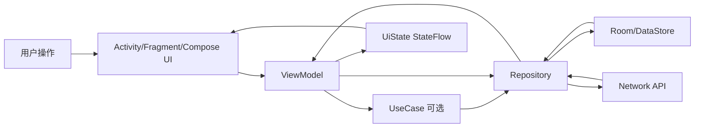
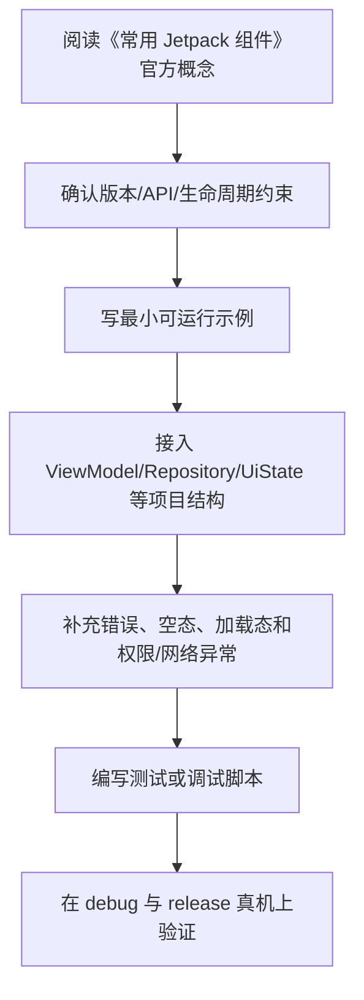

# 10. 常用 Jetpack 组件

<!-- lecture-notes:integrated-v2 -->

## 讲义导读：把 Android 放进应用工程主线

这一章讲的是 **10. 常用 Jetpack 组件**。Android 学习最怕碎片化：今天学一个控件，明天抄一段协程，后天改一个 Gradle 配置，但不知道它们怎样组成一款稳定应用。更好的读法是把每章都放进同一条主线：生命周期、状态、数据流、线程、权限、性能、测试和发布。

### 一句话先懂

Jetpack 组件不是 API 大礼包，而是一组帮你处理生命周期、导航、持久化、后台任务和依赖注入的基础设施。

### 通俗类比

Jetpack 像城市公共设施：Navigation 管路线，Room 管仓库，WorkManager 管定时任务，Hilt 管依赖分发，Paging 管长列表加载。

类比只是帮助建立直觉，不能替代准确概念。真正写代码时，要回到 Android 的平台规则：哪个组件拥有状态，代码在哪个生命周期内运行，是否在主线程，数据是否能恢复，权限是否足够，release 包是否还正常。

### 本章学习主线

1. **先看平台约束**：这个知识点受哪些 Android 版本、生命周期、权限、线程或构建规则影响？
2. **再看职责边界**：它应该放在 UI、ViewModel、UseCase、Repository、DataSource、Gradle 还是 Manifest？
3. **然后看状态流动**：用户事件如何进入系统，状态如何变化，UI 如何订阅，错误如何展示？
4. **接着看异常场景**：旋转屏幕、切后台、进程被杀、网络失败、权限拒绝、release 混淆后会怎样？
5. **最后看验证方式**：用单元测试、仪器测试、Compose UI Test、Logcat、Profiler、release 构建或真机验证证明它可靠。

### 概念怎么学才不容易忘

遇到一个 Android API，不要只记“怎么调用”。建议按“使用场景 -> 生命周期 -> 线程要求 -> 状态归属 -> 错误表现 -> 测试方法”六步理解。比如学 Flow，要问谁发射、谁收集、什么时候取消；学 Compose，要问状态在哪里、什么时候重组、副作用会不会重复；学权限，要问用户拒绝、永久拒绝和系统撤销后怎么办。

### 最小实践任务

给一个小应用加入 Navigation、Room、Hilt 和 WorkManager 中至少两个组件，并说明它们各自解决的问题。

实践时要保留失败记录。Android 的很多能力只有在异常场景下才真正显形，例如旋转屏幕后状态丢失、后台恢复后重复请求、release 包混淆后崩溃、权限拒绝后流程卡死。把这些失败样本记录下来，比只保存成功代码更有价值。

### 读完本章应该能产出

能说明常见 Jetpack 组件适用场景；能避免把组件当成万能答案；能知道组件之间如何配合架构分层。

> 本节是全篇讲义化改写的阅读入口，后续正文中的定义、步骤、示例和参考资料都应围绕这条学习主线来理解。

## Jetpack 是什么

Jetpack 是 Android 官方提供的一组库，帮助开发者处理生命周期、导航、数据存储、后台任务、分页、UI、测试等问题。

常用组件：

- ViewModel。
- Lifecycle。
- Navigation。
- Room。
- DataStore。
- WorkManager。
- Paging。
- Hilt。
- Compose。

## ViewModel

ViewModel 保存 UI 状态，并在配置变化后保留。

```kotlin
class HomeViewModel : ViewModel() {
    private val _state = MutableStateFlow(HomeUiState())
    val state = _state.asStateFlow()
}
```

ViewModel 不应持有 Activity、Fragment 或 View 引用。

## Lifecycle

Lifecycle 让组件感知生命周期。

常用：

- `lifecycleScope`
- `repeatOnLifecycle`
- `collectAsStateWithLifecycle`

生命周期感知能避免界面不可见时继续无意义收集数据。

## Navigation

Navigation 管理页面跳转和返回栈。

Compose 示例：

```kotlin
NavHost(navController, startDestination = "home") {
    composable("home") { HomeScreen() }
    composable("detail/{id}") { DetailScreen() }
}
```

建议：

- 路由集中定义。
- 参数类型清晰。
- 不在深层组件直接持有 NavController，优先传递回调。

## Hilt

Hilt 是 Android 官方推荐的依赖注入库之一。

```kotlin
@HiltAndroidApp
class DemoApp : Application()
```

ViewModel 注入：

```kotlin
@HiltViewModel
class UserViewModel @Inject constructor(
    private val repository: UserRepository
) : ViewModel()
```

Module：

```kotlin
@Module
@InstallIn(SingletonComponent::class)
abstract class RepositoryModule {
    @Binds
    abstract fun bindUserRepository(
        impl: UserRepositoryImpl
    ): UserRepository
}
```

## WorkManager

WorkManager 用于可延期、可靠执行的后台任务。

适合：

- 后台同步。
- 上传日志。
- 定期清理。
- 网络恢复后执行任务。

示例：

```kotlin
class SyncWorker(
    context: Context,
    params: WorkerParameters
) : CoroutineWorker(context, params) {
    override suspend fun doWork(): Result {
        return try {
            sync()
            Result.success()
        } catch (e: Exception) {
            Result.retry()
        }
    }
}
```

不适合：

- 需要立即执行的短任务。
- 长时间前台任务。
- 精确到秒的定时任务。

## Paging

Paging 用于分页加载大量数据。

常见组合：

- PagingSource。
- Pager。
- LazyPagingItems。
- RemoteMediator。

适合：

- 长列表。
- 搜索结果。
- Feed 流。
- 数据库和网络分页组合。

## Room

Room 提供 SQLite 抽象：

- Entity。
- Dao。
- Database。
- Migration。

Room 支持 Flow，适合响应式 UI。

## DataStore

DataStore 替代 SharedPreferences，提供异步、类型更安全的数据存储方式。

适合保存用户设置和小型偏好。

## 本章检查清单

- 是否知道 ViewModel 的作用？
- 是否能使用 Navigation 管理页面？
- 是否知道 Hilt 用于依赖注入？
- 是否知道 WorkManager 适合可靠后台任务？
- 是否知道 Paging 适合长列表分页？

## Jetpack 组件选型表

| 组件 | 解决什么问题 | 不适合什么 |
| --- | --- | --- |
| ViewModel | 保存 UI 状态、处理界面事件 | 存放 Activity、View、Context 引用 |
| Navigation | 页面跳转和返回栈 | 传输大对象或业务状态 |
| Room | 结构化本地数据库 | 小型偏好设置 |
| DataStore | 异步偏好和小配置 | 复杂查询和大列表 |
| WorkManager | 可延迟、可靠后台任务 | 需要立即执行的前台交互 |
| Paging | 大列表分页加载 | 小列表或一次性加载数据 |
| Hilt | 依赖注入和生命周期绑定 | 替代架构设计 |

## ViewModel 实践边界

ViewModel 应该：

- 暴露不可变 `StateFlow`。
- 接收 UI 事件。
- 调用 UseCase 或 Repository。
- 管理加载、错误和一次性事件。

ViewModel 不应该：

- 持有 Activity、Fragment、View。
- 直接操作 Navigation Controller。
- 直接显示 Toast。
- 直接依赖 Retrofit、DAO，除非项目非常小且有意识接受耦合。

## WorkManager 使用场景

适合：

- 日志上传。
- 离线数据同步。
- 定期清理缓存。
- 网络可用后重试任务。
- 需要进程重启后仍可靠执行的任务。

不适合：

- 精确定时任务。
- 音乐播放、导航定位这类持续前台任务。
- 用户点击后必须立即完成的同步操作。

示例：

```kotlin
class SyncWorker(
    context: Context,
    params: WorkerParameters,
    private val syncRepository: SyncRepository
) : CoroutineWorker(context, params) {
    override suspend fun doWork(): Result {
        return syncRepository.sync()
            .fold(
                onSuccess = { Result.success() },
                onFailure = { Result.retry() }
            )
    }
}
```

## Paging 实践要点

Paging 适合数据量大、需要分批加载的场景。常见组合：

```text
Pager -> PagingData -> ViewModel cachedIn -> LazyPagingItems
```

如果需要数据库和网络组合，使用 `RemoteMediator`：

```text
UI reads Room paging source
RemoteMediator fetches network pages
Network results are written into Room
Room invalidates and UI refreshes
```

不要为了十几条数据引入 Paging，它会增加状态和错误处理复杂度。

## Hilt / DI 的价值

依赖注入不是为了“高级”，而是为了：

- 统一对象创建。
- 管理生命周期。
- 隔离接口和实现。
- 方便测试替换 fake/mock。
- 避免到处手写单例。

常见作用域：

| 作用域 | 生命周期 |
| --- | --- |
| `SingletonComponent` | 应用进程 |
| `ActivityRetainedComponent` | Activity 配置变更期间保留 |
| `ViewModelComponent` | ViewModel |
| `ActivityComponent` | Activity |

作用域过大容易持有过久，作用域过小会导致重复创建。按真实生命周期选择。

---

## 万字精讲扩展（2026-06-16 更新）
> Last researched: 2026-06-16。本文补充内容以现代 Android 官方推荐实践为主；涉及 Android Studio、AGP、Kotlin、Compose、Jetpack、Play 政策和权限模型的内容，应在实际项目中继续核对最新官方文档。

### 本章在 Android 学习路线中的位置

《常用 Jetpack 组件》是 Android 能力闭环中的一个环节。Android 开发不是只会写页面，也不是只会接接口，而是要同时处理生命周期、状态、数据、线程、权限、性能、测试和发布。学习本章时，建议把每个 API 都放到一个真实屏幕或真实功能里验证：用户怎样进入页面，状态从哪里来，数据怎样刷新，异常怎样展示，旋转和后台后是否恢复，release 包是否仍然正常。

本章学习完成后，至少应达到三个标准。第一，能说清相关组件的职责边界和生命周期边界。第二，能写出一个最小可运行例子，并知道它在完整项目中应该放在哪一层。第三，能设计一个失败场景验证自己的写法是否稳健。Android 的很多能力不是“写出来”，而是“在复杂状态下仍然正确”。

### Jetpack 组件类笔记的精讲重点

Jetpack 是一组解决常见 Android 问题的库，不是必须全部使用的清单。ViewModel 解决状态持有，Lifecycle 解决生命周期感知，Navigation 解决页面跳转和返回栈，Hilt 解决依赖注入，Room 解决 SQLite 抽象，DataStore 解决偏好存储，WorkManager 解决可延迟且可靠的后台任务，Paging 解决分页加载。选组件时应先明确问题，再选库。

组件之间要按边界组合。ViewModel 不直接创建 Retrofit 和 Room；Hilt 提供 Repository 和 UseCase；WorkManager 适合后台同步但不适合精确实时任务；Paging 通常配合 Room/RemoteMediator；Navigation 不应该承担业务判断。每个组件都要学生命周期、线程、测试和失败场景。

### Android 学习的主线：生命周期、状态、数据流和边界

Android 学习最容易碎片化：今天学 Activity，明天学 Compose，后天学协程和 Room，但不知道这些东西怎样组合成一个稳定应用。更有效的主线是围绕四个问题建立框架。第一，组件什么时候创建、可见、可交互、暂停、销毁，这对应 Activity、Fragment、ViewModel、Lifecycle 和进程死亡。第二，状态放在哪里、谁拥有状态、UI 如何订阅状态、事件如何上行，这对应 MVVM、UI State、Compose state、StateFlow 和单向数据流。第三，数据从哪里来、如何缓存、如何离线、如何同步、错误如何表达，这对应 Repository、Room、DataStore、网络层和离线优先。第四，边界在哪里，包括线程边界、生命周期边界、模块边界、安全边界、测试边界和发布边界。

官方 Android 架构指南把 UI layer、可选 domain layer 和 data layer 作为推荐理解方式。UI 层负责展示应用数据并处理用户交互；数据层通过 repository 暴露应用数据，并组合本地、网络等数据源；domain 层不是每个应用必须有，主要用于复用复杂业务逻辑。学习时不要把“Clean Architecture 图”背成固定目录，而要理解依赖方向：UI 依赖业务抽象，业务不应该反向依赖具体 UI；数据实现可以被替换，调用方不应该到处知道 Retrofit、Room 或 DataStore 的细节。

### 一个现代 Android 应用的数据与状态闭环



Figure: Android 单向数据流和分层架构，综合 Android 官方 App Architecture、Data layer、Compose state 和 lifecycle-aware coroutines 文档整理。

这个闭环说明：UI 不应该直接拼网络请求和数据库查询；ViewModel 不应该持有 Activity 引用；Repository 不应该返回与界面强绑定的 View 对象；Composable 不应该在重组过程中直接执行不可控副作用；生命周期相关收集应该使用 lifecycle-aware API；本地缓存和远程同步应由数据层统一协调。只要这个闭环清楚，很多 API 的选择就会自然起来。

### 学 Android 要建立版本和政策意识

Android 是一个快速演进的平台。API Level、Android Gradle Plugin、Kotlin、Compose Compiler、Jetpack 库、Play 政策、权限模型、后台限制和隐私要求都会变化。因此笔记里不应只写“某 API 怎么用”，还要写“适用版本、替代方案、官方推荐状态、迁移风险”。例如运行时权限、通知权限、前台服务、后台定位、存储访问、exported 组件、明文网络、签名和 targetSdk 都和平台版本或政策强相关。做项目时必须查最新官方文档，而不是只依赖旧博客。

### 最小实战闭环

建议每个阶段都围绕一个小应用反复迭代，例如待办清单、记账、阅读列表、天气、RSS、课程表或离线笔记。第一版只做单 Activity + Compose UI；第二版加入 ViewModel 和 UiState；第三版加入 Room 或 DataStore；第四版加入网络层和 Repository；第五版加入 WorkManager 同步；第六版加入测试、性能分析、R8、签名和发布检查。这样每个知识点都会在同一个项目里发生关系，而不是停留在零散 demo。

### 核心知识点逐条精讲

#### 1. ViewModel 和 Lifecycle

在《常用 Jetpack 组件》里，`ViewModel 和 Lifecycle` 需要从“平台约束、代码写法、生命周期、测试和线上风险”五个角度理解。Android 不是普通 JVM 程序，它运行在移动设备、受系统生命周期和权限模型约束，随时可能经历旋转、后台、进程回收、权限撤销、网络变化和系统版本差异。学习任何 API 时都要问：它在哪个生命周期内有效，是否需要主线程，是否会泄漏 Context，是否能被测试，失败后用户看到什么。

实践中建议把 `ViewModel 和 Lifecycle` 写成可执行规则。例如“在 ViewModel 暴露不可变 UiState，UI 只收集状态并上报事件”，“Repository 负责组合本地和远程数据源，UI 不直接调用 DAO 或 Retrofit”，“Fragment 只在 viewLifecycleOwner 范围内访问 View”，“Compose 副作用必须放进受控 Effect API”，“release 包必须开启并验证 R8 相关路径”。这些规则比单纯记住 API 名称更能防止真实项目出错。

判断 `ViewModel 和 Lifecycle` 是否掌握，可以用三个问题：能否写出最小代码；能否说清错误使用会导致什么现象；能否设计测试或调试方法证明它工作正常。比如只会写权限申请代码还不够，还要知道用户拒绝、永久拒绝、系统自动撤销权限、targetSdk 变化时怎样处理。Android 工程能力来自这些边界判断，而不是来自 API 列表背诵。

#### 2. Navigation

在《常用 Jetpack 组件》里，`Navigation` 需要从“平台约束、代码写法、生命周期、测试和线上风险”五个角度理解。Android 不是普通 JVM 程序，它运行在移动设备、受系统生命周期和权限模型约束，随时可能经历旋转、后台、进程回收、权限撤销、网络变化和系统版本差异。学习任何 API 时都要问：它在哪个生命周期内有效，是否需要主线程，是否会泄漏 Context，是否能被测试，失败后用户看到什么。

实践中建议把 `Navigation` 写成可执行规则。例如“在 ViewModel 暴露不可变 UiState，UI 只收集状态并上报事件”，“Repository 负责组合本地和远程数据源，UI 不直接调用 DAO 或 Retrofit”，“Fragment 只在 viewLifecycleOwner 范围内访问 View”，“Compose 副作用必须放进受控 Effect API”，“release 包必须开启并验证 R8 相关路径”。这些规则比单纯记住 API 名称更能防止真实项目出错。

判断 `Navigation` 是否掌握，可以用三个问题：能否写出最小代码；能否说清错误使用会导致什么现象；能否设计测试或调试方法证明它工作正常。比如只会写权限申请代码还不够，还要知道用户拒绝、永久拒绝、系统自动撤销权限、targetSdk 变化时怎样处理。Android 工程能力来自这些边界判断，而不是来自 API 列表背诵。

#### 3. Hilt

在《常用 Jetpack 组件》里，`Hilt` 需要从“平台约束、代码写法、生命周期、测试和线上风险”五个角度理解。Android 不是普通 JVM 程序，它运行在移动设备、受系统生命周期和权限模型约束，随时可能经历旋转、后台、进程回收、权限撤销、网络变化和系统版本差异。学习任何 API 时都要问：它在哪个生命周期内有效，是否需要主线程，是否会泄漏 Context，是否能被测试，失败后用户看到什么。

实践中建议把 `Hilt` 写成可执行规则。例如“在 ViewModel 暴露不可变 UiState，UI 只收集状态并上报事件”，“Repository 负责组合本地和远程数据源，UI 不直接调用 DAO 或 Retrofit”，“Fragment 只在 viewLifecycleOwner 范围内访问 View”，“Compose 副作用必须放进受控 Effect API”，“release 包必须开启并验证 R8 相关路径”。这些规则比单纯记住 API 名称更能防止真实项目出错。

判断 `Hilt` 是否掌握，可以用三个问题：能否写出最小代码；能否说清错误使用会导致什么现象；能否设计测试或调试方法证明它工作正常。比如只会写权限申请代码还不够，还要知道用户拒绝、永久拒绝、系统自动撤销权限、targetSdk 变化时怎样处理。Android 工程能力来自这些边界判断，而不是来自 API 列表背诵。

#### 4. WorkManager

在《常用 Jetpack 组件》里，`WorkManager` 需要从“平台约束、代码写法、生命周期、测试和线上风险”五个角度理解。Android 不是普通 JVM 程序，它运行在移动设备、受系统生命周期和权限模型约束，随时可能经历旋转、后台、进程回收、权限撤销、网络变化和系统版本差异。学习任何 API 时都要问：它在哪个生命周期内有效，是否需要主线程，是否会泄漏 Context，是否能被测试，失败后用户看到什么。

实践中建议把 `WorkManager` 写成可执行规则。例如“在 ViewModel 暴露不可变 UiState，UI 只收集状态并上报事件”，“Repository 负责组合本地和远程数据源，UI 不直接调用 DAO 或 Retrofit”，“Fragment 只在 viewLifecycleOwner 范围内访问 View”，“Compose 副作用必须放进受控 Effect API”，“release 包必须开启并验证 R8 相关路径”。这些规则比单纯记住 API 名称更能防止真实项目出错。

判断 `WorkManager` 是否掌握，可以用三个问题：能否写出最小代码；能否说清错误使用会导致什么现象；能否设计测试或调试方法证明它工作正常。比如只会写权限申请代码还不够，还要知道用户拒绝、永久拒绝、系统自动撤销权限、targetSdk 变化时怎样处理。Android 工程能力来自这些边界判断，而不是来自 API 列表背诵。

#### 5. Paging、Room、DataStore

在《常用 Jetpack 组件》里，`Paging、Room、DataStore` 需要从“平台约束、代码写法、生命周期、测试和线上风险”五个角度理解。Android 不是普通 JVM 程序，它运行在移动设备、受系统生命周期和权限模型约束，随时可能经历旋转、后台、进程回收、权限撤销、网络变化和系统版本差异。学习任何 API 时都要问：它在哪个生命周期内有效，是否需要主线程，是否会泄漏 Context，是否能被测试，失败后用户看到什么。

实践中建议把 `Paging、Room、DataStore` 写成可执行规则。例如“在 ViewModel 暴露不可变 UiState，UI 只收集状态并上报事件”，“Repository 负责组合本地和远程数据源，UI 不直接调用 DAO 或 Retrofit”，“Fragment 只在 viewLifecycleOwner 范围内访问 View”，“Compose 副作用必须放进受控 Effect API”，“release 包必须开启并验证 R8 相关路径”。这些规则比单纯记住 API 名称更能防止真实项目出错。

判断 `Paging、Room、DataStore` 是否掌握，可以用三个问题：能否写出最小代码；能否说清错误使用会导致什么现象；能否设计测试或调试方法证明它工作正常。比如只会写权限申请代码还不够，还要知道用户拒绝、永久拒绝、系统自动撤销权限、targetSdk 变化时怎样处理。Android 工程能力来自这些边界判断，而不是来自 API 列表背诵。


### 场景化学习与排错表

| 主题 | 推荐动作 | 常见风险 | 验证方式 |
| :--- | :--- | :--- | :--- |
| ViewModel 和 Lifecycle | 先查官方文档和版本要求，再写最小 demo，最后放入项目闭环验证 | 生命周期错位、Context 泄漏、线程错误、版本差异、只测 debug | 单元测试、仪器测试、Logcat、Profiler、release 构建和真机验证 |
| Navigation | 先查官方文档和版本要求，再写最小 demo，最后放入项目闭环验证 | 生命周期错位、Context 泄漏、线程错误、版本差异、只测 debug | 单元测试、仪器测试、Logcat、Profiler、release 构建和真机验证 |
| Hilt | 先查官方文档和版本要求，再写最小 demo，最后放入项目闭环验证 | 生命周期错位、Context 泄漏、线程错误、版本差异、只测 debug | 单元测试、仪器测试、Logcat、Profiler、release 构建和真机验证 |
| WorkManager | 先查官方文档和版本要求，再写最小 demo，最后放入项目闭环验证 | 生命周期错位、Context 泄漏、线程错误、版本差异、只测 debug | 单元测试、仪器测试、Logcat、Profiler、release 构建和真机验证 |
| Paging、Room、DataStore | 先查官方文档和版本要求，再写最小 demo，最后放入项目闭环验证 | 生命周期错位、Context 泄漏、线程错误、版本差异、只测 debug | 单元测试、仪器测试、Logcat、Profiler、release 构建和真机验证 |

表格中的推荐动作强调“官方依据 + 最小验证 + 项目闭环”。Android 生态变化快，旧博客里的写法可能已经被官方替代，或者只适用于某个 API Level、某个 Jetpack 版本。遇到冲突时，优先查 Android Developers、Kotlin、Gradle 和库的 release notes，再参考社区经验。

### 本章建议工作流



Figure: 《常用 Jetpack 组件》学习工作流，综合 Android 官方架构、Compose、Lifecycle、Coroutines、Data layer、Performance 和 Release 文档整理。

这个工作流避免两个极端：只看文档不落地，或者只复制 demo 不理解边界。Android 很多 bug 只在生命周期切换、后台恢复、低内存、release 混淆、慢网络、权限拒绝或特定系统版本中出现，所以最小 demo 跑通以后，还要放回完整应用场景验证。

### 常见误区和纠正方法

- 误区：Activity/Fragment 里堆所有逻辑。纠正：UI 组件负责展示和事件，状态放 ViewModel，数据访问放 Repository，复杂复用逻辑再考虑 UseCase。
- 误区：只测 debug，不测 release。纠正：R8、资源压缩、签名、网络安全配置和 build variants 可能让 release 行为不同，发布前必须验证 release 包。
- 误区：忽略生命周期。纠正：Flow 收集、回调注册、binding、协程、导航和副作用都要绑定正确 lifecycle。
- 误区：把 Compose 当成简单 XML 替代。纠正：Compose 的核心是状态驱动 UI、可组合函数、重组、副作用控制和稳定性。
- 误区：权限申请只看成功路径。纠正：必须处理拒绝、永久拒绝、功能降级、隐私说明、targetSdk 变化和系统自动撤销。
- 误区：看到性能问题就先优化代码。纠正：先用 Profiler、Baseline Profile、启动指标、帧时间、内存快照和日志定位瓶颈。

### 与相邻章节的关系

《常用 Jetpack 组件》应和其他章节联动阅读。项目结构决定依赖和构建变体，Kotlin 决定状态和异步表达方式，生命周期决定 UI 和协程边界，Compose 决定状态和副作用组织，架构决定依赖方向，数据层决定离线和同步能力，测试和发布决定应用能否可靠交付。任何一个主题脱离这些关系，都容易变成 demo 级知识。

### 实操训练和复盘模板

1. 围绕 `ViewModel 和 Lifecycle` 做一个小任务：写最小实现、制造一个失败场景、记录修复方法。
2. 围绕 `Navigation` 做一个小任务：写最小实现、制造一个失败场景、记录修复方法。
3. 围绕 `Hilt` 做一个小任务：写最小实现、制造一个失败场景、记录修复方法。
4. 围绕 `WorkManager` 做一个小任务：写最小实现、制造一个失败场景、记录修复方法。
5. 围绕 `Paging、Room、DataStore` 做一个小任务：写最小实现、制造一个失败场景、记录修复方法。

建议每次练习都按下面格式记录：

```text
练习名称：
本章主题：常用 Jetpack 组件
目标 API / 组件：
版本信息：Android Studio、AGP、Kotlin、compileSdk、minSdk、targetSdk、相关 Jetpack 版本
最小实现：
生命周期和线程边界：
失败场景：旋转、后台、进程死亡、断网、权限拒绝、release 混淆等
调试证据：Logcat、断点、Profiler、截图、测试结果
最终规则：以后项目中如何写，什么情况下不能这样写
```

这个模板能把“会用 API”推进到“知道边界”。很多 Android 问题第一次看像偶发 bug，复盘后会发现是生命周期、状态持有、线程、权限、缓存或构建变体没有设计清楚。

## 参考资料与延伸阅读

- [Official / Android] Guide to app architecture: https://developer.android.com/topic/architecture
- [Official / Android] UI layer: https://developer.android.com/topic/architecture/ui-layer
- [Official / Android] Data layer: https://developer.android.com/topic/architecture/data-layer
- [Official / Android] Domain layer: https://developer.android.com/topic/architecture/domain-layer
- [Official / Android] Build an offline-first app: https://developer.android.com/topic/architecture/data-layer/offline-first
- [Official / Android] Configure your build: https://developer.android.com/build
- [Official / Android] Add build dependencies: https://developer.android.com/build/dependencies
- [Official / Android] Fragment lifecycle: https://developer.android.com/guide/fragments/lifecycle
- [Official / Android] Saved State module for ViewModel: https://developer.android.com/topic/libraries/architecture/viewmodel/viewmodel-savedstate
- [Official / Android] State and Jetpack Compose: https://developer.android.com/develop/ui/compose/state
- [Official / Android] Side-effects in Compose: https://developer.android.com/develop/ui/compose/side-effects
- [Official / Android] Jetpack Compose performance: https://developer.android.com/develop/ui/compose/performance
- [Official / Android] Stability in Compose: https://developer.android.com/develop/ui/compose/performance/stability
- [Official / Android] Kotlin coroutines on Android: https://developer.android.com/kotlin/coroutines
- [Official / Android] Kotlin flows on Android: https://developer.android.com/kotlin/flow
- [Official / Android] Use Kotlin coroutines with lifecycle-aware components: https://developer.android.com/topic/libraries/architecture/coroutines
- [Official / Android] Dependency injection with Hilt: https://developer.android.com/training/dependency-injection/hilt-android
- [Official / Android] Network security configuration: https://developer.android.com/privacy-and-security/security-config
- [Official / Android] Enable app optimization with R8: https://developer.android.com/topic/performance/app-optimization/enable-app-optimization
- [Official / Android] Baseline Profiles overview: https://developer.android.com/topic/performance/baselineprofiles/overview
- [Official / Google Codelab] Improve app performance with Baseline Profiles: https://codelabs.developers.google.com/android-baseline-profiles-improve
- [Official / Kotlin] Kotlin documentation: https://kotlinlang.org/docs/home.html
- [Official / Kotlin] Sealed classes and interfaces: https://kotlinlang.org/docs/sealed-classes.html
- [Official / Kotlin] Configure a Gradle project: https://kotlinlang.org/docs/gradle-configure-project.html
- [Official / Gradle] Gradle Kotlin DSL Primer: https://docs.gradle.org/current/userguide/kotlin_dsl.html
- [Security / OWASP] Android Network Security Configuration: https://mas.owasp.org/MASTG/knowledge/android/MASVS-NETWORK/MASTG-KNOW-0014/
- [Blog / Android Developers] Rebuilding our guide to app architecture: https://android-developers.googleblog.com/2021/12/rebuilding-our-guide-to-app-architecture.html
- [Blog / Android Developers] Improving Performance with Baseline Profiles: https://medium.com/androiddevelopers/improving-performance-with-baseline-profiles-fdd0db0d8cc6
- [Community / CSDN] Android 学习笔记检索入口: https://so.csdn.net/so/search?q=Android%20%E5%AD%A6%E4%B9%A0%E7%AC%94%E8%AE%B0%20Jetpack%20Compose
- [Community / 博客园] Android 架构与 Jetpack 笔记检索入口: https://zzk.cnblogs.com/s/blogpost?Keywords=Android%20Jetpack%20MVVM%20Compose
- [Community / 掘金] Android Compose / 协程 / 架构实践检索入口: https://juejin.cn/search?query=Android%20Compose%20%E5%8D%8F%E7%A8%8B%20%E6%9E%B6%E6%9E%84&type=0

<!-- AUTO_EXPANDED_TO_REFERENCE_LENGTH_2026_06_23 -->

## 万字精讲扩展：常用 Jetpack 组件

> 本节为按参考笔记篇幅补充的系统化扩展内容，目标是把原有笔记从“知识点记录”扩展为“概念、原理、流程、工程实践、常见误区和复盘清单”完整学习材料。

### 精讲扩展 1：常用 Jetpack 组件 的生命周期、状态管理 与工程化理解

学习 $topic 时，不能只把它当成一个孤立知识点来背诵，而要把它放到 $category 的完整问题链条里理解。一个知识点通常同时包含概念定义、适用边界、输入输出、运行过程、常见异常和工程取舍。真正掌握它，意味着看到一个具体场景时，能够判断它解决什么问题、依赖哪些前提、失败时会出现什么现象，以及应该用什么手段验证自己的判断。

从 $a 的角度看，最重要的是先建立清晰的对象模型。也就是明确系统里有哪些参与者、它们之间如何连接、数据或控制信号如何流动、哪些环节是同步的、哪些环节是异步的、哪些状态是临时状态、哪些状态需要长期保存。很多初学问题并不是公式不会、API 不熟，而是对象边界不清：把配置当成状态，把结果当成过程，把局部现象当成全局规律。写笔记时建议始终追问：这个概念的主体是谁，输入是什么，输出是什么，中间约束是什么，错误会在哪里暴露。

从 $b 的角度看，流程比单点知识更关键。一个成熟方案通常不是单个技巧，而是一组步骤：先确定目标，再拆分约束，然后选择工具，最后通过测试和复盘确认效果。比如在实际项目中，不能只问“怎么实现”，还要问“为什么要这样实现”“有没有更简单的替代方案”“边界条件是什么”“数据量、并发量、实时性、可靠性变化后还能不能工作”。这种流程意识能够避免把学习停留在教程层面，也能让后续排错有明确路线。

$topic 的 $c 往往决定它在真实项目中的稳定性。理论上可行的方案，到了工程环境中会受到数据质量、硬件条件、依赖版本、网络环境、团队协作、部署方式和维护成本影响。写代码或做设计时，应该把正常路径和异常路径同时考虑：正常情况下如何运行，输入为空怎么办，超时怎么办，重复执行怎么办，部分成功怎么办，版本升级后兼容性怎么办，日志和指标如何证明系统确实按预期工作。

进一步看 $d，它通常对应性能、可靠性或可维护性的核心矛盾。很多技术选择并没有绝对正确答案，只有是否适合当前约束。例如追求极致性能可能牺牲可读性，追求高度抽象可能增加调试成本，追求快速交付可能留下技术债，追求完全通用可能让简单场景变复杂。高质量笔记应该把这些取舍写出来，而不是只给一个“推荐方案”。推荐方案背后的条件越清楚，迁移到新场景时越不容易误用。

最后从 $e 的角度进行复盘，可以把知识从“看懂”推进到“会用”。建议为 $topic 建立三个层次的检查：第一层是概念检查，确认术语、流程和边界没有混淆；第二层是实践检查，确认能够独立完成一个最小案例；第三层是工程检查，确认这个案例在异常、规模、性能和维护方面经得起追问。每次学习完一个章节，都可以用这三层检查反向补齐笔记。

#### 典型场景拆解

在真实场景中，$topic 通常会经历“需求出现、方案选择、实现落地、问题暴露、持续优化”几个阶段。需求出现时，要先判断这个需求属于基础能力、性能优化、体验改进、可靠性建设还是长期架构演进。不同类型的需求对方案的评价标准不同：基础能力看正确性，性能优化看指标，体验改进看路径是否顺滑，可靠性建设看故障时能否降级和恢复，架构演进看未来变化是否容易吸收。

方案选择阶段，最容易犯的错误是直接套用熟悉工具。更稳妥的方式是列出约束：数据规模、时延要求、资源预算、团队熟悉度、运维能力、安全要求、可测试性和长期维护成本。只有把约束列清楚，才能解释为什么选择当前方案。否则方案看似高级，实际可能只是增加了复杂度。

实现落地阶段，要把 $a 和 $b 拆成可验证的小步骤。每一步都应该有明确的输入、输出和检查方式。对学习笔记而言，这意味着不能只有大段概念，还应该补充流程图式的文字描述、伪代码、命令示例、参数解释、错误现象和排查路径。这样以后复习时，笔记不仅能帮助理解，也能直接指导实践。

问题暴露阶段，要优先区分“理解错误、实现错误、环境错误、数据错误、依赖错误、边界条件错误”。很多复杂问题之所以难排，是因为一开始就把问题归因到错误层级。例如把配置问题当成算法问题，把权限问题当成代码问题，把数据分布变化当成模型失效，把硬件噪声当成软件逻辑错误。好的排查顺序应该从可观测事实开始，而不是从猜测开始。

持续优化阶段，不应只追求把当前问题压下去，还要沉淀成规则。比如记录触发条件、影响范围、定位方法、最终修复、预防措施和可监控指标。这样下一次出现类似问题时，团队可以复用经验，而不是重新从零排查。

#### 常见误区与纠偏

第一个误区是只记结论，不记前提。$topic 中很多结论都是有条件的：适用于小规模，不一定适用于大规模；适用于离线处理，不一定适用于实时系统；适用于单机环境，不一定适用于分布式环境；适用于教学案例，不一定适用于生产项目。纠偏方法是在每个重要结论后面补一句“适用条件”和“不适用情况”。

第二个误区是只关注工具，不关注模型。工具会变化，模型更稳定。无论工具名称如何变化，底层仍然要解决输入建模、状态管理、资源调度、错误恢复、性能约束和质量验证这些问题。学习 $topic 时，应该把工具用法和底层模型分开记录：工具命令解决“怎么做”，底层模型解释“为什么这样做”。

第三个误区是没有验证意识。很多笔记写得很完整，但没有说明如何确认自己做对了。对于 $category 相关主题，验证至少应包含最小样例、边界样例、异常样例和性能样例。最小样例证明流程跑通，边界样例证明理解完整，异常样例证明系统可恢复，性能样例证明方案在目标规模下仍然可用。

第四个误区是忽略可维护性。短期学习时，能跑通就容易产生掌握的错觉；长期使用时，命名、分层、注释、测试、日志、版本管理和文档才会决定知识能否转化为稳定能力。扩充 $topic 笔记时，应把“如何写得清楚、如何排查、如何交接、如何复盘”也纳入内容。

#### 学习与实践建议

建议围绕 $topic 做一个小型闭环练习：先用自己的话解释概念，再画出流程，再实现一个最小案例，然后主动制造一个错误并排查，最后写下复盘。这个过程看起来比直接读资料慢，但能显著提高迁移能力。很多人学完后不会用，根本原因是缺少“从概念到问题再到验证”的闭环。

复习时可以使用四个问题：它解决什么问题；它依赖什么条件；它失败时有什么表现；它如何被验证。只要这四个问题能回答清楚，说明对 $topic 的理解已经从表层进入工程层。如果回答不清楚，就回到对应章节补充例子、边界和排错方法。
### 精讲扩展 2：常用 Jetpack 组件 的状态管理、单向数据流 与工程化理解

学习 $topic 时，不能只把它当成一个孤立知识点来背诵，而要把它放到 $category 的完整问题链条里理解。一个知识点通常同时包含概念定义、适用边界、输入输出、运行过程、常见异常和工程取舍。真正掌握它，意味着看到一个具体场景时，能够判断它解决什么问题、依赖哪些前提、失败时会出现什么现象，以及应该用什么手段验证自己的判断。

从 $a 的角度看，最重要的是先建立清晰的对象模型。也就是明确系统里有哪些参与者、它们之间如何连接、数据或控制信号如何流动、哪些环节是同步的、哪些环节是异步的、哪些状态是临时状态、哪些状态需要长期保存。很多初学问题并不是公式不会、API 不熟，而是对象边界不清：把配置当成状态，把结果当成过程，把局部现象当成全局规律。写笔记时建议始终追问：这个概念的主体是谁，输入是什么，输出是什么，中间约束是什么，错误会在哪里暴露。

从 $b 的角度看，流程比单点知识更关键。一个成熟方案通常不是单个技巧，而是一组步骤：先确定目标，再拆分约束，然后选择工具，最后通过测试和复盘确认效果。比如在实际项目中，不能只问“怎么实现”，还要问“为什么要这样实现”“有没有更简单的替代方案”“边界条件是什么”“数据量、并发量、实时性、可靠性变化后还能不能工作”。这种流程意识能够避免把学习停留在教程层面，也能让后续排错有明确路线。

$topic 的 $c 往往决定它在真实项目中的稳定性。理论上可行的方案，到了工程环境中会受到数据质量、硬件条件、依赖版本、网络环境、团队协作、部署方式和维护成本影响。写代码或做设计时，应该把正常路径和异常路径同时考虑：正常情况下如何运行，输入为空怎么办，超时怎么办，重复执行怎么办，部分成功怎么办，版本升级后兼容性怎么办，日志和指标如何证明系统确实按预期工作。

进一步看 $d，它通常对应性能、可靠性或可维护性的核心矛盾。很多技术选择并没有绝对正确答案，只有是否适合当前约束。例如追求极致性能可能牺牲可读性，追求高度抽象可能增加调试成本，追求快速交付可能留下技术债，追求完全通用可能让简单场景变复杂。高质量笔记应该把这些取舍写出来，而不是只给一个“推荐方案”。推荐方案背后的条件越清楚，迁移到新场景时越不容易误用。

最后从 $e 的角度进行复盘，可以把知识从“看懂”推进到“会用”。建议为 $topic 建立三个层次的检查：第一层是概念检查，确认术语、流程和边界没有混淆；第二层是实践检查，确认能够独立完成一个最小案例；第三层是工程检查，确认这个案例在异常、规模、性能和维护方面经得起追问。每次学习完一个章节，都可以用这三层检查反向补齐笔记。

#### 典型场景拆解

在真实场景中，$topic 通常会经历“需求出现、方案选择、实现落地、问题暴露、持续优化”几个阶段。需求出现时，要先判断这个需求属于基础能力、性能优化、体验改进、可靠性建设还是长期架构演进。不同类型的需求对方案的评价标准不同：基础能力看正确性，性能优化看指标，体验改进看路径是否顺滑，可靠性建设看故障时能否降级和恢复，架构演进看未来变化是否容易吸收。

方案选择阶段，最容易犯的错误是直接套用熟悉工具。更稳妥的方式是列出约束：数据规模、时延要求、资源预算、团队熟悉度、运维能力、安全要求、可测试性和长期维护成本。只有把约束列清楚，才能解释为什么选择当前方案。否则方案看似高级，实际可能只是增加了复杂度。

实现落地阶段，要把 $a 和 $b 拆成可验证的小步骤。每一步都应该有明确的输入、输出和检查方式。对学习笔记而言，这意味着不能只有大段概念，还应该补充流程图式的文字描述、伪代码、命令示例、参数解释、错误现象和排查路径。这样以后复习时，笔记不仅能帮助理解，也能直接指导实践。

问题暴露阶段，要优先区分“理解错误、实现错误、环境错误、数据错误、依赖错误、边界条件错误”。很多复杂问题之所以难排，是因为一开始就把问题归因到错误层级。例如把配置问题当成算法问题，把权限问题当成代码问题，把数据分布变化当成模型失效，把硬件噪声当成软件逻辑错误。好的排查顺序应该从可观测事实开始，而不是从猜测开始。

持续优化阶段，不应只追求把当前问题压下去，还要沉淀成规则。比如记录触发条件、影响范围、定位方法、最终修复、预防措施和可监控指标。这样下一次出现类似问题时，团队可以复用经验，而不是重新从零排查。

#### 常见误区与纠偏

第一个误区是只记结论，不记前提。$topic 中很多结论都是有条件的：适用于小规模，不一定适用于大规模；适用于离线处理，不一定适用于实时系统；适用于单机环境，不一定适用于分布式环境；适用于教学案例，不一定适用于生产项目。纠偏方法是在每个重要结论后面补一句“适用条件”和“不适用情况”。

第二个误区是只关注工具，不关注模型。工具会变化，模型更稳定。无论工具名称如何变化，底层仍然要解决输入建模、状态管理、资源调度、错误恢复、性能约束和质量验证这些问题。学习 $topic 时，应该把工具用法和底层模型分开记录：工具命令解决“怎么做”，底层模型解释“为什么这样做”。

第三个误区是没有验证意识。很多笔记写得很完整，但没有说明如何确认自己做对了。对于 $category 相关主题，验证至少应包含最小样例、边界样例、异常样例和性能样例。最小样例证明流程跑通，边界样例证明理解完整，异常样例证明系统可恢复，性能样例证明方案在目标规模下仍然可用。

第四个误区是忽略可维护性。短期学习时，能跑通就容易产生掌握的错觉；长期使用时，命名、分层、注释、测试、日志、版本管理和文档才会决定知识能否转化为稳定能力。扩充 $topic 笔记时，应把“如何写得清楚、如何排查、如何交接、如何复盘”也纳入内容。

#### 学习与实践建议

建议围绕 $topic 做一个小型闭环练习：先用自己的话解释概念，再画出流程，再实现一个最小案例，然后主动制造一个错误并排查，最后写下复盘。这个过程看起来比直接读资料慢，但能显著提高迁移能力。很多人学完后不会用，根本原因是缺少“从概念到问题再到验证”的闭环。

复习时可以使用四个问题：它解决什么问题；它依赖什么条件；它失败时有什么表现；它如何被验证。只要这四个问题能回答清楚，说明对 $topic 的理解已经从表层进入工程层。如果回答不清楚，就回到对应章节补充例子、边界和排错方法。
### 精讲扩展 3：常用 Jetpack 组件 的单向数据流、协程 Flow 与工程化理解

学习 $topic 时，不能只把它当成一个孤立知识点来背诵，而要把它放到 $category 的完整问题链条里理解。一个知识点通常同时包含概念定义、适用边界、输入输出、运行过程、常见异常和工程取舍。真正掌握它，意味着看到一个具体场景时，能够判断它解决什么问题、依赖哪些前提、失败时会出现什么现象，以及应该用什么手段验证自己的判断。

从 $a 的角度看，最重要的是先建立清晰的对象模型。也就是明确系统里有哪些参与者、它们之间如何连接、数据或控制信号如何流动、哪些环节是同步的、哪些环节是异步的、哪些状态是临时状态、哪些状态需要长期保存。很多初学问题并不是公式不会、API 不熟，而是对象边界不清：把配置当成状态，把结果当成过程，把局部现象当成全局规律。写笔记时建议始终追问：这个概念的主体是谁，输入是什么，输出是什么，中间约束是什么，错误会在哪里暴露。

从 $b 的角度看，流程比单点知识更关键。一个成熟方案通常不是单个技巧，而是一组步骤：先确定目标，再拆分约束，然后选择工具，最后通过测试和复盘确认效果。比如在实际项目中，不能只问“怎么实现”，还要问“为什么要这样实现”“有没有更简单的替代方案”“边界条件是什么”“数据量、并发量、实时性、可靠性变化后还能不能工作”。这种流程意识能够避免把学习停留在教程层面，也能让后续排错有明确路线。

$topic 的 $c 往往决定它在真实项目中的稳定性。理论上可行的方案，到了工程环境中会受到数据质量、硬件条件、依赖版本、网络环境、团队协作、部署方式和维护成本影响。写代码或做设计时，应该把正常路径和异常路径同时考虑：正常情况下如何运行，输入为空怎么办，超时怎么办，重复执行怎么办，部分成功怎么办，版本升级后兼容性怎么办，日志和指标如何证明系统确实按预期工作。

进一步看 $d，它通常对应性能、可靠性或可维护性的核心矛盾。很多技术选择并没有绝对正确答案，只有是否适合当前约束。例如追求极致性能可能牺牲可读性，追求高度抽象可能增加调试成本，追求快速交付可能留下技术债，追求完全通用可能让简单场景变复杂。高质量笔记应该把这些取舍写出来，而不是只给一个“推荐方案”。推荐方案背后的条件越清楚，迁移到新场景时越不容易误用。

最后从 $e 的角度进行复盘，可以把知识从“看懂”推进到“会用”。建议为 $topic 建立三个层次的检查：第一层是概念检查，确认术语、流程和边界没有混淆；第二层是实践检查，确认能够独立完成一个最小案例；第三层是工程检查，确认这个案例在异常、规模、性能和维护方面经得起追问。每次学习完一个章节，都可以用这三层检查反向补齐笔记。

#### 典型场景拆解

在真实场景中，$topic 通常会经历“需求出现、方案选择、实现落地、问题暴露、持续优化”几个阶段。需求出现时，要先判断这个需求属于基础能力、性能优化、体验改进、可靠性建设还是长期架构演进。不同类型的需求对方案的评价标准不同：基础能力看正确性，性能优化看指标，体验改进看路径是否顺滑，可靠性建设看故障时能否降级和恢复，架构演进看未来变化是否容易吸收。

方案选择阶段，最容易犯的错误是直接套用熟悉工具。更稳妥的方式是列出约束：数据规模、时延要求、资源预算、团队熟悉度、运维能力、安全要求、可测试性和长期维护成本。只有把约束列清楚，才能解释为什么选择当前方案。否则方案看似高级，实际可能只是增加了复杂度。

实现落地阶段，要把 $a 和 $b 拆成可验证的小步骤。每一步都应该有明确的输入、输出和检查方式。对学习笔记而言，这意味着不能只有大段概念，还应该补充流程图式的文字描述、伪代码、命令示例、参数解释、错误现象和排查路径。这样以后复习时，笔记不仅能帮助理解，也能直接指导实践。

问题暴露阶段，要优先区分“理解错误、实现错误、环境错误、数据错误、依赖错误、边界条件错误”。很多复杂问题之所以难排，是因为一开始就把问题归因到错误层级。例如把配置问题当成算法问题，把权限问题当成代码问题，把数据分布变化当成模型失效，把硬件噪声当成软件逻辑错误。好的排查顺序应该从可观测事实开始，而不是从猜测开始。

持续优化阶段，不应只追求把当前问题压下去，还要沉淀成规则。比如记录触发条件、影响范围、定位方法、最终修复、预防措施和可监控指标。这样下一次出现类似问题时，团队可以复用经验，而不是重新从零排查。

#### 常见误区与纠偏

第一个误区是只记结论，不记前提。$topic 中很多结论都是有条件的：适用于小规模，不一定适用于大规模；适用于离线处理，不一定适用于实时系统；适用于单机环境，不一定适用于分布式环境；适用于教学案例，不一定适用于生产项目。纠偏方法是在每个重要结论后面补一句“适用条件”和“不适用情况”。

第二个误区是只关注工具，不关注模型。工具会变化，模型更稳定。无论工具名称如何变化，底层仍然要解决输入建模、状态管理、资源调度、错误恢复、性能约束和质量验证这些问题。学习 $topic 时，应该把工具用法和底层模型分开记录：工具命令解决“怎么做”，底层模型解释“为什么这样做”。

第三个误区是没有验证意识。很多笔记写得很完整，但没有说明如何确认自己做对了。对于 $category 相关主题，验证至少应包含最小样例、边界样例、异常样例和性能样例。最小样例证明流程跑通，边界样例证明理解完整，异常样例证明系统可恢复，性能样例证明方案在目标规模下仍然可用。

第四个误区是忽略可维护性。短期学习时，能跑通就容易产生掌握的错觉；长期使用时，命名、分层、注释、测试、日志、版本管理和文档才会决定知识能否转化为稳定能力。扩充 $topic 笔记时，应把“如何写得清楚、如何排查、如何交接、如何复盘”也纳入内容。

#### 学习与实践建议

建议围绕 $topic 做一个小型闭环练习：先用自己的话解释概念，再画出流程，再实现一个最小案例，然后主动制造一个错误并排查，最后写下复盘。这个过程看起来比直接读资料慢，但能显著提高迁移能力。很多人学完后不会用，根本原因是缺少“从概念到问题再到验证”的闭环。

复习时可以使用四个问题：它解决什么问题；它依赖什么条件；它失败时有什么表现；它如何被验证。只要这四个问题能回答清楚，说明对 $topic 的理解已经从表层进入工程层。如果回答不清楚，就回到对应章节补充例子、边界和排错方法。
### 精讲扩展 4：常用 Jetpack 组件 的协程 Flow、架构分层 与工程化理解

学习 $topic 时，不能只把它当成一个孤立知识点来背诵，而要把它放到 $category 的完整问题链条里理解。一个知识点通常同时包含概念定义、适用边界、输入输出、运行过程、常见异常和工程取舍。真正掌握它，意味着看到一个具体场景时，能够判断它解决什么问题、依赖哪些前提、失败时会出现什么现象，以及应该用什么手段验证自己的判断。

从 $a 的角度看，最重要的是先建立清晰的对象模型。也就是明确系统里有哪些参与者、它们之间如何连接、数据或控制信号如何流动、哪些环节是同步的、哪些环节是异步的、哪些状态是临时状态、哪些状态需要长期保存。很多初学问题并不是公式不会、API 不熟，而是对象边界不清：把配置当成状态，把结果当成过程，把局部现象当成全局规律。写笔记时建议始终追问：这个概念的主体是谁，输入是什么，输出是什么，中间约束是什么，错误会在哪里暴露。

从 $b 的角度看，流程比单点知识更关键。一个成熟方案通常不是单个技巧，而是一组步骤：先确定目标，再拆分约束，然后选择工具，最后通过测试和复盘确认效果。比如在实际项目中，不能只问“怎么实现”，还要问“为什么要这样实现”“有没有更简单的替代方案”“边界条件是什么”“数据量、并发量、实时性、可靠性变化后还能不能工作”。这种流程意识能够避免把学习停留在教程层面，也能让后续排错有明确路线。

$topic 的 $c 往往决定它在真实项目中的稳定性。理论上可行的方案，到了工程环境中会受到数据质量、硬件条件、依赖版本、网络环境、团队协作、部署方式和维护成本影响。写代码或做设计时，应该把正常路径和异常路径同时考虑：正常情况下如何运行，输入为空怎么办，超时怎么办，重复执行怎么办，部分成功怎么办，版本升级后兼容性怎么办，日志和指标如何证明系统确实按预期工作。

进一步看 $d，它通常对应性能、可靠性或可维护性的核心矛盾。很多技术选择并没有绝对正确答案，只有是否适合当前约束。例如追求极致性能可能牺牲可读性，追求高度抽象可能增加调试成本，追求快速交付可能留下技术债，追求完全通用可能让简单场景变复杂。高质量笔记应该把这些取舍写出来，而不是只给一个“推荐方案”。推荐方案背后的条件越清楚，迁移到新场景时越不容易误用。

最后从 $e 的角度进行复盘，可以把知识从“看懂”推进到“会用”。建议为 $topic 建立三个层次的检查：第一层是概念检查，确认术语、流程和边界没有混淆；第二层是实践检查，确认能够独立完成一个最小案例；第三层是工程检查，确认这个案例在异常、规模、性能和维护方面经得起追问。每次学习完一个章节，都可以用这三层检查反向补齐笔记。

#### 典型场景拆解

在真实场景中，$topic 通常会经历“需求出现、方案选择、实现落地、问题暴露、持续优化”几个阶段。需求出现时，要先判断这个需求属于基础能力、性能优化、体验改进、可靠性建设还是长期架构演进。不同类型的需求对方案的评价标准不同：基础能力看正确性，性能优化看指标，体验改进看路径是否顺滑，可靠性建设看故障时能否降级和恢复，架构演进看未来变化是否容易吸收。

方案选择阶段，最容易犯的错误是直接套用熟悉工具。更稳妥的方式是列出约束：数据规模、时延要求、资源预算、团队熟悉度、运维能力、安全要求、可测试性和长期维护成本。只有把约束列清楚，才能解释为什么选择当前方案。否则方案看似高级，实际可能只是增加了复杂度。

实现落地阶段，要把 $a 和 $b 拆成可验证的小步骤。每一步都应该有明确的输入、输出和检查方式。对学习笔记而言，这意味着不能只有大段概念，还应该补充流程图式的文字描述、伪代码、命令示例、参数解释、错误现象和排查路径。这样以后复习时，笔记不仅能帮助理解，也能直接指导实践。

问题暴露阶段，要优先区分“理解错误、实现错误、环境错误、数据错误、依赖错误、边界条件错误”。很多复杂问题之所以难排，是因为一开始就把问题归因到错误层级。例如把配置问题当成算法问题，把权限问题当成代码问题，把数据分布变化当成模型失效，把硬件噪声当成软件逻辑错误。好的排查顺序应该从可观测事实开始，而不是从猜测开始。

持续优化阶段，不应只追求把当前问题压下去，还要沉淀成规则。比如记录触发条件、影响范围、定位方法、最终修复、预防措施和可监控指标。这样下一次出现类似问题时，团队可以复用经验，而不是重新从零排查。

#### 常见误区与纠偏

第一个误区是只记结论，不记前提。$topic 中很多结论都是有条件的：适用于小规模，不一定适用于大规模；适用于离线处理，不一定适用于实时系统；适用于单机环境，不一定适用于分布式环境；适用于教学案例，不一定适用于生产项目。纠偏方法是在每个重要结论后面补一句“适用条件”和“不适用情况”。

第二个误区是只关注工具，不关注模型。工具会变化，模型更稳定。无论工具名称如何变化，底层仍然要解决输入建模、状态管理、资源调度、错误恢复、性能约束和质量验证这些问题。学习 $topic 时，应该把工具用法和底层模型分开记录：工具命令解决“怎么做”，底层模型解释“为什么这样做”。

第三个误区是没有验证意识。很多笔记写得很完整，但没有说明如何确认自己做对了。对于 $category 相关主题，验证至少应包含最小样例、边界样例、异常样例和性能样例。最小样例证明流程跑通，边界样例证明理解完整，异常样例证明系统可恢复，性能样例证明方案在目标规模下仍然可用。

第四个误区是忽略可维护性。短期学习时，能跑通就容易产生掌握的错觉；长期使用时，命名、分层、注释、测试、日志、版本管理和文档才会决定知识能否转化为稳定能力。扩充 $topic 笔记时，应把“如何写得清楚、如何排查、如何交接、如何复盘”也纳入内容。

#### 学习与实践建议

建议围绕 $topic 做一个小型闭环练习：先用自己的话解释概念，再画出流程，再实现一个最小案例，然后主动制造一个错误并排查，最后写下复盘。这个过程看起来比直接读资料慢，但能显著提高迁移能力。很多人学完后不会用，根本原因是缺少“从概念到问题再到验证”的闭环。

复习时可以使用四个问题：它解决什么问题；它依赖什么条件；它失败时有什么表现；它如何被验证。只要这四个问题能回答清楚，说明对 $topic 的理解已经从表层进入工程层。如果回答不清楚，就回到对应章节补充例子、边界和排错方法。
## 扩展复盘清单

- 能否用一句话说明本主题解决的问题。
- 能否列出本主题最重要的输入、输出、约束和失败模式。
- 能否独立完成一个最小实践案例，并解释每一步为什么需要。
- 能否设计边界测试、异常测试和性能测试。
- 能否把本主题和所在技术体系中的其他主题连接起来理解。
