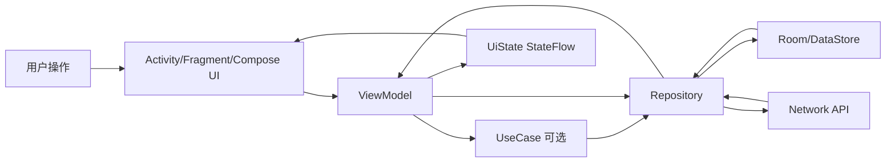
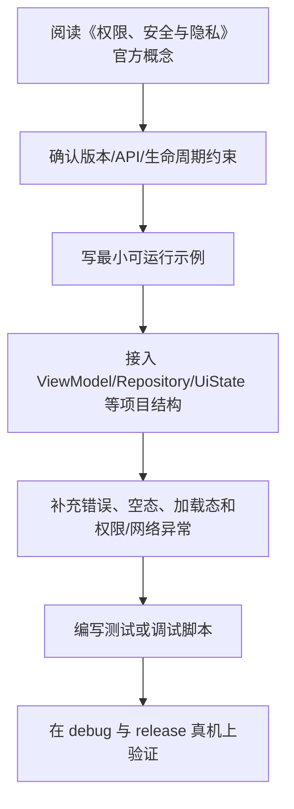

# 11. 权限、安全与隐私

<!-- lecture-notes:integrated-v2 -->

## 讲义导读：把 Android 放进应用工程主线

这一章讲的是 **11. 权限、安全与隐私**。Android 学习最怕碎片化：今天学一个控件，明天抄一段协程，后天改一个 Gradle 配置，但不知道它们怎样组成一款稳定应用。更好的读法是把每章都放进同一条主线：生命周期、状态、数据流、线程、权限、性能、测试和发布。

### 一句话先懂

Android 安全不是最后加权限弹窗，而是从 Manifest、运行时权限、数据存储、网络传输和日志输出开始设计边界。

### 通俗类比

权限像门禁卡，隐私像保险柜，网络安全像快递封条。用户允许你进一个房间，不代表你能拿走所有东西，更不代表能把数据明文寄出去。

类比只是帮助建立直觉，不能替代准确概念。真正写代码时，要回到 Android 的平台规则：哪个组件拥有状态，代码在哪个生命周期内运行，是否在主线程，数据是否能恢复，权限是否足够，release 包是否还正常。

### 本章学习主线

1. **先看平台约束**：这个知识点受哪些 Android 版本、生命周期、权限、线程或构建规则影响？
2. **再看职责边界**：它应该放在 UI、ViewModel、UseCase、Repository、DataSource、Gradle 还是 Manifest？
3. **然后看状态流动**：用户事件如何进入系统，状态如何变化，UI 如何订阅，错误如何展示？
4. **接着看异常场景**：旋转屏幕、切后台、进程被杀、网络失败、权限拒绝、release 混淆后会怎样？
5. **最后看验证方式**：用单元测试、仪器测试、Compose UI Test、Logcat、Profiler、release 构建或真机验证证明它可靠。

### 概念怎么学才不容易忘

遇到一个 Android API，不要只记“怎么调用”。建议按“使用场景 -> 生命周期 -> 线程要求 -> 状态归属 -> 错误表现 -> 测试方法”六步理解。比如学 Flow，要问谁发射、谁收集、什么时候取消；学 Compose，要问状态在哪里、什么时候重组、副作用会不会重复；学权限，要问用户拒绝、永久拒绝和系统撤销后怎么办。

### 最小实践任务

为相机、定位或通知功能设计权限申请流程，覆盖拒绝、永久拒绝、权限撤销和隐私说明。

实践时要保留失败记录。Android 的很多能力只有在异常场景下才真正显形，例如旋转屏幕后状态丢失、后台恢复后重复请求、release 包混淆后崩溃、权限拒绝后流程卡死。把这些失败样本记录下来，比只保存成功代码更有价值。

### 读完本章应该能产出

能解释普通权限、危险权限、运行时权限和 scoped storage；能设计最小权限、网络安全配置、敏感日志清理和隐私合规检查。

> 本节是全篇讲义化改写的阅读入口，后续正文中的定义、步骤、示例和参考资料都应围绕这条学习主线来理解。

## 权限原则

Android 权限应遵循最小权限原则：

- 只申请真正需要的权限。
- 在用户触发相关功能时再申请。
- 清楚解释权限用途。
- 权限被拒绝时提供降级体验。

常见权限：

- 网络访问。
- 相机。
- 麦克风。
- 定位。
- 存储或媒体访问。
- 通知。
- 蓝牙。

## 运行时权限

危险权限需要运行时申请。Compose 中通常结合 Activity Result API。

思路：

```kotlin
val launcher = rememberLauncherForActivityResult(
    contract = ActivityResultContracts.RequestPermission()
) { granted ->
    if (granted) {
        // continue
    } else {
        // show fallback
    }
}
```

不要在应用启动时一次性申请大量权限。

## exported 组件

Manifest 中组件是否暴露给其他应用由 `android:exported` 控制。

建议：

- 不需要外部访问的 Activity、Service、Receiver 设置为 false。
- 对外暴露组件要校验输入。
- 避免导出敏感功能。

## 网络安全

建议：

- 使用 HTTPS。
- 不在生产环境允许明文流量。
- 校验证书。
- 不把 token 写入日志。
- API 错误不要暴露敏感内部信息。

网络安全配置：

```xml
<network-security-config>
    <base-config cleartextTrafficPermitted="false" />
</network-security-config>
```

## 本地数据安全

敏感数据：

- token。
- 个人身份信息。
- 支付信息。
- 定位信息。

处理建议：

- 不保存不必要数据。
- 必要时加密。
- 使用 Android Keystore 管理密钥。
- 日志脱敏。
- 崩溃上报脱敏。

## WebView 安全

WebView 风险较高。

建议：

- 不随意开启 JavaScript。
- 不加载不可信 URL。
- 谨慎使用 `addJavascriptInterface`。
- 限制文件访问。
- 处理 URL 跳转。

## 输入校验

所有外部输入都不可信：

- Intent 参数。
- Deep Link。
- 网络响应。
- 用户输入。
- 文件内容。
- WebView 消息。

校验类型、范围和权限。

## 隐私合规

应用应明确：

- 收集什么数据。
- 为什么收集。
- 如何使用。
- 是否共享给第三方。
- 用户如何撤回或删除。

隐私合规不是只写隐私政策，还包括代码和数据流程本身。

## 安全检查清单

- 是否只申请必要权限？
- 是否正确处理权限拒绝？
- 是否避免导出不必要组件？
- 是否禁用生产明文流量？
- 是否避免日志输出敏感信息？
- 是否对 Deep Link 和 Intent 输入做校验？
- 是否对本地敏感数据加密？

## 权限分类与申请原则

权限设计原则：只在需要时申请，只申请完成当前功能所需的最小权限。

| 权限类型 | 示例 | 处理方式 |
| --- | --- | --- |
| 普通权限 | 网络访问 | 安装时授予，无需运行时弹窗 |
| 危险权限 | 定位、相机、麦克风、联系人 | 运行时申请，处理拒绝 |
| 特殊权限 | 悬浮窗、无障碍、精确闹钟 | 跳系统设置或特殊授权流程 |
| 媒体 / 通知相关权限 | 通知、照片访问 | 关注 Android 版本差异 |

不要在 App 首次启动就批量申请权限。更好的方式是在用户触发具体功能时说明用途并申请。

## 运行时权限状态

权限申请至少要处理：

- 已授权。
- 拒绝。
- 拒绝且不再询问。
- 只授权部分媒体或近似位置。
- 系统版本不需要该权限。

Compose 中可以把权限状态建模成 UI State，而不是在按钮回调里到处写分支。

## exported 与组件暴露

所有可被外部启动的组件都应明确审查：

```xml
<activity
    android:name=".DeepLinkActivity"
    android:exported="true">
    <intent-filter>
        <action android:name="android.intent.action.VIEW" />
        <category android:name="android.intent.category.DEFAULT" />
        <category android:name="android.intent.category.BROWSABLE" />
        <data android:scheme="https" android:host="example.com" />
    </intent-filter>
</activity>
```

如果组件不需要被其他应用调用，应设为：

```xml
android:exported="false"
```

对外暴露组件必须校验 Intent 参数、调用来源和业务权限。

## 网络安全

生产环境建议：

- 默认使用 HTTPS。
- 禁止明文 HTTP，除非有明确白名单。
- 证书错误不要用“信任所有证书”绕过。
- 日志中不要打印 token、cookie、身份证、手机号、定位。
- WebView 开启 JavaScript Bridge 时必须限制来源和接口能力。

Network Security Config 可用于配置明文流量策略和证书信任边界。

## 本地数据保护

敏感数据包括：

- token、refresh token。
- 身份信息。
- 精确定位。
- 私密图片或文件。
- 支付、健康、联系人数据。

实践建议：

- 尽量减少本地保存敏感数据。
- 必须保存时使用 Android Keystore 或加密存储方案。
- 退出登录时清除 token 和用户缓存。
- 备份策略中排除敏感文件。
- 崩溃日志和埋点做脱敏。

## 隐私合规落地清单

- 权限用途与产品功能一致。
- 隐私政策与实际 SDK、数据采集一致。
- 第三方 SDK 数据收集可解释、可关闭或有合规依据。
- 用户能撤回授权、退出登录、删除账号或清除数据。
- 数据安全表单与代码实际行为一致。
- 儿童、健康、金融、定位等敏感场景遵循额外规则。

---

## 万字精讲扩展（2026-06-16 更新）
> Last researched: 2026-06-16。本文补充内容以现代 Android 官方推荐实践为主；涉及 Android Studio、AGP、Kotlin、Compose、Jetpack、Play 政策和权限模型的内容，应在实际项目中继续核对最新官方文档。

### 本章在 Android 学习路线中的位置

《权限、安全与隐私》是 Android 能力闭环中的一个环节。Android 开发不是只会写页面，也不是只会接接口，而是要同时处理生命周期、状态、数据、线程、权限、性能、测试和发布。学习本章时，建议把每个 API 都放到一个真实屏幕或真实功能里验证：用户怎样进入页面，状态从哪里来，数据怎样刷新，异常怎样展示，旋转和后台后是否恢复，release 包是否仍然正常。

本章学习完成后，至少应达到三个标准。第一，能说清相关组件的职责边界和生命周期边界。第二，能写出一个最小可运行例子，并知道它在完整项目中应该放在哪一层。第三，能设计一个失败场景验证自己的写法是否稳健。Android 的很多能力不是“写出来”，而是“在复杂状态下仍然正确”。

### 权限、安全与隐私类笔记的精讲重点

Android 安全不是最后加一个权限检查，而是从最小权限、组件暴露、网络安全、本地存储、WebView、输入校验和隐私合规共同设计。运行时权限要在用户理解上下文时申请，拒绝后要有降级路径，不要为了方便一次申请一堆权限。Manifest 中 exported 组件必须谨慎，暴露 Activity、Service、Receiver 可能变成外部攻击入口。

网络安全配置可以声明明文流量、证书信任和证书固定等策略。敏感数据不要明文存储在 SharedPreferences、日志、剪贴板或可备份文件中。WebView 要限制 JavaScript、文件访问和不可信内容。隐私合规还包括数据最小化、告知同意、第三方 SDK 审计、权限用途说明和删除机制。

### Android 学习的主线：生命周期、状态、数据流和边界

Android 学习最容易碎片化：今天学 Activity，明天学 Compose，后天学协程和 Room，但不知道这些东西怎样组合成一个稳定应用。更有效的主线是围绕四个问题建立框架。第一，组件什么时候创建、可见、可交互、暂停、销毁，这对应 Activity、Fragment、ViewModel、Lifecycle 和进程死亡。第二，状态放在哪里、谁拥有状态、UI 如何订阅状态、事件如何上行，这对应 MVVM、UI State、Compose state、StateFlow 和单向数据流。第三，数据从哪里来、如何缓存、如何离线、如何同步、错误如何表达，这对应 Repository、Room、DataStore、网络层和离线优先。第四，边界在哪里，包括线程边界、生命周期边界、模块边界、安全边界、测试边界和发布边界。

官方 Android 架构指南把 UI layer、可选 domain layer 和 data layer 作为推荐理解方式。UI 层负责展示应用数据并处理用户交互；数据层通过 repository 暴露应用数据，并组合本地、网络等数据源；domain 层不是每个应用必须有，主要用于复用复杂业务逻辑。学习时不要把“Clean Architecture 图”背成固定目录，而要理解依赖方向：UI 依赖业务抽象，业务不应该反向依赖具体 UI；数据实现可以被替换，调用方不应该到处知道 Retrofit、Room 或 DataStore 的细节。

### 一个现代 Android 应用的数据与状态闭环



Figure: Android 单向数据流和分层架构，综合 Android 官方 App Architecture、Data layer、Compose state 和 lifecycle-aware coroutines 文档整理。

这个闭环说明：UI 不应该直接拼网络请求和数据库查询；ViewModel 不应该持有 Activity 引用；Repository 不应该返回与界面强绑定的 View 对象；Composable 不应该在重组过程中直接执行不可控副作用；生命周期相关收集应该使用 lifecycle-aware API；本地缓存和远程同步应由数据层统一协调。只要这个闭环清楚，很多 API 的选择就会自然起来。

### 学 Android 要建立版本和政策意识

Android 是一个快速演进的平台。API Level、Android Gradle Plugin、Kotlin、Compose Compiler、Jetpack 库、Play 政策、权限模型、后台限制和隐私要求都会变化。因此笔记里不应只写“某 API 怎么用”，还要写“适用版本、替代方案、官方推荐状态、迁移风险”。例如运行时权限、通知权限、前台服务、后台定位、存储访问、exported 组件、明文网络、签名和 targetSdk 都和平台版本或政策强相关。做项目时必须查最新官方文档，而不是只依赖旧博客。

### 最小实战闭环

建议每个阶段都围绕一个小应用反复迭代，例如待办清单、记账、阅读列表、天气、RSS、课程表或离线笔记。第一版只做单 Activity + Compose UI；第二版加入 ViewModel 和 UiState；第三版加入 Room 或 DataStore；第四版加入网络层和 Repository；第五版加入 WorkManager 同步；第六版加入测试、性能分析、R8、签名和发布检查。这样每个知识点都会在同一个项目里发生关系，而不是停留在零散 demo。

### 核心知识点逐条精讲

#### 1. 运行时权限

在《权限、安全与隐私》里，`运行时权限` 需要从“平台约束、代码写法、生命周期、测试和线上风险”五个角度理解。Android 不是普通 JVM 程序，它运行在移动设备、受系统生命周期和权限模型约束，随时可能经历旋转、后台、进程回收、权限撤销、网络变化和系统版本差异。学习任何 API 时都要问：它在哪个生命周期内有效，是否需要主线程，是否会泄漏 Context，是否能被测试，失败后用户看到什么。

实践中建议把 `运行时权限` 写成可执行规则。例如“在 ViewModel 暴露不可变 UiState，UI 只收集状态并上报事件”，“Repository 负责组合本地和远程数据源，UI 不直接调用 DAO 或 Retrofit”，“Fragment 只在 viewLifecycleOwner 范围内访问 View”，“Compose 副作用必须放进受控 Effect API”，“release 包必须开启并验证 R8 相关路径”。这些规则比单纯记住 API 名称更能防止真实项目出错。

判断 `运行时权限` 是否掌握，可以用三个问题：能否写出最小代码；能否说清错误使用会导致什么现象；能否设计测试或调试方法证明它工作正常。比如只会写权限申请代码还不够，还要知道用户拒绝、永久拒绝、系统自动撤销权限、targetSdk 变化时怎样处理。Android 工程能力来自这些边界判断，而不是来自 API 列表背诵。

#### 2. exported 组件

在《权限、安全与隐私》里，`exported 组件` 需要从“平台约束、代码写法、生命周期、测试和线上风险”五个角度理解。Android 不是普通 JVM 程序，它运行在移动设备、受系统生命周期和权限模型约束，随时可能经历旋转、后台、进程回收、权限撤销、网络变化和系统版本差异。学习任何 API 时都要问：它在哪个生命周期内有效，是否需要主线程，是否会泄漏 Context，是否能被测试，失败后用户看到什么。

实践中建议把 `exported 组件` 写成可执行规则。例如“在 ViewModel 暴露不可变 UiState，UI 只收集状态并上报事件”，“Repository 负责组合本地和远程数据源，UI 不直接调用 DAO 或 Retrofit”，“Fragment 只在 viewLifecycleOwner 范围内访问 View”，“Compose 副作用必须放进受控 Effect API”，“release 包必须开启并验证 R8 相关路径”。这些规则比单纯记住 API 名称更能防止真实项目出错。

判断 `exported 组件` 是否掌握，可以用三个问题：能否写出最小代码；能否说清错误使用会导致什么现象；能否设计测试或调试方法证明它工作正常。比如只会写权限申请代码还不够，还要知道用户拒绝、永久拒绝、系统自动撤销权限、targetSdk 变化时怎样处理。Android 工程能力来自这些边界判断，而不是来自 API 列表背诵。

#### 3. 网络安全配置

在《权限、安全与隐私》里，`网络安全配置` 需要从“平台约束、代码写法、生命周期、测试和线上风险”五个角度理解。Android 不是普通 JVM 程序，它运行在移动设备、受系统生命周期和权限模型约束，随时可能经历旋转、后台、进程回收、权限撤销、网络变化和系统版本差异。学习任何 API 时都要问：它在哪个生命周期内有效，是否需要主线程，是否会泄漏 Context，是否能被测试，失败后用户看到什么。

实践中建议把 `网络安全配置` 写成可执行规则。例如“在 ViewModel 暴露不可变 UiState，UI 只收集状态并上报事件”，“Repository 负责组合本地和远程数据源，UI 不直接调用 DAO 或 Retrofit”，“Fragment 只在 viewLifecycleOwner 范围内访问 View”，“Compose 副作用必须放进受控 Effect API”，“release 包必须开启并验证 R8 相关路径”。这些规则比单纯记住 API 名称更能防止真实项目出错。

判断 `网络安全配置` 是否掌握，可以用三个问题：能否写出最小代码；能否说清错误使用会导致什么现象；能否设计测试或调试方法证明它工作正常。比如只会写权限申请代码还不够，还要知道用户拒绝、永久拒绝、系统自动撤销权限、targetSdk 变化时怎样处理。Android 工程能力来自这些边界判断，而不是来自 API 列表背诵。

#### 4. 本地数据安全

在《权限、安全与隐私》里，`本地数据安全` 需要从“平台约束、代码写法、生命周期、测试和线上风险”五个角度理解。Android 不是普通 JVM 程序，它运行在移动设备、受系统生命周期和权限模型约束，随时可能经历旋转、后台、进程回收、权限撤销、网络变化和系统版本差异。学习任何 API 时都要问：它在哪个生命周期内有效，是否需要主线程，是否会泄漏 Context，是否能被测试，失败后用户看到什么。

实践中建议把 `本地数据安全` 写成可执行规则。例如“在 ViewModel 暴露不可变 UiState，UI 只收集状态并上报事件”，“Repository 负责组合本地和远程数据源，UI 不直接调用 DAO 或 Retrofit”，“Fragment 只在 viewLifecycleOwner 范围内访问 View”，“Compose 副作用必须放进受控 Effect API”，“release 包必须开启并验证 R8 相关路径”。这些规则比单纯记住 API 名称更能防止真实项目出错。

判断 `本地数据安全` 是否掌握，可以用三个问题：能否写出最小代码；能否说清错误使用会导致什么现象；能否设计测试或调试方法证明它工作正常。比如只会写权限申请代码还不够，还要知道用户拒绝、永久拒绝、系统自动撤销权限、targetSdk 变化时怎样处理。Android 工程能力来自这些边界判断，而不是来自 API 列表背诵。

#### 5. WebView 与隐私合规

在《权限、安全与隐私》里，`WebView 与隐私合规` 需要从“平台约束、代码写法、生命周期、测试和线上风险”五个角度理解。Android 不是普通 JVM 程序，它运行在移动设备、受系统生命周期和权限模型约束，随时可能经历旋转、后台、进程回收、权限撤销、网络变化和系统版本差异。学习任何 API 时都要问：它在哪个生命周期内有效，是否需要主线程，是否会泄漏 Context，是否能被测试，失败后用户看到什么。

实践中建议把 `WebView 与隐私合规` 写成可执行规则。例如“在 ViewModel 暴露不可变 UiState，UI 只收集状态并上报事件”，“Repository 负责组合本地和远程数据源，UI 不直接调用 DAO 或 Retrofit”，“Fragment 只在 viewLifecycleOwner 范围内访问 View”，“Compose 副作用必须放进受控 Effect API”，“release 包必须开启并验证 R8 相关路径”。这些规则比单纯记住 API 名称更能防止真实项目出错。

判断 `WebView 与隐私合规` 是否掌握，可以用三个问题：能否写出最小代码；能否说清错误使用会导致什么现象；能否设计测试或调试方法证明它工作正常。比如只会写权限申请代码还不够，还要知道用户拒绝、永久拒绝、系统自动撤销权限、targetSdk 变化时怎样处理。Android 工程能力来自这些边界判断，而不是来自 API 列表背诵。


### 场景化学习与排错表

| 主题 | 推荐动作 | 常见风险 | 验证方式 |
| :--- | :--- | :--- | :--- |
| 运行时权限 | 先查官方文档和版本要求，再写最小 demo，最后放入项目闭环验证 | 生命周期错位、Context 泄漏、线程错误、版本差异、只测 debug | 单元测试、仪器测试、Logcat、Profiler、release 构建和真机验证 |
| exported 组件 | 先查官方文档和版本要求，再写最小 demo，最后放入项目闭环验证 | 生命周期错位、Context 泄漏、线程错误、版本差异、只测 debug | 单元测试、仪器测试、Logcat、Profiler、release 构建和真机验证 |
| 网络安全配置 | 先查官方文档和版本要求，再写最小 demo，最后放入项目闭环验证 | 生命周期错位、Context 泄漏、线程错误、版本差异、只测 debug | 单元测试、仪器测试、Logcat、Profiler、release 构建和真机验证 |
| 本地数据安全 | 先查官方文档和版本要求，再写最小 demo，最后放入项目闭环验证 | 生命周期错位、Context 泄漏、线程错误、版本差异、只测 debug | 单元测试、仪器测试、Logcat、Profiler、release 构建和真机验证 |
| WebView 与隐私合规 | 先查官方文档和版本要求，再写最小 demo，最后放入项目闭环验证 | 生命周期错位、Context 泄漏、线程错误、版本差异、只测 debug | 单元测试、仪器测试、Logcat、Profiler、release 构建和真机验证 |

表格中的推荐动作强调“官方依据 + 最小验证 + 项目闭环”。Android 生态变化快，旧博客里的写法可能已经被官方替代，或者只适用于某个 API Level、某个 Jetpack 版本。遇到冲突时，优先查 Android Developers、Kotlin、Gradle 和库的 release notes，再参考社区经验。

### 本章建议工作流



Figure: 《权限、安全与隐私》学习工作流，综合 Android 官方架构、Compose、Lifecycle、Coroutines、Data layer、Performance 和 Release 文档整理。

这个工作流避免两个极端：只看文档不落地，或者只复制 demo 不理解边界。Android 很多 bug 只在生命周期切换、后台恢复、低内存、release 混淆、慢网络、权限拒绝或特定系统版本中出现，所以最小 demo 跑通以后，还要放回完整应用场景验证。

### 常见误区和纠正方法

- 误区：Activity/Fragment 里堆所有逻辑。纠正：UI 组件负责展示和事件，状态放 ViewModel，数据访问放 Repository，复杂复用逻辑再考虑 UseCase。
- 误区：只测 debug，不测 release。纠正：R8、资源压缩、签名、网络安全配置和 build variants 可能让 release 行为不同，发布前必须验证 release 包。
- 误区：忽略生命周期。纠正：Flow 收集、回调注册、binding、协程、导航和副作用都要绑定正确 lifecycle。
- 误区：把 Compose 当成简单 XML 替代。纠正：Compose 的核心是状态驱动 UI、可组合函数、重组、副作用控制和稳定性。
- 误区：权限申请只看成功路径。纠正：必须处理拒绝、永久拒绝、功能降级、隐私说明、targetSdk 变化和系统自动撤销。
- 误区：看到性能问题就先优化代码。纠正：先用 Profiler、Baseline Profile、启动指标、帧时间、内存快照和日志定位瓶颈。

### 与相邻章节的关系

《权限、安全与隐私》应和其他章节联动阅读。项目结构决定依赖和构建变体，Kotlin 决定状态和异步表达方式，生命周期决定 UI 和协程边界，Compose 决定状态和副作用组织，架构决定依赖方向，数据层决定离线和同步能力，测试和发布决定应用能否可靠交付。任何一个主题脱离这些关系，都容易变成 demo 级知识。

### 实操训练和复盘模板

1. 围绕 `运行时权限` 做一个小任务：写最小实现、制造一个失败场景、记录修复方法。
2. 围绕 `exported 组件` 做一个小任务：写最小实现、制造一个失败场景、记录修复方法。
3. 围绕 `网络安全配置` 做一个小任务：写最小实现、制造一个失败场景、记录修复方法。
4. 围绕 `本地数据安全` 做一个小任务：写最小实现、制造一个失败场景、记录修复方法。
5. 围绕 `WebView 与隐私合规` 做一个小任务：写最小实现、制造一个失败场景、记录修复方法。

建议每次练习都按下面格式记录：

```text
练习名称：
本章主题：权限、安全与隐私
目标 API / 组件：
版本信息：Android Studio、AGP、Kotlin、compileSdk、minSdk、targetSdk、相关 Jetpack 版本
最小实现：
生命周期和线程边界：
失败场景：旋转、后台、进程死亡、断网、权限拒绝、release 混淆等
调试证据：Logcat、断点、Profiler、截图、测试结果
最终规则：以后项目中如何写，什么情况下不能这样写
```

这个模板能把“会用 API”推进到“知道边界”。很多 Android 问题第一次看像偶发 bug，复盘后会发现是生命周期、状态持有、线程、权限、缓存或构建变体没有设计清楚。


### 2026 版本核对补充

Android 工程资料必须带版本意识。根据 Android Developers 当前文档，Android Studio 与 Android Gradle Plugin 采用按时间窗口维护的兼容策略，AGP 9.x 已进入官方文档范围；AGP 9.0 起还引入了内置 Kotlin 支持相关变化。学习或迁移项目时，不要只复制旧教程里的插件版本，而要同时核对 Android Studio、AGP、Gradle、Kotlin、KSP、compileSdk、targetSdk 和 Compose/Jetpack 版本。一个构建问题看起来像代码错误，根因可能是插件版本、仓库、缓存、JDK、Kotlin 编译器或依赖传递冲突。

隐私和安全也需要按当前官方清单复核。权限申请应遵循最小化原则，敏感数据收集要和 Google Play Data safety 表单、运行时权限说明、第三方 SDK 数据行为保持一致。换句话说，Android 学习不能只停在“API 能不能调用”，还要问“这个调用在当前 targetSdk、当前政策、当前用户授权状态下是否允许，失败后用户看到什么”。
## 参考资料与延伸阅读

- [Official / Android] Guide to app architecture: https://developer.android.com/topic/architecture
- [Official / Android] UI layer: https://developer.android.com/topic/architecture/ui-layer
- [Official / Android] Data layer: https://developer.android.com/topic/architecture/data-layer
- [Official / Android] Domain layer: https://developer.android.com/topic/architecture/domain-layer
- [Official / Android] Build an offline-first app: https://developer.android.com/topic/architecture/data-layer/offline-first
- [Official / Android] Configure your build: https://developer.android.com/build
- [Official / Android] Add build dependencies: https://developer.android.com/build/dependencies
- [Official / Android] Fragment lifecycle: https://developer.android.com/guide/fragments/lifecycle
- [Official / Android] Saved State module for ViewModel: https://developer.android.com/topic/libraries/architecture/viewmodel/viewmodel-savedstate
- [Official / Android] State and Jetpack Compose: https://developer.android.com/develop/ui/compose/state
- [Official / Android] Side-effects in Compose: https://developer.android.com/develop/ui/compose/side-effects
- [Official / Android] Jetpack Compose performance: https://developer.android.com/develop/ui/compose/performance
- [Official / Android] Stability in Compose: https://developer.android.com/develop/ui/compose/performance/stability
- [Official / Android] Kotlin coroutines on Android: https://developer.android.com/kotlin/coroutines
- [Official / Android] Kotlin flows on Android: https://developer.android.com/kotlin/flow
- [Official / Android] Use Kotlin coroutines with lifecycle-aware components: https://developer.android.com/topic/libraries/architecture/coroutines
- [Official / Android] Dependency injection with Hilt: https://developer.android.com/training/dependency-injection/hilt-android
- [Official / Android] Network security configuration: https://developer.android.com/privacy-and-security/security-config
- [Official / Android] Enable app optimization with R8: https://developer.android.com/topic/performance/app-optimization/enable-app-optimization
- [Official / Android] Baseline Profiles overview: https://developer.android.com/topic/performance/baselineprofiles/overview
- [Official / Google Codelab] Improve app performance with Baseline Profiles: https://codelabs.developers.google.com/android-baseline-profiles-improve
- [Official / Kotlin] Kotlin documentation: https://kotlinlang.org/docs/home.html
- [Official / Kotlin] Sealed classes and interfaces: https://kotlinlang.org/docs/sealed-classes.html
- [Official / Kotlin] Configure a Gradle project: https://kotlinlang.org/docs/gradle-configure-project.html
- [Official / Android] Architecture recommendations: https://developer.android.com/topic/architecture/recommendations
- [Official / Android] State holders and UI state: https://developer.android.com/topic/architecture/ui-layer/stateholders
- [Official / Android] Gradle build overview: https://developer.android.com/build/gradle-build-overview
- [Official / Android] About Android Gradle Plugin: https://developer.android.com/build/releases/about-agp
- [Official / Android] Android Gradle Plugin 9.1 release notes: https://developer.android.com/build/releases/agp-9-1-0-release-notes
- [Official / Android] Android Gradle Plugin 9.0 release notes: https://developer.android.com/build/releases/agp-9-0-0-release-notes
- [Official / Android] Security checklist: https://developer.android.com/privacy-and-security/security-tips
- [Official / Android] Privacy checklist: https://developer.android.com/privacy-and-security/about
- [Official / Android] Minimize permission requests: https://developer.android.com/privacy-and-security/minimize-permission-requests
- [Official / Android] Declare your app's data use: https://developer.android.com/privacy-and-security/declare-data-use- [Official / Gradle] Gradle Kotlin DSL Primer: https://docs.gradle.org/current/userguide/kotlin_dsl.html
- [Security / OWASP] Android Network Security Configuration: https://mas.owasp.org/MASTG/knowledge/android/MASVS-NETWORK/MASTG-KNOW-0014/
- [Blog / Android Developers] Rebuilding our guide to app architecture: https://android-developers.googleblog.com/2021/12/rebuilding-our-guide-to-app-architecture.html
- [Blog / Android Developers] Improving Performance with Baseline Profiles: https://medium.com/androiddevelopers/improving-performance-with-baseline-profiles-fdd0db0d8cc6
- [Community / CSDN] Android 学习笔记检索入口: https://so.csdn.net/so/search?q=Android%20%E5%AD%A6%E4%B9%A0%E7%AC%94%E8%AE%B0%20Jetpack%20Compose
- [Community / 博客园] Android 架构与 Jetpack 笔记检索入口: https://zzk.cnblogs.com/s/blogpost?Keywords=Android%20Jetpack%20MVVM%20Compose
- [Community / 掘金] Android Compose / 协程 / 架构实践检索入口: https://juejin.cn/search?query=Android%20Compose%20%E5%8D%8F%E7%A8%8B%20%E6%9E%B6%E6%9E%84&type=0

<!-- AUTO_EXPANDED_TO_REFERENCE_LENGTH_2026_06_23 -->

## 万字精讲扩展：权限、安全与隐私

> 本节为按参考笔记篇幅补充的系统化扩展内容，目标是把原有笔记从“知识点记录”扩展为“概念、原理、流程、工程实践、常见误区和复盘清单”完整学习材料。

### 精讲扩展 1：权限、安全与隐私 的生命周期、状态管理 与工程化理解

学习 $topic 时，不能只把它当成一个孤立知识点来背诵，而要把它放到 $category 的完整问题链条里理解。一个知识点通常同时包含概念定义、适用边界、输入输出、运行过程、常见异常和工程取舍。真正掌握它，意味着看到一个具体场景时，能够判断它解决什么问题、依赖哪些前提、失败时会出现什么现象，以及应该用什么手段验证自己的判断。

从 $a 的角度看，最重要的是先建立清晰的对象模型。也就是明确系统里有哪些参与者、它们之间如何连接、数据或控制信号如何流动、哪些环节是同步的、哪些环节是异步的、哪些状态是临时状态、哪些状态需要长期保存。很多初学问题并不是公式不会、API 不熟，而是对象边界不清：把配置当成状态，把结果当成过程，把局部现象当成全局规律。写笔记时建议始终追问：这个概念的主体是谁，输入是什么，输出是什么，中间约束是什么，错误会在哪里暴露。

从 $b 的角度看，流程比单点知识更关键。一个成熟方案通常不是单个技巧，而是一组步骤：先确定目标，再拆分约束，然后选择工具，最后通过测试和复盘确认效果。比如在实际项目中，不能只问“怎么实现”，还要问“为什么要这样实现”“有没有更简单的替代方案”“边界条件是什么”“数据量、并发量、实时性、可靠性变化后还能不能工作”。这种流程意识能够避免把学习停留在教程层面，也能让后续排错有明确路线。

$topic 的 $c 往往决定它在真实项目中的稳定性。理论上可行的方案，到了工程环境中会受到数据质量、硬件条件、依赖版本、网络环境、团队协作、部署方式和维护成本影响。写代码或做设计时，应该把正常路径和异常路径同时考虑：正常情况下如何运行，输入为空怎么办，超时怎么办，重复执行怎么办，部分成功怎么办，版本升级后兼容性怎么办，日志和指标如何证明系统确实按预期工作。

进一步看 $d，它通常对应性能、可靠性或可维护性的核心矛盾。很多技术选择并没有绝对正确答案，只有是否适合当前约束。例如追求极致性能可能牺牲可读性，追求高度抽象可能增加调试成本，追求快速交付可能留下技术债，追求完全通用可能让简单场景变复杂。高质量笔记应该把这些取舍写出来，而不是只给一个“推荐方案”。推荐方案背后的条件越清楚，迁移到新场景时越不容易误用。

最后从 $e 的角度进行复盘，可以把知识从“看懂”推进到“会用”。建议为 $topic 建立三个层次的检查：第一层是概念检查，确认术语、流程和边界没有混淆；第二层是实践检查，确认能够独立完成一个最小案例；第三层是工程检查，确认这个案例在异常、规模、性能和维护方面经得起追问。每次学习完一个章节，都可以用这三层检查反向补齐笔记。

#### 典型场景拆解

在真实场景中，$topic 通常会经历“需求出现、方案选择、实现落地、问题暴露、持续优化”几个阶段。需求出现时，要先判断这个需求属于基础能力、性能优化、体验改进、可靠性建设还是长期架构演进。不同类型的需求对方案的评价标准不同：基础能力看正确性，性能优化看指标，体验改进看路径是否顺滑，可靠性建设看故障时能否降级和恢复，架构演进看未来变化是否容易吸收。

方案选择阶段，最容易犯的错误是直接套用熟悉工具。更稳妥的方式是列出约束：数据规模、时延要求、资源预算、团队熟悉度、运维能力、安全要求、可测试性和长期维护成本。只有把约束列清楚，才能解释为什么选择当前方案。否则方案看似高级，实际可能只是增加了复杂度。

实现落地阶段，要把 $a 和 $b 拆成可验证的小步骤。每一步都应该有明确的输入、输出和检查方式。对学习笔记而言，这意味着不能只有大段概念，还应该补充流程图式的文字描述、伪代码、命令示例、参数解释、错误现象和排查路径。这样以后复习时，笔记不仅能帮助理解，也能直接指导实践。

问题暴露阶段，要优先区分“理解错误、实现错误、环境错误、数据错误、依赖错误、边界条件错误”。很多复杂问题之所以难排，是因为一开始就把问题归因到错误层级。例如把配置问题当成算法问题，把权限问题当成代码问题，把数据分布变化当成模型失效，把硬件噪声当成软件逻辑错误。好的排查顺序应该从可观测事实开始，而不是从猜测开始。

持续优化阶段，不应只追求把当前问题压下去，还要沉淀成规则。比如记录触发条件、影响范围、定位方法、最终修复、预防措施和可监控指标。这样下一次出现类似问题时，团队可以复用经验，而不是重新从零排查。

#### 常见误区与纠偏

第一个误区是只记结论，不记前提。$topic 中很多结论都是有条件的：适用于小规模，不一定适用于大规模；适用于离线处理，不一定适用于实时系统；适用于单机环境，不一定适用于分布式环境；适用于教学案例，不一定适用于生产项目。纠偏方法是在每个重要结论后面补一句“适用条件”和“不适用情况”。

第二个误区是只关注工具，不关注模型。工具会变化，模型更稳定。无论工具名称如何变化，底层仍然要解决输入建模、状态管理、资源调度、错误恢复、性能约束和质量验证这些问题。学习 $topic 时，应该把工具用法和底层模型分开记录：工具命令解决“怎么做”，底层模型解释“为什么这样做”。

第三个误区是没有验证意识。很多笔记写得很完整，但没有说明如何确认自己做对了。对于 $category 相关主题，验证至少应包含最小样例、边界样例、异常样例和性能样例。最小样例证明流程跑通，边界样例证明理解完整，异常样例证明系统可恢复，性能样例证明方案在目标规模下仍然可用。

第四个误区是忽略可维护性。短期学习时，能跑通就容易产生掌握的错觉；长期使用时，命名、分层、注释、测试、日志、版本管理和文档才会决定知识能否转化为稳定能力。扩充 $topic 笔记时，应把“如何写得清楚、如何排查、如何交接、如何复盘”也纳入内容。

#### 学习与实践建议

建议围绕 $topic 做一个小型闭环练习：先用自己的话解释概念，再画出流程，再实现一个最小案例，然后主动制造一个错误并排查，最后写下复盘。这个过程看起来比直接读资料慢，但能显著提高迁移能力。很多人学完后不会用，根本原因是缺少“从概念到问题再到验证”的闭环。

复习时可以使用四个问题：它解决什么问题；它依赖什么条件；它失败时有什么表现；它如何被验证。只要这四个问题能回答清楚，说明对 $topic 的理解已经从表层进入工程层。如果回答不清楚，就回到对应章节补充例子、边界和排错方法。
### 精讲扩展 2：权限、安全与隐私 的状态管理、单向数据流 与工程化理解

学习 $topic 时，不能只把它当成一个孤立知识点来背诵，而要把它放到 $category 的完整问题链条里理解。一个知识点通常同时包含概念定义、适用边界、输入输出、运行过程、常见异常和工程取舍。真正掌握它，意味着看到一个具体场景时，能够判断它解决什么问题、依赖哪些前提、失败时会出现什么现象，以及应该用什么手段验证自己的判断。

从 $a 的角度看，最重要的是先建立清晰的对象模型。也就是明确系统里有哪些参与者、它们之间如何连接、数据或控制信号如何流动、哪些环节是同步的、哪些环节是异步的、哪些状态是临时状态、哪些状态需要长期保存。很多初学问题并不是公式不会、API 不熟，而是对象边界不清：把配置当成状态，把结果当成过程，把局部现象当成全局规律。写笔记时建议始终追问：这个概念的主体是谁，输入是什么，输出是什么，中间约束是什么，错误会在哪里暴露。

从 $b 的角度看，流程比单点知识更关键。一个成熟方案通常不是单个技巧，而是一组步骤：先确定目标，再拆分约束，然后选择工具，最后通过测试和复盘确认效果。比如在实际项目中，不能只问“怎么实现”，还要问“为什么要这样实现”“有没有更简单的替代方案”“边界条件是什么”“数据量、并发量、实时性、可靠性变化后还能不能工作”。这种流程意识能够避免把学习停留在教程层面，也能让后续排错有明确路线。

$topic 的 $c 往往决定它在真实项目中的稳定性。理论上可行的方案，到了工程环境中会受到数据质量、硬件条件、依赖版本、网络环境、团队协作、部署方式和维护成本影响。写代码或做设计时，应该把正常路径和异常路径同时考虑：正常情况下如何运行，输入为空怎么办，超时怎么办，重复执行怎么办，部分成功怎么办，版本升级后兼容性怎么办，日志和指标如何证明系统确实按预期工作。

进一步看 $d，它通常对应性能、可靠性或可维护性的核心矛盾。很多技术选择并没有绝对正确答案，只有是否适合当前约束。例如追求极致性能可能牺牲可读性，追求高度抽象可能增加调试成本，追求快速交付可能留下技术债，追求完全通用可能让简单场景变复杂。高质量笔记应该把这些取舍写出来，而不是只给一个“推荐方案”。推荐方案背后的条件越清楚，迁移到新场景时越不容易误用。

最后从 $e 的角度进行复盘，可以把知识从“看懂”推进到“会用”。建议为 $topic 建立三个层次的检查：第一层是概念检查，确认术语、流程和边界没有混淆；第二层是实践检查，确认能够独立完成一个最小案例；第三层是工程检查，确认这个案例在异常、规模、性能和维护方面经得起追问。每次学习完一个章节，都可以用这三层检查反向补齐笔记。

#### 典型场景拆解

在真实场景中，$topic 通常会经历“需求出现、方案选择、实现落地、问题暴露、持续优化”几个阶段。需求出现时，要先判断这个需求属于基础能力、性能优化、体验改进、可靠性建设还是长期架构演进。不同类型的需求对方案的评价标准不同：基础能力看正确性，性能优化看指标，体验改进看路径是否顺滑，可靠性建设看故障时能否降级和恢复，架构演进看未来变化是否容易吸收。

方案选择阶段，最容易犯的错误是直接套用熟悉工具。更稳妥的方式是列出约束：数据规模、时延要求、资源预算、团队熟悉度、运维能力、安全要求、可测试性和长期维护成本。只有把约束列清楚，才能解释为什么选择当前方案。否则方案看似高级，实际可能只是增加了复杂度。

实现落地阶段，要把 $a 和 $b 拆成可验证的小步骤。每一步都应该有明确的输入、输出和检查方式。对学习笔记而言，这意味着不能只有大段概念，还应该补充流程图式的文字描述、伪代码、命令示例、参数解释、错误现象和排查路径。这样以后复习时，笔记不仅能帮助理解，也能直接指导实践。

问题暴露阶段，要优先区分“理解错误、实现错误、环境错误、数据错误、依赖错误、边界条件错误”。很多复杂问题之所以难排，是因为一开始就把问题归因到错误层级。例如把配置问题当成算法问题，把权限问题当成代码问题，把数据分布变化当成模型失效，把硬件噪声当成软件逻辑错误。好的排查顺序应该从可观测事实开始，而不是从猜测开始。

持续优化阶段，不应只追求把当前问题压下去，还要沉淀成规则。比如记录触发条件、影响范围、定位方法、最终修复、预防措施和可监控指标。这样下一次出现类似问题时，团队可以复用经验，而不是重新从零排查。

#### 常见误区与纠偏

第一个误区是只记结论，不记前提。$topic 中很多结论都是有条件的：适用于小规模，不一定适用于大规模；适用于离线处理，不一定适用于实时系统；适用于单机环境，不一定适用于分布式环境；适用于教学案例，不一定适用于生产项目。纠偏方法是在每个重要结论后面补一句“适用条件”和“不适用情况”。

第二个误区是只关注工具，不关注模型。工具会变化，模型更稳定。无论工具名称如何变化，底层仍然要解决输入建模、状态管理、资源调度、错误恢复、性能约束和质量验证这些问题。学习 $topic 时，应该把工具用法和底层模型分开记录：工具命令解决“怎么做”，底层模型解释“为什么这样做”。

第三个误区是没有验证意识。很多笔记写得很完整，但没有说明如何确认自己做对了。对于 $category 相关主题，验证至少应包含最小样例、边界样例、异常样例和性能样例。最小样例证明流程跑通，边界样例证明理解完整，异常样例证明系统可恢复，性能样例证明方案在目标规模下仍然可用。

第四个误区是忽略可维护性。短期学习时，能跑通就容易产生掌握的错觉；长期使用时，命名、分层、注释、测试、日志、版本管理和文档才会决定知识能否转化为稳定能力。扩充 $topic 笔记时，应把“如何写得清楚、如何排查、如何交接、如何复盘”也纳入内容。

#### 学习与实践建议

建议围绕 $topic 做一个小型闭环练习：先用自己的话解释概念，再画出流程，再实现一个最小案例，然后主动制造一个错误并排查，最后写下复盘。这个过程看起来比直接读资料慢，但能显著提高迁移能力。很多人学完后不会用，根本原因是缺少“从概念到问题再到验证”的闭环。

复习时可以使用四个问题：它解决什么问题；它依赖什么条件；它失败时有什么表现；它如何被验证。只要这四个问题能回答清楚，说明对 $topic 的理解已经从表层进入工程层。如果回答不清楚，就回到对应章节补充例子、边界和排错方法。
### 精讲扩展 3：权限、安全与隐私 的单向数据流、协程 Flow 与工程化理解

学习 $topic 时，不能只把它当成一个孤立知识点来背诵，而要把它放到 $category 的完整问题链条里理解。一个知识点通常同时包含概念定义、适用边界、输入输出、运行过程、常见异常和工程取舍。真正掌握它，意味着看到一个具体场景时，能够判断它解决什么问题、依赖哪些前提、失败时会出现什么现象，以及应该用什么手段验证自己的判断。

从 $a 的角度看，最重要的是先建立清晰的对象模型。也就是明确系统里有哪些参与者、它们之间如何连接、数据或控制信号如何流动、哪些环节是同步的、哪些环节是异步的、哪些状态是临时状态、哪些状态需要长期保存。很多初学问题并不是公式不会、API 不熟，而是对象边界不清：把配置当成状态，把结果当成过程，把局部现象当成全局规律。写笔记时建议始终追问：这个概念的主体是谁，输入是什么，输出是什么，中间约束是什么，错误会在哪里暴露。

从 $b 的角度看，流程比单点知识更关键。一个成熟方案通常不是单个技巧，而是一组步骤：先确定目标，再拆分约束，然后选择工具，最后通过测试和复盘确认效果。比如在实际项目中，不能只问“怎么实现”，还要问“为什么要这样实现”“有没有更简单的替代方案”“边界条件是什么”“数据量、并发量、实时性、可靠性变化后还能不能工作”。这种流程意识能够避免把学习停留在教程层面，也能让后续排错有明确路线。

$topic 的 $c 往往决定它在真实项目中的稳定性。理论上可行的方案，到了工程环境中会受到数据质量、硬件条件、依赖版本、网络环境、团队协作、部署方式和维护成本影响。写代码或做设计时，应该把正常路径和异常路径同时考虑：正常情况下如何运行，输入为空怎么办，超时怎么办，重复执行怎么办，部分成功怎么办，版本升级后兼容性怎么办，日志和指标如何证明系统确实按预期工作。

进一步看 $d，它通常对应性能、可靠性或可维护性的核心矛盾。很多技术选择并没有绝对正确答案，只有是否适合当前约束。例如追求极致性能可能牺牲可读性，追求高度抽象可能增加调试成本，追求快速交付可能留下技术债，追求完全通用可能让简单场景变复杂。高质量笔记应该把这些取舍写出来，而不是只给一个“推荐方案”。推荐方案背后的条件越清楚，迁移到新场景时越不容易误用。

最后从 $e 的角度进行复盘，可以把知识从“看懂”推进到“会用”。建议为 $topic 建立三个层次的检查：第一层是概念检查，确认术语、流程和边界没有混淆；第二层是实践检查，确认能够独立完成一个最小案例；第三层是工程检查，确认这个案例在异常、规模、性能和维护方面经得起追问。每次学习完一个章节，都可以用这三层检查反向补齐笔记。

#### 典型场景拆解

在真实场景中，$topic 通常会经历“需求出现、方案选择、实现落地、问题暴露、持续优化”几个阶段。需求出现时，要先判断这个需求属于基础能力、性能优化、体验改进、可靠性建设还是长期架构演进。不同类型的需求对方案的评价标准不同：基础能力看正确性，性能优化看指标，体验改进看路径是否顺滑，可靠性建设看故障时能否降级和恢复，架构演进看未来变化是否容易吸收。

方案选择阶段，最容易犯的错误是直接套用熟悉工具。更稳妥的方式是列出约束：数据规模、时延要求、资源预算、团队熟悉度、运维能力、安全要求、可测试性和长期维护成本。只有把约束列清楚，才能解释为什么选择当前方案。否则方案看似高级，实际可能只是增加了复杂度。

实现落地阶段，要把 $a 和 $b 拆成可验证的小步骤。每一步都应该有明确的输入、输出和检查方式。对学习笔记而言，这意味着不能只有大段概念，还应该补充流程图式的文字描述、伪代码、命令示例、参数解释、错误现象和排查路径。这样以后复习时，笔记不仅能帮助理解，也能直接指导实践。

问题暴露阶段，要优先区分“理解错误、实现错误、环境错误、数据错误、依赖错误、边界条件错误”。很多复杂问题之所以难排，是因为一开始就把问题归因到错误层级。例如把配置问题当成算法问题，把权限问题当成代码问题，把数据分布变化当成模型失效，把硬件噪声当成软件逻辑错误。好的排查顺序应该从可观测事实开始，而不是从猜测开始。

持续优化阶段，不应只追求把当前问题压下去，还要沉淀成规则。比如记录触发条件、影响范围、定位方法、最终修复、预防措施和可监控指标。这样下一次出现类似问题时，团队可以复用经验，而不是重新从零排查。

#### 常见误区与纠偏

第一个误区是只记结论，不记前提。$topic 中很多结论都是有条件的：适用于小规模，不一定适用于大规模；适用于离线处理，不一定适用于实时系统；适用于单机环境，不一定适用于分布式环境；适用于教学案例，不一定适用于生产项目。纠偏方法是在每个重要结论后面补一句“适用条件”和“不适用情况”。

第二个误区是只关注工具，不关注模型。工具会变化，模型更稳定。无论工具名称如何变化，底层仍然要解决输入建模、状态管理、资源调度、错误恢复、性能约束和质量验证这些问题。学习 $topic 时，应该把工具用法和底层模型分开记录：工具命令解决“怎么做”，底层模型解释“为什么这样做”。

第三个误区是没有验证意识。很多笔记写得很完整，但没有说明如何确认自己做对了。对于 $category 相关主题，验证至少应包含最小样例、边界样例、异常样例和性能样例。最小样例证明流程跑通，边界样例证明理解完整，异常样例证明系统可恢复，性能样例证明方案在目标规模下仍然可用。

第四个误区是忽略可维护性。短期学习时，能跑通就容易产生掌握的错觉；长期使用时，命名、分层、注释、测试、日志、版本管理和文档才会决定知识能否转化为稳定能力。扩充 $topic 笔记时，应把“如何写得清楚、如何排查、如何交接、如何复盘”也纳入内容。

#### 学习与实践建议

建议围绕 $topic 做一个小型闭环练习：先用自己的话解释概念，再画出流程，再实现一个最小案例，然后主动制造一个错误并排查，最后写下复盘。这个过程看起来比直接读资料慢，但能显著提高迁移能力。很多人学完后不会用，根本原因是缺少“从概念到问题再到验证”的闭环。

复习时可以使用四个问题：它解决什么问题；它依赖什么条件；它失败时有什么表现；它如何被验证。只要这四个问题能回答清楚，说明对 $topic 的理解已经从表层进入工程层。如果回答不清楚，就回到对应章节补充例子、边界和排错方法。
### 精讲扩展 4：权限、安全与隐私 的协程 Flow、架构分层 与工程化理解

学习 $topic 时，不能只把它当成一个孤立知识点来背诵，而要把它放到 $category 的完整问题链条里理解。一个知识点通常同时包含概念定义、适用边界、输入输出、运行过程、常见异常和工程取舍。真正掌握它，意味着看到一个具体场景时，能够判断它解决什么问题、依赖哪些前提、失败时会出现什么现象，以及应该用什么手段验证自己的判断。

从 $a 的角度看，最重要的是先建立清晰的对象模型。也就是明确系统里有哪些参与者、它们之间如何连接、数据或控制信号如何流动、哪些环节是同步的、哪些环节是异步的、哪些状态是临时状态、哪些状态需要长期保存。很多初学问题并不是公式不会、API 不熟，而是对象边界不清：把配置当成状态，把结果当成过程，把局部现象当成全局规律。写笔记时建议始终追问：这个概念的主体是谁，输入是什么，输出是什么，中间约束是什么，错误会在哪里暴露。

从 $b 的角度看，流程比单点知识更关键。一个成熟方案通常不是单个技巧，而是一组步骤：先确定目标，再拆分约束，然后选择工具，最后通过测试和复盘确认效果。比如在实际项目中，不能只问“怎么实现”，还要问“为什么要这样实现”“有没有更简单的替代方案”“边界条件是什么”“数据量、并发量、实时性、可靠性变化后还能不能工作”。这种流程意识能够避免把学习停留在教程层面，也能让后续排错有明确路线。

$topic 的 $c 往往决定它在真实项目中的稳定性。理论上可行的方案，到了工程环境中会受到数据质量、硬件条件、依赖版本、网络环境、团队协作、部署方式和维护成本影响。写代码或做设计时，应该把正常路径和异常路径同时考虑：正常情况下如何运行，输入为空怎么办，超时怎么办，重复执行怎么办，部分成功怎么办，版本升级后兼容性怎么办，日志和指标如何证明系统确实按预期工作。

进一步看 $d，它通常对应性能、可靠性或可维护性的核心矛盾。很多技术选择并没有绝对正确答案，只有是否适合当前约束。例如追求极致性能可能牺牲可读性，追求高度抽象可能增加调试成本，追求快速交付可能留下技术债，追求完全通用可能让简单场景变复杂。高质量笔记应该把这些取舍写出来，而不是只给一个“推荐方案”。推荐方案背后的条件越清楚，迁移到新场景时越不容易误用。

最后从 $e 的角度进行复盘，可以把知识从“看懂”推进到“会用”。建议为 $topic 建立三个层次的检查：第一层是概念检查，确认术语、流程和边界没有混淆；第二层是实践检查，确认能够独立完成一个最小案例；第三层是工程检查，确认这个案例在异常、规模、性能和维护方面经得起追问。每次学习完一个章节，都可以用这三层检查反向补齐笔记。

#### 典型场景拆解

在真实场景中，$topic 通常会经历“需求出现、方案选择、实现落地、问题暴露、持续优化”几个阶段。需求出现时，要先判断这个需求属于基础能力、性能优化、体验改进、可靠性建设还是长期架构演进。不同类型的需求对方案的评价标准不同：基础能力看正确性，性能优化看指标，体验改进看路径是否顺滑，可靠性建设看故障时能否降级和恢复，架构演进看未来变化是否容易吸收。

方案选择阶段，最容易犯的错误是直接套用熟悉工具。更稳妥的方式是列出约束：数据规模、时延要求、资源预算、团队熟悉度、运维能力、安全要求、可测试性和长期维护成本。只有把约束列清楚，才能解释为什么选择当前方案。否则方案看似高级，实际可能只是增加了复杂度。

实现落地阶段，要把 $a 和 $b 拆成可验证的小步骤。每一步都应该有明确的输入、输出和检查方式。对学习笔记而言，这意味着不能只有大段概念，还应该补充流程图式的文字描述、伪代码、命令示例、参数解释、错误现象和排查路径。这样以后复习时，笔记不仅能帮助理解，也能直接指导实践。

问题暴露阶段，要优先区分“理解错误、实现错误、环境错误、数据错误、依赖错误、边界条件错误”。很多复杂问题之所以难排，是因为一开始就把问题归因到错误层级。例如把配置问题当成算法问题，把权限问题当成代码问题，把数据分布变化当成模型失效，把硬件噪声当成软件逻辑错误。好的排查顺序应该从可观测事实开始，而不是从猜测开始。

持续优化阶段，不应只追求把当前问题压下去，还要沉淀成规则。比如记录触发条件、影响范围、定位方法、最终修复、预防措施和可监控指标。这样下一次出现类似问题时，团队可以复用经验，而不是重新从零排查。

#### 常见误区与纠偏

第一个误区是只记结论，不记前提。$topic 中很多结论都是有条件的：适用于小规模，不一定适用于大规模；适用于离线处理，不一定适用于实时系统；适用于单机环境，不一定适用于分布式环境；适用于教学案例，不一定适用于生产项目。纠偏方法是在每个重要结论后面补一句“适用条件”和“不适用情况”。

第二个误区是只关注工具，不关注模型。工具会变化，模型更稳定。无论工具名称如何变化，底层仍然要解决输入建模、状态管理、资源调度、错误恢复、性能约束和质量验证这些问题。学习 $topic 时，应该把工具用法和底层模型分开记录：工具命令解决“怎么做”，底层模型解释“为什么这样做”。

第三个误区是没有验证意识。很多笔记写得很完整，但没有说明如何确认自己做对了。对于 $category 相关主题，验证至少应包含最小样例、边界样例、异常样例和性能样例。最小样例证明流程跑通，边界样例证明理解完整，异常样例证明系统可恢复，性能样例证明方案在目标规模下仍然可用。

第四个误区是忽略可维护性。短期学习时，能跑通就容易产生掌握的错觉；长期使用时，命名、分层、注释、测试、日志、版本管理和文档才会决定知识能否转化为稳定能力。扩充 $topic 笔记时，应把“如何写得清楚、如何排查、如何交接、如何复盘”也纳入内容。

#### 学习与实践建议

建议围绕 $topic 做一个小型闭环练习：先用自己的话解释概念，再画出流程，再实现一个最小案例，然后主动制造一个错误并排查，最后写下复盘。这个过程看起来比直接读资料慢，但能显著提高迁移能力。很多人学完后不会用，根本原因是缺少“从概念到问题再到验证”的闭环。

复习时可以使用四个问题：它解决什么问题；它依赖什么条件；它失败时有什么表现；它如何被验证。只要这四个问题能回答清楚，说明对 $topic 的理解已经从表层进入工程层。如果回答不清楚，就回到对应章节补充例子、边界和排错方法。
## 扩展复盘清单

- 能否用一句话说明本主题解决的问题。
- 能否列出本主题最重要的输入、输出、约束和失败模式。
- 能否独立完成一个最小实践案例，并解释每一步为什么需要。
- 能否设计边界测试、异常测试和性能测试。
- 能否把本主题和所在技术体系中的其他主题连接起来理解。
