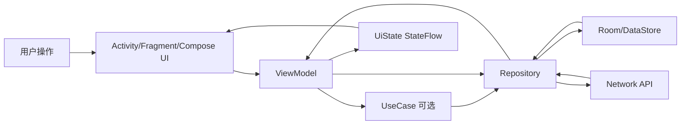
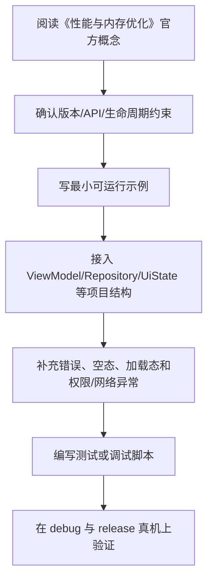

# 12. 性能与内存优化

<!-- lecture-notes:integrated-v2 -->

## 讲义导读：把 Android 放进应用工程主线

这一章讲的是 **12. 性能与内存优化**。Android 学习最怕碎片化：今天学一个控件，明天抄一段协程，后天改一个 Gradle 配置，但不知道它们怎样组成一款稳定应用。更好的读法是把每章都放进同一条主线：生命周期、状态、数据流、线程、权限、性能、测试和发布。

### 一句话先懂

性能优化不是凭感觉改代码，而是先测量卡顿、启动、内存、电量和包体，再针对瓶颈优化。

### 通俗类比

性能调优像给车做检测：不能只听声音说发动机有问题，要看仪表、油耗、胎压和故障码。Android 里这些仪表就是 Profiler、Perfetto、Logcat 和指标。

类比只是帮助建立直觉，不能替代准确概念。真正写代码时，要回到 Android 的平台规则：哪个组件拥有状态，代码在哪个生命周期内运行，是否在主线程，数据是否能恢复，权限是否足够，release 包是否还正常。

### 本章学习主线

1. **先看平台约束**：这个知识点受哪些 Android 版本、生命周期、权限、线程或构建规则影响？
2. **再看职责边界**：它应该放在 UI、ViewModel、UseCase、Repository、DataSource、Gradle 还是 Manifest？
3. **然后看状态流动**：用户事件如何进入系统，状态如何变化，UI 如何订阅，错误如何展示？
4. **接着看异常场景**：旋转屏幕、切后台、进程被杀、网络失败、权限拒绝、release 混淆后会怎样？
5. **最后看验证方式**：用单元测试、仪器测试、Compose UI Test、Logcat、Profiler、release 构建或真机验证证明它可靠。

### 概念怎么学才不容易忘

遇到一个 Android API，不要只记“怎么调用”。建议按“使用场景 -> 生命周期 -> 线程要求 -> 状态归属 -> 错误表现 -> 测试方法”六步理解。比如学 Flow，要问谁发射、谁收集、什么时候取消；学 Compose，要问状态在哪里、什么时候重组、副作用会不会重复；学权限，要问用户拒绝、永久拒绝和系统撤销后怎么办。

### 最小实践任务

用 Profiler 或系统工具观察一次冷启动、一次列表滚动和一次图片加载，记录耗时、内存和可能瓶颈。

实践时要保留失败记录。Android 的很多能力只有在异常场景下才真正显形，例如旋转屏幕后状态丢失、后台恢复后重复请求、release 包混淆后崩溃、权限拒绝后流程卡死。把这些失败样本记录下来，比只保存成功代码更有价值。

### 读完本章应该能产出

能区分启动优化、渲染优化、内存泄漏、ANR、包体优化和电量优化；能用工具定位问题，而不是盲目优化。

> 本节是全篇讲义化改写的阅读入口，后续正文中的定义、步骤、示例和参考资料都应围绕这条学习主线来理解。

## 性能关注点

Android 性能常见维度：

- 启动速度。
- 页面流畅度。
- 内存占用。
- 电量消耗。
- 网络效率。
- APK / AAB 体积。
- 列表滚动性能。
- Compose 重组性能。

优化原则：先测量，再优化。

## 启动优化

冷启动流程包含：

- 进程创建。
- Application 初始化。
- Activity 创建。
- 首帧绘制。

建议：

- Application 中少做耗时初始化。
- 第三方 SDK 延迟初始化。
- 避免主线程 I/O。
- 首页首屏数据分阶段加载。
- 使用 Baseline Profile 改善启动和运行性能。

## 主线程

主线程不能执行：

- 网络请求。
- 大文件读写。
- 数据库重任务。
- 大量 JSON 解析。
- 复杂计算。

使用协程：

```kotlin
withContext(Dispatchers.IO) {
    loadFromDisk()
}
```

## 内存泄漏

常见泄漏：

- 单例持有 Activity。
- 静态集合持有 View。
- 长生命周期对象持有短生命周期 Context。
- 未取消回调或监听。
- Fragment 持有已销毁 View。

建议：

- ViewModel 不持有 Activity。
- 使用 Application Context 时明确场景。
- 生命周期结束时注销监听。
- Fragment 中不要长期保存 View 引用。

## Compose 性能

建议：

- 使用稳定参数。
- 大列表使用 LazyColumn。
- 为列表 item 提供 key。
- 避免在 Composable 中做耗时计算。
- 使用 `remember` 缓存局部对象。
- 使用 `derivedStateOf` 降低派生状态重算。
- 拆分 Composable，缩小重组范围。

## 列表性能

传统 RecyclerView：

- 使用 DiffUtil。
- ViewHolder 复用。
- 避免 item 中复杂嵌套。
- 图片加载设置合适尺寸。

Compose LazyColumn：

```kotlin
LazyColumn {
    items(
        items = users,
        key = { it.id }
    ) { user ->
        UserItem(user)
    }
}
```

## 图片优化

建议：

- 按显示尺寸加载图片。
- 使用 Coil、Glide 等成熟库。
- 启用缓存。
- 避免加载超大原图到内存。
- 使用 WebP 或合适格式。

## 网络优化

建议：

- 合理缓存。
- 分页加载。
- 压缩响应。
- 避免重复请求。
- 超时和重试策略清晰。
- 离线优先降低网络依赖。

## APK / AAB 体积

优化方式：

- 启用 R8。
- 移除无用资源。
- 使用 Android App Bundle。
- 使用 vector drawable。
- 压缩图片。
- 检查依赖体积。

## 性能工具

常用：

- Android Studio Profiler。
- Memory Profiler。
- CPU Profiler。
- Layout Inspector。
- Compose Recomposition tools。
- Macrobenchmark。
- Baseline Profile。

## 本章检查清单

- 是否知道主线程不能做耗时任务？
- 是否能识别常见内存泄漏？
- 是否知道 Compose 重组可能影响性能？
- 是否会使用 Profiler 分析问题？
- 是否理解启动优化要减少首屏前工作？

## 性能问题分类

| 类型 | 表现 | 常见原因 |
| --- | --- | --- |
| 启动慢 | 点击图标后长时间白屏 | Application 初始化过重、首屏同步 IO |
| 掉帧 | 滚动卡顿、动画不顺 | 主线程计算、布局过深、重组过多 |
| ANR | 应用无响应 | 主线程阻塞、广播处理过慢、锁竞争 |
| 内存泄漏 | 内存持续上涨、页面退出不释放 | 长生命周期对象持有 Activity / View |
| OOM | 崩溃、加载大图失败 | 图片过大、缓存无上限、对象过多 |
| 耗电 | 后台耗电高 | 频繁唤醒、定位、网络轮询 |

性能优化先测量再修改，不要靠猜。

## 启动优化

启动阶段目标是尽快完成首屏可交互。

建议：

- Application 只做必要初始化。
- SDK 初始化延迟到首次使用或后台。
- 首屏数据优先读本地缓存。
- 大型 JSON、数据库迁移、文件扫描不要阻塞主线程。
- 使用 SplashScreen API 控制启动体验。
- 用 Macrobenchmark 和 Baseline Profile 衡量真实启动性能。

常见错误：

```kotlin
class App : Application() {
    override fun onCreate() {
        super.onCreate()
        // 一次性初始化所有 SDK、读大文件、同步请求网络
    }
}
```

## Compose 性能实践

- 列表使用稳定 key。
- 避免把整个页面状态传给每个 item。
- 对昂贵计算使用 `remember` 或提前在 ViewModel 处理。
- 使用 `derivedStateOf` 管理由状态派生且计算昂贵的值。
- 避免频繁创建不稳定对象作为参数。
- 不要为了减少重组破坏代码清晰性；重组本身不一定是问题，昂贵重组才是问题。

列表 item 示例：

```kotlin
items(
    items = articles,
    key = { it.id }
) { article ->
    ArticleRow(
        title = article.title,
        isFavorite = article.isFavorite,
        onClick = { onOpen(article.id) }
    )
}
```

## 内存泄漏高发点

- 单例持有 Activity Context。
- Fragment ViewBinding 没有在 `onDestroyView` 清空。
- 长生命周期协程持有 View。
- 回调、监听器、广播没有注销。
- WebView、Bitmap、大缓存没有释放或无上限。
- 静态集合保存页面对象。

排查工具：

- Memory Profiler 看对象增长。
- Heap dump 查引用链。
- LeakCanary 可用于开发期快速发现泄漏。

## ANR 排查

ANR 本质是主线程长时间无法响应。排查时看：

- 主线程堆栈。
- 是否有同步网络、数据库、文件 IO。
- 是否有锁等待。
- BroadcastReceiver 是否执行太久。
- 是否在启动期做大量初始化。

优化方向：

- 把阻塞任务移到后台线程。
- 拆分长任务，必要时让用户可取消。
- 减少主线程锁竞争。
- 使用 WorkManager 处理可靠后台任务。

## 体积优化

- Release 开启 R8 和资源压缩。
- 使用 Android App Bundle 让 Play 按设备分发。
- 检查大依赖和重复依赖。
- 图片使用合适尺寸和格式。
- 可矢量化图标使用 vector drawable。
- 删除未使用语言、ABI、资源时要确认业务需要。

---

## 万字精讲扩展（2026-06-16 更新）
> Last researched: 2026-06-16。本文补充内容以现代 Android 官方推荐实践为主；涉及 Android Studio、AGP、Kotlin、Compose、Jetpack、Play 政策和权限模型的内容，应在实际项目中继续核对最新官方文档。

### 本章在 Android 学习路线中的位置

《性能与内存优化》是 Android 能力闭环中的一个环节。Android 开发不是只会写页面，也不是只会接接口，而是要同时处理生命周期、状态、数据、线程、权限、性能、测试和发布。学习本章时，建议把每个 API 都放到一个真实屏幕或真实功能里验证：用户怎样进入页面，状态从哪里来，数据怎样刷新，异常怎样展示，旋转和后台后是否恢复，release 包是否仍然正常。

本章学习完成后，至少应达到三个标准。第一，能说清相关组件的职责边界和生命周期边界。第二，能写出一个最小可运行例子，并知道它在完整项目中应该放在哪一层。第三，能设计一个失败场景验证自己的写法是否稳健。Android 的很多能力不是“写出来”，而是“在复杂状态下仍然正确”。

### 性能与内存类笔记的精讲重点

性能优化要先测量，再行动。启动慢、掉帧、内存泄漏、OOM、网络慢、列表卡顿、Compose 重组过多、包体过大都属于不同问题，需要不同工具和指标。启动优化关注冷启动路径、Application 初始化、首屏渲染、懒加载和 Baseline Profiles；内存优化关注生命周期引用、图片缓存、集合大小和泄漏；UI 性能关注主线程、布局层级、重组稳定性和列表复用。

Compose 性能不能只靠少用重组。正确做法是让状态尽量局部、参数稳定、避免在重组中创建昂贵对象、使用 Lazy 列表 key、必要时用 derivedStateOf/remember，并用官方工具和指标确认问题。R8、资源压缩、App Bundle 和 Baseline Profiles 则属于发布性能和体积优化的重要部分。

### Android 学习的主线：生命周期、状态、数据流和边界

Android 学习最容易碎片化：今天学 Activity，明天学 Compose，后天学协程和 Room，但不知道这些东西怎样组合成一个稳定应用。更有效的主线是围绕四个问题建立框架。第一，组件什么时候创建、可见、可交互、暂停、销毁，这对应 Activity、Fragment、ViewModel、Lifecycle 和进程死亡。第二，状态放在哪里、谁拥有状态、UI 如何订阅状态、事件如何上行，这对应 MVVM、UI State、Compose state、StateFlow 和单向数据流。第三，数据从哪里来、如何缓存、如何离线、如何同步、错误如何表达，这对应 Repository、Room、DataStore、网络层和离线优先。第四，边界在哪里，包括线程边界、生命周期边界、模块边界、安全边界、测试边界和发布边界。

官方 Android 架构指南把 UI layer、可选 domain layer 和 data layer 作为推荐理解方式。UI 层负责展示应用数据并处理用户交互；数据层通过 repository 暴露应用数据，并组合本地、网络等数据源；domain 层不是每个应用必须有，主要用于复用复杂业务逻辑。学习时不要把“Clean Architecture 图”背成固定目录，而要理解依赖方向：UI 依赖业务抽象，业务不应该反向依赖具体 UI；数据实现可以被替换，调用方不应该到处知道 Retrofit、Room 或 DataStore 的细节。

### 一个现代 Android 应用的数据与状态闭环



Figure: Android 单向数据流和分层架构，综合 Android 官方 App Architecture、Data layer、Compose state 和 lifecycle-aware coroutines 文档整理。

这个闭环说明：UI 不应该直接拼网络请求和数据库查询；ViewModel 不应该持有 Activity 引用；Repository 不应该返回与界面强绑定的 View 对象；Composable 不应该在重组过程中直接执行不可控副作用；生命周期相关收集应该使用 lifecycle-aware API；本地缓存和远程同步应由数据层统一协调。只要这个闭环清楚，很多 API 的选择就会自然起来。

### 学 Android 要建立版本和政策意识

Android 是一个快速演进的平台。API Level、Android Gradle Plugin、Kotlin、Compose Compiler、Jetpack 库、Play 政策、权限模型、后台限制和隐私要求都会变化。因此笔记里不应只写“某 API 怎么用”，还要写“适用版本、替代方案、官方推荐状态、迁移风险”。例如运行时权限、通知权限、前台服务、后台定位、存储访问、exported 组件、明文网络、签名和 targetSdk 都和平台版本或政策强相关。做项目时必须查最新官方文档，而不是只依赖旧博客。

### 最小实战闭环

建议每个阶段都围绕一个小应用反复迭代，例如待办清单、记账、阅读列表、天气、RSS、课程表或离线笔记。第一版只做单 Activity + Compose UI；第二版加入 ViewModel 和 UiState；第三版加入 Room 或 DataStore；第四版加入网络层和 Repository；第五版加入 WorkManager 同步；第六版加入测试、性能分析、R8、签名和发布检查。这样每个知识点都会在同一个项目里发生关系，而不是停留在零散 demo。

### 核心知识点逐条精讲

#### 1. 启动优化

在《性能与内存优化》里，`启动优化` 需要从“平台约束、代码写法、生命周期、测试和线上风险”五个角度理解。Android 不是普通 JVM 程序，它运行在移动设备、受系统生命周期和权限模型约束，随时可能经历旋转、后台、进程回收、权限撤销、网络变化和系统版本差异。学习任何 API 时都要问：它在哪个生命周期内有效，是否需要主线程，是否会泄漏 Context，是否能被测试，失败后用户看到什么。

实践中建议把 `启动优化` 写成可执行规则。例如“在 ViewModel 暴露不可变 UiState，UI 只收集状态并上报事件”，“Repository 负责组合本地和远程数据源，UI 不直接调用 DAO 或 Retrofit”，“Fragment 只在 viewLifecycleOwner 范围内访问 View”，“Compose 副作用必须放进受控 Effect API”，“release 包必须开启并验证 R8 相关路径”。这些规则比单纯记住 API 名称更能防止真实项目出错。

判断 `启动优化` 是否掌握，可以用三个问题：能否写出最小代码；能否说清错误使用会导致什么现象；能否设计测试或调试方法证明它工作正常。比如只会写权限申请代码还不够，还要知道用户拒绝、永久拒绝、系统自动撤销权限、targetSdk 变化时怎样处理。Android 工程能力来自这些边界判断，而不是来自 API 列表背诵。

#### 2. 主线程和掉帧

在《性能与内存优化》里，`主线程和掉帧` 需要从“平台约束、代码写法、生命周期、测试和线上风险”五个角度理解。Android 不是普通 JVM 程序，它运行在移动设备、受系统生命周期和权限模型约束，随时可能经历旋转、后台、进程回收、权限撤销、网络变化和系统版本差异。学习任何 API 时都要问：它在哪个生命周期内有效，是否需要主线程，是否会泄漏 Context，是否能被测试，失败后用户看到什么。

实践中建议把 `主线程和掉帧` 写成可执行规则。例如“在 ViewModel 暴露不可变 UiState，UI 只收集状态并上报事件”，“Repository 负责组合本地和远程数据源，UI 不直接调用 DAO 或 Retrofit”，“Fragment 只在 viewLifecycleOwner 范围内访问 View”，“Compose 副作用必须放进受控 Effect API”，“release 包必须开启并验证 R8 相关路径”。这些规则比单纯记住 API 名称更能防止真实项目出错。

判断 `主线程和掉帧` 是否掌握，可以用三个问题：能否写出最小代码；能否说清错误使用会导致什么现象；能否设计测试或调试方法证明它工作正常。比如只会写权限申请代码还不够，还要知道用户拒绝、永久拒绝、系统自动撤销权限、targetSdk 变化时怎样处理。Android 工程能力来自这些边界判断，而不是来自 API 列表背诵。

#### 3. 内存泄漏

在《性能与内存优化》里，`内存泄漏` 需要从“平台约束、代码写法、生命周期、测试和线上风险”五个角度理解。Android 不是普通 JVM 程序，它运行在移动设备、受系统生命周期和权限模型约束，随时可能经历旋转、后台、进程回收、权限撤销、网络变化和系统版本差异。学习任何 API 时都要问：它在哪个生命周期内有效，是否需要主线程，是否会泄漏 Context，是否能被测试，失败后用户看到什么。

实践中建议把 `内存泄漏` 写成可执行规则。例如“在 ViewModel 暴露不可变 UiState，UI 只收集状态并上报事件”，“Repository 负责组合本地和远程数据源，UI 不直接调用 DAO 或 Retrofit”，“Fragment 只在 viewLifecycleOwner 范围内访问 View”，“Compose 副作用必须放进受控 Effect API”，“release 包必须开启并验证 R8 相关路径”。这些规则比单纯记住 API 名称更能防止真实项目出错。

判断 `内存泄漏` 是否掌握，可以用三个问题：能否写出最小代码；能否说清错误使用会导致什么现象；能否设计测试或调试方法证明它工作正常。比如只会写权限申请代码还不够，还要知道用户拒绝、永久拒绝、系统自动撤销权限、targetSdk 变化时怎样处理。Android 工程能力来自这些边界判断，而不是来自 API 列表背诵。

#### 4. Compose 性能

在《性能与内存优化》里，`Compose 性能` 需要从“平台约束、代码写法、生命周期、测试和线上风险”五个角度理解。Android 不是普通 JVM 程序，它运行在移动设备、受系统生命周期和权限模型约束，随时可能经历旋转、后台、进程回收、权限撤销、网络变化和系统版本差异。学习任何 API 时都要问：它在哪个生命周期内有效，是否需要主线程，是否会泄漏 Context，是否能被测试，失败后用户看到什么。

实践中建议把 `Compose 性能` 写成可执行规则。例如“在 ViewModel 暴露不可变 UiState，UI 只收集状态并上报事件”，“Repository 负责组合本地和远程数据源，UI 不直接调用 DAO 或 Retrofit”，“Fragment 只在 viewLifecycleOwner 范围内访问 View”，“Compose 副作用必须放进受控 Effect API”，“release 包必须开启并验证 R8 相关路径”。这些规则比单纯记住 API 名称更能防止真实项目出错。

判断 `Compose 性能` 是否掌握，可以用三个问题：能否写出最小代码；能否说清错误使用会导致什么现象；能否设计测试或调试方法证明它工作正常。比如只会写权限申请代码还不够，还要知道用户拒绝、永久拒绝、系统自动撤销权限、targetSdk 变化时怎样处理。Android 工程能力来自这些边界判断，而不是来自 API 列表背诵。

#### 5. 包体和 Baseline Profiles

在《性能与内存优化》里，`包体和 Baseline Profiles` 需要从“平台约束、代码写法、生命周期、测试和线上风险”五个角度理解。Android 不是普通 JVM 程序，它运行在移动设备、受系统生命周期和权限模型约束，随时可能经历旋转、后台、进程回收、权限撤销、网络变化和系统版本差异。学习任何 API 时都要问：它在哪个生命周期内有效，是否需要主线程，是否会泄漏 Context，是否能被测试，失败后用户看到什么。

实践中建议把 `包体和 Baseline Profiles` 写成可执行规则。例如“在 ViewModel 暴露不可变 UiState，UI 只收集状态并上报事件”，“Repository 负责组合本地和远程数据源，UI 不直接调用 DAO 或 Retrofit”，“Fragment 只在 viewLifecycleOwner 范围内访问 View”，“Compose 副作用必须放进受控 Effect API”，“release 包必须开启并验证 R8 相关路径”。这些规则比单纯记住 API 名称更能防止真实项目出错。

判断 `包体和 Baseline Profiles` 是否掌握，可以用三个问题：能否写出最小代码；能否说清错误使用会导致什么现象；能否设计测试或调试方法证明它工作正常。比如只会写权限申请代码还不够，还要知道用户拒绝、永久拒绝、系统自动撤销权限、targetSdk 变化时怎样处理。Android 工程能力来自这些边界判断，而不是来自 API 列表背诵。


### 场景化学习与排错表

| 主题 | 推荐动作 | 常见风险 | 验证方式 |
| :--- | :--- | :--- | :--- |
| 启动优化 | 先查官方文档和版本要求，再写最小 demo，最后放入项目闭环验证 | 生命周期错位、Context 泄漏、线程错误、版本差异、只测 debug | 单元测试、仪器测试、Logcat、Profiler、release 构建和真机验证 |
| 主线程和掉帧 | 先查官方文档和版本要求，再写最小 demo，最后放入项目闭环验证 | 生命周期错位、Context 泄漏、线程错误、版本差异、只测 debug | 单元测试、仪器测试、Logcat、Profiler、release 构建和真机验证 |
| 内存泄漏 | 先查官方文档和版本要求，再写最小 demo，最后放入项目闭环验证 | 生命周期错位、Context 泄漏、线程错误、版本差异、只测 debug | 单元测试、仪器测试、Logcat、Profiler、release 构建和真机验证 |
| Compose 性能 | 先查官方文档和版本要求，再写最小 demo，最后放入项目闭环验证 | 生命周期错位、Context 泄漏、线程错误、版本差异、只测 debug | 单元测试、仪器测试、Logcat、Profiler、release 构建和真机验证 |
| 包体和 Baseline Profiles | 先查官方文档和版本要求，再写最小 demo，最后放入项目闭环验证 | 生命周期错位、Context 泄漏、线程错误、版本差异、只测 debug | 单元测试、仪器测试、Logcat、Profiler、release 构建和真机验证 |

表格中的推荐动作强调“官方依据 + 最小验证 + 项目闭环”。Android 生态变化快，旧博客里的写法可能已经被官方替代，或者只适用于某个 API Level、某个 Jetpack 版本。遇到冲突时，优先查 Android Developers、Kotlin、Gradle 和库的 release notes，再参考社区经验。

### 本章建议工作流



Figure: 《性能与内存优化》学习工作流，综合 Android 官方架构、Compose、Lifecycle、Coroutines、Data layer、Performance 和 Release 文档整理。

这个工作流避免两个极端：只看文档不落地，或者只复制 demo 不理解边界。Android 很多 bug 只在生命周期切换、后台恢复、低内存、release 混淆、慢网络、权限拒绝或特定系统版本中出现，所以最小 demo 跑通以后，还要放回完整应用场景验证。

### 常见误区和纠正方法

- 误区：Activity/Fragment 里堆所有逻辑。纠正：UI 组件负责展示和事件，状态放 ViewModel，数据访问放 Repository，复杂复用逻辑再考虑 UseCase。
- 误区：只测 debug，不测 release。纠正：R8、资源压缩、签名、网络安全配置和 build variants 可能让 release 行为不同，发布前必须验证 release 包。
- 误区：忽略生命周期。纠正：Flow 收集、回调注册、binding、协程、导航和副作用都要绑定正确 lifecycle。
- 误区：把 Compose 当成简单 XML 替代。纠正：Compose 的核心是状态驱动 UI、可组合函数、重组、副作用控制和稳定性。
- 误区：权限申请只看成功路径。纠正：必须处理拒绝、永久拒绝、功能降级、隐私说明、targetSdk 变化和系统自动撤销。
- 误区：看到性能问题就先优化代码。纠正：先用 Profiler、Baseline Profile、启动指标、帧时间、内存快照和日志定位瓶颈。

### 与相邻章节的关系

《性能与内存优化》应和其他章节联动阅读。项目结构决定依赖和构建变体，Kotlin 决定状态和异步表达方式，生命周期决定 UI 和协程边界，Compose 决定状态和副作用组织，架构决定依赖方向，数据层决定离线和同步能力，测试和发布决定应用能否可靠交付。任何一个主题脱离这些关系，都容易变成 demo 级知识。

### 实操训练和复盘模板

1. 围绕 `启动优化` 做一个小任务：写最小实现、制造一个失败场景、记录修复方法。
2. 围绕 `主线程和掉帧` 做一个小任务：写最小实现、制造一个失败场景、记录修复方法。
3. 围绕 `内存泄漏` 做一个小任务：写最小实现、制造一个失败场景、记录修复方法。
4. 围绕 `Compose 性能` 做一个小任务：写最小实现、制造一个失败场景、记录修复方法。
5. 围绕 `包体和 Baseline Profiles` 做一个小任务：写最小实现、制造一个失败场景、记录修复方法。

建议每次练习都按下面格式记录：

```text
练习名称：
本章主题：性能与内存优化
目标 API / 组件：
版本信息：Android Studio、AGP、Kotlin、compileSdk、minSdk、targetSdk、相关 Jetpack 版本
最小实现：
生命周期和线程边界：
失败场景：旋转、后台、进程死亡、断网、权限拒绝、release 混淆等
调试证据：Logcat、断点、Profiler、截图、测试结果
最终规则：以后项目中如何写，什么情况下不能这样写
```

这个模板能把“会用 API”推进到“知道边界”。很多 Android 问题第一次看像偶发 bug，复盘后会发现是生命周期、状态持有、线程、权限、缓存或构建变体没有设计清楚。

## 参考资料与延伸阅读

- [Official / Android] Guide to app architecture: https://developer.android.com/topic/architecture
- [Official / Android] UI layer: https://developer.android.com/topic/architecture/ui-layer
- [Official / Android] Data layer: https://developer.android.com/topic/architecture/data-layer
- [Official / Android] Domain layer: https://developer.android.com/topic/architecture/domain-layer
- [Official / Android] Build an offline-first app: https://developer.android.com/topic/architecture/data-layer/offline-first
- [Official / Android] Configure your build: https://developer.android.com/build
- [Official / Android] Add build dependencies: https://developer.android.com/build/dependencies
- [Official / Android] Fragment lifecycle: https://developer.android.com/guide/fragments/lifecycle
- [Official / Android] Saved State module for ViewModel: https://developer.android.com/topic/libraries/architecture/viewmodel/viewmodel-savedstate
- [Official / Android] State and Jetpack Compose: https://developer.android.com/develop/ui/compose/state
- [Official / Android] Side-effects in Compose: https://developer.android.com/develop/ui/compose/side-effects
- [Official / Android] Jetpack Compose performance: https://developer.android.com/develop/ui/compose/performance
- [Official / Android] Stability in Compose: https://developer.android.com/develop/ui/compose/performance/stability
- [Official / Android] Kotlin coroutines on Android: https://developer.android.com/kotlin/coroutines
- [Official / Android] Kotlin flows on Android: https://developer.android.com/kotlin/flow
- [Official / Android] Use Kotlin coroutines with lifecycle-aware components: https://developer.android.com/topic/libraries/architecture/coroutines
- [Official / Android] Dependency injection with Hilt: https://developer.android.com/training/dependency-injection/hilt-android
- [Official / Android] Network security configuration: https://developer.android.com/privacy-and-security/security-config
- [Official / Android] Enable app optimization with R8: https://developer.android.com/topic/performance/app-optimization/enable-app-optimization
- [Official / Android] Baseline Profiles overview: https://developer.android.com/topic/performance/baselineprofiles/overview
- [Official / Google Codelab] Improve app performance with Baseline Profiles: https://codelabs.developers.google.com/android-baseline-profiles-improve
- [Official / Kotlin] Kotlin documentation: https://kotlinlang.org/docs/home.html
- [Official / Kotlin] Sealed classes and interfaces: https://kotlinlang.org/docs/sealed-classes.html
- [Official / Kotlin] Configure a Gradle project: https://kotlinlang.org/docs/gradle-configure-project.html
- [Official / Gradle] Gradle Kotlin DSL Primer: https://docs.gradle.org/current/userguide/kotlin_dsl.html
- [Security / OWASP] Android Network Security Configuration: https://mas.owasp.org/MASTG/knowledge/android/MASVS-NETWORK/MASTG-KNOW-0014/
- [Blog / Android Developers] Rebuilding our guide to app architecture: https://android-developers.googleblog.com/2021/12/rebuilding-our-guide-to-app-architecture.html
- [Blog / Android Developers] Improving Performance with Baseline Profiles: https://medium.com/androiddevelopers/improving-performance-with-baseline-profiles-fdd0db0d8cc6
- [Community / CSDN] Android 学习笔记检索入口: https://so.csdn.net/so/search?q=Android%20%E5%AD%A6%E4%B9%A0%E7%AC%94%E8%AE%B0%20Jetpack%20Compose
- [Community / 博客园] Android 架构与 Jetpack 笔记检索入口: https://zzk.cnblogs.com/s/blogpost?Keywords=Android%20Jetpack%20MVVM%20Compose
- [Community / 掘金] Android Compose / 协程 / 架构实践检索入口: https://juejin.cn/search?query=Android%20Compose%20%E5%8D%8F%E7%A8%8B%20%E6%9E%B6%E6%9E%84&type=0
