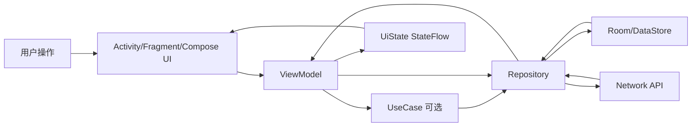
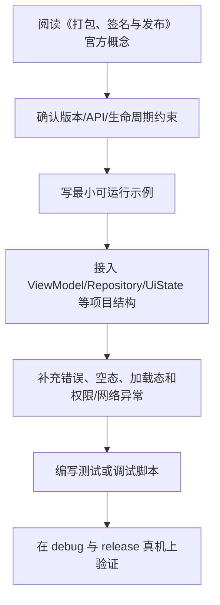

# 14. 打包、签名与发布

<!-- lecture-notes:integrated-v2 -->

## 讲义导读：把 Android 放进应用工程主线

这一章讲的是 **14. 打包、签名与发布**。Android 学习最怕碎片化：今天学一个控件，明天抄一段协程，后天改一个 Gradle 配置，但不知道它们怎样组成一款稳定应用。更好的读法是把每章都放进同一条主线：生命周期、状态、数据流、线程、权限、性能、测试和发布。

### 一句话先懂

发布不是点一下 Build，而是确认签名、混淆、资源压缩、权限、版本号、渠道、崩溃监控和回滚策略都正确。

### 通俗类比

打包发布像产品出厂：debug 包是样机，release 包是正式商品，签名是防伪章，R8 是压缩和整理，Play 审核是市场准入。

类比只是帮助建立直觉，不能替代准确概念。真正写代码时，要回到 Android 的平台规则：哪个组件拥有状态，代码在哪个生命周期内运行，是否在主线程，数据是否能恢复，权限是否足够，release 包是否还正常。

### 本章学习主线

1. **先看平台约束**：这个知识点受哪些 Android 版本、生命周期、权限、线程或构建规则影响？
2. **再看职责边界**：它应该放在 UI、ViewModel、UseCase、Repository、DataSource、Gradle 还是 Manifest？
3. **然后看状态流动**：用户事件如何进入系统，状态如何变化，UI 如何订阅，错误如何展示？
4. **接着看异常场景**：旋转屏幕、切后台、进程被杀、网络失败、权限拒绝、release 混淆后会怎样？
5. **最后看验证方式**：用单元测试、仪器测试、Compose UI Test、Logcat、Profiler、release 构建或真机验证证明它可靠。

### 概念怎么学才不容易忘

遇到一个 Android API，不要只记“怎么调用”。建议按“使用场景 -> 生命周期 -> 线程要求 -> 状态归属 -> 错误表现 -> 测试方法”六步理解。比如学 Flow，要问谁发射、谁收集、什么时候取消；学 Compose，要问状态在哪里、什么时候重组、副作用会不会重复；学权限，要问用户拒绝、永久拒绝和系统撤销后怎么办。

### 最小实践任务

生成一个 release 包，检查 versionCode、签名、R8、mapping 文件、权限清单和安装运行结果。

实践时要保留失败记录。Android 的很多能力只有在异常场景下才真正显形，例如旋转屏幕后状态丢失、后台恢复后重复请求、release 包混淆后崩溃、权限拒绝后流程卡死。把这些失败样本记录下来，比只保存成功代码更有价值。

### 读完本章应该能产出

能解释 APK/AAB、签名、keystore、R8、versionCode、versionName、mapping 和发布轨道；能做发布前检查清单。

> 本节是全篇讲义化改写的阅读入口，后续正文中的定义、步骤、示例和参考资料都应围绕这条学习主线来理解。

## APK 与 AAB

APK 是 Android 安装包。

AAB 是 Android App Bundle，Google Play 推荐使用。它允许平台按设备生成更合适的 APK，减少下载体积。

## Debug 与 Release

Debug：

- 可调试。
- 使用 debug 签名。
- 不适合发布。

Release：

- 用正式签名。
- 通常启用 R8。
- 需要完整测试。

## 应用签名

Android 应用必须签名。

Release 签名需要妥善保管：

- keystore。
- key alias。
- key password。
- store password。

不要把正式签名信息提交到仓库。

## 版本号

```kotlin
defaultConfig {
    versionCode = 2
    versionName = "1.1.0"
}
```

- `versionCode`：整数，发布新版本必须递增。
- `versionName`：展示给用户看的版本号。

## R8 与混淆

Release 中常启用：

```kotlin
buildTypes {
    release {
        isMinifyEnabled = true
        proguardFiles(
            getDefaultProguardFile("proguard-android-optimize.txt"),
            "proguard-rules.pro"
        )
    }
}
```

作用：

- 删除无用代码。
- 优化字节码。
- 混淆名称。
- 减小体积。

注意第三方库可能需要 keep 规则。

## 资源压缩

```kotlin
isShrinkResources = true
```

通常需要和 R8 一起使用。

## 构建变体

发布前要确认：

- API Base URL。
- 日志开关。
- 调试入口。
- 测试账号。
- 埋点配置。
- 隐私政策。
- 第三方 SDK 配置。

不要把 dev 环境配置打进 release。

## 发布前检查

- 版本号递增。
- Release 构建成功。
- 签名正确。
- R8 后功能正常。
- 关键流程测试通过。
- 权限声明合理。
- 隐私政策完整。
- 崩溃分析已接入。
- 性能和启动可接受。
- 多设备和多系统版本验证。

## Google Play 发布关注点

通常需要：

- 应用名称和描述。
- 图标和截图。
- 内容分级。
- 隐私政策。
- 数据安全表单。
- 目标 SDK 符合要求。
- AAB 包。

具体要求会变化，应以 Google Play Console 当前规则为准。

## 灰度与回滚

建议：

- 先内部测试。
- 再小流量灰度。
- 观察崩溃和关键指标。
- 逐步扩大发布。

Android 应用无法像服务端一样完全即时回滚，因此发布前测试和灰度很重要。

## 本章检查清单

- 是否知道 APK 和 AAB 的区别？
- 是否理解 versionCode 必须递增？
- 是否知道 release 签名要保密？
- 是否知道 R8 可能需要 keep 规则？
- 是否有发布前检查清单？

## 发布产物

| 产物 | 用途 | 说明 |
| --- | --- | --- |
| APK | 直接安装、内部测试、部分渠道 | 包含目标设备需要的所有资源和代码 |
| AAB | Google Play 推荐发布格式 | Play 根据设备生成优化 APK |
| Mapping 文件 | 崩溃符号还原 | 每个 release 版本必须保存 |
| Native symbols | NDK 崩溃符号还原 | 使用 C/C++ 时需要上传 |

发布到 Google Play 通常使用 AAB。国内多渠道分发仍可能需要 APK 或渠道包。

## 版本号规则

`versionCode` 是机器可比较的递增整数，发布新版本必须比旧版本大。

`versionName` 是给用户看的版本名，例如 `1.4.2`。

建议：

```kotlin
android {
    defaultConfig {
        versionCode = 10402
        versionName = "1.4.2"
    }
}
```

可以约定 `major * 10000 + minor * 100 + patch`，但要确保长期不会溢出或冲突。

## R8 与 keep 规则

R8 会做：

- 代码压缩。
- 资源压缩。
- 优化。
- 混淆。

常见需要 keep 的情况：

- 反射创建的类。
- 序列化框架特殊字段。
- WebView JavaScript Interface。
- 第三方 SDK 要求。
- JNI 方法。

原则：先使用库官方给出的规则，再基于 release 构建和崩溃日志补充，不要用过宽的 `-keep class ** { *; }` 直接放弃优化。

## 发布前检查清单

- `./gradlew test` 通过。
- 关键设备 UI 测试通过。
- Release 包可安装、可登录、核心流程可用。
- 版本号递增。
- 签名配置正确且密钥安全。
- R8 mapping 文件已归档。
- 崩溃、ANR、日志、埋点配置已接入。
- 隐私政策、权限说明、数据安全表单与代码一致。
- 不包含调试菜单、测试地址、测试账号、明文密钥。
- targetSdk 满足目标渠道当前要求。

## 灰度发布观察指标

灰度不是只看有没有崩溃。至少观察：

- Crash-free users。
- ANR 率。
- 登录成功率。
- 首页加载耗时。
- API 错误率。
- 支付、下单、同步等关键路径成功率。
- 用户反馈和客服问题。

发现严重问题时，优先暂停扩大灰度。移动端无法像服务端一样瞬间回滚所有用户，因此发布节奏要保守。

## 渠道和合规差异

不同渠道可能有不同要求：

- Google Play：AAB、target API、数据安全、内容政策。
- 国内应用商店：软著、隐私检测、权限说明、SDK 合规、加固要求。
- 企业内部分发：签名、MDM、安装来源和更新策略。

发布前以目标渠道当前后台要求为准，不要只依赖旧笔记。

---

## 万字精讲扩展（2026-06-16 更新）
> Last researched: 2026-06-16。本文补充内容以现代 Android 官方推荐实践为主；涉及 Android Studio、AGP、Kotlin、Compose、Jetpack、Play 政策和权限模型的内容，应在实际项目中继续核对最新官方文档。

### 本章在 Android 学习路线中的位置

《打包、签名与发布》是 Android 能力闭环中的一个环节。Android 开发不是只会写页面，也不是只会接接口，而是要同时处理生命周期、状态、数据、线程、权限、性能、测试和发布。学习本章时，建议把每个 API 都放到一个真实屏幕或真实功能里验证：用户怎样进入页面，状态从哪里来，数据怎样刷新，异常怎样展示，旋转和后台后是否恢复，release 包是否仍然正常。

本章学习完成后，至少应达到三个标准。第一，能说清相关组件的职责边界和生命周期边界。第二，能写出一个最小可运行例子，并知道它在完整项目中应该放在哪一层。第三，能设计一个失败场景验证自己的写法是否稳健。Android 的很多能力不是“写出来”，而是“在复杂状态下仍然正确”。

### 打包、签名与发布类笔记的精讲重点

发布是工程闭环的最后一段。Debug 包用于开发，Release 包需要签名、优化、混淆、资源压缩、版本号、权限检查、隐私合规和兼容测试。APK 是安装包，AAB 是 Google Play 推荐的发布格式。签名密钥必须安全保管，丢失或泄漏都会造成严重后果。版本号要区分 `versionCode` 和 `versionName`，前者用于升级顺序，后者用于展示。

R8 不只是混淆，还包括代码缩减和优化。开启 R8 后要测试反射、序列化、JNI、WebView JS bridge、第三方 SDK 和动态加载相关路径，必要时添加 keep 规则。发布前应跑 release 构建测试，而不是只测 debug。灰度发布和回滚策略可以降低线上风险。

### Android 学习的主线：生命周期、状态、数据流和边界

Android 学习最容易碎片化：今天学 Activity，明天学 Compose，后天学协程和 Room，但不知道这些东西怎样组合成一个稳定应用。更有效的主线是围绕四个问题建立框架。第一，组件什么时候创建、可见、可交互、暂停、销毁，这对应 Activity、Fragment、ViewModel、Lifecycle 和进程死亡。第二，状态放在哪里、谁拥有状态、UI 如何订阅状态、事件如何上行，这对应 MVVM、UI State、Compose state、StateFlow 和单向数据流。第三，数据从哪里来、如何缓存、如何离线、如何同步、错误如何表达，这对应 Repository、Room、DataStore、网络层和离线优先。第四，边界在哪里，包括线程边界、生命周期边界、模块边界、安全边界、测试边界和发布边界。

官方 Android 架构指南把 UI layer、可选 domain layer 和 data layer 作为推荐理解方式。UI 层负责展示应用数据并处理用户交互；数据层通过 repository 暴露应用数据，并组合本地、网络等数据源；domain 层不是每个应用必须有，主要用于复用复杂业务逻辑。学习时不要把“Clean Architecture 图”背成固定目录，而要理解依赖方向：UI 依赖业务抽象，业务不应该反向依赖具体 UI；数据实现可以被替换，调用方不应该到处知道 Retrofit、Room 或 DataStore 的细节。

### 一个现代 Android 应用的数据与状态闭环



Figure: Android 单向数据流和分层架构，综合 Android 官方 App Architecture、Data layer、Compose state 和 lifecycle-aware coroutines 文档整理。

这个闭环说明：UI 不应该直接拼网络请求和数据库查询；ViewModel 不应该持有 Activity 引用；Repository 不应该返回与界面强绑定的 View 对象；Composable 不应该在重组过程中直接执行不可控副作用；生命周期相关收集应该使用 lifecycle-aware API；本地缓存和远程同步应由数据层统一协调。只要这个闭环清楚，很多 API 的选择就会自然起来。

### 学 Android 要建立版本和政策意识

Android 是一个快速演进的平台。API Level、Android Gradle Plugin、Kotlin、Compose Compiler、Jetpack 库、Play 政策、权限模型、后台限制和隐私要求都会变化。因此笔记里不应只写“某 API 怎么用”，还要写“适用版本、替代方案、官方推荐状态、迁移风险”。例如运行时权限、通知权限、前台服务、后台定位、存储访问、exported 组件、明文网络、签名和 targetSdk 都和平台版本或政策强相关。做项目时必须查最新官方文档，而不是只依赖旧博客。

### 最小实战闭环

建议每个阶段都围绕一个小应用反复迭代，例如待办清单、记账、阅读列表、天气、RSS、课程表或离线笔记。第一版只做单 Activity + Compose UI；第二版加入 ViewModel 和 UiState；第三版加入 Room 或 DataStore；第四版加入网络层和 Repository；第五版加入 WorkManager 同步；第六版加入测试、性能分析、R8、签名和发布检查。这样每个知识点都会在同一个项目里发生关系，而不是停留在零散 demo。

### 核心知识点逐条精讲

#### 1. APK 与 AAB

在《打包、签名与发布》里，`APK 与 AAB` 需要从“平台约束、代码写法、生命周期、测试和线上风险”五个角度理解。Android 不是普通 JVM 程序，它运行在移动设备、受系统生命周期和权限模型约束，随时可能经历旋转、后台、进程回收、权限撤销、网络变化和系统版本差异。学习任何 API 时都要问：它在哪个生命周期内有效，是否需要主线程，是否会泄漏 Context，是否能被测试，失败后用户看到什么。

实践中建议把 `APK 与 AAB` 写成可执行规则。例如“在 ViewModel 暴露不可变 UiState，UI 只收集状态并上报事件”，“Repository 负责组合本地和远程数据源，UI 不直接调用 DAO 或 Retrofit”，“Fragment 只在 viewLifecycleOwner 范围内访问 View”，“Compose 副作用必须放进受控 Effect API”，“release 包必须开启并验证 R8 相关路径”。这些规则比单纯记住 API 名称更能防止真实项目出错。

判断 `APK 与 AAB` 是否掌握，可以用三个问题：能否写出最小代码；能否说清错误使用会导致什么现象；能否设计测试或调试方法证明它工作正常。比如只会写权限申请代码还不够，还要知道用户拒绝、永久拒绝、系统自动撤销权限、targetSdk 变化时怎样处理。Android 工程能力来自这些边界判断，而不是来自 API 列表背诵。

#### 2. Debug 与 Release

在《打包、签名与发布》里，`Debug 与 Release` 需要从“平台约束、代码写法、生命周期、测试和线上风险”五个角度理解。Android 不是普通 JVM 程序，它运行在移动设备、受系统生命周期和权限模型约束，随时可能经历旋转、后台、进程回收、权限撤销、网络变化和系统版本差异。学习任何 API 时都要问：它在哪个生命周期内有效，是否需要主线程，是否会泄漏 Context，是否能被测试，失败后用户看到什么。

实践中建议把 `Debug 与 Release` 写成可执行规则。例如“在 ViewModel 暴露不可变 UiState，UI 只收集状态并上报事件”，“Repository 负责组合本地和远程数据源，UI 不直接调用 DAO 或 Retrofit”，“Fragment 只在 viewLifecycleOwner 范围内访问 View”，“Compose 副作用必须放进受控 Effect API”，“release 包必须开启并验证 R8 相关路径”。这些规则比单纯记住 API 名称更能防止真实项目出错。

判断 `Debug 与 Release` 是否掌握，可以用三个问题：能否写出最小代码；能否说清错误使用会导致什么现象；能否设计测试或调试方法证明它工作正常。比如只会写权限申请代码还不够，还要知道用户拒绝、永久拒绝、系统自动撤销权限、targetSdk 变化时怎样处理。Android 工程能力来自这些边界判断，而不是来自 API 列表背诵。

#### 3. 应用签名

在《打包、签名与发布》里，`应用签名` 需要从“平台约束、代码写法、生命周期、测试和线上风险”五个角度理解。Android 不是普通 JVM 程序，它运行在移动设备、受系统生命周期和权限模型约束，随时可能经历旋转、后台、进程回收、权限撤销、网络变化和系统版本差异。学习任何 API 时都要问：它在哪个生命周期内有效，是否需要主线程，是否会泄漏 Context，是否能被测试，失败后用户看到什么。

实践中建议把 `应用签名` 写成可执行规则。例如“在 ViewModel 暴露不可变 UiState，UI 只收集状态并上报事件”，“Repository 负责组合本地和远程数据源，UI 不直接调用 DAO 或 Retrofit”，“Fragment 只在 viewLifecycleOwner 范围内访问 View”，“Compose 副作用必须放进受控 Effect API”，“release 包必须开启并验证 R8 相关路径”。这些规则比单纯记住 API 名称更能防止真实项目出错。

判断 `应用签名` 是否掌握，可以用三个问题：能否写出最小代码；能否说清错误使用会导致什么现象；能否设计测试或调试方法证明它工作正常。比如只会写权限申请代码还不够，还要知道用户拒绝、永久拒绝、系统自动撤销权限、targetSdk 变化时怎样处理。Android 工程能力来自这些边界判断，而不是来自 API 列表背诵。

#### 4. R8 与资源压缩

在《打包、签名与发布》里，`R8 与资源压缩` 需要从“平台约束、代码写法、生命周期、测试和线上风险”五个角度理解。Android 不是普通 JVM 程序，它运行在移动设备、受系统生命周期和权限模型约束，随时可能经历旋转、后台、进程回收、权限撤销、网络变化和系统版本差异。学习任何 API 时都要问：它在哪个生命周期内有效，是否需要主线程，是否会泄漏 Context，是否能被测试，失败后用户看到什么。

实践中建议把 `R8 与资源压缩` 写成可执行规则。例如“在 ViewModel 暴露不可变 UiState，UI 只收集状态并上报事件”，“Repository 负责组合本地和远程数据源，UI 不直接调用 DAO 或 Retrofit”，“Fragment 只在 viewLifecycleOwner 范围内访问 View”，“Compose 副作用必须放进受控 Effect API”，“release 包必须开启并验证 R8 相关路径”。这些规则比单纯记住 API 名称更能防止真实项目出错。

判断 `R8 与资源压缩` 是否掌握，可以用三个问题：能否写出最小代码；能否说清错误使用会导致什么现象；能否设计测试或调试方法证明它工作正常。比如只会写权限申请代码还不够，还要知道用户拒绝、永久拒绝、系统自动撤销权限、targetSdk 变化时怎样处理。Android 工程能力来自这些边界判断，而不是来自 API 列表背诵。

#### 5. 灰度发布和回滚

在《打包、签名与发布》里，`灰度发布和回滚` 需要从“平台约束、代码写法、生命周期、测试和线上风险”五个角度理解。Android 不是普通 JVM 程序，它运行在移动设备、受系统生命周期和权限模型约束，随时可能经历旋转、后台、进程回收、权限撤销、网络变化和系统版本差异。学习任何 API 时都要问：它在哪个生命周期内有效，是否需要主线程，是否会泄漏 Context，是否能被测试，失败后用户看到什么。

实践中建议把 `灰度发布和回滚` 写成可执行规则。例如“在 ViewModel 暴露不可变 UiState，UI 只收集状态并上报事件”，“Repository 负责组合本地和远程数据源，UI 不直接调用 DAO 或 Retrofit”，“Fragment 只在 viewLifecycleOwner 范围内访问 View”，“Compose 副作用必须放进受控 Effect API”，“release 包必须开启并验证 R8 相关路径”。这些规则比单纯记住 API 名称更能防止真实项目出错。

判断 `灰度发布和回滚` 是否掌握，可以用三个问题：能否写出最小代码；能否说清错误使用会导致什么现象；能否设计测试或调试方法证明它工作正常。比如只会写权限申请代码还不够，还要知道用户拒绝、永久拒绝、系统自动撤销权限、targetSdk 变化时怎样处理。Android 工程能力来自这些边界判断，而不是来自 API 列表背诵。


### 场景化学习与排错表

| 主题 | 推荐动作 | 常见风险 | 验证方式 |
| :--- | :--- | :--- | :--- |
| APK 与 AAB | 先查官方文档和版本要求，再写最小 demo，最后放入项目闭环验证 | 生命周期错位、Context 泄漏、线程错误、版本差异、只测 debug | 单元测试、仪器测试、Logcat、Profiler、release 构建和真机验证 |
| Debug 与 Release | 先查官方文档和版本要求，再写最小 demo，最后放入项目闭环验证 | 生命周期错位、Context 泄漏、线程错误、版本差异、只测 debug | 单元测试、仪器测试、Logcat、Profiler、release 构建和真机验证 |
| 应用签名 | 先查官方文档和版本要求，再写最小 demo，最后放入项目闭环验证 | 生命周期错位、Context 泄漏、线程错误、版本差异、只测 debug | 单元测试、仪器测试、Logcat、Profiler、release 构建和真机验证 |
| R8 与资源压缩 | 先查官方文档和版本要求，再写最小 demo，最后放入项目闭环验证 | 生命周期错位、Context 泄漏、线程错误、版本差异、只测 debug | 单元测试、仪器测试、Logcat、Profiler、release 构建和真机验证 |
| 灰度发布和回滚 | 先查官方文档和版本要求，再写最小 demo，最后放入项目闭环验证 | 生命周期错位、Context 泄漏、线程错误、版本差异、只测 debug | 单元测试、仪器测试、Logcat、Profiler、release 构建和真机验证 |

表格中的推荐动作强调“官方依据 + 最小验证 + 项目闭环”。Android 生态变化快，旧博客里的写法可能已经被官方替代，或者只适用于某个 API Level、某个 Jetpack 版本。遇到冲突时，优先查 Android Developers、Kotlin、Gradle 和库的 release notes，再参考社区经验。

### 本章建议工作流



Figure: 《打包、签名与发布》学习工作流，综合 Android 官方架构、Compose、Lifecycle、Coroutines、Data layer、Performance 和 Release 文档整理。

这个工作流避免两个极端：只看文档不落地，或者只复制 demo 不理解边界。Android 很多 bug 只在生命周期切换、后台恢复、低内存、release 混淆、慢网络、权限拒绝或特定系统版本中出现，所以最小 demo 跑通以后，还要放回完整应用场景验证。

### 常见误区和纠正方法

- 误区：Activity/Fragment 里堆所有逻辑。纠正：UI 组件负责展示和事件，状态放 ViewModel，数据访问放 Repository，复杂复用逻辑再考虑 UseCase。
- 误区：只测 debug，不测 release。纠正：R8、资源压缩、签名、网络安全配置和 build variants 可能让 release 行为不同，发布前必须验证 release 包。
- 误区：忽略生命周期。纠正：Flow 收集、回调注册、binding、协程、导航和副作用都要绑定正确 lifecycle。
- 误区：把 Compose 当成简单 XML 替代。纠正：Compose 的核心是状态驱动 UI、可组合函数、重组、副作用控制和稳定性。
- 误区：权限申请只看成功路径。纠正：必须处理拒绝、永久拒绝、功能降级、隐私说明、targetSdk 变化和系统自动撤销。
- 误区：看到性能问题就先优化代码。纠正：先用 Profiler、Baseline Profile、启动指标、帧时间、内存快照和日志定位瓶颈。

### 与相邻章节的关系

《打包、签名与发布》应和其他章节联动阅读。项目结构决定依赖和构建变体，Kotlin 决定状态和异步表达方式，生命周期决定 UI 和协程边界，Compose 决定状态和副作用组织，架构决定依赖方向，数据层决定离线和同步能力，测试和发布决定应用能否可靠交付。任何一个主题脱离这些关系，都容易变成 demo 级知识。

### 实操训练和复盘模板

1. 围绕 `APK 与 AAB` 做一个小任务：写最小实现、制造一个失败场景、记录修复方法。
2. 围绕 `Debug 与 Release` 做一个小任务：写最小实现、制造一个失败场景、记录修复方法。
3. 围绕 `应用签名` 做一个小任务：写最小实现、制造一个失败场景、记录修复方法。
4. 围绕 `R8 与资源压缩` 做一个小任务：写最小实现、制造一个失败场景、记录修复方法。
5. 围绕 `灰度发布和回滚` 做一个小任务：写最小实现、制造一个失败场景、记录修复方法。

建议每次练习都按下面格式记录：

```text
练习名称：
本章主题：打包、签名与发布
目标 API / 组件：
版本信息：Android Studio、AGP、Kotlin、compileSdk、minSdk、targetSdk、相关 Jetpack 版本
最小实现：
生命周期和线程边界：
失败场景：旋转、后台、进程死亡、断网、权限拒绝、release 混淆等
调试证据：Logcat、断点、Profiler、截图、测试结果
最终规则：以后项目中如何写，什么情况下不能这样写
```

这个模板能把“会用 API”推进到“知道边界”。很多 Android 问题第一次看像偶发 bug，复盘后会发现是生命周期、状态持有、线程、权限、缓存或构建变体没有设计清楚。


### 2026 版本核对补充

Android 工程资料必须带版本意识。根据 Android Developers 当前文档，Android Studio 与 Android Gradle Plugin 采用按时间窗口维护的兼容策略，AGP 9.x 已进入官方文档范围；AGP 9.0 起还引入了内置 Kotlin 支持相关变化。学习或迁移项目时，不要只复制旧教程里的插件版本，而要同时核对 Android Studio、AGP、Gradle、Kotlin、KSP、compileSdk、targetSdk 和 Compose/Jetpack 版本。一个构建问题看起来像代码错误，根因可能是插件版本、仓库、缓存、JDK、Kotlin 编译器或依赖传递冲突。

隐私和安全也需要按当前官方清单复核。权限申请应遵循最小化原则，敏感数据收集要和 Google Play Data safety 表单、运行时权限说明、第三方 SDK 数据行为保持一致。换句话说，Android 学习不能只停在“API 能不能调用”，还要问“这个调用在当前 targetSdk、当前政策、当前用户授权状态下是否允许，失败后用户看到什么”。
## 参考资料与延伸阅读

- [Official / Android] Guide to app architecture: https://developer.android.com/topic/architecture
- [Official / Android] UI layer: https://developer.android.com/topic/architecture/ui-layer
- [Official / Android] Data layer: https://developer.android.com/topic/architecture/data-layer
- [Official / Android] Domain layer: https://developer.android.com/topic/architecture/domain-layer
- [Official / Android] Build an offline-first app: https://developer.android.com/topic/architecture/data-layer/offline-first
- [Official / Android] Configure your build: https://developer.android.com/build
- [Official / Android] Add build dependencies: https://developer.android.com/build/dependencies
- [Official / Android] Fragment lifecycle: https://developer.android.com/guide/fragments/lifecycle
- [Official / Android] Saved State module for ViewModel: https://developer.android.com/topic/libraries/architecture/viewmodel/viewmodel-savedstate
- [Official / Android] State and Jetpack Compose: https://developer.android.com/develop/ui/compose/state
- [Official / Android] Side-effects in Compose: https://developer.android.com/develop/ui/compose/side-effects
- [Official / Android] Jetpack Compose performance: https://developer.android.com/develop/ui/compose/performance
- [Official / Android] Stability in Compose: https://developer.android.com/develop/ui/compose/performance/stability
- [Official / Android] Kotlin coroutines on Android: https://developer.android.com/kotlin/coroutines
- [Official / Android] Kotlin flows on Android: https://developer.android.com/kotlin/flow
- [Official / Android] Use Kotlin coroutines with lifecycle-aware components: https://developer.android.com/topic/libraries/architecture/coroutines
- [Official / Android] Dependency injection with Hilt: https://developer.android.com/training/dependency-injection/hilt-android
- [Official / Android] Network security configuration: https://developer.android.com/privacy-and-security/security-config
- [Official / Android] Enable app optimization with R8: https://developer.android.com/topic/performance/app-optimization/enable-app-optimization
- [Official / Android] Baseline Profiles overview: https://developer.android.com/topic/performance/baselineprofiles/overview
- [Official / Google Codelab] Improve app performance with Baseline Profiles: https://codelabs.developers.google.com/android-baseline-profiles-improve
- [Official / Kotlin] Kotlin documentation: https://kotlinlang.org/docs/home.html
- [Official / Kotlin] Sealed classes and interfaces: https://kotlinlang.org/docs/sealed-classes.html
- [Official / Kotlin] Configure a Gradle project: https://kotlinlang.org/docs/gradle-configure-project.html
- [Official / Android] Architecture recommendations: https://developer.android.com/topic/architecture/recommendations
- [Official / Android] State holders and UI state: https://developer.android.com/topic/architecture/ui-layer/stateholders
- [Official / Android] Gradle build overview: https://developer.android.com/build/gradle-build-overview
- [Official / Android] About Android Gradle Plugin: https://developer.android.com/build/releases/about-agp
- [Official / Android] Android Gradle Plugin 9.1 release notes: https://developer.android.com/build/releases/agp-9-1-0-release-notes
- [Official / Android] Android Gradle Plugin 9.0 release notes: https://developer.android.com/build/releases/agp-9-0-0-release-notes
- [Official / Android] Security checklist: https://developer.android.com/privacy-and-security/security-tips
- [Official / Android] Privacy checklist: https://developer.android.com/privacy-and-security/about
- [Official / Android] Minimize permission requests: https://developer.android.com/privacy-and-security/minimize-permission-requests
- [Official / Android] Declare your app's data use: https://developer.android.com/privacy-and-security/declare-data-use- [Official / Gradle] Gradle Kotlin DSL Primer: https://docs.gradle.org/current/userguide/kotlin_dsl.html
- [Security / OWASP] Android Network Security Configuration: https://mas.owasp.org/MASTG/knowledge/android/MASVS-NETWORK/MASTG-KNOW-0014/
- [Blog / Android Developers] Rebuilding our guide to app architecture: https://android-developers.googleblog.com/2021/12/rebuilding-our-guide-to-app-architecture.html
- [Blog / Android Developers] Improving Performance with Baseline Profiles: https://medium.com/androiddevelopers/improving-performance-with-baseline-profiles-fdd0db0d8cc6
- [Community / CSDN] Android 学习笔记检索入口: https://so.csdn.net/so/search?q=Android%20%E5%AD%A6%E4%B9%A0%E7%AC%94%E8%AE%B0%20Jetpack%20Compose
- [Community / 博客园] Android 架构与 Jetpack 笔记检索入口: https://zzk.cnblogs.com/s/blogpost?Keywords=Android%20Jetpack%20MVVM%20Compose
- [Community / 掘金] Android Compose / 协程 / 架构实践检索入口: https://juejin.cn/search?query=Android%20Compose%20%E5%8D%8F%E7%A8%8B%20%E6%9E%B6%E6%9E%84&type=0
