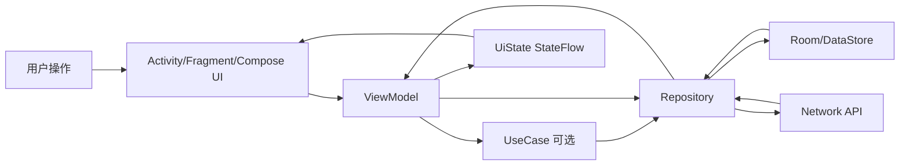
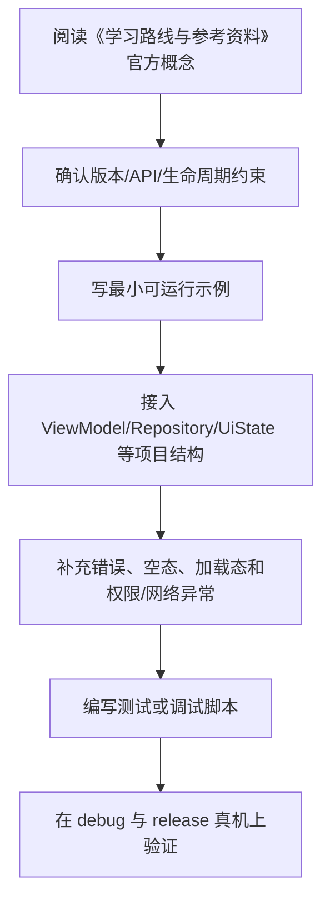

# 15. 学习路线与参考资料

## 阶段一：Android 基础

目标：能创建并运行简单 App。

学习内容：

- Android Studio。
- Gradle 基础。
- Manifest。
- Activity。
- 资源系统。
- Logcat。
- 基本调试。

练习：

- 简单计数器。
- 单页表单。
- 多语言字符串资源。

## 阶段二：Kotlin 与 UI

目标：能写基本界面和状态交互。

学习内容：

- Kotlin 空安全。
- data class。
- sealed 类型。
- Compose 基础。
- Material 3。
- 状态提升。
- LazyColumn。

练习：

- 待办列表。
- 搜索过滤。
- 表单校验。

## 阶段三：架构与数据

目标：能写可维护的中小型应用。

学习内容：

- MVVM。
- ViewModel。
- UI State。
- Repository。
- Room。
- DataStore。
- Retrofit / Ktor。
- 错误处理。

练习：

- 离线优先笔记 App。
- 用户列表和详情页。
- 设置页。

## 阶段四：协程与 Jetpack

目标：能处理异步数据流和后台任务。

学习内容：

- Coroutines。
- Flow。
- StateFlow。
- SharedFlow。
- Navigation。
- WorkManager。
- Paging。
- Hilt 或 Koin。

练习：

- 分页列表。
- 后台同步。
- 多页面导航。

## 阶段五：生产能力

目标：能发布和维护真实应用。

学习内容：

- 单元测试。
- Compose UI Test。
- Profiler。
- 性能优化。
- 权限安全。
- R8。
- 签名。
- AAB 发布。
- 崩溃分析。

练习：

- 完整 release 构建。
- 接入测试和 CI。
- 做一次灰度发布演练。

## 推荐实战项目

### 离线优先笔记 App

功能：

- 笔记列表。
- 创建编辑删除。
- Room 存储。
- DataStore 设置。
- 搜索。
- Compose UI。
- ViewModel 状态管理。

进阶：

- 云端同步。
- WorkManager 后台同步。
- 冲突解决。
- 测试覆盖。

### 新闻阅读 App

功能：

- API 请求。
- 列表分页。
- 详情页。
- 收藏。
- 离线缓存。

进阶：

- Paging。
- Room + RemoteMediator。
- 错误重试。
- 深色模式。

### 个人记账 App

功能：

- 账单录入。
- 分类统计。
- 图表。
- 本地数据库。
- 设置页。

进阶：

- 数据导出。
- 预算提醒。
- 后台通知。

## 面试复习重点

- Activity 生命周期。
- Fragment View 生命周期。
- ViewModel 作用。
- Compose 重组。
- 状态提升。
- StateFlow 与 SharedFlow。
- 协程结构化并发。
- Room 和 DataStore 区别。
- Repository 模式。
- MVVM 数据流。
- Hilt 依赖注入。
- WorkManager 使用场景。
- Android 权限。
- 内存泄漏。
- ANR。
- R8 与混淆。

## 分阶段项目路线

### 项目一：单机待办 App

目标：掌握 Compose、状态和基础 ViewModel。

要求：

- 列表、新增、编辑、删除、完成状态。
- `TodoUiState` 使用不可变 data class。
- ViewModel 暴露 `StateFlow`。
- Composable 只接收状态和事件 lambda。
- 至少写 3 个 ViewModel 单元测试。

不要一开始接入网络和复杂架构，先把 UI 状态流跑顺。

### 项目二：离线优先笔记 App

目标：掌握 Room、DataStore、Repository 和错误处理。

要求：

- Room 保存笔记。
- DataStore 保存主题、排序方式。
- Repository 屏蔽本地数据源。
- 搜索和排序由数据库或 Repository 提供。
- 数据库迁移有测试。

进阶：

- 增加标签、多条件筛选。
- 增加导入导出。
- 增加暗色模式和多语言。

### 项目三：网络 + 缓存新闻 App

目标：掌握网络、分页、缓存和失败兜底。

要求：

- Retrofit 或 Ktor 请求 API。
- DTO、Entity、Domain、UI Model 分离。
- Room 作为本地缓存。
- 首页优先展示缓存，再后台刷新。
- 网络错误映射为统一 `AppError`。

进阶：

- Paging 3。
- `RemoteMediator`。
- 收藏离线可用。
- 下拉刷新和错误重试。

### 项目四：生产化练习

目标：掌握发布前工程能力。

要求：

- Debug / staging / release 构建变体。
- R8 开启并验证 release 包。
- 崩溃和 ANR 监控。
- Macrobenchmark 或启动耗时记录。
- 隐私政策、权限说明、数据安全表单检查。
- 内部测试、灰度发布和版本回滚预案。

## 面试回答框架

| 问题 | 回答时应覆盖 |
| --- | --- |
| MVVM 是什么 | View 只展示状态，ViewModel 管理 UI State 和事件，Model / Repository 提供数据 |
| Clean Architecture 有什么价值 | 依赖方向、测试边界、业务复用；Domain 是可选层，不应过度设计 |
| Compose 为什么会重组 | 状态读取发生变化后，相关 Composable 重新执行以计算新 UI |
| `remember` 和 `rememberSaveable` 区别 | 前者跨重组，后者还能跨配置变更等可保存场景 |
| StateFlow 和 SharedFlow 区别 | StateFlow 有当前值，适合状态；SharedFlow 可用于事件或广播 |
| Room 和 DataStore 区别 | Room 适合结构化关系数据和查询，DataStore 适合小型偏好配置 |
| WorkManager 使用场景 | 可延迟、可约束、需可靠执行的后台任务，不是精确定时器 |
| ANR 如何排查 | 看主线程堆栈、耗时 IO、锁竞争、启动初始化、广播耗时 |
| R8 有什么风险 | 反射、序列化、JNI、JS Bridge、第三方 SDK 可能需要 keep 规则 |

## 版本与政策注意

Android 版本、Android Gradle Plugin、Kotlin、Compose BOM、Google Play target API 要求都会变化。最后核对日期：2026-06-13。

截至本次核对，Google Play 要求新应用和应用更新通常需要 target Android 15（API level 35）或更高，Wear OS、Android Automotive OS、Android TV 有例外规则。发布前必须以 Google Play Console 和官方 target API 页面为准。

建议每次升级前检查：

- Android Studio 稳定版和 AGP release notes。
- Gradle 与 JDK 兼容性。
- Kotlin 与 Compose Compiler / Compose BOM 兼容性。
- AndroidX release notes。
- targetSdk 行为变更。
- 权限、隐私、后台任务、通知、照片访问等平台行为变更。
- Google Play 政策和数据安全表单要求。

## 官方参考资料

- [Android Developers](https://developer.android.com/)
- [Android app architecture guide](https://developer.android.com/topic/architecture)
- [UI layer](https://developer.android.com/topic/architecture/ui-layer)
- [Data layer](https://developer.android.com/topic/architecture/data-layer)
- [Jetpack Compose](https://developer.android.com/compose)
- [Compose state](https://developer.android.com/develop/ui/compose/state)
- [Compose side effects](https://developer.android.com/develop/ui/compose/side-effects)
- [Android Kotlin guides](https://developer.android.com/kotlin)
- [Kotlin Coroutines on Android](https://developer.android.com/kotlin/coroutines)
- [Kotlin Flow on Android](https://developer.android.com/kotlin/flow)
- [Lifecycle-aware coroutines](https://developer.android.com/topic/libraries/architecture/coroutines)
- [Android Gradle Plugin](https://developer.android.com/build)
- [Material Design](https://m3.material.io/)
- [Codelabs](https://developer.android.com/codelabs)
- [Android testing fundamentals](https://developer.android.com/training/testing/fundamentals)
- [Compose testing](https://developer.android.com/develop/ui/compose/testing)
- [Performance guide](https://developer.android.com/topic/performance)
- [Baseline Profiles](https://developer.android.com/topic/performance/baselineprofiles/overview)
- [R8 app optimization](https://developer.android.com/topic/performance/app-optimization/enable-app-optimization)
- [Build for release](https://developer.android.com/build/build-for-release)
- [Google Play target API requirements](https://developer.android.com/google/play/requirements/target-sdk)

## 中文与社区实践资料

以下资料适合补充工程经验、常见坑和实践视角。涉及版本、政策、API 行为时仍以官方文档为准。

- Android Developers Blog：https://android-developers.googleblog.com/
- Android Architecture 官方课程：https://developer.android.com/courses/pathways/android-architecture
- AndroidX release notes：https://developer.android.com/jetpack/androidx/versions/all-channel
- 掘金 Android 专栏：https://juejin.cn/android
- CSDN Android 专区：https://blog.csdn.net/nav/android
- 博客园 Android 分类：https://www.cnblogs.com/cate/android/
- SegmentFault Android：https://segmentfault.com/t/android
- ProAndroidDev：https://proandroiddev.com/

## 持续更新建议

Android 生态变化很快，建议定期检查：

- Android Studio 和 AGP 版本。
- targetSdk 要求。
- Compose BOM。
- Kotlin 版本。
- Jetpack 组件版本。
- Google Play 发布规则。
- 权限和隐私要求。

更新笔记时优先更新：

- Gradle 配置示例。
- targetSdk 和权限变化。
- Compose API。
- 架构推荐实践。
- 发布和数据安全要求。

---

## 万字精讲扩展（2026-06-16 更新）
> Last researched: 2026-06-16。本文补充内容以现代 Android 官方推荐实践为主；涉及 Android Studio、AGP、Kotlin、Compose、Jetpack、Play 政策和权限模型的内容，应在实际项目中继续核对最新官方文档。

### 本章在 Android 学习路线中的位置

《学习路线与参考资料》是 Android 能力闭环中的一个环节。Android 开发不是只会写页面，也不是只会接接口，而是要同时处理生命周期、状态、数据、线程、权限、性能、测试和发布。学习本章时，建议把每个 API 都放到一个真实屏幕或真实功能里验证：用户怎样进入页面，状态从哪里来，数据怎样刷新，异常怎样展示，旋转和后台后是否恢复，release 包是否仍然正常。

本章学习完成后，至少应达到三个标准。第一，能说清相关组件的职责边界和生命周期边界。第二，能写出一个最小可运行例子，并知道它在完整项目中应该放在哪一层。第三，能设计一个失败场景验证自己的写法是否稳健。Android 的很多能力不是“写出来”，而是“在复杂状态下仍然正确”。

### 路线与总览类笔记的精讲重点

路线类章节的核心不是列技术名词，而是规划能力闭环。Android 初学者应先掌握项目能跑、页面能显示、状态能变化、数据能保存、网络能请求、错误能处理、应用能发布。等这些闭环完成后，再逐步学习模块化、离线优先、性能优化、测试体系和安全合规。只学单个库而没有完整项目，很容易出现“会写 demo，不会做产品”的问题。

阅读顺序建议从基础环境和项目结构开始，再到 Kotlin、生命周期、UI、状态、架构、数据、协程、Jetpack、权限安全、性能、测试和发布。每一阶段都应该配一个小任务，不要只看文档。比如学完数据层就做离线缓存，学完协程就处理取消和异常，学完发布就真的打一个 release 包并检查签名和混淆。

### Android 学习的主线：生命周期、状态、数据流和边界

Android 学习最容易碎片化：今天学 Activity，明天学 Compose，后天学协程和 Room，但不知道这些东西怎样组合成一个稳定应用。更有效的主线是围绕四个问题建立框架。第一，组件什么时候创建、可见、可交互、暂停、销毁，这对应 Activity、Fragment、ViewModel、Lifecycle 和进程死亡。第二，状态放在哪里、谁拥有状态、UI 如何订阅状态、事件如何上行，这对应 MVVM、UI State、Compose state、StateFlow 和单向数据流。第三，数据从哪里来、如何缓存、如何离线、如何同步、错误如何表达，这对应 Repository、Room、DataStore、网络层和离线优先。第四，边界在哪里，包括线程边界、生命周期边界、模块边界、安全边界、测试边界和发布边界。

官方 Android 架构指南把 UI layer、可选 domain layer 和 data layer 作为推荐理解方式。UI 层负责展示应用数据并处理用户交互；数据层通过 repository 暴露应用数据，并组合本地、网络等数据源；domain 层不是每个应用必须有，主要用于复用复杂业务逻辑。学习时不要把“Clean Architecture 图”背成固定目录，而要理解依赖方向：UI 依赖业务抽象，业务不应该反向依赖具体 UI；数据实现可以被替换，调用方不应该到处知道 Retrofit、Room 或 DataStore 的细节。

### 一个现代 Android 应用的数据与状态闭环



Figure: Android 单向数据流和分层架构，综合 Android 官方 App Architecture、Data layer、Compose state 和 lifecycle-aware coroutines 文档整理。

这个闭环说明：UI 不应该直接拼网络请求和数据库查询；ViewModel 不应该持有 Activity 引用；Repository 不应该返回与界面强绑定的 View 对象；Composable 不应该在重组过程中直接执行不可控副作用；生命周期相关收集应该使用 lifecycle-aware API；本地缓存和远程同步应由数据层统一协调。只要这个闭环清楚，很多 API 的选择就会自然起来。

### 学 Android 要建立版本和政策意识

Android 是一个快速演进的平台。API Level、Android Gradle Plugin、Kotlin、Compose Compiler、Jetpack 库、Play 政策、权限模型、后台限制和隐私要求都会变化。因此笔记里不应只写“某 API 怎么用”，还要写“适用版本、替代方案、官方推荐状态、迁移风险”。例如运行时权限、通知权限、前台服务、后台定位、存储访问、exported 组件、明文网络、签名和 targetSdk 都和平台版本或政策强相关。做项目时必须查最新官方文档，而不是只依赖旧博客。

### 最小实战闭环

建议每个阶段都围绕一个小应用反复迭代，例如待办清单、记账、阅读列表、天气、RSS、课程表或离线笔记。第一版只做单 Activity + Compose UI；第二版加入 ViewModel 和 UiState；第三版加入 Room 或 DataStore；第四版加入网络层和 Repository；第五版加入 WorkManager 同步；第六版加入测试、性能分析、R8、签名和发布检查。这样每个知识点都会在同一个项目里发生关系，而不是停留在零散 demo。

### 核心知识点逐条精讲

#### 1. 阶段路线

在《学习路线与参考资料》里，`阶段路线` 需要从“平台约束、代码写法、生命周期、测试和线上风险”五个角度理解。Android 不是普通 JVM 程序，它运行在移动设备、受系统生命周期和权限模型约束，随时可能经历旋转、后台、进程回收、权限撤销、网络变化和系统版本差异。学习任何 API 时都要问：它在哪个生命周期内有效，是否需要主线程，是否会泄漏 Context，是否能被测试，失败后用户看到什么。

实践中建议把 `阶段路线` 写成可执行规则。例如“在 ViewModel 暴露不可变 UiState，UI 只收集状态并上报事件”，“Repository 负责组合本地和远程数据源，UI 不直接调用 DAO 或 Retrofit”，“Fragment 只在 viewLifecycleOwner 范围内访问 View”，“Compose 副作用必须放进受控 Effect API”，“release 包必须开启并验证 R8 相关路径”。这些规则比单纯记住 API 名称更能防止真实项目出错。

判断 `阶段路线` 是否掌握，可以用三个问题：能否写出最小代码；能否说清错误使用会导致什么现象；能否设计测试或调试方法证明它工作正常。比如只会写权限申请代码还不够，还要知道用户拒绝、永久拒绝、系统自动撤销权限、targetSdk 变化时怎样处理。Android 工程能力来自这些边界判断，而不是来自 API 列表背诵。

#### 2. 实战项目

在《学习路线与参考资料》里，`实战项目` 需要从“平台约束、代码写法、生命周期、测试和线上风险”五个角度理解。Android 不是普通 JVM 程序，它运行在移动设备、受系统生命周期和权限模型约束，随时可能经历旋转、后台、进程回收、权限撤销、网络变化和系统版本差异。学习任何 API 时都要问：它在哪个生命周期内有效，是否需要主线程，是否会泄漏 Context，是否能被测试，失败后用户看到什么。

实践中建议把 `实战项目` 写成可执行规则。例如“在 ViewModel 暴露不可变 UiState，UI 只收集状态并上报事件”，“Repository 负责组合本地和远程数据源，UI 不直接调用 DAO 或 Retrofit”，“Fragment 只在 viewLifecycleOwner 范围内访问 View”，“Compose 副作用必须放进受控 Effect API”，“release 包必须开启并验证 R8 相关路径”。这些规则比单纯记住 API 名称更能防止真实项目出错。

判断 `实战项目` 是否掌握，可以用三个问题：能否写出最小代码；能否说清错误使用会导致什么现象；能否设计测试或调试方法证明它工作正常。比如只会写权限申请代码还不够，还要知道用户拒绝、永久拒绝、系统自动撤销权限、targetSdk 变化时怎样处理。Android 工程能力来自这些边界判断，而不是来自 API 列表背诵。

#### 3. 面试复习

在《学习路线与参考资料》里，`面试复习` 需要从“平台约束、代码写法、生命周期、测试和线上风险”五个角度理解。Android 不是普通 JVM 程序，它运行在移动设备、受系统生命周期和权限模型约束，随时可能经历旋转、后台、进程回收、权限撤销、网络变化和系统版本差异。学习任何 API 时都要问：它在哪个生命周期内有效，是否需要主线程，是否会泄漏 Context，是否能被测试，失败后用户看到什么。

实践中建议把 `面试复习` 写成可执行规则。例如“在 ViewModel 暴露不可变 UiState，UI 只收集状态并上报事件”，“Repository 负责组合本地和远程数据源，UI 不直接调用 DAO 或 Retrofit”，“Fragment 只在 viewLifecycleOwner 范围内访问 View”，“Compose 副作用必须放进受控 Effect API”，“release 包必须开启并验证 R8 相关路径”。这些规则比单纯记住 API 名称更能防止真实项目出错。

判断 `面试复习` 是否掌握，可以用三个问题：能否写出最小代码；能否说清错误使用会导致什么现象；能否设计测试或调试方法证明它工作正常。比如只会写权限申请代码还不够，还要知道用户拒绝、永久拒绝、系统自动撤销权限、targetSdk 变化时怎样处理。Android 工程能力来自这些边界判断，而不是来自 API 列表背诵。

#### 4. 版本与政策

在《学习路线与参考资料》里，`版本与政策` 需要从“平台约束、代码写法、生命周期、测试和线上风险”五个角度理解。Android 不是普通 JVM 程序，它运行在移动设备、受系统生命周期和权限模型约束，随时可能经历旋转、后台、进程回收、权限撤销、网络变化和系统版本差异。学习任何 API 时都要问：它在哪个生命周期内有效，是否需要主线程，是否会泄漏 Context，是否能被测试，失败后用户看到什么。

实践中建议把 `版本与政策` 写成可执行规则。例如“在 ViewModel 暴露不可变 UiState，UI 只收集状态并上报事件”，“Repository 负责组合本地和远程数据源，UI 不直接调用 DAO 或 Retrofit”，“Fragment 只在 viewLifecycleOwner 范围内访问 View”，“Compose 副作用必须放进受控 Effect API”，“release 包必须开启并验证 R8 相关路径”。这些规则比单纯记住 API 名称更能防止真实项目出错。

判断 `版本与政策` 是否掌握，可以用三个问题：能否写出最小代码；能否说清错误使用会导致什么现象；能否设计测试或调试方法证明它工作正常。比如只会写权限申请代码还不够，还要知道用户拒绝、永久拒绝、系统自动撤销权限、targetSdk 变化时怎样处理。Android 工程能力来自这些边界判断，而不是来自 API 列表背诵。

#### 5. 官方和社区资料维护

在《学习路线与参考资料》里，`官方和社区资料维护` 需要从“平台约束、代码写法、生命周期、测试和线上风险”五个角度理解。Android 不是普通 JVM 程序，它运行在移动设备、受系统生命周期和权限模型约束，随时可能经历旋转、后台、进程回收、权限撤销、网络变化和系统版本差异。学习任何 API 时都要问：它在哪个生命周期内有效，是否需要主线程，是否会泄漏 Context，是否能被测试，失败后用户看到什么。

实践中建议把 `官方和社区资料维护` 写成可执行规则。例如“在 ViewModel 暴露不可变 UiState，UI 只收集状态并上报事件”，“Repository 负责组合本地和远程数据源，UI 不直接调用 DAO 或 Retrofit”，“Fragment 只在 viewLifecycleOwner 范围内访问 View”，“Compose 副作用必须放进受控 Effect API”，“release 包必须开启并验证 R8 相关路径”。这些规则比单纯记住 API 名称更能防止真实项目出错。

判断 `官方和社区资料维护` 是否掌握，可以用三个问题：能否写出最小代码；能否说清错误使用会导致什么现象；能否设计测试或调试方法证明它工作正常。比如只会写权限申请代码还不够，还要知道用户拒绝、永久拒绝、系统自动撤销权限、targetSdk 变化时怎样处理。Android 工程能力来自这些边界判断，而不是来自 API 列表背诵。


### 场景化学习与排错表

| 主题 | 推荐动作 | 常见风险 | 验证方式 |
| :--- | :--- | :--- | :--- |
| 阶段路线 | 先查官方文档和版本要求，再写最小 demo，最后放入项目闭环验证 | 生命周期错位、Context 泄漏、线程错误、版本差异、只测 debug | 单元测试、仪器测试、Logcat、Profiler、release 构建和真机验证 |
| 实战项目 | 先查官方文档和版本要求，再写最小 demo，最后放入项目闭环验证 | 生命周期错位、Context 泄漏、线程错误、版本差异、只测 debug | 单元测试、仪器测试、Logcat、Profiler、release 构建和真机验证 |
| 面试复习 | 先查官方文档和版本要求，再写最小 demo，最后放入项目闭环验证 | 生命周期错位、Context 泄漏、线程错误、版本差异、只测 debug | 单元测试、仪器测试、Logcat、Profiler、release 构建和真机验证 |
| 版本与政策 | 先查官方文档和版本要求，再写最小 demo，最后放入项目闭环验证 | 生命周期错位、Context 泄漏、线程错误、版本差异、只测 debug | 单元测试、仪器测试、Logcat、Profiler、release 构建和真机验证 |
| 官方和社区资料维护 | 先查官方文档和版本要求，再写最小 demo，最后放入项目闭环验证 | 生命周期错位、Context 泄漏、线程错误、版本差异、只测 debug | 单元测试、仪器测试、Logcat、Profiler、release 构建和真机验证 |

表格中的推荐动作强调“官方依据 + 最小验证 + 项目闭环”。Android 生态变化快，旧博客里的写法可能已经被官方替代，或者只适用于某个 API Level、某个 Jetpack 版本。遇到冲突时，优先查 Android Developers、Kotlin、Gradle 和库的 release notes，再参考社区经验。

### 本章建议工作流



Figure: 《学习路线与参考资料》学习工作流，综合 Android 官方架构、Compose、Lifecycle、Coroutines、Data layer、Performance 和 Release 文档整理。

这个工作流避免两个极端：只看文档不落地，或者只复制 demo 不理解边界。Android 很多 bug 只在生命周期切换、后台恢复、低内存、release 混淆、慢网络、权限拒绝或特定系统版本中出现，所以最小 demo 跑通以后，还要放回完整应用场景验证。

### 常见误区和纠正方法

- 误区：Activity/Fragment 里堆所有逻辑。纠正：UI 组件负责展示和事件，状态放 ViewModel，数据访问放 Repository，复杂复用逻辑再考虑 UseCase。
- 误区：只测 debug，不测 release。纠正：R8、资源压缩、签名、网络安全配置和 build variants 可能让 release 行为不同，发布前必须验证 release 包。
- 误区：忽略生命周期。纠正：Flow 收集、回调注册、binding、协程、导航和副作用都要绑定正确 lifecycle。
- 误区：把 Compose 当成简单 XML 替代。纠正：Compose 的核心是状态驱动 UI、可组合函数、重组、副作用控制和稳定性。
- 误区：权限申请只看成功路径。纠正：必须处理拒绝、永久拒绝、功能降级、隐私说明、targetSdk 变化和系统自动撤销。
- 误区：看到性能问题就先优化代码。纠正：先用 Profiler、Baseline Profile、启动指标、帧时间、内存快照和日志定位瓶颈。

### 与相邻章节的关系

《学习路线与参考资料》应和其他章节联动阅读。项目结构决定依赖和构建变体，Kotlin 决定状态和异步表达方式，生命周期决定 UI 和协程边界，Compose 决定状态和副作用组织，架构决定依赖方向，数据层决定离线和同步能力，测试和发布决定应用能否可靠交付。任何一个主题脱离这些关系，都容易变成 demo 级知识。

### 实操训练和复盘模板

1. 围绕 `阶段路线` 做一个小任务：写最小实现、制造一个失败场景、记录修复方法。
2. 围绕 `实战项目` 做一个小任务：写最小实现、制造一个失败场景、记录修复方法。
3. 围绕 `面试复习` 做一个小任务：写最小实现、制造一个失败场景、记录修复方法。
4. 围绕 `版本与政策` 做一个小任务：写最小实现、制造一个失败场景、记录修复方法。
5. 围绕 `官方和社区资料维护` 做一个小任务：写最小实现、制造一个失败场景、记录修复方法。

建议每次练习都按下面格式记录：

```text
练习名称：
本章主题：学习路线与参考资料
目标 API / 组件：
版本信息：Android Studio、AGP、Kotlin、compileSdk、minSdk、targetSdk、相关 Jetpack 版本
最小实现：
生命周期和线程边界：
失败场景：旋转、后台、进程死亡、断网、权限拒绝、release 混淆等
调试证据：Logcat、断点、Profiler、截图、测试结果
最终规则：以后项目中如何写，什么情况下不能这样写
```

这个模板能把“会用 API”推进到“知道边界”。很多 Android 问题第一次看像偶发 bug，复盘后会发现是生命周期、状态持有、线程、权限、缓存或构建变体没有设计清楚。

## 参考资料与延伸阅读

- [Official / Android] Guide to app architecture: https://developer.android.com/topic/architecture
- [Official / Android] UI layer: https://developer.android.com/topic/architecture/ui-layer
- [Official / Android] Data layer: https://developer.android.com/topic/architecture/data-layer
- [Official / Android] Domain layer: https://developer.android.com/topic/architecture/domain-layer
- [Official / Android] Build an offline-first app: https://developer.android.com/topic/architecture/data-layer/offline-first
- [Official / Android] Configure your build: https://developer.android.com/build
- [Official / Android] Add build dependencies: https://developer.android.com/build/dependencies
- [Official / Android] Fragment lifecycle: https://developer.android.com/guide/fragments/lifecycle
- [Official / Android] Saved State module for ViewModel: https://developer.android.com/topic/libraries/architecture/viewmodel/viewmodel-savedstate
- [Official / Android] State and Jetpack Compose: https://developer.android.com/develop/ui/compose/state
- [Official / Android] Side-effects in Compose: https://developer.android.com/develop/ui/compose/side-effects
- [Official / Android] Jetpack Compose performance: https://developer.android.com/develop/ui/compose/performance
- [Official / Android] Stability in Compose: https://developer.android.com/develop/ui/compose/performance/stability
- [Official / Android] Kotlin coroutines on Android: https://developer.android.com/kotlin/coroutines
- [Official / Android] Kotlin flows on Android: https://developer.android.com/kotlin/flow
- [Official / Android] Use Kotlin coroutines with lifecycle-aware components: https://developer.android.com/topic/libraries/architecture/coroutines
- [Official / Android] Dependency injection with Hilt: https://developer.android.com/training/dependency-injection/hilt-android
- [Official / Android] Network security configuration: https://developer.android.com/privacy-and-security/security-config
- [Official / Android] Enable app optimization with R8: https://developer.android.com/topic/performance/app-optimization/enable-app-optimization
- [Official / Android] Baseline Profiles overview: https://developer.android.com/topic/performance/baselineprofiles/overview
- [Official / Google Codelab] Improve app performance with Baseline Profiles: https://codelabs.developers.google.com/android-baseline-profiles-improve
- [Official / Kotlin] Kotlin documentation: https://kotlinlang.org/docs/home.html
- [Official / Kotlin] Sealed classes and interfaces: https://kotlinlang.org/docs/sealed-classes.html
- [Official / Kotlin] Configure a Gradle project: https://kotlinlang.org/docs/gradle-configure-project.html
- [Official / Gradle] Gradle Kotlin DSL Primer: https://docs.gradle.org/current/userguide/kotlin_dsl.html
- [Security / OWASP] Android Network Security Configuration: https://mas.owasp.org/MASTG/knowledge/android/MASVS-NETWORK/MASTG-KNOW-0014/
- [Blog / Android Developers] Rebuilding our guide to app architecture: https://android-developers.googleblog.com/2021/12/rebuilding-our-guide-to-app-architecture.html
- [Blog / Android Developers] Improving Performance with Baseline Profiles: https://medium.com/androiddevelopers/improving-performance-with-baseline-profiles-fdd0db0d8cc6
- [Community / CSDN] Android 学习笔记检索入口: https://so.csdn.net/so/search?q=Android%20%E5%AD%A6%E4%B9%A0%E7%AC%94%E8%AE%B0%20Jetpack%20Compose
- [Community / 博客园] Android 架构与 Jetpack 笔记检索入口: https://zzk.cnblogs.com/s/blogpost?Keywords=Android%20Jetpack%20MVVM%20Compose
- [Community / 掘金] Android Compose / 协程 / 架构实践检索入口: https://juejin.cn/search?query=Android%20Compose%20%E5%8D%8F%E7%A8%8B%20%E6%9E%B6%E6%9E%84&type=0

<!-- research-notes: enhanced-v1 -->

## 研究笔记增强

> Last reviewed: 2026-06-17。此节用于把《15. 学习路线与参考资料》从阅读笔记推进到可复习、可实践、可验证的研究笔记；具体版本、参数和环境仍需结合官方资料、项目约束和实测结果校准。

### 知识定位

把知识点放在 Android 生命周期、架构分层、数据流和发布质量的整体链路中理解。

### 重点补充
- 明确 Activity、Fragment、ViewModel、Repository 和数据源的职责边界。
- 处理权限、隐私、弱网、离线、配置变更和后台任务。
- 用日志、崩溃堆栈、性能指标和 UI 测试验证实现。
- 明确适用场景、限制条件、替代方案和迁移成本。

### 实践清单
- 为本章整理一张概念关系图、流程图或最小系统图。
- 写一个最小可运行示例，并保留运行命令、输入、输出和环境版本。
- 列出常见错误、排查命令、关键日志和修复动作。
- 补充安全、性能、兼容性、可维护性和上线运维注意事项。
- 用一次真实问题或练习项目复盘验证笔记是否可用。

### 常见误区
- 只摘抄定义或命令，没有记录上下文、前提条件和边界。
- 只记录成功路径，不记录失败样本、异常现象和排查过程。
- 没有版本、环境和数据样本，导致后续无法复现。
- 把教程默认值直接用于真实项目，没有结合约束重新评估。

### 复盘问题
- 学完《15. 学习路线与参考资料》后，能否用自己的话说明它解决什么问题、不解决什么问题？
- 如果要在真实项目中使用，需要哪些前置条件、依赖版本、输入数据和验证手段？
- 失败时最先检查哪三类证据：日志、指标、抓包、堆栈、配置、样本还是硬件测量？
- 有没有形成可重复的最小实验、测试用例或排查命令？

### 延伸方向
- 官方文档和版本变更记录。
- 同类技术、框架或方案对比。
- 面向真实项目的最小实践。
- 故障排查清单和复盘案例库。

### 复盘记录模板

```text
主题：15. 学习路线与参考资料
日期：
目标：本次要验证或掌握的具体问题
环境：系统 / 语言 / 框架 / 工具 / 设备 / 版本
步骤：最小可复现流程
现象：成功输出、失败输出、日志、指标或测量数据
分析：为什么会出现该现象，和哪些概念相关
结论：可复用的规则、命令、配置或设计取舍
风险：边界条件、性能、安全、兼容性或维护成本
下一步：继续实验、补充资料或应用到项目
```

<!-- lecture-notes:start -->

## 讲义级补充：如何真正学懂《15. 学习路线与参考资料》

> 适用位置：Android学习笔记\15-学习路线与参考资料.md  
> 说明：本补充用于把原始提纲扩展成课堂讲义式学习材料。阅读时建议先看原文，再用本节建立知识框架、例子、实践和自测闭环。

### 1. 这一讲要解决什么问题

这部分知识服务于真实 App 的构建。不要只记 API 名称，要把 UI 状态、生命周期、线程、数据流、导航和测试连成一条完整链路。

学习本讲时，可以用三个问题检查自己是否真的理解：

1. 它解决的真实问题是什么？
2. 如果没有它，系统会出现什么具体麻烦？
3. 在真实项目中，应该用什么现象或指标判断它做得好不好？

### 2. 核心知识拆解

可以把本讲拆成几块来学：

- 界面层：负责展示状态和接收用户事件。
- 状态层：把业务数据整理成 UI 可直接消费的模型。
- 数据层：负责网络、数据库、缓存和 Repository 抽象。
- 系统层：处理生命周期、权限、后台任务、性能和发布。

拆解的好处是防止“整章都懂一点，但哪块都说不清”。复习时可以逐块追问：它的输入是什么、输出是什么、依赖什么、失败时有什么表现。

### 3. 通俗类比

可以把 Android 应用类比成一个小型前台系统：界面负责接待用户，ViewModel 负责整理当前状态，Repository 负责找数据，数据库和网络负责保存或获取事实，生命周期则决定这些角色什么时候能工作、什么时候必须暂停。

类比不是严格定义，但能帮助初学者先建立直觉。真正使用时，还要回到术语、公式、接口、数据结构、时序图或工程规范上，把“感觉理解”变成“可验证理解”。

### 4. 具体例子

学习《15. 学习路线与参考资料》时，可以做一个只有列表、详情、加载失败和重试的小页面。把状态从数据层传到 ViewModel，再传到 UI，最后旋转屏幕或切后台回来检查状态是否稳定。

讲义级学习不能只停留在“概念解释”。至少要有一个能跑、能算、能画或能检查的例子。例子越小，越容易看清关键机制；等机制清楚后，再逐步扩展到复杂项目。

### 5. 学习路径

- 先用一个页面理解状态从哪里来、如何更新、如何触发重组或刷新。
- 再把页面放进真实应用结构中，看导航、生命周期、协程、数据层和错误状态如何协作。
- 最后用测试、性能分析和无障碍检查验证实现是否稳定。

建议每学完一小节都做一次“复述练习”：不用看笔记，用自己的话讲清楚概念、输入、输出、关键步骤和常见错误。如果讲不清，通常说明还没有真正掌握。

### 6. 课堂讲解框架

可以按下面顺序讲解或复习本主题：

1. 背景：先讲这个知识为什么出现，它试图降低什么成本、解决什么风险或提升什么能力。
2. 基本概念：给出核心名词的准确定义，说明它们之间的关系。
3. 工作流程：按时间顺序描述一次完整过程，必要时画出流程图、状态机或数据流图。
4. 关键细节：解释最容易误解的机制，例如边界条件、异常处理、性能限制、资源生命周期或安全约束。
5. 实战例子：用一个足够小但完整的例子，把概念落到命令、代码、图纸、配置、数据或操作步骤上。
6. 反例与排错：展示错误做法会导致什么现象，再说明如何定位和修复。
7. 总结迁移：最后说明它和相邻知识点的区别、联系以及后续该学什么。

### 7. 最小实践任务

为了避免“看懂了但不会用”，建议为本讲配一个最小实践：

- 选一个可以在 30 到 90 分钟内完成的小任务。
- 明确输入、预期输出和验收标准。
- 记录遇到的第一个错误、定位过程和最终修复方法。
- 完成后写 5 行复盘：我原来以为是什么，实际是什么，下次会如何更快处理。

如果本主题偏理论，实践可以是手算一个小例子、画一张流程图、推导一个简化公式或解释一段真实日志；如果偏工程，实践应该尽量落到可运行命令、可测试代码、可检查配置或可测量硬件现象上。

### 8. 常见误区

- 在界面层直接写复杂业务逻辑，导致状态难以测试和复用。
- 忽略生命周期，造成协程泄漏、重复请求或状态丢失。
- 只处理成功状态，没有设计加载、空数据、错误和重试。

遇到这些问题时，不要急着背更多资料。更有效的办法是回到一个最小例子，把输入、状态变化、输出和验证方式重新走一遍。

### 9. 自测题

1. 用一句话说明本讲主题解决的核心问题。
2. 列出本讲最重要的 3 个概念，并说明它们的关系。
3. 举一个生活类比，再指出这个类比在哪些地方不严谨。
4. 写出一个最小实践任务的验收标准。
5. 如果结果不符合预期，你会优先检查哪 3 个环节？为什么？
6. 本讲和相邻章节的知识边界是什么？哪些问题应该交给其他章节解决？

### 10. 复习口诀

先问场景，再看输入；先拆结构，再走流程；先做小例，再谈优化；先会排错，再做规模化。

<!-- lecture-notes:end -->
