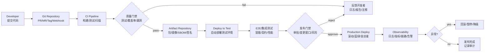
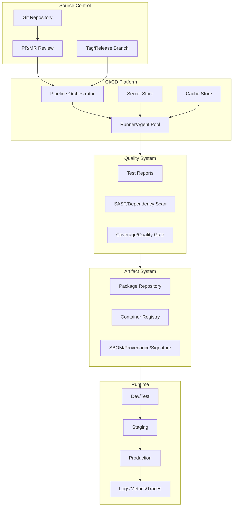
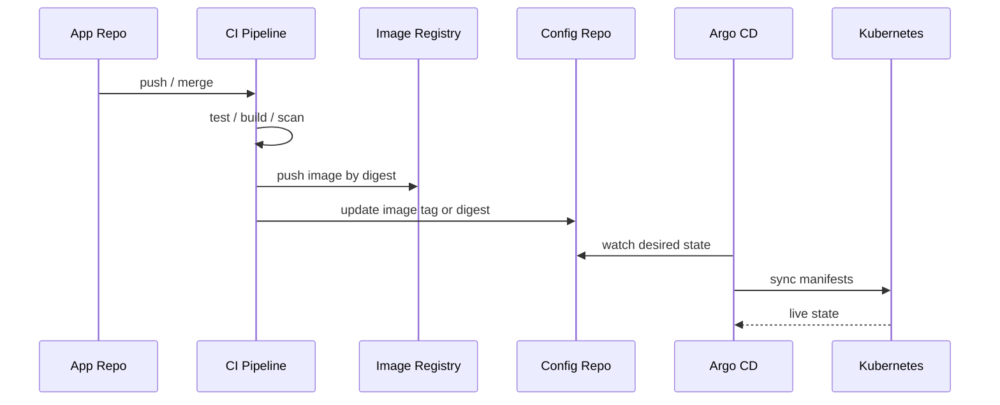
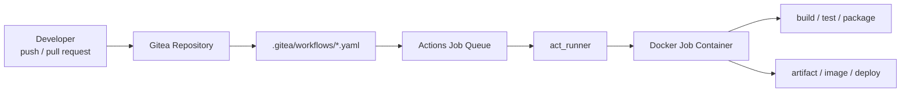

# CI/CD 完整学习笔记

> Last researched: 2026-06-16  
> Audience level: 后端 / 前端 / 全栈 / 测试 / 运维 / DevOps 入门到进阶  
> Scope: 本文覆盖 CI/CD 的核心概念、流水线架构、持续集成、持续交付、持续部署、制品管理、环境管理、部署策略、GitHub Actions、GitLab CI/CD、Jenkins Pipeline、Kubernetes/GitOps、质量门禁、安全与供应链防护、常见踩坑和排查方法。本文不是某个工具的替代官方文档，具体语法和版本行为应以官方文档为准。

## 1. 总览

CI/CD 是现代软件交付的自动化工程体系：

- **CI, Continuous Integration, 持续集成**：开发者频繁把代码合并到共享主干，并通过自动化构建、测试、静态检查快速发现问题。
- **CD, Continuous Delivery, 持续交付**：让每一次通过验证的变更都处于“可部署到生产”的状态，生产发布通常仍需要人工审批或业务决策。
- **Continuous Deployment, 持续部署**：持续交付的进一步自动化，所有通过质量门禁的变更自动部署到生产。

CI/CD 的核心价值不是“写一个 YAML 文件让服务器跑脚本”，而是把软件从提交到上线的路径变成可重复、可审计、可回滚、可度量的工程流程。

学习 CI/CD 要抓住七条主线：

| 主线 | 核心问题 | 典型产物 |
| --- | --- | --- |
| 反馈主线 | 代码提交后多久发现问题 | 自动构建、单元测试、集成测试、静态扫描 |
| 制品主线 | 到底部署什么，是否可追溯 | jar、二进制、Docker 镜像、SBOM、签名、版本号 |
| 环境主线 | dev/test/staging/prod 如何隔离和晋级 | 环境变量、密钥、审批、配置、部署记录 |
| 编排主线 | 流水线如何组织阶段、依赖和并发 | workflow、pipeline、job、stage、step、matrix |
| 发布主线 | 如何低风险上线和回滚 | rolling、blue-green、canary、feature flag、rollback |
| 安全主线 | 如何防止流水线成为攻击入口 | 最小权限、密钥管理、OIDC、依赖扫描、SLSA |
| 度量主线 | 如何判断交付能力是否变好 | 部署频率、变更前置时间、变更失败率、恢复时间 |

CI/CD 不是 DevOps 的全部。DevOps 更关注开发、测试、运维、安全和业务之间的协作方式；CI/CD 是 DevOps 落地中最重要的自动化交付能力之一。

## 2. 学习目标

学完本文后，应能达到以下目标：

- 能准确区分 CI、持续交付、持续部署、DevOps、GitOps。
- 能画出从代码提交到生产部署的标准流水线结构。
- 能理解 workflow、pipeline、job、stage、step、runner、artifact、cache、environment、secret、approval、quality gate 等术语。
- 能为一个 Web 项目设计基础 CI/CD：拉代码、安装依赖、测试、构建、打镜像、推送制品、部署到测试环境、人工审批后发布生产。
- 能读懂 GitHub Actions、GitLab CI/CD、Jenkins Pipeline 的基本配置。
- 能解释滚动更新、蓝绿部署、金丝雀发布、GitOps 的适用场景和取舍。
- 能识别常见坑：缓存和制品混用、密钥泄露、构建不可复现、测试不稳定、流水线权限过大、生产无回滚方案。
- 能从日志、制品、环境变量、Runner、网络、权限、部署事件等方向排查流水线失败。

## 3. 前置知识

| 知识 | 要求 |
| --- | --- |
| Git | commit、branch、merge、tag、pull request / merge request、webhook |
| Linux / Shell | 环境变量、退出码、文件权限、进程、网络命令、脚本调试 |
| 构建工具 | Maven/Gradle、npm/pnpm/yarn、Go build、Docker build 等至少一种 |
| 测试基础 | 单元测试、集成测试、端到端测试、覆盖率、测试报告 |
| 容器基础 | Dockerfile、镜像、Registry、tag、digest、多阶段构建 |
| 部署基础 | 服务器、SSH、Kubernetes、环境变量、配置文件、健康检查 |
| 安全基础 | 密钥、最小权限、依赖漏洞、供应链、审计日志 |

## 4. 核心概念

### 4.1 CI、持续交付、持续部署

| 概念 | 目标 | 自动化到哪里 | 是否自动上生产 |
| --- | --- | --- | --- |
| CI | 尽早发现集成问题 | 构建、测试、静态检查、生成制品 | 否 |
| Continuous Delivery | 每个合格版本都可随时发布 | 从提交到生产前准备完成 | 通常否，需要审批 |
| Continuous Deployment | 小批量、高频、自动发布 | 从提交到生产部署 | 是 |

持续交付强调“可发布状态”，持续部署强调“自动发布动作”。很多团队口头说 CD，实际做的是持续交付：生产部署仍有人工审批窗口、变更单或灰度决策。

### 4.2 Pipeline、Workflow、Job、Stage、Step

不同工具命名略有差异，但抽象相近：

| 抽象 | 含义 | GitHub Actions | Gitea Actions | GitLab CI/CD | Jenkins |
| --- | --- | --- | --- | --- | --- |
| 流水线整体 | 一次自动化流程 | workflow | workflow | pipeline | pipeline |
| 阶段 | 逻辑阶段，如 build/test/deploy | 通常用 job 和 needs 表达 | 通常用 job 和 needs 表达 | stages | stages |
| 作业 | 在 Runner/Agent 上执行的一组步骤 | job | job | job | stage 内的 steps 或并行分支 |
| 步骤 | 最小执行单元 | step | step | script 中的命令 | step |
| 执行器 | 真正运行命令的机器或容器 | runner | act_runner | runner | agent/node |

GitHub 官方文档把 workflow 定义为由一个或多个 job 组成的可配置自动化流程，workflow 使用 YAML 文件描述。Gitea Actions 也使用 workflow 文件，默认位于 `.gitea/workflows/`，由独立的 `act_runner` 执行。GitLab 的 `.gitlab-ci.yml` 定义 pipeline 中的 jobs。Jenkins Pipeline 通常用 `Jenkinsfile` 以声明式或脚本式语法定义流水线。

### 4.3 Artifact 和 Cache

这两个概念非常容易混淆：

| 项目 | Artifact 制品 | Cache 缓存 |
| --- | --- | --- |
| 目的 | 保存构建结果，供后续阶段或发布使用 | 加速依赖下载、编译、测试 |
| 是否代表交付对象 | 是 | 否 |
| 生命周期 | 通常和 pipeline、版本、发布记录相关 | 可被淘汰、失效、复用 |
| 示例 | jar、dist、测试报告、Docker 镜像、SBOM | Maven 本地仓库、npm cache、Gradle cache |
| 错误用法 | 把依赖缓存当发布产物 | 把构建产物只放缓存里 |

GitLab 官方文档也强调 artifacts 用于保存 job 输出，后续阶段可获取；cache 主要用于跨 job / pipeline 复用依赖以提升速度。

### 4.4 Environment、Secret、Variable

| 概念 | 含义 | 例子 |
| --- | --- | --- |
| Environment | 部署目标或运行环境 | dev、test、staging、prod |
| Variable | 普通变量，可用于脚本和配置 | `NODE_ENV=production`、`IMAGE_TAG=1.2.3` |
| Secret | 敏感变量或凭证 | token、password、SSH key、cloud credential |
| Approval | 发布前的人为确认或策略确认 | 生产环境审批、双人审批、变更窗口 |

工程建议：

- 非敏感配置可以进入代码仓库或配置仓库。
- 密钥不能写入仓库、镜像、日志、测试报告或制品。
- 生产密钥和测试密钥必须分离。
- 优先使用短期凭证、OIDC 联邦身份或云厂商临时令牌，减少长期静态密钥。

## 5. CI/CD 全流程图



Figure: 通用 CI/CD 交付链路，结合 GitHub Actions、GitLab CI/CD、Jenkins、Kubernetes Deployment、Argo CD 和 OWASP CI/CD Security 文档重新绘制。

## 6. CI：持续集成

### 6.1 CI 的目标

CI 解决的是“集成越晚，问题越难定位”的问题。每次提交或合并请求触发自动检查，使团队尽早发现：

- 代码不能编译。
- 单元测试失败。
- 依赖版本冲突。
- 静态扫描发现严重 bug 或漏洞。
- 格式化、Lint、类型检查不通过。
- 构建产物不能生成。
- Docker 镜像构建失败。

CI 成功的标志不是“有一个流水线在跑”，而是主干分支长期保持可构建、可测试、可发布。

### 6.2 典型 CI 阶段

| 阶段 | 目的 | 常见命令 |
| --- | --- | --- |
| checkout | 拉取指定提交 | `git checkout`，工具自动处理 |
| setup | 准备语言、依赖和工具 | `setup-java`、`setup-node`、安装 Docker |
| dependency | 安装依赖 | `mvn dependency:go-offline`、`npm ci` |
| lint | 代码风格和静态规则 | `eslint`、`checkstyle`、`ruff` |
| unit test | 快速验证函数和模块 | `mvn test`、`npm test`、`go test` |
| build | 编译和打包 | `mvn package`、`npm run build`、`go build` |
| scan | 安全和质量扫描 | SAST、依赖扫描、镜像扫描 |
| artifact | 保存可追溯制品 | jar、dist、coverage、test report |

### 6.3 CI 设计原则

- **快**：PR/MR 级 CI 应优先反馈快，慢测试可以拆到 nightly、merge 后或专门环境。
- **稳定**：测试不稳定会削弱团队对流水线的信任。Flaky test 应单独治理。
- **确定性**：同一提交在相同输入下应产生相同结果，避免依赖未锁版本、当前时间、外部环境随机状态。
- **可定位**：失败日志要让开发者知道在哪个阶段、哪条命令、哪个测试失败。
- **可复现**：本地应能用接近的命令复现 CI 失败。
- **主干健康**：保护主分支，要求必要检查通过后才能合并。

## 7. CD：持续交付与持续部署

### 7.1 持续交付的核心

持续交付关注“每个通过验证的变更是否可以随时发布”。它通常包括：

- 生成可部署制品。
- 制品进入仓库，不在部署时重新临时构建。
- 自动部署到测试或预发环境。
- 自动运行冒烟测试、集成测试、契约测试。
- 生产发布需要审批、变更单或发布窗口。
- 发布结果可观测、可回滚、可审计。

### 7.2 持续部署的核心

持续部署把生产部署也自动化。它适合具备以下条件的团队：

- 测试体系足够可靠。
- 服务支持小批量发布。
- 有自动化监控、告警和回滚。
- 有灰度、开关、降级能力。
- 变更风险被拆小，单次发布影响可控。

不适合持续部署的常见场景：

- 强监管业务必须人工审批。
- 数据库变更风险高且回滚困难。
- 缺少有效监控和自动化回滚。
- 测试覆盖不足，生产事故依赖人工发现。
- 多团队强耦合发布，无法独立验证。

## 8. CI/CD 架构组件



Figure: CI/CD 平台的典型组件关系，综合 GitHub Actions、GitLab CI/CD、Jenkins Pipeline、OWASP CI/CD Security 和 SLSA 文档整理。

### 8.1 代码仓库

代码仓库是交付链路的源头。常见触发方式：

- push 到分支。
- 创建或更新 PR/MR。
- 合并到主分支。
- 创建 tag 或 release。
- 定时任务。
- 手动触发。
- 外部系统 webhook 或 API 触发。

分支策略会直接影响 CI/CD 复杂度：

| 策略 | 特点 | 适用场景 | 风险 |
| --- | --- | --- | --- |
| Trunk-based development | 小批量频繁合并到主干 | 自动化测试成熟、发布频繁 | 对测试和代码开关要求高 |
| GitHub Flow | main + feature branch + PR | Web/SaaS 常见 | 生产发布策略需额外设计 |
| GitFlow | develop/release/hotfix 分支多 | 版本发布节奏固定的软件 | 分支长期存在，合并成本高 |
| Release branch | 主干开发，发布分支维护补丁 | 多版本维护 | 需要清晰 backport 规则 |

### 8.2 Runner / Agent

Runner 是真正执行命令的环境。

| 类型 | 优点 | 缺点 | 适合 |
| --- | --- | --- | --- |
| 托管 Runner | 免维护，环境干净，扩容简单 | 成本、网络访问和定制受限 | 开源项目、普通 SaaS 项目 |
| 自托管 Runner | 可访问内网，可定制工具链 | 安全隔离和维护成本高 | 私有网络、特殊硬件、合规要求 |
| 容器 Runner | 环境一致，清理方便 | Docker-in-Docker、缓存和权限要设计 | 大多数 Web 服务 |
| Kubernetes Runner | 弹性好，适合多租户 | 集群治理复杂 | 大规模 CI 平台 |

Runner 安全要点：

- PR 来自 fork 时不要暴露生产密钥。
- 自托管 Runner 不要让不可信代码和高权限环境混跑。
- 构建结束后清理 workspace、临时文件和凭证。
- 避免 Runner 拥有长期云账号管理员权限。

### 8.3 制品仓库

制品仓库用于保存“将要部署的东西”，而不是临时文件夹。

常见制品：

- Java: jar、war。
- Node.js: dist、npm package。
- Go/Rust/C/C++: binary。
- Container: Docker/OCI image。
- Mobile: apk、aab、ipa。
- IaC: Helm chart、Terraform module。
- 安全产物: SBOM、签名、provenance、扫描报告。

制品命名建议：

```text
<app-name>:<semver-or-date>-<git-sha>
orders-api:1.8.3-9f3a21c
orders-api:2026.06.16-9f3a21c
```

避免只使用 `latest` 作为生产部署依据。`latest` 不可追溯，容易出现“到底发布了哪个提交”的问题。生产部署应记录 digest 或不可变版本号。

### 8.4 环境与配置

环境一般分为：

| 环境 | 目的 | 特点 |
| --- | --- | --- |
| local | 开发自测 | 速度优先，允许简化依赖 |
| dev | 联调 | 变更频繁，稳定性较低 |
| test / qa | 测试验证 | 测试数据和报告完整 |
| staging / pre-prod | 生产前验证 | 尽量接近生产 |
| prod | 对真实用户服务 | 权限、审计、回滚最严格 |

配置原则：

- 同一制品晋级到不同环境，不要为每个环境重新构建一份逻辑不同的制品。
- 环境差异通过配置、密钥、资源规格和部署参数表达。
- 配置变更也要版本化和审计。
- 生产环境需要明确审批、记录和回滚策略。

## 9. 模块深挖

### 9.1 触发器与事件

触发器决定流水线何时运行。

常见触发器：

| 触发器 | 适合做什么 |
| --- | --- |
| pull_request / merge_request | 快速检查、测试、预览环境 |
| push main | 构建主干制品、部署测试环境 |
| tag | 创建正式 release、打不可变镜像 |
| schedule | 夜间全量测试、依赖漏洞扫描 |
| workflow_dispatch / manual | 手工补跑、紧急部署、运维任务 |
| repository_dispatch / API | 外部系统触发 |

设计建议：

- PR 触发不应直接部署生产。
- tag 触发适合正式版本发布。
- 定时任务适合慢测试和安全扫描。
- 手动触发应限制权限并记录参数。

### 9.2 构建与依赖

构建阶段的目标是把源码变成可验证、可部署的制品。

关键点：

- 使用锁文件：`package-lock.json`、`pnpm-lock.yaml`、`yarn.lock`、`go.sum`、`Cargo.lock`。
- 使用可复现构建命令：如 `npm ci` 优先于随意 `npm install`。
- 固定基础镜像版本，生产镜像避免无约束 `latest`。
- 多阶段 Dockerfile 减小镜像体积。
- 构建和部署分离：部署阶段使用已构建制品，不重新编译。

示例 Dockerfile：

```dockerfile
FROM eclipse-temurin:21-jdk AS build
WORKDIR /app
COPY . .
RUN ./mvnw -B -DskipTests package

FROM eclipse-temurin:21-jre
WORKDIR /app
COPY --from=build /app/target/app.jar /app/app.jar
EXPOSE 8080
ENTRYPOINT ["java", "-jar", "/app/app.jar"]
```

### 9.3 测试与质量门禁

测试不是一个阶段，而是一组分层反馈机制。

| 测试类型 | 运行时机 | 特点 |
| --- | --- | --- |
| 单元测试 | 每次 PR/push | 快、定位准 |
| 集成测试 | PR 或 main | 验证模块/数据库/外部服务 |
| 契约测试 | 服务接口变更时 | 降低微服务兼容性风险 |
| E2E 测试 | 预发或关键路径 | 慢但接近用户路径 |
| 冒烟测试 | 部署后 | 快速判断服务是否基本可用 |
| 性能测试 | 定时或发布前 | 资源消耗高，需稳定环境 |
| 安全扫描 | PR、main、定时 | SAST、依赖、镜像、IaC |

质量门禁常见条件：

- 必要测试全部通过。
- 覆盖率不低于阈值，或新代码覆盖率达标。
- 无 Critical / High 级漏洞。
- 代码质量工具无阻断级问题。
- 镜像扫描通过。
- 生产部署需要人工审批。

注意：覆盖率不是质量本身。高覆盖率但断言弱、测试数据差，仍然无法防止事故。

### 9.4 制品、版本和发布

好的制品系统要回答四个问题：

1. 这个生产版本来自哪个 Git commit？
2. 它经过了哪些测试和扫描？
3. 它由哪个流水线、哪个 Runner 构建？
4. 如果出问题，能否回滚到上一个已知可用版本？

建议保留的元数据：

```text
app.name=orders-api
git.commit=9f3a21c...
git.branch=main
build.number=20260616.42
build.url=https://ci.example.com/build/42
image.digest=sha256:...
created.at=2026-06-16T13:20:00Z
```

### 9.5 部署编排

部署阶段常见输入：

- 制品版本或镜像 digest。
- 目标环境。
- 配置和密钥。
- 数据库迁移脚本。
- 发布策略参数。
- 健康检查和回滚条件。

部署阶段常见输出：

- 部署记录。
- 运行版本。
- 发布日志。
- 健康检查结果。
- 监控和告警状态。
- 审计记录。

部署原则：

- 部署要幂等，重复执行不应造成不可控副作用。
- 数据库迁移要向前兼容，避免代码和表结构强耦合一次性切换。
- 发布前后都要有健康检查。
- 回滚方案要提前验证，不要等事故时临时设计。

## 10. 部署策略

### 10.1 滚动更新

滚动更新逐步替换旧实例。Kubernetes Deployment 默认使用 RollingUpdate，可通过 `maxUnavailable` 和 `maxSurge` 控制更新过程。

```yaml
apiVersion: apps/v1
kind: Deployment
metadata:
  name: orders-api
spec:
  replicas: 4
  strategy:
    type: RollingUpdate
    rollingUpdate:
      maxUnavailable: 25%
      maxSurge: 25%
  template:
    spec:
      containers:
        - name: orders-api
          image: registry.example.com/orders-api:1.8.3-9f3a21c
          readinessProbe:
            httpGet:
              path: /actuator/health/readiness
              port: 8080
```

适合：

- 无状态服务。
- 向后兼容变更。
- 单个版本短时间共存可接受。

不适合：

- 新旧版本不能共存。
- 数据库变更不兼容。
- 需要瞬间全量切流或严格 A/B 对比。

### 10.2 蓝绿部署

蓝绿部署保留两套环境：

- blue：当前生产。
- green：新版本。

新版本验证通过后切换流量到 green。如果异常，切回 blue。

优点：

- 回滚快。
- 切换清晰。
- 适合需要完整预热的新版本。

缺点：

- 资源成本高。
- 数据库状态和长连接处理复杂。
- 切流瞬间仍需谨慎。

### 10.3 金丝雀发布

金丝雀发布先让少量流量进入新版本，再逐步扩大比例。

适合：

- 用户量大，能承受按比例灰度。
- 有细粒度监控指标。
- 支持按用户、地域、租户、请求头或流量比例分流。

关键指标：

- 错误率。
- 延迟。
- 业务转化率。
- 资源消耗。
- 告警数量。

### 10.4 Feature Flag

Feature Flag 把“部署代码”和“开放功能”拆开：

- 先部署包含新功能但默认关闭的代码。
- 对内部用户、灰度用户或特定租户开启。
- 异常时关闭开关，而不一定回滚代码。

注意：

- 开关需要生命周期管理，旧开关要及时删除。
- 权限开关、实验开关、降级开关不要混用。
- 开关状态也要可审计。

### 10.5 GitOps

GitOps 把 Git 仓库作为期望状态来源。Argo CD 官方文档描述其作为 Kubernetes controller 持续比较集群实际状态和 Git 中目标状态，发现偏差后可手动或自动同步。

典型流程：



优点：

- 集群状态可通过 Git 审计。
- 配置变更和应用变更都能走 review。
- 减少 CI 直接持有集群高权限。
- 便于漂移检测和自动纠偏。

注意：

- 应用源码仓库和环境配置仓库的边界要清晰。
- 镜像 tag/digest 更新要可追踪。
- 自动同步生产环境前，需要成熟的回滚和监控策略。

## 11. GitHub Actions 入门与示例

GitHub Actions 的 workflow 通常放在 `.github/workflows/*.yml`。核心结构包括 `name`、`on`、`jobs`、`steps`。官方文档说明 job 是在同一个 runner 上执行的一组 step，step 可以是 shell 脚本或 action。

### 11.1 Java Maven 示例

```yaml
name: ci

on:
  pull_request:
  push:
    branches: [main]

permissions:
  contents: read

jobs:
  build-test:
    runs-on: ubuntu-latest
    steps:
      - name: Checkout
        uses: actions/checkout@v4

      - name: Set up JDK
        uses: actions/setup-java@v4
        with:
          distribution: temurin
          java-version: "21"
          cache: maven

      - name: Test
        run: ./mvnw -B test

      - name: Package
        run: ./mvnw -B -DskipTests package

      - name: Upload artifact
        uses: actions/upload-artifact@v4
        with:
          name: app-jar
          path: target/*.jar
```

要点：

- `permissions: contents: read` 遵循最小权限。
- PR 和 main 都跑测试，main 通过后可扩展构建镜像。
- `cache: maven` 只加速依赖，不代表发布制品。

### 11.2 Docker 镜像构建示例

```yaml
name: image

on:
  push:
    branches: [main]
    tags: ["v*"]

permissions:
  contents: read
  packages: write

jobs:
  docker:
    runs-on: ubuntu-latest
    steps:
      - uses: actions/checkout@v4

      - uses: docker/login-action@v3
        with:
          registry: ghcr.io
          username: ${{ github.actor }}
          password: ${{ secrets.GITHUB_TOKEN }}

      - uses: docker/build-push-action@v6
        with:
          context: .
          push: true
          tags: |
            ghcr.io/example/orders-api:${{ github.sha }}
```

生产建议：

- 优先部署镜像 digest，而不只部署 tag。
- 发布生产前增加测试、扫描、审批和环境保护规则。
- 对第三方 action 固定版本，安全要求高时固定到 commit SHA。

## 12. GitLab CI/CD 入门与示例

GitLab CI/CD 使用项目根目录的 `.gitlab-ci.yml` 描述 pipeline。GitLab 官方 YAML 参考列出了 `stages`、`script`、`artifacts`、`cache`、`rules` 等配置。

### 12.1 基础示例

```yaml
stages:
  - test
  - build
  - deploy

cache:
  key: "$CI_COMMIT_REF_SLUG"
  paths:
    - .m2/repository/

test:
  stage: test
  image: eclipse-temurin:21
  script:
    - ./mvnw -B test
  artifacts:
    when: always
    reports:
      junit: target/surefire-reports/*.xml

build:
  stage: build
  image: eclipse-temurin:21
  script:
    - ./mvnw -B -DskipTests package
  artifacts:
    paths:
      - target/*.jar
    expire_in: 7 days

deploy_test:
  stage: deploy
  image: alpine:3.20
  rules:
    - if: '$CI_COMMIT_BRANCH == "main"'
  script:
    - echo "deploy to test environment"
```

要点：

- `cache` 加速 Maven 依赖。
- `artifacts` 保存测试报告和 jar。
- `rules` 控制部署只在 main 分支发生。

### 12.2 Cache 与 Artifact 的选择

| 需求 | 使用 |
| --- | --- |
| 后续 job 需要当前 job 编译出来的 jar | artifact |
| 后续 job 需要测试报告 | artifact report |
| 多次 pipeline 复用 Maven/npm 依赖 | cache |
| 发布生产需要的镜像 | container registry，不只是 artifact |

## 13. Gitea Actions 入门与示例

Gitea Actions 是 Gitea 内置的 CI/CD 能力，从 Gitea 1.19 起可用。它的 workflow 语法尽量兼容 GitHub Actions，但不是 100% 等价；Gitea 官方文档明确提到部分能力存在差异，例如 `environment`、复杂 `runs-on`、`concurrency`、部分权限 scope 等功能需要按 Gitea 当前版本核对。

### 13.1 架构与运行方式

Gitea Actions 由两部分组成：

| 组件 | 作用 |
| --- | --- |
| Gitea Server | 保存仓库、读取 workflow、调度任务、展示日志 |
| act_runner | 独立 Runner 进程，拉取任务并实际执行 job |
| Docker Engine | act_runner 常用 Docker 作为 job 执行环境 |
| `.gitea/workflows/*.yaml` | 仓库内的流水线定义文件 |

执行链路：



Figure: Gitea Actions 基本执行链路，依据 Gitea Actions 和 act_runner 官方文档整理。

### 13.2 服务端启用 Actions

Gitea 需要在服务端配置中启用 Actions。典型 `app.ini` 配置：

```ini
[actions]
ENABLED = true
```

如果使用 Docker 部署 Gitea，也可以通过环境变量启用：

```yaml
services:
  gitea:
    image: gitea/gitea:1.22
    environment:
      - GITEA__actions__ENABLED=true
```

注意：

- 启用后还需要注册 `act_runner`，否则 workflow 不会有可执行的 Runner。
- Gitea Actions 是否默认启用、配置项名称和行为可能随版本变化，生产环境以当前 Gitea 官方配置文档为准。
- 如果 Gitea 在内网，Runner 需要能访问 Gitea Server、依赖源、镜像仓库和部署目标。

### 13.3 安装和注册 act_runner

`act_runner` 是 Gitea Actions 的官方 Runner。常见流程：

1. 在 Gitea 页面创建 Runner 注册令牌。
2. 在 Runner 机器安装 `act_runner`。
3. 生成配置文件。
4. 用注册令牌注册 Runner。
5. 启动 Runner 服务。

示例命令：

```bash
./act_runner generate-config > config.yaml

./act_runner register \
  --no-interactive \
  --instance https://gitea.example.com \
  --token <runner-registration-token> \
  --name runner-01 \
  --labels ubuntu-latest:docker://node:20-bookworm

./act_runner daemon --config config.yaml
```

Docker Compose 方式示例：

```yaml
services:
  runner:
    image: gitea/act_runner:latest
    restart: unless-stopped
    environment:
      CONFIG_FILE: /config.yaml
      GITEA_INSTANCE_URL: https://gitea.example.com
      GITEA_RUNNER_REGISTRATION_TOKEN: ${GITEA_RUNNER_REGISTRATION_TOKEN}
      GITEA_RUNNER_NAME: runner-01
    volumes:
      - ./config.yaml:/config.yaml
      - ./data:/data
      - /var/run/docker.sock:/var/run/docker.sock
```

安全提醒：

- 挂载 `/var/run/docker.sock` 等于给 Runner 很高的宿主机控制能力，只能给可信仓库使用。
- 不可信项目、外部贡献者 PR、生产部署任务不要和高权限 Runner 混用。
- 建议按项目、环境、权限拆分 Runner label，例如 `linux-build`、`docker-build`、`prod-deploy`。

### 13.4 Workflow 文件位置

Gitea Actions 默认读取仓库中的：

```text
.gitea/workflows/*.yaml
.gitea/workflows/*.yml
```

一个最小 Node.js 示例：

```yaml
name: node-ci

on:
  push:
    branches: [main]
  pull_request:

jobs:
  test:
    runs-on: ubuntu-latest
    steps:
      - name: Checkout
        uses: actions/checkout@v4

      - name: Set up Node
        uses: actions/setup-node@v4
        with:
          node-version: "20"

      - name: Install dependencies
        run: npm ci

      - name: Test
        run: npm test

      - name: Build
        run: npm run build
```

要点：

- `on` 定义触发事件。
- `jobs.<job_id>.runs-on` 要和 Runner label 匹配。
- `uses` 可以复用 GitHub Actions 生态中的 action，但兼容性要实际验证。
- 如果企业内网不能访问 GitHub Marketplace，需要配置 action mirror 或改用本地脚本。

### 13.5 Java Maven 示例

```yaml
name: java-ci

on:
  push:
    branches: [main]
  pull_request:

jobs:
  build-test:
    runs-on: ubuntu-latest
    steps:
      - uses: actions/checkout@v4

      - name: Set up JDK
        uses: actions/setup-java@v4
        with:
          distribution: temurin
          java-version: "21"

      - name: Cache Maven repository
        uses: actions/cache@v4
        with:
          path: ~/.m2/repository
          key: maven-${{ hashFiles('**/pom.xml') }}

      - name: Test
        run: ./mvnw -B test

      - name: Package
        run: ./mvnw -B -DskipTests package
```

如果 `actions/cache` 在当前 Gitea/Runner 环境中不可用，可以先去掉缓存，保证流水线正确性优先于速度。

### 13.6 构建并推送 Docker 镜像

以推送到 Gitea 内置 Container Registry 为例：

```yaml
name: docker-image

on:
  push:
    branches: [main]
    tags:
      - "v*"

jobs:
  image:
    runs-on: ubuntu-latest
    steps:
      - uses: actions/checkout@v4

      - name: Login to registry
        run: |
          echo "${{ secrets.REGISTRY_PASSWORD }}" | docker login gitea.example.com \
            -u "${{ secrets.REGISTRY_USERNAME }}" \
            --password-stdin

      - name: Build image
        run: |
          docker build \
            -t gitea.example.com/my-org/orders-api:${{ github.sha }} \
            .

      - name: Push image
        run: |
          docker push gitea.example.com/my-org/orders-api:${{ github.sha }}
```

生产建议：

- 不要只推 `latest`。
- 镜像 tag 至少包含 `${{ github.sha }}`。
- 部署时最好记录 image digest。
- Registry 用户只授予当前项目需要的 push/pull 权限。

### 13.7 部署到服务器示例

简单 SSH 部署示例：

```yaml
name: deploy-test

on:
  push:
    branches: [main]

jobs:
  deploy:
    runs-on: ubuntu-latest
    steps:
      - name: Deploy by SSH
        env:
          SSH_PRIVATE_KEY: ${{ secrets.TEST_SSH_PRIVATE_KEY }}
          SSH_HOST: ${{ secrets.TEST_SSH_HOST }}
          SSH_USER: ${{ secrets.TEST_SSH_USER }}
          IMAGE_TAG: ${{ github.sha }}
        run: |
          mkdir -p ~/.ssh
          printf '%s\n' "$SSH_PRIVATE_KEY" > ~/.ssh/id_ed25519
          chmod 600 ~/.ssh/id_ed25519
          ssh -o StrictHostKeyChecking=no "$SSH_USER@$SSH_HOST" \
            "cd /opt/orders-api && IMAGE_TAG=$IMAGE_TAG docker compose up -d"
```

注意：

- 这是入门示例，不代表最佳生产发布方案。
- 生产环境不建议关闭 `StrictHostKeyChecking`，应预置 `known_hosts`。
- 生产部署应增加审批、备份、健康检查和回滚。
- SSH key 应限制命令、用户和目标机器权限。

### 13.8 Gitea Actions 和 GitHub Actions 的差异

| 方面 | Gitea Actions | GitHub Actions |
| --- | --- | --- |
| Workflow 位置 | `.gitea/workflows/` | `.github/workflows/` |
| Runner | `act_runner` | GitHub-hosted runner 或 self-hosted runner |
| 语法目标 | 尽量兼容 GitHub Actions | 原生标准 |
| Actions 生态 | 可复用很多 GitHub Action，但需验证 | Marketplace 生态最完整 |
| 环境保护 | 能力随 Gitea 版本演进，需核对官方文档 | Environments、reviewers、deployment protection rules 更成熟 |
| 权限模型 | 与 Gitea 仓库、组织、Runner 配置相关 | `permissions`、environment、OIDC 等能力完整 |
| 私有化 | 轻量，适合自托管 | GitHub Enterprise 或云服务 |

### 13.9 Gitea CI/CD 常见坑

| 问题 | 原因 | 处理 |
| --- | --- | --- |
| Workflow 没触发 | Actions 未启用、文件路径错误、事件不匹配 | 检查 `[actions] ENABLED`、`.gitea/workflows/`、`on` |
| Job 一直排队 | 没有 Runner、label 不匹配、Runner 离线 | 查看 Runner 列表和 `runs-on` |
| `uses: actions/...` 失败 | 网络无法访问 GitHub、action 兼容性问题 | 使用内网镜像、固定版本、改写为脚本 |
| Docker 命令不可用 | Runner 容器未挂载 Docker socket 或权限不足 | 配置 Docker、使用合适 Runner label |
| 密钥读不到 | secret 未配置在仓库/组织，事件来源不可信 | 检查 Secrets 作用域和触发事件 |
| 缓存不可用 | cache action 或后端能力未配置 | 先去掉缓存，或按官方文档配置缓存服务 |
| 部署权限过大 | Runner 同时用于构建和生产部署 | 拆分 Runner、label、secret 和环境权限 |

### 13.10 Gitea 使用建议

- 小团队自托管 Git 服务时，Gitea Actions 能用较低成本覆盖基础 CI/CD。
- 如果已有 GitHub Actions 经验，迁移到 Gitea Actions 时先验证常用 action、cache、artifact、secret、Docker build。
- 生产部署最好拆分 Runner：普通构建 Runner 不应拥有生产权限。
- 内网环境要提前准备依赖源、action 镜像、容器镜像源和证书。
- 对安全要求高的场景，不要把不可信代码放在挂载 Docker socket 的 Runner 上执行。
- Gitea Actions 适合轻量私有化 CI/CD；复杂企业级审批、审计和多环境权限治理可能仍需要 GitLab CI、Jenkins、Argo CD 或专门发布平台配合。

## 14. Jenkins Pipeline 入门与示例

Jenkins Pipeline 使用 `Jenkinsfile`。官方文档说明 Jenkinsfile 可使用 Declarative 和 Scripted 两类语法，Declarative 更结构化，适合大多数团队作为默认选择。

### 14.1 Declarative Pipeline 示例

```groovy
pipeline {
  agent any

  options {
    timestamps()
    timeout(time: 30, unit: 'MINUTES')
    disableConcurrentBuilds()
  }

  environment {
    APP_NAME = 'orders-api'
  }

  stages {
    stage('Checkout') {
      steps {
        checkout scm
      }
    }

    stage('Test') {
      steps {
        sh './mvnw -B test'
      }
      post {
        always {
          junit 'target/surefire-reports/*.xml'
        }
      }
    }

    stage('Build') {
      steps {
        sh './mvnw -B -DskipTests package'
        archiveArtifacts artifacts: 'target/*.jar', fingerprint: true
      }
    }

    stage('Deploy Staging') {
      when {
        branch 'main'
      }
      steps {
        sh './scripts/deploy-staging.sh'
      }
    }

    stage('Deploy Production') {
      when {
        buildingTag()
      }
      steps {
        input message: 'Deploy to production?'
        sh './scripts/deploy-prod.sh'
      }
    }
  }
}
```

生产建议：

- 不再优先使用 freestyle job 堆手工配置，尽量使用 Jenkinsfile 版本化流水线。
- 凭证使用 Jenkins Credentials，不要写进 Jenkinsfile。
- Agent 要隔离，不可信项目不要共享高权限节点。
- 给构建设置 timeout，避免僵尸任务占用资源。
- 保存测试报告和制品指纹，便于追溯。

## 15. 安全与供应链

CI/CD 安全非常关键，因为流水线通常拥有源码、密钥、制品仓库、部署环境的访问权限。OWASP CI/CD Security Cheat Sheet 和 OWASP Top 10 CI/CD Security Risks 都强调流水线本身是攻击面。

### 14.1 常见风险

| 风险 | 说明 | 防护 |
| --- | --- | --- |
| 密钥泄露 | token 写进仓库、日志或镜像 | Secret Store、日志脱敏、定期轮换 |
| 流水线权限过大 | CI token 可删除仓库或部署所有环境 | 最小权限、环境级权限、分项目隔离 |
| 依赖投毒 | 恶意包、依赖劫持、typosquatting | lockfile、私有代理、依赖扫描、审查升级 |
| 构建脚本被篡改 | 攻击者改 CI 配置获取密钥 | CODEOWNERS、分支保护、审批 |
| 不可信 PR 执行高权限任务 | fork PR 读取 secret 或跑内网命令 | 限制事件、禁用 secret、人工批准 |
| Runner 污染 | 上一个任务残留凭证或文件 | 临时 Runner、workspace 清理、容器隔离 |
| 制品被替换 | 发布的不是通过测试的制品 | 不可变制品、签名、digest、provenance |
| 部署绕过流水线 | 人工 SSH 改生产 | 禁止手改、审计、GitOps、权限收敛 |

### 14.2 最小权限

GitHub Actions 示例：

```yaml
permissions:
  contents: read
  packages: write
```

不要默认给 workflow 全仓库写权限。只为当前 job 需要的资源授权。

### 14.3 密钥管理

原则：

- 密钥不要进入代码仓库。
- 不要在脚本中 `echo $SECRET`。
- 不要把 `.env` 打进 Docker 镜像。
- 不要在 PR from fork 的 job 中暴露生产 secret。
- 优先使用 OIDC 获取云厂商短期凭证。
- 密钥要有 owner、用途、权限范围、过期和轮换机制。

### 14.4 SLSA、SBOM、签名和 Provenance

SLSA 是软件供应链安全框架，目标是防止篡改、提升完整性并保护包和基础设施。学习 CI/CD 安全时可以把它理解为“制品可信度成熟度模型”。

关键概念：

| 概念 | 含义 |
| --- | --- |
| SBOM | Software Bill of Materials，软件物料清单，描述组件和依赖 |
| Provenance | 构建来源证明，说明制品由什么源码、什么构建系统、什么步骤产生 |
| Signing | 对制品或元数据签名，验证来源和完整性 |
| Attestation | 对构建事实作可验证声明 |

实践路径：

1. 先保证所有生产制品都由 CI 构建。
2. 给制品绑定 Git commit、构建编号和测试结果。
3. 生成 SBOM 和依赖扫描报告。
4. 对镜像或包签名。
5. 在部署入口校验签名、来源和策略。

### 14.5 安全扫描放在哪里

| 扫描类型 | 推荐位置 |
| --- | --- |
| Secret scanning | PR、push、定时 |
| SAST | PR、main |
| Dependency scanning | PR、main、定时 |
| Container image scanning | 镜像构建后、部署前 |
| IaC scanning | PR、部署前 |
| DAST | 测试/预发环境 |
| License scanning | PR、release |

不要把所有扫描都塞进 PR 快速流水线，否则反馈太慢。可以分层：PR 阻断严重问题，main/release 做更完整扫描，定时任务做全量检查。

## 16. 数据库变更与 CI/CD

数据库变更是发布风险最高的部分之一。

### 16.1 基本原则

- 数据库迁移脚本必须版本化。
- schema 变更和代码发布要兼容一段时间。
- 避免一次发布同时做不可逆 schema 变更和业务逻辑切换。
- 大表 DDL 要评估锁表、耗时、复制延迟。
- 生产迁移前在接近生产数据量的环境验证。
- 回滚代码不一定能回滚数据，数据迁移要单独设计。

### 16.2 Expand and Contract

常见安全迁移方式：

1. Expand：新增字段/表/索引，保持旧逻辑可用。
2. Deploy：发布兼容新旧结构的代码。
3. Migrate：后台迁移历史数据。
4. Switch：切换读写到新结构。
5. Contract：确认稳定后删除旧字段/旧逻辑。

示例：

```text
错误方式：删除 old_column 后立即发布只读 new_column 的代码。
推荐方式：先加 new_column -> 双写 -> 回填 -> 读新字段 -> 删除 old_column。
```

## 17. 观测、告警和回滚

发布后必须能回答：

- 当前生产运行的是哪个版本？
- 这个版本何时发布，由谁批准？
- 错误率、延迟、流量、资源是否异常？
- 是否有核心业务指标下降？
- 如果异常，回滚命令是什么？

### 17.1 发布后检查

| 检查 | 示例 |
| --- | --- |
| 健康检查 | `/health`、`/ready` |
| 错误率 | 5xx、异常日志 |
| 延迟 | p95、p99 |
| 资源 | CPU、内存、GC、连接池 |
| 业务指标 | 下单成功率、支付成功率、登录成功率 |
| 依赖 | DB、Redis、MQ、第三方 API |

### 17.2 回滚策略

| 策略 | 适合 |
| --- | --- |
| 重新部署上一版本制品 | 无状态服务、兼容数据库 |
| Kubernetes rollout undo | Deployment 滚动发布 |
| 蓝绿切回 | 有双环境 |
| 金丝雀暂停/缩小比例 | 渐进发布 |
| 关闭 feature flag | 功能级问题 |
| 降级/熔断 | 依赖或局部能力异常 |

注意：回滚不是万能的。如果数据库迁移不可逆，代码回滚可能无法恢复业务。发布设计时必须先考虑回滚边界。

## 18. DORA 指标与交付能力

DORA 常用四个指标衡量软件交付表现：

| 指标 | 含义 | 改进方向 |
| --- | --- | --- |
| Deployment Frequency | 部署频率 | 小批量发布、自动化部署 |
| Lead Time for Changes | 变更前置时间 | 缩短从提交到生产的等待 |
| Change Failure Rate | 变更失败率 | 更好测试、灰度、回滚 |
| Time to Restore Service | 服务恢复时间 | 监控、告警、快速回滚 |

这些指标不要机械追求数字。一个团队真正要优化的是“更小批量、更快反馈、更低风险、更快恢复”。

## 19. 工具对比

| 工具 | 优点 | 缺点 | 适合 |
| --- | --- | --- | --- |
| GitHub Actions | 与 GitHub 集成好，生态丰富，配置简单 | 复杂企业权限和内网场景需设计 | GitHub 项目、开源、SaaS |
| Gitea Actions | 轻量自托管，语法接近 GitHub Actions，适合和 Gitea 仓库集成 | 生态和环境保护能力不如 GitHub/GitLab 成熟，Runner 安全需自行治理 | 小团队、自托管 Git、内网轻量 CI/CD |
| GitLab CI/CD | 代码、CI、制品、环境一体化，私有化成熟 | YAML 复杂后维护成本上升 | GitLab 生态、企业内网 |
| Jenkins | 插件多，可定制性强，历史项目多 | 维护成本高，插件和权限治理复杂 | 复杂遗留系统、强自定义 |
| Argo CD | GitOps 模型清晰，Kubernetes 友好 | 主要面向 K8s，需配置仓库治理 | Kubernetes 持续交付 |
| Tekton | 云原生 Pipeline 原语，扩展强 | 学习和平台建设成本高 | 平台工程、K8s 原生 CI/CD |
| CircleCI / Buildkite 等 | 托管体验好，弹性强 | 成本和供应商绑定 | 商业团队快速交付 |

选型建议：

- 仓库在 GitHub，优先 GitHub Actions。
- 仓库在 Gitea，且团队希望轻量自托管，优先评估 Gitea Actions + act_runner。
- 仓库和项目管理在 GitLab，优先 GitLab CI/CD。
- 现有大量 Jenkins 资产，短期可继续 Jenkins，但新项目尽量 Pipeline as Code。
- Kubernetes 生产部署，CI 构建镜像后可用 Argo CD/Flux 做 GitOps CD。
- 不要为了“工具先进”替换稳定流程，先明确团队痛点和迁移成本。

## 20. 最小可用 CI/CD 实践路径

### 20.1 第 1 阶段：基础 CI

目标：每个 PR 都能自动验证。

需要完成：

- PR 触发构建。
- 自动安装依赖。
- 跑单元测试。
- 生成测试报告。
- 主分支必须检查通过才能合并。

### 20.2 第 2 阶段：制品化

目标：每次主干合并都生成可追溯制品。

需要完成：

- main 分支构建 jar/dist/binary/image。
- 制品上传仓库。
- 制品绑定 Git SHA 和构建编号。
- 不再在生产服务器临时拉代码编译。

### 20.3 第 3 阶段：自动部署测试环境

目标：合并后自动进入测试环境。

需要完成：

- 自动部署到 dev/test。
- 部署后冒烟测试。
- 失败自动通知。
- 可查看当前环境版本。

### 20.4 第 4 阶段：生产交付门禁

目标：生产发布可控、可审计、可回滚。

需要完成：

- 生产部署需要审批。
- 使用同一制品晋级生产。
- 发布前检查镜像扫描和测试结果。
- 发布后观察核心指标。
- 明确回滚流程。

### 20.5 第 5 阶段：高级发布与供应链安全

目标：降低生产变更风险。

需要完成：

- 灰度/金丝雀/蓝绿。
- Feature Flag。
- SBOM、签名、provenance。
- OIDC 临时凭证。
- 自动化策略校验。
- DORA 指标看板。

## 21. 常见错误与踩坑

### 21.1 有流水线不等于 CI/CD

很多团队只是把手工命令搬到 Jenkins/GitLab/GitHub 上：

- 流水线不稳定，经常失败但没人修。
- 失败后还是人工 SSH 上服务器处理。
- 生产部署没有制品版本记录。
- 环境配置靠口口相传。
- 测试只是摆设，失败也能发布。

真正的 CI/CD 应该让交付流程更可靠，而不是把混乱自动化。

### 21.2 缓存和制品混用

错误做法：

- 编译产物只存在 cache。
- 下游部署 job 从 cache 找 jar。
- cache miss 后部署失败。

正确做法：

- 依赖下载用 cache。
- 构建输出用 artifact 或制品仓库。
- 生产部署使用不可变版本制品。

### 21.3 每个环境重新构建

错误做法：

```text
test 环境构建一次
staging 环境构建一次
prod 环境再构建一次
```

问题：

- 生产运行的不是测试验证过的同一个制品。
- 依赖或基础镜像变化会导致结果不同。
- 无法证明制品经过了哪些测试。

推荐：

```text
Build once, promote the same artifact.
```

### 21.4 密钥写进 YAML 或日志

错误示例：

```yaml
script:
  - docker login -u admin -p my-password registry.example.com
  - echo $PROD_TOKEN
```

正确做法：

- 使用 Secret Store。
- 日志中不打印密钥。
- 使用短期凭证。
- 限制 secret 只在需要的环境和 job 可见。

### 21.5 测试太慢导致团队绕过 CI

解决方式：

- 把测试分层。
- PR 只跑快速关键测试。
- 慢测试放到 main 后、定时任务或预发环境。
- 并行测试。
- 治理 flaky test。
- 对高风险模块增加精准测试。

### 21.6 部署成功但服务不可用

常见原因：

- 只检查进程启动，不检查 readiness。
- 配置缺失。
- 数据库迁移未执行或失败。
- 下游依赖不可达。
- 新版本启动慢，滚动更新过快。
- 健康检查路径不准确。

解决：

- 区分 liveness 和 readiness。
- 部署后运行冒烟测试。
- 发布期间观察错误率和延迟。
- 设置合理的滚动更新参数。

### 21.7 回滚不可用

常见原因：

- 没有保存上一版本制品。
- 数据库迁移不可逆。
- 配置变更没有版本记录。
- 镜像 tag 被覆盖。
- 回滚命令没人演练过。

解决：

- 制品不可变。
- 数据库变更向前兼容。
- 配置 Git 化。
- 定期演练回滚。

## 22. 故障排查

| 现象 | 可能原因 | 排查方向 |
| --- | --- | --- |
| 本地成功 CI 失败 | 环境差异、依赖未锁、路径大小写、时区 | 查看 Runner OS、语言版本、lockfile、环境变量 |
| CI 偶发失败 | 测试不稳定、网络抖动、并发冲突 | 重跑失败测试、隔离共享资源、增加重试但不掩盖根因 |
| 依赖下载慢 | 无缓存、镜像源慢、锁冲突 | 配置 cache、私有代理、依赖预热 |
| Docker build 慢 | 层缓存失效、上下文过大 | 调整 Dockerfile 顺序、`.dockerignore`、构建缓存 |
| 部署权限失败 | token 权限不足、环境保护、云 IAM 错误 | 查看 job permissions、secret 可见范围、云审计日志 |
| 找不到 artifact | 没有上传、路径错误、过期、job 依赖错误 | 检查 artifact paths、expire、needs/dependencies |
| 测试报告不显示 | 报告格式或路径错误 | 确认 JUnit/Coverage report 路径 |
| Kubernetes 发布卡住 | readiness 失败、镜像拉取失败、资源不足 | `kubectl describe pod`、events、logs |
| 新版本启动后 5xx | 配置错误、DB 迁移、依赖不兼容 | 对比环境变量、查看应用日志、检查迁移状态 |
| 回滚后仍异常 | 数据已变更、缓存污染、配置未回滚 | 检查数据库、缓存、配置版本 |

## 23. 面试与工程表达要点

### 23.1 如何解释 CI/CD

可以这样回答：

> CI/CD 是把代码从提交到上线的过程自动化和工程化。CI 关注频繁集成后的自动构建、测试和反馈；持续交付关注每个通过验证的变更都能随时发布；持续部署则进一步把生产发布也自动化。一个可靠的 CI/CD 系统要包含代码触发、构建、测试、制品、环境、部署、审批、监控、回滚和安全控制。

### 23.2 如何设计一个基础流水线

可以按以下顺序描述：

1. PR 触发 lint、单元测试和构建。
2. main 合并后构建不可变制品或镜像。
3. 上传制品仓库，记录 Git SHA、构建号、扫描结果。
4. 自动部署测试环境并跑冒烟测试。
5. 生产发布前检查质量门禁和人工审批。
6. 生产采用滚动、蓝绿或金丝雀发布。
7. 发布后监控错误率、延迟和业务指标。
8. 异常时按预案回滚或关闭开关。

### 23.3 如何体现 CI/CD 安全意识

重点说：

- 分支保护和代码评审。
- secret 不入库、不进日志。
- job 最小权限。
- 不可信 PR 不接触高权限 secret。
- 制品不可变、可追溯。
- 镜像和依赖扫描。
- 生产部署审批和审计。
- 使用 OIDC/短期凭证替代长期密钥。
- 供应链安全可引入 SBOM、签名和 provenance。

## 24. 术语速查

| 术语 | 解释 |
| --- | --- |
| Pipeline | 一次自动化交付流程 |
| Workflow | GitHub Actions / Gitea Actions 中的流水线配置 |
| Job | 在 Runner 上执行的一组步骤 |
| Stage | 流水线中的逻辑阶段 |
| Step | 最小执行步骤 |
| Runner/Agent | 执行流水线命令的机器、容器或节点 |
| Artifact | 构建输出或报告，可供后续阶段/发布使用 |
| Cache | 用于加速依赖和构建的缓存 |
| Registry | 镜像或包仓库 |
| Environment | 部署目标环境 |
| Secret | 密钥、令牌、密码等敏感信息 |
| Quality Gate | 阻断发布的质量条件 |
| Canary | 小流量灰度发布 |
| Blue-Green | 双环境切流发布 |
| Rolling Update | 逐批替换实例 |
| GitOps | 以 Git 中的期望状态驱动部署 |
| SBOM | 软件物料清单 |
| Provenance | 构建来源证明 |
| SLSA | 软件供应链完整性安全框架 |

## 25. 推荐学习路线

1. 先理解 CI/CD 概念和完整链路，不急着学工具语法。
2. 用 GitHub Actions 或 GitLab CI 给一个小项目加上测试和构建。
3. 增加 artifact、cache、测试报告和分支保护。
4. 增加 Docker 镜像构建和推送。
5. 部署到测试环境，加入健康检查和冒烟测试。
6. 给生产部署加审批、版本记录和回滚脚本。
7. 学习 Kubernetes rolling update、蓝绿、金丝雀和 Feature Flag。
8. 加入安全扫描、最小权限、密钥治理。
9. 学习 GitOps，用 Argo CD 或 Flux 管理 Kubernetes 部署。
10. 建立 DORA 指标和持续改进机制。

## 26. References and further reading

- Official: GitHub Actions documentation: https://docs.github.com/actions
- Official: Workflow syntax for GitHub Actions: https://docs.github.com/actions/using-workflows/workflow-syntax-for-github-actions
- Official: Understanding GitHub Actions: https://docs.github.com/articles/getting-started-with-github-actions
- Official: GitHub Actions contexts reference: https://docs.github.com/en/actions/reference/workflows-and-actions/contexts
- Official: GitHub Actions workflow commands: https://docs.github.com/en/actions/reference/workflows-and-actions/workflow-commands
- Official: GitLab CI/CD YAML syntax reference: https://docs.gitlab.com/ci/yaml/
- Official: GitLab CI/CD Jobs: https://docs.gitlab.com/ci/jobs/
- Official: GitLab CI/CD Caching: https://docs.gitlab.com/ci/caching/
- Official: GitLab Job Artifacts: https://docs.gitlab.com/ci/jobs/job_artifacts/
- Official: Gitea Actions overview: https://docs.gitea.com/usage/actions/overview
- Official: Gitea Actions quick start: https://docs.gitea.com/usage/actions/quickstart
- Official: Gitea Actions act_runner: https://docs.gitea.com/usage/actions/act-runner
- Official: Gitea Actions comparison with GitHub Actions: https://docs.gitea.com/usage/actions/comparison
- Official: Gitea actions configuration cheat sheet: https://docs.gitea.com/administration/config-cheat-sheet
- Official: Jenkins Pipeline: https://www.jenkins.io/doc/book/pipeline/
- Official: Jenkins Pipeline Syntax: https://www.jenkins.io/doc/book/pipeline/syntax/
- Official: Using a Jenkinsfile: https://www.jenkins.io/doc/book/pipeline/jenkinsfile/
- Official: Kubernetes Deployments: https://kubernetes.io/docs/concepts/workloads/controllers/deployment/
- Official: Argo CD documentation: https://argo-cd.readthedocs.io/
- Official: Argo CD automation from CI pipelines: https://argo-cd.readthedocs.io/en/stable/user-guide/ci_automation/
- Official/Security: OWASP CI/CD Security Cheat Sheet: https://cheatsheetseries.owasp.org/cheatsheets/CI_CD_Security_Cheat_Sheet.html
- Official/Security: OWASP Top 10 CI/CD Security Risks: https://owasp.org/www-project-top-10-ci-cd-security-risks/
- Official/Security: OWASP Secrets Management Cheat Sheet: https://cheatsheetseries.owasp.org/cheatsheets/Secrets_Management_Cheat_Sheet.html
- Official/Security: SLSA Supply-chain Levels for Software Artifacts: https://slsa.dev/
- Official/Security: SLSA Security Levels: https://slsa.dev/spec/v0.1/levels
- Official/Security: NIST SP 800-218 Secure Software Development Framework Version 1.1: https://csrc.nist.gov/pubs/sp/800/218/final
- Thought leadership: Martin Fowler, Continuous Integration: https://martinfowler.com/articles/continuousIntegration.html
- Research/Practice: DORA DevOps capabilities, Continuous Delivery: https://dora.dev/devops-capabilities/technical/continuous-delivery/
- Community: CICD 学习笔记 - 稀土掘金: https://juejin.cn/post/7332787416913264659
- Community: GitLab CI 入门及实践操作 - 稀土掘金: https://juejin.cn/post/7031442774847127588
- Community: CI/CD 流水线设计 - 稀土掘金: https://juejin.cn/post/7642586044856958986
- Community: DevOps 在路上 - 博客园分类: https://www.cnblogs.com/FLY_DREAM/category/1847523.html
- Community: CICD 学习指南 - CSDN: https://blog.csdn.net/weixin_44123412/article/details/153839787
- Community: Jenkins 构建生产级 CI/CD 环境学习笔记 - CSDN: https://blog.csdn.net/x123456h123456/article/details/161462188
- Community: GitLab CI cache and artifacts explained by example: https://dev.to/drakulavich/gitlab-ci-cache-and-artifacts-explained-by-example-2opi
