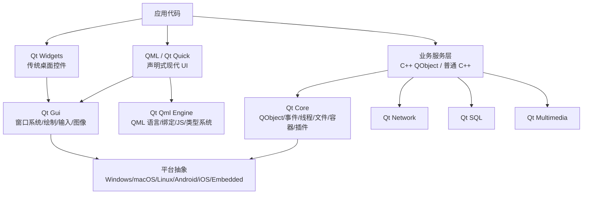
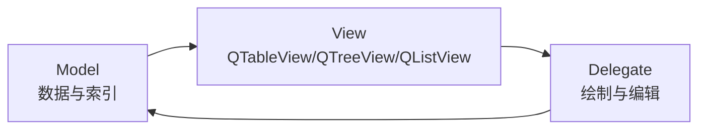

# Qt 完整学习文档

> Last researched: 2026-06-15  
> Audience level: 初学者到中高级工程实践  
> Scope: 以 Qt 6.11/6.11.1 为主线，覆盖 C++ Qt、Qt Widgets、QML/Qt Quick、CMake、资源、国际化、线程、网络、数据库、测试、部署、迁移和常见排错。不包含 Qt 源码逐行解析、商业许可法律意见、Qt for MCUs 深度开发。

## 1. 总览

Qt 是一个跨平台 C++ 应用开发框架，核心价值是用一套相对统一的 API 构建 Windows、Linux、macOS、Android、iOS、WebAssembly、嵌入式等平台上的应用。Qt 不只是 GUI 库，它还提供事件循环、对象模型、信号槽、线程、网络、数据库、资源系统、国际化、测试、插件、图形渲染、多媒体、串口、Web 集成等能力。

本学习文档采用 Qt 6 作为主线。根据 Qt 官方博客，Qt 6.11 于 2026-03-23 发布，Qt 6.11.1 于 2026-05-13 发布，是一次补丁版本，主要包含 bug 修复、安全改进和质量增强。学习时建议安装最新 Qt 6.11.x 或长期支持线 Qt 6.8 LTS，除非项目已有明确版本约束。

### 1.1 你应该记住的主线

| 主线 | 结论 |
| --- | --- |
| 语言 | Qt 原生主力是 C++，同时可通过 Qt for Python/PySide6 使用 Python。 |
| UI 技术 | 传统桌面应用用 Qt Widgets；现代动态 UI、移动端、嵌入式 HMI 更常用 QML/Qt Quick。 |
| 构建系统 | Qt 6 推荐 CMake；qmake 仍能见到，但新项目应优先 CMake。 |
| 对象通信 | QObject + 元对象系统 + 信号槽是 Qt 的核心机制。 |
| 事件模型 | `QCoreApplication`/`QGuiApplication`/`QApplication` 运行事件循环；大部分 UI 和异步 IO 依赖事件循环。 |
| 跨平台 | Qt 抽象了很多平台差异，但部署、权限、字体、输入法、GPU、插件路径仍需按平台处理。 |
| 许可 | Qt 同时提供商业许可和开源许可；闭源分发必须认真核对 LGPL/GPL 模块和合规义务。 |

## 2. 学习目标

- 理解 Qt 的整体架构：Core、GUI、Widgets、QML、Quick、工具链和部署链路。
- 能独立搭建 Qt 6 + CMake + Qt Creator/VS Code/Visual Studio 开发环境。
- 能写出一个可运行、可维护的 Widgets 桌面应用。
- 能写出一个 QML/Qt Quick 应用，并理解 QML 与 C++ 的边界。
- 能掌握信号槽、对象树、事件循环、线程亲和性、资源系统、国际化、测试和部署。
- 能识别常见坑：Kit 未配置、DLL/插件缺失、`Q_OBJECT`/moc 问题、跨线程访问 UI、QML 模块找不到、数据库连接线程错误。

## 3. 前置知识

| 知识 | 要求 |
| --- | --- |
| C++ | 至少掌握类、继承、虚函数、RAII、智能指针、lambda、模板基础。Qt 6 项目通常使用 C++17 或更新标准。 |
| CMake | 理解 `CMakeLists.txt`、target、`find_package`、`target_link_libraries`、构建目录。 |
| GUI 基础 | 理解窗口、控件、布局、事件、绘制、模型视图。 |
| 操作系统 | 理解进程、线程、动态库、环境变量、文件路径、权限。 |
| JavaScript/QML | 学 Qt Quick 时需要理解声明式对象、属性绑定、信号处理、少量 JavaScript 表达式。 |

## 4. Qt 生态与版本选择

### 4.1 Qt、Qt Creator、Qt Design Studio 的区别

| 名称 | 作用 | 学习重点 |
| --- | --- | --- |
| Qt Framework | 核心框架和模块集合，例如 Qt Core、Widgets、Quick、Network、SQL。 | API、模块、运行机制。 |
| Qt Creator | 官方 IDE，负责项目创建、Kit 管理、编辑、构建、调试、QML 工具。 | Kit、CMake、调试、Designer、Profiler。 |
| Qt Design Studio | 面向设计和 QML UI 制作的工具，可配合 Figma/设计资源。 | 视觉设计、QML UI、设计交付。 |
| Qt Installer/Maintenance Tool | 安装和维护 Qt 版本、编译器组件、源码、工具。 | 组件选择和版本维护。 |
| Qt Online Installer | 官方推荐的交互式安装方式，尤其适合初学者。 | 安装 Qt、Qt Creator、编译器。 |

### 4.2 版本建议

| 场景 | 建议 |
| --- | --- |
| 新学习、新项目 | 安装 Qt 6.11.x 或更新的当前稳定版本。 |
| 商业长期维护 | 优先评估 Qt 6.8 LTS 或后续 LTS；确认开源/商业支持周期。 |
| 老 Qt 5 项目迁移 | 先升级到 Qt 5.15，清理弃用 API，再迁移 Qt 6。 |
| 第三方库强绑定旧 Qt | 按库支持的 Qt 版本选择，不要强行升级。 |
| 嵌入式或移动端 | 优先选被目标 BSP、NDK、SDK、编译器明确支持的 Qt 版本。 |

### 4.3 Qt 6.11 当前状态

- Qt 6.11.0 发布于 2026-03-23。
- Qt 6.11.1 发布于 2026-05-13，是补丁版本，不引入新特性，主要提供约 450 项 bug 修复、安全改进和质量增强。
- Qt 6.11 文档站点当前提供 Qt 6.11/6.11.1 模块文档。
- Qt 6.11 新增和强化方向包括图形性能、Qt Quick/Quick 3D、连接能力、语言集成、异步 C++ 工作流等。具体项目是否采用新模块，应以模块成熟度和目标平台支持为准。

## 5. Qt 架构总览



Figure: Qt 应用常见分层，综合整理自 Qt 6 模块文档、Qt Core、Qt Widgets、Qt QML 和 Qt Quick 官方文档。

### 5.1 核心层次

| 层次 | 说明 |
| --- | --- |
| Qt Core | 非 GUI 基础设施：对象模型、信号槽、事件循环、线程、定时器、文件、JSON、XML、资源、插件、容器。 |
| Qt Gui | GUI 基础：窗口、屏幕、输入事件、图像、字体、绘制、OpenGL/RHI 相关基础。 |
| Qt Widgets | 传统桌面控件体系：`QWidget`、按钮、表格、树、菜单、对话框、布局。 |
| Qt Qml | QML 语言引擎、类型注册、QML/C++ 集成、JavaScript 表达式、属性绑定。 |
| Qt Quick | QML UI 标准库：`Item`、`Rectangle`、`Text`、`Image`、动画、状态、模型视图、输入。 |
| Qt Quick Controls | QML 控件集合：`Button`、`TextField`、`ApplicationWindow`、`Dialog` 等。 |
| Add-on 模块 | Network、SQL、Multimedia、SerialPort、Charts/Graphs、WebEngine、WebView、Bluetooth、Positioning 等。 |
| Tools | Qt Creator、Designer、Linguist、Assistant、moc、rcc、uic、qmlcachegen、windeployqt/macdeployqt 等。 |

## 6. 安装与开发环境

### 6.1 推荐安装方式

官方文档列出多种安装方式。初学者最适合 Qt Online Installer，因为它能交互式选择 Qt 版本、平台组件、工具和源码。

建议安装组件：

- Qt 6.11.x Desktop 组件。
- Windows：MSVC 2022 组件或 MinGW-w64 组件，二选一或都装，但项目中不要混用。
- Qt Creator 最新稳定版。
- CMake、Ninja。
- Debugger：Windows MSVC 使用 CDB；MinGW 使用 GDB；macOS/Linux 常用 LLDB/GDB。
- Qt Sources：需要调试进入 Qt 源码时安装。
- Qt Documentation：离线帮助可选。

### 6.2 Windows 编译器选择

| 选择 | 优点 | 限制 | 适合 |
| --- | --- | --- | --- |
| MSVC 2022 | 与 Windows 原生生态、调试器、商业库兼容好。 | 需安装 Visual Studio Build Tools/VS；DLL 分发要按 MSVC 运行库处理。 | 商业桌面、企业软件、和 Windows SDK 深度集成。 |
| MinGW-w64 | 安装简单，开源工具链完整。 | 与 MSVC ABI 不兼容，某些第三方预编译库不可混用。 | 学习、轻量工具、开源项目。 |

关键原则：Qt 库、编译器、第三方库必须 ABI 匹配。用 MSVC 编译的 Qt 不能和 MinGW 编译出的对象文件混合链接。

### 6.3 Qt Creator Kit

Qt Creator 使用 Kit 表示一组构建运行环境。一个 Kit 通常包含：

- Device：桌面、Android 设备、远程 Linux 设备等。
- Compiler：C/C++ 编译器。
- Qt Version：某个 Qt 安装目录。
- Debugger：GDB/LLDB/CDB。
- CMake Tool：CMake 可执行文件。
- CMake Generator：Ninja、Visual Studio、Unix Makefiles 等。
- Environment：PATH、SDK、NDK、工具链变量。

常见错误：

| 错误 | 原因 | 处理 |
| --- | --- | --- |
| `No suitable kits found` | 安装了 Qt Creator 但没安装匹配 Qt 库/编译器。 | 用 Maintenance Tool 添加对应 Qt 版本和编译器组件。 |
| Kit 显示黄色感叹号 | Qt Version、编译器、调试器或 CMake 缺失。 | Preferences/Options -> Kits 逐项检查。 |
| Debug 按钮不可用 | 没有调试器或构建类型不是 Debug。 | 安装 CDB/GDB/LLDB，选择 Debug 配置。 |
| CMake 找不到 Qt | `CMAKE_PREFIX_PATH` 未指向 Qt 安装目录，或 Kit Qt Version 不正确。 | 用 Qt Creator Kit 配置，或命令行传 `-DCMAKE_PREFIX_PATH=...`。 |

### 6.4 命令行验证

```powershell
cmake --version
ninja --version
qmake --version
```

Qt 6 CMake 项目一般不需要直接调用 `qmake`，但 `qmake --version` 可以帮助确认某个 Qt 安装目录是否可见。

## 7. 第一个 Qt Widgets 程序

### 7.1 项目结构

```text
hello-widgets/
  CMakeLists.txt
  main.cpp
```

### 7.2 CMakeLists.txt

```cmake
cmake_minimum_required(VERSION 3.21)

project(hello_widgets VERSION 1.0 LANGUAGES CXX)

set(CMAKE_CXX_STANDARD 17)
set(CMAKE_CXX_STANDARD_REQUIRED ON)

find_package(Qt6 REQUIRED COMPONENTS Widgets)

qt_standard_project_setup()

qt_add_executable(hello_widgets
    main.cpp
)

target_link_libraries(hello_widgets PRIVATE Qt6::Widgets)
```

说明：

- `find_package(Qt6 REQUIRED COMPONENTS Widgets)` 查找 Qt Widgets 模块。
- `qt_standard_project_setup()` 配置 Qt 项目常见默认行为。
- `qt_add_executable()` 是 Qt 提供的 CMake 包装命令，会处理平台特定应用目标和最终化步骤。
- `target_link_libraries(... Qt6::Widgets)` 链接 Widgets，间接带入 Core/Gui。

### 7.3 main.cpp

```cpp
#include <QApplication>
#include <QPushButton>

int main(int argc, char *argv[])
{
    QApplication app(argc, argv);

    QPushButton button("Hello Qt Widgets");
    QObject::connect(&button, &QPushButton::clicked, &app, &QApplication::quit);
    button.resize(240, 80);
    button.show();

    return app.exec();
}
```

核心点：

- Widgets 应用使用 `QApplication`。
- `app.exec()` 启动事件循环。
- 按钮点击通过信号槽连接到 `quit()`。
- 局部变量 `button` 在 `app.exec()` 返回前一直存在，因此这个最小例子可运行。

## 8. 第一个 QML/Qt Quick 程序

### 8.1 项目结构

```text
hello-quick/
  CMakeLists.txt
  main.cpp
  Main.qml
```

### 8.2 CMakeLists.txt

```cmake
cmake_minimum_required(VERSION 3.21)

project(hello_quick VERSION 1.0 LANGUAGES CXX)

set(CMAKE_CXX_STANDARD 17)
set(CMAKE_CXX_STANDARD_REQUIRED ON)

find_package(Qt6 REQUIRED COMPONENTS Quick)

qt_standard_project_setup(REQUIRES 6.5)

qt_add_executable(hello_quick
    main.cpp
)

qt_add_qml_module(hello_quick
    URI HelloQuick
    VERSION 1.0
    QML_FILES
        Main.qml
)

target_link_libraries(hello_quick PRIVATE Qt6::Quick)
```

官方 CMake 文档指出，`qt_add_qml_module()` 用于把 QML 文件作为 QML 模块加入目标，并让 QML 模块以资源系统路径可用。Qt 6 新项目应优先使用这种方式，而不是手工把 QML 文件散落到运行目录。

### 8.3 main.cpp

```cpp
#include <QGuiApplication>
#include <QQmlApplicationEngine>

int main(int argc, char *argv[])
{
    QGuiApplication app(argc, argv);

    QQmlApplicationEngine engine;
    QObject::connect(
        &engine,
        &QQmlApplicationEngine::objectCreationFailed,
        &app,
        []() { QCoreApplication::exit(-1); },
        Qt::QueuedConnection);

    engine.loadFromModule("HelloQuick", "Main");

    return app.exec();
}
```

### 8.4 Main.qml

```qml
import QtQuick
import QtQuick.Controls

ApplicationWindow {
    width: 480
    height: 320
    visible: true
    title: qsTr("Hello Qt Quick")

    Button {
        anchors.centerIn: parent
        text: qsTr("Close")
        onClicked: Qt.quit()
    }
}
```

核心点：

- QML 用声明式语法描述对象树。
- `ApplicationWindow` 来自 Qt Quick Controls。
- `anchors.centerIn` 是属性绑定。
- `onClicked` 是信号处理器。
- `qsTr()` 标记可翻译字符串。

## 9. Qt 核心概念

### 9.1 QObject

`QObject` 是 Qt 对象模型的根之一。它提供：

- 对象名称 `objectName`。
- 父子对象树。
- 信号槽。
- 动态属性。
- 事件处理。
- 线程亲和性。
- 元对象系统入口。

大多数 Qt 高级对象都继承自 `QObject`。但不是所有 Qt 类型都是 QObject，例如 `QString`、`QVector`、`QImage`、`QColor` 等是值类型。

### 9.2 对象树和内存管理

Qt 的 QObject 支持父子关系：

```cpp
auto *window = new QWidget;
auto *button = new QPushButton("OK", window);
```

`button` 的父对象是 `window`，当 `window` 析构时会自动析构子对象。这个机制适合 UI 控件树和 QObject 资源管理。

注意：

- 不要把栈对象设为另一个生命周期更长对象的 child。
- QObject 已有 parent 时，不建议再交给 `std::unique_ptr` 独占管理，避免重复释放。
- 跨线程删除 QObject 要谨慎，常用 `deleteLater()`，让对象在线程事件循环中安全销毁。

### 9.3 元对象系统

Qt 元对象系统提供运行时类型信息、属性、信号槽、动态调用等能力。使用条件通常是：

```cpp
class Worker : public QObject
{
    Q_OBJECT
public:
    explicit Worker(QObject *parent = nullptr);

signals:
    void finished(int code);

public slots:
    void start();
};
```

关键点：

- 类继承 `QObject`。
- 类声明中包含 `Q_OBJECT`。
- 构建系统启用 moc 自动处理，Qt CMake 项目通常由 `qt_standard_project_setup()` 或 CMake AUTOMOC 处理。
- 如果忘记 `Q_OBJECT`，信号槽、属性、反射相关能力会出问题。

### 9.4 信号槽

信号槽是 Qt 的对象通信机制。官方文档强调其松耦合和类型安全：发送者不需要知道接收者是谁，只要连接存在，信号发出时槽函数会被调用。

推荐 Qt 5/6 新式写法：

```cpp
connect(button, &QPushButton::clicked, this, &MainWindow::save);

connect(button, &QPushButton::clicked, this, [this]() {
    save();
});
```

不推荐新代码继续使用旧宏写法：

```cpp
connect(button, SIGNAL(clicked()), this, SLOT(save()));
```

旧写法仍常见于历史代码，但缺点是编译期类型检查弱、重构不安全。

### 9.5 连接类型

| 类型 | 行为 | 使用场景 |
| --- | --- | --- |
| `Qt::AutoConnection` | 默认。若同线程则直接调用，跨线程则排队调用。 | 绝大多数情况。 |
| `Qt::DirectConnection` | 发信号时立即调用槽。 | 明确同线程且需要同步调用。 |
| `Qt::QueuedConnection` | 投递到接收者所在线程事件队列。 | 跨线程通信、避免阻塞发送者。 |
| `Qt::BlockingQueuedConnection` | 排队调用并阻塞发送者直到槽执行完。 | 少量同步跨线程场景；避免同线程死锁。 |
| `Qt::UniqueConnection` | 避免重复连接。 | 初始化可能重复执行时。 |

跨线程信号槽注意事项：

- 接收者所在线程必须有事件循环，`QueuedConnection` 才会被处理。
- 参数类型必须能被 Qt 元类型系统识别；自定义类型需要 `Q_DECLARE_METATYPE` 和必要时 `qRegisterMetaType<T>()`。
- UI 对象只能在 GUI 线程访问。

### 9.6 事件循环

Qt 应用的核心运行方式：

```cpp
QApplication app(argc, argv);
return app.exec();
```

事件循环负责处理：

- 鼠标、键盘、触摸、窗口事件。
- 定时器事件。
- 网络和进程异步通知。
- 跨线程排队信号槽。
- `deleteLater()` 延迟删除。

常见错误：

- 在 UI 线程执行长耗时循环，导致界面卡死。
- 以为发出信号就一定立即执行槽，忽略跨线程排队。
- 在对象已销毁后继续使用裸指针。

### 9.7 属性系统

`Q_PROPERTY` 让属性能被元对象系统、QML、Designer、动画系统访问。

```cpp
class Counter : public QObject
{
    Q_OBJECT
    Q_PROPERTY(int value READ value WRITE setValue NOTIFY valueChanged)

public:
    int value() const { return m_value; }

    void setValue(int value)
    {
        if (m_value == value)
            return;
        m_value = value;
        emit valueChanged();
    }

signals:
    void valueChanged();

private:
    int m_value = 0;
};
```

关键原则：

- 可变属性要有 NOTIFY 信号，QML 绑定才能自动更新。
- setter 中避免无变化也发信号，否则会造成无意义刷新甚至绑定循环。

## 10. Qt Widgets 深入

Qt Widgets 是经典桌面 UI 技术，适合工具软件、工业控制、管理系统、数据录入、复杂表格、传统 MDI/SDI 应用。

### 10.1 Widget 基础

| 类 | 作用 |
| --- | --- |
| `QWidget` | 所有 Widgets 控件基类。 |
| `QMainWindow` | 主窗口框架，支持菜单栏、工具栏、状态栏、停靠窗口、中心控件。 |
| `QDialog` | 对话框，支持模态/非模态。 |
| `QPushButton` | 按钮。 |
| `QLineEdit` | 单行输入。 |
| `QTextEdit`/`QPlainTextEdit` | 富文本/纯文本编辑。 |
| `QComboBox` | 下拉框。 |
| `QTableView`/`QTreeView`/`QListView` | 模型视图控件。 |

### 10.2 布局管理

不要用绝对坐标硬摆控件。应使用布局：

| 布局 | 作用 |
| --- | --- |
| `QHBoxLayout` | 水平排列。 |
| `QVBoxLayout` | 垂直排列。 |
| `QGridLayout` | 网格排列。 |
| `QFormLayout` | 表单标签 + 输入框。 |
| `QStackedLayout`/`QStackedWidget` | 多页面切换。 |

示例：

```cpp
auto *window = new QWidget;
auto *layout = new QVBoxLayout(window);

auto *nameEdit = new QLineEdit;
auto *saveButton = new QPushButton("Save");

layout->addWidget(nameEdit);
layout->addWidget(saveButton);

window->show();
```

### 10.3 QMainWindow 推荐结构

```cpp
class MainWindow : public QMainWindow
{
    Q_OBJECT
public:
    explicit MainWindow(QWidget *parent = nullptr)
        : QMainWindow(parent)
    {
        auto *editor = new QTextEdit(this);
        setCentralWidget(editor);

        auto *fileMenu = menuBar()->addMenu(tr("&File"));
        auto *exitAction = fileMenu->addAction(tr("E&xit"));
        connect(exitAction, &QAction::triggered, this, &QWidget::close);

        statusBar()->showMessage(tr("Ready"));
    }
};
```

### 10.4 Model/View

Qt Model/View 把数据和显示分离。官方文档指出，这种架构让多种数据源可以被统一视图显示，并让展示定制更灵活。



| 角色 | 说明 |
| --- | --- |
| Model | 提供数据、行列数、索引、角色、编辑接口。 |
| View | 显示模型数据，处理选择、滚动、交互。 |
| Delegate | 控制单元格如何绘制和编辑。 |

常用模型：

- `QStringListModel`
- `QStandardItemModel`
- `QFileSystemModel`
- `QSqlTableModel`
- 自定义 `QAbstractTableModel`
- 自定义 `QAbstractListModel`

最小表格模型：

```cpp
class PeopleModel : public QAbstractTableModel
{
    Q_OBJECT
public:
    int rowCount(const QModelIndex &parent = {}) const override
    {
        return parent.isValid() ? 0 : m_people.size();
    }

    int columnCount(const QModelIndex &parent = {}) const override
    {
        return parent.isValid() ? 0 : 2;
    }

    QVariant data(const QModelIndex &index, int role) const override
    {
        if (!index.isValid() || role != Qt::DisplayRole)
            return {};

        const auto &person = m_people.at(index.row());
        return index.column() == 0 ? person.name : QString::number(person.age);
    }

private:
    struct Person {
        QString name;
        int age;
    };

    QVector<Person> m_people = {{"Alice", 20}, {"Bob", 25}};
};
```

### 10.5 样式表与 QStyle

Qt Style Sheets 类似 CSS，用于定制 Widgets 外观：

```cpp
button->setStyleSheet(
    "QPushButton { background: #2563eb; color: white; padding: 6px 12px; }"
    "QPushButton:hover { background: #1d4ed8; }");
```

适合：

- 小范围皮肤调整。
- 按钮、输入框、列表等简单样式。
- 内部工具快速统一视觉。

不适合：

- 大规模复杂主题。
- 极致性能或完全原生风格。
- 需要跨平台像素级一致但控件行为又复杂的项目。

KDAB 的实践文章提醒，Style Sheets 在大型 Widgets 主题中可能带来维护和性能问题；复杂场景可考虑自定义 `QStyle` 或局部重绘。

## 11. QML 与 Qt Quick 深入

### 11.1 QML 是什么

官方文档定义 QML 为一种 UI 规格和编程语言，语法类似 JSON，结合 JavaScript 表达式和动态属性绑定。Qt Quick 则是 QML 应用的标准 UI 类型库，提供视觉元素、输入、动画、模型视图等。

QML 适合：

- 现代动效 UI。
- 移动端、嵌入式 HMI、车机、触摸屏。
- 设计师和开发者协作。
- 快速构建自定义控件和状态动画。

不适合：

- 纯传统桌面控件密集型应用。
- 对原生桌面控件一致性要求极高的业务系统。
- 团队完全没有 QML/JS 经验且项目周期极短。

### 11.2 QML 对象树

```qml
Rectangle {
    width: 320
    height: 200
    color: "white"

    Text {
        anchors.centerIn: parent
        text: "Hello"
    }
}
```

这段代码声明了一个 `Rectangle` 对象，内部有一个 `Text` 子对象。QML 的对象嵌套就是 UI 层级。

### 11.3 属性绑定

```qml
Rectangle {
    width: parent.width / 2
    height: width
}
```

`height: width` 不是一次性赋值，而是绑定。`width` 变化时，`height` 自动变化。

常见错误：

```qml
Component.onCompleted: {
    height = width
}
```

这是命令式赋值，只执行一次，会破坏原有绑定。

### 11.4 信号处理

```qml
Button {
    text: "Save"
    onClicked: controller.save()
}
```

QML 中 `onSignalName` 是信号处理器。自定义信号：

```qml
Item {
    signal accepted(string name)

    Button {
        text: "OK"
        onClicked: accepted("Alice")
    }
}
```

### 11.5 状态与动画

```qml
Rectangle {
    id: panel
    width: 200
    height: 100
    color: expanded ? "#2563eb" : "#64748b"

    property bool expanded: false

    Behavior on height {
        NumberAnimation { duration: 180; easing.type: Easing.OutCubic }
    }

    MouseArea {
        anchors.fill: parent
        onClicked: panel.expanded = !panel.expanded
    }

    states: [
        State {
            name: "open"
            when: panel.expanded
            PropertyChanges { target: panel; height: 220 }
        }
    ]
}
```

### 11.6 Qt Quick Controls

Qt Quick Controls 提供完整控件集合：

- `ApplicationWindow`
- `Button`
- `TextField`
- `ComboBox`
- `CheckBox`
- `RadioButton`
- `Slider`
- `SpinBox`
- `Dialog`
- `Menu`
- `ToolBar`
- `StackView`
- `SwipeView`
- `TableView`

示例：

```qml
import QtQuick
import QtQuick.Controls
import QtQuick.Layouts

ApplicationWindow {
    visible: true
    width: 640
    height: 480

    ColumnLayout {
        anchors.fill: parent
        anchors.margins: 16

        TextField {
            id: nameEdit
            Layout.fillWidth: true
            placeholderText: qsTr("Name")
        }

        Button {
            text: qsTr("Submit")
            enabled: nameEdit.text.length > 0
        }
    }
}
```

### 11.7 QML 与 C++ 集成方式

#### 方式一：注册 C++ 类型给 QML 创建

C++：

```cpp
#include <QObject>
#include <QtQml/qqmlregistration.h>

class Counter : public QObject
{
    Q_OBJECT
    QML_ELEMENT
    Q_PROPERTY(int value READ value WRITE setValue NOTIFY valueChanged)

public:
    int value() const { return m_value; }
    void setValue(int value)
    {
        if (m_value == value)
            return;
        m_value = value;
        emit valueChanged();
    }

    Q_INVOKABLE void increment() { setValue(m_value + 1); }

signals:
    void valueChanged();

private:
    int m_value = 0;
};
```

QML：

```qml
import QtQuick
import QtQuick.Controls
import MyApp

Button {
    Counter { id: counter }
    text: counter.value
    onClicked: counter.increment()
}
```

适合：

- C++ 类型是可复用 QML 组件。
- 需要多个实例。
- 希望 QML 明确声明依赖。

#### 方式二：设置上下文属性

C++：

```cpp
Controller controller;
engine.rootContext()->setContextProperty("controller", &controller);
```

QML：

```qml
Button {
    text: "Save"
    onClicked: controller.save()
}
```

适合：

- 少量全局服务对象。
- 原型开发。

缺点：

- 依赖不显式，QML 工具和类型检查较弱。
- 大项目中容易变成全局变量滥用。

#### 方式三：单例

适合配置、主题、全局状态服务。大项目推荐比 context property 更显式的模块化注册方式。

### 11.8 QML 性能原则

- 避免在每帧动画中创建大量对象。
- 避免复杂绑定链和绑定循环。
- 大列表使用模型视图，不要手工创建上千个 Item。
- 图片尺寸和格式要合适，避免运行时缩放巨大图片。
- JavaScript 只做轻量 UI 逻辑，复杂业务放 C++。
- 使用 QML Profiler 分析绑定、创建、绘制和 JavaScript 时间。
- 需要大量数据时使用 C++ Model 暴露给 QML。

## 12. CMake 与 Qt 构建系统

### 12.1 Qt 6 CMake 基本模式

```cmake
find_package(Qt6 REQUIRED COMPONENTS Core Widgets Network)

qt_add_executable(app
    main.cpp
    mainwindow.cpp
    mainwindow.h
)

target_link_libraries(app PRIVATE
    Qt6::Core
    Qt6::Widgets
    Qt6::Network
)
```

### 12.2 常见模块链接表

| 模块 | CMake |
| --- | --- |
| Core | `find_package(Qt6 REQUIRED COMPONENTS Core)` + `Qt6::Core` |
| Widgets | `Widgets` + `Qt6::Widgets` |
| Quick | `Quick` + `Qt6::Quick` |
| Qml | `Qml` + `Qt6::Qml` |
| Network | `Network` + `Qt6::Network` |
| Sql | `Sql` + `Qt6::Sql` |
| Multimedia | `Multimedia` + `Qt6::Multimedia` |
| SerialPort | `SerialPort` + `Qt6::SerialPort` |
| Test | `Test` + `Qt6::Test` |

### 12.3 qmake 与 CMake 对比

| 维度 | qmake | CMake |
| --- | --- | --- |
| Qt 6 新项目 | 不推荐作为首选 | 推荐 |
| 生态 | Qt 历史项目多 | C++ 跨平台主流生态强 |
| 第三方依赖 | 能做但扩展性有限 | 包管理、工具链、CI 更成熟 |
| IDE 支持 | Qt Creator 支持 | Qt Creator/VS/CLion/VS Code 支持广 |
| 迁移成本 | 老项目低 | 老项目迁移需重写构建脚本 |

### 12.4 CMake 常见坑

| 问题 | 原因 | 解决 |
| --- | --- | --- |
| `Could not find package Qt6` | CMake 不知道 Qt 安装路径。 | 设置 Kit；命令行传 `-DCMAKE_PREFIX_PATH=C:/Qt/6.11.1/msvc2022_64`。 |
| 链接时报 undefined reference/vtable | moc 没生成或源文件没加入 target。 | 确认 `Q_OBJECT` 类头文件在 target 源中；启用 AUTOMOC/Qt CMake。 |
| QML 模块找不到 | QML 文件未通过 `qt_add_qml_module` 纳入模块，URI/import 不匹配。 | 检查 URI、`engine.loadFromModule()`、QML import。 |
| Debug/Release 混用 | 链接了不同配置的库。 | 保持 Qt、第三方库、工程构建类型一致。 |
| MSVC/MinGW 混用 | ABI 不兼容。 | 统一工具链。 |

## 13. 资源系统

Qt Resource System 是平台无关的资源打包机制，适合把图标、翻译、QML、图片等随程序一起分发，避免依赖散落文件路径。

### 13.1 qrc 示例

```xml
<RCC>
  <qresource prefix="/icons">
    <file>save.png</file>
    <file>open.png</file>
  </qresource>
</RCC>
```

访问：

```cpp
QIcon saveIcon(":/icons/save.png");
```

### 13.2 CMake 添加资源

```cmake
qt_add_resources(app "app_resources"
        PREFIX "../2"
        FILES
        icons/save.png
        icons/open.png
)
```

### 13.3 QML 资源建议

Qt 6 QML 项目优先使用：

```cmake
qt_add_qml_module(app
    URI MyApp
    QML_FILES
        Main.qml
        pages/HomePage.qml
    RESOURCES
        assets/logo.png
)
```

优势：

- QML import 路径更清晰。
- 构建系统能做 QML 检查、缓存、编译等集成。
- 部署时减少路径问题。

## 14. 国际化 i18n

Qt 国际化核心工具：

| 工具/API | 作用 |
| --- | --- |
| `tr()` | C++ 中标记可翻译字符串。 |
| `qsTr()` | QML 中标记可翻译字符串。 |
| `lupdate` | 从源码提取字符串生成 `.ts`。 |
| Qt Linguist | 翻译 `.ts` 文件。 |
| `lrelease` | 将 `.ts` 编译成运行时 `.qm`。 |
| `QTranslator` | 加载 `.qm` 翻译文件。 |

### 14.1 C++ 示例

```cpp
QTranslator translator;
if (translator.load(":/i18n/app_zh_CN.qm")) {
    QCoreApplication::installTranslator(&translator);
}
```

### 14.2 字符串标记

```cpp
setWindowTitle(tr("Settings"));
```

```qml
Text {
    text: qsTr("Settings")
}
```

注意：

- Qt 6 中源码和 QML 默认应使用 UTF-8。
- 不要拼接待翻译句子，尽量用占位符：`tr("User %1 logged in").arg(name)`。
- 复数、性别、上下文可能需要额外处理。

## 15. 线程与并发

### 15.1 Qt 线程模型

`QThread` 对象管理一个线程。官方文档明确：`QThread::run()` 默认会调用 `exec()` 启动该线程事件循环；也可以把 worker 对象移动到线程中执行。

推荐 worker 模式：

```cpp
class Worker : public QObject
{
    Q_OBJECT
public slots:
    void doWork()
    {
        // Long-running task.
        emit finished();
    }

signals:
    void finished();
};

auto *thread = new QThread;
auto *worker = new Worker;

worker->moveToThread(thread);

QObject::connect(thread, &QThread::started, worker, &Worker::doWork);
QObject::connect(worker, &Worker::finished, thread, &QThread::quit);
QObject::connect(worker, &Worker::finished, worker, &QObject::deleteLater);
QObject::connect(thread, &QThread::finished, thread, &QObject::deleteLater);

thread->start();
```

### 15.2 不推荐做法

```cpp
class BadThread : public QThread
{
    Q_OBJECT
public:
    BadThread()
    {
        moveToThread(this); // 不推荐
    }
};
```

社区和官方实践都反复强调：不要为了让槽在子线程执行而 `moveToThread(this)`。更清晰的方式是 `QObject` worker + `moveToThread(thread)`。

### 15.3 线程亲和性

每个 QObject 属于某个线程：

- 对象在哪个线程创建，默认就属于哪个线程。
- `moveToThread()` 改变对象线程亲和性。
- 子对象必须和父对象在同一线程。
- 跨线程调用 QObject 方法不一定安全，优先用信号槽排队。
- UI 对象只能在主 GUI 线程访问。

### 15.4 常见并发工具

| 工具 | 场景 |
| --- | --- |
| `QThread` | 长生命周期工作线程，需要事件循环或 QObject worker。 |
| `QThreadPool` + `QRunnable` | 短任务、任务池。 |
| `QtConcurrent` | map/filter/run 等简化并行任务。 |
| `QFuture`/`QPromise` | 异步结果、进度、取消。 |
| `QMutex`/`QReadWriteLock` | 共享数据保护。 |
| `QWaitCondition` | 条件等待。 |

## 16. 网络编程

Qt Network 提供 HTTP、TCP、UDP、SSL、代理、DNS 等能力。常用类：

| 类 | 作用 |
| --- | --- |
| `QNetworkAccessManager` | 发送 HTTP/HTTPS 请求并接收响应。 |
| `QNetworkRequest` | 请求 URL、Header、属性。 |
| `QNetworkReply` | 响应对象，异步读取数据和错误。 |
| `QTcpSocket`/`QTcpServer` | TCP 客户端/服务器。 |
| `QUdpSocket` | UDP。 |
| `QSslSocket` | SSL/TLS。 |
| `QRestAccessManager` | Qt 6.11 中可用的 REST 便利封装，基于 `QNetworkAccessManager`。 |

### 16.1 HTTP GET 示例

```cpp
auto *manager = new QNetworkAccessManager(this);
auto request = QNetworkRequest(QUrl("https://api.example.com/status"));

auto *reply = manager->get(request);
connect(reply, &QNetworkReply::finished, this, [reply]() {
    const auto guard = qScopeGuard([reply]() { reply->deleteLater(); });

    if (reply->error() != QNetworkReply::NoError) {
        qWarning() << reply->errorString();
        return;
    }

    const QByteArray body = reply->readAll();
    qDebug() << body;
});
```

注意：

- `QNetworkAccessManager` 应复用，不要每次请求都 new 一个。
- `QNetworkReply` 用完 `deleteLater()`。
- 网络回调在 manager 所在线程执行。
- Qt 6.2 起 `QNetworkAccessManager` 对压缩炸弹类响应有安全检查，极端下载场景需了解对应阈值 API。

## 17. 数据库 Qt SQL

Qt SQL 提供 SQL 数据库支持，分为 driver layer、SQL API layer、UI layer。核心类：

| 类 | 作用 |
| --- | --- |
| `QSqlDatabase` | 数据库连接句柄。 |
| `QSqlQuery` | 执行 SQL。 |
| `QSqlError` | 错误信息。 |
| `QSqlTableModel` | 表模型。 |
| `QSqlQueryModel` | 查询模型。 |
| `QSqlRelationalTableModel` | 关系表模型。 |

### 17.1 SQLite 示例

```cpp
QSqlDatabase db = QSqlDatabase::addDatabase("QSQLITE");
db.setDatabaseName("app.db");

if (!db.open()) {
    qWarning() << db.lastError().text();
    return;
}

QSqlQuery query;
query.exec("CREATE TABLE IF NOT EXISTS notes (id INTEGER PRIMARY KEY, title TEXT)");

query.prepare("INSERT INTO notes(title) VALUES (?)");
query.addBindValue("First note");
query.exec();
```

### 17.2 数据库常见坑

- `QSqlDatabase` 连接与线程绑定。官方文档明确，一个 `QSqlDatabase` 实例只能由创建它的线程访问。
- 默认连接是全局命名连接，复杂项目应使用命名连接。
- `removeDatabase()` 前必须确保所有 `QSqlDatabase`、`QSqlQuery`、model 对象都已释放，否则会警告连接仍在使用。
- SQLite 单文件方便，但并发写能力有限。
- 驱动插件缺失会导致 `QSqlDatabase: QSQLITE driver not loaded`。

## 18. 串口、文件与进程

### 18.1 Qt Serial Port

Qt Serial Port 提供 RS-232/虚拟串口基础能力：配置、读写、控制信号。官方文档也说明它不支持终端 echo、文本模式显示、读写超时配置等更高层终端功能。

```cpp
QSerialPort serial;
serial.setPortName("COM3");
serial.setBaudRate(QSerialPort::Baud115200);

if (!serial.open(QIODevice::ReadWrite)) {
    qWarning() << serial.errorString();
    return;
}

connect(&serial, &QSerialPort::readyRead, [&]() {
    const QByteArray data = serial.readAll();
    qDebug() << data.toHex();
});
```

### 18.2 文件

```cpp
QFile file("config.json");
if (file.open(QIODevice::ReadOnly)) {
    const QByteArray data = file.readAll();
}
```

常用类：

- `QFile`
- `QDir`
- `QFileInfo`
- `QSaveFile`
- `QTemporaryFile`
- `QStandardPaths`

推荐用 `QStandardPaths` 获取配置、缓存、文档路径，不要硬编码用户目录。

### 18.3 进程

```cpp
QProcess process;
process.start("git", {"status", "--short"});
process.waitForFinished();
qDebug() << process.readAllStandardOutput();
```

注意：

- GUI 程序中不要长期 `waitForFinished()` 阻塞 UI。
- 参数用 QStringList 传，不要拼接 shell 字符串。

## 19. 多媒体与图形

Qt Multimedia 提供音视频播放、录制、摄像头、麦克风、屏幕/窗口捕获、音视频 buffer 等 API。简单播放可使用 QML：

```qml
import QtQuick
import QtMultimedia

Video {
    anchors.fill: parent
    source: "file:///C:/Videos/demo.mp4"
    autoPlay: true
}
```

复杂场景：

- C++ 类比 QML 有更细控制。
- 不同平台后端能力不同，例如 Windows、Linux、macOS 的解码器、权限、硬件加速差异。
- 分发时要测试目标机器 codec、插件、系统权限。

Qt 图形相关技术路线：

| 技术 | 场景 |
| --- | --- |
| QPainter | 2D 绘制，Widgets 自定义控件。 |
| Qt Quick Scene Graph | QML/Quick 高性能 UI 渲染。 |
| Qt Quick 3D | 3D UI、HMI、产品展示、简单 3D 场景。 |
| OpenGL/RHI | 低层图形集成。 |
| Qt Canvas Painter/新绘制能力 | Qt 6.11 新方向之一，关注具体模块成熟度。 |

## 20. 测试

Qt Test 提供 C++ 单元测试和 benchmark API。官方文档指出大部分 API 在 `QTest` 命名空间中，并提供 `QSignalSpy` 观察信号、`QAbstractItemModelTester` 测试模型。

### 20.1 最小测试

```cpp
#include <QtTest>

class MathTest : public QObject
{
    Q_OBJECT

private slots:
    void addition()
    {
        QCOMPARE(1 + 1, 2);
    }
};

QTEST_MAIN(MathTest)
#include "math_test.moc"
```

CMake：

```cmake
find_package(Qt6 REQUIRED COMPONENTS Test)

qt_add_executable(math_test math_test.cpp)
target_link_libraries(math_test PRIVATE Qt6::Test)

add_test(NAME math_test COMMAND math_test)
```

### 20.2 信号测试

```cpp
QSignalSpy spy(worker, &Worker::finished);
worker->start();
QVERIFY(spy.wait(1000));
QCOMPARE(spy.count(), 1);
```

### 20.3 UI 测试边界

- Qt Test 可模拟部分键盘鼠标事件。
- 复杂端到端 UI 自动化可评估 Squish、平台 UI 自动化工具或自研脚本。
- Model/View 模型建议使用 `QAbstractItemModelTester` 做一致性验证。

## 21. 调试与性能分析

### 21.1 Qt Creator 调试

Qt Creator 支持 GDB、LLDB、CDB 等调试器。Windows MSVC 工具链通常需要安装 CDB；如果自动检测失败，在 Preferences/Options -> Kits -> Debuggers 添加。

调试建议：

- Debug 构建打开符号。
- 安装 Qt Sources 后可进入 Qt 源码。
- 使用断点、条件断点、Watch、Locals。
- 对 QML 使用 QML Debugging/Profiling。

### 21.2 常用日志

```cpp
qDebug() << "value =" << value;
qInfo() << "started";
qWarning() << "invalid config";
qCritical() << "fatal database error";
```

分类日志：

```cpp
Q_LOGGING_CATEGORY(appNetwork, "app.network")
qCDebug(appNetwork) << "request sent";
```

运行时控制：

```text
QT_LOGGING_RULES="app.network.debug=true"
```

### 21.3 QML 调试

常见问题：

- `ReferenceError: xxx is not defined`：id、属性、context property、import 错误。
- `module "X" is not installed`：QML 模块 URI、路径、部署错误。
- 绑定循环：控制台会提示 binding loop。
- 图片不显示：资源路径或 URL 不正确。

### 21.4 性能工具

| 工具 | 用途 |
| --- | --- |
| QML Profiler | 分析 QML 创建、绑定、JS、渲染。 |
| GammaRay | KDAB 工具，查看 Qt 对象树、属性、信号槽、模型等。 |
| perf/VTune/Instruments | 原生 CPU 性能分析。 |
| RenderDoc | 图形渲染分析。 |
| Valgrind/ASan | 内存错误分析。 |

## 22. 部署发布

Qt 应用运行不只需要 exe，还需要 Qt 动态库、平台插件、样式插件、图片插件、SQL 驱动、QML 模块、翻译文件等。

### 22.1 Windows

常用工具：

```powershell
windeployqt path\to\app.exe
```

如果是 QML 应用：

```powershell
windeployqt --qmldir path\to\qml path\to\app.exe
```

常见缺失：

- `platforms/qwindows.dll`
- `styles/qwindowsvistastyle.dll`
- `imageformats/qjpeg.dll`
- `sqldrivers/qsqlite.dll`
- MSVC runtime
- QML import modules

### 22.2 macOS

常用工具：

```bash
macdeployqt MyApp.app
```

注意：

- `.app` bundle 结构。
- 签名、公证。
- `Info.plist` 权限描述。
- Retina、菜单栏、沙盒、文件访问权限。

### 22.3 Linux

部署方式更多：

- 系统包管理：deb/rpm/pkgbuild。
- AppImage。
- Flatpak/Snap。
- 容器或发行版仓库。

注意：

- glibc 版本兼容。
- Wayland/X11 插件。
- OpenSSL、xcb、fontconfig、Mesa/驱动。
- 目标发行版依赖版本。

### 22.4 Android/iOS

重点：

- SDK/NDK/Xcode 版本匹配。
- 权限声明。
- 签名。
- QML 资源打包。
- 平台生命周期。
- 触摸、屏幕密度、软键盘、返回键。

## 23. 平台支持与跨平台注意事项

官方 Qt 6.11 Windows 支持示例包括 Windows 10 1809+、Windows 11、Windows on ARM 等配置，并提示 Qt 6.12 将是最后一个支持 Windows 10 的版本。其他平台要以对应官方 supported platforms 页面为准。

跨平台常见差异：

| 方面 | 注意 |
| --- | --- |
| 路径 | 用 `QDir`、`QFileInfo`、`QStandardPaths`，不要手写 `/` 或 `C:\`。 |
| 字体 | 字体可用性、字号渲染、回退字体不同。 |
| 输入法 | 中文输入法、虚拟键盘、焦点行为要实测。 |
| 高 DPI | 开启 Qt 6 默认高 DPI 行为后，注意图片资源和布局弹性。 |
| 文件权限 | 移动端和 macOS 沙盒权限更严格。 |
| 网络 SSL | OpenSSL/SChannel/SecureTransport 后端差异。 |
| 图形后端 | OpenGL/Metal/Direct3D/Vulkan/RHI 差异影响渲染和部署。 |
| 原生风格 | Widgets 在不同平台外观不同，QML Controls 样式也可能不同。 |

## 24. 许可与合规

Qt 使用双许可模式：商业许可和开源许可。官方许可页面说明，Qt 框架既可在商业许可下使用，也可在开源 GPL/LGPL 条款下使用；多数 Qt 模块可用 LGPL，但部分模块对开源用户只提供 GPL。

工程实践建议：

- 闭源分发前列出使用的所有 Qt 模块，逐项核对 license。
- LGPL 通常要求允许用户替换 LGPL 库；动态链接是常见做法之一。
- 修改 Qt 自身源码会触发额外义务。
- 静态链接、嵌入式设备、应用商店、移动端分发要额外谨慎。
- 使用 GPL-only 模块会影响整个应用的开源义务。
- 法律合规不要只看博客，应由项目负责人/法务基于官方条款确认。

## 25. Qt Widgets vs QML/Qt Quick

| 维度 | Qt Widgets | QML/Qt Quick |
| --- | --- | --- |
| UI 风格 | 传统桌面控件 | 现代、动态、自定义 UI |
| 学习曲线 | C++ 开发者更直观 | 需要 QML、绑定、JS、Scene Graph 思维 |
| 性能特点 | 控件型 UI 稳定 | 动画和自定义视觉强 |
| 原生感 | 桌面原生感较好 | 更偏自绘，可用 Controls 样式 |
| 复杂表格/树 | 成熟 | 可用，但复杂业务需更多设计 |
| 设计协作 | Qt Designer/ui 文件 | Qt Design Studio/QML 更适合 |
| 移动/嵌入式 | 可用但不主流 | 更常见 |
| 维护方式 | C++ 类和布局 | QML 组件 + C++ 后端 |

选择建议：

- ERP、配置工具、工业上位机、IDE 类工具：优先 Widgets。
- 车机 HMI、触摸屏、消费电子、现代动效界面：优先 QML/Quick。
- 既有 Widgets 老项目：不要为了“现代”盲目重写，可局部嵌入 QML。
- 复杂业务应用：UI 层薄，业务逻辑放 C++ 服务层，Widgets/QML 只做交互展示。

## 26. 推荐项目结构

### 26.1 Widgets 项目

```text
MyApp/
  CMakeLists.txt
  src/
    main.cpp
    app/
      application.h
      application.cpp
    ui/
      mainwindow.h
      mainwindow.cpp
      settingsdialog.h
      settingsdialog.cpp
    models/
      peoplemodel.h
      peoplemodel.cpp
    services/
      apiclient.h
      apiclient.cpp
    resources/
      app.qrc
  tests/
    CMakeLists.txt
    peoplemodel_test.cpp
```

### 26.2 QML 项目

```text
MyQuickApp/
  CMakeLists.txt
  src/
    main.cpp
    backend/
      controller.h
      controller.cpp
      peoplemodel.h
      peoplemodel.cpp
  qml/
    Main.qml
    App.qml
    pages/
      HomePage.qml
      SettingsPage.qml
    components/
      PrimaryButton.qml
      StatusBadge.qml
  assets/
    icons/
    images/
  tests/
```

### 26.3 分层原则

| 层 | 职责 | 不应该做 |
| --- | --- | --- |
| UI | 展示、输入、导航、轻量状态 | 数据库、网络协议、复杂算法 |
| ViewModel/Controller | 暴露 UI 状态和命令 | 直接操作底层 socket 细节 |
| Service | 网络、文件、设备、业务流程 | 持有具体 UI 控件指针 |
| Model | 数据结构、列表模型、表格模型 | 发起 UI 弹窗 |
| Infrastructure | 日志、配置、数据库、平台适配 | 依赖具体页面 |

## 27. 常见错误与排查

### 27.1 构建与链接

| 现象 | 可能原因 | 排查 |
| --- | --- | --- |
| `undefined reference to vtable` | `Q_OBJECT` 类未被 moc 处理。 | 头文件加入 target；清理构建目录；确认 CMake AUTOMOC。 |
| `No such file or directory: QApplication` | 没找到 Widgets include 或未链接 Widgets。 | `find_package(Qt6 COMPONENTS Widgets)` + `Qt6::Widgets`。 |
| `Could not find Qt6Config.cmake` | CMake 找不到 Qt。 | 设置 `CMAKE_PREFIX_PATH` 或 Qt Creator Kit。 |
| LNK2038/MSVC runtime mismatch | Debug/Release 或运行库不一致。 | 保持所有库同配置。 |
| DLL 找不到 | 未部署 Qt DLL 或 PATH 不包含 Qt bin。 | 用 `windeployqt`，检查运行目录。 |

### 27.2 运行时插件

| 现象 | 可能原因 | 排查 |
| --- | --- | --- |
| `Could not load the Qt platform plugin "windows"` | 平台插件缺失或路径错误。 | 确保 `platforms/qwindows.dll` 在运行目录。 |
| Linux `xcb` 插件失败 | 缺系统依赖或插件路径混乱。 | 设置 `QT_DEBUG_PLUGINS=1` 查看缺哪个库。 |
| SQL driver not loaded | `sqldrivers` 插件缺失。 | 部署对应 SQL 插件。 |
| 图片格式不显示 | imageformats 插件缺失。 | 部署 `qjpeg`、`qsvg` 等插件。 |

### 27.3 信号槽

| 现象 | 原因 | 处理 |
| --- | --- | --- |
| 槽不执行 | 对象已销毁、连接失败、信号没发出、线程无事件循环。 | 检查 connect 返回、对象生命周期、日志。 |
| 重复执行多次 | 重复 connect。 | 用 `Qt::UniqueConnection` 或管理连接生命周期。 |
| lambda 崩溃 | 捕获了已销毁对象引用。 | 捕获值或指定 context object。 |
| 跨线程参数丢失/报错 | 类型未注册。 | `Q_DECLARE_METATYPE` + `qRegisterMetaType`。 |

### 27.4 QML

| 现象 | 原因 | 处理 |
| --- | --- | --- |
| `module is not installed` | import URI 不匹配、模块未部署。 | 检查 `qt_add_qml_module` URI、部署参数。 |
| 绑定不更新 | C++ 属性没有 NOTIFY。 | 给 `Q_PROPERTY` 添加 NOTIFY 并正确 emit。 |
| `Cannot assign to non-existent property` | 类型/版本/属性名错误。 | 查官方 QML 类型文档。 |
| UI 卡顿 | JS 逻辑重、对象过多、图片过大。 | QML Profiler，业务下沉 C++。 |

### 27.5 线程

| 现象 | 原因 | 处理 |
| --- | --- | --- |
| `QThread: Destroyed while thread is still running` | 线程对象析构前未 quit/wait。 | 关闭时 `quit()` + `wait()` 或连接 finished 删除。 |
| UI 随机崩溃 | 子线程直接操作控件。 | 通过信号槽回主线程更新 UI。 |
| `QObject::moveToThread` 警告 | parent/child 跨线程或当前线程不对。 | 创建对象时避免 parent，移动后在线程内创建子对象。 |
| 定时器不触发 | 所在线程无事件循环。 | 确保线程 `exec()` 运行。 |

## 28. Qt 5 到 Qt 6 迁移

官方迁移文档强调 Qt 6 尽量保持公共 API 兼容，但为了改进框架仍有模块结构和 API 变化。

推荐路线：

1. 先把项目升级到 Qt 5.15。
2. 打开弃用警告，替换 Qt 5 中已废弃 API。
3. 清理 qmake 私有写法，迁移到 CMake。
4. 检查模块变化：某些类移动模块，某些模块状态变化。
5. 检查 `QString`/编码、容器、正则、图形、QML import。
6. 在 Qt 6 下编译，逐类修复错误。
7. 增加自动化测试和关键平台回归测试。

常见迁移点：

- qmake 到 CMake。
- `QRegExp` -> `QRegularExpression`。
- 字符编码默认 UTF-8 思维。
- Qt Graphical Effects 相关替代。
- Qt Multimedia API 变化。
- Qt Quick Controls 1 早已过时，应迁移 Controls 2/当前 Controls。
- 私有 API 和平台相关 hack 容易失效。

## 29. 学习路线

### 阶段一：基础环境与 C++ Qt

目标：

- 安装 Qt 6 + Qt Creator。
- 搭建第一个 Widgets 和第一个 Quick 项目。
- 理解 `app.exec()`、信号槽、对象树。

练习：

- 做一个计数器窗口。
- 做一个包含菜单、工具栏、状态栏的文本编辑器。
- 用 CMake 添加资源图标。

### 阶段二：Widgets 工程能力

目标：

- 掌握布局、对话框、Action、菜单、Model/View。
- 能写自定义 `QAbstractTableModel`。
- 能保存配置、读写文件、处理日志。

练习：

- 做一个联系人管理器：表格、增删改查、搜索、保存 JSON/SQLite。

### 阶段三：QML/Quick

目标：

- 掌握 QML 语法、属性绑定、信号、状态、动画、Controls、Layout。
- 掌握 QML 与 C++ 集成。
- 能用 C++ Model 驱动 QML ListView/TableView。

练习：

- 做一个任务看板：QML 页面 + C++ 数据模型 + SQLite 持久化。

### 阶段四：系统能力

目标：

- 网络请求、数据库、线程、串口、多媒体、国际化、测试。
- 了解部署发布和平台差异。

练习：

- 做一个串口调试助手。
- 做一个 REST API 客户端。
- 做一个支持中英文切换的小工具。

### 阶段五：工程化

目标：

- 模块化项目结构。
- 单元测试、CI、安装包、日志、崩溃诊断。
- 性能分析与 QML Profiler。

练习：

- 把前面项目整理成可发布版本，生成 Windows/macOS/Linux 包。

## 30. 实战项目建议

| 项目 | 适合技术 | 覆盖知识 |
| --- | --- | --- |
| 文本编辑器 | Widgets | QAction、菜单、文件、状态栏、设置。 |
| SQLite 通讯录 | Widgets + SQL | Model/View、数据库、表单、验证。 |
| 串口调试助手 | Widgets | SerialPort、线程、日志、十六进制显示。 |
| 天气/接口客户端 | QML + Network | QML UI、HTTP、JSON、异步状态。 |
| 本地音乐播放器 | QML + Multimedia | 多媒体、列表、资源、平台权限。 |
| 工业仪表盘 | QML + C++ | 自定义控件、动画、C++ Model、实时数据。 |
| 文件同步工具 | Widgets/Quick + Network + Thread | 多线程、进度、错误恢复、部署。 |

## 31. 社区经验与踩坑总结

本节综合中文社区和实践文章，规范性结论以官方文档为准。

### 31.1 Kit 问题

大量 CSDN/问答文章中的 `No suitable kits found` 本质都是：Qt Creator 只是 IDE，不等于已经安装可用 Qt SDK 和编译器。解决要回到 Kit 四要素：Qt Version、Compiler、Debugger、CMake。

### 31.2 信号槽理解

中文博客常把信号槽解释为“对象之间的通信机制”，这对入门有帮助，但工程中还要理解：

- moc 生成元对象代码。
- 新式 connect 有编译期检查。
- 跨线程连接依赖事件循环和元类型。
- 连接生命周期和对象销毁会影响是否触发。

### 31.3 QThread

社区反复出现的问题：

- 继承 QThread 后把业务槽写在 QThread 子类里，以为槽会自动在子线程执行。
- `moveToThread(this)` 导致退出和对象释放问题。
- 子线程直接操作 UI。

推荐记忆：`QThread` 是线程控制器，业务对象通常是 worker QObject。

### 31.4 QML 与 C++ 交互

社区文章常总结两种方式：注册 C++ 类型、设置 context property。工程建议：

- 可复用类型用注册。
- 全局服务少量使用 context property 或 singleton。
- 属性要有 NOTIFY。
- 不要让 QML 直接承担复杂业务和 IO。

### 31.5 Qt 6 + CMake

新文章普遍建议 Qt 6 新项目使用 CMake。需要额外注意：

- `qt_add_qml_module` 是 QML 项目的关键。
- QML URI、文件路径、资源路径要统一。
- VS Code/Visual Studio/CLion 都能做 Qt + CMake，但 Qt Creator 对 QML、Kit、文档、Designer 集成更直接。

## 32. 常用命令速查

### 32.1 CMake 构建

```bash
cmake -S . -B build -G Ninja -DCMAKE_PREFIX_PATH=/path/to/Qt/6.11.1/gcc_64
cmake --build build
```

### 32.2 Windows 部署

```powershell
windeployqt .\build\Release\myapp.exe
```

### 32.3 macOS 部署

```bash
macdeployqt build/MyApp.app
```

### 32.4 国际化

```bash
lupdate . -ts i18n/app_zh_CN.ts
lrelease i18n/app_zh_CN.ts
```

### 32.5 插件调试

```bash
QT_DEBUG_PLUGINS=1 ./myapp
```

Windows PowerShell：

```powershell
$env:QT_DEBUG_PLUGINS="1"
.\myapp.exe
```

## 33. 重要 API 速查

| 类/API | 模块 | 用途 |
| --- | --- | --- |
| `QObject` | Core | 对象模型、信号槽、事件。 |
| `QCoreApplication` | Core | 非 GUI 应用事件循环。 |
| `QGuiApplication` | Gui | GUI 非 Widgets 应用。 |
| `QApplication` | Widgets | Widgets 应用。 |
| `QTimer` | Core | 定时器。 |
| `QThread` | Core | 线程管理。 |
| `QFile`/`QDir` | Core | 文件目录。 |
| `QSettings` | Core | 配置存储。 |
| `QJsonDocument` | Core | JSON。 |
| `QWidget` | Widgets | 控件基类。 |
| `QMainWindow` | Widgets | 主窗口。 |
| `QAbstractItemModel` | Core | 模型视图数据模型。 |
| `QQmlApplicationEngine` | Qml | 加载 QML 应用。 |
| `QNetworkAccessManager` | Network | HTTP 请求。 |
| `QSqlDatabase` | SQL | 数据库连接。 |
| `QSerialPort` | SerialPort | 串口。 |
| `QMediaPlayer` | Multimedia | 媒体播放。 |
| `QTest` | Test | 单元测试。 |
| `QSignalSpy` | Test | 信号观察。 |

## 34. 术语表

| 术语 | 解释 |
| --- | --- |
| QObject | Qt 对象模型基础类。 |
| Meta-object | Qt 元对象，提供运行时类型、属性、信号槽等信息。 |
| moc | Meta-Object Compiler，处理 `Q_OBJECT` 等宏生成元对象代码。 |
| Signal | 信号，对象状态变化或事件发生时发出。 |
| Slot | 槽，响应信号的函数。 |
| Event Loop | 事件循环，分发 UI、定时器、网络、排队信号等事件。 |
| Thread Affinity | QObject 属于哪个线程。 |
| QPA | Qt Platform Abstraction，平台抽象层。 |
| QML | Qt 的声明式 UI 语言。 |
| Qt Quick | QML UI 标准库和渲染体系。 |
| Kit | Qt Creator 中的一套构建运行环境。 |
| qrc | Qt 资源系统描述文件。 |
| Delegate | Model/View 或 QML View 中负责显示/编辑单项数据的组件。 |

## 35. 参考资料与进一步阅读

### Official

- Qt 6.11 Documentation: https://doc.qt.io/qt-6/
- Qt Releases: https://doc.qt.io/qt-6/qt-releases.html
- Qt 6.11 Released: https://www.qt.io/blog/qt-6.11-released
- Qt 6.11.1 Released: https://www.qt.io/blog/qt-6.11.1-released
- What's New in Qt 6.11: https://doc.qt.io/qt-6/whatsnew611.html
- Get and Install Qt: https://doc.qt.io/qt-6/get-and-install-qt.html
- Supported Platforms: https://doc.qt.io/qt-6/supported-platforms.html
- Qt for Windows: https://doc.qt.io/qt-6/windows.html
- All Modules: https://doc.qt.io/qt-6/qtmodules.html
- Qt Core: https://doc.qt.io/qt-6/qtcore-index.html
- QObject: https://doc.qt.io/qt-6/qobject.html
- Signals & Slots: https://doc.qt.io/qt-6/signalsandslots.html
- QThread: https://doc.qt.io/qt-6/qthread.html
- Qt Widgets: https://doc.qt.io/qt-6/qtwidgets-index.html
- Widget Classes: https://doc.qt.io/qt-6/widget-classes.html
- Model/View Programming: https://doc.qt.io/qt-6/model-view-programming.html
- Model/View Tutorial: https://doc.qt.io/qt-6/modelview.html
- Qt Style Sheets: https://doc.qt.io/qt-6/stylesheet.html
- Qt QML: https://doc.qt.io/qt-6/qtqml-index.html
- QML Reference: https://doc.qt.io/qt-6/qmlreference.html
- Qt Quick: https://doc.qt.io/qt-6/qtquick-index.html
- Getting Started with Qt Quick Applications: https://doc.qt.io/qt-6/qmlapplications.html
- First Steps with QML: https://doc.qt.io/qt-6/qmlfirststeps.html
- Qt Quick Controls: https://doc.qt.io/qt-6/qtquickcontrols-index.html
- CMake: Build with Qt: https://doc.qt.io/qt-6/cmake-manual.html
- Build a QML Application with CMake: https://doc.qt.io/qt-6/cmake-build-qml-application.html
- qt_add_executable: https://doc.qt.io/qt-6/qt-add-executable.html
- Qt 5 and Qt 6 CMake Compatibility: https://doc.qt.io/qt-6/cmake-qt5-and-qt6-compatibility.html
- Qt Resource System: https://doc.qt.io/qt-6/resources.html
- Internationalization with Qt: https://doc.qt.io/qt-6/internationalization.html
- Qt Linguist Release Manager Manual: https://doc.qt.io/qt-6/linguist-manager.html
- Qt Test: https://doc.qt.io/qt-6/qttest-index.html
- Qt Test Tutorial: https://doc.qt.io/qt-6/qtest-tutorial.html
- QNetworkAccessManager: https://doc.qt.io/qt-6/qnetworkaccessmanager.html
- QRestAccessManager: https://doc.qt.io/qt-6/qrestaccessmanager.html
- Qt SQL: https://doc.qt.io/qt-6/qtsql-index.html
- QSqlDatabase: https://doc.qt.io/qt-6/qsqldatabase.html
- Connecting to Databases: https://doc.qt.io/qt-6/sql-connecting.html
- Qt Multimedia: https://doc.qt.io/qt-6/qtmultimedia-index.html
- Qt Serial Port: https://doc.qt.io/qt-6/qtserialport-index.html
- QSerialPort: https://doc.qt.io/qt-6/qserialport.html
- Qt for macOS Deployment: https://doc.qt.io/qt-6/macos-deployment.html
- Qt Licensing: https://www.qt.io/development/qt-framework/qt-licensing
- Obligations of the GPL and LGPL: https://www.qt.io/development/open-source-lgpl-obligations

### Qt Creator Official

- Qt Creator Documentation: https://doc.qt.io/qtcreator/
- Add Kits: https://doc.qt.io/qtcreator/creator-targets.html
- Managing Kits: https://doc.qt.io/qtcreator/creator-preferences-kits.html
- Activate Kits for a Project: https://doc.qt.io/qtcreator/creator-how-to-activate-kits.html
- CMake in Qt Creator: https://doc.qt.io/qtcreator/creator-project-cmake.html
- Debugging in Qt Creator: https://doc.qt.io/qtcreator/creator-debugging.html
- Supported Debuggers: https://doc.qt.io/qtcreator/creator-debugger-engines.html
- Qt Creator 19 Beta Released: https://www.qt.io/blog/qt-creator-19-beta-released
- Qt Creator 12 CMake Update: https://www.qt.io/blog/qt-creator-12-cmake-update

### CMake Official

- cmake-qt(7): https://cmake.org/cmake/help/latest/manual/cmake-qt.7.html

### Community and Practice

- KDAB: Say No to Qt Style Sheets: https://www.kdab.com/say-no-to-qt-style-sheets/
- KDAB: Multithreading with Qt PDF: https://www.kdab.com/documents/multithreading-with-qt.pdf
- Woboq: How Qt Signals and Slots Work: https://woboq.com/blog/how-qt-signals-slots-work.html
- Maya Posch: How to Really, Truly Use QThreads: https://mayaposch.wordpress.com/2011/11/01/how-to-really-truly-use-qthreads-the-full-explanation/
- Stack Overflow: Qt events and signal/slots: https://stackoverflow.com/questions/3794649/qt-events-and-signal-slots
- Stack Overflow: No valid kits found: https://stackoverflow.com/questions/26499404/no-valid-kits-found-error-when-only-qt-creator-is-installed
- Stack Overflow: How to register QObject class in CMake with qt_add_qml_module: https://stackoverflow.com/questions/71182775/how-to-register-qobject-class-in-cmake-with-qt-add-qml-module
- Stack Overflow: Setup of Qt Creator to debug into Qt classes: https://stackoverflow.com/questions/21469310/setup-of-qt-creator-to-debug-into-qt-classes
- 博客园：Qt 信号槽原理: https://www.cnblogs.com/sherlock-lin/p/13960936.html
- 博客园：Qt 元对象属性系统 Q_PROPERTY: https://www.cnblogs.com/suozhiyuan/p/14561129.html
- 博客园：Qt 多线程的那些事: https://www.cnblogs.com/lcgbk/p/13967448.html
- SegmentFault：QT 信号与槽机制: https://segmentfault.com/a/1190000023633926
- SegmentFault：Qt 信号和槽源码分析: https://segmentfault.com/a/1190000020241190
- SegmentFault：Qt 线程间数据通讯及数据共享: https://segmentfault.com/a/1190000041417376
- CSDN：Qt 创建控制台程序选择构建套件 No suitable kits found: https://blog.csdn.net/xuxu_123_/article/details/131257928
- 掘金：现代 Qt 教程 - 第一个 CMake Qt6 工程从零跑通: https://juejin.cn/post/7625923696347987994
- 掘金：Qt6 QML 与 C++ 联合编程教程: https://juejin.cn/post/7368419638985768960
- 掘金：Qt 项目升级到 Qt6 经验总结: https://juejin.cn/post/7071819090763579405
- 掘金：QML 入门对象、属性、绑定与信号: https://juejin.cn/post/7620345365166669858
- 知乎专栏：Qt Widgets、QML、Qt Quick 的区别对比: https://zhuanlan.zhihu.com/p/684923122
- 知乎专栏：QML 语法基础: https://zhuanlan.zhihu.com/p/447211424
- 腾讯云开发者：Qt 信号与槽使用方法总结: https://cloud.tencent.com/developer/article/1681299
- CSDN 技术社区 Meet Qt Online 中国: https://bss.csdn.net/m/topic/qt
