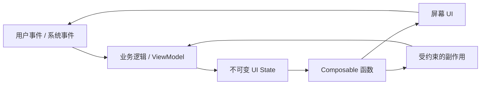

# Jetpack Compose 学习笔记总览

最后调研时间：2026-06-11  
适用范围：Android 原生 Jetpack Compose。笔记默认使用 Kotlin、Android Gradle Plugin、Compose BOM、Material 3、Navigation Compose、ViewModel、Kotlin Coroutines/Flow。

## 这套笔记解决什么问题

Jetpack Compose 是 Android 的声明式 UI 工具包。学习它不能只背 API，因为真正容易出问题的是：状态放在哪里、什么时候重组、为什么副作用重复执行、Lazy 列表为什么卡顿、ViewModel 和 Compose 怎么分工、Navigation 怎么保存状态、测试怎么定位节点。

本目录按学习路径拆分：

| 文件 | 主题 | 适合什么时候看 |
|---|---|---|
| [01-overview-and-setup.md](01-overview-and-setup.md) | Compose 是什么、环境、Gradle、BOM、Compiler | 刚开始搭项目或排查版本问题 |
| [02-core-model-composition-recomposition.md](02-core-model-composition-recomposition.md) | 声明式模型、Composition、Recomposition、Slot Table 思维模型 | 理解 Compose 为什么这样写 |
| [03-state-and-state-hoisting.md](03-state-and-state-hoisting.md) | `remember`、`rememberSaveable`、状态提升、ViewModel、Flow | 写交互页面前必看 |
| [04-side-effects-and-lifecycle.md](04-side-effects-and-lifecycle.md) | `LaunchedEffect`、`DisposableEffect`、`SideEffect`、`produceState`、生命周期 | 处理网络请求、订阅、一次性事件 |
| [05-ui-foundation-layout-modifier-material3.md](05-ui-foundation-layout-modifier-material3.md) | Composable、Modifier、布局、Lazy、Material 3、主题 | 写页面和组件 |
| [06-architecture-navigation-data-flow.md](06-architecture-navigation-data-flow.md) | UDF、MVVM、Navigation Compose、状态保存、模块边界 | 写中大型 App |
| [07-performance-stability-debugging.md](07-performance-stability-debugging.md) | 稳定性、跳过重组、Lazy 性能、工具、排查流程 | 页面卡顿或频繁重组时 |
| [08-testing-accessibility-interoperability.md](08-testing-accessibility-interoperability.md) | UI 测试、语义树、无障碍、与 View 互操作 | 上线质量保障 |
| [09-common-pitfalls-and-checklists.md](09-common-pitfalls-and-checklists.md) | 高频坑、代码审查清单、实战建议 | 开发和 Review 时快速查 |
| [10-references.md](10-references.md) | 官方文档和社区资料 | 深入查证 |

## 建议学习路线

1. 先读 `01` 和 `02`，建立“UI 是状态函数”的基本模型。
2. 读 `03` 和 `04`，把状态、事件、副作用边界理清楚。
3. 读 `05`，开始写实际页面和可复用组件。
4. 读 `06`，把 Compose 放进 MVVM / Clean Architecture / Navigation 的工程结构里。
5. 页面变复杂后读 `07`，重点掌握稳定性、Lazy 列表、重组排查。
6. 上线前读 `08` 和 `09`，补测试、无障碍和常见坑。

## Compose 的核心心智模型

关键原则：

- Composable 应该尽量是“状态输入 -> UI 输出”的纯描述。
- 状态向下传递，事件向上传递。
- 副作用必须放进 Compose 提供的 Effect API 或生命周期感知收集 API 中。
- UI 组件不要直接持有业务规则；业务规则放在 ViewModel、UseCase、Repository。
- 性能优化不是到处加 `remember`，而是减少无意义状态读取、提升类型稳定性、让列表有稳定 key。

## 版本说明

Compose 发展很快，下面这些内容会随版本变化：

- Compose BOM 最新版本。
- Compose Compiler 和 Kotlin 的兼容方式。
- Navigation Compose 的类型安全路由 API。
- Material 3 组件稳定性。
- 强跳过模式、稳定性配置、性能诊断工具。

本笔记写作时参考 Android Developers 官方文档，并补充了中文社区对实战坑点的总结。版本敏感信息请优先看 [10-references.md](10-references.md) 中的官方链接。

