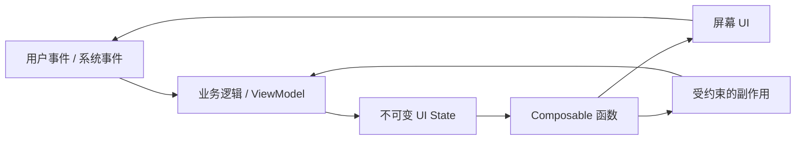
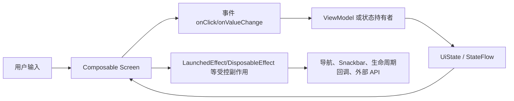
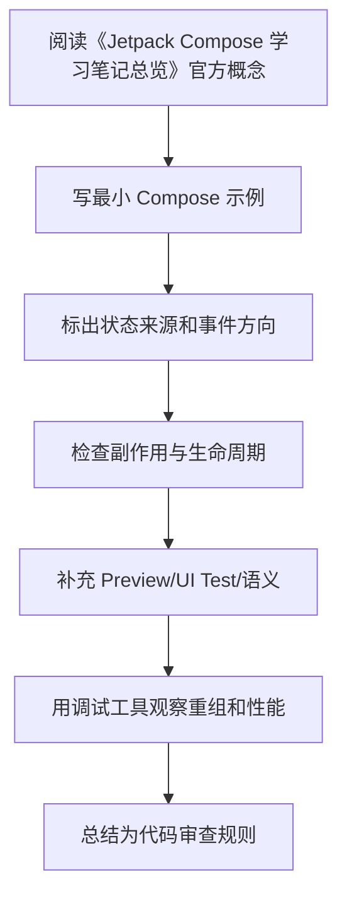

# Jetpack Compose 学习笔记总览

最后调研时间：2026-06-13  
适用范围：Android 原生 Jetpack Compose。笔记默认使用 Kotlin、Android Gradle Plugin、Compose BOM、Material 3、Navigation Compose、ViewModel、Kotlin Coroutines/Flow。

## 这套笔记解决什么问题

Jetpack Compose 是 Android 的声明式 UI 工具包。学习它不能只背 API，因为真正容易出问题的是：状态放在哪里、什么时候重组、为什么副作用重复执行、Lazy 列表为什么卡顿、ViewModel 和 Compose 怎么分工、Navigation 怎么保存状态、测试怎么定位节点。

本目录按学习路径拆分：

| 文件 | 主题 | 适合什么时候看 |
|---|---|---|
| [01-overview-and-setup.md](01-总览与环境配置.md) | Compose 是什么、环境、Gradle、BOM、Compiler | 刚开始搭项目或排查版本问题 |
| [02-core-model-composition-recomposition.md](02-核心模型与声明式AI.md) | 声明式模型、Composition、Recomposition、Slot Table 思维模型 | 理解 Compose 为什么这样写 |
| [03-state-and-state-hoisting.md](03-状态管理与状态提升.md) | `remember`、`rememberSaveable`、状态提升、ViewModel、Flow | 写交互页面前必看 |
| [04-side-effects-and-lifecycle.md](04-副作用与生命周期.md) | `LaunchedEffect`、`DisposableEffect`、`SideEffect`、`produceState`、生命周期 | 处理网络请求、订阅、一次性事件 |
| [05-ui-foundation-layout-modifier-material3.md](05-UI 基础.md) | Composable、Modifier、布局、Lazy、Material 3、主题 | 写页面和组件 |
| [06-architecture-navigation-data-flow.md](06-架构、导航与单向数据流.md) | UDF、MVVM、Navigation Compose、状态保存、模块边界 | 写中大型 App |
| [07-performance-stability-debugging.md](07-性能、稳定性与调试.md) | 稳定性、跳过重组、Lazy 性能、工具、排查流程 | 页面卡顿或频繁重组时 |
| [08-testing-accessibility-interoperability.md](08-测试、无障碍与 View 互操作.md) | UI 测试、语义树、无障碍、与 View 互操作 | 上线质量保障 |
| [09-common-pitfalls-and-checklists.md](09-常见坑与检查清单.md) | 高频坑、代码审查清单、实战建议 | 开发和 Review 时快速查 |
| [10-references.md](10-参考资料.md) | 官方文档和社区资料 | 深入查证 |
| [11-practical-sample-feed.md](11-实战串联：Feed 列表页到详情页.md) | 从列表页到详情页的完整实战样例 | 想把前面知识串成项目代码时 |

## 建议学习路线

1. 先读 `01` 和 `02`，建立“UI 是状态函数”的基本模型。
2. 读 `03` 和 `04`，把状态、事件、副作用边界理清楚。
3. 读 `05`，开始写实际页面和可复用组件。
4. 读 `06`，把 Compose 放进 MVVM / Clean Architecture / Navigation 的工程结构里。
5. 页面变复杂后读 `07`，重点掌握稳定性、Lazy 列表、重组排查。
6. 上线前读 `08` 和 `09`，补测试、无障碍和常见坑。
7. 最后读 `11`，把状态、架构、导航、副作用、测试串成一个可落地的 Feed 示例。

## Compose 的核心心智模型



关键原则：

- Composable 应该尽量是“状态输入 -> UI 输出”的纯描述。
- 状态向下传递，事件向上传递。
- 副作用必须放进 Compose 提供的 Effect API 或生命周期感知收集 API 中。
- UI 组件不要直接持有业务规则；业务规则放在 ViewModel、UseCase、Repository。
- 性能优化不是到处加 `remember`，而是减少无意义状态读取、提升类型稳定性、让列表有稳定 key。

## 学完后应该能做什么

读完这套笔记后，至少应该能独立完成下面这些任务：

- 搭建一个使用 Kotlin 2.x、Compose BOM、Material 3、Navigation Compose、Lifecycle Compose 的新页面模块。
- 判断状态应该放在 `remember`、`rememberSaveable`、ViewModel、`SavedStateHandle` 还是 Repository。
- 写出 `Route + Screen + ViewModel + UiState + Event/Effect` 的页面结构。
- 使用类型安全 Navigation Compose 传递简单参数，并避免把大对象塞进导航参数。
- 在 Lazy 列表中正确配置 `key`、`contentType`、图片尺寸和滚动状态。
- 使用 `LaunchedEffect`、`DisposableEffect`、`rememberUpdatedState`、`snapshotFlow` 处理副作用，不依赖 Composable 执行次数。
- 用 Compose UI Test 验证加载、成功、失败、点击、输入和动画时间推进。
- 用 Layout Inspector、Compose Compiler metrics、Macrobenchmark 初步定位重组和卡顿问题。

## 推荐练习顺序

| 练习 | 目标 |
|---|---|
| Counter 页面 | 理解 `rememberSaveable`、状态驱动 UI |
| 搜索列表页 | 练习状态提升、ViewModel、Flow 收集 |
| Feed + Detail | 练习 Lazy 列表、导航参数、详情页恢复 |
| 登录页 | 练习表单状态、一次性事件、Snackbar、导航 |
| 混合 View 页面 | 练习 `ComposeView`、`AndroidView` 和生命周期释放 |
| 性能排查 | 练习 stable key、稳定性报告、滚动性能测量 |

## 版本说明

Compose 发展很快，下面这些内容会随版本变化：

- Compose BOM 最新版本。
- Compose Compiler 和 Kotlin 的兼容方式。
- Navigation Compose 的类型安全路由 API。
- Material 3 组件稳定性。
- 强跳过模式、稳定性配置、性能诊断工具。

本笔记写作时参考 Android Developers 官方文档，并补充了中文社区对实战坑点的总结。版本敏感信息请优先看 [10-references.md](10-参考资料.md) 中的官方链接。

---

## 万字精讲扩展（2026-06-16 更新）
> Last researched: 2026-06-16。本文补充内容以 Jetpack Compose 官方文档和 Android Developers 实践资料为主；涉及 Compose Compiler、Kotlin、Navigation、Material3、Lifecycle、Performance 的版本细节，应在真实项目中继续核对最新官方 release notes。

### 本章在 Compose 学习路线中的位置

《Jetpack Compose 学习笔记总览》是 Compose 能力闭环中的一个节点。Compose 学习不能只停留在静态页面，还要覆盖状态、事件、副作用、生命周期、导航、性能、测试、无障碍和 View 互操作。一个 composable 写出来能显示，只说明第一步完成；它能在重组、旋转、返回栈恢复、无障碍服务、release 构建、长列表和低端设备上稳定工作，才说明写法可靠。

本章学习完成后，建议至少达到三个标准。第一，能用 Compose 心智模型解释本章 API 的作用和边界。第二，能写出最小可运行例子，并指出状态来源、事件方向和副作用生命周期。第三，能制造一个常见错误并用工具或测试验证修复效果。Compose 是声明式 UI，但工程质量仍然依赖清晰边界和可验证实践。

### 总览路线类笔记的精讲重点

路线类笔记的目标是给 Compose 建立学习地图。推荐顺序是：先理解声明式 UI 和重组，再学状态管理和状态提升，再学副作用和生命周期，再学布局、Modifier、Lazy 和 Material3，再学架构、导航和单向数据流，最后补性能、测试、无障碍和 View 互操作。不要一开始就陷入复杂动画或自定义布局，否则容易缺少状态和副作用基础。

Compose 学习成果应以完整页面衡量，而不是以 API 数量衡量。一个合格练习页面应该有加载态、空态、错误态、内容态、用户事件、状态保存、导航、列表 key、测试标签或语义、基本无障碍和性能检查点。只做静态 UI 不能代表掌握 Compose。

### Compose 的核心心智模型：UI 是状态的函数，但函数必须足够纯

Compose 最重要的转变不是“用 Kotlin 写 UI”，而是把 UI 看成状态的描述。一个 composable 根据输入参数和读取到的状态描述界面，状态变化后框架触发重组，重新执行需要更新的 composable。这个模型要求 composable 尽量幂等、快速、无副作用。官方 Thinking in Compose 文档特别强调，重组可能频繁发生，也可能被跳过或取消，因此不要在 composable 主体里直接执行网络请求、导航、写数据库、启动协程或修改外部对象。需要副作用时，要使用受 Compose 生命周期管理的 Effect API。

学习 Compose 要同时区分三件事：composition、recomposition 和 drawing/layout。Composition 是把 composable 调用组织成 UI 树的过程；recomposition 是状态变化后重新执行部分 composable；layout/draw 是测量、摆放和绘制阶段。性能问题不一定来自重组，可能来自布局太复杂、绘制太重、列表 item 没有 key、状态读取范围太宽、参数不稳定、图片加载或主线程阻塞。只把“少重组”当成唯一目标，会误判很多问题。

### 状态、事件、副作用的单向流



Figure: Compose 单向数据流和副作用边界，综合 Android 官方 State、State Hoisting、Side-effects、Lifecycle in Compose 文档整理。

这个图的关键是方向。UI 读取状态并发出事件，状态持有者处理事件并产生新状态，UI 根据新状态重组。副作用不应该散落在 composable 主体里，而要放在能够表达启动、取消、更新和清理时机的 Effect API 中。导航、Snackbar、权限请求、监听器注册、Flow 收集、动画启动、外部 View 生命周期绑定，都属于需要明确边界的动作。

### Compose 学习必须建立版本意识

Compose 与 Kotlin、Compose Compiler、Android Gradle Plugin、Material3、Navigation、Lifecycle、Activity Compose 等库存在版本关系。Kotlin 2.0 之后 Compose Compiler 移入 Kotlin 仓库，旧项目仍可能遇到 compiler extension 与 Kotlin 版本不匹配的问题。学习笔记里不要只写“加某个依赖”，还要写 BOM、Kotlin 插件、Compose Compiler、Navigation 版本、Lifecycle Compose 版本以及是否使用类型安全导航、强跳过模式等条件。遇到构建错误时，优先查官方兼容表和 release notes。

### 最小可验证学习法

每个 Compose 主题都应该写一个最小验证例子。学习状态时，写一个文本输入、筛选列表或展开面板；学习副作用时，写 Snackbar、定时器、生命周期监听或 Flow 收集；学习 Lazy 列表时，写稳定 key、滚动位置、分页占位和 item 状态；学习性能时，写一个会过度重组的例子，再用状态拆分、remember、derivedStateOf 或稳定参数修正；学习测试时，用 semantics 查找节点并验证状态变化。只有能制造错误并修复，才算真正理解。

### 核心知识点逐条精讲

#### 1. 学习路线

在《Jetpack Compose 学习笔记总览》中，`学习路线` 不应该只理解成一个 API 名称，而要放进 Compose 的组合、重组、状态和副作用模型里看。学习时先问：它读取什么状态，谁拥有这些状态，变化后会让哪些 composable 重组，是否需要保存到配置变化后，是否会触发外部副作用，是否会影响测试语义或无障碍。能回答这些问题，才说明你真正按 Compose 的方式思考。

实现 ` 学习路线 ` 时，建议先写一个最小 demo，再写一个错误版本。比如状态提升可以写“子组件内部 remember 导致外部无法控制”的错误例子；LaunchedEffect 可以写“key 变化导致重复请求”的错误例子；Lazy key 可以写“插入 item 后状态错位”的错误例子；Navigation 可以写“传复杂对象导致恢复困难”的错误例子。制造错误比只看正确代码更能建立边界感。

代码审查时要把 ` 学习路线 ` 转成检查项：状态是否单一来源，参数是否稳定，Modifier 是否作为参数传入，副作用是否有正确 key 和清理逻辑，Flow 是否生命周期感知收集，Lazy item 是否有稳定 key，语义是否可测试且可访问，release 构建和性能工具是否验证过。Compose 项目的质量通常取决于这些细节是否一致执行。

#### 2. 核心心智模型

在《Jetpack Compose 学习笔记总览》中，`核心心智模型` 不应该只理解成一个 API 名称，而要放进 Compose 的组合、重组、状态和副作用模型里看。学习时先问：它读取什么状态，谁拥有这些状态，变化后会让哪些 composable 重组，是否需要保存到配置变化后，是否会触发外部副作用，是否会影响测试语义或无障碍。能回答这些问题，才说明你真正按 Compose 的方式思考。

实现 ` 核心心智模型 ` 时，建议先写一个最小 demo，再写一个错误版本。比如状态提升可以写“子组件内部 remember 导致外部无法控制”的错误例子；LaunchedEffect 可以写“key 变化导致重复请求”的错误例子；Lazy key 可以写“插入 item 后状态错位”的错误例子；Navigation 可以写“传复杂对象导致恢复困难”的错误例子。制造错误比只看正确代码更能建立边界感。

代码审查时要把 ` 核心心智模型 ` 转成检查项：状态是否单一来源，参数是否稳定，Modifier 是否作为参数传入，副作用是否有正确 key 和清理逻辑，Flow 是否生命周期感知收集，Lazy item 是否有稳定 key，语义是否可测试且可访问，release 构建和性能工具是否验证过。Compose 项目的质量通常取决于这些细节是否一致执行。

#### 3. 练习顺序

在《Jetpack Compose 学习笔记总览》中，`练习顺序` 不应该只理解成一个 API 名称，而要放进 Compose 的组合、重组、状态和副作用模型里看。学习时先问：它读取什么状态，谁拥有这些状态，变化后会让哪些 composable 重组，是否需要保存到配置变化后，是否会触发外部副作用，是否会影响测试语义或无障碍。能回答这些问题，才说明你真正按 Compose 的方式思考。

实现 ` 练习顺序 ` 时，建议先写一个最小 demo，再写一个错误版本。比如状态提升可以写“子组件内部 remember 导致外部无法控制”的错误例子；LaunchedEffect 可以写“key 变化导致重复请求”的错误例子；Lazy key 可以写“插入 item 后状态错位”的错误例子；Navigation 可以写“传复杂对象导致恢复困难”的错误例子。制造错误比只看正确代码更能建立边界感。

代码审查时要把 ` 练习顺序 ` 转成检查项：状态是否单一来源，参数是否稳定，Modifier 是否作为参数传入，副作用是否有正确 key 和清理逻辑，Flow 是否生命周期感知收集，Lazy item 是否有稳定 key，语义是否可测试且可访问，release 构建和性能工具是否验证过。Compose 项目的质量通常取决于这些细节是否一致执行。

#### 4. 能力闭环

在《Jetpack Compose 学习笔记总览》中，`能力闭环` 不应该只理解成一个 API 名称，而要放进 Compose 的组合、重组、状态和副作用模型里看。学习时先问：它读取什么状态，谁拥有这些状态，变化后会让哪些 composable 重组，是否需要保存到配置变化后，是否会触发外部副作用，是否会影响测试语义或无障碍。能回答这些问题，才说明你真正按 Compose 的方式思考。

实现 ` 能力闭环 ` 时，建议先写一个最小 demo，再写一个错误版本。比如状态提升可以写“子组件内部 remember 导致外部无法控制”的错误例子；LaunchedEffect 可以写“key 变化导致重复请求”的错误例子；Lazy key 可以写“插入 item 后状态错位”的错误例子；Navigation 可以写“传复杂对象导致恢复困难”的错误例子。制造错误比只看正确代码更能建立边界感。

代码审查时要把 ` 能力闭环 ` 转成检查项：状态是否单一来源，参数是否稳定，Modifier 是否作为参数传入，副作用是否有正确 key 和清理逻辑，Flow 是否生命周期感知收集，Lazy item 是否有稳定 key，语义是否可测试且可访问，release 构建和性能工具是否验证过。Compose 项目的质量通常取决于这些细节是否一致执行。

#### 5. 版本说明

在《Jetpack Compose 学习笔记总览》中，`版本说明` 不应该只理解成一个 API 名称，而要放进 Compose 的组合、重组、状态和副作用模型里看。学习时先问：它读取什么状态，谁拥有这些状态，变化后会让哪些 composable 重组，是否需要保存到配置变化后，是否会触发外部副作用，是否会影响测试语义或无障碍。能回答这些问题，才说明你真正按 Compose 的方式思考。

实现 ` 版本说明 ` 时，建议先写一个最小 demo，再写一个错误版本。比如状态提升可以写“子组件内部 remember 导致外部无法控制”的错误例子；LaunchedEffect 可以写“key 变化导致重复请求”的错误例子；Lazy key 可以写“插入 item 后状态错位”的错误例子；Navigation 可以写“传复杂对象导致恢复困难”的错误例子。制造错误比只看正确代码更能建立边界感。

代码审查时要把 ` 版本说明 ` 转成检查项：状态是否单一来源，参数是否稳定，Modifier 是否作为参数传入，副作用是否有正确 key 和清理逻辑，Flow 是否生命周期感知收集，Lazy item 是否有稳定 key，语义是否可测试且可访问，release 构建和性能工具是否验证过。Compose 项目的质量通常取决于这些细节是否一致执行。


### 场景化学习与排错表

| 主题 | 推荐动作 | 常见风险 | 验证方式 |
| :--- | :--- | :--- | :--- |
| 学习路线 | 用最小 demo 验证正确写法和错误写法，再放入完整页面 | 重组重复执行、副作用 key 错、状态源重复、稳定性误判、测试语义缺失 | Preview、Compose UI Test、Layout Inspector、重组计数、Macrobenchmark、真机验证 |
| 核心心智模型 | 用最小 demo 验证正确写法和错误写法，再放入完整页面 | 重组重复执行、副作用 key 错、状态源重复、稳定性误判、测试语义缺失 | Preview、Compose UI Test、Layout Inspector、重组计数、Macrobenchmark、真机验证 |
| 练习顺序 | 用最小 demo 验证正确写法和错误写法，再放入完整页面 | 重组重复执行、副作用 key 错、状态源重复、稳定性误判、测试语义缺失 | Preview、Compose UI Test、Layout Inspector、重组计数、Macrobenchmark、真机验证 |
| 能力闭环 | 用最小 demo 验证正确写法和错误写法，再放入完整页面 | 重组重复执行、副作用 key 错、状态源重复、稳定性误判、测试语义缺失 | Preview、Compose UI Test、Layout Inspector、重组计数、Macrobenchmark、真机验证 |
| 版本说明 | 用最小 demo 验证正确写法和错误写法，再放入完整页面 | 重组重复执行、副作用 key 错、状态源重复、稳定性误判、测试语义缺失 | Preview、Compose UI Test、Layout Inspector、重组计数、Macrobenchmark、真机验证 |

这个表的重点是“能复现、能观察、能修复”。Compose 很多问题不会编译报错，而是表现为重组过多、状态丢失、事件重复、列表错位、TalkBack 读不清、测试找不到节点或某些机型上卡顿。只有建立可观察的验证方法，才能避免靠经验猜。

### 本章建议工作流



Figure: 《Jetpack Compose 学习笔记总览》学习工作流，综合 Android 官方 Compose mental model、state、side-effects、performance、accessibility 和 testing 资料整理。

这个流程适合所有 Compose 主题。先理解概念，再落到小例子，再放回真实页面，再用测试和工具验证。不要在没有状态图的情况下写复杂 UI，也不要在没有测量的情况下做性能优化。

### 常见误区和纠正方法

- 误区：在 composable 主体里执行副作用。纠正：网络、导航、Snackbar、注册监听器、启动协程等动作应放入合适 Effect API 或 ViewModel 事件处理中。
- 误区：所有状态都放 ViewModel。纠正：纯 UI 元素状态可以靠近使用处，屏幕级和业务相关状态再提升到 ViewModel。
- 误区：所有地方都加 remember。纠正：remember 是保存计算或对象的工具，不是性能万能药；先测量，再判断是否需要。
- 误区：Lazy 列表不写 key。纠正：可变列表、插入删除、分页和 item 内状态都应使用稳定 key，避免状态错位。
- 误区：测试只靠 testTag。纠正：优先设计有意义的语义，testTag 作为补充；无障碍和测试都依赖语义质量。
- 误区：忽略版本兼容。纠正：Compose Compiler、Kotlin、BOM、Material3、Navigation 和 Lifecycle Compose 都要按官方版本说明维护。

### 与相邻章节的关系

《Jetpack Compose 学习笔记总览》应与状态、副作用、架构、性能和测试章节交叉阅读。状态决定重组，副作用决定外部动作是否可控，架构决定状态和事件放在哪里，性能决定重组和布局是否可接受，测试和无障碍决定 UI 是否能被可靠验证和使用。任何一个章节单独学习都不够，最终要在一个完整页面中串起来。

### 实操训练和复盘模板

1. 围绕 `学习路线` 写一个最小页面：包含正确实现、故意错误实现、观察结果和修复总结。
2. 围绕 `核心心智模型` 写一个最小页面：包含正确实现、故意错误实现、观察结果和修复总结。
3. 围绕 `练习顺序` 写一个最小页面：包含正确实现、故意错误实现、观察结果和修复总结。
4. 围绕 `能力闭环` 写一个最小页面：包含正确实现、故意错误实现、观察结果和修复总结。
5. 围绕 `版本说明` 写一个最小页面：包含正确实现、故意错误实现、观察结果和修复总结。

建议每个 Compose 练习都记录：

```text
练习名称：
本章主题：Jetpack Compose 学习笔记总览
Compose / Kotlin / AGP / BOM 版本：
状态来源：local state / rememberSaveable / ViewModel / Repository
事件流向：UI -> ViewModel / state holder -> UiState -> UI
副作用：Effect API、key、取消和清理逻辑
测试入口：semantics、testTag、Preview、UI Test
性能观察：重组范围、Lazy key、稳定性、主线程耗时
失败场景：旋转、返回栈恢复、快速点击、断网、长列表、字体放大、TalkBack
结论：以后项目中采用的规则
```

这个模板的意义是把 Compose 学习从“API 记忆”推进到“页面质量”。真实项目中的 Compose 问题通常跨越状态、生命周期、导航、性能和无障碍，复盘时必须把这些因素放在一起看。

## 参考资料与延伸阅读

- [Official / Android] Jetpack Compose documentation: https://developer.android.com/develop/ui/compose
- [Official / Android] Thinking in Compose: https://developer.android.com/develop/ui/compose/mental-model
- [Official / Android] State and Jetpack Compose: https://developer.android.com/develop/ui/compose/state
- [Official / Android] Where to hoist state: https://developer.android.com/develop/ui/compose/state-hoisting
- [Official / Android] Side-effects in Compose: https://developer.android.com/develop/ui/compose/side-effects
- [Official / Android] Lifecycle in Jetpack Compose: https://developer.android.com/topic/libraries/architecture/lifecycle
- [Official / Android] Lazy lists and lazy grids: https://developer.android.com/develop/ui/compose/lists
- [Official / Android] Compose performance: https://developer.android.com/develop/ui/compose/performance
- [Official / Android] Stability in Compose: https://developer.android.com/develop/ui/compose/performance/stability
- [Official / Android] Strong skipping mode: https://developer.android.com/develop/ui/compose/performance/stability/strongskipping
- [Official / Android] Accessibility in Jetpack Compose: https://developer.android.com/develop/ui/compose/accessibility
- [Official / Android] Semantics in Compose: https://developer.android.com/develop/ui/compose/accessibility/semantics
- [Official / Android] Type safety in Navigation Compose: https://developer.android.com/guide/navigation/design/type-safety
- [Official / Android] Compose to Kotlin Compatibility Map: https://developer.android.com/jetpack/androidx/releases/compose-kotlin
- [Official / Android] Compose Compiler release notes: https://developer.android.com/jetpack/androidx/releases/compose-compiler
- [Official / Android Developers Blog] Jetpack Compose compiler moving to the Kotlin repository: https://android-developers.googleblog.com/2024/04/jetpack-compose-compiler-moving-to-kotlin-repository.html
- [Official / Android Developers Blog] What's New in Jetpack Compose: https://android-developers.googleblog.com/2025/05/whats-new-in-jetpack-compose.html
- [Official / Android Developers Blog] Strong Skipping Mode Explained: https://medium.com/androiddevelopers/jetpack-compose-strong-skipping-mode-explained-cbdb2aa4b900
- [Official / Android Developers Blog] Fundamentals of Compose layouts and modifiers: https://medium.com/androiddevelopers/fundamentals-of-compose-layouts-and-modifiers-64d794664b66
- [Official / Android Developers Blog] Consuming flows safely in Jetpack Compose: https://medium.com/androiddevelopers/consuming-flows-safely-in-jetpack-compose-cde014d0d5a3
- [Official / Android Developers Blog] Navigation Compose meet Type Safety: https://medium.com/androiddevelopers/navigation-compose-meet-type-safety-e081fb3cf2f8
- [Community / CSDN] Jetpack Compose 学习笔记检索入口: https://so.csdn.net/so/search?q=Jetpack%20Compose%20%E5%AD%A6%E4%B9%A0%E7%AC%94%E8%AE%B0
- [Community / 博客园] Compose 状态与副作用实践检索入口: https://zzk.cnblogs.com/s/blogpost?Keywords=Jetpack%20Compose%20%E7%8A%B6%E6%80%81%20%E5%89%AF%E4%BD%9C%E7%94%A8
- [Community / 掘金] Compose 性能、导航、架构实践检索入口: https://juejin.cn/search?query=Jetpack%20Compose%20%E6%80%A7%E8%83%BD%20%E5%AF%BC%E8%88%AA%20%E6%9E%B6%E6%9E%84&type=0
