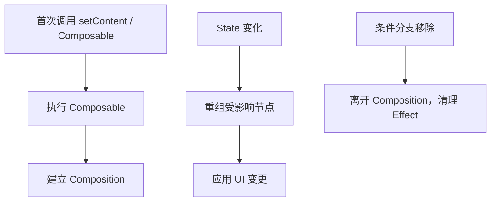

# 02. 核心模型：Composition、Recomposition 与声明式 UI

最后调研时间：2026-06-13  
主要来源：Android Developers Compose mental model、lifecycle、state 文档。

## 1. Compose 的基本公式

```text
UI = f(state)
```

Composable 函数描述“给定当前状态，屏幕应该是什么样”。当状态变化时，Compose 会重新执行受影响的 Composable，这个过程叫重组。

重要区别：

| View 系统 | Compose |
|---|---|
| 创建 View 后手动修改属性 | 根据状态重新描述 UI |
| 容易散落 `findViewById`、Adapter、Listener | UI 与状态关系更直接 |
| 局部更新通常由开发者手动维护 | Compose 根据状态读取追踪重组范围 |
| 生命周期与 View 树强绑定 | Composition 有自己的进入、重组、离开过程 |

## 2. Composable 函数的性质

Composable 函数不是普通渲染函数。它由 Compose Compiler 改写，参与 Composition 管理。

应该做到：

- 快速执行。
- 幂等：同样输入应描述同样 UI。
- 尽量无副作用。
- 只读取自己需要的状态。
- 用参数暴露状态和事件，不隐式依赖全局可变对象。

不应该做：

```kotlin
@Composable
fun BadScreen(repo: UserRepository) {
    val user = repo.loadUserBlocking() // 错：阻塞、不可控、副作用
    Text(user.name)
}
```

应该把加载放到 ViewModel 或 Effect：

```kotlin
@Composable
fun UserRoute(viewModel: UserViewModel = viewModel()) {
    val uiState by viewModel.uiState.collectAsStateWithLifecycle()
    UserScreen(uiState = uiState, onRetry = viewModel::retry)
}
```

## 3. Composition 是什么

Composition 是 Compose 维护的 UI 结构记录。初次执行 Composable 时，Compose 建立 Composition；状态变化后，Compose 可以在已有 Composition 上更新。



Composition 中记录了：

- Composable 调用位置。
- `remember` 保存的值。
- 状态读取关系。
- Effect 生命周期。
- 可跳过的重组范围。

## 4. Recomposition 是什么

Recomposition 是状态变化后，Compose 重新执行可能受影响的 Composable。

示例：

```kotlin
@Composable
fun Parent() {
    var count by remember { mutableIntStateOf(0) }

    Column {
        Header()
        Counter(count = count, onClick = { count++ })
        Footer()
    }
}
```

当 `count` 变化时，Compose 会重新执行读取 `count` 的相关范围。不是整个屏幕都必然重新绘制；Compose 会尝试跳过输入未变化且稳定的部分。

关键点：

- 重组是正常机制，不是错误。
- 频繁重组不一定等于卡顿，昂贵重组才危险。
- 不要在 Composable 中写依赖执行次数的逻辑。
- Composable 调用顺序和 key 会影响 `remember` 状态归属。

## 5. 状态读取决定重组范围

```kotlin
@Composable
fun BadList(items: List<Item>, selectedId: String?) {
    LazyColumn {
        items(items) { item ->
            Row(
                modifier = Modifier.background(
                    if (selectedId == item.id) Color.Blue else Color.Transparent
                )
            ) {
                Text(item.title)
            }
        }
    }
}
```

这里每个 item 都读取 `selectedId`，选择变化时大量 item 都可能重组。可以把状态判断下推，或用稳定 key、派生状态减少计算。

```kotlin
@Composable
fun BetterList(items: List<Item>, selectedId: String?) {
    LazyColumn {
        items(
            items = items,
            key = { it.id }
        ) { item ->
            ItemRow(
                item = item,
                selected = item.id == selectedId
            )
        }
    }
}
```

这里仍会让可见 item 接收 `selected`，但状态和组件边界更清晰，也便于进一步优化。

## 6. `remember` 的真实含义

`remember` 把对象保存在当前调用位置对应的 Composition 中。它不是全局缓存，也不保证进程死亡后恢复。

```kotlin
@Composable
fun SearchBox() {
    var query by remember { mutableStateOf("") }
    TextField(value = query, onValueChange = { query = it })
}
```

`remember` 生命周期：

| 情况 | 是否保留 |
|---|---|
| 普通重组 | 保留 |
| 当前 Composable 离开 Composition | 丢失 |
| Activity 配置变更 | 通常丢失，除非使用 `rememberSaveable` |
| 进程死亡恢复 | 普通 `remember` 不保留 |

`remember(key)`：

```kotlin
val formatter = remember(locale) {
    DateTimeFormatter.ofPattern("yyyy-MM-dd", locale)
}
```

当 key 改变时，旧值被丢弃，新 lambda 执行。

## 7. `key` 的作用

在条件分支或列表中，如果组合顺序变化，Compose 需要知道哪些状态属于哪个元素。

错误示例：

```kotlin
items(users) { user ->
    var expanded by remember { mutableStateOf(false) }
    UserRow(user, expanded, onToggle = { expanded = !expanded })
}
```

如果 `users` 重新排序，没有稳定 key 时，`expanded` 可能跟着位置走，而不是跟着用户走。

正确做法：

```kotlin
items(
    items = users,
    key = { it.id }
) { user ->
    var expanded by rememberSaveable(user.id) { mutableStateOf(false) }
    UserRow(user, expanded, onToggle = { expanded = !expanded })
}
```

或者更推荐：把展开状态放到 ViewModel，以 `user.id` 为 key 管理。

## 8. 稳定性与跳过

Compose 编译器会根据参数类型稳定性判断某个 Composable 是否可以跳过。

简化理解：

| 类型 | 通常表现 |
|---|---|
| 基本类型、String、函数类型 | 通常稳定 |
| `MutableList`、`MutableMap` | 不稳定 |
| 普通 data class | 取决于字段是否稳定 |
| 使用不可变集合或 `@Immutable` 的模型 | 更容易被视为稳定 |
| 含可变公开属性的类 | 容易不稳定 |

稳定类型意味着：如果参数值没变，Compose 更有信心跳过重组。

推荐 UI State：

```kotlin
@Immutable
data class UserListUiState(
    val loading: Boolean = false,
    val users: ImmutableList<UserUiModel> = persistentListOf(),
    val errorMessage: String? = null
)
```

如果不引入 Kotlinx Immutable Collections，也至少避免把可变集合暴露给 UI：

```kotlin
data class UserListUiState(
    val users: List<UserUiModel> = emptyList()
)
```

但要知道：普通 `List` 接口不天然保证实现不可变，性能敏感页面需要进一步诊断。

## 9. Snapshot 系统的直觉

Compose 的 `mutableStateOf` 不是普通变量，它参与 Snapshot 状态系统。可以简化理解为：

- 当 Composable 读取某个 State，Compose 记录“这个位置依赖这个状态”。
- 当 State 写入新值，依赖它的相关范围会被标记为需要重组。
- 状态写入通常应该发生在主线程或受控协程上下文中，避免并发修改带来的难查问题。
- 不可观察的普通可变对象内部变化不会自动通知 Compose。

示例：

```kotlin
var title by remember { mutableStateOf("Hello") }

Text(title) // 读取 title，建立依赖

Button(onClick = { title = "Compose" }) {
    Text("更新")
}
```

如果状态对象内部藏了可变字段，Compose 只能看到外层引用是否变化，无法知道内部字段是否被偷偷改了。

```kotlin
data class UserUiState(
    val tags: MutableList<String>
)
```

这种模型既难推理，也会影响稳定性判断。UI State 应尽量使用不可变字段。

## 10. Composable 调用顺序与条件分支

```kotlin
@Composable
fun Profile(showDetails: Boolean) {
    Header()
    if (showDetails) {
        Details()
    }
    Footer()
}
```

当 `showDetails` 从 true 变 false：

- `Details` 离开 Composition。
- `Details` 内的 `remember` 状态被丢弃。
- `Details` 内的 `DisposableEffect` 会清理。
- `Footer` 是否保留状态，依赖 Compose 对调用位置和 group 的识别。

复杂动态结构中，使用 `key(id)` 明确身份：

```kotlin
key(user.id) {
    UserCard(user)
}
```

## 11. 跳过、重组、重绘的关系

三者不要混为一谈：

| 概念 | 发生了什么 | 是否一定导致下一步 |
|---|---|---|
| 重组 Recomposition | 重新执行部分 Composable | 不一定重新布局或重绘 |
| 布局 Layout | 重新测量和摆放节点 | 不一定重绘所有内容 |
| 绘制 Draw | 重新绘制像素 | 不一定重新执行 Composable |

优化方向取决于瓶颈在哪个阶段：

- 文本、列表 item、条件分支频繁变化，多看重组范围。
- 尺寸、约束、图片加载导致跳动，多看布局。
- 阴影、模糊、渐变、大面积透明叠加，多看绘制。

这也是为什么 `Modifier.graphicsLayer { translationY = ... }` 有时比在 Composition 阶段读取滚动状态更合适：如果只是视觉位移，不需要整块 UI 重新执行。

## 12. 常见误解

| 误解 | 正确认识 |
|---|---|
| 重组就是重绘 | 重组是重新执行 Composable，最终是否绘制取决于变化和渲染层 |
| `remember` 可以存业务状态 | 只适合 UI 局部状态；业务状态应进 ViewModel |
| 所有 Composable 都要加 `remember` 优化 | 滥用 `remember` 会增加复杂度，先测量 |
| Composable 只会执行一次 | 它可能被多次执行、跳过、取消、重新执行 |
| `LaunchedEffect(Unit)` 永远只执行一次 | 只在当前 Composition 生命周期内“一次”，离开再进入会重新执行 |

## 13. 小结

写 Compose 时要始终问：

- 这个状态属于谁？
- 这个 Composable 读取了哪些状态？
- 这个状态变化时，哪些 UI 应该变化？
- 这里有没有副作用依赖 Composable 执行次数？
- 动态列表中的元素有没有稳定身份？
