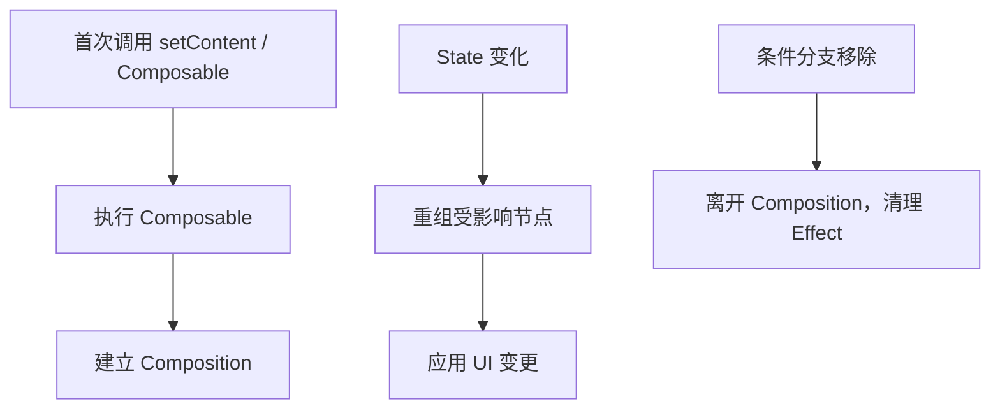
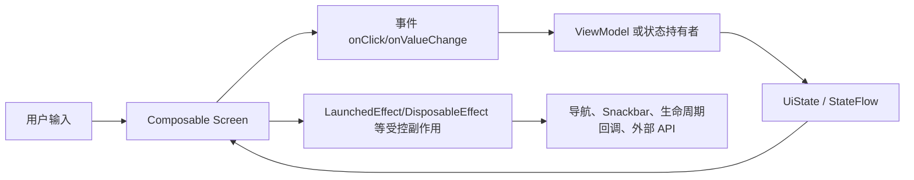
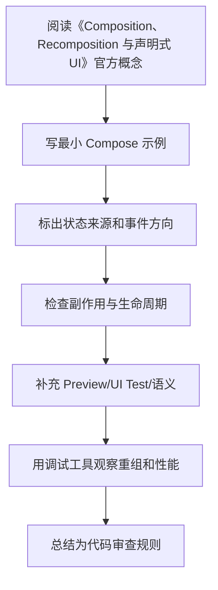

# 02. 核心模型：Composition、Recomposition 与声明式 UI

最后调研时间：2026-06-13  
主要来源：Android Developers Compose mental model、lifecycle、state 文档。

## 1. Compose 的基本公式

```text
UI = f(state)
```

Composable 函数描述“给定当前状态，屏幕应该是什么样”。当状态变化时，Compose 会重新执行受影响的 Composable，这个过程叫重组。

重要区别：

| View 系统 | Compose |
|---|---|
| 创建 View 后手动修改属性 | 根据状态重新描述 UI |
| 容易散落 `findViewById`、Adapter、Listener | UI 与状态关系更直接 |
| 局部更新通常由开发者手动维护 | Compose 根据状态读取追踪重组范围 |
| 生命周期与 View 树强绑定 | Composition 有自己的进入、重组、离开过程 |

## 2. Composable 函数的性质

Composable 函数不是普通渲染函数。它由 Compose Compiler 改写，参与 Composition 管理。

应该做到：

- 快速执行。
- 幂等：同样输入应描述同样 UI。
- 尽量无副作用。
- 只读取自己需要的状态。
- 用参数暴露状态和事件，不隐式依赖全局可变对象。

不应该做：

```kotlin
@Composable
fun BadScreen(repo: UserRepository) {
    val user = repo.loadUserBlocking() // 错：阻塞、不可控、副作用
    Text(user.name)
}
```

应该把加载放到 ViewModel 或 Effect：

```kotlin
@Composable
fun UserRoute(viewModel: UserViewModel = viewModel()) {
    val uiState by viewModel.uiState.collectAsStateWithLifecycle()
    UserScreen(uiState = uiState, onRetry = viewModel::retry)
}
```

## 3. Composition 是什么

Composition 是 Compose 维护的 UI 结构记录。初次执行 Composable 时，Compose 建立 Composition；状态变化后，Compose 可以在已有 Composition 上更新。



Composition 中记录了：

- Composable 调用位置。
- `remember` 保存的值。
- 状态读取关系。
- Effect 生命周期。
- 可跳过的重组范围。

## 4. Recomposition 是什么

Recomposition 是状态变化后，Compose 重新执行可能受影响的 Composable。

示例：

```kotlin
@Composable
fun Parent() {
    var count by remember { mutableIntStateOf(0) }

    Column {
        Header()
        Counter(count = count, onClick = { count++ })
        Footer()
    }
}
```

当 `count` 变化时，Compose 会重新执行读取 `count` 的相关范围。不是整个屏幕都必然重新绘制；Compose 会尝试跳过输入未变化且稳定的部分。

关键点：

- 重组是正常机制，不是错误。
- 频繁重组不一定等于卡顿，昂贵重组才危险。
- 不要在 Composable 中写依赖执行次数的逻辑。
- Composable 调用顺序和 key 会影响 `remember` 状态归属。

## 5. 状态读取决定重组范围

```kotlin
@Composable
fun BadList(items: List<Item>, selectedId: String?) {
    LazyColumn {
        items(items) { item ->
            Row(
                modifier = Modifier.background(
                    if (selectedId == item.id) Color.Blue else Color.Transparent
                )
            ) {
                Text(item.title)
            }
        }
    }
}
```

这里每个 item 都读取 `selectedId`，选择变化时大量 item 都可能重组。可以把状态判断下推，或用稳定 key、派生状态减少计算。

```kotlin
@Composable
fun BetterList(items: List<Item>, selectedId: String?) {
    LazyColumn {
        items(
            items = items,
            key = { it.id }
        ) { item ->
            ItemRow(
                item = item,
                selected = item.id == selectedId
            )
        }
    }
}
```

这里仍会让可见 item 接收 `selected`，但状态和组件边界更清晰，也便于进一步优化。

## 6. `remember` 的真实含义

`remember` 把对象保存在当前调用位置对应的 Composition 中。它不是全局缓存，也不保证进程死亡后恢复。

```kotlin
@Composable
fun SearchBox() {
    var query by remember { mutableStateOf("") }
    TextField(value = query, onValueChange = { query = it })
}
```

`remember` 生命周期：

| 情况 | 是否保留 |
|---|---|
| 普通重组 | 保留 |
| 当前 Composable 离开 Composition | 丢失 |
| Activity 配置变更 | 通常丢失，除非使用 `rememberSaveable` |
| 进程死亡恢复 | 普通 `remember` 不保留 |

`remember(key)`：

```kotlin
val formatter = remember(locale) {
    DateTimeFormatter.ofPattern("yyyy-MM-dd", locale)
}
```

当 key 改变时，旧值被丢弃，新 lambda 执行。

## 7. `key` 的作用

在条件分支或列表中，如果组合顺序变化，Compose 需要知道哪些状态属于哪个元素。

错误示例：

```kotlin
items(users) { user ->
    var expanded by remember { mutableStateOf(false) }
    UserRow(user, expanded, onToggle = { expanded = !expanded })
}
```

如果 `users` 重新排序，没有稳定 key 时，`expanded` 可能跟着位置走，而不是跟着用户走。

正确做法：

```kotlin
items(
    items = users,
    key = { it.id }
) { user ->
    var expanded by rememberSaveable(user.id) { mutableStateOf(false) }
    UserRow(user, expanded, onToggle = { expanded = !expanded })
}
```

或者更推荐：把展开状态放到 ViewModel，以 `user.id` 为 key 管理。

## 8. 稳定性与跳过

Compose 编译器会根据参数类型稳定性判断某个 Composable 是否可以跳过。

简化理解：

| 类型 | 通常表现 |
|---|---|
| 基本类型、String、函数类型 | 通常稳定 |
| `MutableList`、`MutableMap` | 不稳定 |
| 普通 data class | 取决于字段是否稳定 |
| 使用不可变集合或 `@Immutable` 的模型 | 更容易被视为稳定 |
| 含可变公开属性的类 | 容易不稳定 |

稳定类型意味着：如果参数值没变，Compose 更有信心跳过重组。

推荐 UI State：

```kotlin
@Immutable
data class UserListUiState(
    val loading: Boolean = false,
    val users: ImmutableList<UserUiModel> = persistentListOf(),
    val errorMessage: String? = null
)
```

如果不引入 Kotlinx Immutable Collections，也至少避免把可变集合暴露给 UI：

```kotlin
data class UserListUiState(
    val users: List<UserUiModel> = emptyList()
)
```

但要知道：普通 `List` 接口不天然保证实现不可变，性能敏感页面需要进一步诊断。

## 9. Snapshot 系统的直觉

Compose 的 `mutableStateOf` 不是普通变量，它参与 Snapshot 状态系统。可以简化理解为：

- 当 Composable 读取某个 State，Compose 记录“这个位置依赖这个状态”。
- 当 State 写入新值，依赖它的相关范围会被标记为需要重组。
- 状态写入通常应该发生在主线程或受控协程上下文中，避免并发修改带来的难查问题。
- 不可观察的普通可变对象内部变化不会自动通知 Compose。

示例：

```kotlin
var title by remember { mutableStateOf("Hello") }

Text(title) // 读取 title，建立依赖

Button(onClick = { title = "Compose" }) {
    Text("更新")
}
```

如果状态对象内部藏了可变字段，Compose 只能看到外层引用是否变化，无法知道内部字段是否被偷偷改了。

```kotlin
data class UserUiState(
    val tags: MutableList<String>
)
```

这种模型既难推理，也会影响稳定性判断。UI State 应尽量使用不可变字段。

## 10. Composable 调用顺序与条件分支

```kotlin
@Composable
fun Profile(showDetails: Boolean) {
    Header()
    if (showDetails) {
        Details()
    }
    Footer()
}
```

当 `showDetails` 从 true 变 false：

- `Details` 离开 Composition。
- `Details` 内的 `remember` 状态被丢弃。
- `Details` 内的 `DisposableEffect` 会清理。
- `Footer` 是否保留状态，依赖 Compose 对调用位置和 group 的识别。

复杂动态结构中，使用 `key(id)` 明确身份：

```kotlin
key(user.id) {
    UserCard(user)
}
```

## 11. 跳过、重组、重绘的关系

三者不要混为一谈：

| 概念 | 发生了什么 | 是否一定导致下一步 |
|---|---|---|
| 重组 Recomposition | 重新执行部分 Composable | 不一定重新布局或重绘 |
| 布局 Layout | 重新测量和摆放节点 | 不一定重绘所有内容 |
| 绘制 Draw | 重新绘制像素 | 不一定重新执行 Composable |

优化方向取决于瓶颈在哪个阶段：

- 文本、列表 item、条件分支频繁变化，多看重组范围。
- 尺寸、约束、图片加载导致跳动，多看布局。
- 阴影、模糊、渐变、大面积透明叠加，多看绘制。

这也是为什么 `Modifier.graphicsLayer { translationY = ... }` 有时比在 Composition 阶段读取滚动状态更合适：如果只是视觉位移，不需要整块 UI 重新执行。

## 12. 常见误解

| 误解 | 正确认识 |
|---|---|
| 重组就是重绘 | 重组是重新执行 Composable，最终是否绘制取决于变化和渲染层 |
| `remember` 可以存业务状态 | 只适合 UI 局部状态；业务状态应进 ViewModel |
| 所有 Composable 都要加 `remember` 优化 | 滥用 `remember` 会增加复杂度，先测量 |
| Composable 只会执行一次 | 它可能被多次执行、跳过、取消、重新执行 |
| `LaunchedEffect(Unit)` 永远只执行一次 | 只在当前 Composition 生命周期内“一次”，离开再进入会重新执行 |

## 13. 小结

写 Compose 时要始终问：

- 这个状态属于谁？
- 这个 Composable 读取了哪些状态？
- 这个状态变化时，哪些 UI 应该变化？
- 这里有没有副作用依赖 Composable 执行次数？
- 动态列表中的元素有没有稳定身份？

---

## 万字精讲扩展（2026-06-16 更新）
> Last researched: 2026-06-16。本文补充内容以 Jetpack Compose 官方文档和 Android Developers 实践资料为主；涉及 Compose Compiler、Kotlin、Navigation、Material3、Lifecycle、Performance 的版本细节，应在真实项目中继续核对最新官方 release notes。

### 本章在 Compose 学习路线中的位置

《Composition、Recomposition 与声明式 UI》是 Compose 能力闭环中的一个节点。Compose 学习不能只停留在静态页面，还要覆盖状态、事件、副作用、生命周期、导航、性能、测试、无障碍和 View 互操作。一个 composable 写出来能显示，只说明第一步完成；它能在重组、旋转、返回栈恢复、无障碍服务、release 构建、长列表和低端设备上稳定工作，才说明写法可靠。

本章学习完成后，建议至少达到三个标准。第一，能用 Compose 心智模型解释本章 API 的作用和边界。第二，能写出最小可运行例子，并指出状态来源、事件方向和副作用生命周期。第三，能制造一个常见错误并用工具或测试验证修复效果。Compose 是声明式 UI，但工程质量仍然依赖清晰边界和可验证实践。

### 核心模型类笔记的精讲重点

Composition、Recomposition、Slot Table、Snapshot、稳定性和跳过是 Compose 心智模型的核心。你不必一开始深入源码，但必须知道：Composable 不是普通函数调用后生成固定 View 对象，而是参与 Compose runtime 管理的 UI 描述；读取 State 会建立重组关联；参数稳定性会影响能否跳过；条件分支和 key 会影响状态位置；不可控副作用会因为重组和取消造成不一致。

声明式 UI 的本质是“重新描述当前应有 UI”，而不是手动找某个控件改属性。因此不要试图保存某个 composable 实例，也不要在 UI 里维护与状态源重复的可变副本。状态源清楚，重组才可预测。

### Compose 的核心心智模型：UI 是状态的函数，但函数必须足够纯

Compose 最重要的转变不是“用 Kotlin 写 UI”，而是把 UI 看成状态的描述。一个 composable 根据输入参数和读取到的状态描述界面，状态变化后框架触发重组，重新执行需要更新的 composable。这个模型要求 composable 尽量幂等、快速、无副作用。官方 Thinking in Compose 文档特别强调，重组可能频繁发生，也可能被跳过或取消，因此不要在 composable 主体里直接执行网络请求、导航、写数据库、启动协程或修改外部对象。需要副作用时，要使用受 Compose 生命周期管理的 Effect API。

学习 Compose 要同时区分三件事：composition、recomposition 和 drawing/layout。Composition 是把 composable 调用组织成 UI 树的过程；recomposition 是状态变化后重新执行部分 composable；layout/draw 是测量、摆放和绘制阶段。性能问题不一定来自重组，可能来自布局太复杂、绘制太重、列表 item 没有 key、状态读取范围太宽、参数不稳定、图片加载或主线程阻塞。只把“少重组”当成唯一目标，会误判很多问题。

### 状态、事件、副作用的单向流



Figure: Compose 单向数据流和副作用边界，综合 Android 官方 State、State Hoisting、Side-effects、Lifecycle in Compose 文档整理。

这个图的关键是方向。UI 读取状态并发出事件，状态持有者处理事件并产生新状态，UI 根据新状态重组。副作用不应该散落在 composable 主体里，而要放在能够表达启动、取消、更新和清理时机的 Effect API 中。导航、Snackbar、权限请求、监听器注册、Flow 收集、动画启动、外部 View 生命周期绑定，都属于需要明确边界的动作。

### Compose 学习必须建立版本意识

Compose 与 Kotlin、Compose Compiler、Android Gradle Plugin、Material3、Navigation、Lifecycle、Activity Compose 等库存在版本关系。Kotlin 2.0 之后 Compose Compiler 移入 Kotlin 仓库，旧项目仍可能遇到 compiler extension 与 Kotlin 版本不匹配的问题。学习笔记里不要只写“加某个依赖”，还要写 BOM、Kotlin 插件、Compose Compiler、Navigation 版本、Lifecycle Compose 版本以及是否使用类型安全导航、强跳过模式等条件。遇到构建错误时，优先查官方兼容表和 release notes。

### 最小可验证学习法

每个 Compose 主题都应该写一个最小验证例子。学习状态时，写一个文本输入、筛选列表或展开面板；学习副作用时，写 Snackbar、定时器、生命周期监听或 Flow 收集；学习 Lazy 列表时，写稳定 key、滚动位置、分页占位和 item 状态；学习性能时，写一个会过度重组的例子，再用状态拆分、remember、derivedStateOf 或稳定参数修正；学习测试时，用 semantics 查找节点并验证状态变化。只有能制造错误并修复，才算真正理解。

### 核心知识点逐条精讲

#### 1. Composable 函数

在《Composition、Recomposition 与声明式 UI》中，`Composable 函数` 不应该只理解成一个 API 名称，而要放进 Compose 的组合、重组、状态和副作用模型里看。学习时先问：它读取什么状态，谁拥有这些状态，变化后会让哪些 composable 重组，是否需要保存到配置变化后，是否会触发外部副作用，是否会影响测试语义或无障碍。能回答这些问题，才说明你真正按 Compose 的方式思考。

实现 ` Composable 函数 ` 时，建议先写一个最小 demo，再写一个错误版本。比如状态提升可以写“子组件内部 remember 导致外部无法控制”的错误例子；LaunchedEffect 可以写“key 变化导致重复请求”的错误例子；Lazy key 可以写“插入 item 后状态错位”的错误例子；Navigation 可以写“传复杂对象导致恢复困难”的错误例子。制造错误比只看正确代码更能建立边界感。

代码审查时要把 ` Composable 函数 ` 转成检查项：状态是否单一来源，参数是否稳定，Modifier 是否作为参数传入，副作用是否有正确 key 和清理逻辑，Flow 是否生命周期感知收集，Lazy item 是否有稳定 key，语义是否可测试且可访问，release 构建和性能工具是否验证过。Compose 项目的质量通常取决于这些细节是否一致执行。

#### 2. Composition

在《Composition、Recomposition 与声明式 UI》中，`Composition` 不应该只理解成一个 API 名称，而要放进 Compose 的组合、重组、状态和副作用模型里看。学习时先问：它读取什么状态，谁拥有这些状态，变化后会让哪些 composable 重组，是否需要保存到配置变化后，是否会触发外部副作用，是否会影响测试语义或无障碍。能回答这些问题，才说明你真正按 Compose 的方式思考。

实现 ` Composition ` 时，建议先写一个最小 demo，再写一个错误版本。比如状态提升可以写“子组件内部 remember 导致外部无法控制”的错误例子；LaunchedEffect 可以写“key 变化导致重复请求”的错误例子；Lazy key 可以写“插入 item 后状态错位”的错误例子；Navigation 可以写“传复杂对象导致恢复困难”的错误例子。制造错误比只看正确代码更能建立边界感。

代码审查时要把 ` Composition ` 转成检查项：状态是否单一来源，参数是否稳定，Modifier 是否作为参数传入，副作用是否有正确 key 和清理逻辑，Flow 是否生命周期感知收集，Lazy item 是否有稳定 key，语义是否可测试且可访问，release 构建和性能工具是否验证过。Compose 项目的质量通常取决于这些细节是否一致执行。

#### 3. Recomposition

在《Composition、Recomposition 与声明式 UI》中，`Recomposition` 不应该只理解成一个 API 名称，而要放进 Compose 的组合、重组、状态和副作用模型里看。学习时先问：它读取什么状态，谁拥有这些状态，变化后会让哪些 composable 重组，是否需要保存到配置变化后，是否会触发外部副作用，是否会影响测试语义或无障碍。能回答这些问题，才说明你真正按 Compose 的方式思考。

实现 ` Recomposition ` 时，建议先写一个最小 demo，再写一个错误版本。比如状态提升可以写“子组件内部 remember 导致外部无法控制”的错误例子；LaunchedEffect 可以写“key 变化导致重复请求”的错误例子；Lazy key 可以写“插入 item 后状态错位”的错误例子；Navigation 可以写“传复杂对象导致恢复困难”的错误例子。制造错误比只看正确代码更能建立边界感。

代码审查时要把 ` Recomposition ` 转成检查项：状态是否单一来源，参数是否稳定，Modifier 是否作为参数传入，副作用是否有正确 key 和清理逻辑，Flow 是否生命周期感知收集，Lazy item 是否有稳定 key，语义是否可测试且可访问，release 构建和性能工具是否验证过。Compose 项目的质量通常取决于这些细节是否一致执行。

#### 4. remember 与 key

在《Composition、Recomposition 与声明式 UI》中，`remember 与 key` 不应该只理解成一个 API 名称，而要放进 Compose 的组合、重组、状态和副作用模型里看。学习时先问：它读取什么状态，谁拥有这些状态，变化后会让哪些 composable 重组，是否需要保存到配置变化后，是否会触发外部副作用，是否会影响测试语义或无障碍。能回答这些问题，才说明你真正按 Compose 的方式思考。

实现 ` remember 与 key ` 时，建议先写一个最小 demo，再写一个错误版本。比如状态提升可以写“子组件内部 remember 导致外部无法控制”的错误例子；LaunchedEffect 可以写“key 变化导致重复请求”的错误例子；Lazy key 可以写“插入 item 后状态错位”的错误例子；Navigation 可以写“传复杂对象导致恢复困难”的错误例子。制造错误比只看正确代码更能建立边界感。

代码审查时要把 ` remember 与 key ` 转成检查项：状态是否单一来源，参数是否稳定，Modifier 是否作为参数传入，副作用是否有正确 key 和清理逻辑，Flow 是否生命周期感知收集，Lazy item 是否有稳定 key，语义是否可测试且可访问，release 构建和性能工具是否验证过。Compose 项目的质量通常取决于这些细节是否一致执行。

#### 5. 稳定性、跳过和 Snapshot

在《Composition、Recomposition 与声明式 UI》中，`稳定性、跳过和 Snapshot` 不应该只理解成一个 API 名称，而要放进 Compose 的组合、重组、状态和副作用模型里看。学习时先问：它读取什么状态，谁拥有这些状态，变化后会让哪些 composable 重组，是否需要保存到配置变化后，是否会触发外部副作用，是否会影响测试语义或无障碍。能回答这些问题，才说明你真正按 Compose 的方式思考。

实现 ` 稳定性、跳过和 Snapshot ` 时，建议先写一个最小 demo，再写一个错误版本。比如状态提升可以写“子组件内部 remember 导致外部无法控制”的错误例子；LaunchedEffect 可以写“key 变化导致重复请求”的错误例子；Lazy key 可以写“插入 item 后状态错位”的错误例子；Navigation 可以写“传复杂对象导致恢复困难”的错误例子。制造错误比只看正确代码更能建立边界感。

代码审查时要把 ` 稳定性、跳过和 Snapshot ` 转成检查项：状态是否单一来源，参数是否稳定，Modifier 是否作为参数传入，副作用是否有正确 key 和清理逻辑，Flow 是否生命周期感知收集，Lazy item 是否有稳定 key，语义是否可测试且可访问，release 构建和性能工具是否验证过。Compose 项目的质量通常取决于这些细节是否一致执行。


### 场景化学习与排错表

| 主题 | 推荐动作 | 常见风险 | 验证方式 |
| :--- | :--- | :--- | :--- |
| Composable 函数 | 用最小 demo 验证正确写法和错误写法，再放入完整页面 | 重组重复执行、副作用 key 错、状态源重复、稳定性误判、测试语义缺失 | Preview、Compose UI Test、Layout Inspector、重组计数、Macrobenchmark、真机验证 |
| Composition | 用最小 demo 验证正确写法和错误写法，再放入完整页面 | 重组重复执行、副作用 key 错、状态源重复、稳定性误判、测试语义缺失 | Preview、Compose UI Test、Layout Inspector、重组计数、Macrobenchmark、真机验证 |
| Recomposition | 用最小 demo 验证正确写法和错误写法，再放入完整页面 | 重组重复执行、副作用 key 错、状态源重复、稳定性误判、测试语义缺失 | Preview、Compose UI Test、Layout Inspector、重组计数、Macrobenchmark、真机验证 |
| remember 与 key | 用最小 demo 验证正确写法和错误写法，再放入完整页面 | 重组重复执行、副作用 key 错、状态源重复、稳定性误判、测试语义缺失 | Preview、Compose UI Test、Layout Inspector、重组计数、Macrobenchmark、真机验证 |
| 稳定性、跳过和 Snapshot | 用最小 demo 验证正确写法和错误写法，再放入完整页面 | 重组重复执行、副作用 key 错、状态源重复、稳定性误判、测试语义缺失 | Preview、Compose UI Test、Layout Inspector、重组计数、Macrobenchmark、真机验证 |

这个表的重点是“能复现、能观察、能修复”。Compose 很多问题不会编译报错，而是表现为重组过多、状态丢失、事件重复、列表错位、TalkBack 读不清、测试找不到节点或某些机型上卡顿。只有建立可观察的验证方法，才能避免靠经验猜。

### 本章建议工作流



Figure: 《Composition、Recomposition 与声明式 UI》学习工作流，综合 Android 官方 Compose mental model、state、side-effects、performance、accessibility 和 testing 资料整理。

这个流程适合所有 Compose 主题。先理解概念，再落到小例子，再放回真实页面，再用测试和工具验证。不要在没有状态图的情况下写复杂 UI，也不要在没有测量的情况下做性能优化。

### 常见误区和纠正方法

- 误区：在 composable 主体里执行副作用。纠正：网络、导航、Snackbar、注册监听器、启动协程等动作应放入合适 Effect API 或 ViewModel 事件处理中。
- 误区：所有状态都放 ViewModel。纠正：纯 UI 元素状态可以靠近使用处，屏幕级和业务相关状态再提升到 ViewModel。
- 误区：所有地方都加 remember。纠正：remember 是保存计算或对象的工具，不是性能万能药；先测量，再判断是否需要。
- 误区：Lazy 列表不写 key。纠正：可变列表、插入删除、分页和 item 内状态都应使用稳定 key，避免状态错位。
- 误区：测试只靠 testTag。纠正：优先设计有意义的语义，testTag 作为补充；无障碍和测试都依赖语义质量。
- 误区：忽略版本兼容。纠正：Compose Compiler、Kotlin、BOM、Material3、Navigation 和 Lifecycle Compose 都要按官方版本说明维护。

### 与相邻章节的关系

《Composition、Recomposition 与声明式 UI》应与状态、副作用、架构、性能和测试章节交叉阅读。状态决定重组，副作用决定外部动作是否可控，架构决定状态和事件放在哪里，性能决定重组和布局是否可接受，测试和无障碍决定 UI 是否能被可靠验证和使用。任何一个章节单独学习都不够，最终要在一个完整页面中串起来。

### 实操训练和复盘模板

1. 围绕 `Composable 函数` 写一个最小页面：包含正确实现、故意错误实现、观察结果和修复总结。
2. 围绕 `Composition` 写一个最小页面：包含正确实现、故意错误实现、观察结果和修复总结。
3. 围绕 `Recomposition` 写一个最小页面：包含正确实现、故意错误实现、观察结果和修复总结。
4. 围绕 `remember 与 key` 写一个最小页面：包含正确实现、故意错误实现、观察结果和修复总结。
5. 围绕 `稳定性、跳过和 Snapshot` 写一个最小页面：包含正确实现、故意错误实现、观察结果和修复总结。

建议每个 Compose 练习都记录：

```text
练习名称：
本章主题：Composition、Recomposition 与声明式 UI
Compose / Kotlin / AGP / BOM 版本：
状态来源：local state / rememberSaveable / ViewModel / Repository
事件流向：UI -> ViewModel / state holder -> UiState -> UI
副作用：Effect API、key、取消和清理逻辑
测试入口：semantics、testTag、Preview、UI Test
性能观察：重组范围、Lazy key、稳定性、主线程耗时
失败场景：旋转、返回栈恢复、快速点击、断网、长列表、字体放大、TalkBack
结论：以后项目中采用的规则
```

这个模板的意义是把 Compose 学习从“API 记忆”推进到“页面质量”。真实项目中的 Compose 问题通常跨越状态、生命周期、导航、性能和无障碍，复盘时必须把这些因素放在一起看。

## 参考资料与延伸阅读

- [Official / Android] Jetpack Compose documentation: https://developer.android.com/develop/ui/compose
- [Official / Android] Thinking in Compose: https://developer.android.com/develop/ui/compose/mental-model
- [Official / Android] State and Jetpack Compose: https://developer.android.com/develop/ui/compose/state
- [Official / Android] Where to hoist state: https://developer.android.com/develop/ui/compose/state-hoisting
- [Official / Android] Side-effects in Compose: https://developer.android.com/develop/ui/compose/side-effects
- [Official / Android] Lifecycle in Jetpack Compose: https://developer.android.com/topic/libraries/architecture/lifecycle
- [Official / Android] Lazy lists and lazy grids: https://developer.android.com/develop/ui/compose/lists
- [Official / Android] Compose performance: https://developer.android.com/develop/ui/compose/performance
- [Official / Android] Stability in Compose: https://developer.android.com/develop/ui/compose/performance/stability
- [Official / Android] Strong skipping mode: https://developer.android.com/develop/ui/compose/performance/stability/strongskipping
- [Official / Android] Accessibility in Jetpack Compose: https://developer.android.com/develop/ui/compose/accessibility
- [Official / Android] Semantics in Compose: https://developer.android.com/develop/ui/compose/accessibility/semantics
- [Official / Android] Type safety in Navigation Compose: https://developer.android.com/guide/navigation/design/type-safety
- [Official / Android] Compose to Kotlin Compatibility Map: https://developer.android.com/jetpack/androidx/releases/compose-kotlin
- [Official / Android] Compose Compiler release notes: https://developer.android.com/jetpack/androidx/releases/compose-compiler
- [Official / Android Developers Blog] Jetpack Compose compiler moving to the Kotlin repository: https://android-developers.googleblog.com/2024/04/jetpack-compose-compiler-moving-to-kotlin-repository.html
- [Official / Android Developers Blog] What's New in Jetpack Compose: https://android-developers.googleblog.com/2025/05/whats-new-in-jetpack-compose.html
- [Official / Android Developers Blog] Strong Skipping Mode Explained: https://medium.com/androiddevelopers/jetpack-compose-strong-skipping-mode-explained-cbdb2aa4b900
- [Official / Android Developers Blog] Fundamentals of Compose layouts and modifiers: https://medium.com/androiddevelopers/fundamentals-of-compose-layouts-and-modifiers-64d794664b66
- [Official / Android Developers Blog] Consuming flows safely in Jetpack Compose: https://medium.com/androiddevelopers/consuming-flows-safely-in-jetpack-compose-cde014d0d5a3
- [Official / Android Developers Blog] Navigation Compose meet Type Safety: https://medium.com/androiddevelopers/navigation-compose-meet-type-safety-e081fb3cf2f8
- [Community / CSDN] Jetpack Compose 学习笔记检索入口: https://so.csdn.net/so/search?q=Jetpack%20Compose%20%E5%AD%A6%E4%B9%A0%E7%AC%94%E8%AE%B0
- [Community / 博客园] Compose 状态与副作用实践检索入口: https://zzk.cnblogs.com/s/blogpost?Keywords=Jetpack%20Compose%20%E7%8A%B6%E6%80%81%20%E5%89%AF%E4%BD%9C%E7%94%A8
- [Community / 掘金] Compose 性能、导航、架构实践检索入口: https://juejin.cn/search?query=Jetpack%20Compose%20%E6%80%A7%E8%83%BD%20%E5%AF%BC%E8%88%AA%20%E6%9E%B6%E6%9E%84&type=0

<!-- research-notes: enhanced-v1 -->

## 研究笔记增强

> Last reviewed: 2026-06-17。此节用于把《02. 核心模型：Composition、Recomposition 与声明式 UI》从阅读笔记推进到可复习、可实践、可验证的研究笔记；具体版本、参数和环境仍需结合官方资料、项目约束和实测结果校准。

### 知识定位

围绕声明式 UI、状态驱动和重组模型学习，把状态、事件、副作用和 UI 组织成可预测的数据流。

### 重点补充
- 区分 state、event、effect 和 UI model。
- 理解 remember、derivedStateOf、LaunchedEffect 和 DisposableEffect 的边界。
- 补齐加载、空态、错误态、重试、无障碍和测试。
- 明确适用场景、限制条件、替代方案和迁移成本。

### 实践清单
- 为本章整理一张概念关系图、流程图或最小系统图。
- 写一个最小可运行示例，并保留运行命令、输入、输出和环境版本。
- 列出常见错误、排查命令、关键日志和修复动作。
- 补充安全、性能、兼容性、可维护性和上线运维注意事项。
- 用一次真实问题或练习项目复盘验证笔记是否可用。

### 常见误区
- 只摘抄定义或命令，没有记录上下文、前提条件和边界。
- 只记录成功路径，不记录失败样本、异常现象和排查过程。
- 没有版本、环境和数据样本，导致后续无法复现。
- 把教程默认值直接用于真实项目，没有结合约束重新评估。

### 复盘问题
- 学完《02. 核心模型：Composition、Recomposition 与声明式 UI》后，能否用自己的话说明它解决什么问题、不解决什么问题？
- 如果要在真实项目中使用，需要哪些前置条件、依赖版本、输入数据和验证手段？
- 失败时最先检查哪三类证据：日志、指标、抓包、堆栈、配置、样本还是硬件测量？
- 有没有形成可重复的最小实验、测试用例或排查命令？

### 延伸方向
- 官方文档和版本变更记录。
- 同类技术、框架或方案对比。
- 面向真实项目的最小实践。
- 故障排查清单和复盘案例库。

### 复盘记录模板

```text
主题：02. 核心模型：Composition、Recomposition 与声明式 UI
日期：
目标：本次要验证或掌握的具体问题
环境：系统 / 语言 / 框架 / 工具 / 设备 / 版本
步骤：最小可复现流程
现象：成功输出、失败输出、日志、指标或测量数据
分析：为什么会出现该现象，和哪些概念相关
结论：可复用的规则、命令、配置或设计取舍
风险：边界条件、性能、安全、兼容性或维护成本
下一步：继续实验、补充资料或应用到项目
```

<!-- lecture-notes:start -->

## 讲义级补充：如何真正学懂《02. 核心模型：Composition、Recomposition 与声明式 UI》

> 适用位置：compose\02-核心模型与声明式AI.md  
> 说明：本补充用于把原始提纲扩展成课堂讲义式学习材料。阅读时建议先看原文，再用本节建立知识框架、例子、实践和自测闭环。

### 1. 这一讲要解决什么问题

这部分知识服务于真实 App 的构建。不要只记 API 名称，要把 UI 状态、生命周期、线程、数据流、导航和测试连成一条完整链路。

学习本讲时，可以用三个问题检查自己是否真的理解：

1. 它解决的真实问题是什么？
2. 如果没有它，系统会出现什么具体麻烦？
3. 在真实项目中，应该用什么现象或指标判断它做得好不好？

### 2. 核心知识拆解

可以把本讲拆成几块来学：

- 界面层：负责展示状态和接收用户事件。
- 状态层：把业务数据整理成 UI 可直接消费的模型。
- 数据层：负责网络、数据库、缓存和 Repository 抽象。
- 系统层：处理生命周期、权限、后台任务、性能和发布。

拆解的好处是防止“整章都懂一点，但哪块都说不清”。复习时可以逐块追问：它的输入是什么、输出是什么、依赖什么、失败时有什么表现。

### 3. 通俗类比

可以把 Android 应用类比成一个小型前台系统：界面负责接待用户，ViewModel 负责整理当前状态，Repository 负责找数据，数据库和网络负责保存或获取事实，生命周期则决定这些角色什么时候能工作、什么时候必须暂停。

类比不是严格定义，但能帮助初学者先建立直觉。真正使用时，还要回到术语、公式、接口、数据结构、时序图或工程规范上，把“感觉理解”变成“可验证理解”。

### 4. 具体例子

学习《02. 核心模型：Composition、Recomposition 与声明式 UI》时，可以做一个只有列表、详情、加载失败和重试的小页面。把状态从数据层传到 ViewModel，再传到 UI，最后旋转屏幕或切后台回来检查状态是否稳定。

讲义级学习不能只停留在“概念解释”。至少要有一个能跑、能算、能画或能检查的例子。例子越小，越容易看清关键机制；等机制清楚后，再逐步扩展到复杂项目。

### 5. 学习路径

- 先用一个页面理解状态从哪里来、如何更新、如何触发重组或刷新。
- 再把页面放进真实应用结构中，看导航、生命周期、协程、数据层和错误状态如何协作。
- 最后用测试、性能分析和无障碍检查验证实现是否稳定。

建议每学完一小节都做一次“复述练习”：不用看笔记，用自己的话讲清楚概念、输入、输出、关键步骤和常见错误。如果讲不清，通常说明还没有真正掌握。

### 6. 课堂讲解框架

可以按下面顺序讲解或复习本主题：

1. 背景：先讲这个知识为什么出现，它试图降低什么成本、解决什么风险或提升什么能力。
2. 基本概念：给出核心名词的准确定义，说明它们之间的关系。
3. 工作流程：按时间顺序描述一次完整过程，必要时画出流程图、状态机或数据流图。
4. 关键细节：解释最容易误解的机制，例如边界条件、异常处理、性能限制、资源生命周期或安全约束。
5. 实战例子：用一个足够小但完整的例子，把概念落到命令、代码、图纸、配置、数据或操作步骤上。
6. 反例与排错：展示错误做法会导致什么现象，再说明如何定位和修复。
7. 总结迁移：最后说明它和相邻知识点的区别、联系以及后续该学什么。

### 7. 最小实践任务

为了避免“看懂了但不会用”，建议为本讲配一个最小实践：

- 选一个可以在 30 到 90 分钟内完成的小任务。
- 明确输入、预期输出和验收标准。
- 记录遇到的第一个错误、定位过程和最终修复方法。
- 完成后写 5 行复盘：我原来以为是什么，实际是什么，下次会如何更快处理。

如果本主题偏理论，实践可以是手算一个小例子、画一张流程图、推导一个简化公式或解释一段真实日志；如果偏工程，实践应该尽量落到可运行命令、可测试代码、可检查配置或可测量硬件现象上。

### 8. 常见误区

- 在界面层直接写复杂业务逻辑，导致状态难以测试和复用。
- 忽略生命周期，造成协程泄漏、重复请求或状态丢失。
- 只处理成功状态，没有设计加载、空数据、错误和重试。

遇到这些问题时，不要急着背更多资料。更有效的办法是回到一个最小例子，把输入、状态变化、输出和验证方式重新走一遍。

### 9. 自测题

1. 用一句话说明本讲主题解决的核心问题。
2. 列出本讲最重要的 3 个概念，并说明它们的关系。
3. 举一个生活类比，再指出这个类比在哪些地方不严谨。
4. 写出一个最小实践任务的验收标准。
5. 如果结果不符合预期，你会优先检查哪 3 个环节？为什么？
6. 本讲和相邻章节的知识边界是什么？哪些问题应该交给其他章节解决？

### 10. 复习口诀

先问场景，再看输入；先拆结构，再走流程；先做小例，再谈优化；先会排错，再做规模化。

<!-- lecture-notes:end -->
