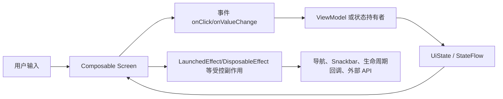
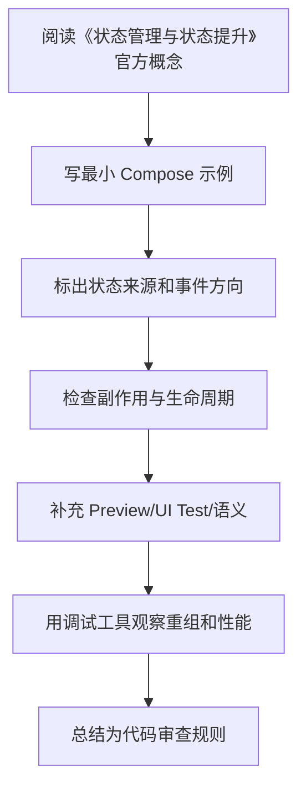

# 03. 状态管理与状态提升

<!-- lecture-notes:integrated-v2 -->

## 讲义导读：把 Compose 放进声明式 UI 主线

这一章讲的是 **03. 状态管理与状态提升**。学习 Compose 时不要把它当成“用 Kotlin 写 XML”，而要把它理解成一套声明式 UI 系统：状态变化驱动重组，Composable 描述界面，事件向上流动，副作用被 Effect API 和生命周期约束。

### 一句话先懂

状态管理的核心是确定“谁拥有状态、谁读取状态、谁发出事件”，状态提升则是把共享状态放到共同父级或 ViewModel。

### 通俗类比

状态像白板上的当前任务，状态提升像把个人便签贴到公共看板：谁都能按规则看到和更新，避免每个人手里都有一份不一致的副本。

类比只是帮助建立直觉，不能替代准确概念。真正写 Compose 时，要回到状态所有权、重组范围、副作用 key、生命周期收集、参数稳定性、语义树、导航状态和版本兼容上。一个页面能显示只是第一步，能在旋转、返回栈、长列表、无障碍、测试和 release 环境下稳定工作才算可靠。

### 本章学习主线

1. **先看状态来源**：状态由谁拥有，是 local state、rememberSaveable、ViewModel、Repository 还是导航参数？
2. **再看重组边界**：哪些状态读取会触发哪些 Composable 重组，参数是否稳定，列表 key 是否可靠？
3. **然后看事件流向**：用户点击、输入、滚动如何上行，ViewModel 如何处理，UiState 如何回到 UI？
4. **接着看副作用**：网络请求、Flow 收集、导航、Snackbar、资源监听是否放在正确 Effect 和生命周期里？
5. **最后看验证**：能否用 Preview、UI Test、Layout Inspector、重组观察、Macrobenchmark 或真机复现和验证？

### 概念怎么学才不容易忘

遇到 Compose API，建议按“它读什么状态 -> 会不会重组 -> 有没有副作用 -> 谁负责保存 -> 如何测试”五步理解。比如 remember 只记住组合内状态，rememberSaveable 处理可保存状态，LaunchedEffect 会随 key 重启，LazyColumn 需要稳定 key，collectAsStateWithLifecycle 负责生命周期感知收集。

### 最小实践任务

写一个可控文本输入框和筛选列表，先把状态放子组件里，再提升到父组件或 ViewModel，比较可测试性。

实践时要保留错误版本。Compose 很多坑不会直接编译失败，而是表现为重复请求、状态丢失、列表错位、测试找不到节点、重组过多或 TalkBack 读不清。把错误写法、现象、定位工具和修复方式记录下来，比只保存正确代码更有价值。

### 读完本章应该能产出

能区分 remember、rememberSaveable、state hoisting、ViewModel state、StateFlow；能设计单一事实来源和事件上行。

> 本节是全篇讲义化改写的阅读入口，后续正文中的定义、步骤、示例和参考资料都应围绕这条学习主线来理解。
最后调研时间：2026-06-13  
主要来源：Android Developers State、State hoisting、Save UI state、Lifecycle Compose 文档。

## 1. 什么是状态

状态是任何会随时间变化并影响 UI 的值。官方文档对状态的核心定义是：应用中任何会随时间变化的值都可以被看作状态。

常见状态：

- 文本输入框内容。
- 当前选中的 Tab。
- 网络请求加载中、成功、失败。
- 列表数据。
- 当前用户登录状态。
- 弹窗是否显示。
- 滚动位置。

Compose 只会自动观察 Compose State，例如：

```kotlin
var name by remember { mutableStateOf("") }
```

如果你修改普通变量：

```kotlin
var count = 0
Button(onClick = { count++ }) { Text("$count") }
```

UI 不会可靠更新，因为 Compose 没有观察这个普通变量。

## 2. 状态分类

| 类型 | 生命周期 | 放在哪里 |
|---|---|---|
| 瞬时 UI 状态 | 只影响当前组件，比如输入框焦点、展开状态 | `remember` |
| 可保存 UI 状态 | 旋转屏幕后应恢复，比如输入文字、选中 tab | `rememberSaveable` 或 `SavedStateHandle` |
| 页面 UI 状态 | 页面内容、加载状态、错误信息 | ViewModel |
| 业务状态 | 登录态、订单、用户资料、数据库数据 | Repository / UseCase / 数据层 |
| 导航状态 | 当前页面、返回栈、参数 | Navigation |

原则：状态应放在所有需要读取和修改它的最小共同拥有者处。

## 3. `remember`

```kotlin
@Composable
fun ExpandableTitle(title: String) {
    var expanded by remember { mutableStateOf(false) }

    Column {
        Row(Modifier.clickable { expanded = !expanded }) {
            Text(title)
        }
        if (expanded) {
            Text("详细内容")
        }
    }
}
```

适合：

- 临时 UI 状态。
- 不需要配置变更恢复。
- 不需要跨页面共享。

不适合：

- 从网络或数据库来的业务数据。
- 页面主要状态。
- 需要进程死亡恢复的重要输入。

## 4. `rememberSaveable`

`rememberSaveable` 使用 Android 保存实例状态机制保存可序列化/可 Bundle 化的数据。

```kotlin
@Composable
fun SearchInput() {
    var query by rememberSaveable { mutableStateOf("") }
    TextField(
        value = query,
        onValueChange = { query = it },
        label = { Text("搜索") }
    )
}
```

适合：

- 文本输入。
- 选中 Tab。
- 简单筛选项。
- 列表滚动状态可以用对应 state 的 Saver。

限制：

- 数据大小不能太大。
- 复杂对象需要自定义 `Saver`。
- 不应保存网络列表、图片、缓存对象、数据库实体全集。

自定义 Saver：

```kotlin
data class Filter(val keyword: String, val onlyFavorite: Boolean)

val FilterSaver = Saver<Filter, List<Any>>(
    save = { listOf(it.keyword, it.onlyFavorite) },
    restore = { Filter(it[0] as String, it[1] as Boolean) }
)

@Composable
fun FilterPanel() {
    var filter by rememberSaveable(stateSaver = FilterSaver) {
        mutableStateOf(Filter("", false))
    }
}
```

## 5. Compose State 类型

常见创建方式：

```kotlin
val state = remember { mutableStateOf("text") }
var text by remember { mutableStateOf("text") }
var count by remember { mutableIntStateOf(0) }
var checked by remember { mutableStateOf(false) }
```

基本类型建议使用专用 State：

```kotlin
mutableIntStateOf(0)
mutableLongStateOf(0L)
mutableFloatStateOf(0f)
mutableDoubleStateOf(0.0)
```

原因：减少装箱开销，尤其在频繁变化的状态中更有意义。

## 6. 不可观察集合的坑

错误：

```kotlin
val items = remember { mutableListOf<String>() }
Button(onClick = { items.add("new") }) {
    Text("添加")
}
LazyColumn {
    items(items) { Text(it) }
}
```

`mutableListOf` 的内部变化不会自动通知 Compose。

正确方式 1：使用不可变列表替换引用。

```kotlin
var items by remember { mutableStateOf(listOf<String>()) }
Button(onClick = { items = items + "new" }) {
    Text("添加")
}
```

正确方式 2：使用 Snapshot State List。

```kotlin
val items = remember { mutableStateListOf<String>() }
Button(onClick = { items.add("new") }) {
    Text("添加")
}
```

工程中更推荐：页面列表状态由 ViewModel 输出不可变 `UiState`。

## 7. 状态提升

状态提升是把状态从子组件移动到调用者，让组件变成可复用、可测试、可控制的无状态组件。

有状态组件：

```kotlin
@Composable
fun SearchBar() {
    var query by rememberSaveable { mutableStateOf("") }
    TextField(value = query, onValueChange = { query = it })
}
```

无状态组件：

```kotlin
@Composable
fun SearchBar(
    query: String,
    onQueryChange: (String) -> Unit,
    modifier: Modifier = Modifier
) {
    TextField(
        value = query,
        onValueChange = onQueryChange,
        modifier = modifier,
        singleLine = true
    )
}
```

调用者持有状态：

```kotlin
@Composable
fun SearchScreen() {
    var query by rememberSaveable { mutableStateOf("") }
    SearchBar(query = query, onQueryChange = { query = it })
}
```

状态提升的好处：

- 组件可复用。
- UI 测试更简单。
- 预览更容易。
- 状态来源明确。
- 业务逻辑可以放到 ViewModel。

## 8. ViewModel 与 UI State

推荐模式：

```kotlin
data class ArticleListUiState(
    val loading: Boolean = false,
    val articles: List<ArticleUiModel> = emptyList(),
    val errorMessage: String? = null
)

class ArticleListViewModel(
    private val repository: ArticleRepository
) : ViewModel() {
    private val _uiState = MutableStateFlow(ArticleListUiState(loading = true))
    val uiState: StateFlow<ArticleListUiState> = _uiState.asStateFlow()

    init {
        load()
    }

    fun load() {
        viewModelScope.launch {
            _uiState.value = _uiState.value.copy(loading = true, errorMessage = null)
            runCatching { repository.getArticles() }
                .onSuccess { articles ->
                    _uiState.value = ArticleListUiState(
                        loading = false,
                        articles = articles.map { it.toUiModel() }
                    )
                }
                .onFailure { error ->
                    _uiState.value = _uiState.value.copy(
                        loading = false,
                        errorMessage = error.message ?: "加载失败"
                    )
                }
        }
    }
}
```

Compose 收集：

```kotlin
@Composable
fun ArticleListRoute(
    viewModel: ArticleListViewModel = viewModel()
) {
    val uiState by viewModel.uiState.collectAsStateWithLifecycle()

    ArticleListScreen(
        uiState = uiState,
        onRetry = viewModel::load
    )
}
```

`collectAsStateWithLifecycle()` 比普通 `collectAsState()` 更适合 Android，因为它会结合 Lifecycle，在合适状态收集 Flow。

## 9. Route 与 Screen 分层

```kotlin
@Composable
fun LoginRoute(
    viewModel: LoginViewModel = viewModel(),
    onLoginSuccess: () -> Unit
) {
    val uiState by viewModel.uiState.collectAsStateWithLifecycle()

    LaunchedEffect(uiState.loggedIn) {
        if (uiState.loggedIn) onLoginSuccess()
    }

    LoginScreen(
        uiState = uiState,
        onUsernameChange = viewModel::onUsernameChange,
        onPasswordChange = viewModel::onPasswordChange,
        onSubmit = viewModel::submit
    )
}

@Composable
fun LoginScreen(
    uiState: LoginUiState,
    onUsernameChange: (String) -> Unit,
    onPasswordChange: (String) -> Unit,
    onSubmit: () -> Unit
) {
    // 只负责展示和把事件抛出
}
```

分层原则：

| 层 | 责任 |
|---|---|
| Route | 连接 ViewModel、导航、生命周期、一次性 Effect |
| Screen | 展示 UI，接收状态和事件 |
| Component | 可复用局部 UI |
| ViewModel | 处理事件、更新 UI State、调用领域层 |

## 10. 事件设计

简单页面可直接传 lambda：

```kotlin
ProfileScreen(
    uiState = uiState,
    onEditClick = viewModel::startEdit,
    onNameChange = viewModel::updateName,
    onSaveClick = viewModel::save
)
```

复杂页面可使用事件 sealed interface：

```kotlin
sealed interface ProfileEvent {
    data object EditClick : ProfileEvent
    data class NameChange(val value: String) : ProfileEvent
    data object SaveClick : ProfileEvent
}

@Composable
fun ProfileScreen(
    uiState: ProfileUiState,
    onEvent: (ProfileEvent) -> Unit
) { }
```

取舍：

| 方式 | 优点 | 缺点 |
|---|---|---|
| 多个 lambda | 简单、类型直接、调用清晰 | 参数多时冗长 |
| 单个事件入口 | 适合复杂页面、方便记录事件 | 可能让 UI 和事件定义耦合更重 |

## 11. 派生状态 `derivedStateOf`

当某个值由其他状态计算得出，且计算结果变化频率低于输入变化频率时，可以用 `derivedStateOf`。

典型场景：滚动位置频繁变化，但 UI 只关心是否超过第一个 item。

```kotlin
@Composable
fun ScrollToTopButton(listState: LazyListState) {
    val showButton by remember {
        derivedStateOf {
            listState.firstVisibleItemIndex > 0
        }
    }

    AnimatedVisibility(visible = showButton) {
        FloatingActionButton(onClick = { /* scroll */ }) {
            Icon(Icons.Default.KeyboardArrowUp, contentDescription = "回到顶部")
        }
    }
}
```

不要滥用：

```kotlin
val fullName by remember {
    derivedStateOf { "$firstName $lastName" }
}
```

这种简单字符串拼接没必要。

## 12. `snapshotFlow`

如果需要把 Compose State 转成 Flow，例如监听滚动变化并做分析：

```kotlin
LaunchedEffect(listState) {
    snapshotFlow { listState.firstVisibleItemIndex }
        .distinctUntilChanged()
        .filter { it > 0 }
        .collect {
            analytics.logScrolledPastFirstItem()
        }
}
```

注意：

- `snapshotFlow` 适合从 Compose 状态桥接到 Flow。
- 不要在里面做重活。
- 配合 `distinctUntilChanged()`、`debounce()` 等限制频率。

## 13. 状态保存策略

| 需求 | 推荐 |
|---|---|
| 重组保留 | `remember` |
| 旋转屏幕保留简单 UI 状态 | `rememberSaveable` |
| 页面级状态保留 | ViewModel |
| 进程死亡后恢复关键输入 | `SavedStateHandle` + Repository 重拉数据 |
| 大列表数据 | Repository/数据库/缓存，不放 Bundle |
| 导航参数 | Navigation 参数，ViewModel 通过 `SavedStateHandle` 读取 |

ViewModel 中使用 `SavedStateHandle`：

```kotlin
class DetailViewModel(
    savedStateHandle: SavedStateHandle,
    repository: ArticleRepository
) : ViewModel() {
    private val articleId: String = checkNotNull(savedStateHandle["articleId"])
}
```

### `SavedStateHandle.saveable`

对于简单 UI 元素状态，`SavedStateHandle` 也可以配合 `saveable` 保存 Compose `MutableState`。它适合 ViewModel 中的输入框草稿、筛选条件、tab 等小状态。

```kotlin
class SearchViewModel(
    savedStateHandle: SavedStateHandle,
    private val repository: SearchRepository
) : ViewModel() {
    var query by savedStateHandle.saveable {
        mutableStateOf("")
    }
        private set

    fun onQueryChange(value: String) {
        query = value
    }
}
```

注意：

- 只保存小而关键的 UI 元素状态。
- 不要把完整列表、图片、网络响应、复杂对象塞进 `SavedStateHandle`。
- 进程恢复后，仍应通过 Repository 重新拉取权威数据。

## 14. StateHolder 模式

不是所有状态都必须进 ViewModel。纯 UI 交互状态可以封装成普通 state holder，尤其是复杂组件内部状态。

```kotlin
@Stable
class SearchPanelState(
    initialQuery: String = ""
) {
    var query by mutableStateOf(initialQuery)
        private set

    var filtersExpanded by mutableStateOf(false)
        private set

    fun onQueryChange(value: String) {
        query = value
    }

    fun toggleFilters() {
        filtersExpanded = !filtersExpanded
    }
}

@Composable
fun rememberSearchPanelState(
    initialQuery: String = ""
): SearchPanelState {
    return remember(initialQuery) {
        SearchPanelState(initialQuery)
    }
}
```

适合 StateHolder：

- 只服务某个复合 UI 组件。
- 不直接调用 Repository。
- 不包含跨页面业务规则。
- 想减少 Screen 参数数量，但又不想引入 ViewModel。

不适合 StateHolder：

- 需要持久化业务状态。
- 需要调用 UseCase/Repository。
- 需要跨多个页面共享。
- 需要进程死亡后可靠恢复大量数据。

## 15. 表单状态建模

表单页常见错误是每个 `TextField` 自己 `remember`，最后提交时父级拿不到完整状态。更推荐把字段集中建模。

```kotlin
data class LoginUiState(
    val username: String = "",
    val password: String = "",
    val usernameError: String? = null,
    val passwordError: String? = null,
    val submitting: Boolean = false
) {
    val canSubmit: Boolean
        get() = username.isNotBlank() && password.isNotBlank() && !submitting
}
```

事件：

```kotlin
sealed interface LoginEvent {
    data class UsernameChange(val value: String) : LoginEvent
    data class PasswordChange(val value: String) : LoginEvent
    data object SubmitClick : LoginEvent
}
```

Screen：

```kotlin
@Composable
fun LoginScreen(
    uiState: LoginUiState,
    onEvent: (LoginEvent) -> Unit
) {
    TextField(
        value = uiState.username,
        onValueChange = { onEvent(LoginEvent.UsernameChange(it)) },
        isError = uiState.usernameError != null,
        supportingText = {
            uiState.usernameError?.let { Text(it) }
        }
    )
}
```

表单建议：

- 字段值和错误文案放在同一个 `UiState`。
- 提交中状态要禁用按钮，避免重复提交。
- 密码明文/密文切换属于 UI 状态，可在 Screen 或 ViewModel，取决于是否要恢复。
- 错误不要只靠 Toast，字段错误应能显示在对应字段附近。

## 16. 常见错误

| 错误 | 后果 | 修正 |
|---|---|---|
| 在 Composable 中创建 Repository | 每次重组可能重复创建，生命周期错误 | 用 DI 或 ViewModel |
| 普通变量保存 UI 状态 | UI 不更新或状态丢失 | 用 Compose State / ViewModel |
| 可变集合直接 add/remove | Compose 不知道集合变化 | 替换不可变列表或 `mutableStateListOf` |
| 子组件私有持有业务状态 | 父级无法控制、难测试 | 状态提升 |
| Flow 用 `collectAsState()` 忽略 Lifecycle | 后台也可能收集 | Android 中优先 `collectAsStateWithLifecycle()` |
| UI State 暴露可变对象 | 难追踪，影响稳定性 | 使用不可变 data class |
| 把所有状态都放 ViewModel | UI 组件难复用，ViewModel 变胖 | 临时局部状态用 `remember`/StateHolder |
| 把大型对象保存进 `SavedStateHandle` | Bundle 过大、恢复慢、可能崩溃 | 保存 ID/查询条件，数据重拉 |

---

## 万字精讲扩展（2026-06-16 更新）
> Last researched: 2026-06-16。本文补充内容以 Jetpack Compose 官方文档和 Android Developers 实践资料为主；涉及 Compose Compiler、Kotlin、Navigation、Material3、Lifecycle、Performance 的版本细节，应在真实项目中继续核对最新官方 release notes。

### 本章在 Compose 学习路线中的位置

《状态管理与状态提升》是 Compose 能力闭环中的一个节点。Compose 学习不能只停留在静态页面，还要覆盖状态、事件、副作用、生命周期、导航、性能、测试、无障碍和 View 互操作。一个 composable 写出来能显示，只说明第一步完成；它能在重组、旋转、返回栈恢复、无障碍服务、release 构建、长列表和低端设备上稳定工作，才说明写法可靠。

本章学习完成后，建议至少达到三个标准。第一，能用 Compose 心智模型解释本章 API 的作用和边界。第二，能写出最小可运行例子，并指出状态来源、事件方向和副作用生命周期。第三，能制造一个常见错误并用工具或测试验证修复效果。Compose 是声明式 UI，但工程质量仍然依赖清晰边界和可验证实践。

### 状态管理类笔记的精讲重点

Compose 状态管理的第一原则是状态来源唯一。局部 UI 元素状态可以留在 composable 附近，跨组件共享状态要提升到共同父级，涉及业务逻辑或屏幕级数据的状态通常放到 ViewModel。官方 state hoisting 建议把状态提升到读写它的最低共同祖先，并从状态持有者向外暴露不可变状态和事件。

`remember` 保存组合生命周期内的值，`rememberSaveable` 处理可保存状态和配置变化，但不要把大型对象、复杂业务状态或数据库结果都塞进去。Flow 到 UI 通常用 `collectAsStateWithLifecycle`，避免界面不可见时仍然收集。不可观察 mutableList 这类集合不会自动触发重组，应使用 Compose 可观察状态或不可变列表替换引用。

### Compose 的核心心智模型：UI 是状态的函数，但函数必须足够纯

Compose 最重要的转变不是“用 Kotlin 写 UI”，而是把 UI 看成状态的描述。一个 composable 根据输入参数和读取到的状态描述界面，状态变化后框架触发重组，重新执行需要更新的 composable。这个模型要求 composable 尽量幂等、快速、无副作用。官方 Thinking in Compose 文档特别强调，重组可能频繁发生，也可能被跳过或取消，因此不要在 composable 主体里直接执行网络请求、导航、写数据库、启动协程或修改外部对象。需要副作用时，要使用受 Compose 生命周期管理的 Effect API。

学习 Compose 要同时区分三件事：composition、recomposition 和 drawing/layout。Composition 是把 composable 调用组织成 UI 树的过程；recomposition 是状态变化后重新执行部分 composable；layout/draw 是测量、摆放和绘制阶段。性能问题不一定来自重组，可能来自布局太复杂、绘制太重、列表 item 没有 key、状态读取范围太宽、参数不稳定、图片加载或主线程阻塞。只把“少重组”当成唯一目标，会误判很多问题。

### 状态、事件、副作用的单向流



Figure: Compose 单向数据流和副作用边界，综合 Android 官方 State、State Hoisting、Side-effects、Lifecycle in Compose 文档整理。

这个图的关键是方向。UI 读取状态并发出事件，状态持有者处理事件并产生新状态，UI 根据新状态重组。副作用不应该散落在 composable 主体里，而要放在能够表达启动、取消、更新和清理时机的 Effect API 中。导航、Snackbar、权限请求、监听器注册、Flow 收集、动画启动、外部 View 生命周期绑定，都属于需要明确边界的动作。

### Compose 学习必须建立版本意识

Compose 与 Kotlin、Compose Compiler、Android Gradle Plugin、Material3、Navigation、Lifecycle、Activity Compose 等库存在版本关系。Kotlin 2.0 之后 Compose Compiler 移入 Kotlin 仓库，旧项目仍可能遇到 compiler extension 与 Kotlin 版本不匹配的问题。学习笔记里不要只写“加某个依赖”，还要写 BOM、Kotlin 插件、Compose Compiler、Navigation 版本、Lifecycle Compose 版本以及是否使用类型安全导航、强跳过模式等条件。遇到构建错误时，优先查官方兼容表和 release notes。

### 最小可验证学习法

每个 Compose 主题都应该写一个最小验证例子。学习状态时，写一个文本输入、筛选列表或展开面板；学习副作用时，写 Snackbar、定时器、生命周期监听或 Flow 收集；学习 Lazy 列表时，写稳定 key、滚动位置、分页占位和 item 状态；学习性能时，写一个会过度重组的例子，再用状态拆分、remember、derivedStateOf 或稳定参数修正；学习测试时，用 semantics 查找节点并验证状态变化。只有能制造错误并修复，才算真正理解。

### 核心知识点逐条精讲

#### 1. remember/rememberSaveable

在《状态管理与状态提升》中，`remember/rememberSaveable` 不应该只理解成一个 API 名称，而要放进 Compose 的组合、重组、状态和副作用模型里看。学习时先问：它读取什么状态，谁拥有这些状态，变化后会让哪些 composable 重组，是否需要保存到配置变化后，是否会触发外部副作用，是否会影响测试语义或无障碍。能回答这些问题，才说明你真正按 Compose 的方式思考。

实现 ` remember/rememberSaveable ` 时，建议先写一个最小 demo，再写一个错误版本。比如状态提升可以写“子组件内部 remember 导致外部无法控制”的错误例子；LaunchedEffect 可以写“key 变化导致重复请求”的错误例子；Lazy key 可以写“插入 item 后状态错位”的错误例子；Navigation 可以写“传复杂对象导致恢复困难”的错误例子。制造错误比只看正确代码更能建立边界感。

代码审查时要把 ` remember/rememberSaveable ` 转成检查项：状态是否单一来源，参数是否稳定，Modifier 是否作为参数传入，副作用是否有正确 key 和清理逻辑，Flow 是否生命周期感知收集，Lazy item 是否有稳定 key，语义是否可测试且可访问，release 构建和性能工具是否验证过。Compose 项目的质量通常取决于这些细节是否一致执行。

#### 2. Compose State

在《状态管理与状态提升》中，`Compose State` 不应该只理解成一个 API 名称，而要放进 Compose 的组合、重组、状态和副作用模型里看。学习时先问：它读取什么状态，谁拥有这些状态，变化后会让哪些 composable 重组，是否需要保存到配置变化后，是否会触发外部副作用，是否会影响测试语义或无障碍。能回答这些问题，才说明你真正按 Compose 的方式思考。

实现 ` Compose State ` 时，建议先写一个最小 demo，再写一个错误版本。比如状态提升可以写“子组件内部 remember 导致外部无法控制”的错误例子；LaunchedEffect 可以写“key 变化导致重复请求”的错误例子；Lazy key 可以写“插入 item 后状态错位”的错误例子；Navigation 可以写“传复杂对象导致恢复困难”的错误例子。制造错误比只看正确代码更能建立边界感。

代码审查时要把 ` Compose State ` 转成检查项：状态是否单一来源，参数是否稳定，Modifier 是否作为参数传入，副作用是否有正确 key 和清理逻辑，Flow 是否生命周期感知收集，Lazy item 是否有稳定 key，语义是否可测试且可访问，release 构建和性能工具是否验证过。Compose 项目的质量通常取决于这些细节是否一致执行。

#### 3. 状态提升

在《状态管理与状态提升》中，`状态提升` 不应该只理解成一个 API 名称，而要放进 Compose 的组合、重组、状态和副作用模型里看。学习时先问：它读取什么状态，谁拥有这些状态，变化后会让哪些 composable 重组，是否需要保存到配置变化后，是否会触发外部副作用，是否会影响测试语义或无障碍。能回答这些问题，才说明你真正按 Compose 的方式思考。

实现 ` 状态提升 ` 时，建议先写一个最小 demo，再写一个错误版本。比如状态提升可以写“子组件内部 remember 导致外部无法控制”的错误例子；LaunchedEffect 可以写“key 变化导致重复请求”的错误例子；Lazy key 可以写“插入 item 后状态错位”的错误例子；Navigation 可以写“传复杂对象导致恢复困难”的错误例子。制造错误比只看正确代码更能建立边界感。

代码审查时要把 ` 状态提升 ` 转成检查项：状态是否单一来源，参数是否稳定，Modifier 是否作为参数传入，副作用是否有正确 key 和清理逻辑，Flow 是否生命周期感知收集，Lazy item 是否有稳定 key，语义是否可测试且可访问，release 构建和性能工具是否验证过。Compose 项目的质量通常取决于这些细节是否一致执行。

#### 4. ViewModel 与 UiState

在《状态管理与状态提升》中，`ViewModel 与 UiState` 不应该只理解成一个 API 名称，而要放进 Compose 的组合、重组、状态和副作用模型里看。学习时先问：它读取什么状态，谁拥有这些状态，变化后会让哪些 composable 重组，是否需要保存到配置变化后，是否会触发外部副作用，是否会影响测试语义或无障碍。能回答这些问题，才说明你真正按 Compose 的方式思考。

实现 ` ViewModel 与 UiState ` 时，建议先写一个最小 demo，再写一个错误版本。比如状态提升可以写“子组件内部 remember 导致外部无法控制”的错误例子；LaunchedEffect 可以写“key 变化导致重复请求”的错误例子；Lazy key 可以写“插入 item 后状态错位”的错误例子；Navigation 可以写“传复杂对象导致恢复困难”的错误例子。制造错误比只看正确代码更能建立边界感。

代码审查时要把 ` ViewModel 与 UiState ` 转成检查项：状态是否单一来源，参数是否稳定，Modifier 是否作为参数传入，副作用是否有正确 key 和清理逻辑，Flow 是否生命周期感知收集，Lazy item 是否有稳定 key，语义是否可测试且可访问，release 构建和性能工具是否验证过。Compose 项目的质量通常取决于这些细节是否一致执行。

#### 5. derivedStateOf 和 snapshotFlow

在《状态管理与状态提升》中，`derivedStateOf 和 snapshotFlow` 不应该只理解成一个 API 名称，而要放进 Compose 的组合、重组、状态和副作用模型里看。学习时先问：它读取什么状态，谁拥有这些状态，变化后会让哪些 composable 重组，是否需要保存到配置变化后，是否会触发外部副作用，是否会影响测试语义或无障碍。能回答这些问题，才说明你真正按 Compose 的方式思考。

实现 ` derivedStateOf 和 snapshotFlow ` 时，建议先写一个最小 demo，再写一个错误版本。比如状态提升可以写“子组件内部 remember 导致外部无法控制”的错误例子；LaunchedEffect 可以写“key 变化导致重复请求”的错误例子；Lazy key 可以写“插入 item 后状态错位”的错误例子；Navigation 可以写“传复杂对象导致恢复困难”的错误例子。制造错误比只看正确代码更能建立边界感。

代码审查时要把 ` derivedStateOf 和 snapshotFlow ` 转成检查项：状态是否单一来源，参数是否稳定，Modifier 是否作为参数传入，副作用是否有正确 key 和清理逻辑，Flow 是否生命周期感知收集，Lazy item 是否有稳定 key，语义是否可测试且可访问，release 构建和性能工具是否验证过。Compose 项目的质量通常取决于这些细节是否一致执行。


### 场景化学习与排错表

| 主题 | 推荐动作 | 常见风险 | 验证方式 |
| :--- | :--- | :--- | :--- |
| remember/rememberSaveable | 用最小 demo 验证正确写法和错误写法，再放入完整页面 | 重组重复执行、副作用 key 错、状态源重复、稳定性误判、测试语义缺失 | Preview、Compose UI Test、Layout Inspector、重组计数、Macrobenchmark、真机验证 |
| Compose State | 用最小 demo 验证正确写法和错误写法，再放入完整页面 | 重组重复执行、副作用 key 错、状态源重复、稳定性误判、测试语义缺失 | Preview、Compose UI Test、Layout Inspector、重组计数、Macrobenchmark、真机验证 |
| 状态提升 | 用最小 demo 验证正确写法和错误写法，再放入完整页面 | 重组重复执行、副作用 key 错、状态源重复、稳定性误判、测试语义缺失 | Preview、Compose UI Test、Layout Inspector、重组计数、Macrobenchmark、真机验证 |
| ViewModel 与 UiState | 用最小 demo 验证正确写法和错误写法，再放入完整页面 | 重组重复执行、副作用 key 错、状态源重复、稳定性误判、测试语义缺失 | Preview、Compose UI Test、Layout Inspector、重组计数、Macrobenchmark、真机验证 |
| derivedStateOf 和 snapshotFlow | 用最小 demo 验证正确写法和错误写法，再放入完整页面 | 重组重复执行、副作用 key 错、状态源重复、稳定性误判、测试语义缺失 | Preview、Compose UI Test、Layout Inspector、重组计数、Macrobenchmark、真机验证 |

这个表的重点是“能复现、能观察、能修复”。Compose 很多问题不会编译报错，而是表现为重组过多、状态丢失、事件重复、列表错位、TalkBack 读不清、测试找不到节点或某些机型上卡顿。只有建立可观察的验证方法，才能避免靠经验猜。

### 本章建议工作流



Figure: 《状态管理与状态提升》学习工作流，综合 Android 官方 Compose mental model、state、side-effects、performance、accessibility 和 testing 资料整理。

这个流程适合所有 Compose 主题。先理解概念，再落到小例子，再放回真实页面，再用测试和工具验证。不要在没有状态图的情况下写复杂 UI，也不要在没有测量的情况下做性能优化。

### 常见误区和纠正方法

- 误区：在 composable 主体里执行副作用。纠正：网络、导航、Snackbar、注册监听器、启动协程等动作应放入合适 Effect API 或 ViewModel 事件处理中。
- 误区：所有状态都放 ViewModel。纠正：纯 UI 元素状态可以靠近使用处，屏幕级和业务相关状态再提升到 ViewModel。
- 误区：所有地方都加 remember。纠正：remember 是保存计算或对象的工具，不是性能万能药；先测量，再判断是否需要。
- 误区：Lazy 列表不写 key。纠正：可变列表、插入删除、分页和 item 内状态都应使用稳定 key，避免状态错位。
- 误区：测试只靠 testTag。纠正：优先设计有意义的语义，testTag 作为补充；无障碍和测试都依赖语义质量。
- 误区：忽略版本兼容。纠正：Compose Compiler、Kotlin、BOM、Material3、Navigation 和 Lifecycle Compose 都要按官方版本说明维护。

### 与相邻章节的关系

《状态管理与状态提升》应与状态、副作用、架构、性能和测试章节交叉阅读。状态决定重组，副作用决定外部动作是否可控，架构决定状态和事件放在哪里，性能决定重组和布局是否可接受，测试和无障碍决定 UI 是否能被可靠验证和使用。任何一个章节单独学习都不够，最终要在一个完整页面中串起来。

### 实操训练和复盘模板

1. 围绕 `remember/rememberSaveable` 写一个最小页面：包含正确实现、故意错误实现、观察结果和修复总结。
2. 围绕 `Compose State` 写一个最小页面：包含正确实现、故意错误实现、观察结果和修复总结。
3. 围绕 `状态提升` 写一个最小页面：包含正确实现、故意错误实现、观察结果和修复总结。
4. 围绕 `ViewModel 与 UiState` 写一个最小页面：包含正确实现、故意错误实现、观察结果和修复总结。
5. 围绕 `derivedStateOf 和 snapshotFlow` 写一个最小页面：包含正确实现、故意错误实现、观察结果和修复总结。

建议每个 Compose 练习都记录：

```text
练习名称：
本章主题：状态管理与状态提升
Compose / Kotlin / AGP / BOM 版本：
状态来源：local state / rememberSaveable / ViewModel / Repository
事件流向：UI -> ViewModel / state holder -> UiState -> UI
副作用：Effect API、key、取消和清理逻辑
测试入口：semantics、testTag、Preview、UI Test
性能观察：重组范围、Lazy key、稳定性、主线程耗时
失败场景：旋转、返回栈恢复、快速点击、断网、长列表、字体放大、TalkBack
结论：以后项目中采用的规则
```

这个模板的意义是把 Compose 学习从“API 记忆”推进到“页面质量”。真实项目中的 Compose 问题通常跨越状态、生命周期、导航、性能和无障碍，复盘时必须把这些因素放在一起看。

## 参考资料与延伸阅读

- [Official / Android] Jetpack Compose documentation: https://developer.android.com/develop/ui/compose
- [Official / Android] Thinking in Compose: https://developer.android.com/develop/ui/compose/mental-model
- [Official / Android] State and Jetpack Compose: https://developer.android.com/develop/ui/compose/state
- [Official / Android] Where to hoist state: https://developer.android.com/develop/ui/compose/state-hoisting
- [Official / Android] Side-effects in Compose: https://developer.android.com/develop/ui/compose/side-effects
- [Official / Android] Lifecycle in Jetpack Compose: https://developer.android.com/topic/libraries/architecture/lifecycle
- [Official / Android] Lazy lists and lazy grids: https://developer.android.com/develop/ui/compose/lists
- [Official / Android] Compose performance: https://developer.android.com/develop/ui/compose/performance
- [Official / Android] Stability in Compose: https://developer.android.com/develop/ui/compose/performance/stability
- [Official / Android] Strong skipping mode: https://developer.android.com/develop/ui/compose/performance/stability/strongskipping
- [Official / Android] Accessibility in Jetpack Compose: https://developer.android.com/develop/ui/compose/accessibility
- [Official / Android] Semantics in Compose: https://developer.android.com/develop/ui/compose/accessibility/semantics
- [Official / Android] Type safety in Navigation Compose: https://developer.android.com/guide/navigation/design/type-safety
- [Official / Android] Compose to Kotlin Compatibility Map: https://developer.android.com/jetpack/androidx/releases/compose-kotlin
- [Official / Android] Compose Compiler release notes: https://developer.android.com/jetpack/androidx/releases/compose-compiler
- [Official / Android Developers Blog] Jetpack Compose compiler moving to the Kotlin repository: https://android-developers.googleblog.com/2024/04/jetpack-compose-compiler-moving-to-kotlin-repository.html
- [Official / Android Developers Blog] What's New in Jetpack Compose: https://android-developers.googleblog.com/2025/05/whats-new-in-jetpack-compose.html
- [Official / Android Developers Blog] Strong Skipping Mode Explained: https://medium.com/androiddevelopers/jetpack-compose-strong-skipping-mode-explained-cbdb2aa4b900
- [Official / Android Developers Blog] Fundamentals of Compose layouts and modifiers: https://medium.com/androiddevelopers/fundamentals-of-compose-layouts-and-modifiers-64d794664b66
- [Official / Android Developers Blog] Consuming flows safely in Jetpack Compose: https://medium.com/androiddevelopers/consuming-flows-safely-in-jetpack-compose-cde014d0d5a3
- [Official / Android Developers Blog] Navigation Compose meet Type Safety: https://medium.com/androiddevelopers/navigation-compose-meet-type-safety-e081fb3cf2f8
- [Community / CSDN] Jetpack Compose 学习笔记检索入口: https://so.csdn.net/so/search?q=Jetpack%20Compose%20%E5%AD%A6%E4%B9%A0%E7%AC%94%E8%AE%B0
- [Community / 博客园] Compose 状态与副作用实践检索入口: https://zzk.cnblogs.com/s/blogpost?Keywords=Jetpack%20Compose%20%E7%8A%B6%E6%80%81%20%E5%89%AF%E4%BD%9C%E7%94%A8
- [Community / 掘金] Compose 性能、导航、架构实践检索入口: https://juejin.cn/search?query=Jetpack%20Compose%20%E6%80%A7%E8%83%BD%20%E5%AF%BC%E8%88%AA%20%E6%9E%B6%E6%9E%84&type=0

<!-- AUTO_EXPANDED_TO_REFERENCE_LENGTH_2026_06_23 -->

## 万字精讲扩展：状态管理与状态提升

> 本节为按参考笔记篇幅补充的系统化扩展内容，目标是把原有笔记从“知识点记录”扩展为“概念、原理、流程、工程实践、常见误区和复盘清单”完整学习材料。

### 精讲扩展 1：状态管理与状态提升 的生命周期、状态管理 与工程化理解

学习 $topic 时，不能只把它当成一个孤立知识点来背诵，而要把它放到 $category 的完整问题链条里理解。一个知识点通常同时包含概念定义、适用边界、输入输出、运行过程、常见异常和工程取舍。真正掌握它，意味着看到一个具体场景时，能够判断它解决什么问题、依赖哪些前提、失败时会出现什么现象，以及应该用什么手段验证自己的判断。

从 $a 的角度看，最重要的是先建立清晰的对象模型。也就是明确系统里有哪些参与者、它们之间如何连接、数据或控制信号如何流动、哪些环节是同步的、哪些环节是异步的、哪些状态是临时状态、哪些状态需要长期保存。很多初学问题并不是公式不会、API 不熟，而是对象边界不清：把配置当成状态，把结果当成过程，把局部现象当成全局规律。写笔记时建议始终追问：这个概念的主体是谁，输入是什么，输出是什么，中间约束是什么，错误会在哪里暴露。

从 $b 的角度看，流程比单点知识更关键。一个成熟方案通常不是单个技巧，而是一组步骤：先确定目标，再拆分约束，然后选择工具，最后通过测试和复盘确认效果。比如在实际项目中，不能只问“怎么实现”，还要问“为什么要这样实现”“有没有更简单的替代方案”“边界条件是什么”“数据量、并发量、实时性、可靠性变化后还能不能工作”。这种流程意识能够避免把学习停留在教程层面，也能让后续排错有明确路线。

$topic 的 $c 往往决定它在真实项目中的稳定性。理论上可行的方案，到了工程环境中会受到数据质量、硬件条件、依赖版本、网络环境、团队协作、部署方式和维护成本影响。写代码或做设计时，应该把正常路径和异常路径同时考虑：正常情况下如何运行，输入为空怎么办，超时怎么办，重复执行怎么办，部分成功怎么办，版本升级后兼容性怎么办，日志和指标如何证明系统确实按预期工作。

进一步看 $d，它通常对应性能、可靠性或可维护性的核心矛盾。很多技术选择并没有绝对正确答案，只有是否适合当前约束。例如追求极致性能可能牺牲可读性，追求高度抽象可能增加调试成本，追求快速交付可能留下技术债，追求完全通用可能让简单场景变复杂。高质量笔记应该把这些取舍写出来，而不是只给一个“推荐方案”。推荐方案背后的条件越清楚，迁移到新场景时越不容易误用。

最后从 $e 的角度进行复盘，可以把知识从“看懂”推进到“会用”。建议为 $topic 建立三个层次的检查：第一层是概念检查，确认术语、流程和边界没有混淆；第二层是实践检查，确认能够独立完成一个最小案例；第三层是工程检查，确认这个案例在异常、规模、性能和维护方面经得起追问。每次学习完一个章节，都可以用这三层检查反向补齐笔记。

#### 典型场景拆解

在真实场景中，$topic 通常会经历“需求出现、方案选择、实现落地、问题暴露、持续优化”几个阶段。需求出现时，要先判断这个需求属于基础能力、性能优化、体验改进、可靠性建设还是长期架构演进。不同类型的需求对方案的评价标准不同：基础能力看正确性，性能优化看指标，体验改进看路径是否顺滑，可靠性建设看故障时能否降级和恢复，架构演进看未来变化是否容易吸收。

方案选择阶段，最容易犯的错误是直接套用熟悉工具。更稳妥的方式是列出约束：数据规模、时延要求、资源预算、团队熟悉度、运维能力、安全要求、可测试性和长期维护成本。只有把约束列清楚，才能解释为什么选择当前方案。否则方案看似高级，实际可能只是增加了复杂度。

实现落地阶段，要把 $a 和 $b 拆成可验证的小步骤。每一步都应该有明确的输入、输出和检查方式。对学习笔记而言，这意味着不能只有大段概念，还应该补充流程图式的文字描述、伪代码、命令示例、参数解释、错误现象和排查路径。这样以后复习时，笔记不仅能帮助理解，也能直接指导实践。

问题暴露阶段，要优先区分“理解错误、实现错误、环境错误、数据错误、依赖错误、边界条件错误”。很多复杂问题之所以难排，是因为一开始就把问题归因到错误层级。例如把配置问题当成算法问题，把权限问题当成代码问题，把数据分布变化当成模型失效，把硬件噪声当成软件逻辑错误。好的排查顺序应该从可观测事实开始，而不是从猜测开始。

持续优化阶段，不应只追求把当前问题压下去，还要沉淀成规则。比如记录触发条件、影响范围、定位方法、最终修复、预防措施和可监控指标。这样下一次出现类似问题时，团队可以复用经验，而不是重新从零排查。

#### 常见误区与纠偏

第一个误区是只记结论，不记前提。$topic 中很多结论都是有条件的：适用于小规模，不一定适用于大规模；适用于离线处理，不一定适用于实时系统；适用于单机环境，不一定适用于分布式环境；适用于教学案例，不一定适用于生产项目。纠偏方法是在每个重要结论后面补一句“适用条件”和“不适用情况”。

第二个误区是只关注工具，不关注模型。工具会变化，模型更稳定。无论工具名称如何变化，底层仍然要解决输入建模、状态管理、资源调度、错误恢复、性能约束和质量验证这些问题。学习 $topic 时，应该把工具用法和底层模型分开记录：工具命令解决“怎么做”，底层模型解释“为什么这样做”。

第三个误区是没有验证意识。很多笔记写得很完整，但没有说明如何确认自己做对了。对于 $category 相关主题，验证至少应包含最小样例、边界样例、异常样例和性能样例。最小样例证明流程跑通，边界样例证明理解完整，异常样例证明系统可恢复，性能样例证明方案在目标规模下仍然可用。

第四个误区是忽略可维护性。短期学习时，能跑通就容易产生掌握的错觉；长期使用时，命名、分层、注释、测试、日志、版本管理和文档才会决定知识能否转化为稳定能力。扩充 $topic 笔记时，应把“如何写得清楚、如何排查、如何交接、如何复盘”也纳入内容。

#### 学习与实践建议

建议围绕 $topic 做一个小型闭环练习：先用自己的话解释概念，再画出流程，再实现一个最小案例，然后主动制造一个错误并排查，最后写下复盘。这个过程看起来比直接读资料慢，但能显著提高迁移能力。很多人学完后不会用，根本原因是缺少“从概念到问题再到验证”的闭环。

复习时可以使用四个问题：它解决什么问题；它依赖什么条件；它失败时有什么表现；它如何被验证。只要这四个问题能回答清楚，说明对 $topic 的理解已经从表层进入工程层。如果回答不清楚，就回到对应章节补充例子、边界和排错方法。
### 精讲扩展 2：状态管理与状态提升 的状态管理、单向数据流 与工程化理解

学习 $topic 时，不能只把它当成一个孤立知识点来背诵，而要把它放到 $category 的完整问题链条里理解。一个知识点通常同时包含概念定义、适用边界、输入输出、运行过程、常见异常和工程取舍。真正掌握它，意味着看到一个具体场景时，能够判断它解决什么问题、依赖哪些前提、失败时会出现什么现象，以及应该用什么手段验证自己的判断。

从 $a 的角度看，最重要的是先建立清晰的对象模型。也就是明确系统里有哪些参与者、它们之间如何连接、数据或控制信号如何流动、哪些环节是同步的、哪些环节是异步的、哪些状态是临时状态、哪些状态需要长期保存。很多初学问题并不是公式不会、API 不熟，而是对象边界不清：把配置当成状态，把结果当成过程，把局部现象当成全局规律。写笔记时建议始终追问：这个概念的主体是谁，输入是什么，输出是什么，中间约束是什么，错误会在哪里暴露。

从 $b 的角度看，流程比单点知识更关键。一个成熟方案通常不是单个技巧，而是一组步骤：先确定目标，再拆分约束，然后选择工具，最后通过测试和复盘确认效果。比如在实际项目中，不能只问“怎么实现”，还要问“为什么要这样实现”“有没有更简单的替代方案”“边界条件是什么”“数据量、并发量、实时性、可靠性变化后还能不能工作”。这种流程意识能够避免把学习停留在教程层面，也能让后续排错有明确路线。

$topic 的 $c 往往决定它在真实项目中的稳定性。理论上可行的方案，到了工程环境中会受到数据质量、硬件条件、依赖版本、网络环境、团队协作、部署方式和维护成本影响。写代码或做设计时，应该把正常路径和异常路径同时考虑：正常情况下如何运行，输入为空怎么办，超时怎么办，重复执行怎么办，部分成功怎么办，版本升级后兼容性怎么办，日志和指标如何证明系统确实按预期工作。

进一步看 $d，它通常对应性能、可靠性或可维护性的核心矛盾。很多技术选择并没有绝对正确答案，只有是否适合当前约束。例如追求极致性能可能牺牲可读性，追求高度抽象可能增加调试成本，追求快速交付可能留下技术债，追求完全通用可能让简单场景变复杂。高质量笔记应该把这些取舍写出来，而不是只给一个“推荐方案”。推荐方案背后的条件越清楚，迁移到新场景时越不容易误用。

最后从 $e 的角度进行复盘，可以把知识从“看懂”推进到“会用”。建议为 $topic 建立三个层次的检查：第一层是概念检查，确认术语、流程和边界没有混淆；第二层是实践检查，确认能够独立完成一个最小案例；第三层是工程检查，确认这个案例在异常、规模、性能和维护方面经得起追问。每次学习完一个章节，都可以用这三层检查反向补齐笔记。

#### 典型场景拆解

在真实场景中，$topic 通常会经历“需求出现、方案选择、实现落地、问题暴露、持续优化”几个阶段。需求出现时，要先判断这个需求属于基础能力、性能优化、体验改进、可靠性建设还是长期架构演进。不同类型的需求对方案的评价标准不同：基础能力看正确性，性能优化看指标，体验改进看路径是否顺滑，可靠性建设看故障时能否降级和恢复，架构演进看未来变化是否容易吸收。

方案选择阶段，最容易犯的错误是直接套用熟悉工具。更稳妥的方式是列出约束：数据规模、时延要求、资源预算、团队熟悉度、运维能力、安全要求、可测试性和长期维护成本。只有把约束列清楚，才能解释为什么选择当前方案。否则方案看似高级，实际可能只是增加了复杂度。

实现落地阶段，要把 $a 和 $b 拆成可验证的小步骤。每一步都应该有明确的输入、输出和检查方式。对学习笔记而言，这意味着不能只有大段概念，还应该补充流程图式的文字描述、伪代码、命令示例、参数解释、错误现象和排查路径。这样以后复习时，笔记不仅能帮助理解，也能直接指导实践。

问题暴露阶段，要优先区分“理解错误、实现错误、环境错误、数据错误、依赖错误、边界条件错误”。很多复杂问题之所以难排，是因为一开始就把问题归因到错误层级。例如把配置问题当成算法问题，把权限问题当成代码问题，把数据分布变化当成模型失效，把硬件噪声当成软件逻辑错误。好的排查顺序应该从可观测事实开始，而不是从猜测开始。

持续优化阶段，不应只追求把当前问题压下去，还要沉淀成规则。比如记录触发条件、影响范围、定位方法、最终修复、预防措施和可监控指标。这样下一次出现类似问题时，团队可以复用经验，而不是重新从零排查。

#### 常见误区与纠偏

第一个误区是只记结论，不记前提。$topic 中很多结论都是有条件的：适用于小规模，不一定适用于大规模；适用于离线处理，不一定适用于实时系统；适用于单机环境，不一定适用于分布式环境；适用于教学案例，不一定适用于生产项目。纠偏方法是在每个重要结论后面补一句“适用条件”和“不适用情况”。

第二个误区是只关注工具，不关注模型。工具会变化，模型更稳定。无论工具名称如何变化，底层仍然要解决输入建模、状态管理、资源调度、错误恢复、性能约束和质量验证这些问题。学习 $topic 时，应该把工具用法和底层模型分开记录：工具命令解决“怎么做”，底层模型解释“为什么这样做”。

第三个误区是没有验证意识。很多笔记写得很完整，但没有说明如何确认自己做对了。对于 $category 相关主题，验证至少应包含最小样例、边界样例、异常样例和性能样例。最小样例证明流程跑通，边界样例证明理解完整，异常样例证明系统可恢复，性能样例证明方案在目标规模下仍然可用。

第四个误区是忽略可维护性。短期学习时，能跑通就容易产生掌握的错觉；长期使用时，命名、分层、注释、测试、日志、版本管理和文档才会决定知识能否转化为稳定能力。扩充 $topic 笔记时，应把“如何写得清楚、如何排查、如何交接、如何复盘”也纳入内容。

#### 学习与实践建议

建议围绕 $topic 做一个小型闭环练习：先用自己的话解释概念，再画出流程，再实现一个最小案例，然后主动制造一个错误并排查，最后写下复盘。这个过程看起来比直接读资料慢，但能显著提高迁移能力。很多人学完后不会用，根本原因是缺少“从概念到问题再到验证”的闭环。

复习时可以使用四个问题：它解决什么问题；它依赖什么条件；它失败时有什么表现；它如何被验证。只要这四个问题能回答清楚，说明对 $topic 的理解已经从表层进入工程层。如果回答不清楚，就回到对应章节补充例子、边界和排错方法。
### 精讲扩展 3：状态管理与状态提升 的单向数据流、协程 Flow 与工程化理解

学习 $topic 时，不能只把它当成一个孤立知识点来背诵，而要把它放到 $category 的完整问题链条里理解。一个知识点通常同时包含概念定义、适用边界、输入输出、运行过程、常见异常和工程取舍。真正掌握它，意味着看到一个具体场景时，能够判断它解决什么问题、依赖哪些前提、失败时会出现什么现象，以及应该用什么手段验证自己的判断。

从 $a 的角度看，最重要的是先建立清晰的对象模型。也就是明确系统里有哪些参与者、它们之间如何连接、数据或控制信号如何流动、哪些环节是同步的、哪些环节是异步的、哪些状态是临时状态、哪些状态需要长期保存。很多初学问题并不是公式不会、API 不熟，而是对象边界不清：把配置当成状态，把结果当成过程，把局部现象当成全局规律。写笔记时建议始终追问：这个概念的主体是谁，输入是什么，输出是什么，中间约束是什么，错误会在哪里暴露。

从 $b 的角度看，流程比单点知识更关键。一个成熟方案通常不是单个技巧，而是一组步骤：先确定目标，再拆分约束，然后选择工具，最后通过测试和复盘确认效果。比如在实际项目中，不能只问“怎么实现”，还要问“为什么要这样实现”“有没有更简单的替代方案”“边界条件是什么”“数据量、并发量、实时性、可靠性变化后还能不能工作”。这种流程意识能够避免把学习停留在教程层面，也能让后续排错有明确路线。

$topic 的 $c 往往决定它在真实项目中的稳定性。理论上可行的方案，到了工程环境中会受到数据质量、硬件条件、依赖版本、网络环境、团队协作、部署方式和维护成本影响。写代码或做设计时，应该把正常路径和异常路径同时考虑：正常情况下如何运行，输入为空怎么办，超时怎么办，重复执行怎么办，部分成功怎么办，版本升级后兼容性怎么办，日志和指标如何证明系统确实按预期工作。

进一步看 $d，它通常对应性能、可靠性或可维护性的核心矛盾。很多技术选择并没有绝对正确答案，只有是否适合当前约束。例如追求极致性能可能牺牲可读性，追求高度抽象可能增加调试成本，追求快速交付可能留下技术债，追求完全通用可能让简单场景变复杂。高质量笔记应该把这些取舍写出来，而不是只给一个“推荐方案”。推荐方案背后的条件越清楚，迁移到新场景时越不容易误用。

最后从 $e 的角度进行复盘，可以把知识从“看懂”推进到“会用”。建议为 $topic 建立三个层次的检查：第一层是概念检查，确认术语、流程和边界没有混淆；第二层是实践检查，确认能够独立完成一个最小案例；第三层是工程检查，确认这个案例在异常、规模、性能和维护方面经得起追问。每次学习完一个章节，都可以用这三层检查反向补齐笔记。

#### 典型场景拆解

在真实场景中，$topic 通常会经历“需求出现、方案选择、实现落地、问题暴露、持续优化”几个阶段。需求出现时，要先判断这个需求属于基础能力、性能优化、体验改进、可靠性建设还是长期架构演进。不同类型的需求对方案的评价标准不同：基础能力看正确性，性能优化看指标，体验改进看路径是否顺滑，可靠性建设看故障时能否降级和恢复，架构演进看未来变化是否容易吸收。

方案选择阶段，最容易犯的错误是直接套用熟悉工具。更稳妥的方式是列出约束：数据规模、时延要求、资源预算、团队熟悉度、运维能力、安全要求、可测试性和长期维护成本。只有把约束列清楚，才能解释为什么选择当前方案。否则方案看似高级，实际可能只是增加了复杂度。

实现落地阶段，要把 $a 和 $b 拆成可验证的小步骤。每一步都应该有明确的输入、输出和检查方式。对学习笔记而言，这意味着不能只有大段概念，还应该补充流程图式的文字描述、伪代码、命令示例、参数解释、错误现象和排查路径。这样以后复习时，笔记不仅能帮助理解，也能直接指导实践。

问题暴露阶段，要优先区分“理解错误、实现错误、环境错误、数据错误、依赖错误、边界条件错误”。很多复杂问题之所以难排，是因为一开始就把问题归因到错误层级。例如把配置问题当成算法问题，把权限问题当成代码问题，把数据分布变化当成模型失效，把硬件噪声当成软件逻辑错误。好的排查顺序应该从可观测事实开始，而不是从猜测开始。

持续优化阶段，不应只追求把当前问题压下去，还要沉淀成规则。比如记录触发条件、影响范围、定位方法、最终修复、预防措施和可监控指标。这样下一次出现类似问题时，团队可以复用经验，而不是重新从零排查。

#### 常见误区与纠偏

第一个误区是只记结论，不记前提。$topic 中很多结论都是有条件的：适用于小规模，不一定适用于大规模；适用于离线处理，不一定适用于实时系统；适用于单机环境，不一定适用于分布式环境；适用于教学案例，不一定适用于生产项目。纠偏方法是在每个重要结论后面补一句“适用条件”和“不适用情况”。

第二个误区是只关注工具，不关注模型。工具会变化，模型更稳定。无论工具名称如何变化，底层仍然要解决输入建模、状态管理、资源调度、错误恢复、性能约束和质量验证这些问题。学习 $topic 时，应该把工具用法和底层模型分开记录：工具命令解决“怎么做”，底层模型解释“为什么这样做”。

第三个误区是没有验证意识。很多笔记写得很完整，但没有说明如何确认自己做对了。对于 $category 相关主题，验证至少应包含最小样例、边界样例、异常样例和性能样例。最小样例证明流程跑通，边界样例证明理解完整，异常样例证明系统可恢复，性能样例证明方案在目标规模下仍然可用。

第四个误区是忽略可维护性。短期学习时，能跑通就容易产生掌握的错觉；长期使用时，命名、分层、注释、测试、日志、版本管理和文档才会决定知识能否转化为稳定能力。扩充 $topic 笔记时，应把“如何写得清楚、如何排查、如何交接、如何复盘”也纳入内容。

#### 学习与实践建议

建议围绕 $topic 做一个小型闭环练习：先用自己的话解释概念，再画出流程，再实现一个最小案例，然后主动制造一个错误并排查，最后写下复盘。这个过程看起来比直接读资料慢，但能显著提高迁移能力。很多人学完后不会用，根本原因是缺少“从概念到问题再到验证”的闭环。

复习时可以使用四个问题：它解决什么问题；它依赖什么条件；它失败时有什么表现；它如何被验证。只要这四个问题能回答清楚，说明对 $topic 的理解已经从表层进入工程层。如果回答不清楚，就回到对应章节补充例子、边界和排错方法。
## 扩展复盘清单

- 能否用一句话说明本主题解决的问题。
- 能否列出本主题最重要的输入、输出、约束和失败模式。
- 能否独立完成一个最小实践案例，并解释每一步为什么需要。
- 能否设计边界测试、异常测试和性能测试。
- 能否把本主题和所在技术体系中的其他主题连接起来理解。
