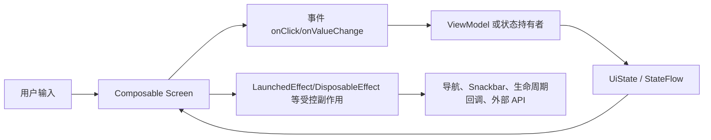
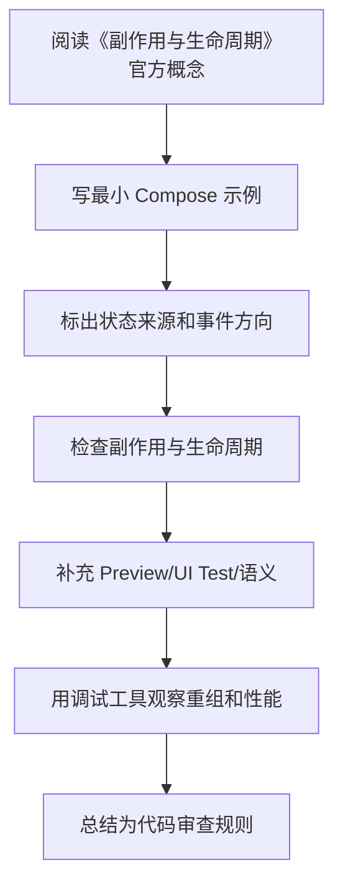

# 04. 副作用与生命周期

<!-- lecture-notes:integrated-v2 -->

## 讲义导读：把 Compose 放进声明式 UI 主线

这一章讲的是 **04. 副作用与生命周期**。学习 Compose 时不要把它当成“用 Kotlin 写 XML”，而要把它理解成一套声明式 UI 系统：状态变化驱动重组，Composable 描述界面，事件向上流动，副作用被 Effect API 和生命周期约束。

### 一句话先懂

副作用是 UI 描述之外的真实动作，例如请求、订阅、导航、Snackbar 和资源清理，必须交给合适的 Effect API。

### 通俗类比

Composable 像画图，副作用像真的打电话。画图可以反复执行，但电话不能因为重画就反复拨出，所以要用 LaunchedEffect、DisposableEffect 等工具控制。

类比只是帮助建立直觉，不能替代准确概念。真正写 Compose 时，要回到状态所有权、重组范围、副作用 key、生命周期收集、参数稳定性、语义树、导航状态和版本兼容上。一个页面能显示只是第一步，能在旋转、返回栈、长列表、无障碍、测试和 release 环境下稳定工作才算可靠。

### 本章学习主线

1. **先看状态来源**：状态由谁拥有，是 local state、rememberSaveable、ViewModel、Repository 还是导航参数？
2. **再看重组边界**：哪些状态读取会触发哪些 Composable 重组，参数是否稳定，列表 key 是否可靠？
3. **然后看事件流向**：用户点击、输入、滚动如何上行，ViewModel 如何处理，UiState 如何回到 UI？
4. **接着看副作用**：网络请求、Flow 收集、导航、Snackbar、资源监听是否放在正确 Effect 和生命周期里？
5. **最后看验证**：能否用 Preview、UI Test、Layout Inspector、重组观察、Macrobenchmark 或真机复现和验证？

### 概念怎么学才不容易忘

遇到 Compose API，建议按“它读什么状态 -> 会不会重组 -> 有没有副作用 -> 谁负责保存 -> 如何测试”五步理解。比如 remember 只记住组合内状态，rememberSaveable 处理可保存状态，LaunchedEffect 会随 key 重启，LazyColumn 需要稳定 key，collectAsStateWithLifecycle 负责生命周期感知收集。

### 最小实践任务

写一个进入页面加载数据、离开页面取消监听、点击后显示 Snackbar 的例子，分别使用 LaunchedEffect 和 DisposableEffect。

实践时要保留错误版本。Compose 很多坑不会直接编译失败，而是表现为重复请求、状态丢失、列表错位、测试找不到节点、重组过多或 TalkBack 读不清。把错误写法、现象、定位工具和修复方式记录下来，比只保存正确代码更有价值。

### 读完本章应该能产出

能选择 LaunchedEffect、DisposableEffect、SideEffect、rememberUpdatedState、produceState；能解释 key 变化为何会重启副作用。

> 本节是全篇讲义化改写的阅读入口，后续正文中的定义、步骤、示例和参考资料都应围绕这条学习主线来理解。
最后调研时间：2026-06-13  
主要来源：Android Developers Side-effects、Lifecycle、State 文档。

## 1. 什么是副作用

副作用是 Composable 函数作用域之外发生的变化，例如：

- 发起网络请求。
- 写数据库。
- 上报埋点。
- 订阅传感器、广播、回调。
- 启动协程。
- 调用导航。
- 显示 Snackbar。

Composable 可能被多次执行、跳过、取消，因此副作用不能直接写在函数体里。

错误：

```kotlin
@Composable
fun ProfileScreen(userId: String, repo: UserRepository) {
    repo.loadUser(userId) // 错：重组时可能重复调用
    Text("Profile")
}
```

正确方向：

- 页面数据加载放 ViewModel。
- 与 Composition 生命周期绑定的任务用 Effect API。
- 与 Android Lifecycle 绑定的收集用 lifecycle-compose。

## 2. Effect API 总览

| API | 适合场景 |
|---|---|
| `LaunchedEffect` | 在 Composition 中启动协程，key 变化时重启 |
| `rememberCoroutineScope` | 在事件回调中启动协程，例如点击后显示 Snackbar |
| `DisposableEffect` | 注册/注销监听器，进入时注册，离开或 key 变时清理 |
| `SideEffect` | 每次成功重组后同步外部对象 |
| `produceState` | 把外部异步数据源转换成 Compose State |
| `derivedStateOf` | 从其他 State 派生低频变化状态 |
| `snapshotFlow` | 把 Compose State 读取转换成 Flow |
| `rememberUpdatedState` | 在长生命周期 Effect 中拿到最新 lambda/值 |

## 3. `LaunchedEffect`

`LaunchedEffect` 会在进入 Composition 时启动协程；当 key 改变时，旧协程取消，新协程启动；离开 Composition 时协程取消。

```kotlin
@Composable
fun AutoRefresh(userId: String, onRefresh: suspend (String) -> Unit) {
    LaunchedEffect(userId) {
        onRefresh(userId)
    }
}
```

常见用途：

- 根据参数变化加载数据。
- 收集一次性事件 Flow。
- 执行动画。
- 进入页面后触发滚动。
- 根据状态触发导航。

不推荐把 ViewModel 已经在 `init` 做的数据加载又放进 `LaunchedEffect(Unit)`，否则职责重复。

### key 的选择

```kotlin
LaunchedEffect(userId) {
    viewModel.load(userId)
}
```

`userId` 变化时重新加载。

```kotlin
LaunchedEffect(Unit) {
    viewModel.loadOnce()
}
```

当前 Composition 生命周期内只启动一次。注意：页面离开后再回来仍会重新启动。

危险写法：

```kotlin
LaunchedEffect(uiState) {
    // uiState 每次变化都重启，可能造成循环或重复请求
}
```

除非确实需要监听整个状态对象，否则 key 应尽量具体。

## 4. `rememberCoroutineScope`

事件回调不是 Composable 作用域，不能直接调用 suspend 函数。可以用 `rememberCoroutineScope()` 获取与 Composition 绑定的 scope。

```kotlin
@Composable
fun SnackbarButton(snackbarHostState: SnackbarHostState) {
    val scope = rememberCoroutineScope()

    Button(
        onClick = {
            scope.launch {
                snackbarHostState.showSnackbar("已保存")
            }
        }
    ) {
        Text("保存")
    }
}
```

适合：

- 点击后显示 Snackbar。
- 点击后滚动列表。
- 与 UI 控件状态相关的短任务。

不适合：

- 页面业务请求主流程。业务请求应由 ViewModel 管理。

## 5. `DisposableEffect`

用于需要清理的副作用。

```kotlin
@Composable
fun LifecycleLogger(
    lifecycleOwner: LifecycleOwner = LocalLifecycleOwner.current,
    onStart: () -> Unit,
    onStop: () -> Unit
) {
    val currentOnStart by rememberUpdatedState(onStart)
    val currentOnStop by rememberUpdatedState(onStop)

    DisposableEffect(lifecycleOwner) {
        val observer = LifecycleEventObserver { _, event ->
            when (event) {
                Lifecycle.Event.ON_START -> currentOnStart()
                Lifecycle.Event.ON_STOP -> currentOnStop()
                else -> Unit
            }
        }

        lifecycleOwner.lifecycle.addObserver(observer)

        onDispose {
            lifecycleOwner.lifecycle.removeObserver(observer)
        }
    }
}
```

适合：

- 注册广播、传感器、监听器。
- 添加生命周期观察者。
- 连接第三方 SDK 回调。
- 需要 `add` 和 `remove` 成对出现的逻辑。

注意：`onDispose` 必须释放资源。

## 6. `rememberUpdatedState`

长时间运行的 Effect 捕获 lambda 时，可能捕获旧值。`rememberUpdatedState` 可以让 Effect 不重启，同时拿到最新 lambda。

```kotlin
@Composable
fun SplashScreen(onTimeout: () -> Unit) {
    val currentOnTimeout by rememberUpdatedState(onTimeout)

    LaunchedEffect(Unit) {
        delay(2000)
        currentOnTimeout()
    }
}
```

如果把 `onTimeout` 放进 key：

```kotlin
LaunchedEffect(onTimeout) { ... }
```

上层重组导致 lambda 引用变化时，计时会重启，可能不是想要的结果。

## 7. `SideEffect`

`SideEffect` 在每次成功重组后执行，用来把 Compose 状态同步给非 Compose 对象。

```kotlin
@Composable
fun AnalyticsUserProperty(userType: String, analytics: Analytics) {
    SideEffect {
        analytics.setUserProperty("userType", userType)
    }
}
```

适合：

- 更新外部对象当前属性。
- 同步主题、系统 UI 状态的一些轻量值。

不适合：

- suspend 函数。
- 耗时操作。
- 需要清理的监听。

## 8. `produceState`

`produceState` 可以把异步来源转换为 Compose `State<T>`。

```kotlin
@Composable
fun rememberImageState(url: String, loader: ImageLoader): State<ImageResult> {
    return produceState<ImageResult>(initialValue = ImageResult.Loading, url, loader) {
        value = runCatching { loader.load(url) }
            .fold(
                onSuccess = { ImageResult.Success(it) },
                onFailure = { ImageResult.Error(it) }
            )
    }
}
```

适合封装 UI 层数据源桥接。大型业务数据仍建议 ViewModel 处理。

## 9. 一次性事件

常见一次性事件：

- 导航到新页面。
- 显示 Snackbar。
- Toast。
- 弹系统权限请求。

推荐 ViewModel 暴露 `SharedFlow`：

```kotlin
sealed interface LoginEffect {
    data object NavigateHome : LoginEffect
    data class ShowMessage(val message: String) : LoginEffect
}

class LoginViewModel : ViewModel() {
    private val _effects = MutableSharedFlow<LoginEffect>()
    val effects = _effects.asSharedFlow()

    fun submit() {
        viewModelScope.launch {
            _effects.emit(LoginEffect.NavigateHome)
        }
    }
}
```

Compose 收集：

```kotlin
@Composable
fun LoginRoute(
    viewModel: LoginViewModel = viewModel(),
    navController: NavController,
    snackbarHostState: SnackbarHostState
) {
    LaunchedEffect(viewModel) {
        viewModel.effects.collect { effect ->
            when (effect) {
                LoginEffect.NavigateHome -> navController.navigate("home")
                is LoginEffect.ShowMessage -> snackbarHostState.showSnackbar(effect.message)
            }
        }
    }
}
```

注意：

- 不要把一次性事件放进普通 `UiState` 后忘记消费，否则旋转屏幕可能重复触发。
- 如果用 `UiState` 存事件，需要设计明确的消费机制。
- `SharedFlow` 默认没有 replay，页面不在前台时可能错过事件；这通常符合导航/Snackbar，但要根据业务判断。

## 10. 生命周期感知 Flow 收集

在 Android 上优先：

```kotlin
val uiState by viewModel.uiState.collectAsStateWithLifecycle()
```

它会结合 Lifecycle，在合适生命周期状态收集，避免后台无意义收集。

如果你在非 Android Compose 或特殊场景中使用：

```kotlin
val uiState by viewModel.uiState.collectAsState()
```

要明确生命周期语义。

## 11. `LaunchedEffect` 与 ViewModel 的边界

| 逻辑 | 放哪里 |
|---|---|
| 页面初始化加载业务数据 | ViewModel `init` 或接收参数后加载 |
| 用户点击后保存 | ViewModel |
| 点击后滚动列表 | `rememberCoroutineScope` |
| 进入页面后滚到指定位置 | `LaunchedEffect(targetId)` |
| 收集 ViewModel 一次性事件 | `LaunchedEffect(viewModel)` |
| 注册系统监听器 | `DisposableEffect` |
| 同步分析用户属性 | `SideEffect` |

经验规则：如果逻辑即使 UI 换成 XML/View 也仍然存在，通常不属于 Composable。

## 12. 常见错误

| 错误 | 问题 | 修正 |
|---|---|---|
| 在 Composable 函数体直接请求网络 | 重组重复请求 | ViewModel 或 `LaunchedEffect` |
| `LaunchedEffect(true)` 中捕获旧 lambda | 执行旧回调 | `rememberUpdatedState` |
| `DisposableEffect` 不清理 | 泄漏监听器 | `onDispose` 中释放 |
| key 太宽泛 | 频繁取消重启协程 | 使用具体 key |
| key 太窄 | 参数变化但 Effect 不更新 | 把影响任务的参数放入 key |
| ViewModel 暴露 Channel 但 UI 未及时收集 | 事件丢失或阻塞 | 根据语义选 `SharedFlow`/`StateFlow`/Channel |

## 13. Effect 选择决策表

| 需求 | 推荐 API | 说明 |
|---|---|---|
| 进入页面后启动一个协程任务 | `LaunchedEffect(key)` | key 变化会取消并重启 |
| 点击按钮后调用 suspend UI 操作 | `rememberCoroutineScope()` | 例如 Snackbar、滚动 |
| 注册监听器并释放 | `DisposableEffect(key)` | `onDispose` 必须释放 |
| 把 Compose 状态同步给外部对象 | `SideEffect` | 每次成功重组后执行 |
| 外部异步源转成 Compose State | `produceState` | 适合封装小型桥接 |
| 长生命周期任务拿最新 lambda | `rememberUpdatedState` | 避免为了新 lambda 重启任务 |
| 监听 Compose State 并用 Flow 操作符处理 | `snapshotFlow` | 常用于滚动埋点 |
| 从高频状态派生低频 UI 状态 | `derivedStateOf` | 常用于滚动按钮显隐 |

## 14. `snapshotFlow` 的实战用法

滚动埋点不要直接在 Composable 函数体里判断并上报：

```kotlin
@Composable
fun FeedList(analytics: Analytics) {
    val listState = rememberLazyListState()

    LaunchedEffect(listState) {
        snapshotFlow { listState.firstVisibleItemIndex }
            .map { index -> index > 0 }
            .distinctUntilChanged()
            .filter { it }
            .collect {
                analytics.logScrolledPastFirstItem()
            }
    }

    LazyColumn(state = listState) {
        // items
    }
}
```

注意：

- `snapshotFlow` 只追踪 block 中读取的 Compose State。
- block 中不要做耗时计算。
- 常配合 `distinctUntilChanged()`、`debounce()`、`filter()` 降低事件频率。
- 如果只是显示“回到顶部”按钮，用 `derivedStateOf` 比 Flow 更简单。

## 15. 生命周期收集一次性事件

如果希望事件只在页面至少 STARTED 时收集，可以结合 `repeatOnLifecycle`：

```kotlin
@Composable
fun LoginRoute(
    viewModel: LoginViewModel = viewModel(),
    onLoginSuccess: () -> Unit
) {
    val lifecycleOwner = LocalLifecycleOwner.current

    LaunchedEffect(viewModel, lifecycleOwner) {
        lifecycleOwner.repeatOnLifecycle(Lifecycle.State.STARTED) {
            viewModel.effects.collect { effect ->
                when (effect) {
                    LoginEffect.NavigateHome -> onLoginSuccess()
                }
            }
        }
    }
}
```

`collectAsStateWithLifecycle()` 适合持续状态；`repeatOnLifecycle` 适合需要自己控制收集 block 的 Flow，例如一次性事件、多路 Flow、复杂收集逻辑。

## 16. 不要用 Effect 修补错误架构

这些写法通常说明边界放错了：

| 写法 | 问题 | 更好的方向 |
|---|---|---|
| `LaunchedEffect(Unit) { viewModel.load() }` 到处出现 | 页面初始化逻辑分散 | ViewModel 从参数初始化或明确 Route 触发 |
| `LaunchedEffect(uiState) { if (...) navigate() }` | 可能重复导航，key 太宽 | 用一次性 `Effect` Flow |
| `DisposableEffect(Unit)` 注册全局单例监听 | 生命周期可能不符合业务 | 放 Application/Repository 或明确 lifecycle owner |
| `SideEffect` 里写耗时逻辑 | 阻塞重组后流程 | 放 ViewModel 或后台线程 |
| `rememberCoroutineScope` 发业务请求 | UI scope 生命周期太短 | ViewModel `viewModelScope` |

---

## 万字精讲扩展（2026-06-16 更新）
> Last researched: 2026-06-16。本文补充内容以 Jetpack Compose 官方文档和 Android Developers 实践资料为主；涉及 Compose Compiler、Kotlin、Navigation、Material3、Lifecycle、Performance 的版本细节，应在真实项目中继续核对最新官方 release notes。

### 本章在 Compose 学习路线中的位置

《副作用与生命周期》是 Compose 能力闭环中的一个节点。Compose 学习不能只停留在静态页面，还要覆盖状态、事件、副作用、生命周期、导航、性能、测试、无障碍和 View 互操作。一个 composable 写出来能显示，只说明第一步完成；它能在重组、旋转、返回栈恢复、无障碍服务、release 构建、长列表和低端设备上稳定工作，才说明写法可靠。

本章学习完成后，建议至少达到三个标准。第一，能用 Compose 心智模型解释本章 API 的作用和边界。第二，能写出最小可运行例子，并指出状态来源、事件方向和副作用生命周期。第三，能制造一个常见错误并用工具或测试验证修复效果。Compose 是声明式 UI，但工程质量仍然依赖清晰边界和可验证实践。

### 副作用与生命周期类笔记的精讲重点

副作用是 Compose 中最容易出错的部分。`LaunchedEffect` 用于随 key 启动和取消协程，`DisposableEffect` 用于注册和清理监听器，`rememberCoroutineScope` 用于事件回调里启动协程，`rememberUpdatedState` 用于在长生命周期 effect 中读取最新 lambda 或值，`SideEffect` 用于每次成功 composition 后同步外部状态，`produceState` 用于把外部异步源转换成 Compose State。

Effect 的 key 是生命周期控制器，不是随便填的参数。key 变化会取消旧 effect 并启动新 effect；key 太宽会重复执行，key 太窄会拿到旧数据。一次性事件也要谨慎，不能因为重组而重复导航或重复弹 Snackbar。推荐把长期状态放 UiState，把一次性 UI 动作设计成可消费事件或由 UI 层根据明确触发时机处理。

### Compose 的核心心智模型：UI 是状态的函数，但函数必须足够纯

Compose 最重要的转变不是“用 Kotlin 写 UI”，而是把 UI 看成状态的描述。一个 composable 根据输入参数和读取到的状态描述界面，状态变化后框架触发重组，重新执行需要更新的 composable。这个模型要求 composable 尽量幂等、快速、无副作用。官方 Thinking in Compose 文档特别强调，重组可能频繁发生，也可能被跳过或取消，因此不要在 composable 主体里直接执行网络请求、导航、写数据库、启动协程或修改外部对象。需要副作用时，要使用受 Compose 生命周期管理的 Effect API。

学习 Compose 要同时区分三件事：composition、recomposition 和 drawing/layout。Composition 是把 composable 调用组织成 UI 树的过程；recomposition 是状态变化后重新执行部分 composable；layout/draw 是测量、摆放和绘制阶段。性能问题不一定来自重组，可能来自布局太复杂、绘制太重、列表 item 没有 key、状态读取范围太宽、参数不稳定、图片加载或主线程阻塞。只把“少重组”当成唯一目标，会误判很多问题。

### 状态、事件、副作用的单向流



Figure: Compose 单向数据流和副作用边界，综合 Android 官方 State、State Hoisting、Side-effects、Lifecycle in Compose 文档整理。

这个图的关键是方向。UI 读取状态并发出事件，状态持有者处理事件并产生新状态，UI 根据新状态重组。副作用不应该散落在 composable 主体里，而要放在能够表达启动、取消、更新和清理时机的 Effect API 中。导航、Snackbar、权限请求、监听器注册、Flow 收集、动画启动、外部 View 生命周期绑定，都属于需要明确边界的动作。

### Compose 学习必须建立版本意识

Compose 与 Kotlin、Compose Compiler、Android Gradle Plugin、Material3、Navigation、Lifecycle、Activity Compose 等库存在版本关系。Kotlin 2.0 之后 Compose Compiler 移入 Kotlin 仓库，旧项目仍可能遇到 compiler extension 与 Kotlin 版本不匹配的问题。学习笔记里不要只写“加某个依赖”，还要写 BOM、Kotlin 插件、Compose Compiler、Navigation 版本、Lifecycle Compose 版本以及是否使用类型安全导航、强跳过模式等条件。遇到构建错误时，优先查官方兼容表和 release notes。

### 最小可验证学习法

每个 Compose 主题都应该写一个最小验证例子。学习状态时，写一个文本输入、筛选列表或展开面板；学习副作用时，写 Snackbar、定时器、生命周期监听或 Flow 收集；学习 Lazy 列表时，写稳定 key、滚动位置、分页占位和 item 状态；学习性能时，写一个会过度重组的例子，再用状态拆分、remember、derivedStateOf 或稳定参数修正；学习测试时，用 semantics 查找节点并验证状态变化。只有能制造错误并修复，才算真正理解。

### 核心知识点逐条精讲

#### 1. LaunchedEffect

在《副作用与生命周期》中，`LaunchedEffect` 不应该只理解成一个 API 名称，而要放进 Compose 的组合、重组、状态和副作用模型里看。学习时先问：它读取什么状态，谁拥有这些状态，变化后会让哪些 composable 重组，是否需要保存到配置变化后，是否会触发外部副作用，是否会影响测试语义或无障碍。能回答这些问题，才说明你真正按 Compose 的方式思考。

实现 ` LaunchedEffect ` 时，建议先写一个最小 demo，再写一个错误版本。比如状态提升可以写“子组件内部 remember 导致外部无法控制”的错误例子；LaunchedEffect 可以写“key 变化导致重复请求”的错误例子；Lazy key 可以写“插入 item 后状态错位”的错误例子；Navigation 可以写“传复杂对象导致恢复困难”的错误例子。制造错误比只看正确代码更能建立边界感。

代码审查时要把 ` LaunchedEffect ` 转成检查项：状态是否单一来源，参数是否稳定，Modifier 是否作为参数传入，副作用是否有正确 key 和清理逻辑，Flow 是否生命周期感知收集，Lazy item 是否有稳定 key，语义是否可测试且可访问，release 构建和性能工具是否验证过。Compose 项目的质量通常取决于这些细节是否一致执行。

#### 2. rememberCoroutineScope

在《副作用与生命周期》中，`rememberCoroutineScope` 不应该只理解成一个 API 名称，而要放进 Compose 的组合、重组、状态和副作用模型里看。学习时先问：它读取什么状态，谁拥有这些状态，变化后会让哪些 composable 重组，是否需要保存到配置变化后，是否会触发外部副作用，是否会影响测试语义或无障碍。能回答这些问题，才说明你真正按 Compose 的方式思考。

实现 ` rememberCoroutineScope ` 时，建议先写一个最小 demo，再写一个错误版本。比如状态提升可以写“子组件内部 remember 导致外部无法控制”的错误例子；LaunchedEffect 可以写“key 变化导致重复请求”的错误例子；Lazy key 可以写“插入 item 后状态错位”的错误例子；Navigation 可以写“传复杂对象导致恢复困难”的错误例子。制造错误比只看正确代码更能建立边界感。

代码审查时要把 ` rememberCoroutineScope ` 转成检查项：状态是否单一来源，参数是否稳定，Modifier 是否作为参数传入，副作用是否有正确 key 和清理逻辑，Flow 是否生命周期感知收集，Lazy item 是否有稳定 key，语义是否可测试且可访问，release 构建和性能工具是否验证过。Compose 项目的质量通常取决于这些细节是否一致执行。

#### 3. DisposableEffect

在《副作用与生命周期》中，`DisposableEffect` 不应该只理解成一个 API 名称，而要放进 Compose 的组合、重组、状态和副作用模型里看。学习时先问：它读取什么状态，谁拥有这些状态，变化后会让哪些 composable 重组，是否需要保存到配置变化后，是否会触发外部副作用，是否会影响测试语义或无障碍。能回答这些问题，才说明你真正按 Compose 的方式思考。

实现 ` DisposableEffect ` 时，建议先写一个最小 demo，再写一个错误版本。比如状态提升可以写“子组件内部 remember 导致外部无法控制”的错误例子；LaunchedEffect 可以写“key 变化导致重复请求”的错误例子；Lazy key 可以写“插入 item 后状态错位”的错误例子；Navigation 可以写“传复杂对象导致恢复困难”的错误例子。制造错误比只看正确代码更能建立边界感。

代码审查时要把 ` DisposableEffect ` 转成检查项：状态是否单一来源，参数是否稳定，Modifier 是否作为参数传入，副作用是否有正确 key 和清理逻辑，Flow 是否生命周期感知收集，Lazy item 是否有稳定 key，语义是否可测试且可访问，release 构建和性能工具是否验证过。Compose 项目的质量通常取决于这些细节是否一致执行。

#### 4. rememberUpdatedState

在《副作用与生命周期》中，`rememberUpdatedState` 不应该只理解成一个 API 名称，而要放进 Compose 的组合、重组、状态和副作用模型里看。学习时先问：它读取什么状态，谁拥有这些状态，变化后会让哪些 composable 重组，是否需要保存到配置变化后，是否会触发外部副作用，是否会影响测试语义或无障碍。能回答这些问题，才说明你真正按 Compose 的方式思考。

实现 ` rememberUpdatedState ` 时，建议先写一个最小 demo，再写一个错误版本。比如状态提升可以写“子组件内部 remember 导致外部无法控制”的错误例子；LaunchedEffect 可以写“key 变化导致重复请求”的错误例子；Lazy key 可以写“插入 item 后状态错位”的错误例子；Navigation 可以写“传复杂对象导致恢复困难”的错误例子。制造错误比只看正确代码更能建立边界感。

代码审查时要把 ` rememberUpdatedState ` 转成检查项：状态是否单一来源，参数是否稳定，Modifier 是否作为参数传入，副作用是否有正确 key 和清理逻辑，Flow 是否生命周期感知收集，Lazy item 是否有稳定 key，语义是否可测试且可访问，release 构建和性能工具是否验证过。Compose 项目的质量通常取决于这些细节是否一致执行。

#### 5. Flow 收集和一次性事件

在《副作用与生命周期》中，`Flow 收集和一次性事件` 不应该只理解成一个 API 名称，而要放进 Compose 的组合、重组、状态和副作用模型里看。学习时先问：它读取什么状态，谁拥有这些状态，变化后会让哪些 composable 重组，是否需要保存到配置变化后，是否会触发外部副作用，是否会影响测试语义或无障碍。能回答这些问题，才说明你真正按 Compose 的方式思考。

实现 ` Flow 收集和一次性事件 ` 时，建议先写一个最小 demo，再写一个错误版本。比如状态提升可以写“子组件内部 remember 导致外部无法控制”的错误例子；LaunchedEffect 可以写“key 变化导致重复请求”的错误例子；Lazy key 可以写“插入 item 后状态错位”的错误例子；Navigation 可以写“传复杂对象导致恢复困难”的错误例子。制造错误比只看正确代码更能建立边界感。

代码审查时要把 ` Flow 收集和一次性事件 ` 转成检查项：状态是否单一来源，参数是否稳定，Modifier 是否作为参数传入，副作用是否有正确 key 和清理逻辑，Flow 是否生命周期感知收集，Lazy item 是否有稳定 key，语义是否可测试且可访问，release 构建和性能工具是否验证过。Compose 项目的质量通常取决于这些细节是否一致执行。


### 场景化学习与排错表

| 主题 | 推荐动作 | 常见风险 | 验证方式 |
| :--- | :--- | :--- | :--- |
| LaunchedEffect | 用最小 demo 验证正确写法和错误写法，再放入完整页面 | 重组重复执行、副作用 key 错、状态源重复、稳定性误判、测试语义缺失 | Preview、Compose UI Test、Layout Inspector、重组计数、Macrobenchmark、真机验证 |
| rememberCoroutineScope | 用最小 demo 验证正确写法和错误写法，再放入完整页面 | 重组重复执行、副作用 key 错、状态源重复、稳定性误判、测试语义缺失 | Preview、Compose UI Test、Layout Inspector、重组计数、Macrobenchmark、真机验证 |
| DisposableEffect | 用最小 demo 验证正确写法和错误写法，再放入完整页面 | 重组重复执行、副作用 key 错、状态源重复、稳定性误判、测试语义缺失 | Preview、Compose UI Test、Layout Inspector、重组计数、Macrobenchmark、真机验证 |
| rememberUpdatedState | 用最小 demo 验证正确写法和错误写法，再放入完整页面 | 重组重复执行、副作用 key 错、状态源重复、稳定性误判、测试语义缺失 | Preview、Compose UI Test、Layout Inspector、重组计数、Macrobenchmark、真机验证 |
| Flow 收集和一次性事件 | 用最小 demo 验证正确写法和错误写法，再放入完整页面 | 重组重复执行、副作用 key 错、状态源重复、稳定性误判、测试语义缺失 | Preview、Compose UI Test、Layout Inspector、重组计数、Macrobenchmark、真机验证 |

这个表的重点是“能复现、能观察、能修复”。Compose 很多问题不会编译报错，而是表现为重组过多、状态丢失、事件重复、列表错位、TalkBack 读不清、测试找不到节点或某些机型上卡顿。只有建立可观察的验证方法，才能避免靠经验猜。

### 本章建议工作流



Figure: 《副作用与生命周期》学习工作流，综合 Android 官方 Compose mental model、state、side-effects、performance、accessibility 和 testing 资料整理。

这个流程适合所有 Compose 主题。先理解概念，再落到小例子，再放回真实页面，再用测试和工具验证。不要在没有状态图的情况下写复杂 UI，也不要在没有测量的情况下做性能优化。

### 常见误区和纠正方法

- 误区：在 composable 主体里执行副作用。纠正：网络、导航、Snackbar、注册监听器、启动协程等动作应放入合适 Effect API 或 ViewModel 事件处理中。
- 误区：所有状态都放 ViewModel。纠正：纯 UI 元素状态可以靠近使用处，屏幕级和业务相关状态再提升到 ViewModel。
- 误区：所有地方都加 remember。纠正：remember 是保存计算或对象的工具，不是性能万能药；先测量，再判断是否需要。
- 误区：Lazy 列表不写 key。纠正：可变列表、插入删除、分页和 item 内状态都应使用稳定 key，避免状态错位。
- 误区：测试只靠 testTag。纠正：优先设计有意义的语义，testTag 作为补充；无障碍和测试都依赖语义质量。
- 误区：忽略版本兼容。纠正：Compose Compiler、Kotlin、BOM、Material3、Navigation 和 Lifecycle Compose 都要按官方版本说明维护。

### 与相邻章节的关系

《副作用与生命周期》应与状态、副作用、架构、性能和测试章节交叉阅读。状态决定重组，副作用决定外部动作是否可控，架构决定状态和事件放在哪里，性能决定重组和布局是否可接受，测试和无障碍决定 UI 是否能被可靠验证和使用。任何一个章节单独学习都不够，最终要在一个完整页面中串起来。

### 实操训练和复盘模板

1. 围绕 `LaunchedEffect` 写一个最小页面：包含正确实现、故意错误实现、观察结果和修复总结。
2. 围绕 `rememberCoroutineScope` 写一个最小页面：包含正确实现、故意错误实现、观察结果和修复总结。
3. 围绕 `DisposableEffect` 写一个最小页面：包含正确实现、故意错误实现、观察结果和修复总结。
4. 围绕 `rememberUpdatedState` 写一个最小页面：包含正确实现、故意错误实现、观察结果和修复总结。
5. 围绕 `Flow 收集和一次性事件` 写一个最小页面：包含正确实现、故意错误实现、观察结果和修复总结。

建议每个 Compose 练习都记录：

```text
练习名称：
本章主题：副作用与生命周期
Compose / Kotlin / AGP / BOM 版本：
状态来源：local state / rememberSaveable / ViewModel / Repository
事件流向：UI -> ViewModel / state holder -> UiState -> UI
副作用：Effect API、key、取消和清理逻辑
测试入口：semantics、testTag、Preview、UI Test
性能观察：重组范围、Lazy key、稳定性、主线程耗时
失败场景：旋转、返回栈恢复、快速点击、断网、长列表、字体放大、TalkBack
结论：以后项目中采用的规则
```

这个模板的意义是把 Compose 学习从“API 记忆”推进到“页面质量”。真实项目中的 Compose 问题通常跨越状态、生命周期、导航、性能和无障碍，复盘时必须把这些因素放在一起看。

## 参考资料与延伸阅读

- [Official / Android] Jetpack Compose documentation: https://developer.android.com/develop/ui/compose
- [Official / Android] Thinking in Compose: https://developer.android.com/develop/ui/compose/mental-model
- [Official / Android] State and Jetpack Compose: https://developer.android.com/develop/ui/compose/state
- [Official / Android] Where to hoist state: https://developer.android.com/develop/ui/compose/state-hoisting
- [Official / Android] Side-effects in Compose: https://developer.android.com/develop/ui/compose/side-effects
- [Official / Android] Lifecycle in Jetpack Compose: https://developer.android.com/topic/libraries/architecture/lifecycle
- [Official / Android] Lazy lists and lazy grids: https://developer.android.com/develop/ui/compose/lists
- [Official / Android] Compose performance: https://developer.android.com/develop/ui/compose/performance
- [Official / Android] Stability in Compose: https://developer.android.com/develop/ui/compose/performance/stability
- [Official / Android] Strong skipping mode: https://developer.android.com/develop/ui/compose/performance/stability/strongskipping
- [Official / Android] Accessibility in Jetpack Compose: https://developer.android.com/develop/ui/compose/accessibility
- [Official / Android] Semantics in Compose: https://developer.android.com/develop/ui/compose/accessibility/semantics
- [Official / Android] Type safety in Navigation Compose: https://developer.android.com/guide/navigation/design/type-safety
- [Official / Android] Compose to Kotlin Compatibility Map: https://developer.android.com/jetpack/androidx/releases/compose-kotlin
- [Official / Android] Compose Compiler release notes: https://developer.android.com/jetpack/androidx/releases/compose-compiler
- [Official / Android Developers Blog] Jetpack Compose compiler moving to the Kotlin repository: https://android-developers.googleblog.com/2024/04/jetpack-compose-compiler-moving-to-kotlin-repository.html
- [Official / Android Developers Blog] What's New in Jetpack Compose: https://android-developers.googleblog.com/2025/05/whats-new-in-jetpack-compose.html
- [Official / Android Developers Blog] Strong Skipping Mode Explained: https://medium.com/androiddevelopers/jetpack-compose-strong-skipping-mode-explained-cbdb2aa4b900
- [Official / Android Developers Blog] Fundamentals of Compose layouts and modifiers: https://medium.com/androiddevelopers/fundamentals-of-compose-layouts-and-modifiers-64d794664b66
- [Official / Android Developers Blog] Consuming flows safely in Jetpack Compose: https://medium.com/androiddevelopers/consuming-flows-safely-in-jetpack-compose-cde014d0d5a3
- [Official / Android Developers Blog] Navigation Compose meet Type Safety: https://medium.com/androiddevelopers/navigation-compose-meet-type-safety-e081fb3cf2f8
- [Community / CSDN] Jetpack Compose 学习笔记检索入口: https://so.csdn.net/so/search?q=Jetpack%20Compose%20%E5%AD%A6%E4%B9%A0%E7%AC%94%E8%AE%B0
- [Community / 博客园] Compose 状态与副作用实践检索入口: https://zzk.cnblogs.com/s/blogpost?Keywords=Jetpack%20Compose%20%E7%8A%B6%E6%80%81%20%E5%89%AF%E4%BD%9C%E7%94%A8
- [Community / 掘金] Compose 性能、导航、架构实践检索入口: https://juejin.cn/search?query=Jetpack%20Compose%20%E6%80%A7%E8%83%BD%20%E5%AF%BC%E8%88%AA%20%E6%9E%B6%E6%9E%84&type=0

<!-- AUTO_EXPANDED_TO_REFERENCE_LENGTH_2026_06_23 -->

## 万字精讲扩展：副作用与生命周期

> 本节为按参考笔记篇幅补充的系统化扩展内容，目标是把原有笔记从“知识点记录”扩展为“概念、原理、流程、工程实践、常见误区和复盘清单”完整学习材料。

### 精讲扩展 1：副作用与生命周期 的生命周期、状态管理 与工程化理解

学习 $topic 时，不能只把它当成一个孤立知识点来背诵，而要把它放到 $category 的完整问题链条里理解。一个知识点通常同时包含概念定义、适用边界、输入输出、运行过程、常见异常和工程取舍。真正掌握它，意味着看到一个具体场景时，能够判断它解决什么问题、依赖哪些前提、失败时会出现什么现象，以及应该用什么手段验证自己的判断。

从 $a 的角度看，最重要的是先建立清晰的对象模型。也就是明确系统里有哪些参与者、它们之间如何连接、数据或控制信号如何流动、哪些环节是同步的、哪些环节是异步的、哪些状态是临时状态、哪些状态需要长期保存。很多初学问题并不是公式不会、API 不熟，而是对象边界不清：把配置当成状态，把结果当成过程，把局部现象当成全局规律。写笔记时建议始终追问：这个概念的主体是谁，输入是什么，输出是什么，中间约束是什么，错误会在哪里暴露。

从 $b 的角度看，流程比单点知识更关键。一个成熟方案通常不是单个技巧，而是一组步骤：先确定目标，再拆分约束，然后选择工具，最后通过测试和复盘确认效果。比如在实际项目中，不能只问“怎么实现”，还要问“为什么要这样实现”“有没有更简单的替代方案”“边界条件是什么”“数据量、并发量、实时性、可靠性变化后还能不能工作”。这种流程意识能够避免把学习停留在教程层面，也能让后续排错有明确路线。

$topic 的 $c 往往决定它在真实项目中的稳定性。理论上可行的方案，到了工程环境中会受到数据质量、硬件条件、依赖版本、网络环境、团队协作、部署方式和维护成本影响。写代码或做设计时，应该把正常路径和异常路径同时考虑：正常情况下如何运行，输入为空怎么办，超时怎么办，重复执行怎么办，部分成功怎么办，版本升级后兼容性怎么办，日志和指标如何证明系统确实按预期工作。

进一步看 $d，它通常对应性能、可靠性或可维护性的核心矛盾。很多技术选择并没有绝对正确答案，只有是否适合当前约束。例如追求极致性能可能牺牲可读性，追求高度抽象可能增加调试成本，追求快速交付可能留下技术债，追求完全通用可能让简单场景变复杂。高质量笔记应该把这些取舍写出来，而不是只给一个“推荐方案”。推荐方案背后的条件越清楚，迁移到新场景时越不容易误用。

最后从 $e 的角度进行复盘，可以把知识从“看懂”推进到“会用”。建议为 $topic 建立三个层次的检查：第一层是概念检查，确认术语、流程和边界没有混淆；第二层是实践检查，确认能够独立完成一个最小案例；第三层是工程检查，确认这个案例在异常、规模、性能和维护方面经得起追问。每次学习完一个章节，都可以用这三层检查反向补齐笔记。

#### 典型场景拆解

在真实场景中，$topic 通常会经历“需求出现、方案选择、实现落地、问题暴露、持续优化”几个阶段。需求出现时，要先判断这个需求属于基础能力、性能优化、体验改进、可靠性建设还是长期架构演进。不同类型的需求对方案的评价标准不同：基础能力看正确性，性能优化看指标，体验改进看路径是否顺滑，可靠性建设看故障时能否降级和恢复，架构演进看未来变化是否容易吸收。

方案选择阶段，最容易犯的错误是直接套用熟悉工具。更稳妥的方式是列出约束：数据规模、时延要求、资源预算、团队熟悉度、运维能力、安全要求、可测试性和长期维护成本。只有把约束列清楚，才能解释为什么选择当前方案。否则方案看似高级，实际可能只是增加了复杂度。

实现落地阶段，要把 $a 和 $b 拆成可验证的小步骤。每一步都应该有明确的输入、输出和检查方式。对学习笔记而言，这意味着不能只有大段概念，还应该补充流程图式的文字描述、伪代码、命令示例、参数解释、错误现象和排查路径。这样以后复习时，笔记不仅能帮助理解，也能直接指导实践。

问题暴露阶段，要优先区分“理解错误、实现错误、环境错误、数据错误、依赖错误、边界条件错误”。很多复杂问题之所以难排，是因为一开始就把问题归因到错误层级。例如把配置问题当成算法问题，把权限问题当成代码问题，把数据分布变化当成模型失效，把硬件噪声当成软件逻辑错误。好的排查顺序应该从可观测事实开始，而不是从猜测开始。

持续优化阶段，不应只追求把当前问题压下去，还要沉淀成规则。比如记录触发条件、影响范围、定位方法、最终修复、预防措施和可监控指标。这样下一次出现类似问题时，团队可以复用经验，而不是重新从零排查。

#### 常见误区与纠偏

第一个误区是只记结论，不记前提。$topic 中很多结论都是有条件的：适用于小规模，不一定适用于大规模；适用于离线处理，不一定适用于实时系统；适用于单机环境，不一定适用于分布式环境；适用于教学案例，不一定适用于生产项目。纠偏方法是在每个重要结论后面补一句“适用条件”和“不适用情况”。

第二个误区是只关注工具，不关注模型。工具会变化，模型更稳定。无论工具名称如何变化，底层仍然要解决输入建模、状态管理、资源调度、错误恢复、性能约束和质量验证这些问题。学习 $topic 时，应该把工具用法和底层模型分开记录：工具命令解决“怎么做”，底层模型解释“为什么这样做”。

第三个误区是没有验证意识。很多笔记写得很完整，但没有说明如何确认自己做对了。对于 $category 相关主题，验证至少应包含最小样例、边界样例、异常样例和性能样例。最小样例证明流程跑通，边界样例证明理解完整，异常样例证明系统可恢复，性能样例证明方案在目标规模下仍然可用。

第四个误区是忽略可维护性。短期学习时，能跑通就容易产生掌握的错觉；长期使用时，命名、分层、注释、测试、日志、版本管理和文档才会决定知识能否转化为稳定能力。扩充 $topic 笔记时，应把“如何写得清楚、如何排查、如何交接、如何复盘”也纳入内容。

#### 学习与实践建议

建议围绕 $topic 做一个小型闭环练习：先用自己的话解释概念，再画出流程，再实现一个最小案例，然后主动制造一个错误并排查，最后写下复盘。这个过程看起来比直接读资料慢，但能显著提高迁移能力。很多人学完后不会用，根本原因是缺少“从概念到问题再到验证”的闭环。

复习时可以使用四个问题：它解决什么问题；它依赖什么条件；它失败时有什么表现；它如何被验证。只要这四个问题能回答清楚，说明对 $topic 的理解已经从表层进入工程层。如果回答不清楚，就回到对应章节补充例子、边界和排错方法。
### 精讲扩展 2：副作用与生命周期 的状态管理、单向数据流 与工程化理解

学习 $topic 时，不能只把它当成一个孤立知识点来背诵，而要把它放到 $category 的完整问题链条里理解。一个知识点通常同时包含概念定义、适用边界、输入输出、运行过程、常见异常和工程取舍。真正掌握它，意味着看到一个具体场景时，能够判断它解决什么问题、依赖哪些前提、失败时会出现什么现象，以及应该用什么手段验证自己的判断。

从 $a 的角度看，最重要的是先建立清晰的对象模型。也就是明确系统里有哪些参与者、它们之间如何连接、数据或控制信号如何流动、哪些环节是同步的、哪些环节是异步的、哪些状态是临时状态、哪些状态需要长期保存。很多初学问题并不是公式不会、API 不熟，而是对象边界不清：把配置当成状态，把结果当成过程，把局部现象当成全局规律。写笔记时建议始终追问：这个概念的主体是谁，输入是什么，输出是什么，中间约束是什么，错误会在哪里暴露。

从 $b 的角度看，流程比单点知识更关键。一个成熟方案通常不是单个技巧，而是一组步骤：先确定目标，再拆分约束，然后选择工具，最后通过测试和复盘确认效果。比如在实际项目中，不能只问“怎么实现”，还要问“为什么要这样实现”“有没有更简单的替代方案”“边界条件是什么”“数据量、并发量、实时性、可靠性变化后还能不能工作”。这种流程意识能够避免把学习停留在教程层面，也能让后续排错有明确路线。

$topic 的 $c 往往决定它在真实项目中的稳定性。理论上可行的方案，到了工程环境中会受到数据质量、硬件条件、依赖版本、网络环境、团队协作、部署方式和维护成本影响。写代码或做设计时，应该把正常路径和异常路径同时考虑：正常情况下如何运行，输入为空怎么办，超时怎么办，重复执行怎么办，部分成功怎么办，版本升级后兼容性怎么办，日志和指标如何证明系统确实按预期工作。

进一步看 $d，它通常对应性能、可靠性或可维护性的核心矛盾。很多技术选择并没有绝对正确答案，只有是否适合当前约束。例如追求极致性能可能牺牲可读性，追求高度抽象可能增加调试成本，追求快速交付可能留下技术债，追求完全通用可能让简单场景变复杂。高质量笔记应该把这些取舍写出来，而不是只给一个“推荐方案”。推荐方案背后的条件越清楚，迁移到新场景时越不容易误用。

最后从 $e 的角度进行复盘，可以把知识从“看懂”推进到“会用”。建议为 $topic 建立三个层次的检查：第一层是概念检查，确认术语、流程和边界没有混淆；第二层是实践检查，确认能够独立完成一个最小案例；第三层是工程检查，确认这个案例在异常、规模、性能和维护方面经得起追问。每次学习完一个章节，都可以用这三层检查反向补齐笔记。

#### 典型场景拆解

在真实场景中，$topic 通常会经历“需求出现、方案选择、实现落地、问题暴露、持续优化”几个阶段。需求出现时，要先判断这个需求属于基础能力、性能优化、体验改进、可靠性建设还是长期架构演进。不同类型的需求对方案的评价标准不同：基础能力看正确性，性能优化看指标，体验改进看路径是否顺滑，可靠性建设看故障时能否降级和恢复，架构演进看未来变化是否容易吸收。

方案选择阶段，最容易犯的错误是直接套用熟悉工具。更稳妥的方式是列出约束：数据规模、时延要求、资源预算、团队熟悉度、运维能力、安全要求、可测试性和长期维护成本。只有把约束列清楚，才能解释为什么选择当前方案。否则方案看似高级，实际可能只是增加了复杂度。

实现落地阶段，要把 $a 和 $b 拆成可验证的小步骤。每一步都应该有明确的输入、输出和检查方式。对学习笔记而言，这意味着不能只有大段概念，还应该补充流程图式的文字描述、伪代码、命令示例、参数解释、错误现象和排查路径。这样以后复习时，笔记不仅能帮助理解，也能直接指导实践。

问题暴露阶段，要优先区分“理解错误、实现错误、环境错误、数据错误、依赖错误、边界条件错误”。很多复杂问题之所以难排，是因为一开始就把问题归因到错误层级。例如把配置问题当成算法问题，把权限问题当成代码问题，把数据分布变化当成模型失效，把硬件噪声当成软件逻辑错误。好的排查顺序应该从可观测事实开始，而不是从猜测开始。

持续优化阶段，不应只追求把当前问题压下去，还要沉淀成规则。比如记录触发条件、影响范围、定位方法、最终修复、预防措施和可监控指标。这样下一次出现类似问题时，团队可以复用经验，而不是重新从零排查。

#### 常见误区与纠偏

第一个误区是只记结论，不记前提。$topic 中很多结论都是有条件的：适用于小规模，不一定适用于大规模；适用于离线处理，不一定适用于实时系统；适用于单机环境，不一定适用于分布式环境；适用于教学案例，不一定适用于生产项目。纠偏方法是在每个重要结论后面补一句“适用条件”和“不适用情况”。

第二个误区是只关注工具，不关注模型。工具会变化，模型更稳定。无论工具名称如何变化，底层仍然要解决输入建模、状态管理、资源调度、错误恢复、性能约束和质量验证这些问题。学习 $topic 时，应该把工具用法和底层模型分开记录：工具命令解决“怎么做”，底层模型解释“为什么这样做”。

第三个误区是没有验证意识。很多笔记写得很完整，但没有说明如何确认自己做对了。对于 $category 相关主题，验证至少应包含最小样例、边界样例、异常样例和性能样例。最小样例证明流程跑通，边界样例证明理解完整，异常样例证明系统可恢复，性能样例证明方案在目标规模下仍然可用。

第四个误区是忽略可维护性。短期学习时，能跑通就容易产生掌握的错觉；长期使用时，命名、分层、注释、测试、日志、版本管理和文档才会决定知识能否转化为稳定能力。扩充 $topic 笔记时，应把“如何写得清楚、如何排查、如何交接、如何复盘”也纳入内容。

#### 学习与实践建议

建议围绕 $topic 做一个小型闭环练习：先用自己的话解释概念，再画出流程，再实现一个最小案例，然后主动制造一个错误并排查，最后写下复盘。这个过程看起来比直接读资料慢，但能显著提高迁移能力。很多人学完后不会用，根本原因是缺少“从概念到问题再到验证”的闭环。

复习时可以使用四个问题：它解决什么问题；它依赖什么条件；它失败时有什么表现；它如何被验证。只要这四个问题能回答清楚，说明对 $topic 的理解已经从表层进入工程层。如果回答不清楚，就回到对应章节补充例子、边界和排错方法。
### 精讲扩展 3：副作用与生命周期 的单向数据流、协程 Flow 与工程化理解

学习 $topic 时，不能只把它当成一个孤立知识点来背诵，而要把它放到 $category 的完整问题链条里理解。一个知识点通常同时包含概念定义、适用边界、输入输出、运行过程、常见异常和工程取舍。真正掌握它，意味着看到一个具体场景时，能够判断它解决什么问题、依赖哪些前提、失败时会出现什么现象，以及应该用什么手段验证自己的判断。

从 $a 的角度看，最重要的是先建立清晰的对象模型。也就是明确系统里有哪些参与者、它们之间如何连接、数据或控制信号如何流动、哪些环节是同步的、哪些环节是异步的、哪些状态是临时状态、哪些状态需要长期保存。很多初学问题并不是公式不会、API 不熟，而是对象边界不清：把配置当成状态，把结果当成过程，把局部现象当成全局规律。写笔记时建议始终追问：这个概念的主体是谁，输入是什么，输出是什么，中间约束是什么，错误会在哪里暴露。

从 $b 的角度看，流程比单点知识更关键。一个成熟方案通常不是单个技巧，而是一组步骤：先确定目标，再拆分约束，然后选择工具，最后通过测试和复盘确认效果。比如在实际项目中，不能只问“怎么实现”，还要问“为什么要这样实现”“有没有更简单的替代方案”“边界条件是什么”“数据量、并发量、实时性、可靠性变化后还能不能工作”。这种流程意识能够避免把学习停留在教程层面，也能让后续排错有明确路线。

$topic 的 $c 往往决定它在真实项目中的稳定性。理论上可行的方案，到了工程环境中会受到数据质量、硬件条件、依赖版本、网络环境、团队协作、部署方式和维护成本影响。写代码或做设计时，应该把正常路径和异常路径同时考虑：正常情况下如何运行，输入为空怎么办，超时怎么办，重复执行怎么办，部分成功怎么办，版本升级后兼容性怎么办，日志和指标如何证明系统确实按预期工作。

进一步看 $d，它通常对应性能、可靠性或可维护性的核心矛盾。很多技术选择并没有绝对正确答案，只有是否适合当前约束。例如追求极致性能可能牺牲可读性，追求高度抽象可能增加调试成本，追求快速交付可能留下技术债，追求完全通用可能让简单场景变复杂。高质量笔记应该把这些取舍写出来，而不是只给一个“推荐方案”。推荐方案背后的条件越清楚，迁移到新场景时越不容易误用。

最后从 $e 的角度进行复盘，可以把知识从“看懂”推进到“会用”。建议为 $topic 建立三个层次的检查：第一层是概念检查，确认术语、流程和边界没有混淆；第二层是实践检查，确认能够独立完成一个最小案例；第三层是工程检查，确认这个案例在异常、规模、性能和维护方面经得起追问。每次学习完一个章节，都可以用这三层检查反向补齐笔记。

#### 典型场景拆解

在真实场景中，$topic 通常会经历“需求出现、方案选择、实现落地、问题暴露、持续优化”几个阶段。需求出现时，要先判断这个需求属于基础能力、性能优化、体验改进、可靠性建设还是长期架构演进。不同类型的需求对方案的评价标准不同：基础能力看正确性，性能优化看指标，体验改进看路径是否顺滑，可靠性建设看故障时能否降级和恢复，架构演进看未来变化是否容易吸收。

方案选择阶段，最容易犯的错误是直接套用熟悉工具。更稳妥的方式是列出约束：数据规模、时延要求、资源预算、团队熟悉度、运维能力、安全要求、可测试性和长期维护成本。只有把约束列清楚，才能解释为什么选择当前方案。否则方案看似高级，实际可能只是增加了复杂度。

实现落地阶段，要把 $a 和 $b 拆成可验证的小步骤。每一步都应该有明确的输入、输出和检查方式。对学习笔记而言，这意味着不能只有大段概念，还应该补充流程图式的文字描述、伪代码、命令示例、参数解释、错误现象和排查路径。这样以后复习时，笔记不仅能帮助理解，也能直接指导实践。

问题暴露阶段，要优先区分“理解错误、实现错误、环境错误、数据错误、依赖错误、边界条件错误”。很多复杂问题之所以难排，是因为一开始就把问题归因到错误层级。例如把配置问题当成算法问题，把权限问题当成代码问题，把数据分布变化当成模型失效，把硬件噪声当成软件逻辑错误。好的排查顺序应该从可观测事实开始，而不是从猜测开始。

持续优化阶段，不应只追求把当前问题压下去，还要沉淀成规则。比如记录触发条件、影响范围、定位方法、最终修复、预防措施和可监控指标。这样下一次出现类似问题时，团队可以复用经验，而不是重新从零排查。

#### 常见误区与纠偏

第一个误区是只记结论，不记前提。$topic 中很多结论都是有条件的：适用于小规模，不一定适用于大规模；适用于离线处理，不一定适用于实时系统；适用于单机环境，不一定适用于分布式环境；适用于教学案例，不一定适用于生产项目。纠偏方法是在每个重要结论后面补一句“适用条件”和“不适用情况”。

第二个误区是只关注工具，不关注模型。工具会变化，模型更稳定。无论工具名称如何变化，底层仍然要解决输入建模、状态管理、资源调度、错误恢复、性能约束和质量验证这些问题。学习 $topic 时，应该把工具用法和底层模型分开记录：工具命令解决“怎么做”，底层模型解释“为什么这样做”。

第三个误区是没有验证意识。很多笔记写得很完整，但没有说明如何确认自己做对了。对于 $category 相关主题，验证至少应包含最小样例、边界样例、异常样例和性能样例。最小样例证明流程跑通，边界样例证明理解完整，异常样例证明系统可恢复，性能样例证明方案在目标规模下仍然可用。

第四个误区是忽略可维护性。短期学习时，能跑通就容易产生掌握的错觉；长期使用时，命名、分层、注释、测试、日志、版本管理和文档才会决定知识能否转化为稳定能力。扩充 $topic 笔记时，应把“如何写得清楚、如何排查、如何交接、如何复盘”也纳入内容。

#### 学习与实践建议

建议围绕 $topic 做一个小型闭环练习：先用自己的话解释概念，再画出流程，再实现一个最小案例，然后主动制造一个错误并排查，最后写下复盘。这个过程看起来比直接读资料慢，但能显著提高迁移能力。很多人学完后不会用，根本原因是缺少“从概念到问题再到验证”的闭环。

复习时可以使用四个问题：它解决什么问题；它依赖什么条件；它失败时有什么表现；它如何被验证。只要这四个问题能回答清楚，说明对 $topic 的理解已经从表层进入工程层。如果回答不清楚，就回到对应章节补充例子、边界和排错方法。
## 扩展复盘清单

- 能否用一句话说明本主题解决的问题。
- 能否列出本主题最重要的输入、输出、约束和失败模式。
- 能否独立完成一个最小实践案例，并解释每一步为什么需要。
- 能否设计边界测试、异常测试和性能测试。
- 能否把本主题和所在技术体系中的其他主题连接起来理解。
