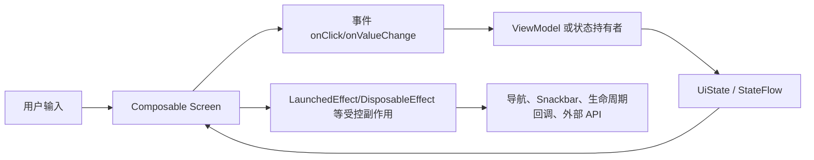
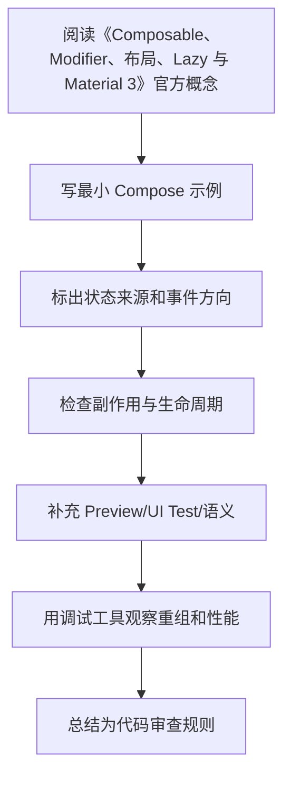

# 05. UI 基础：Composable、Modifier、布局、Lazy 与 Material 3

<!-- lecture-notes:integrated-v2 -->

## 讲义导读：把 Compose 放进声明式 UI 主线

这一章讲的是 **05. UI 基础：Composable、Modifier、布局、Lazy 与 Material 3**。学习 Compose 时不要把它当成“用 Kotlin 写 XML”，而要把它理解成一套声明式 UI 系统：状态变化驱动重组，Composable 描述界面，事件向上流动，副作用被 Effect API 和生命周期约束。

### 一句话先懂

Compose UI 基础不是堆控件，而是用 Composable、Modifier、布局、Lazy 和 Material3 表达可复用、可测试、可访问的界面。

### 通俗类比

Composable 像积木，Modifier 像给积木贴上的尺寸、颜色、点击和语义标签；Lazy 列表像只摆出当前看得到的货架。

类比只是帮助建立直觉，不能替代准确概念。真正写 Compose 时，要回到状态所有权、重组范围、副作用 key、生命周期收集、参数稳定性、语义树、导航状态和版本兼容上。一个页面能显示只是第一步，能在旋转、返回栈、长列表、无障碍、测试和 release 环境下稳定工作才算可靠。

### 本章学习主线

1. **先看状态来源**：状态由谁拥有，是 local state、rememberSaveable、ViewModel、Repository 还是导航参数？
2. **再看重组边界**：哪些状态读取会触发哪些 Composable 重组，参数是否稳定，列表 key 是否可靠？
3. **然后看事件流向**：用户点击、输入、滚动如何上行，ViewModel 如何处理，UiState 如何回到 UI？
4. **接着看副作用**：网络请求、Flow 收集、导航、Snackbar、资源监听是否放在正确 Effect 和生命周期里？
5. **最后看验证**：能否用 Preview、UI Test、Layout Inspector、重组观察、Macrobenchmark 或真机复现和验证？

### 概念怎么学才不容易忘

遇到 Compose API，建议按“它读什么状态 -> 会不会重组 -> 有没有副作用 -> 谁负责保存 -> 如何测试”五步理解。比如 remember 只记住组合内状态，rememberSaveable 处理可保存状态，LaunchedEffect 会随 key 重启，LazyColumn 需要稳定 key，collectAsStateWithLifecycle 负责生命周期感知收集。

### 最小实践任务

做一个卡片列表页面，包含图片、标题、按钮、空态和点击事件，并为关键节点添加测试语义。

实践时要保留错误版本。Compose 很多坑不会直接编译失败，而是表现为重复请求、状态丢失、列表错位、测试找不到节点、重组过多或 TalkBack 读不清。把错误写法、现象、定位工具和修复方式记录下来，比只保存正确代码更有价值。

### 读完本章应该能产出

能使用基础布局、Modifier、LazyColumn、Material3 组件；能理解 Modifier 顺序、slot API、列表 key 和无障碍语义。

> 本节是全篇讲义化改写的阅读入口，后续正文中的定义、步骤、示例和参考资料都应围绕这条学习主线来理解。
最后调研时间：2026-06-13  
主要来源：Android Developers Modifiers、Layouts、Lists、Material 3、Animation 文档。

## 1. Composable 组件设计

推荐组件参数顺序：

```kotlin
@Composable
fun UserCard(
    user: UserUiModel,
    onClick: () -> Unit,
    modifier: Modifier = Modifier,
    enabled: Boolean = true
) {
    Surface(
        onClick = onClick,
        enabled = enabled,
        modifier = modifier
    ) {
        Column(Modifier.padding(16.dp)) {
            Text(user.name, style = MaterialTheme.typography.titleMedium)
            Text(user.email, style = MaterialTheme.typography.bodyMedium)
        }
    }
}
```

约定：

- `modifier` 放在第一个可选参数位置。
- 组件不要内部固定外层尺寸，除非它就是固定尺寸组件。
- 事件用 `onXxx` 命名。
- 状态参数和事件参数成对出现，例如 `checked` + `onCheckedChange`。
- 可复用组件尽量无状态。

## 2. Modifier 的本质

`Modifier` 是不可变链式对象，用来修饰 Composable 的布局、绘制、点击、语义、焦点等行为。

```kotlin
Modifier
    .fillMaxWidth()
    .padding(16.dp)
    .clip(RoundedCornerShape(12.dp))
    .background(MaterialTheme.colorScheme.surfaceVariant)
    .clickable(onClick = onClick)
    .padding(16.dp)
```

顺序非常重要。

上例含义：

1. 宽度填满父级。
2. 外边距 16dp。
3. 裁剪圆角。
4. 绘制背景。
5. 添加点击区域。
6. 内边距 16dp。

如果把 `clickable` 放在最前面，点击区域可能包含外部 padding；如果把 `background` 放在 padding 前后，背景覆盖范围不同。

## 3. Modifier 顺序示例

```kotlin
Text(
    text = "A",
    modifier = Modifier
        .background(Color.Yellow)
        .padding(16.dp)
)
```

背景只包住原始 Text 尺寸，然后 padding 在背景外。

```kotlin
Text(
    text = "A",
    modifier = Modifier
        .padding(16.dp)
        .background(Color.Yellow)
)
```

先扩大布局空间，再给扩大后的区域画背景。

实际经验：

- 尺寸、布局相关通常放前面。
- 语义、点击根据希望的命中区域决定位置。
- 绘制类 Modifier 的位置决定绘制范围。
- `padding` 前后语义不同，不能当普通 CSS margin/padding 简单类比。

## 4. 基础布局

### Column

```kotlin
Column(
    modifier = Modifier.fillMaxSize().padding(16.dp),
    verticalArrangement = Arrangement.spacedBy(12.dp),
    horizontalAlignment = Alignment.CenterHorizontally
) {
    Text("标题")
    Button(onClick = {}) { Text("确定") }
}
```

### Row

```kotlin
Row(
    modifier = Modifier.fillMaxWidth(),
    horizontalArrangement = Arrangement.SpaceBetween,
    verticalAlignment = Alignment.CenterVertically
) {
    Text("用户名")
    IconButton(onClick = {}) {
        Icon(Icons.Default.Edit, contentDescription = "编辑")
    }
}
```

### Box

```kotlin
Box(Modifier.fillMaxSize()) {
    Image(
        painter = painterResource(R.drawable.header),
        contentDescription = null,
        modifier = Modifier.fillMaxWidth()
    )
    Text(
        text = "标题",
        modifier = Modifier.align(Alignment.BottomStart).padding(16.dp)
    )
}
```

`Box` 适合叠放、对齐、浮层。

## 5. 约束与测量

Compose 布局基于约束：

1. 父布局给子布局约束。
2. 子布局在约束内测量自己。
3. 父布局决定子布局位置。

常见尺寸 API：

| API | 作用 |
|---|---|
| `fillMaxWidth()` | 尽量填满最大宽度 |
| `wrapContentSize()` | 根据内容包裹 |
| `size(48.dp)` | 固定宽高 |
| `requiredSize(48.dp)` | 强制尺寸，可能突破约束 |
| `weight(1f)` | Row/Column 中按剩余空间分配 |
| `aspectRatio(16f / 9f)` | 保持宽高比 |
| `heightIn(min, max)` | 限制高度范围 |

`weight` 示例：

```kotlin
Row(Modifier.fillMaxWidth()) {
    Text(
        text = "标题",
        modifier = Modifier.weight(1f)
    )
    IconButton(onClick = {}) {
        Icon(Icons.Default.MoreVert, contentDescription = "更多")
    }
}
```

## 6. Lazy 列表

`LazyColumn` 类似 RecyclerView，只组合和布局可见区域附近的 item。

```kotlin
LazyColumn(
    modifier = Modifier.fillMaxSize(),
    contentPadding = PaddingValues(16.dp),
    verticalArrangement = Arrangement.spacedBy(8.dp)
) {
    items(
        items = articles,
        key = { it.id }
    ) { article ->
        ArticleItem(article = article, onClick = { onArticleClick(article.id) })
    }
}
```

必须重视 `key`：

- 保持 item 身份。
- 避免重排序时状态错位。
- 帮助 Lazy 复用和动画。

内容类型：

```kotlin
items(
    items = messages,
    key = { it.id },
    contentType = { it.type }
) { message ->
    MessageItem(message)
}
```

`contentType` 可以帮助 Lazy 列表更好地复用相同类型布局。

## 7. Lazy 列表状态

```kotlin
@Composable
fun MessageList(messages: List<Message>) {
    val listState = rememberLazyListState()
    val scope = rememberCoroutineScope()

    Box {
        LazyColumn(state = listState) {
            items(messages, key = { it.id }) { message ->
                MessageItem(message)
            }
        }

        FloatingActionButton(
            onClick = {
                scope.launch {
                    listState.animateScrollToItem(0)
                }
            },
            modifier = Modifier.align(Alignment.BottomEnd).padding(16.dp)
        ) {
            Icon(Icons.Default.KeyboardArrowUp, contentDescription = "回到顶部")
        }
    }
}
```

不要把 `rememberLazyListState()` 放进每个 item 中，通常列表级别持有一个。

## 8. Scaffold

`Scaffold` 提供 Material 页面基础结构：

```kotlin
@OptIn(ExperimentalMaterial3Api::class)
@Composable
fun HomeScreen() {
    val snackbarHostState = remember { SnackbarHostState() }

    Scaffold(
        topBar = {
            TopAppBar(title = { Text("首页") })
        },
        floatingActionButton = {
            FloatingActionButton(onClick = {}) {
                Icon(Icons.Default.Add, contentDescription = "新增")
            }
        },
        snackbarHost = {
            SnackbarHost(snackbarHostState)
        }
    ) { innerPadding ->
        HomeContent(
            modifier = Modifier.padding(innerPadding)
        )
    }
}
```

注意：必须处理 `innerPadding`，否则内容可能被 top bar 或 bottom bar 遮挡。

## 9. Material 3 主题

主题通常包含：

- ColorScheme。
- Typography。
- Shapes。
- 动态颜色。
- 暗色模式。

```kotlin
@Composable
fun AppTheme(
    darkTheme: Boolean = isSystemInDarkTheme(),
    content: @Composable () -> Unit
) {
    val colorScheme = if (darkTheme) {
        darkColorScheme()
    } else {
        lightColorScheme()
    }

    MaterialTheme(
        colorScheme = colorScheme,
        typography = AppTypography,
        shapes = AppShapes,
        content = content
    )
}
```

使用主题值：

```kotlin
Text(
    text = "标题",
    color = MaterialTheme.colorScheme.onSurface,
    style = MaterialTheme.typography.titleLarge
)
```

不要在业务页面到处硬编码颜色、字号。可复用 UI 应从 `MaterialTheme` 或自定义 design token 读取。

## 10. CompositionLocal

`CompositionLocal` 用于向子树隐式提供值，例如主题、权限、当前用户显示策略等。

```kotlin
val LocalSpacing = staticCompositionLocalOf {
    Spacing()
}

data class Spacing(
    val small: Dp = 8.dp,
    val medium: Dp = 16.dp,
    val large: Dp = 24.dp
)

@Composable
fun AppTheme(content: @Composable () -> Unit) {
    CompositionLocalProvider(LocalSpacing provides Spacing()) {
        MaterialTheme(content = content)
    }
}
```

使用：

```kotlin
val spacing = LocalSpacing.current
Column(Modifier.padding(spacing.medium)) { }
```

慎用：

- 不要用 CompositionLocal 传业务数据。
- 不要隐藏关键依赖，导致组件难测试。
- 更适合全局 UI 环境值。

## 11. 动画基础

状态驱动动画：

```kotlin
val alpha by animateFloatAsState(
    targetValue = if (visible) 1f else 0f,
    label = "alpha"
)

Box(Modifier.graphicsLayer { this.alpha = alpha })
```

显示隐藏：

```kotlin
AnimatedVisibility(visible = expanded) {
    Text("更多内容")
}
```

内容切换：

```kotlin
AnimatedContent(
    targetState = count,
    label = "count"
) { targetCount ->
    Text("Count: $targetCount")
}
```

原则：

- 动画目标由状态决定。
- 不要在 Composable 函数体中手写无限循环动画，使用 Effect 或动画 API。
- 列表大量 item 同时动画要谨慎测量性能。

## 12. 图片加载

Compose 官方基础库提供 Image，但网络图片通常使用第三方库，例如 Coil。

```kotlin
AsyncImage(
    model = imageUrl,
    contentDescription = title,
    contentScale = ContentScale.Crop,
    modifier = Modifier
        .fillMaxWidth()
        .aspectRatio(16f / 9f)
)
```

注意：

- 列表图片要给稳定尺寸，避免加载完成后布局跳动。
- `contentDescription` 根据语义决定，装饰图传 `null`。
- 大图、圆角、阴影、模糊会增加绘制成本。

## 13. 组件 API 设计清单

- 是否暴露 `modifier`。
- 是否可预览。
- 是否无状态。
- 是否使用主题颜色和字体。
- 点击区域是否至少 48dp。
- 文本是否考虑长文案、换行、省略。
- 图片是否有尺寸约束。
- 列表 item 是否有 stable key。
- `contentDescription` 是否正确。
- 是否把业务逻辑挤进 UI 组件。

## 14. 响应式布局与窗口尺寸

Compose 页面不要只按一台手机尺寸设计。常见适配维度：

- 手机竖屏。
- 手机横屏。
- 折叠屏。
- 平板。
- 桌面模式或大屏。

简单策略：

| 场景 | 建议 |
|---|---|
| 窄屏 | 单列布局，底部导航或顶部栏 |
| 中等宽度 | 内容限制最大宽度，避免拉得太散 |
| 宽屏 | 列表 + 详情双栏、NavigationRail |
| 大字体 | 避免固定高度，允许换行 |

示意：

```kotlin
@Composable
fun ArticleAdaptiveScreen(
    compact: Boolean,
    list: @Composable () -> Unit,
    detail: @Composable () -> Unit
) {
    if (compact) {
        list()
    } else {
        Row(Modifier.fillMaxSize()) {
            Box(Modifier.weight(1f)) { list() }
            VerticalDivider()
            Box(Modifier.weight(2f)) { detail() }
        }
    }
}
```

实际项目可以结合 Window Size Class 或自定义断点，把“选择什么布局”的逻辑放在页面上层，不要散落在每个小组件里。

## 15. 输入法、焦点与键盘动作

表单页常见交互：

```kotlin
@Composable
fun LoginForm(
    username: String,
    password: String,
    onUsernameChange: (String) -> Unit,
    onPasswordChange: (String) -> Unit,
    onSubmit: () -> Unit
) {
    val passwordFocusRequester = remember { FocusRequester() }
    val keyboardController = LocalSoftwareKeyboardController.current

    Column {
        TextField(
            value = username,
            onValueChange = onUsernameChange,
            singleLine = true,
            keyboardOptions = KeyboardOptions(imeAction = ImeAction.Next),
            keyboardActions = KeyboardActions(
                onNext = { passwordFocusRequester.requestFocus() }
            )
        )

        TextField(
            value = password,
            onValueChange = onPasswordChange,
            singleLine = true,
            keyboardOptions = KeyboardOptions(imeAction = ImeAction.Done),
            keyboardActions = KeyboardActions(
                onDone = {
                    keyboardController?.hide()
                    onSubmit()
                }
            ),
            modifier = Modifier.focusRequester(passwordFocusRequester)
        )
    }
}
```

注意：

- `FocusRequester` 要 `remember`。
- 键盘动作只负责 UI 交互，提交校验仍应进 ViewModel。
- 输入框不要固定太小高度，支持错误文案和大字体。

## 16. Preview 组织方式

Preview 不是测试，但能提高组件开发效率。

```kotlin
@Preview(name = "Light")
@Preview(name = "Dark", uiMode = Configuration.UI_MODE_NIGHT_YES)
@Composable
private fun UserCardPreview() {
    AppTheme {
        UserCard(
            user = UserUiModel(
                id = "1",
                name = "Ada Lovelace",
                email = "ada@example.com"
            ),
            onClick = {}
        )
    }
}
```

建议：

- Preview 面向 `Screen` 和可复用组件，不直接预览依赖真实 ViewModel 的 `Route`。
- 准备一组 fake UI state：loading、empty、content、error、long text。
- 预览深色模式、大字体、窄屏/宽屏。
- 不在 Preview 中访问网络、数据库、真实 DI 容器。

---

## 万字精讲扩展（2026-06-16 更新）
> Last researched: 2026-06-16。本文补充内容以 Jetpack Compose 官方文档和 Android Developers 实践资料为主；涉及 Compose Compiler、Kotlin、Navigation、Material3、Lifecycle、Performance 的版本细节，应在真实项目中继续核对最新官方 release notes。

### 本章在 Compose 学习路线中的位置

《Composable、Modifier、布局、Lazy 与 Material 3》是 Compose 能力闭环中的一个节点。Compose 学习不能只停留在静态页面，还要覆盖状态、事件、副作用、生命周期、导航、性能、测试、无障碍和 View 互操作。一个 composable 写出来能显示，只说明第一步完成；它能在重组、旋转、返回栈恢复、无障碍服务、release 构建、长列表和低端设备上稳定工作，才说明写法可靠。

本章学习完成后，建议至少达到三个标准。第一，能用 Compose 心智模型解释本章 API 的作用和边界。第二，能写出最小可运行例子，并指出状态来源、事件方向和副作用生命周期。第三，能制造一个常见错误并用工具或测试验证修复效果。Compose 是声明式 UI，但工程质量仍然依赖清晰边界和可验证实践。

### UI 基础类笔记的精讲重点

Composable 组件设计要关注参数、状态、事件、Modifier、语义和主题。可复用组件应尽量无状态，接收 value 和事件回调；业务页面可以组合状态和事件；Modifier 应作为参数传入并优先应用到根节点；颜色、字体、形状应来自 MaterialTheme 或设计系统；文本、按钮、图标和自定义组件要有可访问语义。

Modifier 顺序非常重要，因为它是一个有序链。padding、background、clickable、size、clip、semantics 的顺序不同会改变点击区域、绘制区域和语义范围。Lazy 列表要使用稳定 key，避免 item 状态错位；复杂列表要注意 contentType、分页、图片加载、滚动状态和 item 级状态读取。

### Compose 的核心心智模型：UI 是状态的函数，但函数必须足够纯

Compose 最重要的转变不是“用 Kotlin 写 UI”，而是把 UI 看成状态的描述。一个 composable 根据输入参数和读取到的状态描述界面，状态变化后框架触发重组，重新执行需要更新的 composable。这个模型要求 composable 尽量幂等、快速、无副作用。官方 Thinking in Compose 文档特别强调，重组可能频繁发生，也可能被跳过或取消，因此不要在 composable 主体里直接执行网络请求、导航、写数据库、启动协程或修改外部对象。需要副作用时，要使用受 Compose 生命周期管理的 Effect API。

学习 Compose 要同时区分三件事：composition、recomposition 和 drawing/layout。Composition 是把 composable 调用组织成 UI 树的过程；recomposition 是状态变化后重新执行部分 composable；layout/draw 是测量、摆放和绘制阶段。性能问题不一定来自重组，可能来自布局太复杂、绘制太重、列表 item 没有 key、状态读取范围太宽、参数不稳定、图片加载或主线程阻塞。只把“少重组”当成唯一目标，会误判很多问题。

### 状态、事件、副作用的单向流



Figure: Compose 单向数据流和副作用边界，综合 Android 官方 State、State Hoisting、Side-effects、Lifecycle in Compose 文档整理。

这个图的关键是方向。UI 读取状态并发出事件，状态持有者处理事件并产生新状态，UI 根据新状态重组。副作用不应该散落在 composable 主体里，而要放在能够表达启动、取消、更新和清理时机的 Effect API 中。导航、Snackbar、权限请求、监听器注册、Flow 收集、动画启动、外部 View 生命周期绑定，都属于需要明确边界的动作。

### Compose 学习必须建立版本意识

Compose 与 Kotlin、Compose Compiler、Android Gradle Plugin、Material3、Navigation、Lifecycle、Activity Compose 等库存在版本关系。Kotlin 2.0 之后 Compose Compiler 移入 Kotlin 仓库，旧项目仍可能遇到 compiler extension 与 Kotlin 版本不匹配的问题。学习笔记里不要只写“加某个依赖”，还要写 BOM、Kotlin 插件、Compose Compiler、Navigation 版本、Lifecycle Compose 版本以及是否使用类型安全导航、强跳过模式等条件。遇到构建错误时，优先查官方兼容表和 release notes。

### 最小可验证学习法

每个 Compose 主题都应该写一个最小验证例子。学习状态时，写一个文本输入、筛选列表或展开面板；学习副作用时，写 Snackbar、定时器、生命周期监听或 Flow 收集；学习 Lazy 列表时，写稳定 key、滚动位置、分页占位和 item 状态；学习性能时，写一个会过度重组的例子，再用状态拆分、remember、derivedStateOf 或稳定参数修正；学习测试时，用 semantics 查找节点并验证状态变化。只有能制造错误并修复，才算真正理解。

### 核心知识点逐条精讲

#### 1. 组件 API 设计

在《Composable、Modifier、布局、Lazy 与 Material 3》中，`组件 API 设计` 不应该只理解成一个 API 名称，而要放进 Compose 的组合、重组、状态和副作用模型里看。学习时先问：它读取什么状态，谁拥有这些状态，变化后会让哪些 composable 重组，是否需要保存到配置变化后，是否会触发外部副作用，是否会影响测试语义或无障碍。能回答这些问题，才说明你真正按 Compose 的方式思考。

实现 ` 组件 API 设计 ` 时，建议先写一个最小 demo，再写一个错误版本。比如状态提升可以写“子组件内部 remember 导致外部无法控制”的错误例子；LaunchedEffect 可以写“key 变化导致重复请求”的错误例子；Lazy key 可以写“插入 item 后状态错位”的错误例子；Navigation 可以写“传复杂对象导致恢复困难”的错误例子。制造错误比只看正确代码更能建立边界感。

代码审查时要把 ` 组件 API 设计 ` 转成检查项：状态是否单一来源，参数是否稳定，Modifier 是否作为参数传入，副作用是否有正确 key 和清理逻辑，Flow 是否生命周期感知收集，Lazy item 是否有稳定 key，语义是否可测试且可访问，release 构建和性能工具是否验证过。Compose 项目的质量通常取决于这些细节是否一致执行。

#### 2. Modifier 顺序

在《Composable、Modifier、布局、Lazy 与 Material 3》中，`Modifier 顺序` 不应该只理解成一个 API 名称，而要放进 Compose 的组合、重组、状态和副作用模型里看。学习时先问：它读取什么状态，谁拥有这些状态，变化后会让哪些 composable 重组，是否需要保存到配置变化后，是否会触发外部副作用，是否会影响测试语义或无障碍。能回答这些问题，才说明你真正按 Compose 的方式思考。

实现 ` Modifier 顺序 ` 时，建议先写一个最小 demo，再写一个错误版本。比如状态提升可以写“子组件内部 remember 导致外部无法控制”的错误例子；LaunchedEffect 可以写“key 变化导致重复请求”的错误例子；Lazy key 可以写“插入 item 后状态错位”的错误例子；Navigation 可以写“传复杂对象导致恢复困难”的错误例子。制造错误比只看正确代码更能建立边界感。

代码审查时要把 ` Modifier 顺序 ` 转成检查项：状态是否单一来源，参数是否稳定，Modifier 是否作为参数传入，副作用是否有正确 key 和清理逻辑，Flow 是否生命周期感知收集，Lazy item 是否有稳定 key，语义是否可测试且可访问，release 构建和性能工具是否验证过。Compose 项目的质量通常取决于这些细节是否一致执行。

#### 3. 布局与约束

在《Composable、Modifier、布局、Lazy 与 Material 3》中，`布局与约束` 不应该只理解成一个 API 名称，而要放进 Compose 的组合、重组、状态和副作用模型里看。学习时先问：它读取什么状态，谁拥有这些状态，变化后会让哪些 composable 重组，是否需要保存到配置变化后，是否会触发外部副作用，是否会影响测试语义或无障碍。能回答这些问题，才说明你真正按 Compose 的方式思考。

实现 ` 布局与约束 ` 时，建议先写一个最小 demo，再写一个错误版本。比如状态提升可以写“子组件内部 remember 导致外部无法控制”的错误例子；LaunchedEffect 可以写“key 变化导致重复请求”的错误例子；Lazy key 可以写“插入 item 后状态错位”的错误例子；Navigation 可以写“传复杂对象导致恢复困难”的错误例子。制造错误比只看正确代码更能建立边界感。

代码审查时要把 ` 布局与约束 ` 转成检查项：状态是否单一来源，参数是否稳定，Modifier 是否作为参数传入，副作用是否有正确 key 和清理逻辑，Flow 是否生命周期感知收集，Lazy item 是否有稳定 key，语义是否可测试且可访问，release 构建和性能工具是否验证过。Compose 项目的质量通常取决于这些细节是否一致执行。

#### 4. Lazy 列表

在《Composable、Modifier、布局、Lazy 与 Material 3》中，`Lazy 列表` 不应该只理解成一个 API 名称，而要放进 Compose 的组合、重组、状态和副作用模型里看。学习时先问：它读取什么状态，谁拥有这些状态，变化后会让哪些 composable 重组，是否需要保存到配置变化后，是否会触发外部副作用，是否会影响测试语义或无障碍。能回答这些问题，才说明你真正按 Compose 的方式思考。

实现 ` Lazy 列表 ` 时，建议先写一个最小 demo，再写一个错误版本。比如状态提升可以写“子组件内部 remember 导致外部无法控制”的错误例子；LaunchedEffect 可以写“key 变化导致重复请求”的错误例子；Lazy key 可以写“插入 item 后状态错位”的错误例子；Navigation 可以写“传复杂对象导致恢复困难”的错误例子。制造错误比只看正确代码更能建立边界感。

代码审查时要把 ` Lazy 列表 ` 转成检查项：状态是否单一来源，参数是否稳定，Modifier 是否作为参数传入，副作用是否有正确 key 和清理逻辑，Flow 是否生命周期感知收集，Lazy item 是否有稳定 key，语义是否可测试且可访问，release 构建和性能工具是否验证过。Compose 项目的质量通常取决于这些细节是否一致执行。

#### 5. Material3、主题和 CompositionLocal

在《Composable、Modifier、布局、Lazy 与 Material 3》中，`Material3、主题和 CompositionLocal` 不应该只理解成一个 API 名称，而要放进 Compose 的组合、重组、状态和副作用模型里看。学习时先问：它读取什么状态，谁拥有这些状态，变化后会让哪些 composable 重组，是否需要保存到配置变化后，是否会触发外部副作用，是否会影响测试语义或无障碍。能回答这些问题，才说明你真正按 Compose 的方式思考。

实现 ` Material3、主题和 CompositionLocal ` 时，建议先写一个最小 demo，再写一个错误版本。比如状态提升可以写“子组件内部 remember 导致外部无法控制”的错误例子；LaunchedEffect 可以写“key 变化导致重复请求”的错误例子；Lazy key 可以写“插入 item 后状态错位”的错误例子；Navigation 可以写“传复杂对象导致恢复困难”的错误例子。制造错误比只看正确代码更能建立边界感。

代码审查时要把 ` Material3、主题和 CompositionLocal ` 转成检查项：状态是否单一来源，参数是否稳定，Modifier 是否作为参数传入，副作用是否有正确 key 和清理逻辑，Flow 是否生命周期感知收集，Lazy item 是否有稳定 key，语义是否可测试且可访问，release 构建和性能工具是否验证过。Compose 项目的质量通常取决于这些细节是否一致执行。


### 场景化学习与排错表

| 主题 | 推荐动作 | 常见风险 | 验证方式 |
| :--- | :--- | :--- | :--- |
| 组件 API 设计 | 用最小 demo 验证正确写法和错误写法，再放入完整页面 | 重组重复执行、副作用 key 错、状态源重复、稳定性误判、测试语义缺失 | Preview、Compose UI Test、Layout Inspector、重组计数、Macrobenchmark、真机验证 |
| Modifier 顺序 | 用最小 demo 验证正确写法和错误写法，再放入完整页面 | 重组重复执行、副作用 key 错、状态源重复、稳定性误判、测试语义缺失 | Preview、Compose UI Test、Layout Inspector、重组计数、Macrobenchmark、真机验证 |
| 布局与约束 | 用最小 demo 验证正确写法和错误写法，再放入完整页面 | 重组重复执行、副作用 key 错、状态源重复、稳定性误判、测试语义缺失 | Preview、Compose UI Test、Layout Inspector、重组计数、Macrobenchmark、真机验证 |
| Lazy 列表 | 用最小 demo 验证正确写法和错误写法，再放入完整页面 | 重组重复执行、副作用 key 错、状态源重复、稳定性误判、测试语义缺失 | Preview、Compose UI Test、Layout Inspector、重组计数、Macrobenchmark、真机验证 |
| Material3、主题和 CompositionLocal | 用最小 demo 验证正确写法和错误写法，再放入完整页面 | 重组重复执行、副作用 key 错、状态源重复、稳定性误判、测试语义缺失 | Preview、Compose UI Test、Layout Inspector、重组计数、Macrobenchmark、真机验证 |

这个表的重点是“能复现、能观察、能修复”。Compose 很多问题不会编译报错，而是表现为重组过多、状态丢失、事件重复、列表错位、TalkBack 读不清、测试找不到节点或某些机型上卡顿。只有建立可观察的验证方法，才能避免靠经验猜。

### 本章建议工作流



Figure: 《Composable、Modifier、布局、Lazy 与 Material 3》学习工作流，综合 Android 官方 Compose mental model、state、side-effects、performance、accessibility 和 testing 资料整理。

这个流程适合所有 Compose 主题。先理解概念，再落到小例子，再放回真实页面，再用测试和工具验证。不要在没有状态图的情况下写复杂 UI，也不要在没有测量的情况下做性能优化。

### 常见误区和纠正方法

- 误区：在 composable 主体里执行副作用。纠正：网络、导航、Snackbar、注册监听器、启动协程等动作应放入合适 Effect API 或 ViewModel 事件处理中。
- 误区：所有状态都放 ViewModel。纠正：纯 UI 元素状态可以靠近使用处，屏幕级和业务相关状态再提升到 ViewModel。
- 误区：所有地方都加 remember。纠正：remember 是保存计算或对象的工具，不是性能万能药；先测量，再判断是否需要。
- 误区：Lazy 列表不写 key。纠正：可变列表、插入删除、分页和 item 内状态都应使用稳定 key，避免状态错位。
- 误区：测试只靠 testTag。纠正：优先设计有意义的语义，testTag 作为补充；无障碍和测试都依赖语义质量。
- 误区：忽略版本兼容。纠正：Compose Compiler、Kotlin、BOM、Material3、Navigation 和 Lifecycle Compose 都要按官方版本说明维护。

### 与相邻章节的关系

《Composable、Modifier、布局、Lazy 与 Material 3》应与状态、副作用、架构、性能和测试章节交叉阅读。状态决定重组，副作用决定外部动作是否可控，架构决定状态和事件放在哪里，性能决定重组和布局是否可接受，测试和无障碍决定 UI 是否能被可靠验证和使用。任何一个章节单独学习都不够，最终要在一个完整页面中串起来。

### 实操训练和复盘模板

1. 围绕 `组件 API 设计` 写一个最小页面：包含正确实现、故意错误实现、观察结果和修复总结。
2. 围绕 `Modifier 顺序` 写一个最小页面：包含正确实现、故意错误实现、观察结果和修复总结。
3. 围绕 `布局与约束` 写一个最小页面：包含正确实现、故意错误实现、观察结果和修复总结。
4. 围绕 `Lazy 列表` 写一个最小页面：包含正确实现、故意错误实现、观察结果和修复总结。
5. 围绕 `Material3、主题和 CompositionLocal` 写一个最小页面：包含正确实现、故意错误实现、观察结果和修复总结。

建议每个 Compose 练习都记录：

```text
练习名称：
本章主题：Composable、Modifier、布局、Lazy 与 Material 3
Compose / Kotlin / AGP / BOM 版本：
状态来源：local state / rememberSaveable / ViewModel / Repository
事件流向：UI -> ViewModel / state holder -> UiState -> UI
副作用：Effect API、key、取消和清理逻辑
测试入口：semantics、testTag、Preview、UI Test
性能观察：重组范围、Lazy key、稳定性、主线程耗时
失败场景：旋转、返回栈恢复、快速点击、断网、长列表、字体放大、TalkBack
结论：以后项目中采用的规则
```

这个模板的意义是把 Compose 学习从“API 记忆”推进到“页面质量”。真实项目中的 Compose 问题通常跨越状态、生命周期、导航、性能和无障碍，复盘时必须把这些因素放在一起看。

## 参考资料与延伸阅读

- [Official / Android] Jetpack Compose documentation: https://developer.android.com/develop/ui/compose
- [Official / Android] Thinking in Compose: https://developer.android.com/develop/ui/compose/mental-model
- [Official / Android] State and Jetpack Compose: https://developer.android.com/develop/ui/compose/state
- [Official / Android] Where to hoist state: https://developer.android.com/develop/ui/compose/state-hoisting
- [Official / Android] Side-effects in Compose: https://developer.android.com/develop/ui/compose/side-effects
- [Official / Android] Lifecycle in Jetpack Compose: https://developer.android.com/topic/libraries/architecture/lifecycle
- [Official / Android] Lazy lists and lazy grids: https://developer.android.com/develop/ui/compose/lists
- [Official / Android] Compose performance: https://developer.android.com/develop/ui/compose/performance
- [Official / Android] Stability in Compose: https://developer.android.com/develop/ui/compose/performance/stability
- [Official / Android] Strong skipping mode: https://developer.android.com/develop/ui/compose/performance/stability/strongskipping
- [Official / Android] Accessibility in Jetpack Compose: https://developer.android.com/develop/ui/compose/accessibility
- [Official / Android] Semantics in Compose: https://developer.android.com/develop/ui/compose/accessibility/semantics
- [Official / Android] Type safety in Navigation Compose: https://developer.android.com/guide/navigation/design/type-safety
- [Official / Android] Compose to Kotlin Compatibility Map: https://developer.android.com/jetpack/androidx/releases/compose-kotlin
- [Official / Android] Compose Compiler release notes: https://developer.android.com/jetpack/androidx/releases/compose-compiler
- [Official / Android Developers Blog] Jetpack Compose compiler moving to the Kotlin repository: https://android-developers.googleblog.com/2024/04/jetpack-compose-compiler-moving-to-kotlin-repository.html
- [Official / Android Developers Blog] What's New in Jetpack Compose: https://android-developers.googleblog.com/2025/05/whats-new-in-jetpack-compose.html
- [Official / Android Developers Blog] Strong Skipping Mode Explained: https://medium.com/androiddevelopers/jetpack-compose-strong-skipping-mode-explained-cbdb2aa4b900
- [Official / Android Developers Blog] Fundamentals of Compose layouts and modifiers: https://medium.com/androiddevelopers/fundamentals-of-compose-layouts-and-modifiers-64d794664b66
- [Official / Android Developers Blog] Consuming flows safely in Jetpack Compose: https://medium.com/androiddevelopers/consuming-flows-safely-in-jetpack-compose-cde014d0d5a3
- [Official / Android Developers Blog] Navigation Compose meet Type Safety: https://medium.com/androiddevelopers/navigation-compose-meet-type-safety-e081fb3cf2f8
- [Community / CSDN] Jetpack Compose 学习笔记检索入口: https://so.csdn.net/so/search?q=Jetpack%20Compose%20%E5%AD%A6%E4%B9%A0%E7%AC%94%E8%AE%B0
- [Community / 博客园] Compose 状态与副作用实践检索入口: https://zzk.cnblogs.com/s/blogpost?Keywords=Jetpack%20Compose%20%E7%8A%B6%E6%80%81%20%E5%89%AF%E4%BD%9C%E7%94%A8
- [Community / 掘金] Compose 性能、导航、架构实践检索入口: https://juejin.cn/search?query=Jetpack%20Compose%20%E6%80%A7%E8%83%BD%20%E5%AF%BC%E8%88%AA%20%E6%9E%B6%E6%9E%84&type=0

<!-- AUTO_EXPANDED_TO_REFERENCE_LENGTH_2026_06_23 -->

## 万字精讲扩展：UI 基础

> 本节为按参考笔记篇幅补充的系统化扩展内容，目标是把原有笔记从“知识点记录”扩展为“概念、原理、流程、工程实践、常见误区和复盘清单”完整学习材料。

### 精讲扩展 1：UI 基础 的生命周期、状态管理 与工程化理解

学习 $topic 时，不能只把它当成一个孤立知识点来背诵，而要把它放到 $category 的完整问题链条里理解。一个知识点通常同时包含概念定义、适用边界、输入输出、运行过程、常见异常和工程取舍。真正掌握它，意味着看到一个具体场景时，能够判断它解决什么问题、依赖哪些前提、失败时会出现什么现象，以及应该用什么手段验证自己的判断。

从 $a 的角度看，最重要的是先建立清晰的对象模型。也就是明确系统里有哪些参与者、它们之间如何连接、数据或控制信号如何流动、哪些环节是同步的、哪些环节是异步的、哪些状态是临时状态、哪些状态需要长期保存。很多初学问题并不是公式不会、API 不熟，而是对象边界不清：把配置当成状态，把结果当成过程，把局部现象当成全局规律。写笔记时建议始终追问：这个概念的主体是谁，输入是什么，输出是什么，中间约束是什么，错误会在哪里暴露。

从 $b 的角度看，流程比单点知识更关键。一个成熟方案通常不是单个技巧，而是一组步骤：先确定目标，再拆分约束，然后选择工具，最后通过测试和复盘确认效果。比如在实际项目中，不能只问“怎么实现”，还要问“为什么要这样实现”“有没有更简单的替代方案”“边界条件是什么”“数据量、并发量、实时性、可靠性变化后还能不能工作”。这种流程意识能够避免把学习停留在教程层面，也能让后续排错有明确路线。

$topic 的 $c 往往决定它在真实项目中的稳定性。理论上可行的方案，到了工程环境中会受到数据质量、硬件条件、依赖版本、网络环境、团队协作、部署方式和维护成本影响。写代码或做设计时，应该把正常路径和异常路径同时考虑：正常情况下如何运行，输入为空怎么办，超时怎么办，重复执行怎么办，部分成功怎么办，版本升级后兼容性怎么办，日志和指标如何证明系统确实按预期工作。

进一步看 $d，它通常对应性能、可靠性或可维护性的核心矛盾。很多技术选择并没有绝对正确答案，只有是否适合当前约束。例如追求极致性能可能牺牲可读性，追求高度抽象可能增加调试成本，追求快速交付可能留下技术债，追求完全通用可能让简单场景变复杂。高质量笔记应该把这些取舍写出来，而不是只给一个“推荐方案”。推荐方案背后的条件越清楚，迁移到新场景时越不容易误用。

最后从 $e 的角度进行复盘，可以把知识从“看懂”推进到“会用”。建议为 $topic 建立三个层次的检查：第一层是概念检查，确认术语、流程和边界没有混淆；第二层是实践检查，确认能够独立完成一个最小案例；第三层是工程检查，确认这个案例在异常、规模、性能和维护方面经得起追问。每次学习完一个章节，都可以用这三层检查反向补齐笔记。

#### 典型场景拆解

在真实场景中，$topic 通常会经历“需求出现、方案选择、实现落地、问题暴露、持续优化”几个阶段。需求出现时，要先判断这个需求属于基础能力、性能优化、体验改进、可靠性建设还是长期架构演进。不同类型的需求对方案的评价标准不同：基础能力看正确性，性能优化看指标，体验改进看路径是否顺滑，可靠性建设看故障时能否降级和恢复，架构演进看未来变化是否容易吸收。

方案选择阶段，最容易犯的错误是直接套用熟悉工具。更稳妥的方式是列出约束：数据规模、时延要求、资源预算、团队熟悉度、运维能力、安全要求、可测试性和长期维护成本。只有把约束列清楚，才能解释为什么选择当前方案。否则方案看似高级，实际可能只是增加了复杂度。

实现落地阶段，要把 $a 和 $b 拆成可验证的小步骤。每一步都应该有明确的输入、输出和检查方式。对学习笔记而言，这意味着不能只有大段概念，还应该补充流程图式的文字描述、伪代码、命令示例、参数解释、错误现象和排查路径。这样以后复习时，笔记不仅能帮助理解，也能直接指导实践。

问题暴露阶段，要优先区分“理解错误、实现错误、环境错误、数据错误、依赖错误、边界条件错误”。很多复杂问题之所以难排，是因为一开始就把问题归因到错误层级。例如把配置问题当成算法问题，把权限问题当成代码问题，把数据分布变化当成模型失效，把硬件噪声当成软件逻辑错误。好的排查顺序应该从可观测事实开始，而不是从猜测开始。

持续优化阶段，不应只追求把当前问题压下去，还要沉淀成规则。比如记录触发条件、影响范围、定位方法、最终修复、预防措施和可监控指标。这样下一次出现类似问题时，团队可以复用经验，而不是重新从零排查。

#### 常见误区与纠偏

第一个误区是只记结论，不记前提。$topic 中很多结论都是有条件的：适用于小规模，不一定适用于大规模；适用于离线处理，不一定适用于实时系统；适用于单机环境，不一定适用于分布式环境；适用于教学案例，不一定适用于生产项目。纠偏方法是在每个重要结论后面补一句“适用条件”和“不适用情况”。

第二个误区是只关注工具，不关注模型。工具会变化，模型更稳定。无论工具名称如何变化，底层仍然要解决输入建模、状态管理、资源调度、错误恢复、性能约束和质量验证这些问题。学习 $topic 时，应该把工具用法和底层模型分开记录：工具命令解决“怎么做”，底层模型解释“为什么这样做”。

第三个误区是没有验证意识。很多笔记写得很完整，但没有说明如何确认自己做对了。对于 $category 相关主题，验证至少应包含最小样例、边界样例、异常样例和性能样例。最小样例证明流程跑通，边界样例证明理解完整，异常样例证明系统可恢复，性能样例证明方案在目标规模下仍然可用。

第四个误区是忽略可维护性。短期学习时，能跑通就容易产生掌握的错觉；长期使用时，命名、分层、注释、测试、日志、版本管理和文档才会决定知识能否转化为稳定能力。扩充 $topic 笔记时，应把“如何写得清楚、如何排查、如何交接、如何复盘”也纳入内容。

#### 学习与实践建议

建议围绕 $topic 做一个小型闭环练习：先用自己的话解释概念，再画出流程，再实现一个最小案例，然后主动制造一个错误并排查，最后写下复盘。这个过程看起来比直接读资料慢，但能显著提高迁移能力。很多人学完后不会用，根本原因是缺少“从概念到问题再到验证”的闭环。

复习时可以使用四个问题：它解决什么问题；它依赖什么条件；它失败时有什么表现；它如何被验证。只要这四个问题能回答清楚，说明对 $topic 的理解已经从表层进入工程层。如果回答不清楚，就回到对应章节补充例子、边界和排错方法。
### 精讲扩展 2：UI 基础 的状态管理、单向数据流 与工程化理解

学习 $topic 时，不能只把它当成一个孤立知识点来背诵，而要把它放到 $category 的完整问题链条里理解。一个知识点通常同时包含概念定义、适用边界、输入输出、运行过程、常见异常和工程取舍。真正掌握它，意味着看到一个具体场景时，能够判断它解决什么问题、依赖哪些前提、失败时会出现什么现象，以及应该用什么手段验证自己的判断。

从 $a 的角度看，最重要的是先建立清晰的对象模型。也就是明确系统里有哪些参与者、它们之间如何连接、数据或控制信号如何流动、哪些环节是同步的、哪些环节是异步的、哪些状态是临时状态、哪些状态需要长期保存。很多初学问题并不是公式不会、API 不熟，而是对象边界不清：把配置当成状态，把结果当成过程，把局部现象当成全局规律。写笔记时建议始终追问：这个概念的主体是谁，输入是什么，输出是什么，中间约束是什么，错误会在哪里暴露。

从 $b 的角度看，流程比单点知识更关键。一个成熟方案通常不是单个技巧，而是一组步骤：先确定目标，再拆分约束，然后选择工具，最后通过测试和复盘确认效果。比如在实际项目中，不能只问“怎么实现”，还要问“为什么要这样实现”“有没有更简单的替代方案”“边界条件是什么”“数据量、并发量、实时性、可靠性变化后还能不能工作”。这种流程意识能够避免把学习停留在教程层面，也能让后续排错有明确路线。

$topic 的 $c 往往决定它在真实项目中的稳定性。理论上可行的方案，到了工程环境中会受到数据质量、硬件条件、依赖版本、网络环境、团队协作、部署方式和维护成本影响。写代码或做设计时，应该把正常路径和异常路径同时考虑：正常情况下如何运行，输入为空怎么办，超时怎么办，重复执行怎么办，部分成功怎么办，版本升级后兼容性怎么办，日志和指标如何证明系统确实按预期工作。

进一步看 $d，它通常对应性能、可靠性或可维护性的核心矛盾。很多技术选择并没有绝对正确答案，只有是否适合当前约束。例如追求极致性能可能牺牲可读性，追求高度抽象可能增加调试成本，追求快速交付可能留下技术债，追求完全通用可能让简单场景变复杂。高质量笔记应该把这些取舍写出来，而不是只给一个“推荐方案”。推荐方案背后的条件越清楚，迁移到新场景时越不容易误用。

最后从 $e 的角度进行复盘，可以把知识从“看懂”推进到“会用”。建议为 $topic 建立三个层次的检查：第一层是概念检查，确认术语、流程和边界没有混淆；第二层是实践检查，确认能够独立完成一个最小案例；第三层是工程检查，确认这个案例在异常、规模、性能和维护方面经得起追问。每次学习完一个章节，都可以用这三层检查反向补齐笔记。

#### 典型场景拆解

在真实场景中，$topic 通常会经历“需求出现、方案选择、实现落地、问题暴露、持续优化”几个阶段。需求出现时，要先判断这个需求属于基础能力、性能优化、体验改进、可靠性建设还是长期架构演进。不同类型的需求对方案的评价标准不同：基础能力看正确性，性能优化看指标，体验改进看路径是否顺滑，可靠性建设看故障时能否降级和恢复，架构演进看未来变化是否容易吸收。

方案选择阶段，最容易犯的错误是直接套用熟悉工具。更稳妥的方式是列出约束：数据规模、时延要求、资源预算、团队熟悉度、运维能力、安全要求、可测试性和长期维护成本。只有把约束列清楚，才能解释为什么选择当前方案。否则方案看似高级，实际可能只是增加了复杂度。

实现落地阶段，要把 $a 和 $b 拆成可验证的小步骤。每一步都应该有明确的输入、输出和检查方式。对学习笔记而言，这意味着不能只有大段概念，还应该补充流程图式的文字描述、伪代码、命令示例、参数解释、错误现象和排查路径。这样以后复习时，笔记不仅能帮助理解，也能直接指导实践。

问题暴露阶段，要优先区分“理解错误、实现错误、环境错误、数据错误、依赖错误、边界条件错误”。很多复杂问题之所以难排，是因为一开始就把问题归因到错误层级。例如把配置问题当成算法问题，把权限问题当成代码问题，把数据分布变化当成模型失效，把硬件噪声当成软件逻辑错误。好的排查顺序应该从可观测事实开始，而不是从猜测开始。

持续优化阶段，不应只追求把当前问题压下去，还要沉淀成规则。比如记录触发条件、影响范围、定位方法、最终修复、预防措施和可监控指标。这样下一次出现类似问题时，团队可以复用经验，而不是重新从零排查。

#### 常见误区与纠偏

第一个误区是只记结论，不记前提。$topic 中很多结论都是有条件的：适用于小规模，不一定适用于大规模；适用于离线处理，不一定适用于实时系统；适用于单机环境，不一定适用于分布式环境；适用于教学案例，不一定适用于生产项目。纠偏方法是在每个重要结论后面补一句“适用条件”和“不适用情况”。

第二个误区是只关注工具，不关注模型。工具会变化，模型更稳定。无论工具名称如何变化，底层仍然要解决输入建模、状态管理、资源调度、错误恢复、性能约束和质量验证这些问题。学习 $topic 时，应该把工具用法和底层模型分开记录：工具命令解决“怎么做”，底层模型解释“为什么这样做”。

第三个误区是没有验证意识。很多笔记写得很完整，但没有说明如何确认自己做对了。对于 $category 相关主题，验证至少应包含最小样例、边界样例、异常样例和性能样例。最小样例证明流程跑通，边界样例证明理解完整，异常样例证明系统可恢复，性能样例证明方案在目标规模下仍然可用。

第四个误区是忽略可维护性。短期学习时，能跑通就容易产生掌握的错觉；长期使用时，命名、分层、注释、测试、日志、版本管理和文档才会决定知识能否转化为稳定能力。扩充 $topic 笔记时，应把“如何写得清楚、如何排查、如何交接、如何复盘”也纳入内容。

#### 学习与实践建议

建议围绕 $topic 做一个小型闭环练习：先用自己的话解释概念，再画出流程，再实现一个最小案例，然后主动制造一个错误并排查，最后写下复盘。这个过程看起来比直接读资料慢，但能显著提高迁移能力。很多人学完后不会用，根本原因是缺少“从概念到问题再到验证”的闭环。

复习时可以使用四个问题：它解决什么问题；它依赖什么条件；它失败时有什么表现；它如何被验证。只要这四个问题能回答清楚，说明对 $topic 的理解已经从表层进入工程层。如果回答不清楚，就回到对应章节补充例子、边界和排错方法。
### 精讲扩展 3：UI 基础 的单向数据流、协程 Flow 与工程化理解

学习 $topic 时，不能只把它当成一个孤立知识点来背诵，而要把它放到 $category 的完整问题链条里理解。一个知识点通常同时包含概念定义、适用边界、输入输出、运行过程、常见异常和工程取舍。真正掌握它，意味着看到一个具体场景时，能够判断它解决什么问题、依赖哪些前提、失败时会出现什么现象，以及应该用什么手段验证自己的判断。

从 $a 的角度看，最重要的是先建立清晰的对象模型。也就是明确系统里有哪些参与者、它们之间如何连接、数据或控制信号如何流动、哪些环节是同步的、哪些环节是异步的、哪些状态是临时状态、哪些状态需要长期保存。很多初学问题并不是公式不会、API 不熟，而是对象边界不清：把配置当成状态，把结果当成过程，把局部现象当成全局规律。写笔记时建议始终追问：这个概念的主体是谁，输入是什么，输出是什么，中间约束是什么，错误会在哪里暴露。

从 $b 的角度看，流程比单点知识更关键。一个成熟方案通常不是单个技巧，而是一组步骤：先确定目标，再拆分约束，然后选择工具，最后通过测试和复盘确认效果。比如在实际项目中，不能只问“怎么实现”，还要问“为什么要这样实现”“有没有更简单的替代方案”“边界条件是什么”“数据量、并发量、实时性、可靠性变化后还能不能工作”。这种流程意识能够避免把学习停留在教程层面，也能让后续排错有明确路线。

$topic 的 $c 往往决定它在真实项目中的稳定性。理论上可行的方案，到了工程环境中会受到数据质量、硬件条件、依赖版本、网络环境、团队协作、部署方式和维护成本影响。写代码或做设计时，应该把正常路径和异常路径同时考虑：正常情况下如何运行，输入为空怎么办，超时怎么办，重复执行怎么办，部分成功怎么办，版本升级后兼容性怎么办，日志和指标如何证明系统确实按预期工作。

进一步看 $d，它通常对应性能、可靠性或可维护性的核心矛盾。很多技术选择并没有绝对正确答案，只有是否适合当前约束。例如追求极致性能可能牺牲可读性，追求高度抽象可能增加调试成本，追求快速交付可能留下技术债，追求完全通用可能让简单场景变复杂。高质量笔记应该把这些取舍写出来，而不是只给一个“推荐方案”。推荐方案背后的条件越清楚，迁移到新场景时越不容易误用。

最后从 $e 的角度进行复盘，可以把知识从“看懂”推进到“会用”。建议为 $topic 建立三个层次的检查：第一层是概念检查，确认术语、流程和边界没有混淆；第二层是实践检查，确认能够独立完成一个最小案例；第三层是工程检查，确认这个案例在异常、规模、性能和维护方面经得起追问。每次学习完一个章节，都可以用这三层检查反向补齐笔记。

#### 典型场景拆解

在真实场景中，$topic 通常会经历“需求出现、方案选择、实现落地、问题暴露、持续优化”几个阶段。需求出现时，要先判断这个需求属于基础能力、性能优化、体验改进、可靠性建设还是长期架构演进。不同类型的需求对方案的评价标准不同：基础能力看正确性，性能优化看指标，体验改进看路径是否顺滑，可靠性建设看故障时能否降级和恢复，架构演进看未来变化是否容易吸收。

方案选择阶段，最容易犯的错误是直接套用熟悉工具。更稳妥的方式是列出约束：数据规模、时延要求、资源预算、团队熟悉度、运维能力、安全要求、可测试性和长期维护成本。只有把约束列清楚，才能解释为什么选择当前方案。否则方案看似高级，实际可能只是增加了复杂度。

实现落地阶段，要把 $a 和 $b 拆成可验证的小步骤。每一步都应该有明确的输入、输出和检查方式。对学习笔记而言，这意味着不能只有大段概念，还应该补充流程图式的文字描述、伪代码、命令示例、参数解释、错误现象和排查路径。这样以后复习时，笔记不仅能帮助理解，也能直接指导实践。

问题暴露阶段，要优先区分“理解错误、实现错误、环境错误、数据错误、依赖错误、边界条件错误”。很多复杂问题之所以难排，是因为一开始就把问题归因到错误层级。例如把配置问题当成算法问题，把权限问题当成代码问题，把数据分布变化当成模型失效，把硬件噪声当成软件逻辑错误。好的排查顺序应该从可观测事实开始，而不是从猜测开始。

持续优化阶段，不应只追求把当前问题压下去，还要沉淀成规则。比如记录触发条件、影响范围、定位方法、最终修复、预防措施和可监控指标。这样下一次出现类似问题时，团队可以复用经验，而不是重新从零排查。

#### 常见误区与纠偏

第一个误区是只记结论，不记前提。$topic 中很多结论都是有条件的：适用于小规模，不一定适用于大规模；适用于离线处理，不一定适用于实时系统；适用于单机环境，不一定适用于分布式环境；适用于教学案例，不一定适用于生产项目。纠偏方法是在每个重要结论后面补一句“适用条件”和“不适用情况”。

第二个误区是只关注工具，不关注模型。工具会变化，模型更稳定。无论工具名称如何变化，底层仍然要解决输入建模、状态管理、资源调度、错误恢复、性能约束和质量验证这些问题。学习 $topic 时，应该把工具用法和底层模型分开记录：工具命令解决“怎么做”，底层模型解释“为什么这样做”。

第三个误区是没有验证意识。很多笔记写得很完整，但没有说明如何确认自己做对了。对于 $category 相关主题，验证至少应包含最小样例、边界样例、异常样例和性能样例。最小样例证明流程跑通，边界样例证明理解完整，异常样例证明系统可恢复，性能样例证明方案在目标规模下仍然可用。

第四个误区是忽略可维护性。短期学习时，能跑通就容易产生掌握的错觉；长期使用时，命名、分层、注释、测试、日志、版本管理和文档才会决定知识能否转化为稳定能力。扩充 $topic 笔记时，应把“如何写得清楚、如何排查、如何交接、如何复盘”也纳入内容。

#### 学习与实践建议

建议围绕 $topic 做一个小型闭环练习：先用自己的话解释概念，再画出流程，再实现一个最小案例，然后主动制造一个错误并排查，最后写下复盘。这个过程看起来比直接读资料慢，但能显著提高迁移能力。很多人学完后不会用，根本原因是缺少“从概念到问题再到验证”的闭环。

复习时可以使用四个问题：它解决什么问题；它依赖什么条件；它失败时有什么表现；它如何被验证。只要这四个问题能回答清楚，说明对 $topic 的理解已经从表层进入工程层。如果回答不清楚，就回到对应章节补充例子、边界和排错方法。
## 扩展复盘清单

- 能否用一句话说明本主题解决的问题。
- 能否列出本主题最重要的输入、输出、约束和失败模式。
- 能否独立完成一个最小实践案例，并解释每一步为什么需要。
- 能否设计边界测试、异常测试和性能测试。
- 能否把本主题和所在技术体系中的其他主题连接起来理解。
