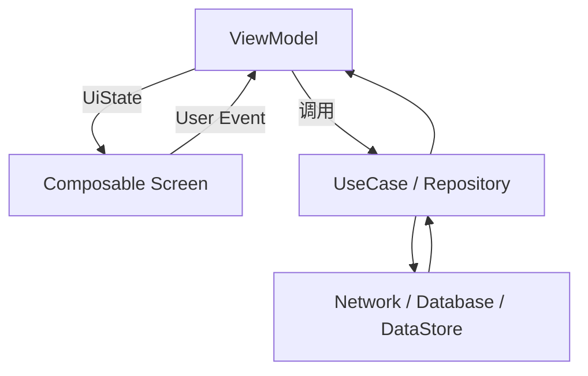
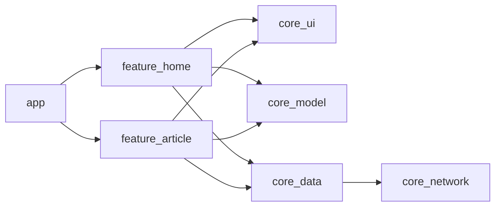

# 06. 架构、导航与单向数据流

最后调研时间：2026-06-13  
主要来源：Android Developers Compose Architecture、Navigation Compose、Save UI state 文档。

## 1. 单向数据流 UDF

Compose 推荐单向数据流：



基本规则：

- 状态向下传递。
- 事件向上传递。
- UI 只描述当前状态。
- ViewModel 处理事件并产出新状态。
- 数据层不依赖 UI。

## 2. 推荐页面结构

```kotlin
@Composable
fun ProductRoute(
    productId: String,
    onBack: () -> Unit,
    viewModel: ProductViewModel = viewModel()
) {
    val uiState by viewModel.uiState.collectAsStateWithLifecycle()

    LaunchedEffect(productId) {
        viewModel.load(productId)
    }

    ProductScreen(
        uiState = uiState,
        onBack = onBack,
        onRetry = viewModel::retry,
        onFavoriteClick = viewModel::toggleFavorite
    )
}

@Composable
fun ProductScreen(
    uiState: ProductUiState,
    onBack: () -> Unit,
    onRetry: () -> Unit,
    onFavoriteClick: () -> Unit
) {
    // 展示 UI
}
```

更理想的方式是让 ViewModel 从 `SavedStateHandle` 读取 `productId`，这样 Route 不必调用 `load(productId)`：

```kotlin
class ProductViewModel(
    savedStateHandle: SavedStateHandle,
    private val repository: ProductRepository
) : ViewModel() {
    private val productId: String = checkNotNull(savedStateHandle["productId"])

    val uiState: StateFlow<ProductUiState> =
        repository.observeProduct(productId)
            .map { ProductUiState.Content(it.toUiModel()) }
            .stateIn(
                scope = viewModelScope,
                started = SharingStarted.WhileSubscribed(5_000),
                initialValue = ProductUiState.Loading
            )
}
```

## 3. UI State 建模

简单页面：

```kotlin
data class ProfileUiState(
    val loading: Boolean = false,
    val user: UserUiModel? = null,
    val errorMessage: String? = null
)
```

复杂页面可以用 sealed interface：

```kotlin
sealed interface ProfileUiState {
    data object Loading : ProfileUiState
    data class Content(val user: UserUiModel) : ProfileUiState
    data class Error(val message: String) : ProfileUiState
}
```

取舍：

| 模型 | 优点 | 缺点 |
|---|---|---|
| data class + flags | 适合页面局部状态多、可组合状态多 | 可能出现非法组合，如 loading=true 且 error!=null |
| sealed state | 状态互斥清晰 | 局部状态多时嵌套复杂 |

经验：

- 列表页常用 data class：`loading`、`refreshing`、`items`、`errorMessage`。
- 详情页常用 sealed：Loading / Content / Error。
- 表单页常用 data class：每个字段、校验状态、提交状态。

## 4. Navigation Compose 基础

传统字符串路由：

```kotlin
@Composable
fun AppNavHost(navController: NavHostController) {
    NavHost(
        navController = navController,
        startDestination = "home"
    ) {
        composable("home") {
            HomeRoute(
                onArticleClick = { articleId ->
                    navController.navigate("article/$articleId")
                }
            )
        }

        composable(
            route = "article/{articleId}",
            arguments = listOf(navArgument("articleId") { type = NavType.StringType })
        ) {
            ArticleRoute(onBack = navController::popBackStack)
        }
    }
}
```

类型安全路由在新版 Navigation Compose 中越来越推荐。思路是用可序列化对象表达目的地和参数，减少手拼字符串错误。具体 API 会随 Navigation 版本变化，应以官方 Navigation Compose 文档为准。

示意：

```kotlin
@Serializable
data object Home

@Serializable
data class ArticleDetail(val articleId: String)
```

完整示意：

```kotlin
@Serializable
data object Home

@Serializable
data class ArticleDetail(val articleId: String)

@Composable
fun AppNavHost(navController: NavHostController) {
    NavHost(
        navController = navController,
        startDestination = Home
    ) {
        composable<Home> {
            HomeRoute(
                onArticleClick = { articleId ->
                    navController.navigate(ArticleDetail(articleId))
                }
            )
        }

        composable<ArticleDetail> { backStackEntry ->
            val route = backStackEntry.toRoute<ArticleDetail>()
            ArticleRoute(
                articleId = route.articleId,
                onBack = navController::popBackStack
            )
        }
    }
}
```

ViewModel 中通过 `SavedStateHandle` 解析：

```kotlin
class ArticleViewModel(
    savedStateHandle: SavedStateHandle,
    repository: ArticleRepository
) : ViewModel() {
    private val route = savedStateHandle.toRoute<ArticleDetail>()
    private val articleId = route.articleId
}
```

类型安全路由的收益：

- 参数名和类型由 Kotlin 编译期约束。
- 减少 `"article/{articleId}"` 和 `"article/$id"` 手拼不一致。
- 深链和参数解析更集中。

仍然要注意：类型安全不等于可以传大对象。导航参数仍应保持小而稳定。

## 5. 导航参数原则

只传最小必要参数：

```kotlin
navController.navigate("article/$articleId")
```

不要传完整对象：

```kotlin
// 不推荐：对象大、序列化复杂、可能过期
navController.navigate(articleObject)
```

目标页面通过 ID 从 Repository 或缓存读取最新数据。

原因：

- 返回栈参数大小有限。
- 对象可能变化，传对象容易显示旧数据。
- 深链、进程恢复、分享链接都更适合 ID。

## 6. 顶层导航与 Bottom Bar

```kotlin
@Composable
fun AppRoot() {
    val navController = rememberNavController()

    Scaffold(
        bottomBar = {
            NavigationBar {
                topLevelDestinations.forEach { destination ->
                    NavigationBarItem(
                        selected = false,
                        onClick = {
                            navController.navigate(destination.route) {
                                popUpTo(navController.graph.findStartDestination().id) {
                                    saveState = true
                                }
                                launchSingleTop = true
                                restoreState = true
                            }
                        },
                        icon = { Icon(destination.icon, contentDescription = null) },
                        label = { Text(destination.label) }
                    )
                }
            }
        }
    ) { padding ->
        NavHost(
            navController = navController,
            startDestination = "home",
            modifier = Modifier.padding(padding)
        ) {
            composable("home") { HomeRoute() }
            composable("settings") { SettingsRoute() }
        }
    }
}
```

关键参数：

- `popUpTo(startDestination)`：切换 tab 时回到每个栈的起点。
- `saveState = true`：保存被弹出目的地状态。
- `launchSingleTop = true`：避免重复创建同一顶层目的地。
- `restoreState = true`：恢复之前保存的 tab 状态。

## 7. ViewModel 作用域

Navigation Compose 中 ViewModel 默认与当前 back stack entry 关联。不同目的地通常拿到不同 ViewModel 实例。

共享 ViewModel 的场景：

- 登录流程多页共享表单。
- 多步骤创建流程。
- 同一 navigation graph 内共享状态。

示意：

```kotlin
val parentEntry = remember(navController.currentBackStackEntry) {
    navController.getBackStackEntry("checkout_graph")
}
val viewModel: CheckoutViewModel = viewModel(parentEntry)
```

使用共享 ViewModel 要谨慎，避免把全 App 状态都堆进一个 ViewModel。

## 8. 状态保存与导航恢复

需要区分：

| 状态 | 保存位置 |
|---|---|
| 页面输入框 | `rememberSaveable` 或 ViewModel + `SavedStateHandle` |
| 页面数据 | Repository + ViewModel 重建 |
| 滚动位置 | `LazyListState` saver 或 Navigation 保存状态 |
| 顶层 tab 返回栈 | Navigation `saveState/restoreState` |
| 登录状态 | 数据层持久化，例如 DataStore |

经验：

- 导航参数只负责“定位资源”。
- ViewModel 负责“拿到资源后如何渲染”。
- Repository/数据库负责“资源本身的真实来源”。

## 9. 多模块架构

典型结构：

```text
:app
:core:ui
:core:model
:core:data
:core:network
:feature:home
:feature:article
:feature:settings
```

依赖方向：



原则：

- `core:ui` 可以放主题和基础组件，不应依赖具体 feature。
- feature 之间不要直接互相依赖，导航事件上抛给 app 层。
- 数据层不要依赖 Compose。
- UI model 可以在 feature 内定义，避免数据实体直接泄漏到 UI。

## 10. 与 Clean Architecture 的关系

Compose 不改变 Clean Architecture 的依赖规则。

```text
UI Compose -> ViewModel -> UseCase -> Repository Interface -> Repository Impl -> Data Source
```

Compose 页面只应该知道：

- `UiState`。
- UI 事件。
- 导航回调。
- UI model。

不应该知道：

- Retrofit API 细节。
- Room DAO。
- DataStore key。
- 复杂业务规则。

## 11. 错误处理

推荐 UI State 明确表达错误：

```kotlin
data class FeedUiState(
    val loading: Boolean = false,
    val refreshing: Boolean = false,
    val items: List<FeedItemUiModel> = emptyList(),
    val errorMessage: String? = null
)
```

页面策略：

- 首次加载失败：全屏错误页 + 重试。
- 刷新失败：保留旧列表 + Snackbar。
- 分页失败：列表底部错误 item + 重试。
- 表单提交失败：字段错误或 Snackbar。

不要把异常对象直接暴露到 UI；转换成用户可理解文案或错误类型。

## 12. 分页与 Paging Compose

大列表通常不应一次性全部加载。Jetpack Paging 可以和 Compose 配合：

```kotlin
@Composable
fun ArticleFeedRoute(
    viewModel: ArticleFeedViewModel = viewModel()
) {
    val articles = viewModel.articles.collectAsLazyPagingItems()

    LazyColumn {
        items(
            count = articles.itemCount,
            key = articles.itemKey { it.id },
            contentType = articles.itemContentType { "article" }
        ) { index ->
            val article = articles[index]
            if (article != null) {
                ArticleRow(article)
            } else {
                ArticlePlaceholder()
            }
        }
    }
}
```

Paging 页面还要处理：

- `loadState.refresh`：首次加载、首次失败。
- `loadState.append`：加载更多中、加载更多失败。
- 空列表状态。
- 重试入口：`articles.retry()`。
- 刷新入口：`articles.refresh()`。

不要把 Paging 的 `PagingData` 转成普通大 List 再交给 UI，这会破坏分页和懒加载意义。

## 13. 页面事件、领域事件、导航事件

| 事件类型 | 示例 | 归属 |
|---|---|---|
| UI 事件 | 点击按钮、输入文字、切换 tab | Screen 上抛给 ViewModel 或 Route |
| 领域事件 | 保存订单、收藏文章、提交登录 | ViewModel 调用 UseCase |
| 导航事件 | 打开详情、返回上一页 | Route/App 层执行 |
| 一次性 UI 事件 | Snackbar、Toast、权限弹窗 | ViewModel 发 Effect，Route 收集 |

经验规则：

- Screen 不知道 `NavController`。
- ViewModel 不持有 Android UI 对象。
- 导航目标由 app/navigation 层统一组装。
- 跨 feature 导航通过 lambda 上抛，不让 feature 互相直接依赖。

## 14. 架构检查清单

- Screen 是否无状态或少状态。
- Route 是否只做连接，不写复杂 UI。
- ViewModel 是否不依赖 Compose API。
- Repository 是否不依赖 Android UI。
- 导航是否只传 ID 或简单参数。
- UI State 是否不可变。
- 一次性事件是否与持续 UI State 分开。
- 顶层 tab 是否处理 `saveState/restoreState`。
- 多模块依赖是否单向。
