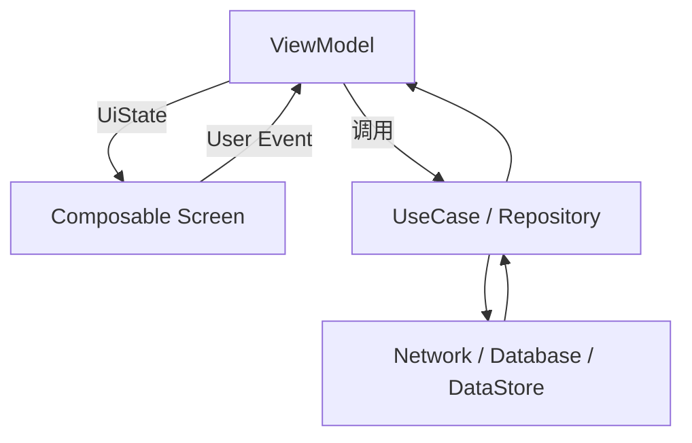
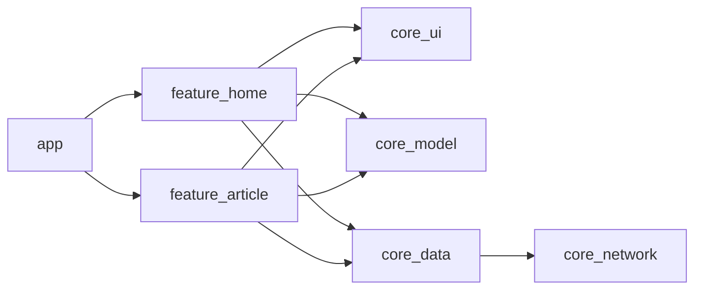
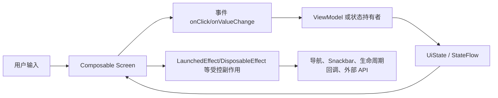
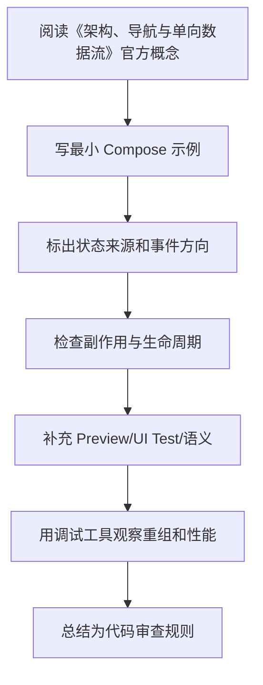

# 06. 架构、导航与单向数据流

最后调研时间：2026-06-13  
主要来源：Android Developers Compose Architecture、Navigation Compose、Save UI state 文档。

## 1. 单向数据流 UDF

Compose 推荐单向数据流：



基本规则：

- 状态向下传递。
- 事件向上传递。
- UI 只描述当前状态。
- ViewModel 处理事件并产出新状态。
- 数据层不依赖 UI。

## 2. 推荐页面结构

```kotlin
@Composable
fun ProductRoute(
    productId: String,
    onBack: () -> Unit,
    viewModel: ProductViewModel = viewModel()
) {
    val uiState by viewModel.uiState.collectAsStateWithLifecycle()

    LaunchedEffect(productId) {
        viewModel.load(productId)
    }

    ProductScreen(
        uiState = uiState,
        onBack = onBack,
        onRetry = viewModel::retry,
        onFavoriteClick = viewModel::toggleFavorite
    )
}

@Composable
fun ProductScreen(
    uiState: ProductUiState,
    onBack: () -> Unit,
    onRetry: () -> Unit,
    onFavoriteClick: () -> Unit
) {
    // 展示 UI
}
```

更理想的方式是让 ViewModel 从 `SavedStateHandle` 读取 `productId`，这样 Route 不必调用 `load(productId)`：

```kotlin
class ProductViewModel(
    savedStateHandle: SavedStateHandle,
    private val repository: ProductRepository
) : ViewModel() {
    private val productId: String = checkNotNull(savedStateHandle["productId"])

    val uiState: StateFlow<ProductUiState> =
        repository.observeProduct(productId)
            .map { ProductUiState.Content(it.toUiModel()) }
            .stateIn(
                scope = viewModelScope,
                started = SharingStarted.WhileSubscribed(5_000),
                initialValue = ProductUiState.Loading
            )
}
```

## 3. UI State 建模

简单页面：

```kotlin
data class ProfileUiState(
    val loading: Boolean = false,
    val user: UserUiModel? = null,
    val errorMessage: String? = null
)
```

复杂页面可以用 sealed interface：

```kotlin
sealed interface ProfileUiState {
    data object Loading : ProfileUiState
    data class Content(val user: UserUiModel) : ProfileUiState
    data class Error(val message: String) : ProfileUiState
}
```

取舍：

| 模型 | 优点 | 缺点 |
|---|---|---|
| data class + flags | 适合页面局部状态多、可组合状态多 | 可能出现非法组合，如 loading=true 且 error!=null |
| sealed state | 状态互斥清晰 | 局部状态多时嵌套复杂 |

经验：

- 列表页常用 data class：`loading`、`refreshing`、`items`、`errorMessage`。
- 详情页常用 sealed：Loading / Content / Error。
- 表单页常用 data class：每个字段、校验状态、提交状态。

## 4. Navigation Compose 基础

传统字符串路由：

```kotlin
@Composable
fun AppNavHost(navController: NavHostController) {
    NavHost(
        navController = navController,
        startDestination = "home"
    ) {
        composable("home") {
            HomeRoute(
                onArticleClick = { articleId ->
                    navController.navigate("article/$articleId")
                }
            )
        }

        composable(
            route = "article/{articleId}",
            arguments = listOf(navArgument("articleId") { type = NavType.StringType })
        ) {
            ArticleRoute(onBack = navController::popBackStack)
        }
    }
}
```

类型安全路由在新版 Navigation Compose 中越来越推荐。思路是用可序列化对象表达目的地和参数，减少手拼字符串错误。具体 API 会随 Navigation 版本变化，应以官方 Navigation Compose 文档为准。

示意：

```kotlin
@Serializable
data object Home

@Serializable
data class ArticleDetail(val articleId: String)
```

完整示意：

```kotlin
@Serializable
data object Home

@Serializable
data class ArticleDetail(val articleId: String)

@Composable
fun AppNavHost(navController: NavHostController) {
    NavHost(
        navController = navController,
        startDestination = Home
    ) {
        composable<Home> {
            HomeRoute(
                onArticleClick = { articleId ->
                    navController.navigate(ArticleDetail(articleId))
                }
            )
        }

        composable<ArticleDetail> { backStackEntry ->
            val route = backStackEntry.toRoute<ArticleDetail>()
            ArticleRoute(
                articleId = route.articleId,
                onBack = navController::popBackStack
            )
        }
    }
}
```

ViewModel 中通过 `SavedStateHandle` 解析：

```kotlin
class ArticleViewModel(
    savedStateHandle: SavedStateHandle,
    repository: ArticleRepository
) : ViewModel() {
    private val route = savedStateHandle.toRoute<ArticleDetail>()
    private val articleId = route.articleId
}
```

类型安全路由的收益：

- 参数名和类型由 Kotlin 编译期约束。
- 减少 `"article/{articleId}"` 和 `"article/$id"` 手拼不一致。
- 深链和参数解析更集中。

仍然要注意：类型安全不等于可以传大对象。导航参数仍应保持小而稳定。

## 5. 导航参数原则

只传最小必要参数：

```kotlin
navController.navigate("article/$articleId")
```

不要传完整对象：

```kotlin
// 不推荐：对象大、序列化复杂、可能过期
navController.navigate(articleObject)
```

目标页面通过 ID 从 Repository 或缓存读取最新数据。

原因：

- 返回栈参数大小有限。
- 对象可能变化，传对象容易显示旧数据。
- 深链、进程恢复、分享链接都更适合 ID。

## 6. 顶层导航与 Bottom Bar

```kotlin
@Composable
fun AppRoot() {
    val navController = rememberNavController()

    Scaffold(
        bottomBar = {
            NavigationBar {
                topLevelDestinations.forEach { destination ->
                    NavigationBarItem(
                        selected = false,
                        onClick = {
                            navController.navigate(destination.route) {
                                popUpTo(navController.graph.findStartDestination().id) {
                                    saveState = true
                                }
                                launchSingleTop = true
                                restoreState = true
                            }
                        },
                        icon = { Icon(destination.icon, contentDescription = null) },
                        label = { Text(destination.label) }
                    )
                }
            }
        }
    ) { padding ->
        NavHost(
            navController = navController,
            startDestination = "home",
            modifier = Modifier.padding(padding)
        ) {
            composable("home") { HomeRoute() }
            composable("settings") { SettingsRoute() }
        }
    }
}
```

关键参数：

- `popUpTo(startDestination)`：切换 tab 时回到每个栈的起点。
- `saveState = true`：保存被弹出目的地状态。
- `launchSingleTop = true`：避免重复创建同一顶层目的地。
- `restoreState = true`：恢复之前保存的 tab 状态。

## 7. ViewModel 作用域

Navigation Compose 中 ViewModel 默认与当前 back stack entry 关联。不同目的地通常拿到不同 ViewModel 实例。

共享 ViewModel 的场景：

- 登录流程多页共享表单。
- 多步骤创建流程。
- 同一 navigation graph 内共享状态。

示意：

```kotlin
val parentEntry = remember(navController.currentBackStackEntry) {
    navController.getBackStackEntry("checkout_graph")
}
val viewModel: CheckoutViewModel = viewModel(parentEntry)
```

使用共享 ViewModel 要谨慎，避免把全 App 状态都堆进一个 ViewModel。

## 8. 状态保存与导航恢复

需要区分：

| 状态 | 保存位置 |
|---|---|
| 页面输入框 | `rememberSaveable` 或 ViewModel + `SavedStateHandle` |
| 页面数据 | Repository + ViewModel 重建 |
| 滚动位置 | `LazyListState` saver 或 Navigation 保存状态 |
| 顶层 tab 返回栈 | Navigation `saveState/restoreState` |
| 登录状态 | 数据层持久化，例如 DataStore |

经验：

- 导航参数只负责“定位资源”。
- ViewModel 负责“拿到资源后如何渲染”。
- Repository/数据库负责“资源本身的真实来源”。

## 9. 多模块架构

典型结构：

```text
:app
:core:ui
:core:model
:core:data
:core:network
:feature:home
:feature:article
:feature:settings
```

依赖方向：



原则：

- `core:ui` 可以放主题和基础组件，不应依赖具体 feature。
- feature 之间不要直接互相依赖，导航事件上抛给 app 层。
- 数据层不要依赖 Compose。
- UI model 可以在 feature 内定义，避免数据实体直接泄漏到 UI。

## 10. 与 Clean Architecture 的关系

Compose 不改变 Clean Architecture 的依赖规则。

```text
UI Compose -> ViewModel -> UseCase -> Repository Interface -> Repository Impl -> Data Source
```

Compose 页面只应该知道：

- `UiState`。
- UI 事件。
- 导航回调。
- UI model。

不应该知道：

- Retrofit API 细节。
- Room DAO。
- DataStore key。
- 复杂业务规则。

## 11. 错误处理

推荐 UI State 明确表达错误：

```kotlin
data class FeedUiState(
    val loading: Boolean = false,
    val refreshing: Boolean = false,
    val items: List<FeedItemUiModel> = emptyList(),
    val errorMessage: String? = null
)
```

页面策略：

- 首次加载失败：全屏错误页 + 重试。
- 刷新失败：保留旧列表 + Snackbar。
- 分页失败：列表底部错误 item + 重试。
- 表单提交失败：字段错误或 Snackbar。

不要把异常对象直接暴露到 UI；转换成用户可理解文案或错误类型。

## 12. 分页与 Paging Compose

大列表通常不应一次性全部加载。Jetpack Paging 可以和 Compose 配合：

```kotlin
@Composable
fun ArticleFeedRoute(
    viewModel: ArticleFeedViewModel = viewModel()
) {
    val articles = viewModel.articles.collectAsLazyPagingItems()

    LazyColumn {
        items(
            count = articles.itemCount,
            key = articles.itemKey { it.id },
            contentType = articles.itemContentType { "article" }
        ) { index ->
            val article = articles[index]
            if (article != null) {
                ArticleRow(article)
            } else {
                ArticlePlaceholder()
            }
        }
    }
}
```

Paging 页面还要处理：

- `loadState.refresh`：首次加载、首次失败。
- `loadState.append`：加载更多中、加载更多失败。
- 空列表状态。
- 重试入口：`articles.retry()`。
- 刷新入口：`articles.refresh()`。

不要把 Paging 的 `PagingData` 转成普通大 List 再交给 UI，这会破坏分页和懒加载意义。

## 13. 页面事件、领域事件、导航事件

| 事件类型 | 示例 | 归属 |
|---|---|---|
| UI 事件 | 点击按钮、输入文字、切换 tab | Screen 上抛给 ViewModel 或 Route |
| 领域事件 | 保存订单、收藏文章、提交登录 | ViewModel 调用 UseCase |
| 导航事件 | 打开详情、返回上一页 | Route/App 层执行 |
| 一次性 UI 事件 | Snackbar、Toast、权限弹窗 | ViewModel 发 Effect，Route 收集 |

经验规则：

- Screen 不知道 `NavController`。
- ViewModel 不持有 Android UI 对象。
- 导航目标由 app/navigation 层统一组装。
- 跨 feature 导航通过 lambda 上抛，不让 feature 互相直接依赖。

## 14. 架构检查清单

- Screen 是否无状态或少状态。
- Route 是否只做连接，不写复杂 UI。
- ViewModel 是否不依赖 Compose API。
- Repository 是否不依赖 Android UI。
- 导航是否只传 ID 或简单参数。
- UI State 是否不可变。
- 一次性事件是否与持续 UI State 分开。
- 顶层 tab 是否处理 `saveState/restoreState`。
- 多模块依赖是否单向。

---

## 万字精讲扩展（2026-06-16 更新）
> Last researched: 2026-06-16。本文补充内容以 Jetpack Compose 官方文档和 Android Developers 实践资料为主；涉及 Compose Compiler、Kotlin、Navigation、Material3、Lifecycle、Performance 的版本细节，应在真实项目中继续核对最新官方 release notes。

### 本章在 Compose 学习路线中的位置

《架构、导航与单向数据流》是 Compose 能力闭环中的一个节点。Compose 学习不能只停留在静态页面，还要覆盖状态、事件、副作用、生命周期、导航、性能、测试、无障碍和 View 互操作。一个 composable 写出来能显示，只说明第一步完成；它能在重组、旋转、返回栈恢复、无障碍服务、release 构建、长列表和低端设备上稳定工作，才说明写法可靠。

本章学习完成后，建议至少达到三个标准。第一，能用 Compose 心智模型解释本章 API 的作用和边界。第二，能写出最小可运行例子，并指出状态来源、事件方向和副作用生命周期。第三，能制造一个常见错误并用工具或测试验证修复效果。Compose 是声明式 UI，但工程质量仍然依赖清晰边界和可验证实践。

### 架构导航类笔记的精讲重点

Compose 架构推荐把 Route 和 Screen 分开：Route 负责拿 ViewModel、收集状态、处理导航和与外部层交互；Screen 只接收 UiState 和事件回调，便于预览和测试。单向数据流要求状态向下、事件向上，ViewModel 处理业务事件并输出状态。不要把 ViewModel 直接传进每个小组件，否则组件会和业务层强耦合。

Navigation Compose 现在支持类型安全 API，适合减少字符串 route 和参数解析错误。导航参数应保持轻量，通常传 id，而不是把大型对象塞进路由。底部导航、多返回栈、深链、状态恢复和 ViewModel 作用域都需要单独设计。导航是 UI 流程，不应该替代业务状态管理。

### Compose 的核心心智模型：UI 是状态的函数，但函数必须足够纯

Compose 最重要的转变不是“用 Kotlin 写 UI”，而是把 UI 看成状态的描述。一个 composable 根据输入参数和读取到的状态描述界面，状态变化后框架触发重组，重新执行需要更新的 composable。这个模型要求 composable 尽量幂等、快速、无副作用。官方 Thinking in Compose 文档特别强调，重组可能频繁发生，也可能被跳过或取消，因此不要在 composable 主体里直接执行网络请求、导航、写数据库、启动协程或修改外部对象。需要副作用时，要使用受 Compose 生命周期管理的 Effect API。

学习 Compose 要同时区分三件事：composition、recomposition 和 drawing/layout。Composition 是把 composable 调用组织成 UI 树的过程；recomposition 是状态变化后重新执行部分 composable；layout/draw 是测量、摆放和绘制阶段。性能问题不一定来自重组，可能来自布局太复杂、绘制太重、列表 item 没有 key、状态读取范围太宽、参数不稳定、图片加载或主线程阻塞。只把“少重组”当成唯一目标，会误判很多问题。

### 状态、事件、副作用的单向流



Figure: Compose 单向数据流和副作用边界，综合 Android 官方 State、State Hoisting、Side-effects、Lifecycle in Compose 文档整理。

这个图的关键是方向。UI 读取状态并发出事件，状态持有者处理事件并产生新状态，UI 根据新状态重组。副作用不应该散落在 composable 主体里，而要放在能够表达启动、取消、更新和清理时机的 Effect API 中。导航、Snackbar、权限请求、监听器注册、Flow 收集、动画启动、外部 View 生命周期绑定，都属于需要明确边界的动作。

### Compose 学习必须建立版本意识

Compose 与 Kotlin、Compose Compiler、Android Gradle Plugin、Material3、Navigation、Lifecycle、Activity Compose 等库存在版本关系。Kotlin 2.0 之后 Compose Compiler 移入 Kotlin 仓库，旧项目仍可能遇到 compiler extension 与 Kotlin 版本不匹配的问题。学习笔记里不要只写“加某个依赖”，还要写 BOM、Kotlin 插件、Compose Compiler、Navigation 版本、Lifecycle Compose 版本以及是否使用类型安全导航、强跳过模式等条件。遇到构建错误时，优先查官方兼容表和 release notes。

### 最小可验证学习法

每个 Compose 主题都应该写一个最小验证例子。学习状态时，写一个文本输入、筛选列表或展开面板；学习副作用时，写 Snackbar、定时器、生命周期监听或 Flow 收集；学习 Lazy 列表时，写稳定 key、滚动位置、分页占位和 item 状态；学习性能时，写一个会过度重组的例子，再用状态拆分、remember、derivedStateOf 或稳定参数修正；学习测试时，用 semantics 查找节点并验证状态变化。只有能制造错误并修复，才算真正理解。

### 核心知识点逐条精讲

#### 1. UDF

在《架构、导航与单向数据流》中，`UDF` 不应该只理解成一个 API 名称，而要放进 Compose 的组合、重组、状态和副作用模型里看。学习时先问：它读取什么状态，谁拥有这些状态，变化后会让哪些 composable 重组，是否需要保存到配置变化后，是否会触发外部副作用，是否会影响测试语义或无障碍。能回答这些问题，才说明你真正按 Compose 的方式思考。

实现 ` UDF ` 时，建议先写一个最小 demo，再写一个错误版本。比如状态提升可以写“子组件内部 remember 导致外部无法控制”的错误例子；LaunchedEffect 可以写“key 变化导致重复请求”的错误例子；Lazy key 可以写“插入 item 后状态错位”的错误例子；Navigation 可以写“传复杂对象导致恢复困难”的错误例子。制造错误比只看正确代码更能建立边界感。

代码审查时要把 ` UDF ` 转成检查项：状态是否单一来源，参数是否稳定，Modifier 是否作为参数传入，副作用是否有正确 key 和清理逻辑，Flow 是否生命周期感知收集，Lazy item 是否有稳定 key，语义是否可测试且可访问，release 构建和性能工具是否验证过。Compose 项目的质量通常取决于这些细节是否一致执行。

#### 2. Route/Screen 分层

在《架构、导航与单向数据流》中，`Route/Screen 分层` 不应该只理解成一个 API 名称，而要放进 Compose 的组合、重组、状态和副作用模型里看。学习时先问：它读取什么状态，谁拥有这些状态，变化后会让哪些 composable 重组，是否需要保存到配置变化后，是否会触发外部副作用，是否会影响测试语义或无障碍。能回答这些问题，才说明你真正按 Compose 的方式思考。

实现 ` Route/Screen 分层 ` 时，建议先写一个最小 demo，再写一个错误版本。比如状态提升可以写“子组件内部 remember 导致外部无法控制”的错误例子；LaunchedEffect 可以写“key 变化导致重复请求”的错误例子；Lazy key 可以写“插入 item 后状态错位”的错误例子；Navigation 可以写“传复杂对象导致恢复困难”的错误例子。制造错误比只看正确代码更能建立边界感。

代码审查时要把 ` Route/Screen 分层 ` 转成检查项：状态是否单一来源，参数是否稳定，Modifier 是否作为参数传入，副作用是否有正确 key 和清理逻辑，Flow 是否生命周期感知收集，Lazy item 是否有稳定 key，语义是否可测试且可访问，release 构建和性能工具是否验证过。Compose 项目的质量通常取决于这些细节是否一致执行。

#### 3. UiState 建模

在《架构、导航与单向数据流》中，`UiState 建模` 不应该只理解成一个 API 名称，而要放进 Compose 的组合、重组、状态和副作用模型里看。学习时先问：它读取什么状态，谁拥有这些状态，变化后会让哪些 composable 重组，是否需要保存到配置变化后，是否会触发外部副作用，是否会影响测试语义或无障碍。能回答这些问题，才说明你真正按 Compose 的方式思考。

实现 ` UiState 建模 ` 时，建议先写一个最小 demo，再写一个错误版本。比如状态提升可以写“子组件内部 remember 导致外部无法控制”的错误例子；LaunchedEffect 可以写“key 变化导致重复请求”的错误例子；Lazy key 可以写“插入 item 后状态错位”的错误例子；Navigation 可以写“传复杂对象导致恢复困难”的错误例子。制造错误比只看正确代码更能建立边界感。

代码审查时要把 ` UiState 建模 ` 转成检查项：状态是否单一来源，参数是否稳定，Modifier 是否作为参数传入，副作用是否有正确 key 和清理逻辑，Flow 是否生命周期感知收集，Lazy item 是否有稳定 key，语义是否可测试且可访问，release 构建和性能工具是否验证过。Compose 项目的质量通常取决于这些细节是否一致执行。

#### 4. Navigation Compose

在《架构、导航与单向数据流》中，`Navigation Compose` 不应该只理解成一个 API 名称，而要放进 Compose 的组合、重组、状态和副作用模型里看。学习时先问：它读取什么状态，谁拥有这些状态，变化后会让哪些 composable 重组，是否需要保存到配置变化后，是否会触发外部副作用，是否会影响测试语义或无障碍。能回答这些问题，才说明你真正按 Compose 的方式思考。

实现 ` Navigation Compose ` 时，建议先写一个最小 demo，再写一个错误版本。比如状态提升可以写“子组件内部 remember 导致外部无法控制”的错误例子；LaunchedEffect 可以写“key 变化导致重复请求”的错误例子；Lazy key 可以写“插入 item 后状态错位”的错误例子；Navigation 可以写“传复杂对象导致恢复困难”的错误例子。制造错误比只看正确代码更能建立边界感。

代码审查时要把 ` Navigation Compose ` 转成检查项：状态是否单一来源，参数是否稳定，Modifier 是否作为参数传入，副作用是否有正确 key 和清理逻辑，Flow 是否生命周期感知收集，Lazy item 是否有稳定 key，语义是否可测试且可访问，release 构建和性能工具是否验证过。Compose 项目的质量通常取决于这些细节是否一致执行。

#### 5. 多模块和 Clean Architecture

在《架构、导航与单向数据流》中，`多模块和 Clean Architecture` 不应该只理解成一个 API 名称，而要放进 Compose 的组合、重组、状态和副作用模型里看。学习时先问：它读取什么状态，谁拥有这些状态，变化后会让哪些 composable 重组，是否需要保存到配置变化后，是否会触发外部副作用，是否会影响测试语义或无障碍。能回答这些问题，才说明你真正按 Compose 的方式思考。

实现 ` 多模块和 Clean Architecture ` 时，建议先写一个最小 demo，再写一个错误版本。比如状态提升可以写“子组件内部 remember 导致外部无法控制”的错误例子；LaunchedEffect 可以写“key 变化导致重复请求”的错误例子；Lazy key 可以写“插入 item 后状态错位”的错误例子；Navigation 可以写“传复杂对象导致恢复困难”的错误例子。制造错误比只看正确代码更能建立边界感。

代码审查时要把 ` 多模块和 Clean Architecture ` 转成检查项：状态是否单一来源，参数是否稳定，Modifier 是否作为参数传入，副作用是否有正确 key 和清理逻辑，Flow 是否生命周期感知收集，Lazy item 是否有稳定 key，语义是否可测试且可访问，release 构建和性能工具是否验证过。Compose 项目的质量通常取决于这些细节是否一致执行。


### 场景化学习与排错表

| 主题 | 推荐动作 | 常见风险 | 验证方式 |
| :--- | :--- | :--- | :--- |
| UDF | 用最小 demo 验证正确写法和错误写法，再放入完整页面 | 重组重复执行、副作用 key 错、状态源重复、稳定性误判、测试语义缺失 | Preview、Compose UI Test、Layout Inspector、重组计数、Macrobenchmark、真机验证 |
| Route/Screen 分层 | 用最小 demo 验证正确写法和错误写法，再放入完整页面 | 重组重复执行、副作用 key 错、状态源重复、稳定性误判、测试语义缺失 | Preview、Compose UI Test、Layout Inspector、重组计数、Macrobenchmark、真机验证 |
| UiState 建模 | 用最小 demo 验证正确写法和错误写法，再放入完整页面 | 重组重复执行、副作用 key 错、状态源重复、稳定性误判、测试语义缺失 | Preview、Compose UI Test、Layout Inspector、重组计数、Macrobenchmark、真机验证 |
| Navigation Compose | 用最小 demo 验证正确写法和错误写法，再放入完整页面 | 重组重复执行、副作用 key 错、状态源重复、稳定性误判、测试语义缺失 | Preview、Compose UI Test、Layout Inspector、重组计数、Macrobenchmark、真机验证 |
| 多模块和 Clean Architecture | 用最小 demo 验证正确写法和错误写法，再放入完整页面 | 重组重复执行、副作用 key 错、状态源重复、稳定性误判、测试语义缺失 | Preview、Compose UI Test、Layout Inspector、重组计数、Macrobenchmark、真机验证 |

这个表的重点是“能复现、能观察、能修复”。Compose 很多问题不会编译报错，而是表现为重组过多、状态丢失、事件重复、列表错位、TalkBack 读不清、测试找不到节点或某些机型上卡顿。只有建立可观察的验证方法，才能避免靠经验猜。

### 本章建议工作流



Figure: 《架构、导航与单向数据流》学习工作流，综合 Android 官方 Compose mental model、state、side-effects、performance、accessibility 和 testing 资料整理。

这个流程适合所有 Compose 主题。先理解概念，再落到小例子，再放回真实页面，再用测试和工具验证。不要在没有状态图的情况下写复杂 UI，也不要在没有测量的情况下做性能优化。

### 常见误区和纠正方法

- 误区：在 composable 主体里执行副作用。纠正：网络、导航、Snackbar、注册监听器、启动协程等动作应放入合适 Effect API 或 ViewModel 事件处理中。
- 误区：所有状态都放 ViewModel。纠正：纯 UI 元素状态可以靠近使用处，屏幕级和业务相关状态再提升到 ViewModel。
- 误区：所有地方都加 remember。纠正：remember 是保存计算或对象的工具，不是性能万能药；先测量，再判断是否需要。
- 误区：Lazy 列表不写 key。纠正：可变列表、插入删除、分页和 item 内状态都应使用稳定 key，避免状态错位。
- 误区：测试只靠 testTag。纠正：优先设计有意义的语义，testTag 作为补充；无障碍和测试都依赖语义质量。
- 误区：忽略版本兼容。纠正：Compose Compiler、Kotlin、BOM、Material3、Navigation 和 Lifecycle Compose 都要按官方版本说明维护。

### 与相邻章节的关系

《架构、导航与单向数据流》应与状态、副作用、架构、性能和测试章节交叉阅读。状态决定重组，副作用决定外部动作是否可控，架构决定状态和事件放在哪里，性能决定重组和布局是否可接受，测试和无障碍决定 UI 是否能被可靠验证和使用。任何一个章节单独学习都不够，最终要在一个完整页面中串起来。

### 实操训练和复盘模板

1. 围绕 `UDF` 写一个最小页面：包含正确实现、故意错误实现、观察结果和修复总结。
2. 围绕 `Route/Screen 分层` 写一个最小页面：包含正确实现、故意错误实现、观察结果和修复总结。
3. 围绕 `UiState 建模` 写一个最小页面：包含正确实现、故意错误实现、观察结果和修复总结。
4. 围绕 `Navigation Compose` 写一个最小页面：包含正确实现、故意错误实现、观察结果和修复总结。
5. 围绕 `多模块和 Clean Architecture` 写一个最小页面：包含正确实现、故意错误实现、观察结果和修复总结。

建议每个 Compose 练习都记录：

```text
练习名称：
本章主题：架构、导航与单向数据流
Compose / Kotlin / AGP / BOM 版本：
状态来源：local state / rememberSaveable / ViewModel / Repository
事件流向：UI -> ViewModel / state holder -> UiState -> UI
副作用：Effect API、key、取消和清理逻辑
测试入口：semantics、testTag、Preview、UI Test
性能观察：重组范围、Lazy key、稳定性、主线程耗时
失败场景：旋转、返回栈恢复、快速点击、断网、长列表、字体放大、TalkBack
结论：以后项目中采用的规则
```

这个模板的意义是把 Compose 学习从“API 记忆”推进到“页面质量”。真实项目中的 Compose 问题通常跨越状态、生命周期、导航、性能和无障碍，复盘时必须把这些因素放在一起看。

## 参考资料与延伸阅读

- [Official / Android] Jetpack Compose documentation: https://developer.android.com/develop/ui/compose
- [Official / Android] Thinking in Compose: https://developer.android.com/develop/ui/compose/mental-model
- [Official / Android] State and Jetpack Compose: https://developer.android.com/develop/ui/compose/state
- [Official / Android] Where to hoist state: https://developer.android.com/develop/ui/compose/state-hoisting
- [Official / Android] Side-effects in Compose: https://developer.android.com/develop/ui/compose/side-effects
- [Official / Android] Lifecycle in Jetpack Compose: https://developer.android.com/topic/libraries/architecture/lifecycle
- [Official / Android] Lazy lists and lazy grids: https://developer.android.com/develop/ui/compose/lists
- [Official / Android] Compose performance: https://developer.android.com/develop/ui/compose/performance
- [Official / Android] Stability in Compose: https://developer.android.com/develop/ui/compose/performance/stability
- [Official / Android] Strong skipping mode: https://developer.android.com/develop/ui/compose/performance/stability/strongskipping
- [Official / Android] Accessibility in Jetpack Compose: https://developer.android.com/develop/ui/compose/accessibility
- [Official / Android] Semantics in Compose: https://developer.android.com/develop/ui/compose/accessibility/semantics
- [Official / Android] Type safety in Navigation Compose: https://developer.android.com/guide/navigation/design/type-safety
- [Official / Android] Compose to Kotlin Compatibility Map: https://developer.android.com/jetpack/androidx/releases/compose-kotlin
- [Official / Android] Compose Compiler release notes: https://developer.android.com/jetpack/androidx/releases/compose-compiler
- [Official / Android Developers Blog] Jetpack Compose compiler moving to the Kotlin repository: https://android-developers.googleblog.com/2024/04/jetpack-compose-compiler-moving-to-kotlin-repository.html
- [Official / Android Developers Blog] What's New in Jetpack Compose: https://android-developers.googleblog.com/2025/05/whats-new-in-jetpack-compose.html
- [Official / Android Developers Blog] Strong Skipping Mode Explained: https://medium.com/androiddevelopers/jetpack-compose-strong-skipping-mode-explained-cbdb2aa4b900
- [Official / Android Developers Blog] Fundamentals of Compose layouts and modifiers: https://medium.com/androiddevelopers/fundamentals-of-compose-layouts-and-modifiers-64d794664b66
- [Official / Android Developers Blog] Consuming flows safely in Jetpack Compose: https://medium.com/androiddevelopers/consuming-flows-safely-in-jetpack-compose-cde014d0d5a3
- [Official / Android Developers Blog] Navigation Compose meet Type Safety: https://medium.com/androiddevelopers/navigation-compose-meet-type-safety-e081fb3cf2f8
- [Community / CSDN] Jetpack Compose 学习笔记检索入口: https://so.csdn.net/so/search?q=Jetpack%20Compose%20%E5%AD%A6%E4%B9%A0%E7%AC%94%E8%AE%B0
- [Community / 博客园] Compose 状态与副作用实践检索入口: https://zzk.cnblogs.com/s/blogpost?Keywords=Jetpack%20Compose%20%E7%8A%B6%E6%80%81%20%E5%89%AF%E4%BD%9C%E7%94%A8
- [Community / 掘金] Compose 性能、导航、架构实践检索入口: https://juejin.cn/search?query=Jetpack%20Compose%20%E6%80%A7%E8%83%BD%20%E5%AF%BC%E8%88%AA%20%E6%9E%B6%E6%9E%84&type=0
