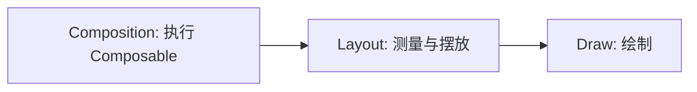

# 07. 性能、稳定性与调试

最后调研时间：2026-06-13  
主要来源：Android Developers Compose Performance、Stability、Phases、Lazy layouts 文档，以及中文社区对重组、LazyColumn、状态稳定性的实战总结。

## 1. 性能优化的正确顺序

不要一开始就凭感觉加 `remember`。推荐顺序：

1. 复现卡顿或异常重组。
2. 用工具观察重组、布局、绘制、帧耗时。
3. 找到具体昂贵点。
4. 修改状态读取范围、稳定性、列表 key、布局结构或绘制方式。
5. 再测量确认。

Compose 性能问题常见来源：

- 过大的重组范围。
- 参数类型不稳定，导致无法跳过。
- 列表没有 stable key。
- item 中做昂贵计算。
- 频繁创建对象或 lambda。
- 图片尺寸不稳定导致反复测量。
- 自定义布局/绘制成本高。
- 过度嵌套、阴影、模糊、渐变。
- 在主线程做 I/O 或解析。

## 2. Compose 三个阶段

简化理解：



性能优化要知道状态在哪个阶段读取：

- Composition 阶段读取状态：状态变化可能触发重组。
- Layout 阶段读取状态：可能跳过重组但重新测量/布局。
- Draw 阶段读取状态：可能只重绘。

示例：滚动驱动位移，如果只影响绘制或布局，可以考虑用更低阶段的 API。

```kotlin
Modifier.graphicsLayer {
    translationY = scrollOffset
}
```

不必每次滚动都让整块 UI 重组。

## 3. 稳定性

Compose 编译器根据类型稳定性判断能否跳过 Composable。

不稳定类型会让 Compose 更保守。

容易不稳定：

```kotlin
data class FeedUiState(
    val items: MutableList<Article>,
    var selectedId: String?
)
```

更好：

```kotlin
@Immutable
data class FeedUiState(
    val items: List<ArticleUiModel>,
    val selectedId: String?
)
```

进一步优化可使用 Kotlinx Immutable Collections：

```kotlin
@Immutable
data class FeedUiState(
    val items: ImmutableList<ArticleUiModel> = persistentListOf()
)
```

注意：`@Immutable` 是承诺，不是魔法。如果对象内部实际可变，标注会误导 Compose。

## 4. 强跳过模式

新版 Compose Compiler 引入和改进了强跳过相关能力，使更多 Composable 可以被跳过。但这不意味着可以忽略稳定性。

实践建议：

- 仍然让 UI State 尽量不可变。
- 避免公开可变集合。
- 不要依赖“反正会跳过”来掩盖昂贵逻辑。
- 性能敏感模块可查看 Compose Compiler metrics。

### 稳定性配置文件

当项目中某些类型实际不可变，但 Compose 编译器无法推断稳定性时，可以用稳定性配置文件辅助编译器判断。典型例子是某些跨模块模型、第三方不可变类型、Java 时间类型。

示意配置：

```text
// compose-stability.conf
java.time.LocalDate
java.time.Instant
com.example.core.model.*
```

Gradle 中传给 Compose compiler：

```kotlin
composeCompiler {
    stabilityConfigurationFile =
        rootProject.layout.projectDirectory.file("compose-stability.conf")
}
```

注意：

- 配置文件是对编译器的承诺，不会让可变对象真的不可变。
- 如果把实际可变的类型标成稳定，UI 可能跳过本该发生的更新。
- 优先修正模型不可变性；配置文件用于确实无法改类型或跨模块推断不足的场景。

## 5. Lambda 稳定性

频繁创建 lambda 可能影响跳过，尤其传给深层大量 item 时。

普通写法通常可以接受：

```kotlin
ArticleItem(
    article = article,
    onClick = { onArticleClick(article.id) }
)
```

如果在超大列表中发现问题，可调整事件设计：

```kotlin
@Composable
fun ArticleItem(
    article: ArticleUiModel,
    onClick: (String) -> Unit
) {
    Surface(onClick = { onClick(article.id) }) {
        Text(article.title)
    }
}
```

不要为了“看起来优化”把所有 lambda 都 `remember`，会降低可读性。

## 6. `remember` 的性能用法

适合缓存昂贵计算：

```kotlin
val groupedItems = remember(items) {
    items.groupBy { it.category }
}
```

适合缓存对象：

```kotlin
val interactionSource = remember { MutableInteractionSource() }
```

不适合：

```kotlin
val title = remember(name) { "Hello $name" }
```

简单字符串拼接没必要。

## 7. Lazy 列表性能

推荐：

```kotlin
LazyColumn {
    items(
        items = messages,
        key = { it.id },
        contentType = { it.kind }
    ) { message ->
        MessageRow(message)
    }
}
```

常见坑：

| 坑 | 后果 | 修正 |
|---|---|---|
| 不设置 key | 重排、插入时状态错位，动画异常 | 使用稳定唯一 ID |
| item 内加载大图无尺寸 | 布局跳动、反复测量 | 固定 aspect ratio/size |
| item 内做日期格式化等重计算 | 滚动卡顿 | ViewModel 预处理或 `remember(key)` |
| 嵌套同向 Lazy 列表 | 测量复杂、滚动冲突 | 合并为一个 Lazy 或限制高度 |
| 在 item 中创建 ViewModel | 实例过多、生命周期混乱 | 列表级 ViewModel，item 传状态 |
| 使用 index 作为 key | 插入删除时身份变化 | 用业务 ID |

## 8. 避免过宽状态读取

不佳：

```kotlin
@Composable
fun ProfileScreen(uiState: ProfileUiState) {
    Header(uiState)
    Content(uiState)
    Footer(uiState)
}
```

每个子组件都接收整个 `uiState`，任何字段变化都可能影响多个子组件。

更好：

```kotlin
Header(name = uiState.name, avatarUrl = uiState.avatarUrl)
Content(posts = uiState.posts)
Footer(enabled = uiState.canSubmit)
```

让子组件只接收自己需要的字段。

## 9. 滚动状态优化

错误：

```kotlin
val showButton = listState.firstVisibleItemIndex > 0
```

如果直接在大范围 Composable 中读取，会让滚动频繁触发重组。

更好：

```kotlin
val showButton by remember {
    derivedStateOf { listState.firstVisibleItemIndex > 0 }
}
```

如果只做埋点：

```kotlin
LaunchedEffect(listState) {
    snapshotFlow { listState.firstVisibleItemIndex }
        .distinctUntilChanged()
        .filter { it > 0 }
        .collect { analytics.logScrolled() }
}
```

## 10. 自定义绘制

```kotlin
Canvas(modifier = Modifier.size(120.dp)) {
    drawCircle(Color.Red)
}
```

性能注意：

- 避免每帧分配大量对象。
- 复杂路径尽量缓存。
- 动画中避免高成本阴影、模糊。
- 大面积渐变和透明叠加要测量低端机。

可用 `drawWithCache` 缓存绘制对象：

```kotlin
Modifier.drawWithCache {
    val path = Path().apply {
        addOval(Rect(Offset.Zero, size))
    }
    onDrawBehind {
        drawPath(path, Color.Blue)
    }
}
```

## 11. 调试工具

常用工具：

| 工具 | 用途 |
|---|---|
| Layout Inspector | 查看 Compose UI 树、重组计数 |
| Compose Preview | 快速预览组件 |
| Macrobenchmark | 测量启动、滚动、帧性能 |
| Baseline Profiles | 提升启动和关键路径性能 |
| Compose Compiler metrics | 分析可跳过性、稳定性 |
| Android Studio Profiler | CPU、内存、帧时间 |

Compose Compiler metrics 通常用于性能专项，不建议日常一直开。

### Compose Compiler metrics 看什么

开启 metrics 后重点看：

| 指标 | 含义 | 处理方向 |
|---|---|---|
| `restartable` | Composable 可作为重组入口 | 正常，不一定是问题 |
| `skippable` | 参数没变时可跳过 | 关键列表 item 希望尽量可跳过 |
| `stable` / `unstable` | 参数稳定性判断 | 检查可变集合、公开 var、跨模块类型 |
| `readonly` | 不写入状态的只读函数 | 了解即可 |

排查顺序：

1. 先用性能现象定位页面或列表。
2. 再看 metrics 找不可跳过的热点 Composable。
3. 检查参数类型是否暴露 `MutableList`、可变实体、匿名包装对象。
4. 修正 UI model 和参数边界。
5. 用 Layout Inspector 或 Macrobenchmark 验证，而不是只看 metrics。

## 12. Baseline Profile 与 Macrobenchmark

Compose 页面启动、首帧、滚动都可能受编译和运行时热点影响。Baseline Profile 可以提前优化关键路径，Macrobenchmark 用于测量。

适合测量：

- App 启动时间。
- Feed 首屏渲染。
- Lazy 列表滚动帧时间。
- 搜索结果切换。
- 复杂动画页面。

示意：

```kotlin
@Test
fun scrollFeed() = benchmarkRule.measureRepeated(
    packageName = "com.example.app",
    metrics = listOf(FrameTimingMetric()),
    iterations = 5,
    setupBlock = {
        startActivityAndWait()
    }
) {
    device.findObject(By.res("feed_list")).fling(Direction.DOWN)
}
```

注意：

- Macrobenchmark 需要独立 benchmark 模块。
- 用 release 或接近 release 的构建测，不要用普通 debug 判断最终性能。
- 性能优化要保留可复现测试，否则很容易退化。

## 13. 性能排查流程

```text
问题：列表滚动卡顿

1. 确认是否主线程阻塞
2. Layout Inspector 看重组计数
3. 检查 LazyColumn key/contentType
4. 检查 item 是否做昂贵计算
5. 检查图片尺寸、加载、占位
6. 检查 UI State 是否频繁整体替换
7. 检查 item 参数稳定性
8. 用 Macrobenchmark 验证
```

## 14. 实战优化示例

原始：

```kotlin
@Composable
fun ArticleRow(article: Article) {
    val dateText = SimpleDateFormat("yyyy-MM-dd", Locale.getDefault())
        .format(Date(article.publishTime))

    Row(Modifier.fillMaxWidth().padding(16.dp)) {
        Text(article.title)
        Text(dateText)
    }
}
```

问题：

- 每次重组创建 `SimpleDateFormat`。
- `Article` 可能是数据层实体，不稳定且字段过多。

优化：

```kotlin
@Immutable
data class ArticleUiModel(
    val id: String,
    val title: String,
    val dateText: String
)

@Composable
fun ArticleRow(article: ArticleUiModel) {
    Row(Modifier.fillMaxWidth().padding(16.dp)) {
        Text(article.title, modifier = Modifier.weight(1f))
        Text(article.dateText)
    }
}
```

日期格式化放到 ViewModel 或 mapper。

## 15. 不要过度优化

这些通常不需要优先优化：

- 小型静态页面的普通重组。
- 简单字符串拼接。
- 少量 lambda 创建。
- 少量组件嵌套。
- 没有性能问题的普通 `Column`。

优先关注：

- 大列表。
- 高频状态变化。
- 动画。
- 图片密集页面。
- 自定义绘制。
- 首页和启动路径。
