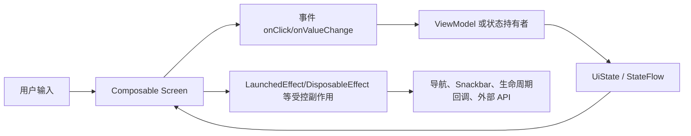
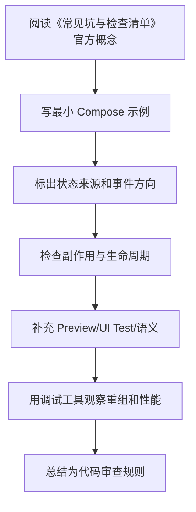

# 09. 常见坑与检查清单

最后调研时间：2026-06-13  
来源：官方文档规则 + 中文社区 CSDN、掘金、博客园、SegmentFault 中关于 Compose 状态、重组、LazyColumn、副作用的实战经验综合。

## 1. 状态相关坑

### 普通变量不会触发 UI 更新

错误：

```kotlin
var count = 0
Button(onClick = { count++ }) {
    Text("$count")
}
```

正确：

```kotlin
var count by remember { mutableIntStateOf(0) }
```

### 可变集合变化不一定触发重组

错误：

```kotlin
val list = remember { mutableListOf<String>() }
list.add("A")
```

正确：

```kotlin
var list by remember { mutableStateOf(emptyList<String>()) }
list = list + "A"
```

或：

```kotlin
val list = remember { mutableStateListOf<String>() }
list.add("A")
```

### 把业务状态放在 `remember`

问题：

- 配置变更丢失。
- 页面离开丢失。
- 进程死亡不可恢复。
- 无法被业务层复用。

修正：页面业务状态放 ViewModel，持久状态放 Repository/DataStore/Room。

## 2. 副作用相关坑

### 在 Composable 函数体里请求网络

错误：

```kotlin
@Composable
fun UserScreen(repo: UserRepository) {
    val user = repo.loadUser()
}
```

修正：

- ViewModel `init` 加载。
- 或 `LaunchedEffect(key)` 触发。

### `LaunchedEffect` key 选择错误

key 太宽：

```kotlin
LaunchedEffect(uiState) { ... }
```

可能每次状态变化都重启。

key 太窄：

```kotlin
LaunchedEffect(Unit) {
    load(userId)
}
```

如果 `userId` 变化但页面未离开，不会重新加载。

修正：

```kotlin
LaunchedEffect(userId) {
    load(userId)
}
```

### `DisposableEffect` 忘记释放

错误：

```kotlin
DisposableEffect(Unit) {
    listener.start()
    onDispose { }
}
```

正确：

```kotlin
DisposableEffect(Unit) {
    listener.start()
    onDispose { listener.stop() }
}
```

## 3. LazyColumn 相关坑

### 没有 stable key

错误：

```kotlin
items(users) { user -> UserRow(user) }
```

正确：

```kotlin
items(users, key = { it.id }) { user -> UserRow(user) }
```

### index 当 key

```kotlin
itemsIndexed(users, key = { index, _ -> index }) { _, user -> }
```

插入、删除、排序后 index 变化，状态可能错位。应使用业务 ID。

### item 内做重计算

错误：

```kotlin
items(orders) { order ->
    Text(order.items.sumOf { it.price }.toString())
}
```

修正：在 ViewModel 中转换成 UI model，或 `remember(order.id, order.items)` 缓存。

### 图片无固定尺寸

网络图加载前后尺寸变化会导致布局跳动。

```kotlin
AsyncImage(
    model = url,
    contentDescription = title,
    modifier = Modifier
        .fillMaxWidth()
        .aspectRatio(16f / 9f),
    contentScale = ContentScale.Crop
)
```

## 4. Modifier 相关坑

### 顺序错误导致点击区域不符合预期

```kotlin
Modifier
    .padding(16.dp)
    .clickable { }
```

点击区域不包含外部 padding。

```kotlin
Modifier
    .clickable { }
    .padding(16.dp)
```

点击区域包含 padding。

没有绝对对错，只看目标命中区域。

### 组件内部吞掉外部 modifier

错误：

```kotlin
@Composable
fun UserCard(user: User) {
    Card(Modifier.fillMaxWidth()) { }
}
```

正确：

```kotlin
@Composable
fun UserCard(
    user: User,
    modifier: Modifier = Modifier
) {
    Card(modifier.fillMaxWidth()) { }
}
```

## 5. Navigation 相关坑

### 路由传大对象

问题：

- 参数过大。
- 序列化复杂。
- 进程恢复困难。
- 数据可能过期。

修正：只传 ID。

### 底部导航重复创建页面

切换 tab 时建议：

```kotlin
navController.navigate(route) {
    popUpTo(navController.graph.findStartDestination().id) {
        saveState = true
    }
    launchSingleTop = true
    restoreState = true
}
```

### 在 Screen 里直接依赖 NavController

不推荐：

```kotlin
fun DetailScreen(navController: NavController)
```

推荐：

```kotlin
fun DetailScreen(onBack: () -> Unit, onOpenUser: (String) -> Unit)
```

这样 Screen 更容易预览和测试。

## 6. 性能相关坑

### 传整个 UiState 到所有子组件

问题：任何字段变化都可能影响多个子组件。

修正：子组件只接收需要的字段。

### 滥用 `derivedStateOf`

适合输入频繁变化、输出低频变化的场景，不适合简单拼接。

### 滥用 `remember`

`remember` 是缓存，不是性能护身符。简单表达式不用缓存，昂贵计算才缓存。

### 不稳定 UI State

避免：

```kotlin
data class UiState(
    val items: MutableList<Item>
)
```

推荐：

```kotlin
data class UiState(
    val items: List<ItemUiModel>
)
```

## 7. 测试和无障碍坑

### 图标按钮无描述

错误：

```kotlin
Icon(Icons.Default.Delete, contentDescription = null)
```

如果图标是按钮核心含义，应写：

```kotlin
Icon(Icons.Default.Delete, contentDescription = "删除")
```

### 测试只依赖层级

Compose UI 树可能变化，不要写过度依赖层级结构的测试。优先通过文本、语义、testTag 查找。

### 大字体裁剪

固定高度按钮、卡片、列表 item 在系统字体放大时容易裁剪。重要页面要测试大字体。

## 8. 代码审查清单

状态：

- 状态是否放在正确拥有者。
- UI State 是否不可变。
- 是否避免普通变量保存 UI 状态。
- 是否避免可变集合直接暴露给 UI。
- 是否区分持续状态和一次性事件。

副作用：

- 是否没有在 Composable 函数体直接做请求、写库、埋点。
- `LaunchedEffect` key 是否准确。
- `DisposableEffect` 是否释放资源。
- 长生命周期 Effect 是否需要 `rememberUpdatedState`。

组件：

- 是否暴露 `modifier`。
- 是否尽量无状态。
- 是否从 MaterialTheme 读取颜色和字体。
- 是否支持预览。
- 文案变长时是否正常。

列表：

- 是否有 stable key。
- 是否需要 contentType。
- item 是否避免重计算。
- 图片是否有尺寸约束。

导航：

- 是否只传 ID 或简单参数。
- Screen 是否不直接依赖 NavController。
- 顶层 tab 是否处理状态保存。

性能：

- 是否避免过宽状态读取。
- 是否避免不必要的重组热点。
- 是否用工具验证过关键路径。

无障碍和测试：

- 图标按钮是否有描述。
- 装饰图是否 description 为 null。
- 点击区域是否足够大。
- 关键状态是否有 UI 测试。

## 9. 迁移与版本升级坑

### Kotlin 2.x Compose Compiler 插件遗漏

Kotlin 2.x 项目应使用：

```kotlin
plugins {
    id("org.jetbrains.kotlin.plugin.compose")
}
```

老项目从 Kotlin 1.x 升级时，不要同时保留旧的 `composeOptions.kotlinCompilerExtensionVersion` 和新的插件配置，按官方迁移指南清理。

### BOM 不能管理所有 Jetpack 版本

Compose BOM 管理 Compose artifact，不管理：

- `androidx.activity:activity-compose`
- `androidx.lifecycle:lifecycle-runtime-compose`
- `androidx.navigation:navigation-compose`
- `androidx.paging:paging-compose`
- Coil、Hilt、Accompanist 等第三方库

这些仍要单独升级和验证。

### 强行一次性迁移整站

Compose 和 View 可以互操作。已有大型 View 项目更适合按页面或局部组件迁移，先把边界清楚、依赖少的页面迁过去。

## 10. 上线前最小检查

- 首屏加载、空列表、错误、重试、刷新都有 UI。
- 关键输入在旋转屏幕后能恢复。
- 详情页只通过 ID 定位资源。
- 一次性事件不会旋转后重复触发。
- Lazy 列表有 key，图片有稳定尺寸。
- 图标按钮有 `contentDescription`。
- 大字体下按钮和列表 item 不裁剪。
- 关键路径有 ViewModel 单元测试和 Screen UI 测试。
- 性能敏感列表至少用 release 构建或 Macrobenchmark 验证过。

---

## 万字精讲扩展（2026-06-16 更新）
> Last researched: 2026-06-16。本文补充内容以 Jetpack Compose 官方文档和 Android Developers 实践资料为主；涉及 Compose Compiler、Kotlin、Navigation、Material3、Lifecycle、Performance 的版本细节，应在真实项目中继续核对最新官方 release notes。

### 本章在 Compose 学习路线中的位置

《常见坑与检查清单》是 Compose 能力闭环中的一个节点。Compose 学习不能只停留在静态页面，还要覆盖状态、事件、副作用、生命周期、导航、性能、测试、无障碍和 View 互操作。一个 composable 写出来能显示，只说明第一步完成；它能在重组、旋转、返回栈恢复、无障碍服务、release 构建、长列表和低端设备上稳定工作，才说明写法可靠。

本章学习完成后，建议至少达到三个标准。第一，能用 Compose 心智模型解释本章 API 的作用和边界。第二，能写出最小可运行例子，并指出状态来源、事件方向和副作用生命周期。第三，能制造一个常见错误并用工具或测试验证修复效果。Compose 是声明式 UI，但工程质量仍然依赖清晰边界和可验证实践。

### 坑点清单类笔记的精讲重点

坑点清单的价值在于把抽象原则变成代码审查问题。状态坑通常来自状态源重复、mutable 集合不可观察、状态放错层级或 remember key 错；副作用坑来自 LaunchedEffect key 错、重组重复执行、监听器未释放；Lazy 坑来自缺少 key、item 内 remember 错位、滚动状态读取过宽；导航坑来自字符串 route、参数过重、返回栈不清；性能坑来自不测量就优化。

检查清单应该随着项目更新。每次线上 bug、测试失败或性能问题，都要回到清单补一条“触发条件、错误写法、修复写法、验证方法”。这样清单才会从静态笔记变成团队经验库。

### Compose 的核心心智模型：UI 是状态的函数，但函数必须足够纯

Compose 最重要的转变不是“用 Kotlin 写 UI”，而是把 UI 看成状态的描述。一个 composable 根据输入参数和读取到的状态描述界面，状态变化后框架触发重组，重新执行需要更新的 composable。这个模型要求 composable 尽量幂等、快速、无副作用。官方 Thinking in Compose 文档特别强调，重组可能频繁发生，也可能被跳过或取消，因此不要在 composable 主体里直接执行网络请求、导航、写数据库、启动协程或修改外部对象。需要副作用时，要使用受 Compose 生命周期管理的 Effect API。

学习 Compose 要同时区分三件事：composition、recomposition 和 drawing/layout。Composition 是把 composable 调用组织成 UI 树的过程；recomposition 是状态变化后重新执行部分 composable；layout/draw 是测量、摆放和绘制阶段。性能问题不一定来自重组，可能来自布局太复杂、绘制太重、列表 item 没有 key、状态读取范围太宽、参数不稳定、图片加载或主线程阻塞。只把“少重组”当成唯一目标，会误判很多问题。

### 状态、事件、副作用的单向流



Figure: Compose 单向数据流和副作用边界，综合 Android 官方 State、State Hoisting、Side-effects、Lifecycle in Compose 文档整理。

这个图的关键是方向。UI 读取状态并发出事件，状态持有者处理事件并产生新状态，UI 根据新状态重组。副作用不应该散落在 composable 主体里，而要放在能够表达启动、取消、更新和清理时机的 Effect API 中。导航、Snackbar、权限请求、监听器注册、Flow 收集、动画启动、外部 View 生命周期绑定，都属于需要明确边界的动作。

### Compose 学习必须建立版本意识

Compose 与 Kotlin、Compose Compiler、Android Gradle Plugin、Material3、Navigation、Lifecycle、Activity Compose 等库存在版本关系。Kotlin 2.0 之后 Compose Compiler 移入 Kotlin 仓库，旧项目仍可能遇到 compiler extension 与 Kotlin 版本不匹配的问题。学习笔记里不要只写“加某个依赖”，还要写 BOM、Kotlin 插件、Compose Compiler、Navigation 版本、Lifecycle Compose 版本以及是否使用类型安全导航、强跳过模式等条件。遇到构建错误时，优先查官方兼容表和 release notes。

### 最小可验证学习法

每个 Compose 主题都应该写一个最小验证例子。学习状态时，写一个文本输入、筛选列表或展开面板；学习副作用时，写 Snackbar、定时器、生命周期监听或 Flow 收集；学习 Lazy 列表时，写稳定 key、滚动位置、分页占位和 item 状态；学习性能时，写一个会过度重组的例子，再用状态拆分、remember、derivedStateOf 或稳定参数修正；学习测试时，用 semantics 查找节点并验证状态变化。只有能制造错误并修复，才算真正理解。

### 核心知识点逐条精讲

#### 1. 状态坑

在《常见坑与检查清单》中，`状态坑` 不应该只理解成一个 API 名称，而要放进 Compose 的组合、重组、状态和副作用模型里看。学习时先问：它读取什么状态，谁拥有这些状态，变化后会让哪些 composable 重组，是否需要保存到配置变化后，是否会触发外部副作用，是否会影响测试语义或无障碍。能回答这些问题，才说明你真正按 Compose 的方式思考。

实现 ` 状态坑 ` 时，建议先写一个最小 demo，再写一个错误版本。比如状态提升可以写“子组件内部 remember 导致外部无法控制”的错误例子；LaunchedEffect 可以写“key 变化导致重复请求”的错误例子；Lazy key 可以写“插入 item 后状态错位”的错误例子；Navigation 可以写“传复杂对象导致恢复困难”的错误例子。制造错误比只看正确代码更能建立边界感。

代码审查时要把 ` 状态坑 ` 转成检查项：状态是否单一来源，参数是否稳定，Modifier 是否作为参数传入，副作用是否有正确 key 和清理逻辑，Flow 是否生命周期感知收集，Lazy item 是否有稳定 key，语义是否可测试且可访问，release 构建和性能工具是否验证过。Compose 项目的质量通常取决于这些细节是否一致执行。

#### 2. 副作用坑

在《常见坑与检查清单》中，`副作用坑` 不应该只理解成一个 API 名称，而要放进 Compose 的组合、重组、状态和副作用模型里看。学习时先问：它读取什么状态，谁拥有这些状态，变化后会让哪些 composable 重组，是否需要保存到配置变化后，是否会触发外部副作用，是否会影响测试语义或无障碍。能回答这些问题，才说明你真正按 Compose 的方式思考。

实现 ` 副作用坑 ` 时，建议先写一个最小 demo，再写一个错误版本。比如状态提升可以写“子组件内部 remember 导致外部无法控制”的错误例子；LaunchedEffect 可以写“key 变化导致重复请求”的错误例子；Lazy key 可以写“插入 item 后状态错位”的错误例子；Navigation 可以写“传复杂对象导致恢复困难”的错误例子。制造错误比只看正确代码更能建立边界感。

代码审查时要把 ` 副作用坑 ` 转成检查项：状态是否单一来源，参数是否稳定，Modifier 是否作为参数传入，副作用是否有正确 key 和清理逻辑，Flow 是否生命周期感知收集，Lazy item 是否有稳定 key，语义是否可测试且可访问，release 构建和性能工具是否验证过。Compose 项目的质量通常取决于这些细节是否一致执行。

#### 3. LazyColumn 坑

在《常见坑与检查清单》中，`LazyColumn 坑` 不应该只理解成一个 API 名称，而要放进 Compose 的组合、重组、状态和副作用模型里看。学习时先问：它读取什么状态，谁拥有这些状态，变化后会让哪些 composable 重组，是否需要保存到配置变化后，是否会触发外部副作用，是否会影响测试语义或无障碍。能回答这些问题，才说明你真正按 Compose 的方式思考。

实现 ` LazyColumn 坑 ` 时，建议先写一个最小 demo，再写一个错误版本。比如状态提升可以写“子组件内部 remember 导致外部无法控制”的错误例子；LaunchedEffect 可以写“key 变化导致重复请求”的错误例子；Lazy key 可以写“插入 item 后状态错位”的错误例子；Navigation 可以写“传复杂对象导致恢复困难”的错误例子。制造错误比只看正确代码更能建立边界感。

代码审查时要把 ` LazyColumn 坑 ` 转成检查项：状态是否单一来源，参数是否稳定，Modifier 是否作为参数传入，副作用是否有正确 key 和清理逻辑，Flow 是否生命周期感知收集，Lazy item 是否有稳定 key，语义是否可测试且可访问，release 构建和性能工具是否验证过。Compose 项目的质量通常取决于这些细节是否一致执行。

#### 4. Navigation 坑

在《常见坑与检查清单》中，`Navigation 坑` 不应该只理解成一个 API 名称，而要放进 Compose 的组合、重组、状态和副作用模型里看。学习时先问：它读取什么状态，谁拥有这些状态，变化后会让哪些 composable 重组，是否需要保存到配置变化后，是否会触发外部副作用，是否会影响测试语义或无障碍。能回答这些问题，才说明你真正按 Compose 的方式思考。

实现 ` Navigation 坑 ` 时，建议先写一个最小 demo，再写一个错误版本。比如状态提升可以写“子组件内部 remember 导致外部无法控制”的错误例子；LaunchedEffect 可以写“key 变化导致重复请求”的错误例子；Lazy key 可以写“插入 item 后状态错位”的错误例子；Navigation 可以写“传复杂对象导致恢复困难”的错误例子。制造错误比只看正确代码更能建立边界感。

代码审查时要把 ` Navigation 坑 ` 转成检查项：状态是否单一来源，参数是否稳定，Modifier 是否作为参数传入，副作用是否有正确 key 和清理逻辑，Flow 是否生命周期感知收集，Lazy item 是否有稳定 key，语义是否可测试且可访问，release 构建和性能工具是否验证过。Compose 项目的质量通常取决于这些细节是否一致执行。

#### 5. 性能、测试和升级坑

在《常见坑与检查清单》中，`性能、测试和升级坑` 不应该只理解成一个 API 名称，而要放进 Compose 的组合、重组、状态和副作用模型里看。学习时先问：它读取什么状态，谁拥有这些状态，变化后会让哪些 composable 重组，是否需要保存到配置变化后，是否会触发外部副作用，是否会影响测试语义或无障碍。能回答这些问题，才说明你真正按 Compose 的方式思考。

实现 ` 性能、测试和升级坑 ` 时，建议先写一个最小 demo，再写一个错误版本。比如状态提升可以写“子组件内部 remember 导致外部无法控制”的错误例子；LaunchedEffect 可以写“key 变化导致重复请求”的错误例子；Lazy key 可以写“插入 item 后状态错位”的错误例子；Navigation 可以写“传复杂对象导致恢复困难”的错误例子。制造错误比只看正确代码更能建立边界感。

代码审查时要把 ` 性能、测试和升级坑 ` 转成检查项：状态是否单一来源，参数是否稳定，Modifier 是否作为参数传入，副作用是否有正确 key 和清理逻辑，Flow 是否生命周期感知收集，Lazy item 是否有稳定 key，语义是否可测试且可访问，release 构建和性能工具是否验证过。Compose 项目的质量通常取决于这些细节是否一致执行。


### 场景化学习与排错表

| 主题 | 推荐动作 | 常见风险 | 验证方式 |
| :--- | :--- | :--- | :--- |
| 状态坑 | 用最小 demo 验证正确写法和错误写法，再放入完整页面 | 重组重复执行、副作用 key 错、状态源重复、稳定性误判、测试语义缺失 | Preview、Compose UI Test、Layout Inspector、重组计数、Macrobenchmark、真机验证 |
| 副作用坑 | 用最小 demo 验证正确写法和错误写法，再放入完整页面 | 重组重复执行、副作用 key 错、状态源重复、稳定性误判、测试语义缺失 | Preview、Compose UI Test、Layout Inspector、重组计数、Macrobenchmark、真机验证 |
| LazyColumn 坑 | 用最小 demo 验证正确写法和错误写法，再放入完整页面 | 重组重复执行、副作用 key 错、状态源重复、稳定性误判、测试语义缺失 | Preview、Compose UI Test、Layout Inspector、重组计数、Macrobenchmark、真机验证 |
| Navigation 坑 | 用最小 demo 验证正确写法和错误写法，再放入完整页面 | 重组重复执行、副作用 key 错、状态源重复、稳定性误判、测试语义缺失 | Preview、Compose UI Test、Layout Inspector、重组计数、Macrobenchmark、真机验证 |
| 性能、测试和升级坑 | 用最小 demo 验证正确写法和错误写法，再放入完整页面 | 重组重复执行、副作用 key 错、状态源重复、稳定性误判、测试语义缺失 | Preview、Compose UI Test、Layout Inspector、重组计数、Macrobenchmark、真机验证 |

这个表的重点是“能复现、能观察、能修复”。Compose 很多问题不会编译报错，而是表现为重组过多、状态丢失、事件重复、列表错位、TalkBack 读不清、测试找不到节点或某些机型上卡顿。只有建立可观察的验证方法，才能避免靠经验猜。

### 本章建议工作流



Figure: 《常见坑与检查清单》学习工作流，综合 Android 官方 Compose mental model、state、side-effects、performance、accessibility 和 testing 资料整理。

这个流程适合所有 Compose 主题。先理解概念，再落到小例子，再放回真实页面，再用测试和工具验证。不要在没有状态图的情况下写复杂 UI，也不要在没有测量的情况下做性能优化。

### 常见误区和纠正方法

- 误区：在 composable 主体里执行副作用。纠正：网络、导航、Snackbar、注册监听器、启动协程等动作应放入合适 Effect API 或 ViewModel 事件处理中。
- 误区：所有状态都放 ViewModel。纠正：纯 UI 元素状态可以靠近使用处，屏幕级和业务相关状态再提升到 ViewModel。
- 误区：所有地方都加 remember。纠正：remember 是保存计算或对象的工具，不是性能万能药；先测量，再判断是否需要。
- 误区：Lazy 列表不写 key。纠正：可变列表、插入删除、分页和 item 内状态都应使用稳定 key，避免状态错位。
- 误区：测试只靠 testTag。纠正：优先设计有意义的语义，testTag 作为补充；无障碍和测试都依赖语义质量。
- 误区：忽略版本兼容。纠正：Compose Compiler、Kotlin、BOM、Material3、Navigation 和 Lifecycle Compose 都要按官方版本说明维护。

### 与相邻章节的关系

《常见坑与检查清单》应与状态、副作用、架构、性能和测试章节交叉阅读。状态决定重组，副作用决定外部动作是否可控，架构决定状态和事件放在哪里，性能决定重组和布局是否可接受，测试和无障碍决定 UI 是否能被可靠验证和使用。任何一个章节单独学习都不够，最终要在一个完整页面中串起来。

### 实操训练和复盘模板

1. 围绕 `状态坑` 写一个最小页面：包含正确实现、故意错误实现、观察结果和修复总结。
2. 围绕 `副作用坑` 写一个最小页面：包含正确实现、故意错误实现、观察结果和修复总结。
3. 围绕 `LazyColumn 坑` 写一个最小页面：包含正确实现、故意错误实现、观察结果和修复总结。
4. 围绕 `Navigation 坑` 写一个最小页面：包含正确实现、故意错误实现、观察结果和修复总结。
5. 围绕 `性能、测试和升级坑` 写一个最小页面：包含正确实现、故意错误实现、观察结果和修复总结。

建议每个 Compose 练习都记录：

```text
练习名称：
本章主题：常见坑与检查清单
Compose / Kotlin / AGP / BOM 版本：
状态来源：local state / rememberSaveable / ViewModel / Repository
事件流向：UI -> ViewModel / state holder -> UiState -> UI
副作用：Effect API、key、取消和清理逻辑
测试入口：semantics、testTag、Preview、UI Test
性能观察：重组范围、Lazy key、稳定性、主线程耗时
失败场景：旋转、返回栈恢复、快速点击、断网、长列表、字体放大、TalkBack
结论：以后项目中采用的规则
```

这个模板的意义是把 Compose 学习从“API 记忆”推进到“页面质量”。真实项目中的 Compose 问题通常跨越状态、生命周期、导航、性能和无障碍，复盘时必须把这些因素放在一起看。

## 参考资料与延伸阅读

- [Official / Android] Jetpack Compose documentation: https://developer.android.com/develop/ui/compose
- [Official / Android] Thinking in Compose: https://developer.android.com/develop/ui/compose/mental-model
- [Official / Android] State and Jetpack Compose: https://developer.android.com/develop/ui/compose/state
- [Official / Android] Where to hoist state: https://developer.android.com/develop/ui/compose/state-hoisting
- [Official / Android] Side-effects in Compose: https://developer.android.com/develop/ui/compose/side-effects
- [Official / Android] Lifecycle in Jetpack Compose: https://developer.android.com/topic/libraries/architecture/lifecycle
- [Official / Android] Lazy lists and lazy grids: https://developer.android.com/develop/ui/compose/lists
- [Official / Android] Compose performance: https://developer.android.com/develop/ui/compose/performance
- [Official / Android] Stability in Compose: https://developer.android.com/develop/ui/compose/performance/stability
- [Official / Android] Strong skipping mode: https://developer.android.com/develop/ui/compose/performance/stability/strongskipping
- [Official / Android] Accessibility in Jetpack Compose: https://developer.android.com/develop/ui/compose/accessibility
- [Official / Android] Semantics in Compose: https://developer.android.com/develop/ui/compose/accessibility/semantics
- [Official / Android] Type safety in Navigation Compose: https://developer.android.com/guide/navigation/design/type-safety
- [Official / Android] Compose to Kotlin Compatibility Map: https://developer.android.com/jetpack/androidx/releases/compose-kotlin
- [Official / Android] Compose Compiler release notes: https://developer.android.com/jetpack/androidx/releases/compose-compiler
- [Official / Android Developers Blog] Jetpack Compose compiler moving to the Kotlin repository: https://android-developers.googleblog.com/2024/04/jetpack-compose-compiler-moving-to-kotlin-repository.html
- [Official / Android Developers Blog] What's New in Jetpack Compose: https://android-developers.googleblog.com/2025/05/whats-new-in-jetpack-compose.html
- [Official / Android Developers Blog] Strong Skipping Mode Explained: https://medium.com/androiddevelopers/jetpack-compose-strong-skipping-mode-explained-cbdb2aa4b900
- [Official / Android Developers Blog] Fundamentals of Compose layouts and modifiers: https://medium.com/androiddevelopers/fundamentals-of-compose-layouts-and-modifiers-64d794664b66
- [Official / Android Developers Blog] Consuming flows safely in Jetpack Compose: https://medium.com/androiddevelopers/consuming-flows-safely-in-jetpack-compose-cde014d0d5a3
- [Official / Android Developers Blog] Navigation Compose meet Type Safety: https://medium.com/androiddevelopers/navigation-compose-meet-type-safety-e081fb3cf2f8
- [Community / CSDN] Jetpack Compose 学习笔记检索入口: https://so.csdn.net/so/search?q=Jetpack%20Compose%20%E5%AD%A6%E4%B9%A0%E7%AC%94%E8%AE%B0
- [Community / 博客园] Compose 状态与副作用实践检索入口: https://zzk.cnblogs.com/s/blogpost?Keywords=Jetpack%20Compose%20%E7%8A%B6%E6%80%81%20%E5%89%AF%E4%BD%9C%E7%94%A8
- [Community / 掘金] Compose 性能、导航、架构实践检索入口: https://juejin.cn/search?query=Jetpack%20Compose%20%E6%80%A7%E8%83%BD%20%E5%AF%BC%E8%88%AA%20%E6%9E%B6%E6%9E%84&type=0

<!-- research-notes: enhanced-v1 -->

## 研究笔记增强

> Last reviewed: 2026-06-17。此节用于把《09. 常见坑与检查清单》从阅读笔记推进到可复习、可实践、可验证的研究笔记；具体版本、参数和环境仍需结合官方资料、项目约束和实测结果校准。

### 知识定位

围绕声明式 UI、状态驱动和重组模型学习，把状态、事件、副作用和 UI 组织成可预测的数据流。

### 重点补充
- 区分 state、event、effect 和 UI model。
- 理解 remember、derivedStateOf、LaunchedEffect 和 DisposableEffect 的边界。
- 补齐加载、空态、错误态、重试、无障碍和测试。
- 明确适用场景、限制条件、替代方案和迁移成本。

### 实践清单
- 为本章整理一张概念关系图、流程图或最小系统图。
- 写一个最小可运行示例，并保留运行命令、输入、输出和环境版本。
- 列出常见错误、排查命令、关键日志和修复动作。
- 补充安全、性能、兼容性、可维护性和上线运维注意事项。
- 用一次真实问题或练习项目复盘验证笔记是否可用。

### 常见误区
- 只摘抄定义或命令，没有记录上下文、前提条件和边界。
- 只记录成功路径，不记录失败样本、异常现象和排查过程。
- 没有版本、环境和数据样本，导致后续无法复现。
- 把教程默认值直接用于真实项目，没有结合约束重新评估。

### 复盘问题
- 学完《09. 常见坑与检查清单》后，能否用自己的话说明它解决什么问题、不解决什么问题？
- 如果要在真实项目中使用，需要哪些前置条件、依赖版本、输入数据和验证手段？
- 失败时最先检查哪三类证据：日志、指标、抓包、堆栈、配置、样本还是硬件测量？
- 有没有形成可重复的最小实验、测试用例或排查命令？

### 延伸方向
- 官方文档和版本变更记录。
- 同类技术、框架或方案对比。
- 面向真实项目的最小实践。
- 故障排查清单和复盘案例库。

### 复盘记录模板

```text
主题：09. 常见坑与检查清单
日期：
目标：本次要验证或掌握的具体问题
环境：系统 / 语言 / 框架 / 工具 / 设备 / 版本
步骤：最小可复现流程
现象：成功输出、失败输出、日志、指标或测量数据
分析：为什么会出现该现象，和哪些概念相关
结论：可复用的规则、命令、配置或设计取舍
风险：边界条件、性能、安全、兼容性或维护成本
下一步：继续实验、补充资料或应用到项目
```
