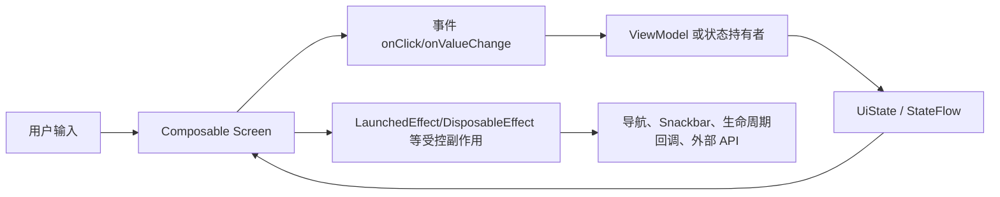
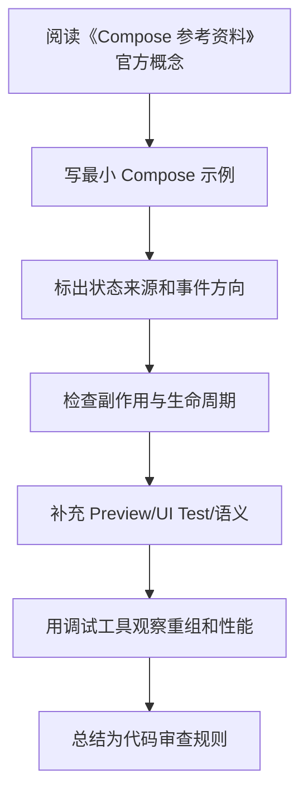

# 10. 参考资料

<!-- lecture-notes:integrated-v2 -->

## 讲义导读：把 Compose 放进声明式 UI 主线

这一章讲的是 **10. 参考资料**。学习 Compose 时不要把它当成“用 Kotlin 写 XML”，而要把它理解成一套声明式 UI 系统：状态变化驱动重组，Composable 描述界面，事件向上流动，副作用被 Effect API 和生命周期约束。

### 一句话先懂

参考资料页的价值是告诉你遇到 Compose 版本、状态、副作用、性能、测试问题时优先查哪类官方资料。

### 通俗类比

参考资料像维修手册目录：BOM 查版本，state 查状态，side-effects 查副作用，performance 查卡顿，testing 查验证。

类比只是帮助建立直觉，不能替代准确概念。真正写 Compose 时，要回到状态所有权、重组范围、副作用 key、生命周期收集、参数稳定性、语义树、导航状态和版本兼容上。一个页面能显示只是第一步，能在旋转、返回栈、长列表、无障碍、测试和 release 环境下稳定工作才算可靠。

### 本章学习主线

1. **先看状态来源**：状态由谁拥有，是 local state、rememberSaveable、ViewModel、Repository 还是导航参数？
2. **再看重组边界**：哪些状态读取会触发哪些 Composable 重组，参数是否稳定，列表 key 是否可靠？
3. **然后看事件流向**：用户点击、输入、滚动如何上行，ViewModel 如何处理，UiState 如何回到 UI？
4. **接着看副作用**：网络请求、Flow 收集、导航、Snackbar、资源监听是否放在正确 Effect 和生命周期里？
5. **最后看验证**：能否用 Preview、UI Test、Layout Inspector、重组观察、Macrobenchmark 或真机复现和验证？

### 概念怎么学才不容易忘

遇到 Compose API，建议按“它读什么状态 -> 会不会重组 -> 有没有副作用 -> 谁负责保存 -> 如何测试”五步理解。比如 remember 只记住组合内状态，rememberSaveable 处理可保存状态，LaunchedEffect 会随 key 重启，LazyColumn 需要稳定 key，collectAsStateWithLifecycle 负责生命周期感知收集。

### 最小实践任务

把资料按版本配置、核心模型、状态副作用、导航架构、性能测试、无障碍互操作分类，并写出适用问题。

实践时要保留错误版本。Compose 很多坑不会直接编译失败，而是表现为重复请求、状态丢失、列表错位、测试找不到节点、重组过多或 TalkBack 读不清。把错误写法、现象、定位工具和修复方式记录下来，比只保存正确代码更有价值。

### 读完本章应该能产出

能根据问题选择官方文档；能区分过时博客和当前推荐实践；能为笔记保留可追溯引用。

> 本节是全篇讲义化改写的阅读入口，后续正文中的定义、步骤、示例和参考资料都应围绕这条学习主线来理解。
最后调研时间：2026-06-13

## 官方资料

- [Android Developers：Jetpack Compose 总入口](https://developer.android.com/develop/ui/compose)  

- [Android Developers：Compose setup / BOM](https://developer.android.com/develop/ui/compose/bom)  

- [Android Developers：Compose BOM to library version mapping](https://developer.android.com/develop/ui/compose/bom/bom-mapping)  

- [Android Developers：Thinking in Compose](https://developer.android.com/develop/ui/compose/mental-model)  

- [Android Developers：Lifecycle of composables](https://developer.android.com/develop/ui/compose/lifecycle)  

- [Android Developers：State and Jetpack Compose](https://developer.android.com/develop/ui/compose/state)  

- [Android Developers：State hoisting](https://developer.android.com/develop/ui/compose/state-hoisting)  

- [Android Developers：Side-effects in Compose](https://developer.android.com/develop/ui/compose/side-effects)  

- [Android Developers：Save UI state](https://developer.android.com/develop/ui/compose/state-saving)  

- [Android Developers：Modifiers](https://developer.android.com/develop/ui/compose/modifiers)  

- [Android Developers：Layouts in Compose](https://developer.android.com/develop/ui/compose/layouts)  

- [Android Developers：Lists and grids](https://developer.android.com/develop/ui/compose/lists)  

- [Android Developers：Material Design 3 in Compose](https://developer.android.com/develop/ui/compose/designsystems/material3)  

- [Android Developers：Navigation with Compose](https://developer.android.com/develop/ui/compose/navigation)  

- [Android Developers：Navigation type safety](https://developer.android.com/guide/navigation/design/type-safety)  

- [Android Developers：Architecture in Compose](https://developer.android.com/develop/ui/compose/architecture)  

- [Android Developers：Paging with Compose](https://developer.android.com/topic/libraries/architecture/paging/v3-paged-data#compose)  

- [Android Developers：Performance in Compose](https://developer.android.com/develop/ui/compose/performance)  

- [Android Developers：Diagnose stability issues](https://developer.android.com/develop/ui/compose/performance/stability/diagnose)  

- [Android Developers：Fix stability issues](https://developer.android.com/develop/ui/compose/performance/stability/fix)  

- [Android Developers：Strong skipping mode](https://developer.android.com/develop/ui/compose/performance/stability/strongskipping)  

- [Android Developers：Phases](https://developer.android.com/develop/ui/compose/phases)  

- [Android Developers：Testing Compose](https://developer.android.com/develop/ui/compose/testing)  

- [Android Developers：Synchronize Compose tests](https://developer.android.com/develop/ui/compose/testing/synchronization)  

- [Android Developers：Accessibility in Compose](https://developer.android.com/develop/ui/compose/accessibility)  

- [Android Developers：Interoperability APIs](https://developer.android.com/develop/ui/compose/migrate/interoperability-apis)  

- [Android Developers：Macrobenchmark overview](https://developer.android.com/topic/performance/benchmarking/macrobenchmark-overview)  

- [Android Developers：Baseline profiles overview](https://developer.android.com/topic/performance/baselineprofiles/overview)  

- [Kotlin：Compose compiler Gradle plugin](https://kotlinlang.org/docs/compose-compiler-migration-guide.html)  

- [Kotlin：Compose compiler options](https://kotlinlang.org/docs/compose-compiler-options.html)  

## 社区与实践资料

这些资料主要用于补充实战坑点、中文解释、排错经验。版本和 API 事实仍应以官方文档为准。

- [掘金：Jetpack Compose 重组、性能优化、状态管理相关文章](https://juejin.cn/search?query=Jetpack%20Compose%20%E9%87%8D%E7%BB%84%20%E6%80%A7%E8%83%BD)  

- [掘金：Jetpack Compose 副作用相关文章](https://juejin.cn/search?query=Jetpack%20Compose%20LaunchedEffect%20DisposableEffect)  

- [掘金：Jetpack Compose Navigation Compose 类型安全路由相关文章](https://juejin.cn/search?query=Jetpack%20Compose%20Navigation%20%E7%B1%BB%E5%9E%8B%E5%AE%89%E5%85%A8)  

- [CSDN：Jetpack Compose 状态管理、remember、rememberSaveable 实践文章](https://so.csdn.net/so/search?q=Jetpack%20Compose%20%E7%8A%B6%E6%80%81%E7%AE%A1%E7%90%86%20rememberSaveable)  

- [CSDN：Jetpack Compose LazyColumn key 与性能问题](https://so.csdn.net/so/search?q=Jetpack%20Compose%20LazyColumn%20key%20%E6%80%A7%E8%83%BD)  

- [CSDN：Jetpack Compose LaunchedEffect、rememberUpdatedState、副作用实践](https://so.csdn.net/so/search?q=Jetpack%20Compose%20LaunchedEffect%20rememberUpdatedState)  

- [博客园：Jetpack Compose 学习笔记和实战总结](https://zzk.cnblogs.com/s/blogpost?w=Jetpack%20Compose%20%E5%AD%A6%E4%B9%A0%E7%AC%94%E8%AE%B0)  

- [SegmentFault：Jetpack Compose 常见问题](https://segmentfault.com/search?q=Jetpack%20Compose)  

- [知乎：Jetpack Compose 实战与性能排查讨论](https://www.zhihu.com/search?type=content&q=Jetpack%20Compose%20%E6%80%A7%E8%83%BD)  

## 继续深入的关键词

- `Compose Runtime Slot Table`
- `Compose Snapshot system`
- `Compose Compiler stability`
- `Strong skipping mode`
- `Compose LazyColumn performance`
- `collectAsStateWithLifecycle`
- `rememberUpdatedState`
- `snapshotFlow derivedStateOf`
- `Navigation Compose type safe routes`
- `Compose Macrobenchmark Baseline Profile`
- `SavedStateHandle toRoute`
- `Paging Compose itemKey itemContentType`
- `Compose testing mainClock`

---

## 万字精讲扩展（2026-06-16 更新）
> Last researched: 2026-06-16。本文补充内容以 Jetpack Compose 官方文档和 Android Developers 实践资料为主；涉及 Compose Compiler、Kotlin、Navigation、Material3、Lifecycle、Performance 的版本细节，应在真实项目中继续核对最新官方 release notes。

### 本章在 Compose 学习路线中的位置

《Compose 参考资料》是 Compose 能力闭环中的一个节点。Compose 学习不能只停留在静态页面，还要覆盖状态、事件、副作用、生命周期、导航、性能、测试、无障碍和 View 互操作。一个 composable 写出来能显示，只说明第一步完成；它能在重组、旋转、返回栈恢复、无障碍服务、release 构建、长列表和低端设备上稳定工作，才说明写法可靠。

本章学习完成后，建议至少达到三个标准。第一，能用 Compose 心智模型解释本章 API 的作用和边界。第二，能写出最小可运行例子，并指出状态来源、事件方向和副作用生命周期。第三，能制造一个常见错误并用工具或测试验证修复效果。Compose 是声明式 UI，但工程质量仍然依赖清晰边界和可验证实践。

### 参考资料类笔记的精讲重点

参考资料要分层使用。官方文档用于确认 API 语义、版本要求、推荐实践和迁移方向；Android Developers Blog 和官方 Medium 文章适合理解新特性背景；源码和 release notes 适合排查版本问题；社区文章适合了解真实项目坑点，但不能替代官方文档。对于 Compose 这种快速演进技术，资料是否过期非常关键。

建议每条资料记录主题、适用版本、解决的问题和是否已经在项目验证。不要只收集链接，要把链接转化为规则和代码片段。例如“状态提升到最低共同祖先”“Effect key 控制生命周期”“Lazy item 使用稳定 key”“Flow 使用 collectAsStateWithLifecycle”都是可执行规则。

### Compose 的核心心智模型：UI 是状态的函数，但函数必须足够纯

Compose 最重要的转变不是“用 Kotlin 写 UI”，而是把 UI 看成状态的描述。一个 composable 根据输入参数和读取到的状态描述界面，状态变化后框架触发重组，重新执行需要更新的 composable。这个模型要求 composable 尽量幂等、快速、无副作用。官方 Thinking in Compose 文档特别强调，重组可能频繁发生，也可能被跳过或取消，因此不要在 composable 主体里直接执行网络请求、导航、写数据库、启动协程或修改外部对象。需要副作用时，要使用受 Compose 生命周期管理的 Effect API。

学习 Compose 要同时区分三件事：composition、recomposition 和 drawing/layout。Composition 是把 composable 调用组织成 UI 树的过程；recomposition 是状态变化后重新执行部分 composable；layout/draw 是测量、摆放和绘制阶段。性能问题不一定来自重组，可能来自布局太复杂、绘制太重、列表 item 没有 key、状态读取范围太宽、参数不稳定、图片加载或主线程阻塞。只把“少重组”当成唯一目标，会误判很多问题。

### 状态、事件、副作用的单向流



Figure: Compose 单向数据流和副作用边界，综合 Android 官方 State、State Hoisting、Side-effects、Lifecycle in Compose 文档整理。

这个图的关键是方向。UI 读取状态并发出事件，状态持有者处理事件并产生新状态，UI 根据新状态重组。副作用不应该散落在 composable 主体里，而要放在能够表达启动、取消、更新和清理时机的 Effect API 中。导航、Snackbar、权限请求、监听器注册、Flow 收集、动画启动、外部 View 生命周期绑定，都属于需要明确边界的动作。

### Compose 学习必须建立版本意识

Compose 与 Kotlin、Compose Compiler、Android Gradle Plugin、Material3、Navigation、Lifecycle、Activity Compose 等库存在版本关系。Kotlin 2.0 之后 Compose Compiler 移入 Kotlin 仓库，旧项目仍可能遇到 compiler extension 与 Kotlin 版本不匹配的问题。学习笔记里不要只写“加某个依赖”，还要写 BOM、Kotlin 插件、Compose Compiler、Navigation 版本、Lifecycle Compose 版本以及是否使用类型安全导航、强跳过模式等条件。遇到构建错误时，优先查官方兼容表和 release notes。

### 最小可验证学习法

每个 Compose 主题都应该写一个最小验证例子。学习状态时，写一个文本输入、筛选列表或展开面板；学习副作用时，写 Snackbar、定时器、生命周期监听或 Flow 收集；学习 Lazy 列表时，写稳定 key、滚动位置、分页占位和 item 状态；学习性能时，写一个会过度重组的例子，再用状态拆分、remember、derivedStateOf 或稳定参数修正；学习测试时，用 semantics 查找节点并验证状态变化。只有能制造错误并修复，才算真正理解。

### 核心知识点逐条精讲

#### 1. 官方资料

在《Compose 参考资料》中，`官方资料` 不应该只理解成一个 API 名称，而要放进 Compose 的组合、重组、状态和副作用模型里看。学习时先问：它读取什么状态，谁拥有这些状态，变化后会让哪些 composable 重组，是否需要保存到配置变化后，是否会触发外部副作用，是否会影响测试语义或无障碍。能回答这些问题，才说明你真正按 Compose 的方式思考。

实现 ` 官方资料 ` 时，建议先写一个最小 demo，再写一个错误版本。比如状态提升可以写“子组件内部 remember 导致外部无法控制”的错误例子；LaunchedEffect 可以写“key 变化导致重复请求”的错误例子；Lazy key 可以写“插入 item 后状态错位”的错误例子；Navigation 可以写“传复杂对象导致恢复困难”的错误例子。制造错误比只看正确代码更能建立边界感。

代码审查时要把 ` 官方资料 ` 转成检查项：状态是否单一来源，参数是否稳定，Modifier 是否作为参数传入，副作用是否有正确 key 和清理逻辑，Flow 是否生命周期感知收集，Lazy item 是否有稳定 key，语义是否可测试且可访问，release 构建和性能工具是否验证过。Compose 项目的质量通常取决于这些细节是否一致执行。

#### 2. 社区实践

在《Compose 参考资料》中，`社区实践` 不应该只理解成一个 API 名称，而要放进 Compose 的组合、重组、状态和副作用模型里看。学习时先问：它读取什么状态，谁拥有这些状态，变化后会让哪些 composable 重组，是否需要保存到配置变化后，是否会触发外部副作用，是否会影响测试语义或无障碍。能回答这些问题，才说明你真正按 Compose 的方式思考。

实现 ` 社区实践 ` 时，建议先写一个最小 demo，再写一个错误版本。比如状态提升可以写“子组件内部 remember 导致外部无法控制”的错误例子；LaunchedEffect 可以写“key 变化导致重复请求”的错误例子；Lazy key 可以写“插入 item 后状态错位”的错误例子；Navigation 可以写“传复杂对象导致恢复困难”的错误例子。制造错误比只看正确代码更能建立边界感。

代码审查时要把 ` 社区实践 ` 转成检查项：状态是否单一来源，参数是否稳定，Modifier 是否作为参数传入，副作用是否有正确 key 和清理逻辑，Flow 是否生命周期感知收集，Lazy item 是否有稳定 key，语义是否可测试且可访问，release 构建和性能工具是否验证过。Compose 项目的质量通常取决于这些细节是否一致执行。

#### 3. 版本兼容

在《Compose 参考资料》中，`版本兼容` 不应该只理解成一个 API 名称，而要放进 Compose 的组合、重组、状态和副作用模型里看。学习时先问：它读取什么状态，谁拥有这些状态，变化后会让哪些 composable 重组，是否需要保存到配置变化后，是否会触发外部副作用，是否会影响测试语义或无障碍。能回答这些问题，才说明你真正按 Compose 的方式思考。

实现 ` 版本兼容 ` 时，建议先写一个最小 demo，再写一个错误版本。比如状态提升可以写“子组件内部 remember 导致外部无法控制”的错误例子；LaunchedEffect 可以写“key 变化导致重复请求”的错误例子；Lazy key 可以写“插入 item 后状态错位”的错误例子；Navigation 可以写“传复杂对象导致恢复困难”的错误例子。制造错误比只看正确代码更能建立边界感。

代码审查时要把 ` 版本兼容 ` 转成检查项：状态是否单一来源，参数是否稳定，Modifier 是否作为参数传入，副作用是否有正确 key 和清理逻辑，Flow 是否生命周期感知收集，Lazy item 是否有稳定 key，语义是否可测试且可访问，release 构建和性能工具是否验证过。Compose 项目的质量通常取决于这些细节是否一致执行。

#### 4. 深入关键词

在《Compose 参考资料》中，`深入关键词` 不应该只理解成一个 API 名称，而要放进 Compose 的组合、重组、状态和副作用模型里看。学习时先问：它读取什么状态，谁拥有这些状态，变化后会让哪些 composable 重组，是否需要保存到配置变化后，是否会触发外部副作用，是否会影响测试语义或无障碍。能回答这些问题，才说明你真正按 Compose 的方式思考。

实现 ` 深入关键词 ` 时，建议先写一个最小 demo，再写一个错误版本。比如状态提升可以写“子组件内部 remember 导致外部无法控制”的错误例子；LaunchedEffect 可以写“key 变化导致重复请求”的错误例子；Lazy key 可以写“插入 item 后状态错位”的错误例子；Navigation 可以写“传复杂对象导致恢复困难”的错误例子。制造错误比只看正确代码更能建立边界感。

代码审查时要把 ` 深入关键词 ` 转成检查项：状态是否单一来源，参数是否稳定，Modifier 是否作为参数传入，副作用是否有正确 key 和清理逻辑，Flow 是否生命周期感知收集，Lazy item 是否有稳定 key，语义是否可测试且可访问，release 构建和性能工具是否验证过。Compose 项目的质量通常取决于这些细节是否一致执行。

#### 5. 资料维护方法

在《Compose 参考资料》中，`资料维护方法` 不应该只理解成一个 API 名称，而要放进 Compose 的组合、重组、状态和副作用模型里看。学习时先问：它读取什么状态，谁拥有这些状态，变化后会让哪些 composable 重组，是否需要保存到配置变化后，是否会触发外部副作用，是否会影响测试语义或无障碍。能回答这些问题，才说明你真正按 Compose 的方式思考。

实现 ` 资料维护方法 ` 时，建议先写一个最小 demo，再写一个错误版本。比如状态提升可以写“子组件内部 remember 导致外部无法控制”的错误例子；LaunchedEffect 可以写“key 变化导致重复请求”的错误例子；Lazy key 可以写“插入 item 后状态错位”的错误例子；Navigation 可以写“传复杂对象导致恢复困难”的错误例子。制造错误比只看正确代码更能建立边界感。

代码审查时要把 ` 资料维护方法 ` 转成检查项：状态是否单一来源，参数是否稳定，Modifier 是否作为参数传入，副作用是否有正确 key 和清理逻辑，Flow 是否生命周期感知收集，Lazy item 是否有稳定 key，语义是否可测试且可访问，release 构建和性能工具是否验证过。Compose 项目的质量通常取决于这些细节是否一致执行。


### 场景化学习与排错表

| 主题 | 推荐动作 | 常见风险 | 验证方式 |
| :--- | :--- | :--- | :--- |
| 官方资料 | 用最小 demo 验证正确写法和错误写法，再放入完整页面 | 重组重复执行、副作用 key 错、状态源重复、稳定性误判、测试语义缺失 | Preview、Compose UI Test、Layout Inspector、重组计数、Macrobenchmark、真机验证 |
| 社区实践 | 用最小 demo 验证正确写法和错误写法，再放入完整页面 | 重组重复执行、副作用 key 错、状态源重复、稳定性误判、测试语义缺失 | Preview、Compose UI Test、Layout Inspector、重组计数、Macrobenchmark、真机验证 |
| 版本兼容 | 用最小 demo 验证正确写法和错误写法，再放入完整页面 | 重组重复执行、副作用 key 错、状态源重复、稳定性误判、测试语义缺失 | Preview、Compose UI Test、Layout Inspector、重组计数、Macrobenchmark、真机验证 |
| 深入关键词 | 用最小 demo 验证正确写法和错误写法，再放入完整页面 | 重组重复执行、副作用 key 错、状态源重复、稳定性误判、测试语义缺失 | Preview、Compose UI Test、Layout Inspector、重组计数、Macrobenchmark、真机验证 |
| 资料维护方法 | 用最小 demo 验证正确写法和错误写法，再放入完整页面 | 重组重复执行、副作用 key 错、状态源重复、稳定性误判、测试语义缺失 | Preview、Compose UI Test、Layout Inspector、重组计数、Macrobenchmark、真机验证 |

这个表的重点是“能复现、能观察、能修复”。Compose 很多问题不会编译报错，而是表现为重组过多、状态丢失、事件重复、列表错位、TalkBack 读不清、测试找不到节点或某些机型上卡顿。只有建立可观察的验证方法，才能避免靠经验猜。

### 本章建议工作流



Figure: 《Compose 参考资料》学习工作流，综合 Android 官方 Compose mental model、state、side-effects、performance、accessibility 和 testing 资料整理。

这个流程适合所有 Compose 主题。先理解概念，再落到小例子，再放回真实页面，再用测试和工具验证。不要在没有状态图的情况下写复杂 UI，也不要在没有测量的情况下做性能优化。

### 常见误区和纠正方法

- 误区：在 composable 主体里执行副作用。纠正：网络、导航、Snackbar、注册监听器、启动协程等动作应放入合适 Effect API 或 ViewModel 事件处理中。
- 误区：所有状态都放 ViewModel。纠正：纯 UI 元素状态可以靠近使用处，屏幕级和业务相关状态再提升到 ViewModel。
- 误区：所有地方都加 remember。纠正：remember 是保存计算或对象的工具，不是性能万能药；先测量，再判断是否需要。
- 误区：Lazy 列表不写 key。纠正：可变列表、插入删除、分页和 item 内状态都应使用稳定 key，避免状态错位。
- 误区：测试只靠 testTag。纠正：优先设计有意义的语义，testTag 作为补充；无障碍和测试都依赖语义质量。
- 误区：忽略版本兼容。纠正：Compose Compiler、Kotlin、BOM、Material3、Navigation 和 Lifecycle Compose 都要按官方版本说明维护。

### 与相邻章节的关系

《Compose 参考资料》应与状态、副作用、架构、性能和测试章节交叉阅读。状态决定重组，副作用决定外部动作是否可控，架构决定状态和事件放在哪里，性能决定重组和布局是否可接受，测试和无障碍决定 UI 是否能被可靠验证和使用。任何一个章节单独学习都不够，最终要在一个完整页面中串起来。

### 实操训练和复盘模板

1. 围绕 `官方资料` 写一个最小页面：包含正确实现、故意错误实现、观察结果和修复总结。
2. 围绕 `社区实践` 写一个最小页面：包含正确实现、故意错误实现、观察结果和修复总结。
3. 围绕 `版本兼容` 写一个最小页面：包含正确实现、故意错误实现、观察结果和修复总结。
4. 围绕 `深入关键词` 写一个最小页面：包含正确实现、故意错误实现、观察结果和修复总结。
5. 围绕 `资料维护方法` 写一个最小页面：包含正确实现、故意错误实现、观察结果和修复总结。

建议每个 Compose 练习都记录：

```text
练习名称：
本章主题：Compose 参考资料
Compose / Kotlin / AGP / BOM 版本：
状态来源：local state / rememberSaveable / ViewModel / Repository
事件流向：UI -> ViewModel / state holder -> UiState -> UI
副作用：Effect API、key、取消和清理逻辑
测试入口：semantics、testTag、Preview、UI Test
性能观察：重组范围、Lazy key、稳定性、主线程耗时
失败场景：旋转、返回栈恢复、快速点击、断网、长列表、字体放大、TalkBack
结论：以后项目中采用的规则
```

这个模板的意义是把 Compose 学习从“API 记忆”推进到“页面质量”。真实项目中的 Compose 问题通常跨越状态、生命周期、导航、性能和无障碍，复盘时必须把这些因素放在一起看。


## 2026 Compose 版本核对补充

Compose 的版本关系必须单独核对。Android Developers 当前资料显示，Compose BOM 用来统一 Compose 族库版本；Kotlin 2.0 及以后推荐使用 Compose Compiler Gradle plugin，Compose compiler 已迁移到 Kotlin 仓库；Navigation 2.8.0 起提供类型安全导航 API；2026 年 4 月 Compose 发布包含 core Compose 1.11 相关更新。实际项目中不要只复制依赖片段，而要同时核对 Kotlin、AGP、Compose BOM、Material3、Navigation、Lifecycle、Activity Compose、测试库和 Kotlin Serialization 插件版本。

排查 Compose 问题时，先把问题归类：构建失败通常查 Kotlin/Compiler/BOM/AGP；状态异常查 state owner、rememberSaveable、ViewModel 和导航返回栈；重复请求查副作用 key 和生命周期；列表错位查 Lazy key；卡顿查状态读取范围、稳定性、布局绘制和 Baseline Profile；测试失败查 semantics、testTag、异步等待和动画时钟。这样比泛泛地说“Compose 有 bug”更可操作。
## 参考资料与延伸阅读
- [Official / Android] Compose BOM: https://developer.android.com/develop/ui/compose/bom
- [Official / Android] Set up Compose dependencies and compiler: https://developer.android.com/develop/ui/compose/setup-compose-dependencies-and-compiler
- [Official / Android] Compose release notes: https://developer.android.com/jetpack/androidx/releases/compose
- [Official / Android] Type safety in Navigation Compose: https://developer.android.com/guide/navigation/design/type-safety
- [Official / Android] Migrating to type-safe destinations: https://developer.android.com/guide/navigation/type-safe-destinations
- [Official / Kotlin] Compose compiler migration guide: https://kotlinlang.org/docs/compose-compiler-migration-guide.html
- [Official / Android Developers Blog] Jetpack Compose April 2026 updates: https://android-developers.googleblog.com/2026/04/jetpack-compose-april-2026-updates.html
- [Official / Android Developers Blog] Jetpack Compose compiler moving to Kotlin repository: https://android-developers.googleblog.com/2024/04/jetpack-compose-compiler-moving-to-kotlin-repository.html
- [Official / Android] Jetpack Compose documentation: https://developer.android.com/develop/ui/compose
- [Official / Android] Thinking in Compose: https://developer.android.com/develop/ui/compose/mental-model
- [Official / Android] State and Jetpack Compose: https://developer.android.com/develop/ui/compose/state
- [Official / Android] Where to hoist state: https://developer.android.com/develop/ui/compose/state-hoisting
- [Official / Android] Side-effects in Compose: https://developer.android.com/develop/ui/compose/side-effects
- [Official / Android] Lifecycle in Jetpack Compose: https://developer.android.com/topic/libraries/architecture/lifecycle
- [Official / Android] Lazy lists and lazy grids: https://developer.android.com/develop/ui/compose/lists
- [Official / Android] Compose performance: https://developer.android.com/develop/ui/compose/performance
- [Official / Android] Stability in Compose: https://developer.android.com/develop/ui/compose/performance/stability
- [Official / Android] Strong skipping mode: https://developer.android.com/develop/ui/compose/performance/stability/strongskipping
- [Official / Android] Accessibility in Jetpack Compose: https://developer.android.com/develop/ui/compose/accessibility
- [Official / Android] Semantics in Compose: https://developer.android.com/develop/ui/compose/accessibility/semantics
- [Official / Android] Type safety in Navigation Compose: https://developer.android.com/guide/navigation/design/type-safety
- [Official / Android] Compose to Kotlin Compatibility Map: https://developer.android.com/jetpack/androidx/releases/compose-kotlin
- [Official / Android] Compose Compiler release notes: https://developer.android.com/jetpack/androidx/releases/compose-compiler
- [Official / Android Developers Blog] Jetpack Compose compiler moving to the Kotlin repository: https://android-developers.googleblog.com/2024/04/jetpack-compose-compiler-moving-to-kotlin-repository.html
- [Official / Android Developers Blog] What's New in Jetpack Compose: https://android-developers.googleblog.com/2025/05/whats-new-in-jetpack-compose.html
- [Official / Android Developers Blog] Strong Skipping Mode Explained: https://medium.com/androiddevelopers/jetpack-compose-strong-skipping-mode-explained-cbdb2aa4b900
- [Official / Android Developers Blog] Fundamentals of Compose layouts and modifiers: https://medium.com/androiddevelopers/fundamentals-of-compose-layouts-and-modifiers-64d794664b66
- [Official / Android Developers Blog] Consuming flows safely in Jetpack Compose: https://medium.com/androiddevelopers/consuming-flows-safely-in-jetpack-compose-cde014d0d5a3
- [Official / Android Developers Blog] Navigation Compose meet Type Safety: https://medium.com/androiddevelopers/navigation-compose-meet-type-safety-e081fb3cf2f8
- [Community / CSDN] Jetpack Compose 学习笔记检索入口: https://so.csdn.net/so/search?q=Jetpack%20Compose%20%E5%AD%A6%E4%B9%A0%E7%AC%94%E8%AE%B0
- [Community / 博客园] Compose 状态与副作用实践检索入口: https://zzk.cnblogs.com/s/blogpost?Keywords=Jetpack%20Compose%20%E7%8A%B6%E6%80%81%20%E5%89%AF%E4%BD%9C%E7%94%A8
- [Community / 掘金] Compose 性能、导航、架构实践检索入口: https://juejin.cn/search?query=Jetpack%20Compose%20%E6%80%A7%E8%83%BD%20%E5%AF%BC%E8%88%AA%20%E6%9E%B6%E6%9E%84&type=0
