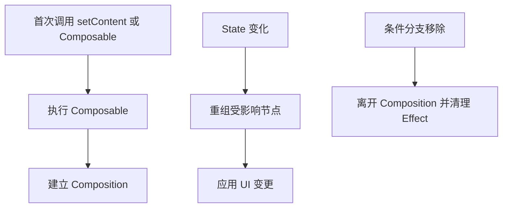
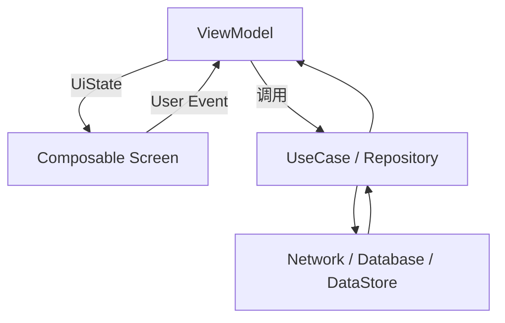
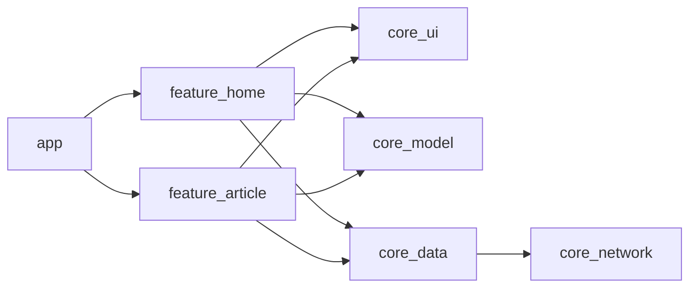
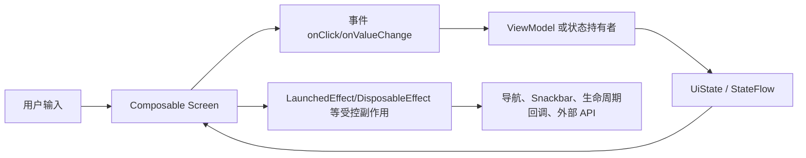
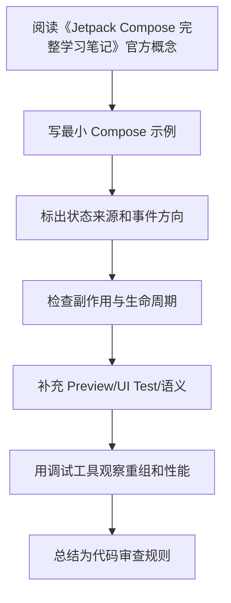

# Jetpack Compose 完整学习笔记

<!-- lecture-notes:integrated-v2 -->

## 讲义导读：把 Compose 放进声明式 UI 主线

这一章讲的是 **Jetpack Compose 完整学习笔记**。学习 Compose 时不要把它当成“用 Kotlin 写 XML”，而要把它理解成一套声明式 UI 系统：状态变化驱动重组，Composable 描述界面，事件向上流动，副作用被 Effect API 和生命周期约束。

### 一句话先懂

完整笔记要把 Compose 当成工程体系，而不只是 UI 写法：状态、架构、副作用、性能、测试、版本和迁移都要连起来。

### 通俗类比

完整 Compose 应用像一台仪表完整的机器：UI 是面板，状态是仪表读数，事件是按钮，副作用是外部执行器，测试和性能工具是检测设备。

类比只是帮助建立直觉，不能替代准确概念。真正写 Compose 时，要回到状态所有权、重组范围、副作用 key、生命周期收集、参数稳定性、语义树、导航状态和版本兼容上。一个页面能显示只是第一步，能在旋转、返回栈、长列表、无障碍、测试和 release 环境下稳定工作才算可靠。

### 本章学习主线

1. **先看状态来源**：状态由谁拥有，是 local state、rememberSaveable、ViewModel、Repository 还是导航参数？
2. **再看重组边界**：哪些状态读取会触发哪些 Composable 重组，参数是否稳定，列表 key 是否可靠？
3. **然后看事件流向**：用户点击、输入、滚动如何上行，ViewModel 如何处理，UiState 如何回到 UI？
4. **接着看副作用**：网络请求、Flow 收集、导航、Snackbar、资源监听是否放在正确 Effect 和生命周期里？
5. **最后看验证**：能否用 Preview、UI Test、Layout Inspector、重组观察、Macrobenchmark 或真机复现和验证？

### 概念怎么学才不容易忘

遇到 Compose API，建议按“它读什么状态 -> 会不会重组 -> 有没有副作用 -> 谁负责保存 -> 如何测试”五步理解。比如 remember 只记住组合内状态，rememberSaveable 处理可保存状态，LaunchedEffect 会随 key 重启，LazyColumn 需要稳定 key，collectAsStateWithLifecycle 负责生命周期感知收集。

### 最小实践任务

选一个完整页面做复盘：画状态图、事件图、副作用表、导航图、测试用例和性能检查点。

实践时要保留错误版本。Compose 很多坑不会直接编译失败，而是表现为重复请求、状态丢失、列表错位、测试找不到节点、重组过多或 TalkBack 读不清。把错误写法、现象、定位工具和修复方式记录下来，比只保存正确代码更有价值。

### 读完本章应该能产出

能系统解释 Compose 架构；能从 demo 页面推进到可维护页面；能用官方资料和工具验证关键结论。

> 本节是全篇讲义化改写的阅读入口，后续正文中的定义、步骤、示例和参考资料都应围绕这条学习主线来理解。
最后调研时间：2026-06-14  
适用范围：Android 原生 Jetpack Compose。默认技术栈为 Kotlin 2.x、Android Gradle Plugin、Compose BOM、Material 3、Navigation Compose、Lifecycle Compose、ViewModel、Kotlin Coroutines/Flow。  
定位：这是一份把本目录 00-11 章内容统一整理、补充后的完整学习笔记。它适合从 Compose 入门、工程落地、性能排查到上线检查连续阅读。

## 1. 学习目标

学完这份笔记后，应该能完成这些事情：

- 理解 Compose 的声明式 UI 模型：`UI = f(state)`。
- 搭建一个使用 Kotlin 2.x、Compose BOM、Material 3、Navigation Compose 的 Android 页面模块。
- 判断状态应该放在 `remember`、`rememberSaveable`、普通 state holder、ViewModel、`SavedStateHandle`、Repository 还是数据层。
- 写出 `Route + Screen + ViewModel + UiState + Event/Effect` 的页面结构。
- 正确使用 `LaunchedEffect`、`DisposableEffect`、`rememberUpdatedState`、`produceState`、`derivedStateOf`、`snapshotFlow`。
- 用 Lazy 列表的 `key`、`contentType`、稳定尺寸、UI model 预处理等手段减少滚动问题。
- 使用类型安全 Navigation Compose 传递简单参数，并避免把大对象塞进导航参数。
- 使用 Compose UI Test、语义树、无障碍信息和 Macrobenchmark 做基本质量保障。
- 能排查常见的版本、重组、状态丢失、副作用重复、列表卡顿和互操作问题。

## 2. Compose 是什么

Jetpack Compose 是 Android 的现代声明式 UI 工具包。传统 View 系统通常是“创建 View，再命令式修改 View 属性”；Compose 更接近“根据当前状态描述 UI 应该长什么样”。

传统 View 思路：

```kotlin
textView.text = user.name
button.isEnabled = formValid
```

Compose 思路：

```kotlin
@Composable
fun ProfileScreen(
    user: User,
    formValid: Boolean,
    onSave: () -> Unit
) {
    Text(user.name)
    Button(enabled = formValid, onClick = onSave) {
        Text("保存")
    }
}
```

当 `user` 或 `formValid` 变化时，Compose 重新执行受影响的 Composable，计算新的 UI 描述，并把变化应用到底层 UI 树。

核心公式：

```text
UI = f(state)
```

这个公式带来几个工程原则：

- UI 只描述当前状态，不直接保存业务真相。
- 状态变化驱动 UI 更新，而不是手动找 View 改属性。
- Composable 可能多次执行、跳过、取消、重新执行，所以函数体中不要写不可控副作用。
- 状态向下传递，事件向上传递。
- UI 组件应尽量无状态，业务状态交给 ViewModel 或更外层状态持有者。

## 3. Compose 主要模块

| 模块 | 作用 | 常见依赖 |
|---|---|---|
| Compose Runtime | 管理 Composition、状态读取、重组、Effect | `androidx.compose.runtime` |
| Compose UI | 布局、绘制、输入、语义树、Modifier | `androidx.compose.ui` |
| Foundation | 基础组件、Lazy 列表、手势、滚动 | `androidx.compose.foundation` |
| Material 3 | Material Design 3 组件和主题 | `androidx.compose.material3` |
| Activity Compose | 在 Activity 中启动 Compose | `androidx.activity:activity-compose` |
| Lifecycle Compose | 生命周期感知 Flow 收集 | `androidx.lifecycle:lifecycle-runtime-compose` |
| ViewModel Compose | 在 Compose 中获取 ViewModel | `androidx.lifecycle:lifecycle-viewmodel-compose` |
| Navigation Compose | Compose 页面导航 | `androidx.navigation:navigation-compose` |
| Paging Compose | Compose 分页列表 | `androidx.paging:paging-compose` |
| UI Test | Compose 测试 API | `androidx.compose.ui:ui-test-junit4` |

## 4. 环境与 Gradle 配置

新项目建议使用 Compose BOM 管理 Compose 族依赖版本。BOM 的作用是统一 `ui`、`foundation`、`material3` 等 Compose artifact 的兼容版本。官方 BOM 文档强调：使用 BOM 后，Compose 库依赖通常不需要再写单独版本。

`settings.gradle.kts`：

```kotlin
pluginManagement {
    repositories {
        google()
        mavenCentral()
        gradlePluginPortal()
    }
}

dependencyResolutionManagement {
    repositoriesMode.set(RepositoriesMode.FAIL_ON_PROJECT_REPOS)
    repositories {
        google()
        mavenCentral()
    }
}
```

根工程 `build.gradle.kts`：

```kotlin
plugins {
    id("com.android.application") version "<agp-version>" apply false
    id("org.jetbrains.kotlin.android") version "<kotlin-version>" apply false
    id("org.jetbrains.kotlin.plugin.compose") version "<kotlin-version>" apply false
}
```

模块 `app/build.gradle.kts`：

```kotlin
plugins {
    id("com.android.application")
    id("org.jetbrains.kotlin.android")
    id("org.jetbrains.kotlin.plugin.compose")
}

android {
    namespace = "com.example.composeapp"
    compileSdk = 36

    defaultConfig {
        applicationId = "com.example.composeapp"
        minSdk = 23
        targetSdk = 36
        versionCode = 1
        versionName = "1.0"
    }

    buildFeatures {
        compose = true
    }
}

dependencies {
    val composeBom = platform("androidx.compose:compose-bom:2026.05.00")
    implementation(composeBom)
    androidTestImplementation(composeBom)

    implementation("androidx.activity:activity-compose")
    implementation("androidx.compose.ui:ui")
    implementation("androidx.compose.ui:ui-tooling-preview")
    implementation("androidx.compose.foundation:foundation")
    implementation("androidx.compose.material3:material3")
    implementation("androidx.lifecycle:lifecycle-runtime-compose")
    implementation("androidx.lifecycle:lifecycle-viewmodel-compose")
    implementation("androidx.navigation:navigation-compose")

    debugImplementation("androidx.compose.ui:ui-tooling")
    debugImplementation("androidx.compose.ui:ui-test-manifest")

    androidTestImplementation("androidx.compose.ui:ui-test-junit4")
}
```

版本说明：

- 2026-06-14 查询 Android Developers Compose BOM 页面时，官方示例仍使用 `2026.05.00`。实际项目应以官方 BOM 页面、BOM mapping 页面或 Android Studio 新建项目模板为准。
- Compose BOM 只管理 Compose artifact，不管理 Activity、Lifecycle、Navigation、Paging、Kotlin、AGP、Coil、Hilt、Accompanist 等版本。
- Kotlin 2.0+ 项目应使用 `org.jetbrains.kotlin.plugin.compose`。官方 Compose Compiler Gradle plugin 文档说明该插件仅适用于 Kotlin 2.0+。

Version Catalog 示例：

```toml
[versions]
agp = "8.11.0"
kotlin = "2.2.0"
composeBom = "2026.05.00"
activityCompose = "1.10.1"
lifecycle = "2.9.0"
navigation = "2.9.0"
paging = "3.3.6"

[libraries]
androidx-compose-bom = { module = "androidx.compose:compose-bom", version.ref = "composeBom" }
androidx-compose-ui = { module = "androidx.compose.ui:ui" }
androidx-compose-ui-tooling-preview = { module = "androidx.compose.ui:ui-tooling-preview" }
androidx-compose-ui-tooling = { module = "androidx.compose.ui:ui-tooling" }
androidx-compose-material3 = { module = "androidx.compose.material3:material3" }
androidx-compose-foundation = { module = "androidx.compose.foundation:foundation" }
androidx-activity-compose = { module = "androidx.activity:activity-compose", version.ref = "activityCompose" }
androidx-lifecycle-runtime-compose = { module = "androidx.lifecycle:lifecycle-runtime-compose", version.ref = "lifecycle" }
androidx-lifecycle-viewmodel-compose = { module = "androidx.lifecycle:lifecycle-viewmodel-compose", version.ref = "lifecycle" }
androidx-navigation-compose = { module = "androidx.navigation:navigation-compose", version.ref = "navigation" }
androidx-paging-compose = { module = "androidx.paging:paging-compose", version.ref = "paging" }

[plugins]
android-application = { id = "com.android.application", version.ref = "agp" }
kotlin-android = { id = "org.jetbrains.kotlin.android", version.ref = "kotlin" }
kotlin-compose = { id = "org.jetbrains.kotlin.plugin.compose", version.ref = "kotlin" }
```

常见版本问题：

| 现象 | 可能原因 | 处理 |
|---|---|---|
| `This version of the Compose Compiler requires Kotlin...` | Kotlin 1.x 项目中 Compose Compiler 扩展版本不匹配 | 查兼容表，或升级到 Kotlin 2.x 插件方式 |
| `Unresolved reference: compose` | 没启用 Compose build feature 或没应用 Compose compiler plugin | 检查 `buildFeatures.compose = true` 和插件 |
| 预览不显示 | 缺少 `ui-tooling-preview` 或 debug tooling | 添加 preview/debug tooling，检查 Android Studio |
| 多模块部分 Composable 编译失败 | 只有 app 模块启用了 Compose | 每个含 Composable 代码的 Android 模块都要启用 |
| BOM 已配置但仍冲突 | Compose 依赖显式写了版本 | 使用 BOM 时 Compose artifact 通常不写版本 |

## 5. Activity 中启动 Compose

```kotlin
class MainActivity : ComponentActivity() {
    override fun onCreate(savedInstanceState: Bundle?) {
        super.onCreate(savedInstanceState)
        setContent {
            AppTheme {
                AppNavHost()
            }
        }
    }
}
```

根节点通常只做三件事：

- 应用主题。
- 提供顶层 CompositionLocal 或依赖入口。
- 启动根导航或根页面。

不要把大量业务逻辑、网络请求、数据库访问直接写进 `setContent`。

## 6. 第一个页面

```kotlin
@Composable
fun CounterScreen() {
    var count by rememberSaveable { mutableIntStateOf(0) }

    Column(
        modifier = Modifier
            .fillMaxSize()
            .padding(24.dp),
        verticalArrangement = Arrangement.Center,
        horizontalAlignment = Alignment.CenterHorizontally
    ) {
        Text(text = "Count: $count", style = MaterialTheme.typography.headlineMedium)
        Spacer(Modifier.height(16.dp))
        Button(onClick = { count++ }) {
            Text("增加")
        }
    }
}
```

这个页面包含 Compose 基础概念：

- `@Composable`：函数参与 Compose UI 构建。
- `rememberSaveable`：在重组和可保存状态恢复中保留值。
- `mutableIntStateOf`：适合 `Int` 的 Snapshot State，减少装箱。
- `Modifier`：描述布局、绘制、输入、语义等附加行为。
- `MaterialTheme`：从主题中读取字体、颜色、形状。

## 7. Composition、Recomposition 与 Slot Table 心智模型

Composition 是 Compose 维护的 UI 结构记录。初次执行 Composable 时，Compose 建立 Composition；状态变化后，Compose 可以在已有 Composition 上更新。



Composition 中会记录：

- Composable 调用位置。
- `remember` 保存的值。
- 状态读取关系。
- Effect 生命周期。
- 可跳过的重组范围。

Recomposition 是状态变化后重新执行受影响的 Composable。它是 Compose 的正常工作机制，不是错误。

需要区分三个阶段：

| 概念 | 发生了什么 | 是否一定导致下一步 |
|---|---|---|
| 重组 Recomposition | 重新执行部分 Composable | 不一定重新布局或重绘 |
| 布局 Layout | 重新测量和摆放节点 | 不一定重绘所有内容 |
| 绘制 Draw | 重新绘制像素 | 不一定重新执行 Composable |

优化方向取决于瓶颈在哪个阶段：

- 文本、列表 item、条件分支频繁变化，多看重组范围。
- 尺寸、约束、图片加载导致跳动，多看布局。
- 阴影、模糊、渐变、大面积透明叠加，多看绘制。

## 8. Composable 函数规则

Composable 函数由 Compose Compiler 改写，参与 Composition 管理。它不是普通渲染函数。

应该做到：

- 快速执行。
- 幂等：同样输入应描述同样 UI。
- 尽量无副作用。
- 只读取自己需要的状态。
- 用参数暴露状态和事件，不隐式依赖全局可变对象。

不应该做：

```kotlin
@Composable
fun BadScreen(repo: UserRepository) {
    val user = repo.loadUserBlocking()
    Text(user.name)
}
```

更好的结构：

```kotlin
@Composable
fun UserRoute(viewModel: UserViewModel = viewModel()) {
    val uiState by viewModel.uiState.collectAsStateWithLifecycle()
    UserScreen(uiState = uiState, onRetry = viewModel::retry)
}
```

重要误解：

| 误解 | 正确认识 |
|---|---|
| Composable 只会执行一次 | 它可能多次执行、跳过、取消、重新执行 |
| 重组就是重绘 | 重组是重新执行 Composable，最终是否绘制取决于变化 |
| `remember` 可以存业务状态 | 它只适合 UI 局部状态或缓存对象 |
| 所有计算都要 `remember` | 简单计算没必要，先测量再优化 |
| `LaunchedEffect(Unit)` 全 App 只执行一次 | 它只在当前 Composition 生命周期内执行一次 |

## 9. 状态管理

状态是任何会随时间变化并影响 UI 的值。常见状态包括输入框内容、当前选中 Tab、网络请求加载状态、列表数据、弹窗显示状态、滚动位置等。

Compose 只会自动观察 Compose State：

```kotlin
var name by remember { mutableStateOf("") }
```

普通变量不会可靠触发 UI 更新：

```kotlin
var count = 0
Button(onClick = { count++ }) {
    Text("$count")
}
```

状态分类：

| 类型 | 生命周期 | 放在哪里 |
|---|---|---|
| 瞬时 UI 状态 | 只影响当前组件，如展开、焦点 | `remember` |
| 可保存 UI 状态 | 旋转屏幕后应恢复，如输入文字、选中 tab | `rememberSaveable` 或 `SavedStateHandle` |
| 页面 UI 状态 | 页面内容、加载状态、错误信息 | ViewModel |
| 业务状态 | 登录态、订单、用户资料、数据库数据 | Repository / UseCase / 数据层 |
| 导航状态 | 当前页面、返回栈、参数 | Navigation |

原则：状态应放在所有需要读取和修改它的最小共同拥有者处。官方 state hoisting 文档也强调，应把 UI state 提升到读取和写入它的最低共同祖先，并从状态拥有者暴露不可变状态和修改事件。

### 9.1 remember

`remember` 把对象保存在当前调用位置对应的 Composition 中。它不是全局缓存，也不保证进程死亡后恢复。

```kotlin
@Composable
fun ExpandableTitle(title: String) {
    var expanded by remember { mutableStateOf(false) }

    Column {
        Row(Modifier.clickable { expanded = !expanded }) {
            Text(title)
        }
        if (expanded) {
            Text("详细内容")
        }
    }
}
```

适合：

- 临时 UI 状态。
- 不需要配置变更恢复。
- 不需要跨页面共享。
- 缓存昂贵对象，例如 `MutableInteractionSource`、formatter、计算结果。

不适合：

- 网络或数据库来的业务数据。
- 页面主要业务状态。
- 需要进程死亡恢复的重要输入。

### 9.2 rememberSaveable

`rememberSaveable` 类似 `remember`，但会通过 Android saved instance state 机制保存 Bundle 可保存的数据，适合旋转屏幕、系统回收后恢复简单 UI 状态。

```kotlin
@Composable
fun SearchInput() {
    var query by rememberSaveable { mutableStateOf("") }
    TextField(
        value = query,
        onValueChange = { query = it },
        label = { Text("搜索") }
    )
}
```

适合：

- 文本输入。
- 选中 Tab。
- 简单筛选项。
- 可以由 Saver 保存的列表滚动状态。

限制：

- 数据不能太大。
- 复杂对象需要自定义 `Saver`。
- 不应保存网络列表、图片、缓存对象、数据库实体全集。

自定义 Saver：

```kotlin
data class Filter(val keyword: String, val onlyFavorite: Boolean)

val FilterSaver = Saver<Filter, List<Any>>(
    save = { listOf(it.keyword, it.onlyFavorite) },
    restore = { Filter(it[0] as String, it[1] as Boolean) }
)

@Composable
fun FilterPanel() {
    var filter by rememberSaveable(stateSaver = FilterSaver) {
        mutableStateOf(Filter("", false))
    }
}
```

### 9.3 Compose State 类型

常见写法：

```kotlin
val state = remember { mutableStateOf("text") }
var text by remember { mutableStateOf("text") }
var count by remember { mutableIntStateOf(0) }
var checked by remember { mutableStateOf(false) }
```

基本类型建议使用专用 State：

```kotlin
mutableIntStateOf(0)
mutableLongStateOf(0L)
mutableFloatStateOf(0f)
mutableDoubleStateOf(0.0)
```

这样能减少装箱开销，尤其适合频繁变化的状态。

### 9.4 不可观察集合

错误：

```kotlin
val items = remember { mutableListOf<String>() }
Button(onClick = { items.add("new") }) {
    Text("添加")
}
LazyColumn {
    items(items) { Text(it) }
}
```

`mutableListOf` 的内部变化不会自动通知 Compose。官方 state 文档也明确提醒，`ArrayList`、`mutableListOf()` 等不可观察可变对象作为状态会导致 UI 显示旧数据。

正确方式 1：使用不可变列表替换引用。

```kotlin
var items by remember { mutableStateOf(listOf<String>()) }
Button(onClick = { items = items + "new" }) {
    Text("添加")
}
```

正确方式 2：使用 Snapshot State List。

```kotlin
val items = remember { mutableStateListOf<String>() }
Button(onClick = { items.add("new") }) {
    Text("添加")
}
```

工程中更推荐页面列表状态由 ViewModel 输出不可变 `UiState`。

## 10. 状态提升与 StateHolder

状态提升是把状态从子组件移动到调用者，让组件变成可复用、可测试、可控制的无状态组件。

有状态组件：

```kotlin
@Composable
fun SearchBar() {
    var query by rememberSaveable { mutableStateOf("") }
    TextField(value = query, onValueChange = { query = it })
}
```

无状态组件：

```kotlin
@Composable
fun SearchBar(
    query: String,
    onQueryChange: (String) -> Unit,
    modifier: Modifier = Modifier
) {
    TextField(
        value = query,
        onValueChange = onQueryChange,
        modifier = modifier,
        singleLine = true
    )
}
```

调用者持有状态：

```kotlin
@Composable
fun SearchScreen() {
    var query by rememberSaveable { mutableStateOf("") }
    SearchBar(query = query, onQueryChange = { query = it })
}
```

状态提升收益：

- 组件可复用。
- UI 测试更简单。
- 预览更容易。
- 状态来源明确。
- 业务逻辑可以放到 ViewModel。

普通 state holder 适合封装复杂 UI 组件内部状态：

```kotlin
@Stable
class SearchPanelState(
    initialQuery: String = ""
) {
    var query by mutableStateOf(initialQuery)
        private set

    var filtersExpanded by mutableStateOf(false)
        private set

    fun onQueryChange(value: String) {
        query = value
    }

    fun toggleFilters() {
        filtersExpanded = !filtersExpanded
    }
}

@Composable
fun rememberSearchPanelState(
    initialQuery: String = ""
): SearchPanelState {
    return remember(initialQuery) {
        SearchPanelState(initialQuery)
    }
}
```

StateHolder 适合：

- 只服务某个复合 UI 组件。
- 不直接调用 Repository。
- 不包含跨页面业务规则。
- 想减少 Screen 参数数量，但又不想引入 ViewModel。

不适合：

- 需要持久化业务状态。
- 需要调用 UseCase/Repository。
- 需要跨多个页面共享。
- 需要可靠恢复大量数据。

## 11. ViewModel、UiState 与事件

推荐 ViewModel 输出不可变 UI State：

```kotlin
data class ArticleListUiState(
    val loading: Boolean = false,
    val articles: List<ArticleUiModel> = emptyList(),
    val errorMessage: String? = null
)

class ArticleListViewModel(
    private val repository: ArticleRepository
) : ViewModel() {
    private val _uiState = MutableStateFlow(ArticleListUiState(loading = true))
    val uiState: StateFlow<ArticleListUiState> = _uiState.asStateFlow()

    init {
        load()
    }

    fun load() {
        viewModelScope.launch {
            _uiState.value = _uiState.value.copy(loading = true, errorMessage = null)
            runCatching { repository.getArticles() }
                .onSuccess { articles ->
                    _uiState.value = ArticleListUiState(
                        loading = false,
                        articles = articles.map { it.toUiModel() }
                    )
                }
                .onFailure { error ->
                    _uiState.value = _uiState.value.copy(
                        loading = false,
                        errorMessage = error.message ?: "加载失败"
                    )
                }
        }
    }
}
```

Compose 侧生命周期感知收集：

```kotlin
@Composable
fun ArticleListRoute(
    viewModel: ArticleListViewModel = viewModel()
) {
    val uiState by viewModel.uiState.collectAsStateWithLifecycle()

    ArticleListScreen(
        uiState = uiState,
        onRetry = viewModel::load
    )
}
```

`collectAsStateWithLifecycle()` 比普通 `collectAsState()` 更适合 Android 页面，因为它结合 Lifecycle，只在合适生命周期状态收集 Flow。

### 11.1 Route 与 Screen 分层

```kotlin
@Composable
fun LoginRoute(
    viewModel: LoginViewModel = viewModel(),
    onLoginSuccess: () -> Unit
) {
    val uiState by viewModel.uiState.collectAsStateWithLifecycle()

    LaunchedEffect(uiState.loggedIn) {
        if (uiState.loggedIn) onLoginSuccess()
    }

    LoginScreen(
        uiState = uiState,
        onUsernameChange = viewModel::onUsernameChange,
        onPasswordChange = viewModel::onPasswordChange,
        onSubmit = viewModel::submit
    )
}

@Composable
fun LoginScreen(
    uiState: LoginUiState,
    onUsernameChange: (String) -> Unit,
    onPasswordChange: (String) -> Unit,
    onSubmit: () -> Unit
) {
    // 只负责展示和把事件抛出
}
```

| 层 | 责任 |
|---|---|
| Route | 连接 ViewModel、导航、生命周期、一次性 Effect |
| Screen | 展示 UI，接收状态和事件 |
| Component | 可复用局部 UI |
| ViewModel | 处理事件、更新 UI State、调用领域层 |

### 11.2 事件设计

简单页面可直接传多个 lambda：

```kotlin
ProfileScreen(
    uiState = uiState,
    onEditClick = viewModel::startEdit,
    onNameChange = viewModel::updateName,
    onSaveClick = viewModel::save
)
```

复杂页面可使用 sealed interface：

```kotlin
sealed interface ProfileEvent {
    data object EditClick : ProfileEvent
    data class NameChange(val value: String) : ProfileEvent
    data object SaveClick : ProfileEvent
}

@Composable
fun ProfileScreen(
    uiState: ProfileUiState,
    onEvent: (ProfileEvent) -> Unit
) {
}
```

取舍：

| 方式 | 优点 | 缺点 |
|---|---|---|
| 多个 lambda | 简单、类型直接、调用清晰 | 参数多时冗长 |
| 单个事件入口 | 适合复杂页面、方便记录事件 | 可能让 UI 和事件定义耦合更重 |

## 12. 副作用与生命周期

副作用是 Composable 函数作用域之外发生的变化，例如网络请求、写数据库、上报埋点、订阅传感器、启动协程、导航、显示 Snackbar。

错误：

```kotlin
@Composable
fun ProfileScreen(userId: String, repo: UserRepository) {
    repo.loadUser(userId)
    Text("Profile")
}
```

正确方向：

- 页面业务数据加载放 ViewModel。
- 与 Composition 生命周期绑定的任务用 Effect API。
- 与 Android Lifecycle 绑定的收集用 Lifecycle Compose。

Effect API 总览：

| API | 适合场景 |
|---|---|
| `LaunchedEffect` | 在 Composition 中启动协程，key 变化时重启 |
| `rememberCoroutineScope` | 在事件回调中启动协程，例如点击后显示 Snackbar |
| `DisposableEffect` | 注册/注销监听器，进入时注册，离开或 key 变时清理 |
| `SideEffect` | 每次成功重组后同步外部对象 |
| `produceState` | 把外部异步数据源转换成 Compose State |
| `derivedStateOf` | 从其他 State 派生低频变化状态 |
| `snapshotFlow` | 把 Compose State 读取转换成 Flow |
| `rememberUpdatedState` | 在长生命周期 Effect 中拿到最新 lambda/值 |

### 12.1 LaunchedEffect

`LaunchedEffect` 进入 Composition 时启动协程；key 改变时旧协程取消、新协程启动；离开 Composition 时协程取消。

```kotlin
@Composable
fun AutoRefresh(userId: String, onRefresh: suspend (String) -> Unit) {
    LaunchedEffect(userId) {
        onRefresh(userId)
    }
}
```

key 选择：

```kotlin
LaunchedEffect(userId) {
    viewModel.load(userId)
}
```

`userId` 变化时重新加载。

```kotlin
LaunchedEffect(Unit) {
    viewModel.loadOnce()
}
```

当前 Composition 生命周期内只启动一次。页面离开后再回来仍会重新启动。

危险写法：

```kotlin
LaunchedEffect(uiState) {
    // uiState 每次变化都重启，可能造成循环或重复请求
}
```

除非确实需要监听整个状态对象，否则 key 应尽量具体。

### 12.2 rememberCoroutineScope

事件回调不是 Composable 作用域，不能直接调用 suspend 函数。可以用 `rememberCoroutineScope()` 获取与 Composition 绑定的 scope。

```kotlin
@Composable
fun SnackbarButton(snackbarHostState: SnackbarHostState) {
    val scope = rememberCoroutineScope()

    Button(
        onClick = {
            scope.launch {
                snackbarHostState.showSnackbar("已保存")
            }
        }
    ) {
        Text("保存")
    }
}
```

适合点击后显示 Snackbar、滚动列表等 UI 控件相关短任务。不适合页面业务请求主流程。

### 12.3 DisposableEffect

用于需要清理的副作用：

```kotlin
@Composable
fun LifecycleLogger(
    lifecycleOwner: LifecycleOwner = LocalLifecycleOwner.current,
    onStart: () -> Unit,
    onStop: () -> Unit
) {
    val currentOnStart by rememberUpdatedState(onStart)
    val currentOnStop by rememberUpdatedState(onStop)

    DisposableEffect(lifecycleOwner) {
        val observer = LifecycleEventObserver { _, event ->
            when (event) {
                Lifecycle.Event.ON_START -> currentOnStart()
                Lifecycle.Event.ON_STOP -> currentOnStop()
                else -> Unit
            }
        }

        lifecycleOwner.lifecycle.addObserver(observer)

        onDispose {
            lifecycleOwner.lifecycle.removeObserver(observer)
        }
    }
}
```

适合注册广播、传感器、生命周期观察者、第三方 SDK 回调。`onDispose` 必须释放资源。

### 12.4 rememberUpdatedState

长时间运行的 Effect 捕获 lambda 时，可能捕获旧值。`rememberUpdatedState` 可以让 Effect 不重启，同时拿到最新 lambda。

```kotlin
@Composable
fun SplashScreen(onTimeout: () -> Unit) {
    val currentOnTimeout by rememberUpdatedState(onTimeout)

    LaunchedEffect(Unit) {
        delay(2000)
        currentOnTimeout()
    }
}
```

如果把 `onTimeout` 放进 key，上层重组导致 lambda 引用变化时，计时会重启，通常不是想要的结果。

### 12.5 SideEffect

`SideEffect` 在每次成功重组后执行，用来把 Compose 状态同步给非 Compose 对象。

```kotlin
@Composable
fun AnalyticsUserProperty(userType: String, analytics: Analytics) {
    SideEffect {
        analytics.setUserProperty("userType", userType)
    }
}
```

适合轻量同步外部对象当前属性。不适合 suspend、耗时操作、需要清理的监听。

### 12.6 produceState

`produceState` 可以把异步来源转换为 Compose `State<T>`。

```kotlin
@Composable
fun rememberImageState(url: String, loader: ImageLoader): State<ImageResult> {
    return produceState<ImageResult>(initialValue = ImageResult.Loading, url, loader) {
        value = runCatching { loader.load(url) }
            .fold(
                onSuccess = { ImageResult.Success(it) },
                onFailure = { ImageResult.Error(it) }
            )
    }
}
```

适合封装 UI 层小型数据桥接。大型业务数据仍建议 ViewModel 处理。

### 12.7 derivedStateOf

当某个值由其他状态计算得出，且计算结果变化频率低于输入变化频率时，可以用 `derivedStateOf`。

```kotlin
@Composable
fun ScrollToTopButton(listState: LazyListState) {
    val showButton by remember {
        derivedStateOf {
            listState.firstVisibleItemIndex > 0
        }
    }

    AnimatedVisibility(visible = showButton) {
        FloatingActionButton(onClick = { }) {
            Icon(Icons.Default.KeyboardArrowUp, contentDescription = "回到顶部")
        }
    }
}
```

不要滥用：

```kotlin
val fullName by remember {
    derivedStateOf { "$firstName $lastName" }
}
```

简单字符串拼接没必要。

### 12.8 snapshotFlow

如果需要把 Compose State 转成 Flow，例如监听滚动变化并做分析：

```kotlin
LaunchedEffect(listState) {
    snapshotFlow { listState.firstVisibleItemIndex }
        .distinctUntilChanged()
        .filter { it > 0 }
        .collect {
            analytics.logScrolledPastFirstItem()
        }
}
```

注意：

- `snapshotFlow` 只追踪 block 中读取的 Compose State。
- block 中不要做重活。
- 常配合 `distinctUntilChanged()`、`debounce()`、`filter()` 降低事件频率。

### 12.9 一次性事件

常见一次性事件：

- 导航到新页面。
- 显示 Snackbar。
- Toast。
- 弹系统权限请求。

推荐 ViewModel 暴露 `SharedFlow`：

```kotlin
sealed interface LoginEffect {
    data object NavigateHome : LoginEffect
    data class ShowMessage(val message: String) : LoginEffect
}

class LoginViewModel : ViewModel() {
    private val _effects = MutableSharedFlow<LoginEffect>()
    val effects = _effects.asSharedFlow()

    fun submit() {
        viewModelScope.launch {
            _effects.emit(LoginEffect.NavigateHome)
        }
    }
}
```

Compose 收集：

```kotlin
@Composable
fun LoginRoute(
    viewModel: LoginViewModel = viewModel(),
    navController: NavController,
    snackbarHostState: SnackbarHostState
) {
    LaunchedEffect(viewModel) {
        viewModel.effects.collect { effect ->
            when (effect) {
                LoginEffect.NavigateHome -> navController.navigate("home")
                is LoginEffect.ShowMessage -> snackbarHostState.showSnackbar(effect.message)
            }
        }
    }
}
```

注意：

- 不要把一次性事件放进普通 `UiState` 后忘记消费，否则旋转屏幕可能重复触发。
- `SharedFlow` 默认没有 replay，页面不在前台时可能错过事件；这通常符合导航/Snackbar，但要根据业务判断。

## 13. UI 基础：Composable、Modifier、布局、Lazy、Material 3

### 13.1 组件 API 设计

推荐组件参数顺序：

```kotlin
@Composable
fun UserCard(
    user: UserUiModel,
    onClick: () -> Unit,
    modifier: Modifier = Modifier,
    enabled: Boolean = true
) {
    Surface(
        onClick = onClick,
        enabled = enabled,
        modifier = modifier
    ) {
        Column(Modifier.padding(16.dp)) {
            Text(user.name, style = MaterialTheme.typography.titleMedium)
            Text(user.email, style = MaterialTheme.typography.bodyMedium)
        }
    }
}
```

约定：

- `modifier` 放在第一个可选参数位置。
- 组件不要内部固定外层尺寸，除非它就是固定尺寸组件。
- 事件用 `onXxx` 命名。
- 状态参数和事件参数成对出现，例如 `checked` + `onCheckedChange`。
- 可复用组件尽量无状态。

### 13.2 Modifier

`Modifier` 是不可变链式对象，用来修饰 Composable 的布局、绘制、点击、语义、焦点等行为。

```kotlin
Modifier
    .fillMaxWidth()
    .padding(16.dp)
    .clip(RoundedCornerShape(12.dp))
    .background(MaterialTheme.colorScheme.surfaceVariant)
    .clickable(onClick = onClick)
    .padding(16.dp)
```

顺序非常重要：

1. 宽度填满父级。
2. 外边距 16dp。
3. 裁剪圆角。
4. 绘制背景。
5. 添加点击区域。
6. 内边距 16dp。

如果把 `clickable` 放在最前面，点击区域可能包含外部 padding；如果把 `background` 放在 padding 前后，背景覆盖范围不同。

### 13.3 基础布局

`Column`：

```kotlin
Column(
    modifier = Modifier.fillMaxSize().padding(16.dp),
    verticalArrangement = Arrangement.spacedBy(12.dp),
    horizontalAlignment = Alignment.CenterHorizontally
) {
    Text("标题")
    Button(onClick = {}) { Text("确定") }
}
```

`Row`：

```kotlin
Row(
    modifier = Modifier.fillMaxWidth(),
    horizontalArrangement = Arrangement.SpaceBetween,
    verticalAlignment = Alignment.CenterVertically
) {
    Text("用户名")
    IconButton(onClick = {}) {
        Icon(Icons.Default.Edit, contentDescription = "编辑")
    }
}
```

`Box`：

```kotlin
Box(Modifier.fillMaxSize()) {
    Image(
        painter = painterResource(R.drawable.header),
        contentDescription = null,
        modifier = Modifier.fillMaxWidth()
    )
    Text(
        text = "标题",
        modifier = Modifier.align(Alignment.BottomStart).padding(16.dp)
    )
}
```

### 13.4 约束与测量

Compose 布局基于约束：

1. 父布局给子布局约束。
2. 子布局在约束内测量自己。
3. 父布局决定子布局位置。

常见尺寸 API：

| API | 作用 |
|---|---|
| `fillMaxWidth()` | 尽量填满最大宽度 |
| `wrapContentSize()` | 根据内容包裹 |
| `size(48.dp)` | 固定宽高 |
| `requiredSize(48.dp)` | 强制尺寸，可能突破约束 |
| `weight(1f)` | Row/Column 中按剩余空间分配 |
| `aspectRatio(16f / 9f)` | 保持宽高比 |
| `heightIn(min, max)` | 限制高度范围 |

### 13.5 Lazy 列表

`LazyColumn` 类似 RecyclerView，只组合和布局可见区域附近的 item。官方列表文档指出，如果需要显示大量或未知数量的数据，普通 `Column` 会组合和布局所有 item，可能带来性能问题；Lazy 组件只处理 viewport 内可见项附近的内容。

```kotlin
LazyColumn(
    modifier = Modifier.fillMaxSize(),
    contentPadding = PaddingValues(16.dp),
    verticalArrangement = Arrangement.spacedBy(8.dp)
) {
    items(
        items = articles,
        key = { it.id }
    ) { article ->
        ArticleItem(article = article, onClick = { onArticleClick(article.id) })
    }
}
```

必须重视 `key`：

- 保持 item 身份。
- 避免重排序时状态错位。
- 帮助 Lazy 复用和动画。

内容类型：

```kotlin
items(
    items = messages,
    key = { it.id },
    contentType = { it.type }
) { message ->
    MessageItem(message)
}
```

`contentType` 可以帮助 Lazy 列表更好地复用相同类型布局。

### 13.6 Scaffold

```kotlin
@OptIn(ExperimentalMaterial3Api::class)
@Composable
fun HomeScreen() {
    val snackbarHostState = remember { SnackbarHostState() }

    Scaffold(
        topBar = {
            TopAppBar(title = { Text("首页") })
        },
        floatingActionButton = {
            FloatingActionButton(onClick = {}) {
                Icon(Icons.Default.Add, contentDescription = "新增")
            }
        },
        snackbarHost = {
            SnackbarHost(snackbarHostState)
        }
    ) { innerPadding ->
        HomeContent(
            modifier = Modifier.padding(innerPadding)
        )
    }
}
```

必须处理 `innerPadding`，否则内容可能被 top bar 或 bottom bar 遮挡。

### 13.7 Material 3 主题

```kotlin
@Composable
fun AppTheme(
    darkTheme: Boolean = isSystemInDarkTheme(),
    content: @Composable () -> Unit
) {
    val colorScheme = if (darkTheme) {
        darkColorScheme()
    } else {
        lightColorScheme()
    }

    MaterialTheme(
        colorScheme = colorScheme,
        typography = AppTypography,
        shapes = AppShapes,
        content = content
    )
}
```

使用主题值：

```kotlin
Text(
    text = "标题",
    color = MaterialTheme.colorScheme.onSurface,
    style = MaterialTheme.typography.titleLarge
)
```

不要在业务页面到处硬编码颜色、字号。可复用 UI 应从 `MaterialTheme` 或自定义 design token 读取。

### 13.8 CompositionLocal

`CompositionLocal` 用于向子树隐式提供值，例如主题、spacing、权限、当前 UI 环境等。

```kotlin
val LocalSpacing = staticCompositionLocalOf {
    Spacing()
}

data class Spacing(
    val small: Dp = 8.dp,
    val medium: Dp = 16.dp,
    val large: Dp = 24.dp
)

@Composable
fun AppTheme(content: @Composable () -> Unit) {
    CompositionLocalProvider(LocalSpacing provides Spacing()) {
        MaterialTheme(content = content)
    }
}
```

慎用：

- 不要用 CompositionLocal 传业务数据。
- 不要隐藏关键依赖，导致组件难测试。
- 更适合全局 UI 环境值。

### 13.9 动画

状态驱动动画：

```kotlin
val alpha by animateFloatAsState(
    targetValue = if (visible) 1f else 0f,
    label = "alpha"
)

Box(Modifier.graphicsLayer { this.alpha = alpha })
```

显示隐藏：

```kotlin
AnimatedVisibility(visible = expanded) {
    Text("更多内容")
}
```

原则：

- 动画目标由状态决定。
- 不要在 Composable 函数体中手写无限循环动画，使用 Effect 或动画 API。
- 列表大量 item 同时动画要谨慎测量性能。

### 13.10 图片加载

网络图片通常使用 Coil：

```kotlin
AsyncImage(
    model = imageUrl,
    contentDescription = title,
    contentScale = ContentScale.Crop,
    modifier = Modifier
        .fillMaxWidth()
        .aspectRatio(16f / 9f)
)
```

注意：

- 列表图片要给稳定尺寸，避免加载完成后布局跳动。
- `contentDescription` 根据语义决定，装饰图传 `null`。
- 大图、圆角、阴影、模糊会增加绘制成本。

## 14. 架构、导航与单向数据流

Compose 推荐单向数据流：



基本规则：

- 状态向下传递。
- 事件向上传递。
- UI 只描述当前状态。
- ViewModel 处理事件并产出新状态。
- 数据层不依赖 UI。

### 14.1 推荐项目结构

```text
app/
  src/main/java/com/example/app/
    MainActivity.kt
    App.kt
    navigation/
      AppNavHost.kt
      Routes.kt
    core/
      ui/
        theme/
        components/
      model/
      data/
    feature/
      home/
        HomeRoute.kt
        HomeScreen.kt
        HomeViewModel.kt
        HomeUiState.kt
      detail/
        DetailRoute.kt
        DetailScreen.kt
        DetailViewModel.kt
        DetailUiState.kt
```

命名建议：

| 名称 | 责任 |
|---|---|
| `XxxRoute` | 连接 ViewModel、导航参数、状态收集、事件转发 |
| `XxxScreen` | 无状态或少状态 UI，接收 `uiState` 和事件 lambda |
| `XxxViewModel` | 业务状态、事件处理、调用 UseCase/Repository |
| `XxxUiState` | 页面渲染所需的不可变数据 |
| `core/ui/components` | 跨页面复用的 UI 组件 |

### 14.2 UI State 建模

简单页面：

```kotlin
data class ProfileUiState(
    val loading: Boolean = false,
    val user: UserUiModel? = null,
    val errorMessage: String? = null
)
```

复杂页面可用 sealed interface：

```kotlin
sealed interface ProfileUiState {
    data object Loading : ProfileUiState
    data class Content(val user: UserUiModel) : ProfileUiState
    data class Error(val message: String) : ProfileUiState
}
```

取舍：

| 模型 | 优点 | 缺点 |
|---|---|---|
| data class + flags | 适合页面局部状态多、可组合状态多 | 可能出现非法组合 |
| sealed state | 状态互斥清晰 | 局部状态多时嵌套复杂 |

经验：

- 列表页常用 data class：`loading`、`refreshing`、`items`、`errorMessage`。
- 详情页常用 sealed：Loading / Content / Error。
- 表单页常用 data class：每个字段、校验状态、提交状态。

### 14.3 Navigation Compose

传统字符串路由：

```kotlin
@Composable
fun AppNavHost(navController: NavHostController) {
    NavHost(
        navController = navController,
        startDestination = "home"
    ) {
        composable("home") {
            HomeRoute(
                onArticleClick = { articleId ->
                    navController.navigate("article/$articleId")
                }
            )
        }

        composable(
            route = "article/{articleId}",
            arguments = listOf(navArgument("articleId") { type = NavType.StringType })
        ) {
            ArticleRoute(onBack = navController::popBackStack)
        }
    }
}
```

类型安全路由使用可序列化对象表达目的地和参数，减少手拼字符串错误。官方类型安全导航文档说明，可以在 ViewModel 中通过 `SavedStateHandle.toRoute<T>()` 获取类型安全 route 参数。

```kotlin
@Serializable
data object Home

@Serializable
data class ArticleDetail(val articleId: String)

@Composable
fun AppNavHost(navController: NavHostController) {
    NavHost(
        navController = navController,
        startDestination = Home
    ) {
        composable<Home> {
            HomeRoute(
                onArticleClick = { articleId ->
                    navController.navigate(ArticleDetail(articleId))
                }
            )
        }

        composable<ArticleDetail> { backStackEntry ->
            val route = backStackEntry.toRoute<ArticleDetail>()
            ArticleRoute(
                articleId = route.articleId,
                onBack = navController::popBackStack
            )
        }
    }
}
```

ViewModel 中读取：

```kotlin
class ArticleViewModel(
    savedStateHandle: SavedStateHandle,
    repository: ArticleRepository
) : ViewModel() {
    private val route = savedStateHandle.toRoute<ArticleDetail>()
    private val articleId = route.articleId
}
```

导航参数原则：

- 只传最小必要参数，例如 ID、简单筛选条件。
- 不传完整对象、网络响应、数据库实体。
- 目标页面通过 ID 从 Repository 或缓存读取最新数据。
- Screen 不直接依赖 `NavController`，而接收 `onBack`、`onOpenXxx` 等回调。

原因：

- 返回栈参数大小有限。
- 对象可能过期。
- 深链、进程恢复、分享链接都更适合 ID。

### 14.4 顶层导航与 Bottom Bar

```kotlin
@Composable
fun AppRoot() {
    val navController = rememberNavController()

    Scaffold(
        bottomBar = {
            NavigationBar {
                topLevelDestinations.forEach { destination ->
                    NavigationBarItem(
                        selected = false,
                        onClick = {
                            navController.navigate(destination.route) {
                                popUpTo(navController.graph.findStartDestination().id) {
                                    saveState = true
                                }
                                launchSingleTop = true
                                restoreState = true
                            }
                        },
                        icon = { Icon(destination.icon, contentDescription = null) },
                        label = { Text(destination.label) }
                    )
                }
            }
        }
    ) { padding ->
        NavHost(
            navController = navController,
            startDestination = "home",
            modifier = Modifier.padding(padding)
        ) {
            composable("home") { HomeRoute() }
            composable("settings") { SettingsRoute() }
        }
    }
}
```

关键参数：

- `popUpTo(startDestination)`：切换 tab 时回到每个栈的起点。
- `saveState = true`：保存被弹出目的地状态。
- `launchSingleTop = true`：避免重复创建同一顶层目的地。
- `restoreState = true`：恢复之前保存的 tab 状态。

### 14.5 多模块架构

典型结构：

```text
:app
:core:ui
:core:model
:core:data
:core:network
:feature:home
:feature:article
:feature:settings
```

依赖方向：



原则：

- `core:ui` 放主题和基础组件，不依赖具体 feature。
- feature 之间不要直接互相依赖，导航事件上抛给 app 层。
- 数据层不要依赖 Compose。
- UI model 可以在 feature 内定义，避免数据实体直接泄漏到 UI。

### 14.6 与 Clean Architecture 的关系

Compose 不改变 Clean Architecture 的依赖规则：

```text
UI Compose -> ViewModel -> UseCase -> Repository Interface -> Repository Impl -> Data Source
```

Compose 页面只应该知道：

- `UiState`。
- UI 事件。
- 导航回调。
- UI model。

不应该知道：

- Retrofit API 细节。
- Room DAO。
- DataStore key。
- 复杂业务规则。

## 15. Paging Compose

大列表通常不应一次性全部加载。Jetpack Paging 可以和 Compose 配合：

```kotlin
@Composable
fun ArticleFeedRoute(
    viewModel: ArticleFeedViewModel = viewModel()
) {
    val articles = viewModel.articles.collectAsLazyPagingItems()

    LazyColumn {
        items(
            count = articles.itemCount,
            key = articles.itemKey { it.id },
            contentType = articles.itemContentType { "article" }
        ) { index ->
            val article = articles[index]
            if (article != null) {
                ArticleRow(article)
            } else {
                ArticlePlaceholder()
            }
        }
    }
}
```

Paging 页面还要处理：

- `loadState.refresh`：首次加载、首次失败。
- `loadState.append`：加载更多中、加载更多失败。
- 空列表状态。
- 重试入口：`articles.retry()`。
- 刷新入口：`articles.refresh()`。

不要把 `PagingData` 转成普通大 List 再交给 UI，这会破坏分页和懒加载意义。

## 16. 响应式布局、输入法与 Preview

### 16.1 响应式布局

Compose 页面不要只按一台手机尺寸设计。常见适配维度：

- 手机竖屏。
- 手机横屏。
- 折叠屏。
- 平板。
- 桌面模式或大屏。

简单策略：

| 场景 | 建议 |
|---|---|
| 窄屏 | 单列布局，底部导航或顶部栏 |
| 中等宽度 | 内容限制最大宽度，避免拉得太散 |
| 宽屏 | 列表 + 详情双栏、NavigationRail |
| 大字体 | 避免固定高度，允许换行 |

示例：

```kotlin
@Composable
fun ArticleAdaptiveScreen(
    compact: Boolean,
    list: @Composable () -> Unit,
    detail: @Composable () -> Unit
) {
    if (compact) {
        list()
    } else {
        Row(Modifier.fillMaxSize()) {
            Box(Modifier.weight(1f)) { list() }
            VerticalDivider()
            Box(Modifier.weight(2f)) { detail() }
        }
    }
}
```

### 16.2 输入法、焦点与键盘动作

```kotlin
@Composable
fun LoginForm(
    username: String,
    password: String,
    onUsernameChange: (String) -> Unit,
    onPasswordChange: (String) -> Unit,
    onSubmit: () -> Unit
) {
    val passwordFocusRequester = remember { FocusRequester() }
    val keyboardController = LocalSoftwareKeyboardController.current

    Column {
        TextField(
            value = username,
            onValueChange = onUsernameChange,
            singleLine = true,
            keyboardOptions = KeyboardOptions(imeAction = ImeAction.Next),
            keyboardActions = KeyboardActions(
                onNext = { passwordFocusRequester.requestFocus() }
            )
        )

        TextField(
            value = password,
            onValueChange = onPasswordChange,
            singleLine = true,
            keyboardOptions = KeyboardOptions(imeAction = ImeAction.Done),
            keyboardActions = KeyboardActions(
                onDone = {
                    keyboardController?.hide()
                    onSubmit()
                }
            ),
            modifier = Modifier.focusRequester(passwordFocusRequester)
        )
    }
}
```

注意：

- `FocusRequester` 要 `remember`。
- 键盘动作只负责 UI 交互，提交校验仍应进 ViewModel。
- 输入框不要固定太小高度，要支持错误文案和大字体。

### 16.3 Preview

```kotlin
@Preview(name = "Light")
@Preview(name = "Dark", uiMode = Configuration.UI_MODE_NIGHT_YES)
@Composable
private fun UserCardPreview() {
    AppTheme {
        UserCard(
            user = UserUiModel(
                id = "1",
                name = "Ada Lovelace",
                email = "ada@example.com"
            ),
            onClick = {}
        )
    }
}
```

建议：

- Preview 面向 `Screen` 和可复用组件，不直接预览依赖真实 ViewModel 的 `Route`。
- 准备 loading、empty、content、error、long text 等 fake UI state。
- 预览深色模式、大字体、窄屏/宽屏。
- 不在 Preview 中访问网络、数据库、真实 DI 容器。

## 17. 性能、稳定性与调试

不要一开始就凭感觉加 `remember`。推荐顺序：

1. 复现卡顿或异常重组。
2. 用工具观察重组、布局、绘制、帧耗时。
3. 找到具体昂贵点。
4. 修改状态读取范围、稳定性、列表 key、布局结构或绘制方式。
5. 再测量确认。

常见性能问题：

- 过大的重组范围。
- 参数类型不稳定，导致无法跳过。
- 列表没有 stable key。
- item 中做昂贵计算。
- 图片尺寸不稳定导致反复测量。
- 自定义布局/绘制成本高。
- 过度嵌套、阴影、模糊、渐变。
- 主线程做 I/O 或解析。

### 17.1 稳定性与跳过

Compose 编译器根据类型稳定性判断能否跳过 Composable。

容易不稳定：

```kotlin
data class FeedUiState(
    val items: MutableList<Article>,
    var selectedId: String?
)
```

更好：

```kotlin
@Immutable
data class FeedUiState(
    val items: List<ArticleUiModel>,
    val selectedId: String?
)
```

进一步优化可使用 Kotlinx Immutable Collections：

```kotlin
@Immutable
data class FeedUiState(
    val items: ImmutableList<ArticleUiModel> = persistentListOf()
)
```

注意：`@Immutable` 是承诺，不是魔法。如果对象内部实际可变，标注会误导 Compose。

### 17.2 强跳过模式

官方强跳过文档说明，strong skipping mode 会放宽 Compose 编译器通常用于判断可跳过性的部分稳定性规则。Android Developers Blog 在 I/O 2024 文章中提到，Kotlin 2.0.20 编译器版本起该能力默认启用。

实践建议：

- 仍然让 UI State 尽量不可变。
- 避免公开可变集合。
- 不要依赖“反正会跳过”来掩盖昂贵逻辑。
- 性能敏感模块可查看 Compose Compiler metrics。

稳定性配置文件适合确实不可变但编译器无法推断的类型：

```text
// compose-stability.conf
java.time.LocalDate
java.time.Instant
com.example.core.model.*
```

Gradle 配置：

```kotlin
composeCompiler {
    stabilityConfigurationFile =
        rootProject.layout.projectDirectory.file("compose-stability.conf")
}
```

注意：

- 配置文件是对编译器的承诺，不会让可变对象真的不可变。
- 把实际可变的类型标成稳定，UI 可能跳过本该发生的更新。
- 优先修正模型不可变性；配置文件用于无法改类型或跨模块推断不足的场景。

### 17.3 Lazy 列表性能

推荐：

```kotlin
LazyColumn {
    items(
        items = messages,
        key = { it.id },
        contentType = { it.kind }
    ) { message ->
        MessageRow(message)
    }
}
```

常见坑：

| 坑 | 后果 | 修正 |
|---|---|---|
| 不设置 key | 重排、插入时状态错位 | 使用稳定唯一 ID |
| item 内加载大图无尺寸 | 布局跳动、反复测量 | 固定 aspect ratio/size |
| item 内做日期格式化等重计算 | 滚动卡顿 | ViewModel 预处理或 `remember(key)` |
| 嵌套同向 Lazy 列表 | 测量复杂、滚动冲突 | 合并为一个 Lazy 或限制高度 |
| 在 item 中创建 ViewModel | 实例过多、生命周期混乱 | 列表级 ViewModel，item 传状态 |
| 使用 index 作为 key | 插入删除时身份变化 | 用业务 ID |

### 17.4 避免过宽状态读取

不佳：

```kotlin
@Composable
fun ProfileScreen(uiState: ProfileUiState) {
    Header(uiState)
    Content(uiState)
    Footer(uiState)
}
```

更好：

```kotlin
Header(name = uiState.name, avatarUrl = uiState.avatarUrl)
Content(posts = uiState.posts)
Footer(enabled = uiState.canSubmit)
```

让子组件只接收自己需要的字段。

### 17.5 remember 的性能用法

适合缓存昂贵计算：

```kotlin
val groupedItems = remember(items) {
    items.groupBy { it.category }
}
```

适合缓存对象：

```kotlin
val interactionSource = remember { MutableInteractionSource() }
```

不适合：

```kotlin
val title = remember(name) { "Hello $name" }
```

简单字符串拼接没必要。

### 17.6 自定义绘制

```kotlin
Canvas(modifier = Modifier.size(120.dp)) {
    drawCircle(Color.Red)
}
```

性能注意：

- 避免每帧分配大量对象。
- 复杂路径尽量缓存。
- 动画中避免高成本阴影、模糊。
- 大面积渐变和透明叠加要测量低端机。

可用 `drawWithCache` 缓存绘制对象：

```kotlin
Modifier.drawWithCache {
    val path = Path().apply {
        addOval(Rect(Offset.Zero, size))
    }
    onDrawBehind {
        drawPath(path, Color.Blue)
    }
}
```

### 17.7 调试工具

| 工具 | 用途 |
|---|---|
| Layout Inspector | 查看 Compose UI 树、重组计数 |
| Compose Preview | 快速预览组件 |
| Macrobenchmark | 测量启动、滚动、帧性能 |
| Baseline Profiles | 提升启动和关键路径性能 |
| Compose Compiler metrics | 分析可跳过性、稳定性 |
| Android Studio Profiler | CPU、内存、帧时间 |

Compose Compiler metrics 看点：

| 指标 | 含义 | 处理方向 |
|---|---|---|
| `restartable` | Composable 可作为重组入口 | 正常，不一定是问题 |
| `skippable` | 参数没变时可跳过 | 关键列表 item 希望尽量可跳过 |
| `stable` / `unstable` | 参数稳定性判断 | 检查可变集合、公开 var、跨模块类型 |
| `readonly` | 不写入状态的只读函数 | 了解即可 |

排查流程：

```text
问题：列表滚动卡顿

1. 确认是否主线程阻塞
2. Layout Inspector 看重组计数
3. 检查 LazyColumn key/contentType
4. 检查 item 是否做昂贵计算
5. 检查图片尺寸、加载、占位
6. 检查 UI State 是否频繁整体替换
7. 检查 item 参数稳定性
8. 用 Macrobenchmark 验证
```

### 17.8 Macrobenchmark 与 Baseline Profile

适合测量：

- App 启动时间。
- Feed 首屏渲染。
- Lazy 列表滚动帧时间。
- 搜索结果切换。
- 复杂动画页面。

示意：

```kotlin
@Test
fun scrollFeed() = benchmarkRule.measureRepeated(
    packageName = "com.example.app",
    metrics = listOf(FrameTimingMetric()),
    iterations = 5,
    setupBlock = {
        startActivityAndWait()
    }
) {
    device.findObject(By.res("feed_list")).fling(Direction.DOWN)
}
```

注意：

- Macrobenchmark 需要独立 benchmark 模块。
- 用 release 或接近 release 的构建测，不要用普通 debug 判断最终性能。
- 性能优化要保留可复现测试，否则容易退化。

## 18. 测试、无障碍与 View 互操作

### 18.1 Compose 测试基础

测试依赖：

```kotlin
dependencies {
    androidTestImplementation(platform("androidx.compose:compose-bom:2026.05.00"))
    androidTestImplementation("androidx.compose.ui:ui-test-junit4")
    debugImplementation("androidx.compose.ui:ui-test-manifest")
}
```

测试规则：

```kotlin
@get:Rule
val composeTestRule = createComposeRule()
```

简单测试：

```kotlin
@Test
fun counter_incrementsWhenClicked() {
    composeTestRule.setContent {
        CounterScreen()
    }

    composeTestRule.onNodeWithText("Count: 0").assertExists()
    composeTestRule.onNodeWithText("增加").performClick()
    composeTestRule.onNodeWithText("Count: 1").assertExists()
}
```

版本提醒：官方 2026 年文档已有 Compose testing v2 API 迁移页面，并标注 v2 测试 API 处于 alpha。现有稳定项目仍可继续按当前稳定测试 API 使用；新项目升级测试依赖时应关注官方迁移页面。

### 18.2 语义树

Compose 测试主要通过 Semantics 查找节点。Semantics 同时服务测试和无障碍。

常用查找：

```kotlin
onNodeWithText("登录")
onNodeWithContentDescription("返回")
onNodeWithTag("login_button")
onNode(hasClickAction() and hasText("保存"))
```

添加测试 tag：

```kotlin
Button(
    onClick = onLoginClick,
    modifier = Modifier.testTag("login_button")
) {
    Text("登录")
}
```

建议：

- 优先用用户可见文本和 contentDescription。
- 对动态文本、重复节点、复杂组件用 testTag。
- 不要为了测试加无意义可见文本。

### 18.3 测试分层

| 测试对象 | 测什么 |
|---|---|
| ViewModel 单元测试 | 事件处理、状态转换、错误处理 |
| Composable UI 测试 | 给定状态时显示什么、点击是否发出事件 |
| Navigation 测试 | 点击后是否导航到目标目的地 |
| Screenshot 测试 | 视觉回归，需额外工具 |
| Macrobenchmark | 启动、滚动、帧性能 |

不要用 UI 测试覆盖所有业务逻辑；业务逻辑放 ViewModel/UseCase 单元测试更稳定。

### 18.4 动画、协程与测试时钟

```kotlin
@Test
fun splash_navigatesAfterDelay() {
    composeTestRule.mainClock.autoAdvance = false

    var navigated = false
    composeTestRule.setContent {
        SplashScreen(onTimeout = { navigated = true })
    }

    composeTestRule.mainClock.advanceTimeBy(1_999)
    assertThat(navigated).isFalse()

    composeTestRule.mainClock.advanceTimeBy(1)
    assertThat(navigated).isTrue()
}
```

不要在 UI 测试里 `Thread.sleep()` 等动画。官方同步测试文档说明，Compose 测试会等待或推进时钟以让操作和断言在 idle 状态执行；如果有测试框架不知道的后台异步操作，需要额外注册 idling resource。

### 18.5 列表测试

Lazy 列表中不可见 item 不一定存在于语义树里，需要先滚动。

```kotlin
composeTestRule
    .onNodeWithTag("feed_list")
    .performScrollToIndex(30)

composeTestRule
    .onNodeWithText("第 30 篇文章")
    .assertIsDisplayed()
```

给列表添加 tag：

```kotlin
LazyColumn(
    modifier = Modifier.testTag("feed_list")
) {
    items(items, key = { it.id }) { item ->
        ArticleRow(item)
    }
}
```

### 18.6 无障碍

图标按钮：

```kotlin
IconButton(onClick = onBack) {
    Icon(
        imageVector = Icons.AutoMirrored.Filled.ArrowBack,
        contentDescription = "返回"
    )
}
```

装饰性图片：

```kotlin
Image(
    painter = painterResource(R.drawable.divider),
    contentDescription = null
)
```

规则：

- 有功能的图标必须有 `contentDescription`。
- 装饰图传 `null`，避免读屏噪音。
- 文本本身已经说明含义时，图标可传 `null`。
- 点击区域至少 48dp。
- 不要只用颜色表达状态。
- 表单错误要能被读屏理解。
- 大字体下文本不能被固定高度裁剪。

自定义语义：

```kotlin
Box(
    modifier = Modifier.semantics {
        contentDescription = "进度 60%"
        progressBarRangeInfo = ProgressBarRangeInfo(
            current = 0.6f,
            range = 0f..1f
        )
    }
) {
    LinearProgressIndicator(progress = { 0.6f })
}
```

### 18.7 View 中嵌入 Compose

在 XML/View 项目中逐步迁移时，可以用 `ComposeView`。

```kotlin
class ProfileFragment : Fragment(R.layout.fragment_profile) {
    override fun onViewCreated(view: View, savedInstanceState: Bundle?) {
        val composeView = view.findViewById<ComposeView>(R.id.compose_view)
        composeView.setViewCompositionStrategy(
            ViewCompositionStrategy.DisposeOnViewTreeLifecycleDestroyed
        )
        composeView.setContent {
            AppTheme {
                ProfileRoute()
            }
        }
    }
}
```

关键点：

- 设置合适的 `ViewCompositionStrategy`。
- Fragment 中通常用 `DisposeOnViewTreeLifecycleDestroyed`。
- 避免 View 生命周期和 Composition 生命周期不匹配导致泄漏。

### 18.8 Compose 中嵌入 View

```kotlin
@Composable
fun MapPanel(
    modifier: Modifier = Modifier
) {
    AndroidView(
        modifier = modifier,
        factory = { context ->
            MapView(context).apply {
                // 初始化
            }
        },
        update = { mapView ->
            // 根据 Compose state 更新 View
        }
    )
}
```

适合地图、视频播放器、广告 SDK、复杂富文本编辑器、尚无 Compose 版本的第三方控件。

注意：

- `factory` 创建 View。
- `update` 会在状态变化时调用，保持幂等。
- `update` 中不要重复创建昂贵对象或重复注册监听器。
- 生命周期资源要正确释放，必要时结合 `DisposableEffect`。

## 19. 实战串联：Feed 列表页到详情页

目标结构：

```text
feature/feed/
  FeedRoute.kt
  FeedScreen.kt
  FeedViewModel.kt
  FeedUiState.kt
  FeedItemUiModel.kt

feature/article/
  ArticleRoute.kt
  ArticleScreen.kt
  ArticleViewModel.kt
  ArticleUiState.kt

app/navigation/
  AppNavHost.kt
  Destinations.kt
```

### 19.1 UI State 与事件

```kotlin
@Immutable
data class FeedUiState(
    val loading: Boolean = true,
    val refreshing: Boolean = false,
    val items: List<FeedItemUiModel> = emptyList(),
    val errorMessage: String? = null
)

@Immutable
data class FeedItemUiModel(
    val id: String,
    val title: String,
    val summary: String,
    val coverUrl: String?,
    val authorName: String,
    val publishDateText: String,
    val kind: FeedItemKind
)

enum class FeedItemKind {
    Article,
    Ad,
    Recommendation
}

sealed interface FeedEvent {
    data object Refresh : FeedEvent
    data class ArticleClick(val articleId: String) : FeedEvent
    data object RetryClick : FeedEvent
}

sealed interface FeedEffect {
    data class OpenArticle(val articleId: String) : FeedEffect
    data class ShowMessage(val message: String) : FeedEffect
}
```

建模原则：

- `FeedUiState` 表达屏幕持续状态。
- `FeedEffect` 表达一次性动作，不放进普通 `UiState`。
- `FeedItemUiModel` 是 UI 层模型，不直接暴露数据库实体或网络 DTO。
- `kind` 可作为 Lazy 列表的 `contentType`。

### 19.2 ViewModel

```kotlin
class FeedViewModel(
    private val repository: ArticleRepository
) : ViewModel() {
    private val _uiState = MutableStateFlow(FeedUiState())
    val uiState: StateFlow<FeedUiState> = _uiState.asStateFlow()

    private val _effects = MutableSharedFlow<FeedEffect>()
    val effects: SharedFlow<FeedEffect> = _effects.asSharedFlow()

    init {
        load()
    }

    fun onEvent(event: FeedEvent) {
        when (event) {
            FeedEvent.Refresh -> refresh()
            FeedEvent.RetryClick -> load()
            is FeedEvent.ArticleClick -> openArticle(event.articleId)
        }
    }

    private fun load() {
        viewModelScope.launch {
            _uiState.update { it.copy(loading = true, errorMessage = null) }
            runCatching { repository.getFeed() }
                .onSuccess { articles ->
                    _uiState.value = FeedUiState(
                        loading = false,
                        items = articles.map { it.toFeedItemUiModel() }
                    )
                }
                .onFailure { error ->
                    _uiState.update {
                        it.copy(
                            loading = false,
                            errorMessage = error.userMessage()
                        )
                    }
                }
        }
    }

    private fun refresh() {
        viewModelScope.launch {
            _uiState.update { it.copy(refreshing = true, errorMessage = null) }
            runCatching { repository.refreshFeed() }
                .onSuccess { articles ->
                    _uiState.value = FeedUiState(
                        loading = false,
                        refreshing = false,
                        items = articles.map { it.toFeedItemUiModel() }
                    )
                }
                .onFailure { error ->
                    _uiState.update { it.copy(refreshing = false) }
                    _effects.emit(FeedEffect.ShowMessage(error.userMessage()))
                }
        }
    }

    private fun openArticle(articleId: String) {
        viewModelScope.launch {
            _effects.emit(FeedEffect.OpenArticle(articleId))
        }
    }
}
```

### 19.3 Route

```kotlin
@Composable
fun FeedRoute(
    onOpenArticle: (String) -> Unit,
    viewModel: FeedViewModel = viewModel()
) {
    val uiState by viewModel.uiState.collectAsStateWithLifecycle()
    val snackbarHostState = remember { SnackbarHostState() }

    LaunchedEffect(viewModel) {
        viewModel.effects.collect { effect ->
            when (effect) {
                is FeedEffect.OpenArticle -> onOpenArticle(effect.articleId)
                is FeedEffect.ShowMessage -> {
                    snackbarHostState.showSnackbar(effect.message)
                }
            }
        }
    }

    FeedScreen(
        uiState = uiState,
        snackbarHostState = snackbarHostState,
        onEvent = viewModel::onEvent
    )
}
```

### 19.4 Screen 与 Lazy 列表

```kotlin
@OptIn(ExperimentalMaterial3Api::class)
@Composable
fun FeedScreen(
    uiState: FeedUiState,
    snackbarHostState: SnackbarHostState,
    onEvent: (FeedEvent) -> Unit,
    modifier: Modifier = Modifier
) {
    Scaffold(
        snackbarHost = { SnackbarHost(snackbarHostState) },
        topBar = { TopAppBar(title = { Text("Feed") }) },
        modifier = modifier
    ) { innerPadding ->
        when {
            uiState.loading -> FeedLoading(Modifier.padding(innerPadding))
            uiState.errorMessage != null && uiState.items.isEmpty() -> {
                FeedError(
                    message = uiState.errorMessage,
                    onRetryClick = { onEvent(FeedEvent.RetryClick) },
                    modifier = Modifier.padding(innerPadding)
                )
            }
            else -> {
                FeedList(
                    items = uiState.items,
                    onArticleClick = { onEvent(FeedEvent.ArticleClick(it)) },
                    modifier = Modifier.padding(innerPadding)
                )
            }
        }
    }
}

@Composable
private fun FeedList(
    items: List<FeedItemUiModel>,
    onArticleClick: (String) -> Unit,
    modifier: Modifier = Modifier
) {
    val listState = rememberLazyListState()

    LazyColumn(
        state = listState,
        contentPadding = PaddingValues(16.dp),
        verticalArrangement = Arrangement.spacedBy(12.dp),
        modifier = modifier.fillMaxSize()
    ) {
        items(
            items = items,
            key = { it.id },
            contentType = { it.kind }
        ) { item ->
            FeedArticleItem(
                item = item,
                onClick = { onArticleClick(item.id) }
            )
        }
    }
}
```

### 19.5 类型安全导航

```kotlin
@Serializable
data object FeedDestination

@Serializable
data class ArticleDestination(val articleId: String)

@Composable
fun AppNavHost(navController: NavHostController) {
    NavHost(
        navController = navController,
        startDestination = FeedDestination
    ) {
        composable<FeedDestination> {
            FeedRoute(
                onOpenArticle = { articleId ->
                    navController.navigate(ArticleDestination(articleId))
                }
            )
        }

        composable<ArticleDestination> {
            ArticleRoute(onBack = navController::popBackStack)
        }
    }
}
```

详情页 ViewModel：

```kotlin
class ArticleViewModel(
    savedStateHandle: SavedStateHandle,
    repository: ArticleRepository
) : ViewModel() {
    private val args = savedStateHandle.toRoute<ArticleDestination>()

    val uiState: StateFlow<ArticleUiState> =
        repository.observeArticle(args.articleId)
            .map { article -> ArticleUiState.Content(article.toUiModel()) }
            .stateIn(
                scope = viewModelScope,
                started = SharingStarted.WhileSubscribed(5_000),
                initialValue = ArticleUiState.Loading
            )
}
```

## 20. 常见坑与修正

| 坑 | 后果 | 修正 |
|---|---|---|
| 普通变量保存 UI 状态 | UI 不更新或状态丢失 | 用 Compose State / ViewModel |
| 可变集合直接 add/remove | Compose 不知道集合变化 | 替换不可变列表或 `mutableStateListOf` |
| 在 Composable 中请求网络 | 重组重复请求 | ViewModel 或 `LaunchedEffect(key)` |
| `LaunchedEffect(uiState)` | 频繁取消重启协程 | 使用具体 key |
| `DisposableEffect` 不释放 | 泄漏监听器 | `onDispose` 中释放 |
| Lazy 列表无 key | 状态错位、动画异常 | 使用稳定业务 ID |
| index 当 key | 插入删除后身份变化 | 用业务 ID |
| item 内做重计算 | 滚动卡顿 | ViewModel 预处理或 `remember(key)` |
| 图片无固定尺寸 | 布局跳动 | `size` / `aspectRatio` |
| 组件吞掉外部 modifier | 调用方无法控制布局 | 暴露 `modifier` 并传给根节点 |
| Screen 直接依赖 NavController | 难预览、难测试 | 传 `onBack` / `onOpenXxx` |
| 传整个 UiState 到所有子组件 | 重组范围过宽 | 子组件只接收需要字段 |
| 图标按钮无描述 | 无障碍不可用 | 功能图标写 `contentDescription` |
| 大字体固定高度 | 文本裁剪 | 避免固定高度，允许换行 |
| Kotlin 2.x 漏 Compose compiler plugin | 编译失败 | 应用 `org.jetbrains.kotlin.plugin.compose` |
| 以为 BOM 管所有 Jetpack | 版本冲突 | Activity/Lifecycle/Navigation/Paging 单独管理 |

## 21. 上线前检查清单

状态：

- 状态是否放在正确拥有者。
- UI State 是否不可变。
- 是否避免普通变量保存 UI 状态。
- 是否避免可变集合直接暴露给 UI。
- 是否区分持续状态和一次性事件。
- 关键输入是否在旋转屏幕后恢复。

副作用：

- 是否没有在 Composable 函数体直接请求网络、写库、埋点。
- `LaunchedEffect` key 是否准确。
- `DisposableEffect` 是否释放资源。
- 长生命周期 Effect 是否需要 `rememberUpdatedState`。

组件：

- 是否暴露 `modifier`。
- 是否尽量无状态。
- 是否从 `MaterialTheme` 读取颜色和字体。
- 是否支持预览。
- 文案变长时是否正常。

列表：

- 是否有 stable key。
- 混合 item 是否有 `contentType`。
- item 是否避免重计算。
- 图片是否有尺寸约束。
- 滚动状态是否放在列表级别。

导航：

- 是否只传 ID 或简单参数。
- Screen 是否不直接依赖 `NavController`。
- 顶层 tab 是否处理 `saveState/restoreState`。

性能：

- 是否避免过宽状态读取。
- 是否避免不必要的重组热点。
- 关键路径是否用 release 构建或 Macrobenchmark 验证过。

无障碍和测试：

- 图标按钮是否有描述。
- 装饰图是否 `contentDescription = null`。
- 点击区域是否足够大。
- 大字体下按钮和列表 item 不裁剪。
- UI 测试是否覆盖空、加载、成功、失败。
- ViewModel 测试是否覆盖状态转换。

## 22. 推荐学习路线

1. 先理解 `UI = f(state)`、Composition、Recomposition。
2. 掌握 `remember`、`rememberSaveable`、状态提升、ViewModel 与 `collectAsStateWithLifecycle()`。
3. 学 Effect API，明确副作用边界。
4. 学 Modifier、基础布局、Lazy 列表、Material 3 主题。
5. 把页面拆成 `Route + Screen + ViewModel + UiState + Event/Effect`。
6. 学 Navigation Compose，优先用类型安全路由，导航参数只传小数据。
7. 做 Feed + Detail 示例，串联列表、详情、状态、事件、导航、测试。
8. 页面变复杂后再深入稳定性、强跳过、Compiler metrics、Macrobenchmark。
9. 上线前补无障碍、测试、View 互操作和迁移检查。

推荐练习：

| 练习 | 目标 |
|---|---|
| Counter 页面 | 理解 `rememberSaveable`、状态驱动 UI |
| 搜索列表页 | 练习状态提升、ViewModel、Flow 收集 |
| Feed + Detail | 练习 Lazy 列表、导航参数、详情页恢复 |
| 登录页 | 练习表单状态、一次性事件、Snackbar、导航 |
| 混合 View 页面 | 练习 `ComposeView`、`AndroidView` 和生命周期释放 |
| 性能排查 | 练习 stable key、稳定性报告、滚动性能测量 |

## 23. References and further reading

官方资料：

- Android Developers: Jetpack Compose overview  
  https://developer.android.com/develop/ui/compose
- Android Developers: Use a Bill of Materials  
  https://developer.android.com/develop/ui/compose/bom
- Android Developers: BOM to library version mapping  
  https://developer.android.com/develop/ui/compose/bom/bom-mapping
- Android Developers: Set up Compose Dependencies and Compiler  
  https://developer.android.com/develop/ui/compose/setup-compose-dependencies-and-compiler
- Kotlin: Compose compiler Gradle plugin migration guide  
  https://kotlinlang.org/docs/compose-compiler-migration-guide.html
- Kotlin: Compose compiler options  
  https://kotlinlang.org/docs/compose-compiler-options.html
- Android Developers: Thinking in Compose  
  https://developer.android.com/develop/ui/compose/mental-model
- Android Developers: Lifecycle of composables  
  https://developer.android.com/develop/ui/compose/lifecycle
- Android Developers: State and Jetpack Compose  
  https://developer.android.com/develop/ui/compose/state
- Android Developers: Where to hoist state  
  https://developer.android.com/develop/ui/compose/state-hoisting
- Android Developers: Save UI state in Compose  
  https://developer.android.com/develop/ui/compose/state-saving
- Android Developers: Side-effects in Compose  
  https://developer.android.com/develop/ui/compose/side-effects
- Android Developers: Modifiers  
  https://developer.android.com/develop/ui/compose/modifiers
- Android Developers: Layouts in Compose  
  https://developer.android.com/develop/ui/compose/layouts
- Android Developers: Lazy lists and lazy grids  
  https://developer.android.com/develop/ui/compose/lists
- Android Developers: Material Design 3 in Compose  
  https://developer.android.com/develop/ui/compose/designsystems/material3
- Android Developers: Navigation with Compose  
  https://developer.android.com/develop/ui/compose/navigation
- Android Developers: Type safety in Kotlin DSL and Navigation Compose  
  https://developer.android.com/guide/navigation/design/type-safety
- Android Developers: Architecture in Compose  
  https://developer.android.com/develop/ui/compose/architecture
- Android Developers: Paging with Compose  
  https://developer.android.com/topic/libraries/architecture/paging/v3-paged-data#compose
- Android Developers: Performance in Compose  
  https://developer.android.com/develop/ui/compose/performance
- Android Developers: Diagnose stability issues  
  https://developer.android.com/develop/ui/compose/performance/stability/diagnose
- Android Developers: Fix stability issues  
  https://developer.android.com/develop/ui/compose/performance/stability/fix
- Android Developers: Strong skipping mode  
  https://developer.android.com/develop/ui/compose/performance/stability/strongskipping
- Android Developers: Phases  
  https://developer.android.com/develop/ui/compose/phases
- Android Developers: Testing Compose  
  https://developer.android.com/develop/ui/compose/testing
- Android Developers: Synchronize Compose tests  
  https://developer.android.com/develop/ui/compose/testing/synchronization
- Android Developers: Migrate to v2 testing APIs  
  https://developer.android.com/develop/ui/compose/testing/migrate-v2
- Android Developers: Accessibility in Compose  
  https://developer.android.com/develop/ui/compose/accessibility
- Android Developers: Interoperability APIs  
  https://developer.android.com/develop/ui/compose/migrate/interoperability-apis
- Android Developers: Macrobenchmark overview  
  https://developer.android.com/topic/performance/benchmarking/macrobenchmark-overview
- Android Developers: Baseline profiles overview  
  https://developer.android.com/topic/performance/baselineprofiles/overview
- Android Developers Blog: What's new in Jetpack Compose at I/O '24  
  https://android-developers.googleblog.com/2024/05/whats-new-in-jetpack-compose-at-io-24.html
- Android Developers Blog: What's new in the Jetpack Compose April '26 release  
  https://android-developers.googleblog.com/2026/04/jetpack-compose-april-2026-updates.html
- Kotlin Gradle Plugin API: Compose Compiler Gradle Plugin Extension  
  https://kotlinlang.org/api/kotlin-gradle-plugin/compose-compiler-gradle-plugin/org.jetbrains.kotlin.compose.compiler.gradle/-compose-compiler-gradle-plugin-extension/

社区与实践资料：

- 掘金：Jetpack Compose 重组、性能优化、状态管理相关文章搜索  
  https://juejin.cn/search?query=Jetpack%20Compose%20%E9%87%8D%E7%BB%84%20%E6%80%A7%E8%83%BD
- 掘金：Jetpack Compose 副作用相关文章搜索  
  https://juejin.cn/search?query=Jetpack%20Compose%20LaunchedEffect%20DisposableEffect
- 掘金：Navigation Compose 类型安全路由相关文章搜索  
  https://juejin.cn/search?query=Jetpack%20Compose%20Navigation%20%E7%B1%BB%E5%9E%8B%E5%AE%89%E5%85%A8
- CSDN：Jetpack Compose 状态管理、remember、rememberSaveable 实践文章搜索  
  https://so.csdn.net/so/search?q=Jetpack%20Compose%20%E7%8A%B6%E6%80%81%E7%AE%A1%E7%90%86%20rememberSaveable
- CSDN：Jetpack Compose LazyColumn key 与性能问题搜索  
  https://so.csdn.net/so/search?q=Jetpack%20Compose%20LazyColumn%20key%20%E6%80%A7%E8%83%BD
- CSDN：Jetpack Compose LaunchedEffect、rememberUpdatedState、副作用实践搜索  
  https://so.csdn.net/so/search?q=Jetpack%20Compose%20LaunchedEffect%20rememberUpdatedState
- 博客园：Jetpack Compose 学习笔记和实战总结搜索  
  https://zzk.cnblogs.com/s/blogpost?w=Jetpack%20Compose%20%E5%AD%A6%E4%B9%A0%E7%AC%94%E8%AE%B0
- SegmentFault：Jetpack Compose 常见问题搜索  
  https://segmentfault.com/search?q=Jetpack%20Compose
- 知乎：Jetpack Compose 实战与性能排查讨论搜索  
  https://www.zhihu.com/search?type=content&q=Jetpack%20Compose%20%E6%80%A7%E8%83%BD

---

## 万字精讲扩展（2026-06-16 更新）
> Last researched: 2026-06-16。本文补充内容以 Jetpack Compose 官方文档和 Android Developers 实践资料为主；涉及 Compose Compiler、Kotlin、Navigation、Material3、Lifecycle、Performance 的版本细节，应在真实项目中继续核对最新官方 release notes。

### 本章在 Compose 学习路线中的位置

《Jetpack Compose 完整学习笔记》是 Compose 能力闭环中的一个节点。Compose 学习不能只停留在静态页面，还要覆盖状态、事件、副作用、生命周期、导航、性能、测试、无障碍和 View 互操作。一个 composable 写出来能显示，只说明第一步完成；它能在重组、旋转、返回栈恢复、无障碍服务、release 构建、长列表和低端设备上稳定工作，才说明写法可靠。

本章学习完成后，建议至少达到三个标准。第一，能用 Compose 心智模型解释本章 API 的作用和边界。第二，能写出最小可运行例子，并指出状态来源、事件方向和副作用生命周期。第三，能制造一个常见错误并用工具或测试验证修复效果。Compose 是声明式 UI，但工程质量仍然依赖清晰边界和可验证实践。

### 总览路线类笔记的精讲重点

路线类笔记的目标是给 Compose 建立学习地图。推荐顺序是：先理解声明式 UI 和重组，再学状态管理和状态提升，再学副作用和生命周期，再学布局、Modifier、Lazy 和 Material3，再学架构、导航和单向数据流，最后补性能、测试、无障碍和 View 互操作。不要一开始就陷入复杂动画或自定义布局，否则容易缺少状态和副作用基础。

Compose 学习成果应以完整页面衡量，而不是以 API 数量衡量。一个合格练习页面应该有加载态、空态、错误态、内容态、用户事件、状态保存、导航、列表 key、测试标签或语义、基本无障碍和性能检查点。只做静态 UI 不能代表掌握 Compose。

### Compose 的核心心智模型：UI 是状态的函数，但函数必须足够纯

Compose 最重要的转变不是“用 Kotlin 写 UI”，而是把 UI 看成状态的描述。一个 composable 根据输入参数和读取到的状态描述界面，状态变化后框架触发重组，重新执行需要更新的 composable。这个模型要求 composable 尽量幂等、快速、无副作用。官方 Thinking in Compose 文档特别强调，重组可能频繁发生，也可能被跳过或取消，因此不要在 composable 主体里直接执行网络请求、导航、写数据库、启动协程或修改外部对象。需要副作用时，要使用受 Compose 生命周期管理的 Effect API。

学习 Compose 要同时区分三件事：composition、recomposition 和 drawing/layout。Composition 是把 composable 调用组织成 UI 树的过程；recomposition 是状态变化后重新执行部分 composable；layout/draw 是测量、摆放和绘制阶段。性能问题不一定来自重组，可能来自布局太复杂、绘制太重、列表 item 没有 key、状态读取范围太宽、参数不稳定、图片加载或主线程阻塞。只把“少重组”当成唯一目标，会误判很多问题。

### 状态、事件、副作用的单向流



Figure: Compose 单向数据流和副作用边界，综合 Android 官方 State、State Hoisting、Side-effects、Lifecycle in Compose 文档整理。

这个图的关键是方向。UI 读取状态并发出事件，状态持有者处理事件并产生新状态，UI 根据新状态重组。副作用不应该散落在 composable 主体里，而要放在能够表达启动、取消、更新和清理时机的 Effect API 中。导航、Snackbar、权限请求、监听器注册、Flow 收集、动画启动、外部 View 生命周期绑定，都属于需要明确边界的动作。

### Compose 学习必须建立版本意识

Compose 与 Kotlin、Compose Compiler、Android Gradle Plugin、Material3、Navigation、Lifecycle、Activity Compose 等库存在版本关系。Kotlin 2.0 之后 Compose Compiler 移入 Kotlin 仓库，旧项目仍可能遇到 compiler extension 与 Kotlin 版本不匹配的问题。学习笔记里不要只写“加某个依赖”，还要写 BOM、Kotlin 插件、Compose Compiler、Navigation 版本、Lifecycle Compose 版本以及是否使用类型安全导航、强跳过模式等条件。遇到构建错误时，优先查官方兼容表和 release notes。

### 最小可验证学习法

每个 Compose 主题都应该写一个最小验证例子。学习状态时，写一个文本输入、筛选列表或展开面板；学习副作用时，写 Snackbar、定时器、生命周期监听或 Flow 收集；学习 Lazy 列表时，写稳定 key、滚动位置、分页占位和 item 状态；学习性能时，写一个会过度重组的例子，再用状态拆分、remember、derivedStateOf 或稳定参数修正；学习测试时，用 semantics 查找节点并验证状态变化。只有能制造错误并修复，才算真正理解。

### 核心知识点逐条精讲

#### 1. 完整知识地图

在《Jetpack Compose 完整学习笔记》中，`完整知识地图` 不应该只理解成一个 API 名称，而要放进 Compose 的组合、重组、状态和副作用模型里看。学习时先问：它读取什么状态，谁拥有这些状态，变化后会让哪些 composable 重组，是否需要保存到配置变化后，是否会触发外部副作用，是否会影响测试语义或无障碍。能回答这些问题，才说明你真正按 Compose 的方式思考。

实现 ` 完整知识地图 ` 时，建议先写一个最小 demo，再写一个错误版本。比如状态提升可以写“子组件内部 remember 导致外部无法控制”的错误例子；LaunchedEffect 可以写“key 变化导致重复请求”的错误例子；Lazy key 可以写“插入 item 后状态错位”的错误例子；Navigation 可以写“传复杂对象导致恢复困难”的错误例子。制造错误比只看正确代码更能建立边界感。

代码审查时要把 ` 完整知识地图 ` 转成检查项：状态是否单一来源，参数是否稳定，Modifier 是否作为参数传入，副作用是否有正确 key 和清理逻辑，Flow 是否生命周期感知收集，Lazy item 是否有稳定 key，语义是否可测试且可访问，release 构建和性能工具是否验证过。Compose 项目的质量通常取决于这些细节是否一致执行。

#### 2. 状态与副作用

在《Jetpack Compose 完整学习笔记》中，`状态与副作用` 不应该只理解成一个 API 名称，而要放进 Compose 的组合、重组、状态和副作用模型里看。学习时先问：它读取什么状态，谁拥有这些状态，变化后会让哪些 composable 重组，是否需要保存到配置变化后，是否会触发外部副作用，是否会影响测试语义或无障碍。能回答这些问题，才说明你真正按 Compose 的方式思考。

实现 ` 状态与副作用 ` 时，建议先写一个最小 demo，再写一个错误版本。比如状态提升可以写“子组件内部 remember 导致外部无法控制”的错误例子；LaunchedEffect 可以写“key 变化导致重复请求”的错误例子；Lazy key 可以写“插入 item 后状态错位”的错误例子；Navigation 可以写“传复杂对象导致恢复困难”的错误例子。制造错误比只看正确代码更能建立边界感。

代码审查时要把 ` 状态与副作用 ` 转成检查项：状态是否单一来源，参数是否稳定，Modifier 是否作为参数传入，副作用是否有正确 key 和清理逻辑，Flow 是否生命周期感知收集，Lazy item 是否有稳定 key，语义是否可测试且可访问，release 构建和性能工具是否验证过。Compose 项目的质量通常取决于这些细节是否一致执行。

#### 3. UI 和布局

在《Jetpack Compose 完整学习笔记》中，`UI 和布局` 不应该只理解成一个 API 名称，而要放进 Compose 的组合、重组、状态和副作用模型里看。学习时先问：它读取什么状态，谁拥有这些状态，变化后会让哪些 composable 重组，是否需要保存到配置变化后，是否会触发外部副作用，是否会影响测试语义或无障碍。能回答这些问题，才说明你真正按 Compose 的方式思考。

实现 ` UI 和布局 ` 时，建议先写一个最小 demo，再写一个错误版本。比如状态提升可以写“子组件内部 remember 导致外部无法控制”的错误例子；LaunchedEffect 可以写“key 变化导致重复请求”的错误例子；Lazy key 可以写“插入 item 后状态错位”的错误例子；Navigation 可以写“传复杂对象导致恢复困难”的错误例子。制造错误比只看正确代码更能建立边界感。

代码审查时要把 ` UI 和布局 ` 转成检查项：状态是否单一来源，参数是否稳定，Modifier 是否作为参数传入，副作用是否有正确 key 和清理逻辑，Flow 是否生命周期感知收集，Lazy item 是否有稳定 key，语义是否可测试且可访问，release 构建和性能工具是否验证过。Compose 项目的质量通常取决于这些细节是否一致执行。

#### 4. 架构导航

在《Jetpack Compose 完整学习笔记》中，`架构导航` 不应该只理解成一个 API 名称，而要放进 Compose 的组合、重组、状态和副作用模型里看。学习时先问：它读取什么状态，谁拥有这些状态，变化后会让哪些 composable 重组，是否需要保存到配置变化后，是否会触发外部副作用，是否会影响测试语义或无障碍。能回答这些问题，才说明你真正按 Compose 的方式思考。

实现 ` 架构导航 ` 时，建议先写一个最小 demo，再写一个错误版本。比如状态提升可以写“子组件内部 remember 导致外部无法控制”的错误例子；LaunchedEffect 可以写“key 变化导致重复请求”的错误例子；Lazy key 可以写“插入 item 后状态错位”的错误例子；Navigation 可以写“传复杂对象导致恢复困难”的错误例子。制造错误比只看正确代码更能建立边界感。

代码审查时要把 ` 架构导航 ` 转成检查项：状态是否单一来源，参数是否稳定，Modifier 是否作为参数传入，副作用是否有正确 key 和清理逻辑，Flow 是否生命周期感知收集，Lazy item 是否有稳定 key，语义是否可测试且可访问，release 构建和性能工具是否验证过。Compose 项目的质量通常取决于这些细节是否一致执行。

#### 5. 性能测试与互操作

在《Jetpack Compose 完整学习笔记》中，`性能测试与互操作` 不应该只理解成一个 API 名称，而要放进 Compose 的组合、重组、状态和副作用模型里看。学习时先问：它读取什么状态，谁拥有这些状态，变化后会让哪些 composable 重组，是否需要保存到配置变化后，是否会触发外部副作用，是否会影响测试语义或无障碍。能回答这些问题，才说明你真正按 Compose 的方式思考。

实现 ` 性能测试与互操作 ` 时，建议先写一个最小 demo，再写一个错误版本。比如状态提升可以写“子组件内部 remember 导致外部无法控制”的错误例子；LaunchedEffect 可以写“key 变化导致重复请求”的错误例子；Lazy key 可以写“插入 item 后状态错位”的错误例子；Navigation 可以写“传复杂对象导致恢复困难”的错误例子。制造错误比只看正确代码更能建立边界感。

代码审查时要把 ` 性能测试与互操作 ` 转成检查项：状态是否单一来源，参数是否稳定，Modifier 是否作为参数传入，副作用是否有正确 key 和清理逻辑，Flow 是否生命周期感知收集，Lazy item 是否有稳定 key，语义是否可测试且可访问，release 构建和性能工具是否验证过。Compose 项目的质量通常取决于这些细节是否一致执行。


### 场景化学习与排错表

| 主题 | 推荐动作 | 常见风险 | 验证方式 |
| :--- | :--- | :--- | :--- |
| 完整知识地图 | 用最小 demo 验证正确写法和错误写法，再放入完整页面 | 重组重复执行、副作用 key 错、状态源重复、稳定性误判、测试语义缺失 | Preview、Compose UI Test、Layout Inspector、重组计数、Macrobenchmark、真机验证 |
| 状态与副作用 | 用最小 demo 验证正确写法和错误写法，再放入完整页面 | 重组重复执行、副作用 key 错、状态源重复、稳定性误判、测试语义缺失 | Preview、Compose UI Test、Layout Inspector、重组计数、Macrobenchmark、真机验证 |
| UI 和布局 | 用最小 demo 验证正确写法和错误写法，再放入完整页面 | 重组重复执行、副作用 key 错、状态源重复、稳定性误判、测试语义缺失 | Preview、Compose UI Test、Layout Inspector、重组计数、Macrobenchmark、真机验证 |
| 架构导航 | 用最小 demo 验证正确写法和错误写法，再放入完整页面 | 重组重复执行、副作用 key 错、状态源重复、稳定性误判、测试语义缺失 | Preview、Compose UI Test、Layout Inspector、重组计数、Macrobenchmark、真机验证 |
| 性能测试与互操作 | 用最小 demo 验证正确写法和错误写法，再放入完整页面 | 重组重复执行、副作用 key 错、状态源重复、稳定性误判、测试语义缺失 | Preview、Compose UI Test、Layout Inspector、重组计数、Macrobenchmark、真机验证 |

这个表的重点是“能复现、能观察、能修复”。Compose 很多问题不会编译报错，而是表现为重组过多、状态丢失、事件重复、列表错位、TalkBack 读不清、测试找不到节点或某些机型上卡顿。只有建立可观察的验证方法，才能避免靠经验猜。

### 本章建议工作流



Figure: 《Jetpack Compose 完整学习笔记》学习工作流，综合 Android 官方 Compose mental model、state、side-effects、performance、accessibility 和 testing 资料整理。

这个流程适合所有 Compose 主题。先理解概念，再落到小例子，再放回真实页面，再用测试和工具验证。不要在没有状态图的情况下写复杂 UI，也不要在没有测量的情况下做性能优化。

### 常见误区和纠正方法

- 误区：在 composable 主体里执行副作用。纠正：网络、导航、Snackbar、注册监听器、启动协程等动作应放入合适 Effect API 或 ViewModel 事件处理中。
- 误区：所有状态都放 ViewModel。纠正：纯 UI 元素状态可以靠近使用处，屏幕级和业务相关状态再提升到 ViewModel。
- 误区：所有地方都加 remember。纠正：remember 是保存计算或对象的工具，不是性能万能药；先测量，再判断是否需要。
- 误区：Lazy 列表不写 key。纠正：可变列表、插入删除、分页和 item 内状态都应使用稳定 key，避免状态错位。
- 误区：测试只靠 testTag。纠正：优先设计有意义的语义，testTag 作为补充；无障碍和测试都依赖语义质量。
- 误区：忽略版本兼容。纠正：Compose Compiler、Kotlin、BOM、Material3、Navigation 和 Lifecycle Compose 都要按官方版本说明维护。

### 与相邻章节的关系

《Jetpack Compose 完整学习笔记》应与状态、副作用、架构、性能和测试章节交叉阅读。状态决定重组，副作用决定外部动作是否可控，架构决定状态和事件放在哪里，性能决定重组和布局是否可接受，测试和无障碍决定 UI 是否能被可靠验证和使用。任何一个章节单独学习都不够，最终要在一个完整页面中串起来。

### 实操训练和复盘模板

1. 围绕 `完整知识地图` 写一个最小页面：包含正确实现、故意错误实现、观察结果和修复总结。
2. 围绕 `状态与副作用` 写一个最小页面：包含正确实现、故意错误实现、观察结果和修复总结。
3. 围绕 `UI 和布局` 写一个最小页面：包含正确实现、故意错误实现、观察结果和修复总结。
4. 围绕 `架构导航` 写一个最小页面：包含正确实现、故意错误实现、观察结果和修复总结。
5. 围绕 `性能测试与互操作` 写一个最小页面：包含正确实现、故意错误实现、观察结果和修复总结。

建议每个 Compose 练习都记录：

```text
练习名称：
本章主题：Jetpack Compose 完整学习笔记
Compose / Kotlin / AGP / BOM 版本：
状态来源：local state / rememberSaveable / ViewModel / Repository
事件流向：UI -> ViewModel / state holder -> UiState -> UI
副作用：Effect API、key、取消和清理逻辑
测试入口：semantics、testTag、Preview、UI Test
性能观察：重组范围、Lazy key、稳定性、主线程耗时
失败场景：旋转、返回栈恢复、快速点击、断网、长列表、字体放大、TalkBack
结论：以后项目中采用的规则
```

这个模板的意义是把 Compose 学习从“API 记忆”推进到“页面质量”。真实项目中的 Compose 问题通常跨越状态、生命周期、导航、性能和无障碍，复盘时必须把这些因素放在一起看。


## 2026 Compose 版本核对补充

Compose 的版本关系必须单独核对。Android Developers 当前资料显示，Compose BOM 用来统一 Compose 族库版本；Kotlin 2.0 及以后推荐使用 Compose Compiler Gradle plugin，Compose compiler 已迁移到 Kotlin 仓库；Navigation 2.8.0 起提供类型安全导航 API；2026 年 4 月 Compose 发布包含 core Compose 1.11 相关更新。实际项目中不要只复制依赖片段，而要同时核对 Kotlin、AGP、Compose BOM、Material3、Navigation、Lifecycle、Activity Compose、测试库和 Kotlin Serialization 插件版本。

排查 Compose 问题时，先把问题归类：构建失败通常查 Kotlin/Compiler/BOM/AGP；状态异常查 state owner、rememberSaveable、ViewModel 和导航返回栈；重复请求查副作用 key 和生命周期；列表错位查 Lazy key；卡顿查状态读取范围、稳定性、布局绘制和 Baseline Profile；测试失败查 semantics、testTag、异步等待和动画时钟。这样比泛泛地说“Compose 有 bug”更可操作。
## 参考资料与延伸阅读
- [Official / Android] Compose BOM: https://developer.android.com/develop/ui/compose/bom
- [Official / Android] Set up Compose dependencies and compiler: https://developer.android.com/develop/ui/compose/setup-compose-dependencies-and-compiler
- [Official / Android] Compose release notes: https://developer.android.com/jetpack/androidx/releases/compose
- [Official / Android] Type safety in Navigation Compose: https://developer.android.com/guide/navigation/design/type-safety
- [Official / Android] Migrating to type-safe destinations: https://developer.android.com/guide/navigation/type-safe-destinations
- [Official / Kotlin] Compose compiler migration guide: https://kotlinlang.org/docs/compose-compiler-migration-guide.html
- [Official / Android Developers Blog] Jetpack Compose April 2026 updates: https://android-developers.googleblog.com/2026/04/jetpack-compose-april-2026-updates.html
- [Official / Android Developers Blog] Jetpack Compose compiler moving to Kotlin repository: https://android-developers.googleblog.com/2024/04/jetpack-compose-compiler-moving-to-kotlin-repository.html
- [Official / Android] Jetpack Compose documentation: https://developer.android.com/develop/ui/compose
- [Official / Android] Thinking in Compose: https://developer.android.com/develop/ui/compose/mental-model
- [Official / Android] State and Jetpack Compose: https://developer.android.com/develop/ui/compose/state
- [Official / Android] Where to hoist state: https://developer.android.com/develop/ui/compose/state-hoisting
- [Official / Android] Side-effects in Compose: https://developer.android.com/develop/ui/compose/side-effects
- [Official / Android] Lifecycle in Jetpack Compose: https://developer.android.com/topic/libraries/architecture/lifecycle
- [Official / Android] Lazy lists and lazy grids: https://developer.android.com/develop/ui/compose/lists
- [Official / Android] Compose performance: https://developer.android.com/develop/ui/compose/performance
- [Official / Android] Stability in Compose: https://developer.android.com/develop/ui/compose/performance/stability
- [Official / Android] Strong skipping mode: https://developer.android.com/develop/ui/compose/performance/stability/strongskipping
- [Official / Android] Accessibility in Jetpack Compose: https://developer.android.com/develop/ui/compose/accessibility
- [Official / Android] Semantics in Compose: https://developer.android.com/develop/ui/compose/accessibility/semantics
- [Official / Android] Type safety in Navigation Compose: https://developer.android.com/guide/navigation/design/type-safety
- [Official / Android] Compose to Kotlin Compatibility Map: https://developer.android.com/jetpack/androidx/releases/compose-kotlin
- [Official / Android] Compose Compiler release notes: https://developer.android.com/jetpack/androidx/releases/compose-compiler
- [Official / Android Developers Blog] Jetpack Compose compiler moving to the Kotlin repository: https://android-developers.googleblog.com/2024/04/jetpack-compose-compiler-moving-to-kotlin-repository.html
- [Official / Android Developers Blog] What's New in Jetpack Compose: https://android-developers.googleblog.com/2025/05/whats-new-in-jetpack-compose.html
- [Official / Android Developers Blog] Strong Skipping Mode Explained: https://medium.com/androiddevelopers/jetpack-compose-strong-skipping-mode-explained-cbdb2aa4b900
- [Official / Android Developers Blog] Fundamentals of Compose layouts and modifiers: https://medium.com/androiddevelopers/fundamentals-of-compose-layouts-and-modifiers-64d794664b66
- [Official / Android Developers Blog] Consuming flows safely in Jetpack Compose: https://medium.com/androiddevelopers/consuming-flows-safely-in-jetpack-compose-cde014d0d5a3
- [Official / Android Developers Blog] Navigation Compose meet Type Safety: https://medium.com/androiddevelopers/navigation-compose-meet-type-safety-e081fb3cf2f8
- [Community / CSDN] Jetpack Compose 学习笔记检索入口: https://so.csdn.net/so/search?q=Jetpack%20Compose%20%E5%AD%A6%E4%B9%A0%E7%AC%94%E8%AE%B0
- [Community / 博客园] Compose 状态与副作用实践检索入口: https://zzk.cnblogs.com/s/blogpost?Keywords=Jetpack%20Compose%20%E7%8A%B6%E6%80%81%20%E5%89%AF%E4%BD%9C%E7%94%A8
- [Community / 掘金] Compose 性能、导航、架构实践检索入口: https://juejin.cn/search?query=Jetpack%20Compose%20%E6%80%A7%E8%83%BD%20%E5%AF%BC%E8%88%AA%20%E6%9E%B6%E6%9E%84&type=0
