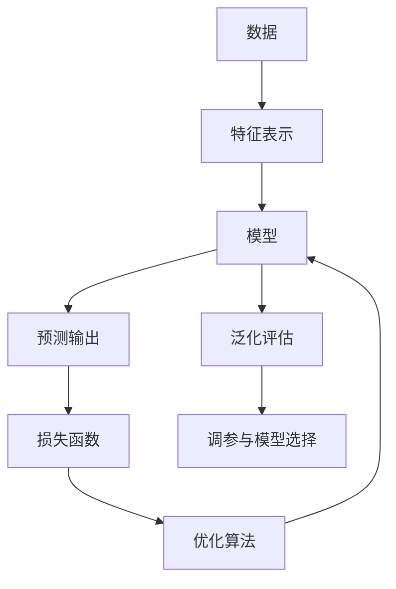

# 00 学习路线与知识地图

## 1. 为什么要先学机器学习再学深度学习

深度学习是机器学习的一类方法。它的特殊之处在于：模型由多层可学习的非线性变换组成，可以从数据中自动学习特征表示。但训练目标、泛化误差、过拟合、正则化、模型评估、优化算法这些概念，仍然来自机器学习基本框架。

如果直接从 CNN、Transformer 开始，很容易只记住结构图，却不明白：

- 为什么需要损失函数；
- 为什么梯度能更新参数；
- 为什么训练集准确率高不代表模型好；
- 为什么模型越大越需要正则化、数据和算力；
- 为什么不同网络结构适合不同数据。

## 2. 知识架构



这张图适用于大多数机器学习和深度学习任务：

- 数据决定问题的上限。
- 表示决定模型看见什么。
- 模型定义输入到输出的映射。
- 损失函数定义什么叫“错”。
- 优化算法决定如何从错误中调整参数。
- 泛化评估决定模型是否真的学到了规律。

## 3. 学习模块划分

### 模块 1：数学基础

**是什么：** 线性代数、微积分、概率统计和信息论。

**为什么存在：** 深度学习中的数据、参数、梯度和损失大多用向量、矩阵、概率分布表达。

**简单例子：**

```text
y = Wx + b

x: 输入向量
W: 权重矩阵
b: 偏置
y: 线性变换输出
```

### 模块 2：机器学习基础

**是什么：** 任务、模型、损失、优化、评估、泛化。

**为什么存在：** 深度学习只是模型更复杂，基本学习问题仍然是从数据中拟合规律。

**简单例子：**

```text
训练集 -> 学到模型 f(x) -> 在测试集上评估泛化性能
```

### 模块 3：神经网络

**是什么：** 多层可学习函数组合。

**为什么存在：** 通过多层非线性变换学习复杂函数。

**简单例子：**

```text
x -> Linear -> ReLU -> Linear -> Softmax
```

### 模块 4：训练机制

**是什么：** 前向传播、损失计算、反向传播、参数更新。

**为什么存在：** 网络参数通常太多，必须用梯度自动更新。

**简单例子：**

```text
prediction = model(x)
loss = loss_fn(prediction, y)
loss.backward()
optimizer.step()
```

### 模块 5：网络结构

**是什么：** CNN、RNN、Attention、Transformer 等。

**为什么存在：** 不同数据有不同结构，模型需要利用归纳偏置。

**简单例子：**

```text
图像 -> CNN
文本序列 -> RNN / Transformer
长距离依赖 -> Attention
```

## 4. 推荐学习阶段

| 阶段 | 学什么 | 目标 |
| --- | --- | --- |
| 阶段 1 | 机器学习基本框架 | 能解释模型、损失、泛化、评估 |
| 阶段 2 | 数学基础 | 能看懂矩阵、梯度、概率、熵 |
| 阶段 3 | 神经网络基础 | 能手写小型 MLP 的前向过程 |
| 阶段 4 | 反向传播和优化 | 能解释梯度如何传回各层 |
| 阶段 5 | 正则化和泛化 | 能处理过拟合、欠拟合 |
| 阶段 6 | CNN/RNN/Attention | 能理解不同结构适合什么数据 |
| 阶段 7 | 项目实践 | 能训练、调参、记录实验 |
| 阶段 8 | 综合复习与排错 | 能把公式、代码、训练曲线和 debug 流程串起来 |

## 5. 学习材料分工

| 材料 | 适合用途 |
| --- | --- |
| 西瓜书 | 建立机器学习概念体系 |
| 南瓜书 | 补公式推导和数学细节 |
| Deep Learning Book | 深度学习理论体系 |
| Dive into Deep Learning | 代码和动手实践 |
| CS231n | CNN、视觉任务、训练技巧 |
| PyTorch Tutorials | 工程实现和 API 熟悉 |

## 6. 最后复习建议

完成 01 到 11 章后，建议阅读 [12_review_and_practice.md](12_深度学习综合复习与实践手册.md)。这一章不是引入全新理论，而是把前面的知识整理成训练工程中的判断流程：

- 看到一个任务，先判断数据类型和合适的模型归纳偏置。
- 写模型前先写清楚输入、输出和中间张量 shape。
- 训练前先跑通一个 batch，再做小数据过拟合测试。
- 调参时优先检查数据、loss、学习率和梯度，而不是盲目堆模型。
- 做最终实验时保存配置、随机种子、checkpoint 和评估指标。

## 7. 参考资料

- Deep Learning Book：https://www.deeplearningbook.org/
- Dive into Deep Learning：https://d2l.ai/
- CS231n Convolutional Neural Networks for Visual Recognition：https://cs231n.github.io/
- PyTorch Tutorials：https://pytorch.org/tutorials/
- PyTorch Documentation：https://docs.pytorch.org/docs/stable/index.html
- Attention Is All You Need：https://arxiv.org/abs/1706.03762
- Adam: A Method for Stochastic Optimization：https://arxiv.org/abs/1412.6980
