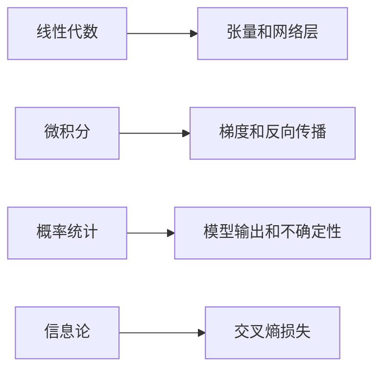
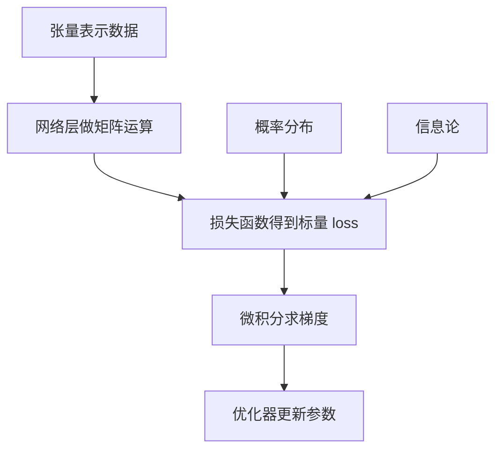

# 01 数学基础

## 1. 总览

深度学习的数学基础不需要一开始学到非常抽象，但必须理解四类工具：

- 线性代数：向量、矩阵、张量、线性变换。
- 微积分：导数、偏导、梯度、链式法则。
- 概率统计：随机变量、分布、期望、方差、最大似然。
- 信息论：熵、交叉熵、KL 散度。

这些内容对应深度学习中的不同模块：



## 2. 线性代数

### 2.1 向量

**是什么：** 一组有顺序的数，可以表示样本、特征、参数或梯度。

**为什么存在：** 机器学习通常把一个样本表示成特征向量。

**简单例子：**

```text
一条房屋样本:
x = [面积, 房间数, 楼层, 距地铁距离]
```

#### 向量基本运算

加法：

```text
x + y = [x_1 + y_1, x_2 + y_2, ..., x_n + y_n]
```

数乘：

```text
alpha x = [alpha x_1, alpha x_2, ..., alpha x_n]
```

内积：

```text
x^T y = sum_i x_i y_i
```

内积在深度学习中非常常见。线性层、注意力机制、相似度计算都离不开内积。

#### 范数

范数衡量向量大小：

```text
||x||_1 = sum_i |x_i|
||x||_2 = sqrt(sum_i x_i^2)
```

用途：

- L1 正则化使用 `||w||_1`，倾向产生稀疏参数。
- L2 正则化使用 `||w||_2^2`，倾向让权重变小且平滑。
- 梯度裁剪常用梯度的 L2 范数。

### 2.2 矩阵

**是什么：** 二维数组，可以表示一批样本、一组线性变换或神经网络权重。

**职责：**

- 批量组织数据；
- 表示线性映射；
- 提高计算效率。

**简单例子：**

```text
X shape = [batch_size, input_dim]
W shape = [input_dim, output_dim]
Y = XW
Y shape = [batch_size, output_dim]
```

#### 矩阵乘法

```text
C = AB
C_ij = sum_k A_ik B_kj
```

维度要求：

```text
A: [m, n]
B: [n, p]
C: [m, p]
```

神经网络线性层通常写作：

```text
Y = XW + b
```

其中：

- `X` 是一批输入；
- `W` 是权重矩阵；
- `b` 是偏置；
- `Y` 是输出特征。

#### 转置和逆

转置：

```text
(A^T)_ij = A_ji
```

逆矩阵：

```text
A A^-1 = I
```

深度学习中不常显式求逆，因为数值不稳定且计算昂贵。更多时候使用梯度优化而不是解析解。

### 2.3 张量

**是什么：** 多维数组，是深度学习框架中的基本数据结构。

**常见形状：**

| 数据 | 常见 shape |
| --- | --- |
| 表格批数据 | `[batch, features]` |
| 图像 | `[batch, channels, height, width]` |
| 文本 token | `[batch, seq_len]` |
| 词向量序列 | `[batch, seq_len, hidden_dim]` |

**简单例子：**

```python
import torch

x = torch.randn(32, 3, 224, 224)
print(x.shape)  # 32 张 RGB 图片
```

#### Broadcasting

Broadcasting 允许不同 shape 的张量在兼容维度上自动扩展。

```python
import torch

x = torch.randn(4, 3)
b = torch.randn(3)
y = x + b
print(y.shape)  # [4, 3]
```

常见风险：broadcasting 太方便，可能掩盖 shape 错误。训练前应主动打印关键张量 shape。

## 3. 微积分

### 3.1 导数

**是什么：** 函数输出相对于输入变化的敏感程度。

**为什么存在：** 训练模型时要知道参数怎么改能让损失下降。

**简单例子：**

```text
f(w) = w^2
f'(w) = 2w

当 w = 3 时，梯度为 6。
如果要减小 f(w)，可以让 w 往负梯度方向移动。
```

#### 导数和优化方向

如果要最小化函数 `f(w)`，梯度下降更新为：

```text
w_new = w - eta * df/dw
```

其中 `eta` 是学习率。负梯度方向是函数局部下降最快的方向。

### 3.2 偏导和梯度

**是什么：** 多变量函数对每个变量分别求导，组合起来就是梯度。

**简单例子：**

```text
L(w1, w2) = w1^2 + 3w2^2

dL/dw1 = 2w1
dL/dw2 = 6w2
gradient = [2w1, 6w2]
```

梯度向量：

```text
grad f(x) = [partial f / partial x_1, ..., partial f / partial x_n]^T
```

在神经网络中，参数可能是矩阵或高维张量。框架会为每个参数张量计算同 shape 的梯度张量。

### 3.3 链式法则

**是什么：** 复合函数求导规则。

**为什么存在：** 神经网络是多层函数复合，反向传播依赖链式法则。

**简单例子：**

```text
z = wx + b
y = sigmoid(z)
L = (y - target)^2

dL/dw = dL/dy * dy/dz * dz/dw
```

#### 多变量链式法则

如果 `z = f(x, y)`，且 `x = x(t)`、`y = y(t)`，则：

```text
dz/dt = partial z/partial x * dx/dt + partial z/partial y * dy/dt
```

神经网络反向传播本质上就是在计算图上反复应用链式法则，并把来自不同路径的梯度相加。

## 4. 矩阵求导

深度学习公式经常使用矩阵求导。先掌握几个常见结果即可。

### 4.1 线性函数

```text
y = Wx + b
```

若 `L` 是标量损失，且已知 `partial L / partial y`，则：

```text
partial L / partial W = (partial L / partial y) x^T
partial L / partial b = partial L / partial y
partial L / partial x = W^T (partial L / partial y)
```

批量形式：

```text
Y = XW + b
partial L / partial W = X^T (partial L / partial Y)
```

### 4.2 平方误差

```text
L = 1/2 * ||y_hat - y||_2^2
```

对预测值求导：

```text
partial L / partial y_hat = y_hat - y
```

这里前面的 `1/2` 是为了求导后抵消平方项产生的系数 2。

## 5. 概率统计

### 4.1 随机变量和分布

**是什么：** 随机变量描述不确定结果，分布描述结果出现的可能性。

**深度学习中的用途：**

- 分类输出可以看作类别概率分布；
- 生成模型学习数据分布；
- Dropout 引入随机性；
- 贝叶斯方法显式建模不确定性。

**简单例子：**

```text
分类模型输出:
P(cat)=0.7, P(dog)=0.2, P(car)=0.1
```

### 5.2 条件概率和贝叶斯公式

条件概率：

```text
P(A | B) = P(A, B) / P(B)
```

贝叶斯公式：

```text
P(y | x) = P(x | y) P(y) / P(x)
```

机器学习中可以理解为：

- `P(y | x)`：看到输入 x 后类别 y 的概率；
- `P(x | y)`：类别 y 生成样本 x 的可能性；
- `P(y)`：类别先验；
- `P(x)`：证据项，起归一化作用。

### 5.3 期望和方差

**是什么：**

- 期望表示平均水平；
- 方差表示波动程度。

**简单例子：**

```text
训练 loss 每个 batch 都不同。
平均 loss 看趋势，方差看训练是否稳定。
```

公式：

```text
E[X] = sum_x x P(X=x)
Var(X) = E[(X - E[X])^2]
```

常用等价形式：

```text
Var(X) = E[X^2] - E[X]^2
```

### 5.4 最大似然

**是什么：** 选择一组参数，让观测到的数据出现概率最大。

**和深度学习的关系：** 很多损失函数可以从最大似然角度解释。例如分类中的交叉熵可以对应最大化正确类别的对数概率。

设数据集为：

```text
D = {(x_i, y_i)}_{i=1}^m
```

模型给出条件概率：

```text
P(y | x; theta)
```

最大似然：

```text
theta* = argmax_theta product_i P(y_i | x_i; theta)
```

通常取对数：

```text
theta* = argmax_theta sum_i log P(y_i | x_i; theta)
```

最小化负对数似然：

```text
L(theta) = - sum_i log P(y_i | x_i; theta)
```

这就是很多分类损失的概率解释。

## 6. 信息论

### 6.1 熵

**是什么：** 衡量不确定性。

**简单例子：**

```text
如果一个硬币总是正面，结果不确定性低。
如果正反各 50%，不确定性高。
```

离散分布的熵：

```text
H(p) = - sum_i p_i log p_i
```

熵越大，分布越不确定。均匀分布通常有较高熵；非常集中的分布熵低。

### 6.2 交叉熵

**是什么：** 衡量真实分布和预测分布之间的差异，分类任务中常用。

**简单例子：**

```python
import torch
import torch.nn.functional as F

logits = torch.tensor([[2.0, 0.5, -1.0]])
target = torch.tensor([0])
loss = F.cross_entropy(logits, target)
print(loss.item())
```

这里 `target=0` 表示正确类别是第 0 类。模型给第 0 类的 logit 越高，交叉熵通常越小。

公式：

```text
H(p, q) = - sum_i p_i log q_i
```

其中：

- `p` 是真实分布；
- `q` 是模型预测分布。

如果 `p` 是 one-hot，正确类别为 `y`：

```text
H(p, q) = -log q_y
```

### 6.3 KL 散度

**是什么：** 衡量分布 `q` 相对真实分布 `p` 的差异。

```text
D_KL(p || q) = sum_i p_i log(p_i / q_i)
```

与交叉熵关系：

```text
H(p, q) = H(p) + D_KL(p || q)
```

训练数据标签固定时，`H(p)` 不随模型变化，因此最小化交叉熵等价于最小化 KL 散度。

## 7. 数学模块之间的关系



## 8. 常见误区

- 只背公式，不知道公式中的量对应代码里的什么张量。
- 不检查 shape，导致矩阵乘法维度错误。
- 把 softmax 后的概率再传给 `cross_entropy`，造成重复 softmax。
- 只看平均 loss，不观察训练波动。
