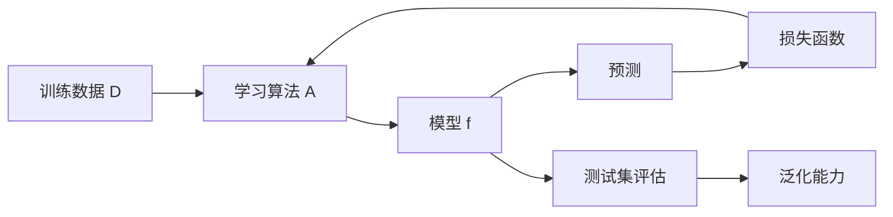

# 02 机器学习基础

## 1. 总览

西瓜书的核心价值是建立机器学习的基本框架。深度学习虽然使用复杂神经网络，但仍然遵循：

```text
数据 -> 模型 -> 损失 -> 优化 -> 评估 -> 泛化
```

## 2. 机器学习问题架构



## 3. 关键概念模块

### 3.1 数据集

**是什么：** 样本集合，通常由输入特征和标签组成。

**职责：**

- 提供学习信号；
- 覆盖任务场景；
- 决定模型能学到的模式边界。

**简单例子：**

```text
猫狗分类数据:
x = 图片
y = 猫 / 狗
```

### 3.2 模型

**是什么：** 从输入到输出的函数。

**深度学习中的形式：**

```text
f(x; theta)

x: 输入
theta: 可学习参数
f: 神经网络
```

**简单例子：**

```python
import torch.nn as nn

model = nn.Sequential(
    nn.Linear(10, 32),
    nn.ReLU(),
    nn.Linear(32, 2)
)
```

#### 参数和超参数

| 类型 | 含义 | 例子 |
| --- | --- | --- |
| 参数 | 训练中由数据学习得到 | 权重 `W`、偏置 `b` |
| 超参数 | 训练前人为设定或搜索 | 学习率、batch size、层数、正则化系数 |

深度学习工程里，参数由优化器更新，超参数由实验设计和验证集选择。

### 3.3 学习算法

**是什么：** 根据训练数据调整模型参数的方法。

**在深度学习中：**

- 前向传播计算预测；
- 损失函数衡量错误；
- 反向传播计算梯度；
- 优化器更新参数。

**简单例子：**

```python
loss.backward()
optimizer.step()
optimizer.zero_grad()
```

### 3.4 损失函数

**是什么：** 把模型预测和真实目标之间的差异变成一个可优化的标量。

**常见损失：**

| 任务 | 损失函数 |
| --- | --- |
| 回归 | MSE / MAE |
| 多分类 | Cross Entropy |
| 二分类 | Binary Cross Entropy |
| 度量学习 | Contrastive / Triplet Loss |

**简单例子：**

```python
import torch.nn.functional as F

loss = F.cross_entropy(logits, labels)
```

#### 经验风险

给定训练集：

```text
D = {(x_i, y_i)}_{i=1}^m
```

经验风险定义为训练集上的平均损失：

```text
R_emp(f) = 1/m * sum_i L(f(x_i), y_i)
```

训练过程通常就是最小化经验风险。

#### 结构风险

为了抑制过拟合，可以在经验风险之外加入模型复杂度惩罚：

```text
R(f) = R_emp(f) + lambda * Omega(f)
```

其中：

- `Omega(f)` 是复杂度或正则项；
- `lambda` 控制正则化强度。

深度学习中常见的 weight decay 就可以看作结构风险最小化思想的实现之一。

### 3.5 泛化

**是什么：** 模型在未见过数据上的表现。

**为什么重要：** 训练集表现好不等于真正学到规律，可能只是记住训练样本。

**简单例子：**

```text
训练准确率: 99%
测试准确率: 70%

这通常说明模型过拟合。
```

## 4. 经验误差和泛化误差

| 概念 | 含义 |
| --- | --- |
| 经验误差 | 训练集上的平均错误 |
| 泛化误差 | 新样本上的期望错误 |
| 过拟合 | 经验误差低，泛化误差高 |
| 欠拟合 | 训练集和测试集都表现差 |

深度学习训练的目标不是让训练误差无限低，而是在训练误差和泛化能力之间取得平衡。

## 5. 典型模型公式

### 5.1 线性回归

**任务：** 预测连续值。

模型：

```text
y_hat = w^T x + b
```

均方误差：

```text
L = 1/m * sum_i (y_i - y_hat_i)^2
```

矩阵形式：

```text
y_hat = Xw + b
L = 1/m * ||y - Xw||_2^2
```

**简单例子：**

```python
import torch
import torch.nn as nn

model = nn.Linear(4, 1)
x = torch.randn(8, 4)
y = torch.randn(8, 1)
loss = nn.MSELoss()(model(x), y)
```

### 5.2 逻辑回归

**任务：** 二分类。

模型：

```text
z = w^T x + b
p = sigmoid(z)
```

二分类交叉熵：

```text
L = -[y log(p) + (1-y) log(1-p)]
```

**简单例子：**

```python
logits = model(x).squeeze(-1)
loss = nn.BCEWithLogitsLoss()(logits, y.float())
```

注意：`BCEWithLogitsLoss` 内部包含 sigmoid，通常不要先手动 sigmoid。

### 5.3 Softmax 多分类

模型输出 logits：

```text
z = [z_1, z_2, ..., z_K]
```

softmax：

```text
p_k = exp(z_k) / sum_j exp(z_j)
```

交叉熵：

```text
L = - sum_k y_k log p_k
```

如果标签是 one-hot，正确类别为 `c`：

```text
L = -log p_c
```

**简单例子：**

```python
logits = torch.randn(16, 10)
labels = torch.randint(0, 10, (16,))
loss = nn.CrossEntropyLoss()(logits, labels)
```

注意：`CrossEntropyLoss` 内部包含 `log_softmax`，不要把 softmax 后的概率传进去。

## 6. 模型评估

### 5.1 数据划分

常见划分：

- 训练集：用于更新模型参数。
- 验证集：用于选择模型、调参、早停。
- 测试集：用于最终评估。

### 5.2 分类指标

| 指标 | 适用场景 |
| --- | --- |
| Accuracy | 类别均衡的普通分类 |
| Precision | 关注预测为正的样本是否可靠 |
| Recall | 关注正样本是否被找全 |
| F1 | Precision 和 Recall 的折中 |
| AUC | 阈值变化下的排序能力 |

常用混淆矩阵记号：

| 记号 | 含义 |
| --- | --- |
| TP | 真正例 |
| FP | 假正例 |
| TN | 真反例 |
| FN | 假反例 |

公式：

```text
Accuracy = (TP + TN) / (TP + FP + TN + FN)
Precision = TP / (TP + FP)
Recall = TP / (TP + FN)
F1 = 2 * Precision * Recall / (Precision + Recall)
```

类别不均衡时，accuracy 可能很误导。例如正样本只有 1%，模型全预测负类也能有 99% accuracy，但 recall 为 0。

### 5.3 回归指标

| 指标 | 含义 |
| --- | --- |
| MSE | 平方误差，惩罚大误差 |
| MAE | 绝对误差，对异常值更稳健 |
| RMSE | 和原目标同量纲 |

公式：

```text
MSE = 1/m * sum_i (y_i - y_hat_i)^2
MAE = 1/m * sum_i |y_i - y_hat_i|
RMSE = sqrt(MSE)
```

## 7. 偏差-方差分解

偏差-方差分解用于理解泛化误差来源。

直观含义：

| 项 | 含义 | 常见现象 |
| --- | --- | --- |
| 偏差 | 模型平均预测和真实规律的差距 | 欠拟合 |
| 方差 | 模型对训练数据扰动的敏感程度 | 过拟合 |
| 噪声 | 数据本身不可解释的随机性 | 再复杂模型也难消除 |

经典形式可以写成：

```text
Expected Error = Bias^2 + Variance + Noise
```

深度学习中这个分解不是总能直接用来精确计算，但对理解模型容量仍然有用：

- 模型太弱：高偏差；
- 模型太复杂且数据少：高方差；
- 数据标签很脏：噪声高。

## 8. 西瓜书与深度学习的连接

| 西瓜书主题 | 深度学习中的对应 |
| --- | --- |
| 线性模型 | 神经网络中的线性层 |
| 决策边界 | 分类网络学到的非线性边界 |
| 误差和过拟合 | 训练/验证曲线、正则化 |
| 评估方法 | train/val/test、交叉验证 |
| 神经网络 | MLP、BP、深层网络 |
| 集成学习 | 模型集成、Dropout 的思想关联 |
| 降维与表示 | 表征学习、embedding |

## 9. 端到端简单例子

```python
import torch
import torch.nn as nn
import torch.nn.functional as F

x = torch.randn(16, 10)
y = torch.randint(0, 2, (16,))

model = nn.Sequential(
    nn.Linear(10, 32),
    nn.ReLU(),
    nn.Linear(32, 2)
)

optimizer = torch.optim.Adam(model.parameters(), lr=1e-3)

logits = model(x)
loss = F.cross_entropy(logits, y)
loss.backward()
optimizer.step()
optimizer.zero_grad()
```

这个小例子包含了机器学习基本闭环：数据、模型、损失、优化。

## 10. 常见误区

- 只看训练集指标，不看验证集和测试集。
- 把验证集反复用于最终报告，导致评估偏乐观。
- 指标选错，例如类别极不均衡时只看 accuracy。
- 不区分模型参数和超参数。
- 不记录实验配置，导致结果无法复现。
