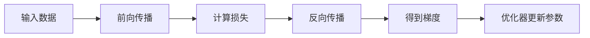

# 04 反向传播

## 1. 总览

反向传播是训练神经网络的核心算法。它用链式法则高效计算损失函数对每个参数的梯度。

训练流程：



## 2. 计算图

### 2.1 什么是计算图

**是什么：** 把计算过程表示成节点和边的有向图。

**为什么存在：** 反向传播需要知道每个中间变量如何由前面的变量计算出来。

**简单例子：**

```text
x ----*
      |--> z = x * w + b --> y = sigmoid(z) --> L
w ----*
b ----+
```

### 2.2 PyTorch 中的计算图

PyTorch 会在前向计算时动态构建计算图。

**简单例子：**

```python
import torch

w = torch.tensor(2.0, requires_grad=True)
x = torch.tensor(3.0)
y = w * x
loss = y ** 2
loss.backward()
print(w.grad)
```

## 3. 链式法则

### 3.1 基本形式

如果：

```text
y = f(z)
z = g(x)
```

那么：

```text
dy/dx = dy/dz * dz/dx
```

### 3.2 在神经网络中的作用

多层网络是复合函数：

```text
L = L(f3(f2(f1(x))))
```

反向传播从损失开始，逐层向前计算梯度：

```text
dL/df3 -> dL/df2 -> dL/df1 -> dL/d参数
```

## 4. 标准反向传播符号

设第 `l` 层：

```text
z^(l) = W^(l) h^(l-1) + b^(l)
h^(l) = phi(z^(l))
```

其中：

- `h^(0) = x`；
- `W^(l)` 是第 `l` 层权重；
- `b^(l)` 是第 `l` 层偏置；
- `z^(l)` 是激活前值；
- `h^(l)` 是激活后输出。

定义误差项：

```text
delta^(l) = partial L / partial z^(l)
```

输出层：

```text
delta^(L) = partial L / partial z^(L)
```

隐藏层：

```text
delta^(l) = ((W^(l+1))^T delta^(l+1)) odot phi'(z^(l))
```

参数梯度：

```text
partial L / partial W^(l) = delta^(l) (h^(l-1))^T
partial L / partial b^(l) = delta^(l)
```

批量训练时，对 batch 中样本的梯度通常求平均或求和，具体取决于损失函数实现。

## 5. 模块详解

### 5.1 前向缓存

**是什么：** 前向传播时保存中间变量。

**为什么存在：** 反向传播计算梯度时需要这些中间值。

**简单例子：**

```text
ReLU 反向传播需要知道前向时哪些位置大于 0。
```

### 5.2 局部梯度

**是什么：** 当前操作输出对输入的导数。

**例子：**

```text
y = x^2
dy/dx = 2x
```

### 5.3 上游梯度

**是什么：** 损失对当前操作输出的梯度。

**作用：** 与局部梯度相乘，得到损失对当前输入的梯度。

**简单例子：**

```text
dL/dx = dL/dy * dy/dx
```

### 5.4 参数梯度

**是什么：** 损失对可学习参数的导数。

**用途：** 优化器根据参数梯度更新权重。

**简单例子：**

```python
for name, param in model.named_parameters():
    print(name, param.grad.shape)
```

## 6. 一个线性层的反向传播

前向：

```text
Y = XW + b
L = loss(Y)
```

反向中需要计算：

```text
dL/dW
dL/db
dL/dX
```

直观理解：

- `dL/dW` 告诉每个权重如何影响损失；
- `dL/db` 告诉偏置如何影响损失；
- `dL/dX` 把梯度继续传给前一层。

批量矩阵形式：

```text
Y = XW + b
G = partial L / partial Y

partial L / partial W = X^T G
partial L / partial b = sum_batch G
partial L / partial X = G W^T
```

shape 对照：

```text
X: [B, Din]
W: [Din, Dout]
Y: [B, Dout]
G: [B, Dout]
dW: [Din, Dout]
db: [Dout]
dX: [B, Din]
```

## 7. 两层网络推导

网络：

```text
z1 = W1 x + b1
h1 = ReLU(z1)
z2 = W2 h1 + b2
p = softmax(z2)
L = -log p_y
```

softmax + cross entropy 的输出层梯度：

```text
delta2 = p - one_hot(y)
```

第二层参数梯度：

```text
dW2 = delta2 h1^T
db2 = delta2
```

传回隐藏层：

```text
dh1 = W2^T delta2
delta1 = dh1 odot ReLU'(z1)
```

第一层参数梯度：

```text
dW1 = delta1 x^T
db1 = delta1
```

这就是最基本的 MLP 反向传播。深层网络只是重复同样的局部规则。

## 8. 自动微分

现代框架通常不要求手写反向传播，而是使用自动微分。

PyTorch 训练步骤：

```python
pred = model(x)
loss = loss_fn(pred, y)
loss.backward()
optimizer.step()
optimizer.zero_grad()
```

模块职责：

| 模块 | 作用 |
| --- | --- |
| `loss.backward()` | 从 loss 出发计算所有参数梯度 |
| `optimizer.step()` | 用梯度更新参数 |
| `optimizer.zero_grad()` | 清空旧梯度，避免累积 |

## 9. 常见问题

### 9.1 忘记清空梯度

PyTorch 默认梯度会累积。

```python
optimizer.zero_grad()
loss.backward()
optimizer.step()
```

### 9.2 梯度消失

**现象：** 前面层梯度很小，学习变慢。

**常见原因：**

- 网络很深；
- 激活函数饱和；
- 初始化不合适。

### 9.3 梯度爆炸

**现象：** loss 变成 NaN 或剧烈震荡。

**处理方式：**

- 降低学习率；
- 梯度裁剪；
- 检查输入归一化；
- 检查损失函数是否数值稳定。

## 10. 简单例子：观察梯度

```python
import torch
import torch.nn as nn
import torch.nn.functional as F

model = nn.Sequential(nn.Linear(4, 8), nn.ReLU(), nn.Linear(8, 2))
x = torch.randn(3, 4)
y = torch.tensor([0, 1, 0])

logits = model(x)
loss = F.cross_entropy(logits, y)
loss.backward()

for name, p in model.named_parameters():
    print(name, p.grad.norm())
```

这个例子可以帮助你确认每层参数都收到了梯度。
