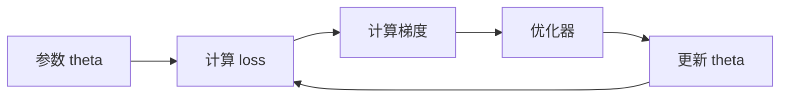

# 05 优化算法

## 1. 总览

优化算法解决的问题是：如何根据梯度更新参数，让损失函数下降。



## 2. 梯度下降

### 2.1 基本形式

```text
theta = theta - learning_rate * gradient
```

标准记号：

```text
theta_{t+1} = theta_t - eta * grad_theta L(theta_t)
```

其中：

- `theta_t` 是第 `t` 步参数；
- `eta` 是学习率；
- `grad_theta L` 是损失对参数的梯度。

**模块职责：**

- `theta`：模型参数；
- `gradient`：损失对参数的导数；
- `learning_rate`：每次更新步长。

**简单例子：**

```python
w = 3.0
lr = 0.1
grad = 2 * w
w = w - lr * grad
```

### 2.2 学习率

学习率是最重要的超参数之一。

| 学习率 | 常见现象 |
| --- | --- |
| 太大 | loss 震荡、发散、NaN |
| 太小 | 收敛很慢、卡住 |
| 合理 | loss 稳定下降 |

## 3. Batch、Mini-batch、SGD

| 方法 | 特点 |
| --- | --- |
| Batch Gradient Descent | 每次用全部数据，稳定但慢 |
| Stochastic Gradient Descent | 每次用一个样本，噪声大 |
| Mini-batch SGD | 每次用一小批样本，最常用 |

深度学习中通常说 SGD，是指 mini-batch 形式。

## 4. Momentum

### 4.1 什么是 Momentum

Momentum 引入“速度”概念，让更新方向不只看当前梯度，也参考过去梯度。

**为什么存在：**

- 减少震荡；
- 加速一致方向的更新；
- 帮助穿过浅谷。

**简单例子：**

```text
v = beta * v + grad
theta = theta - lr * v
```

更常见写法：

```text
v_t = beta v_{t-1} + (1 - beta) g_t
theta_{t+1} = theta_t - eta v_t
```

也有实现不带 `(1-beta)`，不同资料形式略有差异，本质都是用历史梯度的指数移动平均平滑更新方向。

### 4.2 PyTorch 示例

```python
optimizer = torch.optim.SGD(
    model.parameters(),
    lr=0.01,
    momentum=0.9
)
```

## 5. AdaGrad

**是什么：** 根据历史梯度平方和调整每个参数的学习率。

**优点：** 稀疏特征任务中有用。

**缺点：** 学习率可能不断衰减，后期更新过小。

公式：

```text
s_t = s_{t-1} + g_t^2
theta_{t+1} = theta_t - eta * g_t / sqrt(s_t + epsilon)
```

其中平方和开方都是逐元素操作。

## 6. RMSProp

**是什么：** 使用梯度平方的指数移动平均，缓解 AdaGrad 学习率过快衰减。

**简单形式：**

```text
s = beta * s + (1 - beta) * grad^2
theta = theta - lr * grad / sqrt(s + eps)
```

RMSProp 可以看作 AdaGrad 的改进：它不累计全部历史平方梯度，而是使用指数移动平均，让旧梯度影响逐渐衰减。

## 7. Adam

Adam 同时使用一阶矩估计和二阶矩估计，是深度学习中非常常用的优化器。

**模块职责：**

- 一阶矩：类似 Momentum，估计梯度方向；
- 二阶矩：估计梯度平方，调节每个参数步长；
- bias correction：修正初期估计偏差。

**PyTorch 示例：**

```python
optimizer = torch.optim.Adam(
    model.parameters(),
    lr=1e-3,
    weight_decay=1e-4
)
```

完整公式：

```text
g_t = grad_theta L(theta_t)
m_t = beta1 m_{t-1} + (1 - beta1) g_t
v_t = beta2 v_{t-1} + (1 - beta2) g_t^2
m_hat_t = m_t / (1 - beta1^t)
v_hat_t = v_t / (1 - beta2^t)
theta_{t+1} = theta_t - eta * m_hat_t / (sqrt(v_hat_t) + epsilon)
```

直观理解：

- `m_t` 是带动量的平均梯度；
- `v_t` 是梯度平方的平均尺度；
- 参数更新会自动按梯度尺度做归一化。

## 8. AdamW

AdamW 是 Adam 的常用变体，重点是把 weight decay 从梯度更新中解耦。

直观区别：

```text
Adam + L2: 正则项混入梯度，被自适应学习率缩放
AdamW: 先按 Adam 更新，再单独衰减权重
```

常见更新可理解为：

```text
theta = theta - eta * adam_update - eta * weight_decay * theta
```

Transformer、预训练模型微调中常用 AdamW。

PyTorch 示例：

```python
optimizer = torch.optim.AdamW(
    model.parameters(),
    lr=3e-4,
    weight_decay=0.01
)
```

## 9. 学习率调度

学习率不一定固定。常见策略：

| 策略 | 含义 |
| --- | --- |
| Step decay | 每隔若干 epoch 降低 |
| Cosine decay | 按余弦曲线下降 |
| Warmup | 训练初期逐步增大学习率 |
| Reduce on plateau | 验证指标停滞时降低 |

**简单例子：**

```python
scheduler = torch.optim.lr_scheduler.CosineAnnealingLR(
    optimizer,
    T_max=100
)
```

### 9.1 Warmup

Warmup 在训练初期逐渐增大学习率：

```text
eta_t = eta_max * t / warmup_steps
```

适合大模型、Transformer、较大 batch 的训练。初期参数和梯度不稳定，直接用大学习率容易发散。

### 9.2 Cosine Decay

余弦衰减常见形式：

```text
eta_t = eta_min + 1/2 * (eta_max - eta_min) * (1 + cos(pi * t / T))
```

训练初期学习率较大，后期平滑降低。

## 10. 梯度裁剪

**是什么：** 当梯度范数过大时缩放梯度，防止更新过猛。

常见形式：

```text
if ||g|| > c:
    g = c * g / ||g||
```

PyTorch 示例：

```python
torch.nn.utils.clip_grad_norm_(model.parameters(), max_norm=1.0)
```

常用于 RNN、Transformer 或训练不稳定的深层网络。

## 11. 优化器选择建议

| 场景 | 常用选择 |
| --- | --- |
| 默认起步 | Adam / AdamW |
| 视觉分类经典训练 | SGD + Momentum |
| Transformer | AdamW + Warmup |
| 小数据微调 | AdamW + 较小学习率 |

## 12. 常见训练现象和优化判断

| 现象 | 可能原因 | 优先操作 |
| --- | --- | --- |
| loss 直接 NaN | 学习率太大、输入异常、数值溢出 | 降低学习率、检查数据、梯度裁剪 |
| loss 不下降 | 学习率太小/太大、模型没梯度、标签错 | 小数据过拟合测试、检查梯度 |
| 训练震荡大 | batch 太小、学习率偏大 | 降低学习率、增大 batch、加动量 |
| 训练慢 | 学习率太小、模型过大、数据瓶颈 | 调 lr、检查 DataLoader |
| 验证集变差 | 过拟合 | 正则化、数据增强、早停 |

## 13. 常见误区

- 训练不收敛只改模型，不先检查学习率。
- 忘记 `optimizer.zero_grad()`。
- weight decay 和 L2 regularization 的实现差异不理解。
- batch size 改变后不重新考虑学习率。
- 只看训练 loss，不看验证指标。
