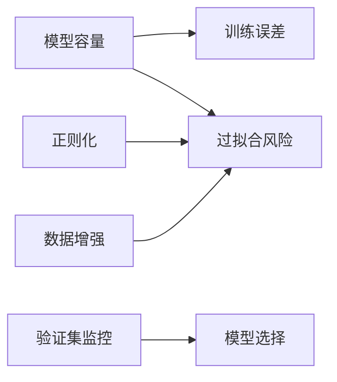

# 06 正则化与泛化

## 1. 总览

泛化是机器学习的核心目标。正则化是一类减少过拟合、提升泛化能力的方法。



## 2. 过拟合和欠拟合

| 情况 | 训练表现 | 验证表现 | 典型原因 |
| --- | --- | --- | --- |
| 欠拟合 | 差 | 差 | 模型太弱、训练不足、特征不足 |
| 合理拟合 | 好 | 好 | 模型和数据匹配 |
| 过拟合 | 很好 | 差 | 模型记住训练集，泛化差 |

## 3. L1 和 L2 正则化

### 3.1 L2 正则化

**是什么：** 在损失中惩罚参数平方和。

```text
Loss = DataLoss + lambda * ||w||_2^2
```

展开：

```text
||w||_2^2 = sum_i w_i^2
```

如果：

```text
J(w) = L(w) + lambda sum_i w_i^2
```

则正则项梯度为：

```text
partial J / partial w_i = partial L / partial w_i + 2 lambda w_i
```

**为什么存在：** 倾向于让权重变小，减少模型过度依赖某些特征。

**简单例子：**

```python
optimizer = torch.optim.AdamW(
    model.parameters(),
    lr=1e-3,
    weight_decay=1e-4
)
```

### 3.2 L1 正则化

**是什么：** 在损失中惩罚参数绝对值和。

```text
Loss = DataLoss + lambda * ||w||_1
```

展开：

```text
||w||_1 = sum_i |w_i|
```

L1 在 0 附近会产生让参数变为 0 的倾向，因此常用于稀疏化。

**特点：** 倾向于产生稀疏参数。

## 4. Dropout

**是什么：** 训练时随机把部分神经元输出置零。

**为什么存在：** 减少神经元之间的复杂共适应。

**简单例子：**

```python
import torch.nn as nn

model = nn.Sequential(
    nn.Linear(100, 256),
    nn.ReLU(),
    nn.Dropout(p=0.5),
    nn.Linear(256, 10)
)
```

训练时可理解为：

```text
m_i ~ Bernoulli(1-p)
h'_i = m_i h_i / (1-p)
```

其中 `p` 是丢弃概率。除以 `1-p` 是为了保持激活期望大致不变。

**注意：**

- 训练模式下启用 Dropout；
- 评估模式下关闭 Dropout；
- 推理前要调用 `model.eval()`。

## 5. 数据增强

**是什么：** 对训练样本做合理变换，增加数据多样性。

| 数据类型 | 常见增强 |
| --- | --- |
| 图像 | 翻转、裁剪、颜色扰动、旋转 |
| 文本 | 同义替换、随机 mask、回译 |
| 音频 | 加噪、时间拉伸、频谱遮挡 |

**简单例子：**

```python
from torchvision import transforms

train_transform = transforms.Compose([
    transforms.RandomResizedCrop(224),
    transforms.RandomHorizontalFlip(),
    transforms.ToTensor()
])
```

## 6. Early Stopping

**是什么：** 当验证集指标不再改善时停止训练。

**为什么存在：** 训练太久可能继续降低训练误差，但验证误差变差。

**简单流程：**

```text
每个 epoch 评估验证集
如果连续 patience 次没有提升
停止训练并保存最好模型
```

## 7. Batch Normalization

**是什么：** 对中间激活做归一化，并学习缩放和平移参数。

**作用：**

- 改善训练稳定性；
- 允许使用较大学习率；
- 有轻微正则化效果。

**简单例子：**

```python
nn.Sequential(
    nn.Linear(128, 256),
    nn.BatchNorm1d(256),
    nn.ReLU()
)
```

公式：

对 mini-batch 中某个通道的激活：

```text
mu_B = 1/m * sum_i x_i
sigma_B^2 = 1/m * sum_i (x_i - mu_B)^2
x_hat_i = (x_i - mu_B) / sqrt(sigma_B^2 + epsilon)
y_i = gamma x_hat_i + beta
```

其中：

- `gamma` 和 `beta` 是可学习参数；
- 训练时使用 batch 统计；
- 推理时使用训练过程中累计的 running mean/variance。

BatchNorm 常用于 CNN；在 batch 很小或序列长度变化复杂时可能不稳定。

## 8. Layer Normalization

**是什么：** 对单个样本的特征维度归一化。

**常见用途：** Transformer 中广泛使用。

**简单例子：**

```python
nn.LayerNorm(normalized_shape=768)
```

公式：

对单个样本的特征维度：

```text
mu = 1/H * sum_j x_j
sigma^2 = 1/H * sum_j (x_j - mu)^2
x_hat_j = (x_j - mu) / sqrt(sigma^2 + epsilon)
y_j = gamma x_hat_j + beta
```

LayerNorm 不依赖 batch 统计，因此非常适合 Transformer、RNN 和变长序列。

## 9. 数据增强的数学直觉

数据增强可以看作给训练目标加入“变换不变性”约束。

如果 `T(x)` 是不改变标签的变换，例如水平翻转猫狗图片，则希望：

```text
f(x) approximately f(T(x))
```

训练目标隐式变成：

```text
min_theta E_{(x,y)} E_{T} L(f_theta(T(x)), y)
```

这会迫使模型对合理扰动保持稳定。

## 10. Label Smoothing

**是什么：** 不把正确类别标签设为 1，而是稍微平滑。

普通 one-hot：

```text
y_true = 1, y_other = 0
```

Label smoothing：

```text
y_true = 1 - epsilon
y_other = epsilon / (K - 1)
```

作用：

- 减少模型过度自信；
- 改善校准；
- 在分类任务中常作为正则化技巧。

PyTorch 示例：

```python
loss_fn = nn.CrossEntropyLoss(label_smoothing=0.1)
```

## 11. 常见误区

- 用测试集调参，导致测试结果不可信。
- 数据增强破坏标签语义，例如把数字 6 旋转成 9。
- 忘记训练/评估模式切换，导致 Dropout 或 BatchNorm 行为异常。
- 正则化太强，导致欠拟合。
- 只加正则化，不检查数据质量。
