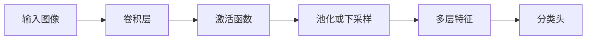

# 07 卷积神经网络 CNN

## 1. 总览

CNN 主要用于具有局部空间结构的数据，尤其是图像。它的核心思想是：

- 局部连接：一个卷积核只看局部区域。
- 参数共享：同一个卷积核在整张图上滑动。
- 平移等变：目标移动时，特征图也相应移动。



## 2. 卷积层

### 2.1 是什么

卷积层用多个小卷积核在输入特征图上滑动，提取局部模式。

单通道二维卷积可以写成：

```text
Y[i, j] = sum_m sum_n X[i+m, j+n] K[m, n]
```

多通道卷积：

```text
Y[o, i, j] = sum_c sum_m sum_n X[c, i+m, j+n] K[o, c, m, n] + b[o]
```

其中：

- `c` 是输入通道；
- `o` 是输出通道；
- `K[o, c, m, n]` 是第 `o` 个卷积核在第 `c` 个输入通道上的权重。

**输入输出：**

```text
输入: [batch, channels_in, height, width]
输出: [batch, channels_out, new_height, new_width]
```

### 2.2 职责

- 提取边缘、纹理、形状等局部特征；
- 保留空间结构；
- 通过堆叠形成从低级到高级的特征。

### 2.3 简单例子

```python
import torch
import torch.nn as nn

conv = nn.Conv2d(
    in_channels=3,
    out_channels=16,
    kernel_size=3,
    padding=1
)

x = torch.randn(8, 3, 224, 224)
y = conv(x)
print(y.shape)  # [8, 16, 224, 224]
```

参数量：

```text
params = out_channels * in_channels * kernel_h * kernel_w + out_channels
```

例如 `Conv2d(3, 16, kernel_size=3)`：

```text
16 * 3 * 3 * 3 + 16 = 448
```

## 3. 卷积参数

| 参数 | 含义 |
| --- | --- |
| `kernel_size` | 卷积核大小 |
| `stride` | 滑动步长 |
| `padding` | 边缘填充 |
| `dilation` | 空洞卷积间隔 |
| `channels` | 通道数 |

输出大小大致由 kernel、stride、padding 共同决定。

精确公式：

```text
H_out = floor((H_in + 2P - D(K - 1) - 1) / S + 1)
W_out = floor((W_in + 2P - D(K - 1) - 1) / S + 1)
```

其中：

- `K` 是 kernel size；
- `P` 是 padding；
- `D` 是 dilation；
- `S` 是 stride。

例子：

```text
H_in = 224, K = 3, P = 1, S = 1, D = 1
H_out = floor((224 + 2 - 2 - 1) / 1 + 1) = 224
```

## 4. 池化层

### 4.1 是什么

池化层对局部区域做汇聚，常见有最大池化和平均池化。

### 4.2 为什么存在

- 降低特征图尺寸；
- 扩大感受野；
- 增强一定的平移鲁棒性。

### 4.3 简单例子

```python
pool = nn.MaxPool2d(kernel_size=2, stride=2)
x = torch.randn(8, 16, 224, 224)
y = pool(x)
print(y.shape)  # [8, 16, 112, 112]
```

## 5. 感受野

**是什么：** 特征图中某个位置对应原图的区域范围。

**为什么重要：** 越深层的神经元通常能看到更大范围，从而捕捉更高级语义。

**简单理解：**

```text
浅层: 边缘、颜色、纹理
中层: 局部形状、部件
深层: 物体语义
```

如果连续堆叠两个 `3x3` 卷积，stride 为 1，则第二层的一个位置能看到原图中 `5x5` 左右区域。堆叠小卷积可以在较少参数下扩大感受野，并增加非线性层数。

## 6. CNN 模块详解

### 6.1 Conv-BN-ReLU

**是什么：** 经典基础块。

**职责：**

- Conv 提取特征；
- BatchNorm 稳定训练；
- ReLU 引入非线性。

**简单例子：**

```python
block = nn.Sequential(
    nn.Conv2d(3, 32, kernel_size=3, padding=1, bias=False),
    nn.BatchNorm2d(32),
    nn.ReLU(inplace=True)
)
```

### 6.2 残差块

**是什么：** 在主分支外增加 shortcut 连接。

**为什么存在：** 缓解深层网络训练困难，让梯度更容易传播。

**简单结构：**

```text
output = F(x) + x
```

**简单例子：**

```python
class ResidualBlock(nn.Module):
    def __init__(self, channels):
        super().__init__()
        self.net = nn.Sequential(
            nn.Conv2d(channels, channels, 3, padding=1),
            nn.ReLU(),
            nn.Conv2d(channels, channels, 3, padding=1)
        )

    def forward(self, x):
        return torch.relu(self.net(x) + x)
```

残差连接的核心不是简单“加一条线”，而是让网络学习残差函数：

```text
H(x) = F(x) + x
F(x) = H(x) - x
```

如果某些层暂时学不到有用变换，可以让 `F(x)` 接近 0，信息仍能通过 shortcut 传递。

### 6.3 全局平均池化

**是什么：** 对每个通道的空间维度求平均。

**为什么存在：** 用较少参数替代大规模全连接层。

**简单例子：**

```python
gap = nn.AdaptiveAvgPool2d((1, 1))
x = torch.randn(8, 512, 7, 7)
y = gap(x).flatten(1)
print(y.shape)  # [8, 512]
```

## 7. 经典 CNN 思想

| 网络 | 关键思想 |
| --- | --- |
| LeNet | 早期卷积 + 池化 + 全连接 |
| AlexNet | 深层 CNN、ReLU、GPU 训练 |
| VGG | 小卷积核堆叠 |
| GoogLeNet | Inception 多尺度分支 |
| ResNet | 残差连接，训练更深网络 |

## 8. 卷积的归纳偏置

CNN 适合图像，是因为它内置了几个假设：

| 归纳偏置 | 含义 |
| --- | --- |
| 局部性 | 相邻像素关系更重要 |
| 平移等变 | 同一模式出现在不同位置也应被识别 |
| 参数共享 | 同一检测器可应用于整张图 |
| 层级组合 | 低级特征组合成高级语义 |

这些假设对图像很有效，但对完全无空间结构的表格数据不一定合适。

## 9. 常见 CNN 结构模板

```text
Input
-> Conv-BN-ReLU
-> Conv-BN-ReLU
-> Downsample
-> Conv blocks
-> Global Average Pooling
-> Linear classifier
```

PyTorch 简单例子：

```python
class SmallCNN(nn.Module):
    def __init__(self, num_classes=10):
        super().__init__()
        self.features = nn.Sequential(
            nn.Conv2d(3, 32, 3, padding=1),
            nn.BatchNorm2d(32),
            nn.ReLU(),
            nn.MaxPool2d(2),
            nn.Conv2d(32, 64, 3, padding=1),
            nn.BatchNorm2d(64),
            nn.ReLU(),
            nn.AdaptiveAvgPool2d((1, 1))
        )
        self.classifier = nn.Linear(64, num_classes)

    def forward(self, x):
        x = self.features(x).flatten(1)
        return self.classifier(x)
```

## 10. 常见误区

- 不检查图像归一化，导致训练不稳定。
- 输入 shape 写成 `[batch, height, width, channels]`，但 PyTorch 默认需要 `[batch, channels, height, width]`。
- 过早 flatten，丢掉空间结构。
- 小数据集直接训练大 CNN，严重过拟合。
- 不理解 padding/stride 导致特征图尺寸不符合预期。
