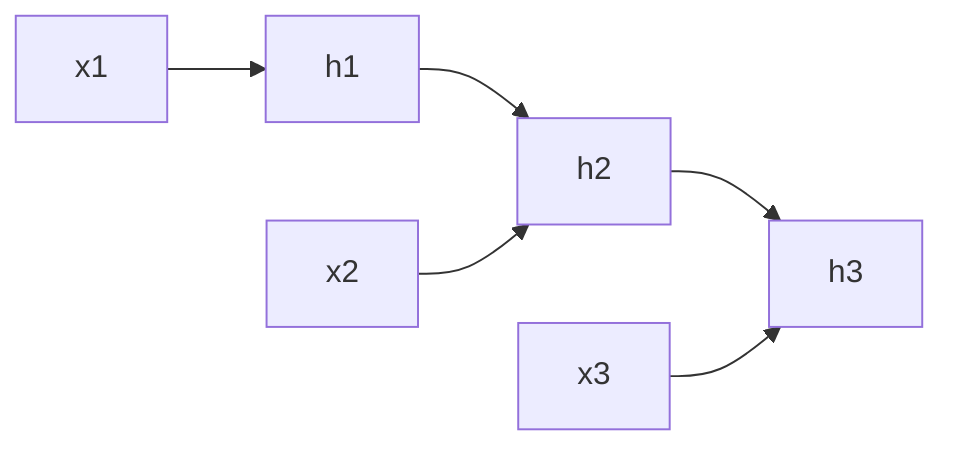

# 08 序列模型：RNN、LSTM、GRU

## 1. 总览

序列数据的特点是顺序重要，例如文本、语音、时间序列。RNN 的核心思想是：当前输出不仅依赖当前输入，也依赖过去状态。



## 2. RNN 基础

### 2.1 是什么

RNN 通过隐藏状态保存历史信息。

```text
h_t = f(Wx_t + Uh_{t-1} + b)
y_t = g(h_t)
```

更完整写法：

```text
h_t = phi(W_xh x_t + W_hh h_{t-1} + b_h)
o_t = W_hy h_t + b_y
y_t = softmax(o_t)
```

其中：

- `x_t` 是第 `t` 个时间步输入；
- `h_t` 是当前隐藏状态；
- `h_{t-1}` 是上一个时间步隐藏状态；
- `W_xh` 处理当前输入；
- `W_hh` 处理历史状态。

### 2.2 职责

- 建模时间或顺序依赖；
- 将变长序列压缩成隐藏状态；
- 支持序列分类、序列标注、序列生成。

### 2.3 简单例子

```python
import torch
import torch.nn as nn

rnn = nn.RNN(input_size=16, hidden_size=32, batch_first=True)
x = torch.randn(8, 10, 16)  # batch=8, seq_len=10
output, h_n = rnn(x)
print(output.shape)  # [8, 10, 32]
print(h_n.shape)     # [1, 8, 32]
```

参数量估算：

```text
params = input_size * hidden_size
       + hidden_size * hidden_size
       + hidden_size
```

实际框架中还可能包含多组 bias。

## 3. RNN 的问题

### 3.1 梯度消失

长序列中，梯度需要跨很多时间步传播，可能越来越小。

从反向传播角度看，跨时间步梯度包含反复相乘：

```text
partial h_T / partial h_t
  = product_{k=t+1}^{T} partial h_k / partial h_{k-1}
```

如果这些 Jacobian 的范数多数小于 1，梯度会快速衰减；如果多数大于 1，梯度可能爆炸。

### 3.2 梯度爆炸

梯度也可能在反复相乘中变得极大，导致训练不稳定。

### 3.3 长期依赖困难

普通 RNN 很难记住很久以前的信息。

## 4. BPTT

BPTT 即 Backpropagation Through Time，把 RNN 按时间展开后做反向传播。

```text
h_1 -> h_2 -> h_3 -> ... -> h_T
```

每个时间步共享同一组参数，因此最终梯度是所有时间步贡献的累加：

```text
partial L / partial W = sum_t partial L_t / partial W
```

长序列训练时常用截断 BPTT，只反传固定长度窗口，降低计算和显存成本。

## 5. LSTM

### 4.1 是什么

LSTM 使用门控机制控制信息保留、遗忘和输出。

核心模块：

| 模块 | 作用 |
| --- | --- |
| Forget gate | 决定遗忘多少旧信息 |
| Input gate | 决定写入多少新信息 |
| Cell state | 传递长期记忆 |
| Output gate | 决定输出多少状态 |

完整公式：

```text
f_t = sigmoid(W_f [h_{t-1}, x_t] + b_f)
i_t = sigmoid(W_i [h_{t-1}, x_t] + b_i)
g_t = tanh(W_g [h_{t-1}, x_t] + b_g)
c_t = f_t odot c_{t-1} + i_t odot g_t
o_t = sigmoid(W_o [h_{t-1}, x_t] + b_o)
h_t = o_t odot tanh(c_t)
```

含义：

- `f_t` 控制旧记忆保留多少；
- `i_t` 控制新候选记忆写入多少；
- `g_t` 是候选内容；
- `c_t` 是长期记忆通道；
- `o_t` 控制输出多少给隐藏状态。

### 4.2 为什么存在

LSTM 缓解普通 RNN 难以捕捉长期依赖的问题。

### 4.3 简单例子

```python
lstm = nn.LSTM(input_size=16, hidden_size=32, batch_first=True)
x = torch.randn(8, 10, 16)
output, (h_n, c_n) = lstm(x)
print(output.shape)
```

## 6. GRU

### 5.1 是什么

GRU 是一种比 LSTM 更简洁的门控循环网络。

核心模块：

| 模块 | 作用 |
| --- | --- |
| Update gate | 控制保留旧状态还是写入新状态 |
| Reset gate | 控制如何结合过去状态 |

公式：

```text
z_t = sigmoid(W_z [h_{t-1}, x_t])
r_t = sigmoid(W_r [h_{t-1}, x_t])
h_tilde_t = tanh(W_h [r_t odot h_{t-1}, x_t])
h_t = (1 - z_t) odot h_{t-1} + z_t odot h_tilde_t
```

GRU 参数通常少于 LSTM，训练和推理成本也可能更低。

### 5.2 简单例子

```python
gru = nn.GRU(input_size=16, hidden_size=32, batch_first=True)
x = torch.randn(8, 10, 16)
output, h_n = gru(x)
```

## 7. 序列任务类型

| 类型 | 输入 | 输出 | 例子 |
| --- | --- | --- | --- |
| many-to-one | 序列 | 单个标签 | 文本分类 |
| many-to-many | 序列 | 序列标签 | 词性标注 |
| seq2seq | 源序列 | 目标序列 | 机器翻译 |
| autoregressive | 历史 token | 下一个 token | 语言模型 |

## 8. Embedding

**是什么：** 把离散 token 映射成连续向量。

**为什么存在：** 神经网络不能直接处理离散词 ID，需要向量表示。

**简单例子：**

```python
embedding = nn.Embedding(num_embeddings=10000, embedding_dim=128)
token_ids = torch.tensor([[1, 5, 23, 9]])
x = embedding(token_ids)
print(x.shape)  # [1, 4, 128]
```

Embedding 本质上是查表：

```text
embedding_matrix: [vocab_size, embedding_dim]
token_id -> embedding_matrix[token_id]
```

训练时，只有出现过的 token 对应向量会收到梯度更新。

## 9. Padding 和 Mask

不同样本序列长度通常不同，需要 padding 到同一长度。

```text
真实序列: [12, 35, 9]
padding 后: [12, 35, 9, 0, 0]
mask: [1, 1, 1, 0, 0]
```

mask 的职责：

- 损失计算时忽略 padding；
- attention 或序列模型中避免关注 padding；
- 统计指标时只统计真实 token。

PyTorch 中常见做法是使用 `padding_idx`：

```python
embedding = nn.Embedding(vocab_size, dim, padding_idx=0)
```

## 10. 常见误区

- 忽略 padding mask，把补齐 token 当真实输入。
- 序列太长时仍强行用普通 RNN。
- 不做梯度裁剪，导致训练不稳定。
- 混淆 `output` 和最终隐藏状态 `h_n`。
- 文本任务不区分 tokenization 和 embedding。
