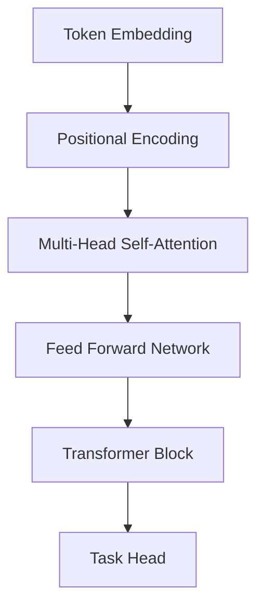

# 09 Attention 与 Transformer

## 1. 总览

Attention 的核心思想是：模型在处理一个位置时，可以根据相关性选择关注其他位置的信息。

Transformer 用 Self-Attention 替代传统循环结构，成为现代 NLP 和多模态模型的基础架构。



## 2. Attention 基础

### 2.1 Query、Key、Value

**是什么：**

- Query：当前要查询的信息。
- Key：每个候选信息的索引特征。
- Value：真正被加权汇总的信息。

**简单类比：**

```text
Query: 我想找什么
Key: 每条信息的标签
Value: 每条信息的内容
```

### 2.2 Scaled Dot-Product Attention

核心计算：

```text
Attention(Q, K, V) = softmax(QK^T / sqrt(d_k)) V
```

维度：

```text
Q: [batch, query_len, d_k]
K: [batch, key_len, d_k]
V: [batch, key_len, d_v]
QK^T: [batch, query_len, key_len]
Output: [batch, query_len, d_v]
```

**模块职责：**

- `QK^T` 计算相关性；
- `sqrt(d_k)` 缩放数值，稳定训练；
- `softmax` 得到权重；
- 乘以 `V` 汇总信息。

### 2.3 简单例子

```python
import torch
import torch.nn.functional as F

Q = torch.randn(2, 4, 8)
K = torch.randn(2, 4, 8)
V = torch.randn(2, 4, 8)

scores = Q @ K.transpose(-2, -1) / (8 ** 0.5)
weights = F.softmax(scores, dim=-1)
out = weights @ V
print(out.shape)  # [2, 4, 8]
```

为什么除以 `sqrt(d_k)`：

如果 `d_k` 很大，点积 `QK^T` 的数值方差会变大，softmax 容易进入极端饱和区，导致梯度变小。缩放可以改善数值稳定性。

## 3. Self-Attention

**是什么：** Q、K、V 都来自同一个序列。

**为什么存在：** 序列中每个 token 都能直接和其他 token 建立联系。

**优点：**

- 长距离依赖路径短；
- 并行性强；
- 可解释为 token 间关系建模。

**代价：**

- 复杂度通常随序列长度平方增长；
- 长序列成本高。

复杂度：

```text
Time: O(n^2 d)
Memory: O(n^2)
```

其中 `n` 是序列长度，`d` 是隐藏维度。瓶颈主要来自 attention score 矩阵 `[n, n]`。

## 4. Multi-Head Attention

**是什么：** 多组 attention 并行学习不同关系。

**为什么存在：** 一个注意力头可能只捕捉单一模式，多头可以关注不同子空间。

**简单例子：**

```python
import torch.nn as nn

mha = nn.MultiheadAttention(
    embed_dim=128,
    num_heads=8,
    batch_first=True
)

x = torch.randn(4, 20, 128)
out, weights = mha(x, x, x)
print(out.shape)
```

公式：

```text
head_i = Attention(QW_i^Q, KW_i^K, VW_i^V)
MultiHead(Q,K,V) = Concat(head_1, ..., head_h) W^O
```

如果 `d_model = 512`，`num_heads = 8`，通常每个 head 的维度：

```text
d_head = d_model / num_heads = 64
```

多头不是简单重复，而是让不同 head 学习不同关系，例如局部邻近、句法关系、长距离依赖等。

## 5. Positional Encoding

**是什么：** 给 token 加入位置信息。

**为什么存在：** Self-Attention 本身不天然知道顺序。

常见方式：

| 方法 | 特点 |
| --- | --- |
| Sinusoidal position encoding | 固定函数，不需要学习 |
| Learned position embedding | 位置向量可学习 |
| Relative position encoding | 表达 token 间相对距离 |
| RoPE | 旋转位置编码，大模型常见 |

经典正弦位置编码：

```text
PE(pos, 2i) = sin(pos / 10000^(2i/d_model))
PE(pos, 2i+1) = cos(pos / 10000^(2i/d_model))
```

其中：

- `pos` 是位置；
- `i` 是维度索引；
- `d_model` 是隐藏维度。

正弦位置编码不需要学习参数，并且可以外推到比训练时更长的位置，但现代大模型也常用可学习位置编码、相对位置编码或 RoPE。

## 6. Transformer Block

### 6.1 组成

典型 block 包含：

- Multi-Head Self-Attention；
- Add & Norm；
- Feed Forward Network；
- Add & Norm。

```text
x = x + SelfAttention(LayerNorm(x))
x = x + FFN(LayerNorm(x))
```

上面是 Pre-LN 写法。另一种 Post-LN 写法是：

```text
x = LayerNorm(x + SelfAttention(x))
x = LayerNorm(x + FFN(x))
```

现代深层 Transformer 常偏向 Pre-LN，因为训练更稳定。

### 6.2 Feed Forward Network

**是什么：** 对每个 token 独立应用的 MLP。

**简单例子：**

```python
ffn = nn.Sequential(
    nn.Linear(128, 512),
    nn.GELU(),
    nn.Linear(512, 128)
)
```

公式：

```text
FFN(x) = W2 phi(W1 x + b1) + b2
```

通常中间维度大于 `d_model`：

```text
d_ff = 4 * d_model
```

例如 `d_model=768` 时，`d_ff` 常见为 `3072`。

## 7. Encoder、Decoder、Encoder-Decoder

| 架构 | 用途 |
| --- | --- |
| Encoder-only | 表征学习、分类、理解任务 |
| Decoder-only | 自回归生成、语言模型 |
| Encoder-Decoder | 翻译、摘要等输入输出序列任务 |

### 7.1 Encoder-only

每个 token 可以双向关注其他 token，适合理解任务。

```text
输入文本 -> Encoder -> [CLS] 或池化表示 -> 分类头
```

### 7.2 Decoder-only

使用 causal mask，只能看当前位置之前的 token，适合生成。

```text
token_1 ... token_t -> 预测 token_{t+1}
```

### 7.3 Encoder-Decoder

Encoder 编码源序列，Decoder 在生成目标序列时通过 cross-attention 读取 encoder 输出。

```text
source -> Encoder -> memory
target prefix -> Decoder attends to memory -> next token
```

## 8. Mask

### 8.1 Padding Mask

避免模型关注补齐 token。

### 8.2 Causal Mask

自回归生成中，当前位置不能看到未来 token。

**简单含义：**

```text
预测第 t 个 token 时，只能看 1 到 t-1 的 token。
```

矩阵直观：

```text
允许关注:
1 0 0 0
1 1 0 0
1 1 1 0
1 1 1 1
```

实际实现中常把禁止位置加上一个很大的负数：

```text
scores = scores + mask * (-inf)
```

这样 softmax 后对应位置权重接近 0。

## 9. Transformer 最小代码结构

```python
import torch
import torch.nn as nn

encoder_layer = nn.TransformerEncoderLayer(
    d_model=128,
    nhead=8,
    dim_feedforward=512,
    batch_first=True
)
encoder = nn.TransformerEncoder(encoder_layer, num_layers=2)

x = torch.randn(4, 20, 128)
y = encoder(x)
print(y.shape)  # [4, 20, 128]
```

这个例子只演示结构。真实文本任务还需要 tokenization、embedding、position encoding、mask 和任务头。

## 10. 常见误区

- 忘记位置编码，以为 attention 自动知道顺序。
- 不使用 padding mask，导致模型关注无意义补齐位。
- 混淆 encoder-only 和 decoder-only。
- 只记住 Transformer 图，不理解 Q/K/V。
- 长序列任务忽略 attention 的平方复杂度。
