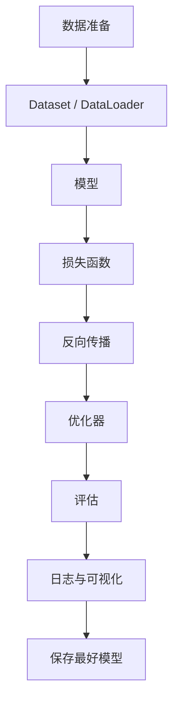

# 10 深度学习训练实践

## 1. 总览

深度学习实践不是只写模型结构。完整训练系统包含数据、模型、损失、优化、日志、评估、保存、复现和部署前检查。



## 2. 数据模块

### 2.1 职责

- 读取样本；
- 做预处理和增强；
- 返回模型需要的张量；
- 保证 train/val/test 划分清晰。

### 2.2 简单例子

```python
from torch.utils.data import Dataset

class MyDataset(Dataset):
    def __init__(self, items):
        self.items = items

    def __len__(self):
        return len(self.items)

    def __getitem__(self, idx):
        x, y = self.items[idx]
        return x, y
```

## 3. 模型模块

### 3.1 职责

- 定义从输入到输出的计算；
- 暴露可学习参数；
- 保持 forward 逻辑清晰。

### 3.2 简单例子

```python
import torch.nn as nn

class MLP(nn.Module):
    def __init__(self, input_dim, num_classes):
        super().__init__()
        self.net = nn.Sequential(
            nn.Linear(input_dim, 128),
            nn.ReLU(),
            nn.Linear(128, num_classes)
        )

    def forward(self, x):
        return self.net(x)
```

## 4. 训练循环

### 4.1 职责

- 切换训练模式；
- 前向传播；
- 计算损失；
- 反向传播；
- 更新参数；
- 记录指标。

### 4.2 简单例子

```python
model.train()
for x, y in train_loader:
    optimizer.zero_grad()
    logits = model(x)
    loss = loss_fn(logits, y)
    loss.backward()
    optimizer.step()
```

更完整的训练 epoch：

```python
def train_one_epoch(model, loader, optimizer, loss_fn, device):
    model.train()
    total_loss = 0.0
    total = 0

    for x, y in loader:
        x = x.to(device)
        y = y.to(device)

        optimizer.zero_grad(set_to_none=True)
        logits = model(x)
        loss = loss_fn(logits, y)
        loss.backward()
        optimizer.step()

        batch_size = y.size(0)
        total_loss += loss.item() * batch_size
        total += batch_size

    return total_loss / total
```

关键点：

- `model.train()` 影响 Dropout 和 BatchNorm；
- `zero_grad` 应在反向传播前调用；
- 记录 loss 时要按 batch size 加权，避免最后一个小 batch 影响平均值。

## 5. 验证循环

### 5.1 职责

- 切换评估模式；
- 关闭梯度；
- 计算验证指标；
- 不更新参数。

### 5.2 简单例子

```python
model.eval()
correct = 0
total = 0

with torch.no_grad():
    for x, y in val_loader:
        logits = model(x)
        pred = logits.argmax(dim=1)
        correct += (pred == y).sum().item()
        total += y.numel()

acc = correct / total
```

验证时不要调用：

```text
loss.backward()
optimizer.step()
```

否则验证集会泄漏进训练过程。

## 6. 实验记录

每次实验至少记录：

| 项目 | 内容 |
| --- | --- |
| 数据版本 | 数据来源、划分方式、预处理 |
| 模型 | 结构、参数量、初始化 |
| 损失函数 | 类型和关键参数 |
| 优化器 | optimizer、lr、weight_decay |
| 训练配置 | batch size、epoch、seed |
| 结果 | train/val/test 指标 |
| 备注 | 异常现象和改动原因 |

建议使用 YAML 或 JSON 保存配置：

```yaml
seed: 42
model:
  name: small_cnn
  num_classes: 10
optimizer:
  name: adamw
  lr: 0.0003
  weight_decay: 0.01
train:
  batch_size: 64
  epochs: 50
data:
  image_size: 224
  augmentation: basic
```

## 7. 调参路径

建议按优先级检查：

1. 数据和标签是否正确。
2. 输入 shape 是否正确。
3. loss 是否能在小数据集上快速下降。
4. 学习率是否合理。
5. 模型容量是否合适。
6. 正则化是否过强或过弱。
7. 数据增强是否破坏标签。
8. 指标是否符合任务目标。

## 8. Debug 技巧

### 8.1 小数据过拟合测试

用很少样本训练，模型应该能接近记住训练集。

如果做不到，可能是：

- 模型或 loss 写错；
- 标签错；
- 学习率不合适；
- 梯度没有传到参数；
- 输入预处理错误。

### 8.2 检查梯度

```python
for name, p in model.named_parameters():
    if p.grad is not None:
        print(name, p.grad.norm().item())
```

### 8.3 检查数据

```python
x, y = next(iter(train_loader))
print(x.shape, y.shape)
print(x.min(), x.max(), y[:10])
```

### 8.4 检查参数是否更新

```python
before = {n: p.detach().clone() for n, p in model.named_parameters()}

loss.backward()
optimizer.step()

for n, p in model.named_parameters():
    diff = (p.detach() - before[n]).abs().sum().item()
    print(n, diff)
```

如果所有 diff 都是 0，说明参数没有被更新，可能是梯度断了、优化器没拿到参数、学习率为 0，或误用了 `torch.no_grad()`。

## 9. 混合精度训练

混合精度用较低精度加速训练、降低显存占用。常见是 FP16/BF16。

PyTorch AMP 示例：

```python
scaler = torch.cuda.amp.GradScaler()

for x, y in train_loader:
    optimizer.zero_grad(set_to_none=True)

    with torch.cuda.amp.autocast():
        logits = model(x)
        loss = loss_fn(logits, y)

    scaler.scale(loss).backward()
    scaler.step(optimizer)
    scaler.update()
```

注意：

- 新版本 PyTorch 推荐使用更新的 `torch.amp` API，具体写法以当前版本文档为准；
- BF16 通常不需要 loss scaling；
- 混合精度可能暴露数值不稳定问题。

## 10. 保存和加载模型

### 9.1 保存参数

```python
torch.save(model.state_dict(), "model.pt")
```

### 9.2 加载参数

```python
model.load_state_dict(torch.load("model.pt"))
model.eval()
```

训练中建议保存验证集表现最好的模型，而不是最后一个 epoch 的模型。

更完整 checkpoint：

```python
torch.save({
    "model": model.state_dict(),
    "optimizer": optimizer.state_dict(),
    "epoch": epoch,
    "best_metric": best_metric,
    "config": config,
}, "checkpoint.pt")
```

恢复：

```python
ckpt = torch.load("checkpoint.pt", map_location=device)
model.load_state_dict(ckpt["model"])
optimizer.load_state_dict(ckpt["optimizer"])
```

## 11. 可复现性

常见设置：

```python
import random
import numpy as np
import torch

seed = 42
random.seed(seed)
np.random.seed(seed)
torch.manual_seed(seed)
torch.cuda.manual_seed_all(seed)
```

注意：完全可复现可能会牺牲性能，并且不同硬件、CUDA、cuDNN、框架版本仍可能带来差异。

## 12. 训练问题排查表

| 现象 | 优先检查 | 常见处理 |
| --- | --- | --- |
| 小数据也无法过拟合 | 数据、标签、loss、梯度 | 打印样本，检查梯度和参数更新 |
| 训练 loss 降，验证差 | 过拟合 | 数据增强、正则化、早停 |
| train/val 都差 | 欠拟合或训练失败 | 增大模型、训练更久、调学习率 |
| loss NaN | 学习率、输入范围、梯度爆炸 | 降 lr、梯度裁剪、检查归一化 |
| 指标异常高 | 数据泄漏 | 检查划分、重复样本、预处理 |
| GPU 利用率低 | 数据加载慢 | 增加 num_workers、缓存、预处理优化 |

## 13. 项目路线

### 项目 1：MLP 表格分类

目标：

- 熟悉 Dataset、DataLoader、MLP、cross entropy。
- 学会训练/验证/测试划分。

### 项目 2：CNN 图像分类

目标：

- 熟悉卷积、池化、数据增强。
- 理解 train/val 曲线和过拟合。

### 项目 3：RNN 文本分类

目标：

- 熟悉 tokenization、embedding、padding mask。
- 理解序列长度和隐藏状态。

### 项目 4：Transformer 小模型

目标：

- 理解 self-attention、position encoding、mask。
- 跑通一个小型文本分类或语言建模任务。

## 14. 常见误区

- 不做数据可视化，直接训练。
- 训练失败时同时改很多参数，无法定位原因。
- 只保存模型，不保存配置和代码版本。
- 用测试集调参。
- 忘记 `model.eval()`，导致验证指标波动异常。
- 不设随机种子，实验难复现。
