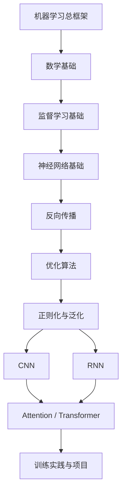

# 深度学习学习笔记

> Last researched: 2026-06-11  
> 主线参考：《机器学习》（周志华，常称“西瓜书”）的机器学习知识框架，以及《南瓜书》对西瓜书公式推导的补充。  
> 内容定位：原创学习笔记与学习路线整理，不替代原书，不复制原书大段内容。

## 学习路线总览

深度学习不是孤立知识点。更稳的路线是：先理解机器学习基本框架，再补数学、优化和神经网络基础，最后进入 CNN、RNN、Attention、Transformer 和工程实践。

## 文件阅读顺序

1. [00_learning_path.md](00_learning_path.md)：学习路线、知识地图和资料使用方式。
2. [01_math_foundations.md](01_math_foundations.md)：线性代数、微积分、概率统计、信息论基础。
3. [02_machine_learning_basics.md](02_machine_learning_basics.md)：西瓜书主线中的机器学习基本概念。
4. [03_neural_network_foundations.md](03_neural_network_foundations.md)：神经元、层、激活函数、损失函数。
5. [04_backpropagation.md](04_backpropagation.md)：计算图、链式法则、反向传播。
6. [05_optimization.md](05_optimization.md)：梯度下降、Momentum、AdaGrad、RMSProp、Adam。
7. [06_regularization_generalization.md](06_regularization_generalization.md)：过拟合、正则化、Dropout、归一化。
8. [07_cnn.md](07_cnn.md)：卷积神经网络、卷积层、池化、经典结构。
9. [08_rnn_sequence.md](08_rnn_sequence.md)：序列建模、RNN、LSTM、GRU。
10. [09_attention_transformer.md](09_attention_transformer.md)：注意力机制、Self-Attention、Transformer。
11. [10_training_practice.md](10_training_practice.md)：训练流程、调参、实验记录和项目路线。
12. [11_formula_index.md](11_formula_index.md)：常用公式索引，便于集中查阅。

## 怎样配合西瓜书和南瓜书学习

- 用西瓜书建立机器学习概念框架：模型、策略、算法、泛化、评估、监督学习、集成、聚类、降维等。
- 用南瓜书补公式细节：遇到推导卡住时，回到南瓜书看符号、矩阵形式和中间步骤。
- 用这套笔记串学习路线：先知道每个概念解决什么问题，再回原书做深入推导。
- 不建议一开始就死磕全部公式。先建立“输入是什么、输出是什么、优化什么、如何训练、如何评估”的框架。

## 核心判断标准

学深度学习不是背模型名字，而是能回答：

- 数据如何表示？
- 模型结构如何从输入得到输出？
- 损失函数衡量什么？
- 参数如何通过梯度更新？
- 为什么会过拟合？
- 网络结构的归纳偏置是什么？
- 训练不收敛时如何排查？

## 参考资料

- 周志华：《机器学习》，清华大学出版社。
- 《南瓜书》：西瓜书公式推导补充资料。
- Deep Learning Book：https://www.deeplearningbook.org/
- Dive into Deep Learning：https://d2l.ai/
- CS231n Convolutional Neural Networks for Visual Recognition：https://cs231n.github.io/
- PyTorch Tutorials：https://pytorch.org/tutorials/
