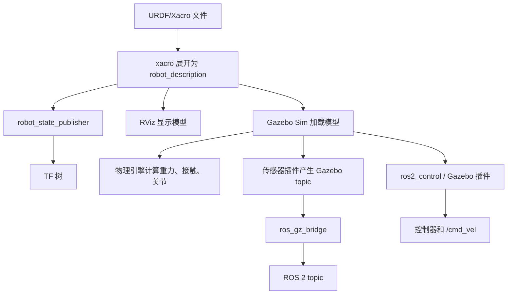

# 00 学习路线与知识地图

机器人仿真学习容易走弯路，因为它同时涉及机械结构、数学、ROS 通信、模型描述、物理引擎、控制器和传感器。新手最常见的问题是直接下载一个复杂机器人模型，然后在 Gazebo 里报错，却不知道错误来自 URDF、TF、惯性、碰撞、插件、控制器还是环境版本。

更稳的学习方式是：先理解一个最小机器人从文件到仿真的完整链路，再逐步增加复杂度。

## 本篇学习目标

学完本篇后，你应该能回答：

- 一个机器人模型从 URDF/Xacro 到 Gazebo 运行，中间经历哪些步骤；
- RViz、Gazebo Sim、robot_state_publisher、ros2_control 各自负责什么；
- 为什么学习顺序应该先模型和 TF，再物理，再控制，再传感器；
- 遇到问题时应该按什么层次排查。

## 一条完整链路

一个机器人从建模到仿真的链路通常是：

1. 设计机器人结构：有哪些刚体，哪些关节，哪些传感器。
2. 编写 URDF/Xacro：描述 link、joint、visual、collision、inertial。
3. 发布 robot_description：通常由 launch 文件调用 Xacro 生成 URDF 字符串。
4. 启动 robot_state_publisher：根据 joint state 发布 TF。
5. 在 RViz 检查模型：主要检查坐标系、外观和关节方向。
6. 放入 Gazebo Sim：通过 SDF 或 URDF spawn 到仿真世界。
7. 配置物理参数：重力、摩擦、惯性、接触、阻尼、仿真步长。
8. 配置控制接口：ros2_control、Gazebo 插件或桥接话题。
9. 配置传感器：雷达、IMU、相机、深度相机、接触传感器。
10. 验证算法：导航、SLAM、定位、路径规划、机械臂运动规划等。

对应到工具链可以这样理解：



这张图的关键点是：RViz 只帮助你看模型和 TF；Gazebo 才负责物理；ROS 2 算法通常只看 ROS topic 和 TF，不直接理解 Gazebo 内部状态。

## 建议学习阶段

### 阶段 1：只看懂坐标系

目标：

- 知道 `base_link`、`base_footprint`、`odom`、`map` 的区别。
- 知道坐标轴方向：ROS 常用右手坐标系，x 向前，y 向左，z 向上。
- 会用 `tf2_tools` 或 RViz 查看 TF 树。
- 知道 `origin xyz rpy` 的含义。

练习：

- 创建一个 `base_link` 和一个 `laser_link`。
- 用 fixed joint 把雷达放在底盘前上方。
- 在 RViz 中确认雷达坐标系位置正确。

### 阶段 2：写出最小 URDF

目标：

- 会写 `<robot>`、`<link>`、`<joint>`。
- 会给 link 添加 `<visual>`。
- 会给 joint 设置 parent、child、origin、axis。
- 会区分 fixed、continuous、revolute、prismatic。

练习：

- 写一个底盘 link。
- 加两个轮子 link。
- 用 continuous joint 连接轮子。
- 在 RViz 用 joint_state_publisher_gui 拖动关节。

### 阶段 3：补全物理模型

目标：

- 知道 visual 只负责显示。
- 知道 collision 负责碰撞检测。
- 知道 inertial 负责质量和惯性矩。
- 知道没有合理 inertial 的模型在物理仿真中可能抖动、飞走或穿模。

练习：

- 给底盘和轮子添加 collision。
- 给每个动态 link 添加 inertial。
- 尝试把质量设置得极端大或极端小，观察 Gazebo 中的异常。

### 阶段 4：改用 Xacro

目标：

- 用 property 管理尺寸和质量。
- 用 macro 复用轮子、传感器、惯性块。
- 用 include 拆分模型文件。
- 会用命令把 xacro 展开为 urdf。

练习：

- 把重复的左右轮 link/joint 改成一个 `wheel` 宏。
- 把尺寸和颜色抽到顶部 property。
- 生成 URDF 后检查 XML 是否符合预期。

### 阶段 5：进入 Gazebo Sim

目标：

- 知道 Gazebo Sim 主要使用 SDF 描述 world 和 model。
- 知道 URDF 可以被加载，但复杂仿真参数经常需要 SDF/Gazebo 扩展。
- 会启动空世界、加载模型、观察 topic。
- 知道 Gazebo Classic 和 Gazebo Sim 的区别。

练习：

- 启动 Gazebo Harmonic 空世界。
- spawn 一个小车 URDF。
- 调整地面摩擦和质量，看模型运动变化。

### 阶段 6：控制和传感器

目标：

- 知道 ros2_control 的 hardware interface、controller manager、controller。
- 知道差速底盘一般需要左右轮速度控制。
- 知道传感器数据在 Gazebo 内部话题和 ROS 2 话题之间可能需要 `ros_gz_bridge`。
- 知道仿真时间 `/clock` 和 `use_sim_time` 的意义。

练习：

- 用命令发布速度，让小车移动。
- 加一个 2D LiDAR，在 RViz 中看到 LaserScan。
- 加一个 IMU，观察角速度和线加速度。

## 新手常见误区

### 误区 1：把 RViz 当成仿真器

RViz 是可视化工具，不是物理仿真器。RViz 可以显示机器人模型、TF、点云、激光、地图和规划结果，但它不会计算真实碰撞、重力和动力学。

Gazebo Sim 才是仿真器。它会计算重力、接触、摩擦、关节运动、传感器数据和插件逻辑。

### 误区 2：只写 visual，不写 collision 和 inertial

只写 visual 的模型可以在 RViz 里显示，但放进 Gazebo 后通常不适合做物理仿真。Gazebo 需要 collision 判断接触，需要 inertial 计算动力学。

### 误区 3：把复杂 mesh 直接当 collision

视觉 mesh 可以很精细，但碰撞 mesh 应尽量简单。复杂碰撞网格会降低仿真速度，还可能导致接触计算不稳定。常见做法是视觉用 `.dae`、`.stl` 或 `.obj`，碰撞用 box、cylinder、sphere 或简化 mesh。

### 误区 4：不检查单位

ROS、URDF、Gazebo 通常使用 SI 单位：

- 长度：米 m
- 质量：千克 kg
- 时间：秒 s
- 角度：弧度 rad
- 力：牛 N
- 扭矩：N*m

如果把毫米当米，机器人会放大 1000 倍；如果把角度当弧度，关节方向和范围会完全错。

### 误区 5：混用过期教程

网络上大量教程基于 ROS 1 + Gazebo Classic。它们仍有参考价值，但命令、包名、插件名称、launch 写法、桥接方式可能已经不同。新项目建议以 ROS 2 + Gazebo Sim 为主线。

## 最小学习项目

建议你创建一个 `my_robot_description` 包，最后形成如下结构：

```text
my_robot_description/
  package.xml
  CMakeLists.txt
  urdf/
    my_robot.urdf.xacro
    materials.xacro
    inertial_macros.xacro
  meshes/
  rviz/
    display.rviz
  launch/
    display.launch.py
    gazebo.launch.py
```

做到下面这些就算打通基础：

- `colcon build` 无错误；
- `ros2 launch my_robot_description display.launch.py` 能在 RViz 看见模型；
- TF 树无断裂；
- Xacro 可以正常展开；
- 每个动态 link 有合理质量和惯性；
- Gazebo 中模型不会飞走、抖动或陷进地面；
- 轮子能被控制器驱动；
- 传感器数据能被 ROS 2 节点读取。

## 阶段验收表

| 阶段 | 最小产物 | 验收命令或现象 | 常见失败原因 |
| --- | --- | --- | --- |
| 坐标系 | `base_link`、`laser_link` | `ros2 run tf2_tools view_frames` 能看到连通 TF | parent/child 拼错、fixed frame 选错 |
| URDF | 一个可显示小车 | `check_urdf /tmp/robot.urdf` 通过 | XML 标签、mesh 路径、joint limit |
| Xacro | 参数化模型 | `ros2 run xacro xacro ...` 能展开 | property 未定义、宏参数缺失 |
| 物理 | collision + inertial | Gazebo 中不飞、不抖、不穿地 | 惯性为 0、质量极端、碰撞重叠 |
| 控制 | 轮子可响应速度 | `/cmd_vel` 后小车按预期移动 | 控制器未 active、joint 名称不匹配 |
| 传感器 | `/scan`、`/imu` 等话题 | `ros2 topic hz /scan` 有频率 | bridge 未配、frame 不连通、Gazebo 暂停 |

## 复习问题

1. 为什么一个模型在 RViz 正常显示，不代表它能在 Gazebo 稳定仿真？
2. `robot_state_publisher` 根据什么发布 TF？
3. `visual`、`collision`、`inertial` 分别服务于谁？
4. 为什么传感器数据从 Gazebo 到 ROS 2 往往需要桥接？
5. 如果小车不动，你会按什么顺序检查？

